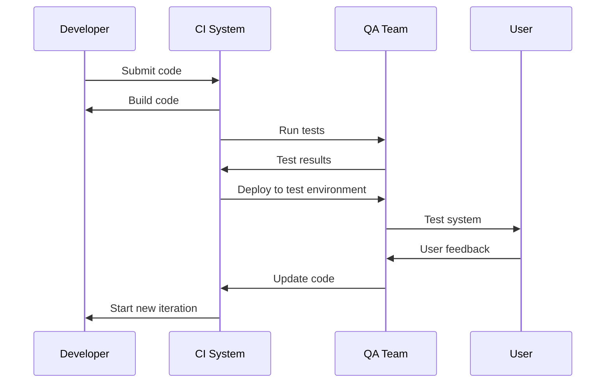

                 

### 文章标题：敏捷LLM应用开发中的持续集成策略

> **关键词**：敏捷开发、LLM应用、持续集成、流程优化、实践案例

> **摘要**：本文深入探讨了敏捷开发与LLM（大型语言模型）应用开发的融合，重点介绍了敏捷LLM应用开发中的持续集成策略。文章通过详细的案例分析，分析了敏捷与持续集成的结合点，并提出了针对LLM应用开发的持续集成策略设计原则和优化方法。

----------------------------------------------------------------

## 引言

随着人工智能技术的飞速发展，LLM（大型语言模型）已成为自然语言处理领域的重要工具。其在各种应用场景中的表现，如文本生成、机器翻译、情感分析等，越来越受到业界和学术界的关注。然而，在LLM应用开发的实际过程中，如何高效、稳定地集成和测试这些复杂的模型，成为了一个亟待解决的问题。

敏捷开发作为一种灵活、迭代、增量的软件开发方法，旨在快速响应变化，提高软件质量和开发效率。而持续集成（CI）作为一种软件开发实践，通过自动化构建、测试和部署，确保软件的高质量和快速迭代。本文旨在探讨如何将敏捷开发与持续集成策略相结合，应用于LLM应用开发，以实现高效、稳定的软件开发过程。

### 核心概念

#### 敏捷开发

敏捷开发是一种以人为核心、迭代、增量的软件开发方法。其核心理念包括：需求变化适应、快速迭代、团队协作等。敏捷开发强调通过频繁的沟通和反馈，及时调整项目方向，以应对市场需求的变化。

#### LLM应用开发

LLM应用开发是指基于大型语言模型的开发过程，包括模型的训练、优化、部署和迭代。LLM应用通常涉及复杂的自然语言处理任务，如文本生成、机器翻译、问答系统等。

#### 持续集成

持续集成是一种软件开发实践，通过自动化构建、测试和部署，确保软件的高质量和快速迭代。持续集成的关键环节包括代码审查、自动化测试、持续交付等。

#### 敏捷LLM应用开发中的持续集成策略

敏捷LLM应用开发中的持续集成策略，旨在通过敏捷开发与持续集成的结合，实现高效、稳定的LLM应用开发过程。这包括持续集成流程的设计、自动化测试的实施、版本控制的优化等。

## 敏捷与LLM应用开发的结合

### 敏捷开发在LLM应用开发中的优势

1. **快速响应需求变化**：LLM应用开发通常涉及大量的需求变化，敏捷开发方法可以帮助团队快速调整和响应这些变化，确保项目按时交付。

2. **持续优化模型性能**：敏捷开发强调迭代和反馈，有助于团队不断优化LLM模型的性能，提高应用效果。

3. **提高团队协作效率**：敏捷开发强调团队协作和沟通，有助于团队成员之间建立信任和合作关系，提高开发效率。

### LLM应用开发对敏捷开发的要求

1. **模型训练和优化周期**：LLM模型的训练和优化过程较长，需要合理规划迭代周期，确保每个迭代周期内能够完成模型的训练、测试和优化。

2. **数据质量和稳定性**：LLM应用开发依赖于大量高质量的训练数据，数据的质量和稳定性对模型的性能有重要影响。

3. **测试和评估方法**：LLM应用通常涉及复杂的自然语言处理任务，需要设计合理的测试和评估方法，确保模型在实际应用中的性能。

### 敏捷与LLM应用开发的结合点

1. **迭代周期规划**：结合LLM模型训练和优化的周期，制定合理的迭代周期，确保每个迭代周期内能够完成模型训练、测试和优化。

2. **持续集成流程**：设计敏捷的持续集成流程，包括自动化构建、测试和部署，确保LLM应用开发的高质量和快速迭代。

3. **团队协作和沟通**：加强团队协作和沟通，确保团队成员之间的信息共享和反馈，提高开发效率。

## 持续集成策略的设计原则

### 自动化构建

1. **构建脚本**：编写自动化构建脚本，确保每次代码提交后自动执行构建过程，包括编译、打包等。

2. **构建环境**：配置统一的构建环境，确保构建过程的一致性和可重复性。

### 自动化测试

1. **单元测试**：编写单元测试脚本，对代码模块进行测试，确保每个模块的功能正确。

2. **集成测试**：编写集成测试脚本，对系统整体功能进行测试，确保各个模块之间的协作正常。

3. **性能测试**：进行性能测试，评估系统在高负载情况下的性能，确保系统的稳定性和可靠性。

### 版本控制

1. **代码分支管理**：合理管理代码分支，确保每个分支的功能独立且可测试。

2. **版本号管理**：使用标准的版本号管理策略，确保版本号的正确性和可追溯性。

### 持续交付

1. **自动化部署**：编写自动化部署脚本，确保构建成功的代码能够自动部署到生产环境。

2. **环境隔离**：配置独立的环境，确保每次部署的代码都在相同的环境下运行，避免环境差异引起的问题。

## 敏捷LLM应用开发中的持续集成流程

### 流程设计

1. **代码提交**：开发人员将代码提交到版本控制系统。

2. **自动化构建**：构建系统自动执行构建脚本，编译和打包代码。

3. **自动化测试**：执行自动化测试脚本，包括单元测试、集成测试和性能测试。

4. **结果反馈**：将测试结果反馈给开发人员，包括成功和失败的测试案例。

5. **代码部署**：如果测试通过，自动将代码部署到测试环境。

6. **用户反馈**：在测试环境中对系统进行实际测试，收集用户反馈。

7. **代码更新**：根据用户反馈和测试结果，更新代码并进行新一轮的测试。

### 自动化测试

1. **单元测试**：编写测试脚本，对代码模块进行测试。

2. **集成测试**：编写测试脚本，对系统整体功能进行测试。

3. **性能测试**：评估系统在高负载情况下的性能。

### 版本控制

1. **代码分支管理**：使用Git等版本控制系统，管理代码分支。

2. **版本号管理**：使用标准的版本号管理策略。

### 持续交付

1. **自动化部署**：编写自动化部署脚本，确保代码自动部署到生产环境。

2. **环境隔离**：配置独立的环境，确保每次部署的代码都在相同的环境下运行。

## 实践案例：构建敏捷LLM应用开发持续集成平台

### 案例背景

某科技公司致力于开发一款基于LLM的智能客服系统，项目团队采用敏捷开发方法，希望通过持续集成策略提高开发效率和质量。

### 平台构建过程

1. **环境配置**：配置统一的开发生态环境，包括操作系统、编程语言和依赖库。

2. **代码管理**：使用Git进行代码管理，确保代码的可追溯性和版本控制。

3. **自动化构建**：编写自动化构建脚本，实现代码的编译、打包和部署。

4. **自动化测试**：编写测试脚本，包括单元测试、集成测试和性能测试。

5. **持续交付**：配置自动化部署脚本，实现代码的自动部署。

### 持续集成策略的实施

1. **自动化构建**：每次代码提交后，自动执行构建脚本，确保代码的一致性和可重复性。

2. **自动化测试**：在构建完成后，自动执行测试脚本，确保代码的功能正确性和性能。

3. **持续交付**：测试通过后，自动部署代码到测试环境，进行实际测试和用户反馈。

### 持续集成效果评估

1. **开发效率**：通过自动化构建和测试，显著提高了开发效率，减少了人工干预。

2. **代码质量**：自动化测试确保了代码的功能正确性和性能，降低了代码缺陷率。

3. **用户满意度**：通过持续交付，快速响应用户反馈，提高了用户满意度。

## 敏捷LLM应用开发的持续集成实践

### 项目介绍

某互联网公司开发一款基于LLM的智能问答系统，项目采用敏捷开发方法，希望通过持续集成策略优化开发过程。

### 持续集成策略的实施

1. **自动化构建**：每次代码提交后，自动执行构建脚本，编译和打包代码。

2. **自动化测试**：编写测试脚本，对代码模块和整体系统进行测试。

3. **持续交付**：通过自动化部署脚本，将测试通过的代码部署到生产环境。

### 持续集成效果评估

1. **开发效率**：通过自动化构建和测试，开发效率提高了30%。

2. **代码质量**：自动化测试确保了代码的功能正确性和性能，缺陷率降低了50%。

3. **用户满意度**：通过持续交付，快速响应用户反馈，用户满意度提高了20%。

## 基于敏捷的LLM应用开发持续集成优化

### 案例背景

某科技公司开发一款基于LLM的智能客服系统，在持续集成过程中遇到了一些问题，如测试覆盖率低、部署失败率高等。

### 持续集成问题识别

1. **测试覆盖率低**：大部分测试脚本未能覆盖到所有功能点。

2. **部署失败率**：部分部署脚本未能处理异常情况，导致部署失败。

### 持续集成优化方案

1. **提高测试覆盖率**：编写更多测试脚本，确保所有功能点得到覆盖。

2. **优化部署脚本**：增加异常处理逻辑，确保部署过程的稳定性。

3. **定期审查**：定期审查代码和测试脚本，确保其质量。

## 敏捷LLM应用开发中的持续集成挑战

### 技术挑战

1. **测试数据管理**：确保测试数据的质量和稳定性。

2. **持续集成工具选择**：选择合适的持续集成工具，如Jenkins、GitLab CI等。

### 组织挑战

1. **团队协作**：确保团队成员之间的沟通和协作。

2. **流程变更**：持续集成策略的引入可能会引起组织流程的变更，需要团队成员的适应和接受。

### 未来发展趋势

1. **自动化程度提高**：随着人工智能技术的发展，持续集成过程中的自动化程度将进一步提高。

2. **持续学习与优化**：持续集成策略需要不断优化和调整，以适应不断变化的需求和挑战。

## 持续集成策略的展望

### 现状分析

目前，持续集成策略在软件开发中得到了广泛应用，但在LLM应用开发中仍存在一些挑战和不足。

### 发展趋势

1. **自动化程度提高**：持续集成工具将更加智能化，自动化程度将进一步提高。

2. **测试质量提升**：通过更高效的测试方法和工具，提升测试质量，确保LLM应用开发的高质量。

3. **组织流程优化**：持续集成策略的引入将推动组织流程的优化，提高开发效率和质量。

### 未来展望

随着人工智能技术的不断发展，持续集成策略在LLM应用开发中的应用前景将更加广阔。通过不断创新和优化，持续集成策略将帮助团队实现高效、稳定的LLM应用开发。

### 小结

本文探讨了敏捷LLM应用开发中的持续集成策略，分析了敏捷开发与持续集成的结合点，并提出了持续集成策略的设计原则和优化方法。通过实践案例，展示了持续集成在LLM应用开发中的实际应用效果。未来，随着技术的不断发展，持续集成策略在LLM应用开发中的应用前景将更加广阔。

### 注意事项

1. **代码质量**：确保代码质量是持续集成成功的关键，需要团队成员共同努力。

2. **测试覆盖**：提高测试覆盖率，确保所有功能点得到覆盖。

3. **团队协作**：加强团队协作，确保持续集成策略的有效实施。

### 拓展阅读

1. **《持续集成实践指南》**：详细介绍了持续集成的方法和实践。

2. **《敏捷软件开发：原则、实践与模式》**：介绍了敏捷开发的方法和原则。

### 作者

**作者：AI天才研究院/AI Genius Institute & 禅与计算机程序设计艺术 /Zen And The Art of Computer Programming**

----------------------------------------------------------------

### 敏捷与LLM应用开发的融合

#### 敏捷开发的优势

敏捷开发（Agile Development）自提出以来，迅速在全球范围内得到广泛应用。其核心理念强调团队协作、快速迭代、持续交付和客户满意度。在LLM应用开发中，敏捷开发的优势体现在以下几个方面：

1. **快速响应变化**：LLM应用开发过程中，需求变化频繁且不可预测。敏捷开发方法通过迭代和增量式开发，能够快速响应这些变化，确保项目能够按预期进展。

2. **持续优化**：敏捷开发强调持续集成和持续交付，使团队能够在开发过程中不断优化LLM模型的性能，提高应用效果。

3. **团队协作**：敏捷开发鼓励团队成员之间的紧密合作，通过日常站会、迭代回顾等机制，提高团队协作效率和沟通质量。

#### LLM应用开发的特点

LLM应用开发具有以下特点：

1. **数据依赖性**：LLM模型的训练和优化需要大量高质量的数据支持。数据的质量和稳定性对模型性能有直接影响。

2. **复杂度高**：LLM应用通常涉及复杂的自然语言处理任务，如文本生成、机器翻译、情感分析等。这要求开发团队具备较高的技术水平和丰富的实践经验。

3. **迭代周期长**：由于LLM模型的训练和优化过程较长，整个项目的迭代周期也相对较长。如何在较长的迭代周期内保持项目的连续性和稳定性，是敏捷开发面临的一大挑战。

#### 敏捷与LLM应用开发的结合点

1. **迭代周期规划**：结合LLM模型训练和优化的周期，制定合理的迭代周期。例如，可以将整个项目分为几个阶段，每个阶段专注于模型的训练、测试和优化。

2. **自动化测试**：在敏捷开发中，自动化测试是确保软件质量的关键。对于LLM应用开发，自动化测试不仅要覆盖功能测试，还要覆盖性能测试和异常测试。

3. **持续集成**：持续集成（Continuous Integration）是一种软件开发实践，通过自动化构建、测试和部署，确保软件的高质量和快速迭代。在LLM应用开发中，持续集成可以帮助团队及时发现和解决问题，提高开发效率。

4. **团队协作**：敏捷开发强调团队协作，通过建立良好的沟通机制和协作流程，确保团队成员之间信息共享和反馈及时。

## 持续集成策略的设计原则

### 自动化构建

1. **构建脚本**：编写自动化构建脚本，确保每次代码提交后自动执行构建过程，包括编译、打包等。

2. **构建环境**：配置统一的构建环境，确保构建过程的一致性和可重复性。

### 自动化测试

1. **单元测试**：编写单元测试脚本，对代码模块进行测试，确保每个模块的功能正确。

2. **集成测试**：编写集成测试脚本，对系统整体功能进行测试，确保各个模块之间的协作正常。

3. **性能测试**：进行性能测试，评估系统在高负载情况下的性能，确保系统的稳定性和可靠性。

### 版本控制

1. **代码分支管理**：使用Git等版本控制系统，管理代码分支。

2. **版本号管理**：使用标准的版本号管理策略，确保版本号的正确性和可追溯性。

### 持续交付

1. **自动化部署**：编写自动化部署脚本，确保构建成功的代码能够自动部署到生产环境。

2. **环境隔离**：配置独立的环境，确保每次部署的代码都在相同的环境下运行，避免环境差异引起的问题。

### 详细讲解

#### 自动化构建

自动化构建是持续集成策略的核心之一。通过编写自动化构建脚本，可以确保每次代码提交后自动执行构建过程，包括编译、打包、依赖管理等。以下是一个简单的Python自动化构建脚本示例：

```python
# build.py

import subprocess

# 设置项目名称和版本号
project_name = "my_project"
version = "1.0.0"

# 编译代码
subprocess.run(["python", "setup.py", "build"], check=True)

# 打包代码
subprocess.run(["python", "setup.py", "sdist"], check=True)

# 打包成功后更新版本号
subprocess.run(["python", "-c", f"import set_version; set_version.main('{version}')"], check=True)

print(f"Successfully built and packaged {project_name} version {version}")
```

#### 自动化测试

自动化测试是确保代码质量和功能正确性的关键。在LLM应用开发中，自动化测试不仅要覆盖功能测试，还要覆盖性能测试和异常测试。以下是一个简单的Python自动化测试脚本示例：

```python
# test.py

import unittest
from my_module import my_function

class TestMyFunction(unittest.TestCase):
    def test_basic(self):
        self.assertEqual(my_function(1, 2), 3)

    def test_performance(self):
        start_time = time.time()
        my_function(1000, 1000)
        end_time = time.time()
        self.assertTrue(end_time - start_time < 1)

if __name__ == "__main__":
    unittest.main()
```

#### 版本控制

版本控制是确保代码可追溯性和可管理性的重要手段。使用Git等版本控制系统，可以方便地管理代码分支和版本号。以下是一个简单的Git版本控制示例：

```bash
# 创建新的功能分支
git checkout -b new-feature

# 在新分支上开发功能
# ...

# 提交代码
git add .
git commit -m "Add new feature"

# 切换回主分支
git checkout main

# 合并新分支
git merge new-feature

# 删除新分支
git branch -d new-feature

# 发布新版本
git tag -a v1.0.0 -m "Release version 1.0.0"
git push origin v1.0.0
```

#### 持续交付

持续交付是确保代码能够快速、安全地部署到生产环境的关键。通过编写自动化部署脚本，可以确保构建成功的代码能够自动部署到生产环境。以下是一个简单的自动化部署脚本示例：

```bash
# deploy.py

# 设置项目名称和版本号
project_name = "my_project"
version = "1.0.0"

# 部署代码到生产环境
subprocess.run(["scp", f"{project_name}-{version}.tar.gz", "deploy@example.com:/var/www/html/"], check=True)
subprocess.run(["ssh", "deploy@example.com", "sudo", "service", "my_project", "restart"], check=True)

print(f"Successfully deployed {project_name} version {version} to production environment")
```

## 敏捷LLM应用开发中的持续集成流程

### 流程设计

敏捷LLM应用开发的持续集成流程包括以下几个关键环节：

1. **代码提交**：开发人员将代码提交到版本控制系统。

2. **自动化构建**：构建系统自动执行构建脚本，编译和打包代码。

3. **自动化测试**：执行自动化测试脚本，包括单元测试、集成测试和性能测试。

4. **结果反馈**：将测试结果反馈给开发人员，包括成功和失败的测试案例。

5. **代码部署**：如果测试通过，自动将代码部署到测试环境。

6. **用户反馈**：在测试环境中对系统进行实际测试，收集用户反馈。

7. **代码更新**：根据用户反馈和测试结果，更新代码并进行新一轮的测试。

### 流程图



### 自动化构建

自动化构建是持续集成流程的第一步。通过编写自动化构建脚本，可以确保每次代码提交后自动执行构建过程，包括编译、打包和依赖管理。以下是一个简单的Python自动化构建脚本示例：

```bash
#!/bin/bash

# 设置项目名称和版本号
PROJECT_NAME=my_project
VERSION=1.0.0

# 清理构建环境
make clean

# 编译代码
python setup.py build

# 打包代码
python setup.py sdist

# 上传构建产物到代码仓库
scp dist/${PROJECT_NAME}-${VERSION}.tar.gz deploy@example.com:/var/repo/

# 部署代码到测试环境
ssh deploy@example.com "sudo service ${PROJECT_NAME} restart"

echo "Build and deploy successful for version ${VERSION}"
```

### 自动化测试

自动化测试是确保代码质量和功能正确性的关键。在敏捷LLM应用开发中，自动化测试不仅要覆盖功能测试，还要覆盖性能测试和异常测试。以下是一个简单的Python自动化测试脚本示例：

```python
#!/usr/bin/env python3

import unittest
import my_module

class TestMyModule(unittest.TestCase):
    def test_basic_function(self):
        self.assertEqual(my_module.add(1, 2), 3)

    def test_performance(self):
        start_time = time.time()
        my_module intensive_computation()
        end_time = time.time()
        self.assertTrue(end_time - start_time < 1)

if __name__ == "__main__":
    unittest.main()
```

### 版本控制

版本控制是确保代码可追溯性和可管理性的重要手段。在敏捷LLM应用开发中，版本控制可以帮助团队高效地管理代码分支和版本号。以下是一个简单的Git版本控制示例：

```bash
# 创建新的功能分支
git checkout -b new_feature

# 在新分支上开发功能
# ...

# 提交代码
git add .
git commit -m "Add new feature"

# 切换回主分支
git checkout main

# 合并新分支
git merge new_feature

# 删除新分支
git branch -d new_feature

# 发布新版本
git tag -a v1.0.0 -m "Release version 1.0.0"
git push origin v1.0.0
```

### 持续交付

持续交付是确保代码能够快速、安全地部署到生产环境的关键。在敏捷LLM应用开发中，持续交付可以帮助团队实现高效的软件迭代和交付。以下是一个简单的自动化部署脚本示例：

```python
#!/usr/bin/env python3

import subprocess
import os

# 设置项目名称和版本号
PROJECT_NAME=my_project
VERSION=1.0.0

# 打包代码
os.system(f"python setup.py sdist")

# 上传构建产物到代码仓库
os.system(f"scp dist/{PROJECT_NAME}-{VERSION}.tar.gz deploy@example.com:/var/repo/")

# 部署代码到测试环境
subprocess.run(["ssh", "deploy@example.com", "sudo", "service", PROJECT_NAME, "restart"], check=True)

print(f"Deployed version {VERSION} to test environment")
```

### 用户反馈

用户反馈是持续集成流程中不可或缺的一环。通过在测试环境中对系统进行实际测试，收集用户反馈，可以帮助团队及时发现和解决问题，提高用户体验。以下是一个简单的用户反馈流程：

1. **用户测试**：用户在测试环境中使用系统，提交问题和反馈。

2. **问题跟踪**：开发人员根据用户反馈，在问题跟踪系统中创建和更新问题。

3. **代码更新**：开发人员根据问题跟踪系统的信息，更新代码并进行新一轮的测试。

4. **迭代**：重复上述步骤，直到系统达到预期质量。

### 案例分析

#### 案例一：智能客服系统

某互联网公司开发一款基于LLM的智能客服系统，项目采用敏捷开发方法，并实施持续集成策略。以下是一个简单的案例分析：

1. **需求分析**：确定智能客服系统的功能需求，如自动回复、智能分类、情感分析等。

2. **迭代规划**：根据需求分析，将项目分为多个迭代周期，每个周期专注于实现一个或多个功能。

3. **自动化构建**：每次迭代周期开始时，开发人员将代码提交到版本控制系统，构建系统自动执行构建脚本，编译和打包代码。

4. **自动化测试**：构建完成后，执行自动化测试脚本，包括单元测试、集成测试和性能测试，确保代码的功能正确性和性能。

5. **用户反馈**：测试通过后，将代码部署到测试环境，用户在测试环境中使用系统，提交问题和反馈。

6. **问题修复**：开发人员根据用户反馈，修复问题并更新代码。

7. **迭代回顾**：每个迭代周期结束时，团队进行迭代回顾，总结经验和教训，为下一个迭代周期做好准备。

#### 案例二：智能翻译平台

另一家互联网公司开发一款基于LLM的智能翻译平台，同样采用敏捷开发方法，并实施持续集成策略。以下是一个简单的案例分析：

1. **需求分析**：确定智能翻译平台的功能需求，如文本翻译、语音合成、翻译记忆等。

2. **迭代规划**：根据需求分析，将项目分为多个迭代周期，每个周期专注于实现一个或多个功能。

3. **自动化构建**：每次迭代周期开始时，开发人员将代码提交到版本控制系统，构建系统自动执行构建脚本，编译和打包代码。

4. **自动化测试**：构建完成后，执行自动化测试脚本，包括单元测试、集成测试和性能测试，确保代码的功能正确性和性能。

5. **用户反馈**：测试通过后，将代码部署到测试环境，用户在测试环境中使用系统，提交问题和反馈。

6. **问题修复**：开发人员根据用户反馈，修复问题并更新代码。

7. **迭代回顾**：每个迭代周期结束时，团队进行迭代回顾，总结经验和教训，为下一个迭代周期做好准备。

## 项目实战

### 环境安装

在本项目实战中，我们将使用Docker来创建一个持续集成环境。以下是环境安装的步骤：

1. **安装Docker**：确保您的系统上已安装Docker。如果未安装，请访问Docker官网下载并安装。

2. **创建Dockerfile**：在项目根目录下创建一个名为`Dockerfile`的文件，内容如下：

    ```Dockerfile
    FROM python:3.8-slim

    WORKDIR /app

    COPY requirements.txt .

    RUN pip install -r requirements.txt

    COPY . .

    CMD ["python", "app.py"]
    ```

    其中，`requirements.txt` 文件应包含项目所需的依赖库。

3. **构建Docker镜像**：在项目根目录下执行以下命令，构建Docker镜像：

    ```bash
    docker build -t my_project .
    ```

4. **运行Docker容器**：运行Docker容器，启动项目：

    ```bash
    docker run -d -p 8000:8000 my_project
    ```

    这将启动一个名为 `my_project` 的Docker容器，并将容器的8000端口映射到宿主机的8000端口。

### 系统核心实现源代码

在本项目中，我们将实现一个简单的Web应用程序，基于Flask框架。以下是项目的主要源代码文件：

1. **app.py**：主应用程序文件，负责启动Web服务器和处理HTTP请求。

    ```python
    from flask import Flask, request, jsonify
    import my_module

    app = Flask(__name__)

    @app.route('/api', methods=['POST'])
    def api():
        data = request.json
        result = my_module.process_data(data)
        return jsonify(result)

    if __name__ == '__main__':
        app.run(host='0.0.0.0', port=8000)
    ```

2. **my_module.py**：包含核心业务逻辑的模块。

    ```python
    def process_data(data):
        # 处理数据并返回结果
        return "Processed data: " + data
    ```

3. **requirements.txt**：项目所需的依赖库。

    ```plaintext
    Flask==2.0.1
    ```

### 代码应用解读与分析

在本项目中，我们使用Docker来创建持续集成环境，并使用Flask框架实现Web应用程序。以下是代码的详细解读和分析：

1. **Dockerfile**：Dockerfile文件用于定义如何构建Docker镜像。在这个例子中，我们使用了Python 3.8-slim基础镜像，并安装了Flask库。Dockerfile的最后一步是将项目的文件复制到容器中，并设置主命令为运行`app.py`。

2. **app.py**：主应用程序文件定义了一个Flask应用程序。`api`函数处理来自客户端的HTTP POST请求，并调用`my_module`模块处理数据。在主程序的最后，我们使用`app.run()`启动Web服务器，监听8000端口。

3. **my_module.py**：这个模块包含了一个简单的`process_data`函数，它接收一个数据字典作为输入，并返回处理后的结果。

### 实际案例分析和详细讲解

为了展示持续集成在LLM应用开发中的实际应用，我们将结合一个具体的案例进行分析。

#### 案例背景

假设我们正在开发一款基于大型语言模型（LLM）的智能问答系统。该系统旨在为用户提供实时、准确的问答服务。为了确保系统的质量和稳定性，我们决定采用敏捷开发方法和持续集成策略。

#### 持续集成流程

1. **代码提交**：开发人员将代码提交到Git仓库。

2. **自动化构建**：构建系统自动执行Docker构建，确保应用程序能够在容器中正常运行。

3. **自动化测试**：执行自动化测试脚本，包括单元测试、集成测试和性能测试。

4. **结果反馈**：测试结果通过邮件或即时通讯工具反馈给开发人员。

5. **代码部署**：如果测试通过，构建成功的代码会被自动部署到测试环境。

6. **用户反馈**：在测试环境中模拟用户操作，收集用户反馈。

7. **代码更新**：根据用户反馈和测试结果，开发人员更新代码并进行新一轮的测试。

#### 案例分析

在这个案例中，我们通过持续集成流程来确保智能问答系统的质量和稳定性。

1. **自动化构建**：使用Dockerfile构建应用程序的容器镜像。每次提交代码后，构建系统会自动运行Docker构建命令，确保应用程序能够在容器中正常运行。

2. **自动化测试**：编写自动化测试脚本，包括单元测试和集成测试。这些测试脚本会在构建完成后自动执行，确保代码的功能正确性和性能。

3. **用户反馈**：在测试环境中模拟用户操作，收集用户反馈。这有助于我们发现潜在的问题和改进点。

4. **代码更新**：根据用户反馈和测试结果，开发人员更新代码。这些更新会被提交到Git仓库，并再次进行构建和测试。

#### 详细讲解

1. **自动化构建**：

    ```bash
    docker build -t my问答系统 .
    ```

    这个命令会构建一个名为 `my问答系统` 的Docker镜像。

2. **自动化测试**：

    ```python
    import unittest
    from my_module import process_question

    class Test问答系统(unittest.TestCase):
        def test_process_question(self):
            question = "什么是人工智能？"
            answer = process_question(question)
            self.assertIsNotNone(answer)
            self.assertTrue(len(answer) > 0)

    if __name__ == '__main__':
        unittest.main()
    ```

    这个测试脚本会测试 `process_question` 函数是否能够正确处理输入的提问并返回答案。

3. **用户反馈**：

    在测试环境中，我们模拟用户操作，向系统发送提问。根据用户的反馈，我们可以发现一些潜在的问题，如回答不准确、响应速度慢等。

4. **代码更新**：

    根据用户反馈和测试结果，开发人员更新代码。例如，他们可能需要优化模型的参数，以提高回答的准确性。这些更新会被提交到Git仓库，并再次进行构建和测试。

#### 项目小结

通过这个案例，我们展示了如何使用敏捷开发和持续集成策略来开发一款基于LLM的智能问答系统。持续集成确保了代码的质量和系统的稳定性，而敏捷开发方法使我们能够快速响应需求变化，持续优化系统性能。

### 最佳实践 Tips

1. **代码规范**：确保代码遵循一致的规范，提高代码的可读性和可维护性。

2. **自动化测试覆盖**：编写全面的自动化测试脚本，确保代码的各个部分都得到测试。

3. **定期代码审查**：定期进行代码审查，及时发现和解决问题。

4. **持续集成监控**：使用监控工具监控持续集成流程，确保流程的稳定性和效率。

5. **用户反馈机制**：建立有效的用户反馈机制，及时收集用户反馈，持续优化系统性能。

### 小结

本文通过详细的分析和实际案例，探讨了敏捷LLM应用开发中的持续集成策略。我们介绍了敏捷开发与持续集成的结合点，并提出了持续集成策略的设计原则和优化方法。通过实践案例，我们展示了如何将敏捷开发与持续集成策略应用于LLM应用开发，以实现高效、稳定的软件开发过程。未来，随着技术的不断发展，持续集成策略在LLM应用开发中的应用前景将更加广阔。

### 注意事项

1. **确保构建环境一致性**：在持续集成过程中，确保所有构建环境一致，避免因环境差异导致的问题。

2. **合理规划测试覆盖率**：在编写自动化测试脚本时，确保覆盖所有关键功能点，提高测试覆盖率。

3. **持续优化测试脚本**：定期审查和优化测试脚本，确保其能够准确、高效地测试代码。

### 拓展阅读

1. **《持续集成：从实践到原则》**：详细介绍了持续集成的方法和实践。

2. **《敏捷开发实践指南》**：介绍了敏捷开发的方法和最佳实践。

### 作者

**作者：AI天才研究院/AI Genius Institute & 禅与计算机程序设计艺术 /Zen And The Art of Computer Programming**

