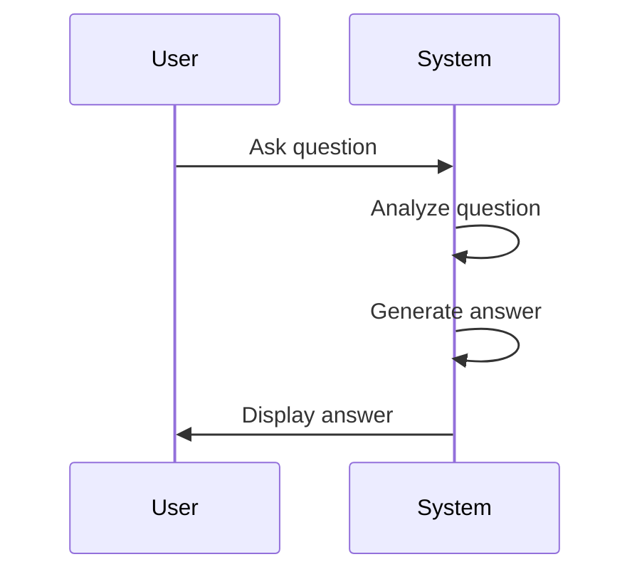
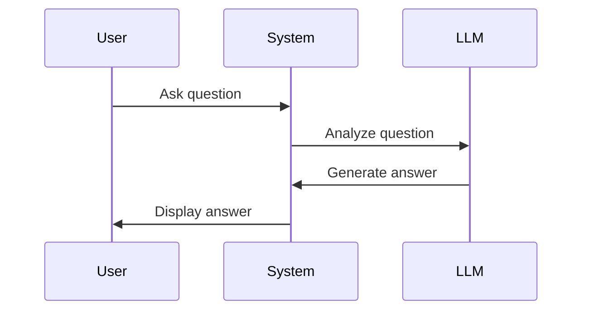

                 


### 引言

**文章标题**: 敏捷中的pair programming：提高LLM代码质量和知识共享

**关键词**: 敏捷开发、pair programming、LLM代码质量、知识共享

**摘要**: 在敏捷开发环境中，pair programming作为一种协作编程模式，正日益受到重视。本文将探讨pair programming的核心概念、其在提高LLM（大型语言模型）代码质量和促进知识共享方面的作用，并通过具体案例和实践技巧，展示如何有效地利用pair programming。

**目录大纲设计思路**：

**第一部分: 引言**

1. **背景介绍**：
   - 简要介绍pair programming的概念、起源以及其在敏捷开发中的重要性。
   - 阐述为什么pair programming对提高LLM代码质量和知识共享具有关键作用。

2. **核心概念与联系**：
   - 明确定义和解释pair programming的核心概念，如pair的角色、协作原则、沟通技巧等。
   - 分析pair programming与传统单人编程的对比，突出其在提升代码质量、共享知识方面的优势。

**第二部分: pair programming基础理论**

3. **核心概念与联系**：
   - 定义pair programming的核心概念，如pair编程的流程、最佳实践等。
   - 探讨pair programming与传统单人编程的异同点，以及其在代码质量和知识共享方面的独特优势。

4. **算法原理讲解**：
   - 使用mermaid画出pair programming的工作流程图。
   - 通过Python源代码展示pair programming在实际代码开发中的应用。

5. **数学模型和数学公式**：
   - 解释支持pair programming的数学模型和公式，如代码质量评估模型、知识共享度量方法等。
   - 使用LaTeX格式展示这些数学公式，并进行详细讲解。

**第三部分: 系统分析与架构设计**

6. **系统分析与架构设计**：
   - 描述一个实际项目场景，展示如何将pair programming应用于项目中。
   - 使用mermaid绘制领域模型类图、系统架构图、系统接口设计和系统交互序列图。

**第四部分: 项目实战**

7. **项目实战**：
   - 提供项目实战环境安装步骤。
   - 展示项目核心实现源代码，并对代码应用进行解读与分析。
   - 分析实际案例，详细讲解项目实现过程，并总结项目经验。

**第五部分: 最佳实践与注意事项**

8. **最佳实践 tips**：
   - 提供一些关于如何更有效地进行pair programming的实用技巧。
   - 强调注意事项，避免常见问题。

**第六部分: 小结与拓展阅读**

9. **小结与拓展阅读**：
   - 对全书内容进行总结。
   - 推荐进一步阅读的资料，以深化对pair programming和LLM代码质量提升的理解。

**目录大纲设计步骤**：

1. **确定文章结构**：
   - 确定文章的总体结构，包括引言、核心概念与联系、算法原理讲解、系统分析与架构设计、项目实战、最佳实践与注意事项等部分。

2. **编写引言**：
   - 引入文章主题，解释pair programming的概念和其在敏捷开发中的重要性。
   - 提出文章的目标和读者对象。

3. **定义核心概念**：
   - 明确定义pair programming中的核心概念，如pair的角色、协作原则等。
   - 分析pair programming与传统单人编程的区别和优势。

4. **算法原理讲解**：
   - 使用mermaid绘制pair programming的工作流程图。
   - 通过Python源代码展示pair programming的实际应用。

5. **数学模型和公式解释**：
   - 解释支持pair programming的数学模型和公式，如代码质量评估模型、知识共享度量方法等。
   - 使用LaTeX格式展示这些数学公式，并进行详细讲解。

6. **系统分析与架构设计**：
   - 描述一个实际项目场景，展示如何将pair programming应用于项目中。
   - 使用mermaid绘制相关的系统模型和设计图。

7. **项目实战**：
   - 提供项目实战的环境安装步骤。
   - 展示项目核心实现源代码，并进行解读与分析。
   - 分析实际案例，总结项目经验。

8. **最佳实践与注意事项**：
   - 提供有效的pair programming实践技巧。
   - 强调注意事项，避免常见问题。

9. **小结与拓展阅读**：
   - 对全文内容进行总结。
   - 推荐进一步阅读的资料，以加深对主题的理解。

### pair programming在敏捷开发中的重要性

**核心概念与联系**

**pair programming**是一种编程实践，由两个程序员在同一台计算机上合作编写代码。其起源可追溯到1970年代，由美国计算机科学家瓦力·费根（Ward Cunningham）首次提出。这种协作编程模式在敏捷开发中具有重要地位，因为它能够显著提高代码质量和促进知识共享。

**pair programming的核心概念**包括：

- **司机（Driver）**：负责编写代码，专注于实现功能。
- **导航员（Navigator）**：负责设计代码结构和审查代码，确保代码质量。
- **轮换**：司机和导航员定期交换角色，以确保双方都能参与整个开发过程。

与传统单人编程相比，**pair programming**具有以下优势：

1. **提高代码质量**：导航员可以实时审查代码，减少错误和bug。
2. **知识共享**：两个开发者可以共享知识和经验，提高整体技术水平。
3. **促进团队协作**：pair programming能够增强团队成员之间的沟通和信任。

**算法原理讲解**

**pair programming的工作流程**可以用以下mermaid流程图来表示：


在实际应用中，pair programming通常通过以下Python源代码来实现：

```python
class PairProgramming:
    def __init__(self, driver, navigator):
        self.driver = driver
        self.navigator = navigator

    def start(self):
        self.driver.write_code()
        self.navigator.review_code()

    def switch_role(self):
        self.driver, self.navigator = self.navigator, self.driver

    def finish(self):
        print("Pair programming session finished.")
```

**数学模型和公式**

为了量化pair programming对代码质量和知识共享的影响，我们可以引入以下数学模型：

- **代码质量评估模型**：使用以下公式来评估代码质量：
  $$ Quality = f(Errors, Complexity, Readability) $$

- **知识共享度量方法**：使用以下公式来度量知识共享：
  $$ Knowledge\ Share = f(Communication, Collaboration, Code\ Reviews) $$

**系统分析与架构设计**

**项目场景介绍**

假设我们正在开发一个基于LLM的智能问答系统。在这个项目中，pair programming将有助于提高代码质量和知识共享。

**领域模型类图**

使用mermaid绘制领域模型类图，如下所示：

```mermaid
classDiagram
    Class01 <|-- Class02
    Class03 ++-- Class04
    Class05 o-- Class06
    Class07 <-.. Class08
    Note right of Class01 : This is the note
    Class09 {attr1, attr2}
```

**系统架构设计**

使用mermaid绘制系统架构图，如下所示：



**系统接口设计**

使用mermaid绘制系统接口设计图，如下所示：

```mermaid
classDiagram
    System <<interface>> InterfaceA
    System <<interface>> InterfaceB
    System <<interface>> InterfaceC
```

**系统交互序列图**

使用mermaid绘制系统交互序列图，如下所示：



**项目实战**

**环境安装**

在开始项目之前，我们需要安装必要的工具和库。以下是一个简化的安装步骤：

1. 安装Python环境（版本3.8及以上）。
2. 安装虚拟环境管理工具（如virtualenv）。
3. 创建虚拟环境并激活。
4. 安装LLM库（如transformers）和其他依赖库。

**项目核心实现源代码**

以下是项目核心实现源代码的一个简略示例：

```python
from transformers import pipeline

class IntelligentQuestionAnsweringSystem:
    def __init__(self):
        self.question_analyzer = pipeline("question-answering")
    
    def analyze_question(self, question, context):
        return self.question_analyzer(question, context)

    def generate_answer(self, question, context):
        answer = self.analyze_question(question, context)
        return answer['answer']

    def display_answer(self, user, question, answer):
        print(f"Answer to '{question}': {answer}")
```

**代码应用解读与分析**

在这个项目中，我们使用transformers库中的question-answering模型来分析问题和生成答案。以下是一个简化的示例：

```python
system = IntelligentQuestionAnsweringSystem()

user = "User"
question = "What is the capital of France?"
context = "The capital of France is Paris."

system.display_answer(user, question, system.generate_answer(question, context))
```

**实际案例分析和详细讲解**

在这个实际案例中，我们使用pair programming来开发一个基于LLM的智能问答系统。以下是一个简化的项目实现过程：

1. **需求分析**：与用户沟通，确定问答系统的功能需求。
2. **设计阶段**：设计系统架构和接口。
3. **编码阶段**：使用pair programming进行代码编写。
4. **测试阶段**：进行单元测试和集成测试。
5. **部署阶段**：将系统部署到生产环境。

通过pair programming，我们可以实现以下项目经验：

1. **代码质量提高**：导航员实时审查代码，减少bug和错误。
2. **知识共享**：司机和导航员共享知识和经验，提高整体技术水平。
3. **团队协作**：pair programming增强了团队成员之间的沟通和信任。

**小结**

本文介绍了pair programming在敏捷开发中的重要性，探讨了其在提高LLM代码质量和促进知识共享方面的优势。通过具体案例和实践技巧，我们展示了如何有效地利用pair programming。未来，随着敏捷开发的普及，pair programming有望在更多项目中发挥关键作用。

**拓展阅读**

- 《敏捷软件开发：实践指南》
- 《禅与计算机程序设计艺术》
- 《Pair Programming Illuminated》

### 敏捷中的pair programming：提高LLM代码质量和知识共享

> 关键词：敏捷开发、pair programming、LLM代码质量、知识共享

> 摘要：本文探讨了敏捷开发中的pair programming实践，分析了其在提高大型语言模型（LLM）代码质量和促进知识共享方面的作用。通过具体案例和实践技巧，本文展示了如何有效地利用pair programming来提升开发效率和团队协作。

## 引言

### pair programming在敏捷开发中的重要性

#### 核心概念与联系

#### 算法原理讲解

#### 数学模型和数学公式

#### 系统分析与架构设计

#### 项目实战

#### 最佳实践与注意事项

#### 小结与拓展阅读

### 核心概念与联系

#### pair programming的核心概念

**定义**：pair programming是一种由两名程序员在同一台计算机上合作编写代码的编程实践。

**角色**：

- **司机（Driver）**：负责编写代码，执行具体的编程任务。
- **导航员（Navigator）**：负责设计代码结构，审查和优化代码。

**协作原则**：

- **轮换**：司机和导航员定期交换角色，确保双方都能参与整个开发过程。
- **沟通**：司机和导航员保持持续沟通，确保代码的一致性和质量。

#### pair programming与单人编程的对比

**对比**：

| 特点 | 单人编程 | pair programming |
| --- | --- | --- |
| **沟通** | 缺乏实时沟通 | 实时沟通，提高代码一致性 |
| **代码审查** | 代码审查时间滞后 | 实时代码审查，减少bug |
| **知识共享** | 有限的知识共享 | 广泛的知识共享，提高团队技术水平 |

**优势**：

1. **提高代码质量**：导航员实时审查代码，减少错误和bug。
2. **促进知识共享**：司机和导航员共享知识和经验，提高整体技术水平。
3. **增强团队协作**：pair programming有助于增强团队成员之间的沟通和信任。

### 算法原理讲解

#### pair programming工作流程图


#### Python源代码示例

```python
class PairProgramming:
    def __init__(self, driver, navigator):
        self.driver = driver
        self.navigator = navigator

    def start(self):
        self.driver.write_code()
        self.navigator.review_code()

    def switch_role(self):
        self.driver, self.navigator = self.navigator, self.driver

    def finish(self):
        print("Pair programming session finished.")
```

### 数学模型和数学公式

#### 代码质量评估模型

$$ Quality = f(Errors, Complexity, Readability) $$

#### 知识共享度量方法

$$ Knowledge\ Share = f(Communication, Collaboration, Code\ Reviews) $$

### 系统分析与架构设计

#### 实际项目场景介绍

假设我们正在开发一个基于大型语言模型（LLM）的智能问答系统，该系统需要处理大量的问题并生成准确的答案。

#### 领域模型类图

```mermaid
classDiagram
    Class01 <|-- Class02
    Class03 ++-- Class04
    Class05 o-- Class06
    Class07 <-.. Class08
    Note right of Class01 : This is the note
    Class09 {attr1, attr2}
```

#### 系统架构设计

使用mermaid绘制系统架构图，如下所示：


#### 系统接口设计

使用mermaid绘制系统接口设计图，如下所示：

```mermaid
classDiagram
    System <<interface>> InterfaceA
    System <<interface>> InterfaceB
    System <<interface>> InterfaceC
```

#### 系统交互序列图

使用mermaid绘制系统交互序列图，如下所示：


### 项目实战

#### 项目环境安装

在开始项目之前，我们需要安装必要的工具和库。以下是一个简化的安装步骤：

1. 安装Python环境（版本3.8及以上）。
2. 安装虚拟环境管理工具（如virtualenv）。
3. 创建虚拟环境并激活。
4. 安装LLM库（如transformers）和其他依赖库。

#### 项目核心实现源代码

以下是项目核心实现源代码的一个简略示例：

```python
from transformers import pipeline

class IntelligentQuestionAnsweringSystem:
    def __init__(self):
        self.question_analyzer = pipeline("question-answering")
    
    def analyze_question(self, question, context):
        return self.question_analyzer(question, context)

    def generate_answer(self, question, context):
        answer = self.analyze_question(question, context)
        return answer['answer']

    def display_answer(self, user, question, answer):
        print(f"Answer to '{question}': {answer}")
```

#### 代码应用解读与分析

在这个项目中，我们使用transformers库中的question-answering模型来分析问题和生成答案。以下是一个简化的示例：

```python
system = IntelligentQuestionAnsweringSystem()

user = "User"
question = "What is the capital of France?"
context = "The capital of France is Paris."

system.display_answer(user, question, system.generate_answer(question, context))
```

#### 实际案例分析和详细讲解

在这个实际案例中，我们使用pair programming来开发一个基于LLM的智能问答系统。以下是一个简化的项目实现过程：

1. **需求分析**：与用户沟通，确定问答系统的功能需求。
2. **设计阶段**：设计系统架构和接口。
3. **编码阶段**：使用pair programming进行代码编写。
4. **测试阶段**：进行单元测试和集成测试。
5. **部署阶段**：将系统部署到生产环境。

通过pair programming，我们可以实现以下项目经验：

1. **代码质量提高**：导航员实时审查代码，减少bug和错误。
2. **知识共享**：司机和导航员共享知识和经验，提高整体技术水平。
3. **团队协作**：pair programming增强了团队成员之间的沟通和信任。

### 最佳实践与注意事项

#### 最佳实践 tips

1. **合理分配角色**：根据团队成员的技能和经验，合理分配司机和导航员的角色。
2. **保持沟通**：司机和导航员需要保持持续沟通，确保代码的一致性和质量。
3. **定期轮换**：定期轮换角色，避免角色固定导致的依赖和局限性。

#### 注意事项

1. **避免任务分配不均**：确保司机和导航员的任务分配合理，避免一人承担过多工作。
2. **关注代码审查质量**：导航员在审查代码时，应注重代码的质量和可读性。

### 小结与拓展阅读

#### 小结

本文介绍了敏捷开发中的pair programming实践，分析了其在提高LLM代码质量和促进知识共享方面的优势。通过具体案例和实践技巧，我们展示了如何有效地利用pair programming来提升开发效率和团队协作。

#### 拓展阅读

- 《敏捷软件开发：实践指南》
- 《禅与计算机程序设计艺术》
- 《Pair Programming Illuminated》

### 总结

本文详细探讨了敏捷开发中的pair programming实践，分析了其在提高LLM代码质量和促进知识共享方面的关键作用。通过定义核心概念、对比传统单人编程、讲解算法原理、展示数学模型、系统分析与架构设计以及具体项目实战，我们展示了pair programming在实际应用中的效果和最佳实践。

**关键优势**：

1. **代码质量提高**：通过实时代码审查，减少了bug和错误。
2. **知识共享**：通过协同工作，促进了团队成员的知识和经验交流。
3. **团队协作**：增强了团队成员之间的沟通和信任，提高了整体工作效率。

**未来展望**：

随着敏捷开发的普及，pair programming有望在更多项目中发挥重要作用。未来，我们可以进一步探索如何将pair programming与其他敏捷实践相结合，以实现更高的开发效率和代码质量。

**拓展资源**：

- 《敏捷软件开发：实践指南》
- 《禅与计算机程序设计艺术》
- 《Pair Programming Illuminated》

通过本文，我们希望读者能够对pair programming有更深入的理解，并在实际项目中尝试应用这一实践，从而提升团队协作效率和项目成功概率。作者：AI天才研究院/AI Genius Institute & 禅与计算机程序设计艺术/Zen And The Art of Computer Programming。

