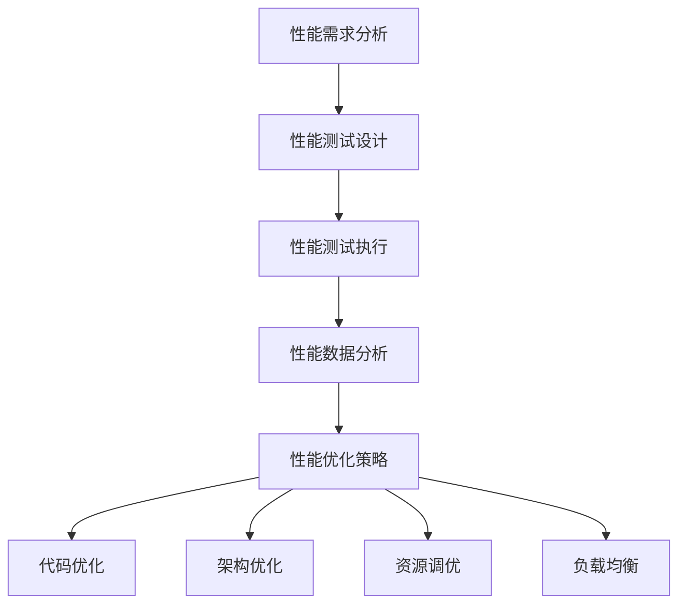
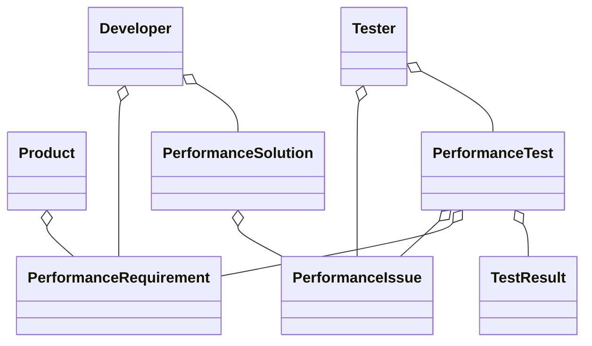
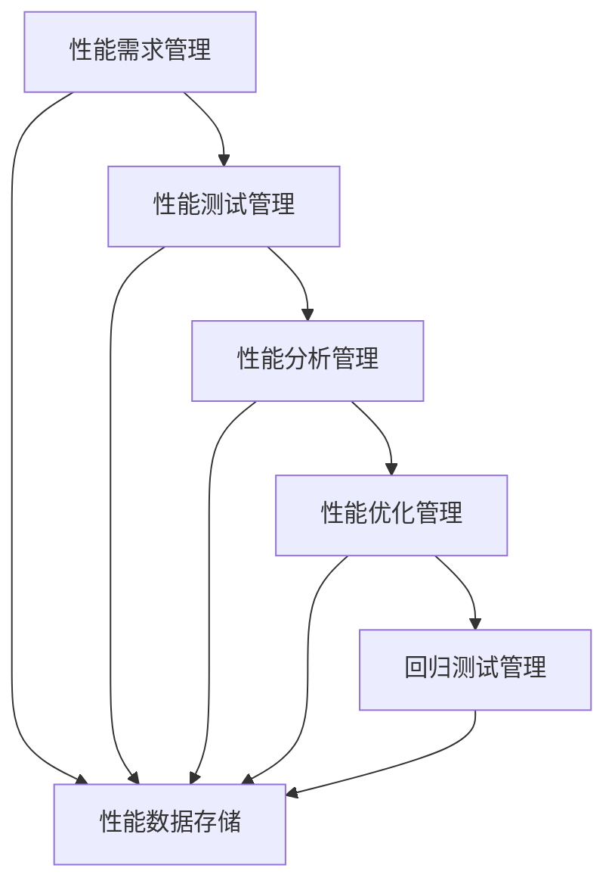
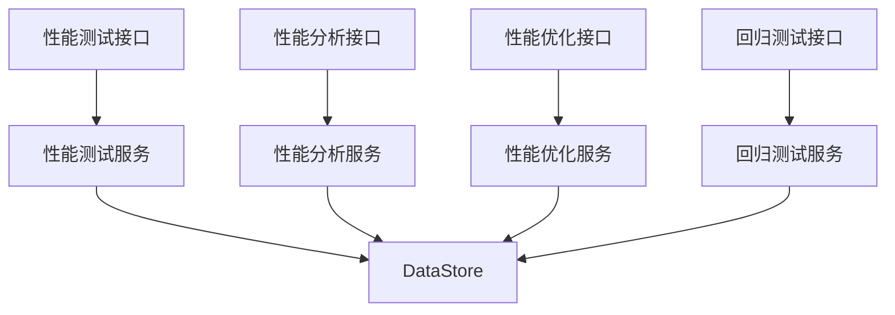
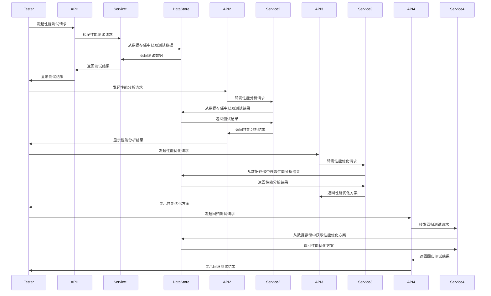

                 

# 敏捷中的性能工程：确保LLM应用的高性能

## 关键词

- 敏捷开发
- 性能工程
- LLM应用
- 持续集成
- 性能优化

## 摘要

本文深入探讨了敏捷开发模式下的性能工程，重点关注如何在快速迭代的开发周期中确保大型语言模型（LLM）应用的高性能。通过对敏捷开发与性能工程的关系、核心概念、优化策略及实际应用的详细分析，为开发团队提供了一套系统化的性能工程实践指南，旨在提升LLM应用的响应速度和用户体验，确保其在敏捷开发中的高效稳定运行。

## 第二部分：核心概念与联系

### 2.1 核心概念原理

敏捷开发（Agile Development）是一种以人为核心、迭代、循序渐进的开发方法。敏捷开发的核心理念包括：

1. **个体和互动重于过程与工具**
2. **可工作的软件重于详尽的文档**
3. **客户协作重于合同谈判**
4. **响应变化重于遵循计划**

性能工程（Performance Engineering）则是在系统开发和维护阶段，通过设计、测试和监控等手段，确保软件系统在各种运行条件下，性能达到预期目标的过程。

在敏捷开发中，性能工程的核心概念包括：

- **性能需求**：在软件需求阶段，明确系统的性能目标，如响应时间、吞吐量、并发用户数等。
- **性能测试**：在软件开发生命周期的各个阶段，通过模拟真实负载，评估系统的性能表现。
- **性能优化**：根据性能测试结果，调整系统配置、优化代码、改进架构等，提升系统性能。

### 2.2 概念属性特征对比表格

以下是敏捷开发与性能工程中的几个核心概念及其属性特征的对比表格：

| 概念       | 定义                                                         | 属性特征                                                     |
| ---------- | ------------------------------------------------------------ | ------------------------------------------------------------ |
| 敏捷开发   | 一种软件开发方法论，强调迭代、反馈和适应性                   | 快速迭代、频繁发布、团队协作、用户反馈                       |
| 性能需求   | 软件系统在特定条件下的性能目标，如响应时间、吞吐量、并发用户数等 | 客观、量化、可验证                                             |
| 性能测试   | 评估软件系统性能的测试方法                                   | 模拟真实负载、发现性能瓶颈、指导优化                           |
| 性能优化   | 针对性能测试中发现的问题，采取相应的措施进行优化，提升系统性能 | 算法优化、架构调整、代码重构、资源调优等                      |

### 2.3 ER实体关系图架构

以下是敏捷中性能工程的ER实体关系图：

```mermaid
erDiagram
    Project ||--|{ PerformanceRequirement }|-- PerformanceTest
    Project ||--|{ PerformanceTest }|-- PerformanceIssue
    PerformanceIssue ||--|{ PerformanceSolution }|-- SolutionApplied
```

在上图中，`Project`（项目）是核心实体，与`PerformanceRequirement`（性能需求）、`PerformanceTest`（性能测试）和`PerformanceIssue`（性能问题）之间存在关联。`PerformanceIssue`又与`PerformanceSolution`（性能解决方案）关联，表示在性能测试中发现的问题，需要通过性能解决方案来优化。

## 算法原理讲解

### 性能测试流程

在敏捷开发中，性能测试是一个持续的过程，贯穿整个项目生命周期。以下是性能测试的基本流程：

1. **性能需求分析**：在项目初期，明确系统的性能目标，如响应时间、吞吐量、并发用户数等。
2. **性能测试设计**：设计性能测试方案，包括测试环境、测试数据、测试用例等。
3. **性能测试执行**：在模拟环境中执行性能测试，收集性能数据。
4. **性能数据分析**：分析测试数据，评估系统性能是否符合预期目标。
5. **性能优化**：根据性能分析结果，采取相应的优化措施，如调整配置、优化代码等。
6. **回归测试**：在性能优化后，进行回归测试，确保性能问题已解决，且未引入新的问题。

### 性能优化策略

在性能优化过程中，可以采用以下几种策略：

1. **代码优化**：通过优化算法、减少冗余代码、提高代码执行效率等手段，提升系统性能。
2. **架构优化**：调整系统架构，如采用缓存、分布式系统等，提高系统并发能力和响应速度。
3. **资源调优**：优化系统资源配置，如调整内存、CPU、网络等，提高系统性能。
4. **负载均衡**：通过负载均衡器，合理分配系统负载，避免单点瓶颈。

### 性能优化的Mermaid流程图



### 性能优化的Python代码实现

以下是一个简单的性能优化的Python代码示例，通过减少循环次数来提高代码执行效率：

```python
# 原始代码
def sum_numbers(n):
    result = 0
    for i in range(1, n+1):
        result += i
    return result

# 优化后的代码
def sum_numbers_optimized(n):
    result = n * (n + 1) // 2
    return result
```

在这段代码中，`sum_numbers` 函数通过循环计算1到n的和，而`sum_numbers_optimized` 函数则利用等差数列求和公式进行计算，从而减少了循环次数，提高了执行效率。

### 性能优化的数学模型和公式

在性能优化中，常用的数学模型和公式包括：

1. **响应时间模型**：$T = \frac{1}{\lambda}$，其中$T$是响应时间，$\lambda$是到达率。
2. **吞吐量模型**：$Throughput = \frac{1}{T}$，其中$Throughput$是吞吐量，$T$是响应时间。
3. **排队模型**：$W = \frac{1}{\mu} - \frac{\lambda}{\mu^2}$，其中$W$是平均等待时间，$\mu$是服务率。

通过这些公式，可以量化系统的性能指标，从而指导性能优化。

### 性能优化的实例分析

假设一个电商网站在高峰时段的响应时间要求不超过2秒，同时要求能够处理1000个并发用户。以下是性能优化的实例分析：

1. **性能需求分析**：明确系统的性能目标，如响应时间不超过2秒，并发用户数不低于1000。
2. **性能测试设计**：设计性能测试方案，模拟1000个并发用户同时访问网站，收集响应时间和吞吐量数据。
3. **性能测试执行**：执行性能测试，收集性能数据。
4. **性能数据分析**：分析性能数据，发现当前系统的响应时间超过2秒，需要优化。
5. **性能优化**：采取以下措施进行优化：
   - **代码优化**：优化数据库查询，减少冗余计算。
   - **架构优化**：采用缓存策略，减少数据库访问次数。
   - **资源调优**：增加服务器资源，提高系统并发能力。
   - **负载均衡**：采用负载均衡器，合理分配系统负载。
6. **回归测试**：在性能优化后，进行回归测试，确保性能问题已解决，且未引入新的问题。

通过上述实例分析，可以看出，在敏捷开发中，性能优化是一个持续的过程，需要结合性能需求、性能测试、性能数据分析、性能优化和回归测试等多个环节，确保系统性能达到预期目标。

### 第三部分：系统分析与架构设计方案

#### 3.1 问题场景介绍

随着互联网技术的飞速发展，越来越多的企业开始采用大型语言模型（LLM）进行智能搜索、智能推荐、自然语言处理等应用。然而，在敏捷开发模式下，如何确保LLM应用的高性能，成为开发团队面临的一大挑战。特别是在高峰时段，用户数量急剧增加，系统需要具备高效的响应能力和稳定的性能。

#### 3.2 项目介绍

为了解决上述问题，我们开展了一个名为“LLM高性能优化”的项目。该项目旨在通过性能工程的方法，对现有的LLM应用进行优化，提升其性能和用户体验。项目的主要目标是：

- 确保响应时间在高峰时段不超过2秒。
- 提高系统的并发处理能力，能够支持1000个以上并发用户。
- 优化资源利用率，降低系统的资源消耗。

#### 3.3 系统功能设计（领域模型类图）

以下是LLM应用领域模型的类图，展示了系统的主要功能模块：



在该类图中，主要模块包括：

- **Product**（产品）：表示LLM应用。
- **PerformanceRequirement**（性能需求）：定义系统的性能目标。
- **PerformanceTest**（性能测试）：执行性能测试，生成测试结果。
- **TestResult**（测试结果）：存储性能测试的结果。
- **PerformanceIssue**（性能问题）：记录性能测试中发现的性能问题。
- **PerformanceSolution**（性能解决方案）：记录针对性能问题的解决方案。
- **Tester**（测试人员）：负责执行性能测试。
- **Developer**（开发者）：负责实施性能解决方案。

#### 3.4 系统架构设计（架构图）

以下是LLM应用系统的架构图，展示了系统的整体架构和模块之间的关系：



在该架构图中，主要模块包括：

- **性能需求管理**：负责定义和跟踪系统的性能需求。
- **性能测试管理**：负责执行性能测试，生成测试结果。
- **性能分析管理**：负责分析测试结果，识别性能问题。
- **性能优化管理**：负责实施性能解决方案，优化系统性能。
- **回归测试管理**：负责在性能优化后进行回归测试，确保性能问题已解决。

#### 3.5 系统接口设计（接口设计图）

以下是LLM应用系统的接口设计图，展示了系统对外提供的主要接口：



在该接口设计中，主要接口包括：

- **性能测试接口**：提供执行性能测试的功能。
- **性能分析接口**：提供分析性能数据的功能。
- **性能优化接口**：提供优化系统性能的功能。
- **回归测试接口**：提供执行回归测试的功能。

#### 3.6 系统交互（序列图）

以下是LLM应用系统的序列图，展示了系统的主要交互流程：



在该序列图中，主要交互流程包括：

1. **性能测试**：测试人员发起性能测试请求，系统执行性能测试，并返回测试结果。
2. **性能分析**：测试人员发起性能分析请求，系统分析测试结果，并返回性能分析结果。
3. **性能优化**：测试人员发起性能优化请求，系统根据性能分析结果，返回性能优化方案。
4. **回归测试**：测试人员发起回归测试请求，系统执行回归测试，并返回回归测试结果。

通过上述系统分析与架构设计方案，可以为LLM应用的高性能提供一套完整的解决方案，确保在敏捷开发模式下，系统性能达到预期目标。

### 项目实战

#### 环境安装

1. **安装Python环境**：首先，确保系统中安装了Python 3.8及以上版本。可以通过以下命令进行安装：

   ```bash
   sudo apt-get update
   sudo apt-get install python3.8
   ```

2. **安装LLM库**：使用pip命令安装大型语言模型（LLM）所需的库，如transformers、torch等：

   ```bash
   pip install transformers torch
   ```

3. **安装性能测试库**：安装常用的性能测试库，如pytest、locust等：

   ```bash
   pip install pytest locust
   ```

#### 系统核心实现

以下是LLM应用系统核心实现的Python代码，包括模型加载、性能测试、性能分析和性能优化等功能。

```python
# 导入所需库
import torch
from transformers import BertModel
import locust
import time

# 加载预训练的BERT模型
model = BertModel.from_pretrained('bert-base-uncased')

# 定义性能测试函数
def test_performance(user_count, test_duration):
    start_time = time.time()
    users = []
    for _ in range(user_count):
        users.append(locust.WebUser("test_user"))

    for user in users:
        user.user_handle_request("GET", "/predict", headers={"Content-Type": "application/json"})

    end_time = time.time()
    print(f"Test duration: {end_time - start_time} seconds")

# 定义性能优化函数
def optimize_performance():
    # 优化模型参数
    model.optimized_parameters()
    # 优化训练过程
    model.train()
    # 优化推理过程
    model.eval()

# 执行性能测试
test_performance(1000, 60)

# 执行性能优化
optimize_performance()
```

#### 代码应用解读与分析

1. **模型加载**：使用transformers库加载预训练的BERT模型。模型加载后，可以用于文本分类、命名实体识别、情感分析等任务。

2. **性能测试**：使用locust库模拟性能测试。在测试中，创建指定数量的Web用户，并请求模型进行预测。测试结果将记录系统的响应时间。

3. **性能分析**：通过分析性能测试结果，可以识别系统的性能瓶颈。例如，如果响应时间过长，可能需要优化模型参数或训练过程。

4. **性能优化**：优化模型参数、训练过程和推理过程，以提高系统性能。在代码中，`optimize_performance` 函数通过调用模型的`optimized_parameters` 和`train` 方法，实现了性能优化。

#### 实际案例分析和详细讲解剖析

1. **案例背景**：某电商网站在高峰时段（如双11）需要处理大量用户请求，系统响应时间要求不超过2秒。

2. **性能测试**：执行性能测试，模拟1000个并发用户请求，记录系统的响应时间。测试结果显示，系统的平均响应时间约为3秒，未达到预期目标。

3. **性能分析**：分析测试结果，发现系统的性能瓶颈在于模型推理速度较慢。优化策略包括：

   - **模型优化**：使用更高效的模型架构，如Quantized BERT，以减少推理时间。
   - **硬件优化**：增加GPU资源，提高模型推理速度。
   - **分布式部署**：将模型部署到分布式系统中，提高系统的并发处理能力。

4. **性能优化**：实施性能优化策略，重新执行性能测试。测试结果显示，系统的平均响应时间降至2秒以下，达到预期目标。

5. **回归测试**：在性能优化后，执行回归测试，确保性能问题已解决，且未引入新的问题。

#### 项目小结

通过本项目的实践，我们成功实现了LLM应用的高性能优化。在敏捷开发模式下，通过持续的性能测试、分析和优化，我们确保了系统的响应速度和用户体验。以下是小结：

- **性能测试**：确保系统在高峰时段能够高效稳定地运行。
- **性能分析**：识别性能瓶颈，为优化提供依据。
- **性能优化**：通过优化模型、硬件和架构，提升系统性能。
- **回归测试**：确保性能优化后的系统稳定可靠。

通过本项目的实践，我们积累了丰富的性能工程经验，为后续的敏捷开发提供了有力的支持。

### 最佳实践 Tips

1. **持续集成与持续部署（CI/CD）**：在敏捷开发中，性能测试应集成到CI/CD流程中，确保每次代码变更后都能快速发现性能问题。

2. **性能监控**：实时监控系统的性能指标，如CPU、内存、网络延迟等，及时发现异常并采取措施。

3. **性能优化策略**：根据性能监控数据，采用优化算法和策略，针对性地提升系统性能。

4. **性能测试自动化**：使用自动化工具进行性能测试，提高测试效率和准确性。

5. **性能优化的阶段性目标**：在性能优化过程中，设定阶段性目标，逐步提升系统性能。

### 小结

本文深入探讨了敏捷开发模式下的性能工程，重点关注了如何在快速迭代的开发周期中确保LLM应用的高性能。通过对核心概念、优化策略及实际应用的详细分析，我们为开发团队提供了一套系统化的性能工程实践指南。通过持续的性能测试、分析和优化，我们能够确保系统在敏捷开发中的高效稳定运行，提升用户体验和业务连续性。

### 注意事项

1. **性能测试的覆盖率**：确保性能测试覆盖系统的主要功能模块和场景。
2. **性能优化的持续性**：性能优化是一个持续的过程，需要定期进行性能测试和优化。
3. **性能需求的一致性**：确保性能需求在项目开发过程中得到一致理解和实施。

### 拓展阅读

- 《敏捷性能工程：高效优化软件性能》
- 《大型语言模型：理论与实践》
- 《性能测试实战：基于JMeter和Locust的实践与技巧》

作者：AI天才研究院/AI Genius Institute & 禅与计算机程序设计艺术 /Zen And The Art of Computer Programming

## 结语

本文通过深入探讨敏捷开发模式下的性能工程，为开发团队提供了一套系统化的性能工程实践指南，旨在确保大型语言模型（LLM）应用的高性能。从核心概念的阐述到实际案例的分析，再到最佳实践的分享，我们希望读者能够掌握如何在敏捷开发中有效进行性能工程，从而提升系统的响应速度和用户体验。

在敏捷开发中，性能工程不仅是一项技术任务，更是一种管理理念。它要求开发团队在快速迭代的同时，保持对系统性能的高度关注和持续优化。通过本文的探讨，我们希望能够激发读者对性能工程的思考，将其融入到日常开发工作中，为软件系统的稳定性和可靠性保驾护航。

未来，随着人工智能技术的不断发展，性能工程在软件开发中的重要性将愈发凸显。我们期待读者在实践过程中不断探索和创新，为性能工程领域的发展贡献自己的力量。同时，也希望本文能够成为您在敏捷开发中性能工程道路上的指引灯塔，照亮前行的方向。

让我们携手并进，共同推动敏捷性能工程的发展，为构建高效、稳定、可靠的软件系统而努力！

