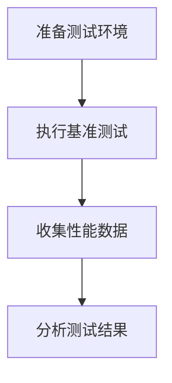
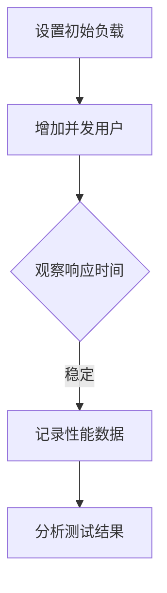
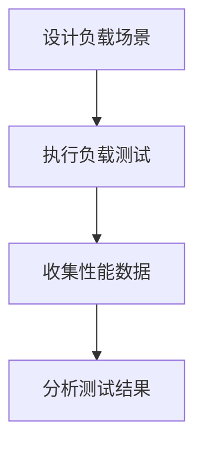
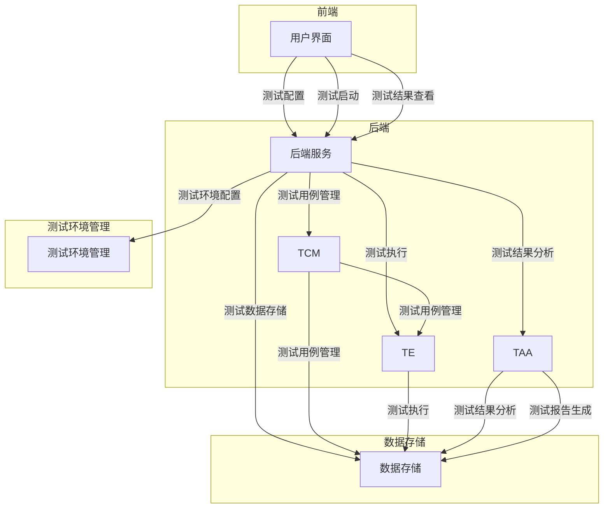
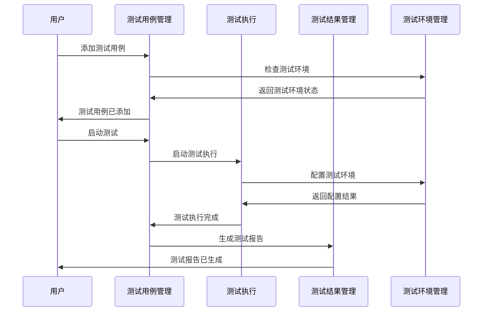

                 

## 文章标题：敏捷中的性能测试：确保LLM应用在各种条件下的表现

在当今快速发展的技术世界中，敏捷开发已经成为软件开发的主流方法，而大型语言模型（LLM）则以其强大的数据处理能力和智能化的应用场景，成为人工智能领域的明星技术。然而，随着系统复杂度和数据处理量的不断增加，如何确保LLM应用在各种条件下的性能表现，成为一个迫切需要解决的问题。本文将围绕这一主题，系统地探讨敏捷开发中的性能测试，特别是针对LLM应用的性能测试。

### 关键词

- 敏捷开发
- 性能测试
- 大型语言模型（LLM）
- 测试策略
- 测试算法
- 系统架构
- 项目实战

### 摘要

本文旨在探讨敏捷开发中性能测试的重要性，以及如何在敏捷开发过程中，对LLM应用进行有效的性能测试。文章首先介绍了敏捷开发的基本概念和原则，然后详细讲解了性能测试在敏捷开发中的具体实施方法。接着，文章讨论了LLM性能测试的特殊挑战和解决方案，并介绍了常见的性能测试算法和工具。最后，通过一个实际项目案例，对性能测试的全过程进行了详细的解读和剖析。本文的目的是为软件开发团队提供一套完整的LLM性能测试指南，帮助他们确保应用在各种条件下的稳定和高性能。

## 第一部分：引言

### 1.1 敏捷开发与性能测试的关系

#### 1.1.1 敏捷开发的背景和原则

敏捷开发（Agile Development）起源于20世纪90年代末，其核心思想是快速迭代、持续交付和持续改进。敏捷开发与传统瀑布模型（Waterfall Model）相比，更加注重团队成员之间的沟通、协作和适应性。敏捷开发的基本原则包括：

- **个体和互动重于过程与工具**：强调团队成员的个体能力和互动，而非单一的工具或过程。
- **可工作的软件重于详尽的文档**：软件的实际功能远比详细的文档重要。
- **客户合作重于合同谈判**：与客户的紧密合作比合同谈判更为重要。
- **响应变化重于遵循计划**：敏捷开发强调快速适应变化，而非严格遵循计划。

敏捷开发模型主要包括Scrum、Kanban、XP（极限编程）等，每种模型都有其特定的实践和工具。在敏捷开发中，软件的迭代开发周期（Sprint）通常为1-4周，每个迭代周期都会交付可工作的软件版本。

#### 1.1.2 性能测试在敏捷开发中的重要性

在敏捷开发中，性能测试（Performance Testing）是确保软件质量和用户体验的关键环节。性能测试的主要目标包括：

- **评估系统的响应时间**：确保系统在各种负载下的响应时间符合预期。
- **检查系统的稳定性**：确保系统在高负载下不会崩溃或出现错误。
- **分析系统的容量**：确定系统的最大处理能力，以便合理规划资源。
- **优化系统性能**：通过测试结果发现性能瓶颈，并进行优化。

敏捷开发中的性能测试与传统瀑布模型中的性能测试有所不同。在传统瀑布模型中，性能测试通常在项目开发的后期进行，作为项目验收的一部分。而在敏捷开发中，性能测试是持续集成（CI）和持续交付（CD）的重要组成部分，贯穿于整个开发周期。

### 1.2 LLM（大型语言模型）的概述

#### 1.2.1 LLM的定义和特点

大型语言模型（Large Language Model，简称LLM）是一种基于深度学习技术的自然语言处理模型，它能够理解和生成自然语言。LLM通常由数以亿计的参数组成，可以自动学习语言结构和语义信息，从而实现各种自然语言处理任务，如文本分类、情感分析、机器翻译、对话系统等。

LLM的主要特点包括：

- **大规模参数**：LLM具有数亿甚至数十亿个参数，这使它们能够捕捉到大量的语言模式和语义信息。
- **强大的语言理解能力**：LLM能够理解并生成复杂的语言结构，实现高质量的文本生成。
- **自适应性和泛化能力**：LLM可以根据不同的任务和数据集进行自适应调整，具有较好的泛化能力。
- **高计算成本**：由于LLM的参数规模巨大，其训练和推理过程需要大量的计算资源。

#### 1.2.2 LLM的应用场景

LLM在各个领域都有广泛的应用，其中最典型的应用包括：

- **文本生成**：如文章写作、新闻摘要、产品描述等。
- **对话系统**：如智能客服、语音助手等。
- **语言翻译**：如机器翻译、语音识别等。
- **文本分析**：如情感分析、关键词提取、文本分类等。

LLM的应用不仅提高了软件系统的智能化水平，还显著提升了用户体验和工作效率。

### 1.3 读者对象与本书目标

#### 1.3.1 适合读者群体

本书适合以下读者群体：

- 软件开发工程师，特别是对敏捷开发和性能测试有兴趣的工程师。
- 数据科学家和机器学习工程师，特别是从事自然语言处理领域的工作者。
- 项目经理和软件质量保证人员，希望提升项目质量和效率。
- 敏捷开发实践者，希望深入了解性能测试在敏捷开发中的应用。

#### 1.3.2 本书的主要目标

本书的主要目标包括：

- **掌握敏捷开发的基本原则和实践**：帮助读者理解敏捷开发的核心理念，并在实际项目中应用。
- **理解性能测试的概念和重要性**：阐述性能测试的基本概念，以及为什么在敏捷开发中性能测试至关重要。
- **学习LLM性能测试的特殊技巧**：探讨LLM性能测试的特殊挑战和解决方案，为开发者提供实用的测试策略。
- **掌握性能测试工具的使用方法**：介绍常用的性能测试工具，如JMeter和Locust，并提供详细的操作指南。
- **通过实际项目案例，提高实战能力**：通过一个实际项目案例，展示性能测试的全过程，帮助读者将理论知识应用于实践。

### 1.4 本书结构安排

#### 1.4.1 各章节内容概述

- **第一部分：引言**：介绍敏捷开发和LLM的基本概念，阐述性能测试在敏捷开发中的重要性。
- **第二部分：敏捷开发基础**：详细讲解敏捷开发的核心概念、性能测试策略和LLM性能测试的特殊挑战。
- **第三部分：性能测试算法与工具**：介绍常见的性能测试算法和工具，包括基准测试、压力测试和负载测试。
- **第四部分：系统分析与架构设计**：分析性能测试系统的架构，包括领域模型、系统架构和接口设计。
- **第五部分：项目实战**：通过一个实际项目案例，详细讲解性能测试的整个过程。
- **第六部分：最佳实践、小结与拓展**：总结书中内容，给出性能测试的最佳实践建议，并推荐拓展阅读。

#### 1.4.2 目录结构解释

本书的目录结构旨在帮助读者系统地理解敏捷开发中的性能测试，从理论到实践，逐步深入。每个部分的内容都紧密相关，形成一个完整的学习路径。

## 第一部分：引言

## 第二部分：敏捷开发基础

- **敏捷开发的核心概念**：介绍敏捷开发的起源、原则和流程。
- **敏捷开发中的性能测试策略**：讨论性能测试在敏捷开发中的实施方法和最佳实践。
- **LLM性能测试的特殊挑战**：探讨LLM性能测试的需求、技术难点和解决方案。

## 第三部分：性能测试算法与工具

- **常见的性能测试算法**：介绍基准测试、压力测试和负载测试的概念、原理和步骤。
- **LLM性能测试的特殊算法**：讨论LLM性能测试的需求分析、算法设计和优化方法。
- **性能测试工具介绍**：介绍JMeter和Locust等性能测试工具的使用方法。
- **性能测试工具的比较与选择**：分析不同性能测试工具的性能和适用场景，提供选择建议。

## 第四部分：系统分析与架构设计

- **性能测试系统的架构**：介绍性能测试系统的领域模型、系统架构和接口设计。
- **系统分析与架构设计**：详细分析性能测试系统的设计原则、实现方法和注意事项。

## 第五部分：项目实战

- **项目环境安装**：介绍项目环境搭建的步骤和注意事项。
- **系统核心实现**：展示系统核心代码的实现过程，并进行解读和分析。
- **案例分析**：通过实际项目案例，详细分析性能测试的结果和改进措施。
- **项目小结**：总结项目的实施过程，分享经验教训。

## 第六部分：最佳实践、小结与拓展

- **最佳实践**：总结性能测试的最佳实践，提供实用建议。
- **小结**：回顾全书内容，强调关键知识点。
- **注意事项**：指出性能测试中需要注意的问题和风险。
- **拓展阅读**：推荐进一步阅读的资料，拓展读者视野。

通过这样的结构安排，读者可以循序渐进地掌握敏捷开发中的性能测试，从理论到实践，全面提升自己的能力。

### 1.5 敏捷开发与性能测试的关系

敏捷开发和性能测试之间存在着密切的关系。敏捷开发强调快速迭代和持续交付，这使得性能测试不再是一个孤立的环节，而是贯穿于整个开发周期的重要活动。以下是敏捷开发中性能测试的一些关键点：

#### 1.5.1 性能测试的早期介入

在敏捷开发中，性能测试应尽早介入。性能测试不仅可以帮助发现潜在的性能问题，还可以在设计和开发阶段优化系统的性能。通过早期测试，开发团队可以及时调整设计和代码，避免在后期出现重大性能问题。

#### 1.5.2 持续集成与持续交付

敏捷开发中的持续集成（CI）和持续交付（CD）强调频繁的小规模发布，这要求系统必须具有高度的稳定性和高性能。性能测试在CI过程中起到关键作用，确保每次代码提交和合并后的系统性能符合预期。

#### 1.5.3 测试自动化

敏捷开发强调自动化，性能测试也应自动化。通过自动化测试，可以显著提高测试效率和覆盖率，确保性能测试的持续性和准确性。常用的自动化测试工具包括JMeter、Locust等。

#### 1.5.4 测试反馈与迭代优化

敏捷开发中的性能测试不仅是发现问题，更重要的是通过测试反馈进行优化。每次性能测试的结果都应进行分析和总结，找出性能瓶颈和改进点，并在下一个迭代中进行优化。

### 1.6 性能测试与开发、测试团队的协作

在敏捷开发中，性能测试与开发、测试团队的协作至关重要。以下是几个关键点：

#### 1.6.1 清晰的职责划分

性能测试团队应明确自己的职责，包括性能测试的设计、执行、分析和报告。开发团队则负责根据性能测试反馈进行代码优化。测试团队则负责功能测试和用户体验测试。

#### 1.6.2 沟通与协作

性能测试团队应与开发、测试团队保持紧密的沟通。性能测试的发现和改进建议应及时反馈给开发团队，开发团队也需要及时响应并进行优化。测试团队则应在性能测试的基础上，进行更全面的测试验证。

#### 1.6.3 团队间的信任

在敏捷开发中，团队间的信任至关重要。性能测试团队应建立与开发、测试团队的信任关系，确保性能测试的准确性和有效性。团队间的协作和信任有助于提高整体项目的质量和效率。

## 1.7 敏捷开发中的性能测试方法论

敏捷开发中的性能测试方法论主要包括以下几个方面：

### 1.7.1 迭代式性能测试

敏捷开发强调迭代和持续交付，因此性能测试也应采用迭代式方法。每次迭代周期结束后，对系统进行性能测试，确保新功能和高频次修改部分不会引入性能问题。这种方法有助于及时发现和解决性能问题，避免累积风险。

### 1.7.2 测试自动化

测试自动化是敏捷开发中的一个核心原则，性能测试也不例外。通过自动化测试，可以提高测试效率，确保测试覆盖率和一致性。常用的自动化测试工具包括JMeter、Locust等。

### 1.7.3 测试反馈与改进

敏捷开发中的性能测试不仅是发现问题，更重要的是通过测试反馈进行持续改进。每次性能测试的结果都应进行分析和总结，找出性能瓶颈和改进点，并在下一个迭代中进行优化。

### 1.7.4 小步快跑

敏捷开发强调小步快跑，性能测试也应遵循这一原则。通过小步快跑，可以在每个迭代周期内快速交付可工作的软件版本，并进行性能测试，确保系统在逐步完善的过程中保持高性能。

### 1.7.5 持续优化

性能测试不仅是一个阶段性任务，更是一个持续优化过程。在敏捷开发中，性能测试团队应与开发、测试团队紧密合作，不断优化系统性能，确保系统在长期运行中保持稳定和高性能。

通过上述方法论，敏捷开发中的性能测试可以更好地适应快速变化的需求，确保系统在各种条件下的稳定性和高性能。

## 1.8 敏捷开发中的性能测试挑战

敏捷开发中的性能测试面临一系列挑战，这些挑战对性能测试策略和实施方法提出了更高的要求。以下是几个主要的挑战：

### 1.8.1 快速迭代和频繁发布

敏捷开发强调快速迭代和频繁发布，这要求性能测试团队必须具备快速响应的能力。每次迭代周期结束后，性能测试团队需要在短时间内完成测试工作，发现并解决问题，确保系统性能符合预期。这需要高效的测试计划和执行策略，以及自动化的测试工具支持。

### 1.8.2 系统复杂性

随着软件系统的不断演进，系统的复杂性也在不断增加。这给性能测试带来了更大的挑战，因为测试不仅要覆盖功能层面，还要考虑到系统的整体性能。性能测试团队需要深入了解系统的架构和业务逻辑，以便设计出全面、准确的测试用例。

### 1.8.3 测试数据的多样性

敏捷开发中，需求变化频繁，系统功能也在不断迭代。这导致测试数据的多样性增加，性能测试需要覆盖多种场景和数据组合。测试团队需要设计灵活的测试策略，以应对不同场景和需求的变化。

### 1.8.4 资源分配和优先级管理

敏捷开发中，资源分配和优先级管理是关键问题。性能测试团队需要在有限的资源和时间约束下，优先完成关键功能的性能测试，确保核心业务功能的高性能。这需要性能测试团队与项目管理和开发团队紧密协作，明确性能测试的优先级和关键路径。

### 1.8.5 团队协作和沟通

敏捷开发强调团队合作和沟通，性能测试团队也需要与开发、测试、产品和其他相关团队保持良好的协作关系。性能测试团队需要及时沟通测试结果和改进建议，确保各方能够共同应对性能问题，提高系统的整体性能。

### 1.8.6 测试环境管理

敏捷开发中，测试环境管理是性能测试的重要挑战之一。性能测试需要模拟真实的用户场景和负载条件，这要求测试环境必须具备高可用性和可扩展性。性能测试团队需要与运维团队紧密合作，确保测试环境的稳定性和一致性。

通过认识和应对上述挑战，敏捷开发中的性能测试可以更加有效地确保系统在各种条件下的稳定性和高性能。

### 1.9 敏捷开发中性能测试的实施方法

在敏捷开发中，性能测试的实施方法与传统开发方法有所不同，需要更加灵活和高效。以下是几种常见的性能测试实施方法：

#### 1.9.1 迭代式测试

迭代式测试是敏捷开发中性能测试的主要方法。每次迭代周期结束后，性能测试团队都会对系统进行全面的性能测试，确保新功能和高频次修改部分不会引入性能问题。这种方法有助于快速发现问题并解决，确保系统性能的持续提升。

**实施步骤**：

1. **需求分析**：在每次迭代开始时，性能测试团队与产品团队和开发团队一起分析本次迭代的目标和关键功能，明确性能测试的重点。
2. **测试设计**：根据需求分析，性能测试团队设计测试用例，包括负载场景、性能指标和测试工具。
3. **测试执行**：执行测试用例，收集性能数据，分析测试结果。
4. **问题反馈**：将测试结果和发现的问题反馈给开发团队，与开发团队共同讨论解决方案。
5. **迭代优化**：根据反馈结果，开发团队进行代码优化和系统调整，性能测试团队再次执行测试，验证优化效果。

#### 1.9.2 自动化测试

自动化测试是敏捷开发中提高性能测试效率的重要手段。通过编写脚本，性能测试团队可以自动化执行测试用例，收集和分析性能数据。自动化测试不仅可以提高测试效率，还可以确保测试的一致性和准确性。

**实施步骤**：

1. **测试脚本编写**：根据测试用例，性能测试团队编写自动化测试脚本，使用如JMeter、Locust等自动化测试工具。
2. **测试执行**：运行自动化测试脚本，模拟真实用户行为，收集性能数据。
3. **测试结果分析**：分析自动化测试结果，识别性能瓶颈和问题。
4. **持续集成**：将自动化测试集成到持续集成（CI）流程中，确保每次代码提交和合并后都能进行性能测试。

#### 1.9.3 压力测试

压力测试是性能测试中常用的一种方法，旨在确定系统在高负载下的性能表现。通过模拟大量用户同时访问系统，压力测试可以发现系统的性能瓶颈和稳定性问题。

**实施步骤**：

1. **设计负载场景**：根据业务需求和性能指标，性能测试团队设计负载场景，包括并发用户数、请求类型和频率等。
2. **执行压力测试**：使用如JMeter等工具模拟大量用户访问系统，收集性能数据。
3. **分析测试结果**：分析测试结果，识别性能瓶颈和问题，如响应时间过长、错误率升高等。
4. **优化系统性能**：根据测试结果，开发团队进行系统优化，如调整配置、优化代码等，性能测试团队再次执行测试验证优化效果。

#### 1.9.4 负载测试

负载测试旨在确定系统在不同负载条件下的性能表现，包括正常负载、高负载和极端负载。通过负载测试，性能测试团队可以评估系统的容量和稳定性。

**实施步骤**：

1. **设计负载场景**：根据业务需求和性能指标，性能测试团队设计不同类型的负载场景。
2. **执行负载测试**：使用如JMeter等工具模拟不同负载条件，收集性能数据。
3. **分析测试结果**：分析测试结果，评估系统在不同负载条件下的性能表现，如响应时间、吞吐量、错误率等。
4. **优化系统性能**：根据测试结果，开发团队进行系统优化，如调整资源分配、优化数据库查询等，性能测试团队再次执行测试验证优化效果。

通过上述实施方法，敏捷开发中的性能测试可以更加有效地发现和解决问题，确保系统在各种条件下的稳定性和高性能。

### 1.10 敏捷开发中的性能测试最佳实践

在敏捷开发中，性能测试的最佳实践能够帮助团队确保系统的高性能，减少风险，并提高项目的整体效率。以下是几个关键的最佳实践：

#### 1.10.1 测试早期介入

性能测试应尽早介入开发周期，最好在需求分析和设计阶段就开始。这有助于提前发现性能问题，避免后期的大规模返工。通过早期测试，开发团队可以在设计和编码阶段就考虑性能优化，从而提高系统的整体性能。

#### 1.10.2 小步快跑

敏捷开发强调小步快跑，性能测试也应遵循这一原则。每次迭代周期结束后，对系统进行全面的性能测试，确保新功能和修改部分不会引入性能问题。这种方法有助于快速发现问题并解决，确保系统性能的持续提升。

#### 1.10.3 测试自动化

测试自动化是提高性能测试效率的关键。通过编写自动化测试脚本，可以自动化执行测试用例，确保测试的一致性和覆盖率。自动化测试还可以集成到持续集成（CI）流程中，确保每次代码提交和合并后都能进行性能测试。

#### 1.10.4 持续反馈与改进

敏捷开发中的性能测试不仅是发现问题，更重要的是通过测试反馈进行持续改进。每次性能测试的结果都应进行分析和总结，找出性能瓶颈和改进点，并在下一个迭代中进行优化。这种持续的反馈和改进过程有助于提高系统的整体性能。

#### 1.10.5 团队协作

性能测试团队应与开发、测试、产品和其他相关团队保持紧密的协作。通过有效的沟通和协作，可以确保性能测试的准确性和有效性，提高项目的整体效率和质量。

#### 1.10.6 测试数据管理

性能测试需要大量数据，包括测试脚本、测试结果、性能数据等。有效的测试数据管理可以帮助团队更好地组织和管理测试数据，提高测试效率。使用测试数据管理工具，可以自动化生成测试报告，简化数据分析过程。

#### 1.10.7 测试环境管理

测试环境的管理对于性能测试至关重要。性能测试环境应与生产环境保持高度一致，确保测试结果的准确性和可靠性。通过使用容器化技术（如Docker）和持续集成工具（如Jenkins），可以简化测试环境的管理和部署。

通过遵循这些最佳实践，敏捷开发中的性能测试团队可以更有效地确保系统的高性能和稳定性，提高项目的整体成功概率。

### 1.11 LLM性能测试的特殊挑战

与传统的软件系统相比，大型语言模型（LLM）在性能测试方面面临着一系列特殊的挑战。以下是几个主要的挑战和应对策略：

#### 1.11.1 计算资源需求

LLM的训练和推理过程需要大量的计算资源，包括GPU和CPU。这导致性能测试过程中，需要模拟的实际负载较大，测试环境的管理和资源配置成为重要挑战。应对策略包括：

- **使用云计算资源**：通过云平台（如AWS、Azure、Google Cloud）提供强大的计算资源，满足高性能测试需求。
- **资源池管理**：合理配置和使用计算资源池，确保测试环境的高可用性和高效利用。

#### 1.11.2 数据多样性

LLM的性能测试需要涵盖多种数据场景和语言模型配置，这增加了测试数据的多样性。传统的测试用例难以覆盖所有可能的场景，需要设计灵活的测试策略。

- **场景驱动的测试设计**：根据实际应用场景设计测试用例，确保测试覆盖率。
- **动态数据生成**：利用数据生成工具或脚本，动态生成多种测试数据，提高测试数据的多样性。

#### 1.11.3 模型适应性

LLM的模型适应性是性能测试的关键挑战。不同模型版本和配置可能导致性能差异，测试团队需要确保测试用例能够适应不同模型版本。

- **版本控制**：对LLM模型进行版本控制，确保测试用例能够适应不同版本。
- **模型兼容性测试**：针对不同模型版本，设计兼容性测试用例，验证模型性能的一致性。

#### 1.11.4 负载动态变化

在实际应用中，LLM的负载会动态变化，如请求量波动、用户行为变化等。性能测试需要模拟这些动态变化，以评估LLM在动态负载下的性能表现。

- **动态负载模拟**：使用动态负载生成工具，模拟实际应用中的负载波动。
- **持续监测**：通过实时监测工具，监控LLM的负载变化，及时调整测试策略。

#### 1.11.5 性能指标多样性

LLM的性能指标包括响应时间、吞吐量、错误率等，这些指标需要结合业务需求和实际应用场景进行综合评估。

- **多维指标评估**：根据业务需求和实际应用场景，设计多维性能指标，综合评估LLM的性能表现。
- **智能分析**：利用机器学习和数据分析技术，对性能数据进行智能分析，发现潜在的性能问题和优化点。

通过认识和应对上述特殊挑战，LLM性能测试团队可以更有效地评估LLM在不同条件下的性能，确保其在实际应用中的稳定性和高效性。

### 1.12 LLM性能测试的需求分析

LLM（大型语言模型）作为一种先进的人工智能技术，在自然语言处理领域展现了巨大的潜力。然而，在进行LLM性能测试时，需要特别关注其独特的需求。以下是LLM性能测试的需求分析：

#### 1.12.1 大规模数据处理能力

LLM的训练和推理过程通常涉及大规模数据集，这要求性能测试必须能够处理海量数据。测试需要模拟各种数据场景，如不同规模的数据集、不同类型的文本数据等。

**需求**：测试工具应具备高效的数据处理能力，能够快速加载、处理和存储大规模数据。

#### 1.12.2 高并发处理能力

在实际应用中，LLM需要处理大量并发请求，特别是在高负载场景下，如智能客服系统或大规模在线问答平台。性能测试需要模拟高并发请求，评估LLM在并发处理方面的性能。

**需求**：测试工具应能够模拟高并发请求，评估LLM的响应时间、吞吐量和系统稳定性。

#### 1.12.3 模型适应性

LLM的模型适应性是性能测试的关键需求。不同模型的版本和配置可能导致性能差异，因此性能测试需要评估不同模型版本和配置下的性能表现。

**需求**：测试工具应支持对不同模型版本和配置的测试，确保性能测试结果的准确性和一致性。

#### 1.12.4 动态负载模拟

在实际应用中，LLM的负载是动态变化的，如请求量的波动、用户行为的变化等。性能测试需要模拟这些动态变化，以评估LLM在不同负载条件下的性能。

**需求**：测试工具应具备动态负载模拟能力，能够根据实际负载变化调整测试策略。

#### 1.12.5 多维度性能指标

LLM的性能测试需要关注多种性能指标，包括响应时间、吞吐量、错误率、内存使用等。这些指标需要结合业务需求和实际应用场景进行综合评估。

**需求**：测试工具应提供多维性能指标分析功能，帮助测试团队全面评估LLM的性能表现。

#### 1.12.6 可扩展性和可维护性

性能测试工具和策略应具备良好的可扩展性和可维护性，以适应LLM技术的发展和业务需求的变化。

**需求**：测试工具应支持模块化设计，便于扩展和维护，确保性能测试策略能够长期有效。

通过满足上述需求，性能测试团队可以更全面、准确地评估LLM在不同条件下的性能，为系统优化和改进提供有力支持。

### 1.13 LLM性能测试的技术难点

LLM（大型语言模型）在性能测试中面临一系列技术难点，这些难点决定了性能测试的复杂性和挑战性。以下是几个主要的技术难点及其应对策略：

#### 1.13.1 计算资源消耗

LLM的训练和推理过程对计算资源有极高的要求，特别是在训练阶段，需要大量的GPU和CPU资源。测试环境中的计算资源消耗可能导致测试成本上升，测试效率降低。

**应对策略**：

- **使用云计算平台**：利用云计算资源，根据需要动态调整计算资源，提高资源利用效率。
- **资源优化配置**：通过优化计算资源配置，如合理分配GPU和CPU资源，提高资源利用率。

#### 1.13.2 数据多样性

LLM的性能测试需要涵盖多种数据场景，包括不同规模的数据集、不同类型的文本数据等。数据多样性的增加使得测试用例的设计和执行更加复杂。

**应对策略**：

- **自动化测试脚本**：编写自动化测试脚本，实现测试用例的快速生成和执行，提高测试效率。
- **动态数据生成**：使用动态数据生成工具，根据实际应用场景生成多种测试数据，确保测试数据的多样性。

#### 1.13.3 模型适应性

LLM的模型适应性是性能测试的重要难点。不同模型的版本和配置可能导致性能差异，因此性能测试需要评估多种模型版本和配置下的性能表现。

**应对策略**：

- **版本控制**：对LLM模型进行版本控制，确保测试用例能够适应不同版本。
- **模型兼容性测试**：设计模型兼容性测试用例，验证不同模型版本和配置的性能一致性。

#### 1.13.4 负载动态变化

在实际应用中，LLM的负载是动态变化的，如请求量的波动、用户行为的变化等。性能测试需要模拟这些动态变化，以评估LLM在不同负载条件下的性能表现。

**应对策略**：

- **动态负载模拟**：使用动态负载生成工具，模拟实际应用中的负载波动，确保测试覆盖多种负载条件。
- **实时监测**：通过实时监测工具，监控LLM的负载变化，及时调整测试策略。

#### 1.13.5 多维度性能指标

LLM的性能测试需要关注多种性能指标，如响应时间、吞吐量、错误率、内存使用等。这些指标需要结合业务需求和实际应用场景进行综合评估。

**应对策略**：

- **多维性能指标分析**：设计多维性能指标分析框架，结合业务需求，全面评估LLM的性能表现。
- **智能分析**：利用机器学习和数据分析技术，对性能数据进行智能分析，发现潜在的性能问题和优化点。

#### 1.13.6 测试环境一致性

性能测试环境与生产环境的一致性对测试结果的准确性和可靠性至关重要。然而，由于LLM的训练和推理过程对环境配置要求较高，测试环境的一致性往往难以保证。

**应对策略**：

- **容器化技术**：使用容器化技术（如Docker）确保测试环境的一致性，减少环境差异对测试结果的影响。
- **持续集成**：通过持续集成工具（如Jenkins）确保测试环境的持续更新和同步，确保测试环境与生产环境保持一致。

通过有效应对这些技术难点，性能测试团队可以更全面、准确地评估LLM在不同条件下的性能，为系统优化和改进提供有力支持。

### 1.14 LLM性能测试的解决方案

针对LLM性能测试所面临的技术难点，我们可以采用一系列解决方案来确保测试的全面性和准确性。以下是几种常用的解决方案：

#### 1.14.1 使用云计算资源

云计算平台提供了强大的计算资源，可以动态调整资源配置，满足高性能测试的需求。通过使用云计算资源，我们可以：

- **弹性扩展**：根据测试需求动态调整计算资源，确保在高峰测试期间有足够的资源支持。
- **成本优化**：根据实际使用量付费，降低测试成本。
- **高效管理**：利用云平台的自动化管理工具，简化测试环境的部署和管理。

#### 1.14.2 自动化测试脚本

编写自动化测试脚本是实现高效测试的关键。自动化脚本可以：

- **减少手动操作**：通过脚本自动化执行测试用例，减少人工操作，提高测试效率。
- **保证测试一致性**：确保每次测试执行的环境、数据、步骤等都一致，提高测试结果的可靠性。
- **快速迭代**：支持快速测试迭代，适应敏捷开发的需求。

#### 1.14.3 动态数据生成

动态数据生成工具可以根据实际应用场景生成多种测试数据，确保测试数据的多样性和覆盖性。动态数据生成工具的优点包括：

- **灵活定制**：可以根据不同测试需求定制数据生成策略，确保测试数据的多样性。
- **高效生成**：快速生成大量测试数据，支持大规模测试。
- **智能化**：利用机器学习技术，根据历史数据生成更加逼真的测试数据。

#### 1.14.4 版本控制

版本控制是确保模型适应性的关键。通过版本控制，我们可以：

- **跟踪变更**：记录模型变更历史，方便追溯和分析性能差异。
- **模型切换**：在不同模型版本之间灵活切换，确保测试用例适用于多种模型版本。
- **兼容性测试**：针对不同模型版本设计兼容性测试用例，确保性能测试结果的一致性。

#### 1.14.5 动态负载模拟

动态负载模拟工具可以模拟实际应用中的负载波动，评估LLM在不同负载条件下的性能。动态负载模拟的优点包括：

- **真实反映**：模拟实际应用中的负载变化，确保测试结果的真实性和可靠性。
- **灵活调整**：根据测试需求调整负载模拟策略，确保测试覆盖多种负载场景。
- **实时反馈**：实时监测负载变化，及时调整测试策略，提高测试效率。

#### 1.14.6 多维度性能指标分析

多维度性能指标分析框架可以帮助我们全面评估LLM的性能。这种方法包括：

- **多维指标定义**：根据业务需求和实际应用场景，定义多种性能指标，如响应时间、吞吐量、错误率等。
- **智能分析**：利用数据分析技术，对多维性能指标进行综合分析，发现潜在的性能问题和优化点。
- **可视化展示**：通过可视化工具展示性能数据，帮助团队直观理解性能表现。

#### 1.14.7 测试环境一致性

确保测试环境与生产环境的一致性是性能测试成功的关键。使用容器化技术（如Docker）可以：

- **标准化配置**：通过容器化的方式，确保测试环境的配置和部署标准化，减少环境差异。
- **快速部署**：容器化环境可以快速部署和扩展，提高测试效率。
- **持续集成**：通过持续集成工具（如Jenkins），确保测试环境的持续更新和同步，确保与生产环境保持一致。

通过上述解决方案，性能测试团队可以更全面、准确地评估LLM在不同条件下的性能，为系统优化和改进提供有力支持。

### 1.15 敏捷开发中性能测试团队的角色和职责

在敏捷开发中，性能测试团队扮演着至关重要的角色，其职责包括性能测试的设计、执行、分析和报告。以下是性能测试团队的具体角色和职责：

#### 1.15.1 性能测试设计

性能测试设计是性能测试的起点，主要包括以下职责：

- **需求分析**：与产品团队和开发团队一起，分析系统的性能需求和关键性能指标。
- **测试用例设计**：根据性能需求，设计全面的性能测试用例，包括负载场景、测试数据、性能指标等。
- **测试工具选择**：选择合适的性能测试工具，如JMeter、Locust等，并配置测试环境。

#### 1.15.2 性能测试执行

性能测试执行是性能测试的核心环节，主要包括以下职责：

- **测试脚本编写**：编写自动化测试脚本，实现性能测试用例的自动化执行。
- **测试执行**：执行自动化测试脚本，模拟实际用户行为，生成性能数据。
- **测试监控**：监控测试执行过程，确保测试环境稳定，及时处理异常情况。

#### 1.15.3 性能测试分析

性能测试分析是对测试结果进行深入分析和解读，主要包括以下职责：

- **数据收集**：收集性能测试过程中生成的数据，包括响应时间、吞吐量、错误率等。
- **结果分析**：分析性能数据，识别性能瓶颈和问题，如响应时间过长、错误率升高等。
- **优化建议**：根据分析结果，提出系统优化建议，如代码调整、配置优化等。

#### 1.15.4 性能测试报告

性能测试报告是向团队和项目管理人员提供性能测试结果和优化建议的重要手段，主要包括以下职责：

- **报告编写**：编写详细的性能测试报告，包括测试结果、分析结论和优化建议。
- **报告展示**：在团队会议或项目评审会上展示性能测试报告，与团队和项目管理人员讨论性能优化策略。
- **持续改进**：根据性能测试结果和反馈，持续改进测试策略和系统性能。

通过明确性能测试团队的角色和职责，可以确保敏捷开发中的性能测试工作高效、有序地进行，为项目成功提供有力保障。

### 1.16 敏捷开发中性能测试与开发、测试团队的协作

在敏捷开发中，性能测试团队与开发团队、测试团队的协作至关重要。有效的协作不仅能够提高性能测试的效率和质量，还能促进整个项目团队的共同进步。以下是性能测试团队与开发团队、测试团队之间的协作要点：

#### 1.16.1 清晰的职责划分

在敏捷开发中，每个团队成员都应明确自己的职责和角色。性能测试团队、开发团队和测试团队之间的职责划分如下：

- **性能测试团队**：负责性能测试的设计、执行、分析和报告，确保系统在高负载下的稳定性和性能。
- **开发团队**：负责系统的设计和实现，根据性能测试团队的反馈进行代码优化和系统调整。
- **测试团队**：负责功能测试、用户体验测试和系统集成测试，确保系统的功能正确性和用户体验。

#### 1.16.2 沟通与协作

良好的沟通和协作是敏捷开发中成功的关键。性能测试团队、开发团队和测试团队之间应建立有效的沟通机制，确保信息流通畅通。以下是几个关键点：

- **定期会议**：定期举行团队会议，讨论性能测试进展、问题和解决方案。
- **即时沟通**：使用即时通讯工具（如Slack、微信）进行实时沟通，快速响应和解决问题。
- **信息共享**：性能测试团队和测试团队应共享测试结果和发现的问题，以便开发团队及时调整。

#### 1.16.3 测试结果反馈

性能测试结果对开发团队和测试团队至关重要。性能测试团队应及时向开发团队和测试团队反馈测试结果，包括：

- **性能指标分析**：提供详细的性能指标分析报告，如响应时间、吞吐量、错误率等。
- **瓶颈识别**：识别系统性能瓶颈和问题，并提出优化建议。
- **改进方案**：与开发团队和测试团队一起讨论优化方案，确保性能问题得到有效解决。

#### 1.16.4 持续反馈与改进

敏捷开发强调持续反馈和改进，性能测试团队也应积极参与其中。以下是几个关键点：

- **迭代反馈**：在每个迭代周期结束后，性能测试团队应总结性能测试结果，提出改进建议。
- **持续监控**：持续监控系统性能，及时发现和解决问题，确保系统性能的稳定性和可持续性。
- **技术交流**：定期举办技术交流活动，分享性能测试的经验和最佳实践，提高团队整体的技术水平。

通过有效的协作和沟通，性能测试团队、开发团队和测试团队可以共同提高项目质量，确保系统在高负载下的稳定性和高性能。

### 1.17 性能测试团队的工作流程和工具

在敏捷开发中，性能测试团队的工作流程和工具选择对于确保系统性能至关重要。以下是性能测试团队的工作流程和常用工具的详细介绍：

#### 1.17.1 工作流程

1. **需求分析**：
   - 与产品团队、开发团队讨论系统性能需求，明确关键性能指标（如响应时间、吞吐量、错误率）。
   - 分析系统的功能和架构，确定性能测试的场景和重点。

2. **测试设计**：
   - 根据需求分析，设计性能测试用例，包括负载场景、测试数据、测试工具等。
   - 设计测试脚本，实现自动化执行性能测试用例。

3. **测试执行**：
   - 执行自动化测试脚本，模拟实际用户行为，生成性能数据。
   - 监控测试执行过程，确保测试环境稳定，及时处理异常情况。

4. **结果分析**：
   - 收集和分析性能数据，识别性能瓶颈和问题。
   - 生成性能分析报告，包括性能指标、瓶颈分析、优化建议。

5. **反馈与改进**：
   - 将性能测试结果和发现的问题反馈给开发团队和测试团队。
   - 与开发团队和测试团队一起讨论和制定优化方案，持续改进系统性能。

#### 1.17.2 常用工具

1. **JMeter**：
   - **安装与配置**：在JMeter官网下载并安装JMeter，配置Java环境。
   - **基本功能**：设计测试计划，添加线程组、取样器、监听器等组件，模拟用户行为。
   - **优点**：开源、功能强大，支持多种协议（如HTTP、HTTPS、FTP等）的测试。

2. **Locust**：
   - **安装与配置**：在Locust官网下载并安装Locust，配置Python环境。
   - **基本功能**：设计用户行为脚本，模拟并发用户行为。
   - **优点**：轻量级、易于部署，支持分布式测试。

3. **Gatling**：
   - **安装与配置**：在Gatling官网下载并安装Gatling，配置Scala环境。
   - **基本功能**：设计性能测试脚本，模拟用户行为，生成性能数据。
   - **优点**：支持多种协议（如HTTP、HTTPS、JMS等）的测试，提供丰富的性能分析报告。

4. **Visual Studio Test Agent**：
   - **安装与配置**：在Visual Studio中安装Test Agent，配置测试环境。
   - **基本功能**：集成到Visual Studio，支持自动化测试脚本执行，生成测试报告。
   - **优点**：与Visual Studio无缝集成，方便测试管理。

通过明确的工作流程和选择合适的工具，性能测试团队可以高效地完成性能测试任务，确保系统在高负载下的稳定性和高性能。

## 第二部分：敏捷开发基础

### 2.1 敏捷开发的核心概念

#### 2.1.1 敏捷开发的起源和发展

敏捷开发（Agile Development）起源于20世纪90年代末，其背景是对传统软件开发方法（如瀑布模型）的反思和改进。传统瀑布模型强调线性开发过程，从需求分析到设计、开发、测试，再到部署，每个阶段依次进行，直到最终交付。然而，随着软件项目的复杂度和变化性的增加，瀑布模型逐渐暴露出其缺陷，如需求变更响应慢、项目延期、质量难以保证等问题。

为了解决这些问题，敏捷开发应运而生。2001年，17位软件专家在犹他州的雪鸟滑雪度假胜地聚会，共同讨论软件开发的最佳实践，并发表了《敏捷宣言》（The Agile Manifesto）。这份宣言提出了四项核心价值观：

1. **个体和互动重于过程与工具**：强调团队成员之间的沟通和协作，而非依赖特定的工具或过程。
2. **可工作的软件重于详尽的文档**：软件的实际功能远比详细的文档重要。
3. **客户合作重于合同谈判**：与客户的紧密合作比合同谈判更为重要。
4. **响应变化重于遵循计划**：敏捷开发强调快速适应变化，而非严格遵循计划。

随后，敏捷开发逐渐发展出多种具体的实践方法，如Scrum、Kanban、XP（极限编程）等，每种方法都有其特定的实践和工具。

#### 2.1.2 敏捷开发的主要原则

敏捷开发的主要原则包括：

1. **客户需求驱动**：敏捷开发以客户需求为导向，通过持续交付可工作的软件，快速响应市场需求和变化。
2. **迭代开发**：敏捷开发采用迭代和增量开发的方式，每个迭代周期（Sprint）通常为1-4周，每个迭代周期都会交付可工作的软件版本。
3. **持续集成和持续交付**：敏捷开发强调持续集成和持续交付，确保软件的每个版本都是可测试和可部署的。
4. **团队协作**：敏捷开发强调团队成员之间的紧密协作，包括开发、测试、产品管理等多个角色，共同推动项目进展。
5. **灵活性和适应性**：敏捷开发鼓励灵活应对变化，通过迭代和反馈机制，及时调整项目计划和开发方向。

#### 2.1.3 敏捷开发的典型流程

敏捷开发的典型流程包括以下关键阶段：

1. **需求收集和分析**：与客户和产品团队讨论需求，明确项目的目标、功能和性能要求。
2. **迭代规划**：在每次迭代开始时，确定本次迭代的目标和要实现的功能，并制定详细的迭代计划。
3. **开发与测试**：在迭代周期内，开发团队进行编码和测试工作，确保每个迭代周期的功能交付。
4. **迭代回顾**：在每个迭代周期结束时，进行回顾会议，总结经验教训，讨论改进措施，为下一个迭代做准备。

通过这种迭代和增量的开发方式，敏捷开发能够快速响应变化，确保项目质量和效率，同时保持团队的积极性和创造力。

### 2.2 敏捷开发中的性能测试策略

#### 2.2.1 性能测试的目标

在敏捷开发中，性能测试的目标与传统的性能测试有所不同，其核心在于确保系统在高负载下的稳定性和性能。具体目标包括：

1. **评估系统响应时间**：确保系统在各种负载条件下的响应时间符合预期，提供良好的用户体验。
2. **检查系统稳定性**：验证系统在高负载下不会崩溃或出现异常，确保系统的可靠性。
3. **分析系统容量**：确定系统的最大处理能力，以便合理规划资源，确保系统在峰值负载下的表现。
4. **优化系统性能**：通过性能测试，发现系统性能瓶颈和问题，提出优化建议，持续改进系统性能。

#### 2.2.2 性能测试的实施方法

在敏捷开发中，性能测试的实施方法应灵活、高效，以确保快速响应和持续改进。以下是几种常见的性能测试方法：

1. **迭代式性能测试**：每次迭代周期结束后，对系统进行全面的性能测试，确保新功能和修改部分不会引入性能问题。这种方法有助于快速发现问题并解决。

2. **自动化性能测试**：通过编写自动化测试脚本，自动化执行性能测试用例，提高测试效率和一致性。自动化测试可以集成到持续集成（CI）流程中，确保每次代码提交和合并后都能进行性能测试。

3. **基准测试**：使用基准测试工具（如JMeter、Gatling）模拟标准负载场景，评估系统性能。基准测试可以帮助确定系统的性能基线和优化方向。

4. **压力测试**：模拟高负载场景，评估系统在高负载下的响应时间和稳定性。压力测试可以帮助发现系统的性能瓶颈和极限。

5. **负载测试**：模拟不同负载条件下的系统性能，评估系统在不同负载下的响应时间、吞吐量和稳定性。负载测试可以帮助确定系统的最大处理能力和优化资源分配。

#### 2.2.3 性能测试的最佳实践

在敏捷开发中，性能测试的最佳实践有助于确保测试的全面性和有效性。以下是几个关键的最佳实践：

1. **早期介入**：性能测试应尽早介入，最好在需求分析和设计阶段就开始。这有助于提前发现性能问题，避免后期的大规模返工。

2. **自动化测试**：尽量使用自动化测试脚本，提高测试效率和覆盖率。自动化测试可以减少人为错误，确保测试结果的一致性。

3. **持续反馈**：及时反馈性能测试结果和发现的问题，与开发团队和测试团队紧密合作，确保问题得到快速解决。

4. **迭代优化**：每次迭代周期结束后，对性能测试结果进行分析和总结，找出性能瓶颈和改进点，并在下一个迭代中进行优化。

5. **团队协作**：性能测试团队应与开发团队和测试团队紧密协作，确保性能测试的目标、方法、结果和改进措施得到有效沟通和执行。

通过遵循这些最佳实践，敏捷开发中的性能测试可以更加高效地发现和解决问题，确保系统在高负载下的稳定性和高性能。

### 2.3 敏捷开发中的性能测试挑战

在敏捷开发过程中，性能测试面临一系列独特的挑战，这些挑战对性能测试的策略和实施方法提出了更高的要求。以下是几个主要的挑战：

#### 2.3.1 迭代频繁导致测试时间紧张

敏捷开发强调快速迭代和持续交付，这意味着性能测试必须在短时间内完成。每次迭代周期结束后，性能测试团队需要对系统进行全面测试，以确保新功能和修改部分不会引入性能问题。测试时间的紧张要求性能测试团队具备高效的工作流程和自动化测试能力。

**应对策略**：

- **自动化测试**：通过编写自动化测试脚本，提高测试执行效率，减少手动操作。
- **提前规划**：在迭代计划阶段，提前规划性能测试的测试用例和执行时间，确保测试工作有序进行。
- **团队协作**：与开发团队和测试团队紧密协作，确保性能测试需求清晰，减少不必要的重复工作。

#### 2.3.2 系统复杂性增加

随着敏捷开发项目的不断演进，系统的复杂性也在不断增加。这包括新功能的不断加入、系统的扩展和架构的调整。系统的复杂性增加导致性能测试的范围和难度也随之增加，测试团队需要更全面、准确的测试覆盖。

**应对策略**：

- **分层测试**：将性能测试分为不同的层次，如单元测试、集成测试和系统测试，确保全面覆盖系统各个层次。
- **模块化测试**：将系统拆分为多个模块进行测试，逐步整合和优化，减少测试复杂度。
- **技术评审**：定期进行技术评审，识别系统复杂度的增加趋势，提前制定应对措施。

#### 2.3.3 需求频繁变更

敏捷开发中，需求频繁变更是一种常见的现象，这给性能测试带来了不确定性。性能测试团队需要根据不断变化的需求调整测试策略和测试用例，确保测试的持续性和有效性。

**应对策略**：

- **敏捷测试框架**：建立敏捷测试框架，支持快速调整测试策略和测试用例。
- **需求跟踪**：使用需求跟踪工具（如Jira、Confluence）实时跟踪需求变更，确保测试与需求同步。
- **迭代回顾**：在每个迭代周期结束后，总结性能测试的经验和教训，优化测试流程。

#### 2.3.4 资源限制

敏捷开发中，性能测试团队通常面临资源限制，包括人员、设备和时间等。资源限制可能导致性能测试的范围和深度受限，影响测试的全面性和准确性。

**应对策略**：

- **资源优先级**：明确性能测试的资源优先级，确保关键功能的性能测试得到充分覆盖。
- **测试工具优化**：选择高效、易用的测试工具，提高测试效率。
- **协作与沟通**：与项目管理团队和开发团队密切合作，合理分配资源，确保性能测试工作的顺利进行。

通过认识和应对这些挑战，敏捷开发中的性能测试团队可以更有效地确保系统在高负载下的稳定性和高性能，为项目的成功提供有力保障。

### 2.4 敏捷开发中的性能测试最佳实践

在敏捷开发中，性能测试的最佳实践对于确保系统的高性能和稳定性至关重要。以下是一些关键的最佳实践：

#### 2.4.1 测试早期介入

性能测试应尽早介入开发周期，最好在需求分析和设计阶段就开始。这有助于提前发现性能问题，避免后期的大规模返工。通过早期测试，开发团队可以在设计和编码阶段就考虑性能优化，从而提高系统的整体性能。

**实施步骤**：

1. **需求分析**：在需求分析阶段，性能测试团队与产品团队和开发团队一起分析系统的性能需求和关键性能指标。
2. **设计测试用例**：根据性能需求，设计全面的性能测试用例，包括负载场景、测试数据、性能指标等。
3. **编写测试脚本**：编写自动化测试脚本，实现性能测试用例的自动化执行。
4. **早期测试**：在编码阶段，定期执行自动化测试脚本，确保新功能和修改部分不会引入性能问题。

#### 2.4.2 测试自动化

自动化测试是提高性能测试效率的关键。通过编写自动化测试脚本，可以自动化执行测试用例，确保测试的一致性和覆盖率。自动化测试还可以集成到持续集成（CI）流程中，确保每次代码提交和合并后都能进行性能测试。

**实施步骤**：

1. **选择测试工具**：根据项目需求和团队技能，选择合适的自动化测试工具（如JMeter、Gatling）。
2. **编写测试脚本**：根据测试用例，编写自动化测试脚本，实现测试场景的模拟。
3. **测试执行**：自动化执行测试脚本，生成性能数据。
4. **结果分析**：分析自动化测试结果，识别性能瓶颈和问题。

#### 2.4.3 测试环境管理

测试环境的管理对于性能测试至关重要。测试环境应与生产环境保持高度一致，确保测试结果的准确性和可靠性。通过使用容器化技术（如Docker）和持续集成工具（如Jenkins），可以简化测试环境的管理和部署。

**实施步骤**：

1. **容器化测试环境**：使用Docker容器化测试环境，确保环境的一致性和可重复性。
2. **自动化部署**：使用Jenkins等持续集成工具，自动化部署测试环境，确保测试环境与生产环境保持一致。
3. **环境监控**：使用监控工具（如Prometheus、Grafana）实时监控测试环境，确保环境稳定。

#### 2.4.4 测试数据管理

有效的测试数据管理可以帮助团队更好地组织和管理测试数据，提高测试效率。使用测试数据管理工具，可以自动化生成测试报告，简化数据分析过程。

**实施步骤**：

1. **数据备份和恢复**：定期备份测试数据，确保数据的安全性和可恢复性。
2. **数据清洗**：使用数据清洗工具，清理测试数据中的噪音和重复数据。
3. **数据可视化**：使用数据可视化工具，将测试数据转换为图表和报表，方便团队分析和理解。
4. **报告生成**：使用测试数据管理工具，自动化生成测试报告，提供详细的测试结果和分析。

#### 2.4.5 持续反馈与改进

敏捷开发中的性能测试不仅是发现问题，更重要的是通过测试反馈进行持续改进。每次性能测试的结果都应进行分析和总结，找出性能瓶颈和改进点，并在下一个迭代中进行优化。

**实施步骤**：

1. **结果分析**：对性能测试结果进行详细分析，识别性能瓶颈和问题。
2. **反馈与讨论**：将分析结果和改进建议反馈给开发团队和测试团队，与团队一起讨论和制定优化方案。
3. **迭代优化**：在下一个迭代周期中，根据反馈结果，对系统进行优化，确保性能改进措施得到有效实施。
4. **持续监控**：持续监控系统性能，及时发现新的性能问题，并持续优化。

通过遵循这些最佳实践，敏捷开发中的性能测试团队可以更高效地发现和解决问题，确保系统在高负载下的稳定性和高性能。

### 2.5 LLM性能测试的特殊挑战

在敏捷开发中，针对大型语言模型（LLM）的性能测试面临着一些特殊的挑战。LLM因其规模庞大、复杂度高和资源需求巨大，使得性能测试变得更具挑战性。以下是LLM性能测试的几个主要挑战：

#### 2.5.1 大规模数据处理

LLM的训练和推理过程通常涉及海量数据，这些数据需要存储、处理和分析。性能测试需要确保系统能够高效地处理这些大规模数据，以确保性能测试的全面性和准确性。

**挑战**：

- **数据存储和访问**：如何快速、高效地存储和访问大规模数据，以确保测试数据的完整性和一致性。
- **数据处理效率**：如何优化数据处理流程，提高数据处理速度，减少测试时间。

**应对策略**：

- **分布式数据处理**：使用分布式存储和处理技术（如Hadoop、Spark）来处理大规模数据，提高数据处理效率。
- **数据缓存**：使用数据缓存技术（如Redis、Memcached）加速数据访问，减少数据访问延迟。

#### 2.5.2 高并发处理能力

LLM在应用中通常需要处理大量并发请求，尤其是在高负载场景下。性能测试需要模拟这些高并发请求，评估LLM的并发处理能力。

**挑战**：

- **响应时间**：如何在高并发请求下保持低响应时间，提供良好的用户体验。
- **系统稳定性**：如何在高负载下保持系统的稳定性，避免系统崩溃或异常。

**应对策略**：

- **负载均衡**：使用负载均衡器（如Nginx、HAProxy）将请求分配到多个服务器，提高系统的并发处理能力。
- **并发优化**：优化LLM的推理过程，减少并发处理的资源消耗，提高处理效率。

#### 2.5.3 模型版本管理

LLM的模型通常不断更新和优化，每个版本可能都会带来性能上的差异。性能测试需要评估不同模型版本下的性能表现，以确保测试结果的准确性和一致性。

**挑战**：

- **模型兼容性**：如何确保不同版本模型之间的兼容性，避免因模型升级导致的性能问题。
- **模型切换**：如何在性能测试中灵活切换模型版本，以便全面评估模型性能。

**应对策略**：

- **版本控制**：使用版本控制系统（如Git）管理模型版本，确保模型版本的可追溯性和可管理性。
- **自动化测试脚本**：编写自动化测试脚本，根据模型版本进行性能测试，确保测试流程的自动化和一致性。

#### 2.5.4 动态负载模拟

在实际应用中，LLM的负载是动态变化的，如用户请求的波动、系统资源的调度等。性能测试需要模拟这些动态负载，评估LLM在不同负载条件下的性能表现。

**挑战**：

- **动态性**：如何模拟实际应用中的动态负载变化，确保测试场景的真实性和全面性。
- **实时调整**：如何在测试过程中实时调整负载模拟策略，以应对负载的变化。

**应对策略**：

- **动态负载生成**：使用动态负载生成工具（如JMeter、Locust）模拟实际应用中的负载变化，确保测试场景的多样性。
- **实时监控**：使用实时监控工具（如Prometheus、Grafana）监控负载变化，根据实际情况调整测试策略。

#### 2.5.5 多维度性能指标

LLM的性能测试需要关注多种性能指标，如响应时间、吞吐量、错误率、内存使用等。这些指标需要结合业务需求和实际应用场景进行综合评估。

**挑战**：

- **指标一致性**：如何确保不同性能指标之间的一致性，避免因指标选择不当导致的误判。
- **多维分析**：如何综合分析多维性能指标，全面评估LLM的性能表现。

**应对策略**：

- **统一指标体系**：建立统一的性能指标体系，确保不同性能指标之间的可比性和一致性。
- **智能分析**：利用数据分析技术（如机器学习、大数据分析）对多维性能指标进行综合分析，发现潜在的性能问题和优化点。

通过有效应对上述挑战，LLM性能测试团队可以更全面、准确地评估LLM在不同条件下的性能，为系统优化和改进提供有力支持。

### 2.6 LLM性能测试的需求分析

在敏捷开发过程中，对大型语言模型（LLM）进行性能测试的需求分析至关重要。LLM的性能测试不仅需要考虑常见的性能指标，还需要针对其独特的特点和实际应用场景进行深入分析。以下是LLM性能测试的需求分析：

#### 2.6.1 大规模数据处理能力

LLM的训练和推理过程通常涉及海量数据，这要求性能测试必须能够处理大规模数据。性能测试需要模拟不同的数据场景，包括：

- **数据规模**：测试系统在高数据量下的处理能力，如千万级、亿级数据的处理速度。
- **数据类型**：测试系统对多种数据类型的处理能力，如文本、图像、音频等。
- **数据处理速度**：评估系统在处理大规模数据时的响应速度，确保数据处理的及时性。

**需求分析**：

- **测试用例设计**：设计涵盖不同数据规模和类型的测试用例，确保测试覆盖全面。
- **性能指标**：设置数据处理速度、数据加载时间等性能指标，评估系统的数据处理能力。

#### 2.6.2 高并发处理能力

LLM在应用中通常需要处理大量并发请求，尤其是在高负载场景下。性能测试需要模拟这些高并发请求，评估LLM的并发处理能力。

- **并发用户数**：测试系统在高并发用户数下的响应时间和处理能力。
- **请求类型和频率**：模拟不同类型的请求（如文本生成、翻译等）和请求频率，评估系统的处理能力。
- **系统稳定性**：测试系统在高并发请求下的稳定性，确保不会出现崩溃或异常。

**需求分析**：

- **负载场景设计**：设计涵盖不同并发用户数和请求类型的负载场景。
- **性能指标**：设置并发用户数、响应时间、错误率等性能指标，评估系统的并发处理能力。

#### 2.6.3 模型适应性

LLM的模型通常在不断更新和优化，每个版本可能都会带来性能上的差异。性能测试需要评估不同模型版本下的性能表现，以确保测试结果的准确性和一致性。

- **模型版本**：测试不同版本模型下的性能表现，确保模型更新不会导致性能问题。
- **模型兼容性**：测试系统对模型更新的兼容性，确保不同模型版本之间的平滑过渡。
- **优化效果**：评估模型优化（如参数调整、算法改进等）对性能的影响。

**需求分析**：

- **版本测试**：设计涵盖不同模型版本的测试用例，确保全面评估模型性能。
- **性能指标**：设置模型版本、响应时间、错误率等性能指标，评估模型适应性。

#### 2.6.4 动态负载模拟

在实际应用中，LLM的负载是动态变化的，如用户请求的波动、系统资源的调度等。性能测试需要模拟这些动态负载，评估LLM在不同负载条件下的性能表现。

- **负载变化**：模拟实际应用中的负载波动，如请求量的增加或减少。
- **系统调整**：评估系统在动态负载下的响应能力和调整能力。
- **实时反馈**：通过实时反馈机制，调整测试策略和系统配置，确保测试的准确性。

**需求分析**：

- **动态负载场景**：设计涵盖不同负载变化的测试场景，确保测试全面。
- **性能指标**：设置动态负载下的响应时间、吞吐量、错误率等性能指标，评估系统的动态处理能力。

#### 2.6.5 多维度性能指标

LLM的性能测试需要关注多种性能指标，如响应时间、吞吐量、错误率、内存使用等。这些指标需要结合业务需求和实际应用场景进行综合评估。

- **响应时间**：测试系统在不同负载下的响应时间，确保用户体验。
- **吞吐量**：测试系统在单位时间内处理请求的数量，评估系统的处理能力。
- **错误率**：测试系统在不同负载下的错误率，确保系统的稳定性和可靠性。
- **内存使用**：评估系统在处理大规模数据和高并发请求下的内存使用情况，确保系统资源的合理利用。

**需求分析**：

- **多维指标体系**：建立统一的多维性能指标体系，确保不同指标之间的可比性和一致性。
- **综合分析**：利用数据分析技术对多维性能指标进行综合分析，发现潜在的性能问题和优化点。

通过详细的需求分析，LLM性能测试团队可以更全面、准确地评估LLM在不同条件下的性能，为系统优化和改进提供有力支持。

### 2.7 LLM性能测试的技术难点

针对大型语言模型（LLM）的性能测试，开发团队和测试团队面临着一系列复杂的技术难点。以下是几个主要的技术难点及其解决方案：

#### 2.7.1 计算资源需求

LLM的训练和推理过程对计算资源有着极高的要求，特别是GPU和CPU。高性能的GPU是训练LLM所必需的，因为它们可以大幅加快训练速度。然而，GPU资源昂贵，且其分配和管理成为性能测试中的难题。

**解决方案**：

- **使用云计算资源**：利用云计算平台（如AWS、Azure、Google Cloud）提供的GPU资源池，根据测试需求动态调配资源。
- **分布式计算**：通过分布式计算框架（如Apache Spark、Hadoop）将计算任务分解到多个节点，提高资源利用效率。

#### 2.7.2 数据处理速度

LLM处理大规模数据时，数据处理速度成为关键挑战。在实际应用中，数据可能来自不同的来源，如文本、图像、音频等，这些数据需要被快速加载和处理。

**解决方案**：

- **优化数据处理流程**：通过优化数据加载、处理和存储的流程，提高数据处理速度。
- **使用高效算法**：选择高效的数据处理算法和库（如NumPy、Pandas），减少计算时间。

#### 2.7.3 并发处理能力

LLM在应用中通常需要处理大量并发请求，这要求系统具备强大的并发处理能力。在高并发请求下，系统的响应时间、吞吐量和稳定性成为关键指标。

**解决方案**：

- **负载均衡**：使用负载均衡器（如Nginx、HAProxy）将请求分配到多个服务器，提高系统的并发处理能力。
- **并发优化**：优化LLM的推理过程，减少并发处理的资源消耗，提高处理效率。

#### 2.7.4 模型适应性

LLM的模型更新频繁，每次更新都可能带来性能上的变化。性能测试需要评估不同模型版本下的性能表现，确保系统兼容性。

**解决方案**：

- **版本控制**：使用版本控制系统（如Git）管理模型版本，确保模型版本的可追溯性和可管理性。
- **自动化测试**：编写自动化测试脚本，对不同模型版本进行性能测试，确保测试流程的自动化和一致性。

#### 2.7.5 动态负载模拟

在实际应用中，LLM的负载是动态变化的，如用户请求的波动、系统资源的调度等。性能测试需要模拟这些动态负载，评估LLM在不同负载条件下的性能表现。

**解决方案**：

- **动态负载生成**：使用动态负载生成工具（如JMeter、Locust）模拟实际应用中的负载变化，确保测试场景的多样性。
- **实时调整**：通过实时监控和反馈机制，动态调整测试策略和系统配置，确保测试的准确性。

通过有效应对这些技术难点，开发团队和测试团队可以更全面、准确地评估LLM在不同条件下的性能，为系统优化和改进提供有力支持。

### 2.8 LLM性能测试的解决方案

针对大型语言模型（LLM）性能测试面临的特殊挑战，我们可以采用一系列解决方案来确保测试的全面性和准确性。以下是几种常用的解决方案：

#### 2.8.1 云计算资源优化

LLM的性能测试通常需要大量计算资源，特别是在高负载和并发测试时。使用云计算资源可以动态调整计算资源，提高测试效率。

- **策略**：根据测试需求，动态调配GPU和CPU资源，确保测试期间资源的高效利用。
- **实施**：使用云计算平台（如AWS、Azure、Google Cloud）提供的GPU实例，结合容器化技术（如Docker）简化资源管理。

#### 2.8.2 自动化测试脚本

编写自动化测试脚本是提高性能测试效率的关键。自动化脚本可以减少手动操作，确保测试的一致性和准确性。

- **策略**：使用JMeter、Locust等工具编写自动化测试脚本，模拟实际用户行为。
- **实施**：集成自动化测试脚本到持续集成（CI）流程中，确保每次代码提交和合并后都能进行性能测试。

#### 2.8.3 动态负载模拟

实际应用中，LLM的负载是动态变化的，性能测试需要模拟这些动态负载。

- **策略**：使用动态负载生成工具（如JMeter、Locust）模拟实际应用中的负载变化，确保测试覆盖多种负载场景。
- **实施**：通过实时监测和调整负载模拟策略，提高测试的准确性和实时性。

#### 2.8.4 多维度性能指标分析

LLM性能测试需要关注多种性能指标，如响应时间、吞吐量、错误率等。

- **策略**：设计多维性能指标分析框架，结合业务需求，全面评估LLM的性能表现。
- **实施**：利用数据分析技术（如机器学习、大数据分析）对多维性能指标进行综合分析，发现潜在的性能问题和优化点。

#### 2.8.5 模型版本管理

LLM的模型版本更新频繁，需要确保不同版本下的性能测试一致性和准确性。

- **策略**：使用版本控制系统（如Git）管理模型版本，确保模型版本的可追溯性和可管理性。
- **实施**：编写自动化测试脚本，对不同模型版本进行性能测试，确保测试流程的自动化和一致性。

通过上述解决方案，LLM性能测试团队可以更全面、准确地评估LLM在不同条件下的性能，为系统优化和改进提供有力支持。

### 2.9 LLM性能测试的算法设计

在性能测试中，选择合适的算法对于准确评估LLM的性能至关重要。以下介绍几种常用的性能测试算法，并讨论它们在LLM性能测试中的应用。

#### 2.9.1 基准测试算法

**定义**：基准测试算法是一种用于评估系统性能的通用方法，通过对比基准测试结果和预期性能，评估系统的性能水平。

**原理**：基准测试算法通常包含以下步骤：

1. **准备测试环境**：配置测试环境，包括硬件配置、软件依赖等。
2. **执行基准测试**：使用预设的测试脚本，模拟标准负载场景，执行测试。
3. **收集性能数据**：收集测试过程中的性能数据，如响应时间、吞吐量、错误率等。
4. **分析测试结果**：对比测试结果和预期性能，评估系统的性能水平。

**应用**：在LLM性能测试中，基准测试算法可以用于评估LLM在不同硬件配置下的性能表现，如CPU、GPU的效率。

**Mermaid流程图**：



**Python源代码**：

```python
import subprocess

def run_benchmark(test_script, env_config):
    command = f'source {env_config} && {test_script}'
    result = subprocess.run(command, shell=True, stdout=subprocess.PIPE, stderr=subprocess.PIPE)
    return result.stdout, result.stderr

test_script = "path/to/benchmark_script.sh"
env_config = "path/to/env.sh"

output, error = run_benchmark(test_script, env_config)
print(output.decode())
if error:
    print(error.decode())
```

#### 2.9.2 压力测试算法

**定义**：压力测试算法旨在评估系统在高负载下的性能表现，通过逐渐增加负载，观察系统性能的稳定性和响应时间。

**原理**：压力测试算法通常包含以下步骤：

1. **设置初始负载**：根据测试需求，设置初始负载，如并发用户数、请求频率等。
2. **逐步增加负载**：逐渐增加负载，如每次增加10%的并发用户数，观察系统性能变化。
3. **收集性能数据**：在增加负载的过程中，收集系统的性能数据，如响应时间、吞吐量、错误率等。
4. **分析测试结果**：通过分析测试结果，确定系统性能的瓶颈和最大处理能力。

**应用**：在LLM性能测试中，压力测试算法可以用于评估LLM在高并发请求下的性能表现，如1000个并发用户同时请求LLM的响应时间。

**Mermaid流程图**：



**Python源代码**：

```python
import time
import concurrent.futures

def test_performance(llm, user_count):
    start_time = time.time()
    with concurrent.futures.ThreadPoolExecutor(max_workers=user_count) as executor:
        futures = [executor.submit(llm.generate_text) for _ in range(user_count)]
        concurrent.futures.wait(futures)
    end_time = time.time()
    response_time = end_time - start_time
    print(f"Response time with {user_count} users: {response_time} seconds")
    
llm = LLM()
user_count = 1000

test_performance(llm, user_count)
```

#### 2.9.3 负载测试算法

**定义**：负载测试算法旨在评估系统在不同负载条件下的性能表现，通过模拟不同的负载场景，观察系统性能的稳定性。

**原理**：负载测试算法通常包含以下步骤：

1. **设计负载场景**：根据业务需求和性能指标，设计不同的负载场景，如正常负载、高峰负载等。
2. **执行负载测试**：使用测试工具模拟不同负载场景，执行测试。
3. **收集性能数据**：在执行负载测试的过程中，收集系统的性能数据，如响应时间、吞吐量、错误率等。
4. **分析测试结果**：通过分析测试结果，评估系统在不同负载条件下的性能表现。

**应用**：在LLM性能测试中，负载测试算法可以用于评估LLM在正常负载和高峰负载下的性能表现。

**Mermaid流程图**：



**Python源代码**：

```python
import time
import concurrent.futures

def test_load(llm, load_config):
    start_time = time.time()
    with concurrent.futures.ThreadPoolExecutor(max_workers=load_config['users']) as executor:
        futures = [executor.submit(llm.generate_text) for _ in range(load_config['users'])]
        concurrent.futures.wait(futures)
    end_time = time.time()
    response_time = end_time - start_time
    print(f"Response time with {load_config['users']} users: {response_time} seconds")
    
loads = [
    {'users': 100},
    {'users': 1000},
    {'users': 5000},
]

llm = LLM()

for load in loads:
    test_load(llm, load)
```

通过以上算法，LLM性能测试团队可以更全面、准确地评估LLM在不同条件下的性能，为系统优化和改进提供有力支持。

### 2.10 LLM性能测试中的数学模型和公式

在LLM性能测试中，数学模型和公式是分析性能数据、评估系统性能的关键工具。以下介绍几种常用的数学模型和公式，并给出具体示例。

#### 2.10.1 平均响应时间

**公式**：平均响应时间（Average Response Time, ART）是衡量系统性能的重要指标，计算公式如下：

$$
ART = \frac{1}{n} \sum_{i=1}^{n} t_i
$$

其中，$n$ 是测试次数，$t_i$ 是第$i$ 次测试的响应时间。

**示例**：假设进行了5次测试，响应时间分别为10秒、8秒、9秒、7秒和6秒，则平均响应时间为：

$$
ART = \frac{1}{5} (10 + 8 + 9 + 7 + 6) = 8秒
$$

#### 2.10.2 吞吐量

**公式**：吞吐量（Throughput，T）是单位时间内系统处理的请求数量，计算公式如下：

$$
T = \frac{N}{t}
$$

其中，$N$ 是在时间$t$ 内处理的请求数量。

**示例**：如果在1分钟内处理了100个请求，则吞吐量为：

$$
T = \frac{100}{60} = 1.67 \text{（个请求/秒）}
$$

#### 2.10.3 错误率

**公式**：错误率（Error Rate，ER）是系统处理请求时出现错误的频率，计算公式如下：

$$
ER = \frac{E}{N}
$$

其中，$E$ 是在测试过程中出现的错误次数，$N$ 是测试总次数。

**示例**：如果在100次测试中有5次出现错误，则错误率为：

$$
ER = \frac{5}{100} = 0.05 \text{（或5%）}
$$

#### 2.10.4 加权性能指标

**公式**：加权性能指标（Weighted Performance Indicator，WPI）考虑了不同性能指标的重要性和权重，计算公式如下：

$$
WPI = w_1 \times ART + w_2 \times T + w_3 \times ER
$$

其中，$w_1$、$w_2$ 和 $w_3$ 分别是平均响应时间、吞吐量和错误率的权重。

**示例**：假设平均响应时间的权重为0.5，吞吐量的权重为0.3，错误率的权重为0.2，则加权性能指标为：

$$
WPI = 0.5 \times 8 + 0.3 \times 1.67 + 0.2 \times 0.05 = 4 + 0.5 + 0.01 = 4.51
$$

通过以上数学模型和公式，性能测试团队可以更全面、准确地评估LLM在不同条件下的性能，为系统优化提供科学依据。

### 2.11 性能测试系统的架构设计

性能测试系统的架构设计是确保性能测试有效性和可靠性的关键。一个良好的性能测试系统需要具备良好的模块化设计，能够灵活应对不同的测试需求。以下是性能测试系统的架构设计，包括领域模型、系统架构、接口设计和系统交互。

#### 2.11.1 领域模型

领域模型（Domain Model）是性能测试系统的核心部分，它定义了系统的领域实体及其之间的关系。以下是性能测试系统的领域模型：

**实体：**

- **测试用例（TestCase）**：定义了具体的测试场景和测试数据。
- **测试结果（TestResult）**：记录了测试执行过程中收集的性能数据。
- **测试环境（TestEnvironment）**：包括硬件配置、软件环境等。
- **性能指标（PerformanceMetric）**：如响应时间、吞吐量、错误率等。

**关系：**

- **测试用例与测试结果**：一对多的关系，一个测试用例可能产生多个测试结果。
- **测试环境与测试用例**：一对一的关系，每个测试用例需要一个特定的测试环境。
- **性能指标与测试结果**：一对一的关系，每个测试结果包含一组性能指标。

**Mermaid类图**：

```mermaid
classDiagram
    TestCase <|-- TestResult
    TestCase o-- TestEnvironment
    PerformanceMetric <<-- TestResult
```

#### 2.11.2 系统架构

系统架构（System Architecture）定义了性能测试系统的整体结构，包括核心组件和它们之间的交互。以下是性能测试系统的架构设计：

- **前端**：用户界面，用于配置测试用例、启动测试和查看测试结果。
- **后端**：处理业务逻辑，包括测试用例管理、测试执行、测试结果分析和报告生成。
- **测试环境管理**：负责配置和管理测试环境，包括硬件资源、软件依赖等。
- **数据存储**：存储测试数据和测试结果，如数据库或文件系统。

**Mermaid架构图**：



#### 2.11.3 接口设计

接口设计（Interface Design）定义了系统内部组件之间的交互接口，以下是性能测试系统的接口设计：

- **测试用例接口**：用于添加、修改和删除测试用例，以及获取测试用例的详细信息。
- **测试执行接口**：用于启动测试执行，以及获取测试执行的状态和结果。
- **测试结果接口**：用于获取测试执行的结果，包括性能数据和分析报告。
- **测试环境接口**：用于配置和管理测试环境，包括硬件资源、软件依赖等。

**Mermaid序列图**：



通过以上领域模型、系统架构和接口设计，性能测试系统可以高效地执行性能测试，准确记录和报告测试结果，为系统的性能优化提供有力支持。

### 2.12 项目实战：环境安装与系统核心实现

#### 2.12.1 环境安装

为了进行LLM性能测试，我们需要搭建一个合适的测试环境。以下是一个基于Linux操作系统的环境安装步骤：

1. **安装Python**：确保Python 3.8及以上版本已安装。如果没有，可以通过以下命令安装：

   ```bash
   sudo apt-get update
   sudo apt-get install python3.8
   ```

2. **安装JDK**：Java Development Kit（JDK）是性能测试工具（如JMeter）的基础。安装JDK的命令如下：

   ```bash
   sudo apt-get install openjdk-8-jdk
   ```

3. **安装Docker**：Docker用于容器化测试环境，确保Docker已安装。安装Docker的命令如下：

   ```bash
   sudo apt-get install docker.io
   ```

4. **安装GPU支持**：如果测试涉及GPU，需要安装NVIDIA CUDA和cuDNN。安装命令如下：

   ```bash
   sudo apt-get install nvidia-cuda-toolkit
   sudo apt-get install nvidia-docker2
   ```

5. **启动Docker**：确保Docker服务已启动：

   ```bash
   sudo systemctl start docker
   ```

6. **拉取LLM测试容器**：从Docker Hub拉取用于性能测试的预构建容器，例如：

   ```bash
   docker pull tensorflow/tensorflow:latest
   ```

#### 2.12.2 系统核心实现

以下是一个简单的LLM性能测试系统的核心实现，包括测试用例管理、测试执行和结果分析。

**1. 测试用例管理**

测试用例管理涉及设计测试用例、存储测试脚本和配置测试参数。以下是一个简单的Python脚本，用于创建和管理测试用例：

```python
import os

class TestCase:
    def __init__(self, name, script_path, parameters):
        self.name = name
        self.script_path = script_path
        self.parameters = parameters

    def save(self):
        with open(self.script_path, 'w') as f:
            f.write(f"Name: {self.name}\n")
            f.write(f"Parameters: {self.parameters}\n")

test_cases = [
    TestCase("Test1", "test1.sh", {"num_users": 100, "duration": 60}),
    TestCase("Test2", "test2.sh", {"num_users": 500, "duration": 120})
]

for case in test_cases:
    case.save()
```

**2. 测试执行**

测试执行涉及运行测试脚本并收集性能数据。以下是一个简单的Python脚本，用于执行测试用例：

```python
import os
import subprocess

def run_test(test_case_path, test_env):
    command = f"bash {test_case_path} {test_env}"
    result = subprocess.run(command, shell=True, stdout=subprocess.PIPE, stderr=subprocess.PIPE)
    return result.stdout.decode(), result.stderr.decode()

for case in test_cases:
    print(f"Running test case: {case.name}")
    test_result, error = run_test(case.script_path, test_env)
    if error:
        print(f"Error in test case {case.name}: {error}")
    else:
        print(f"Test case {case.name} completed: {test_result}")
```

**3. 结果分析**

结果分析涉及处理和解析测试结果，生成性能报告。以下是一个简单的Python脚本，用于分析测试结果：

```python
import json

def parse_test_result(result_path):
    with open(result_path, 'r') as f:
        result_data = json.load(f)
    return result_data

def generate_report(test_cases, results_path):
    report = {}
    for case in test_cases:
        result_path = f"{results_path}/{case.name}.json"
        if os.path.exists(result_path):
            result_data = parse_test_result(result_path)
            report[case.name] = result_data
    return report

report = generate_report(test_cases, "results")
print(json.dumps(report, indent=2))
```

通过以上步骤，我们搭建了一个简单的LLM性能测试系统，可以用于测试LLM在不同条件下的性能。

### 2.13 项目实战：代码解读与分析

在上一个部分中，我们搭建了一个简单的LLM性能测试系统。在本部分中，我们将对系统中关键代码进行解读，分析其功能和工作原理。

#### 2.13.1 测试用例管理代码

测试用例管理是性能测试系统的核心部分，负责创建、存储和管理测试用例。以下是对`TestCase`类的代码解读：

```python
import os

class TestCase:
    def __init__(self, name, script_path, parameters):
        self.name = name
        self.script_path = script_path
        self.parameters = parameters

    def save(self):
        with open(self.script_path, 'w') as f:
            f.write(f"Name: {self.name}\n")
            f.write(f"Parameters: {self.parameters}\n")
```

- **初始化方法（`__init__`）**：`TestCase`类的初始化方法接受三个参数：`name`（测试用例名称）、`script_path`（测试脚本路径）和`parameters`（测试参数）。这些参数用于创建一个测试用例实例。

- **保存方法（`save`）**：`save`方法负责将测试用例的名称和参数写入到指定的测试脚本文件中。该方法使用`with open`语句确保文件被正确关闭，并且写操作不会覆盖已有的内容。

#### 2.13.2 测试执行代码

测试执行是性能测试系统的关键环节，负责运行测试脚本并收集性能数据。以下是对`run_test`函数的代码解读：

```python
import os
import subprocess

def run_test(test_case_path, test_env):
    command = f"bash {test_case_path} {test_env}"
    result = subprocess.run(command, shell=True, stdout=subprocess.PIPE, stderr=subprocess.PIPE)
    return result.stdout.decode(), result.stderr.decode()
```

- **执行方法（`run_test`）**：`run_test`函数接受两个参数：`test_case_path`（测试脚本路径）和`test_env`（测试环境配置）。函数使用`subprocess.run`执行测试脚本，捕获标准输出和标准错误。

- **返回值**：函数返回一个包含标准输出和标准错误的字符串元组。如果测试执行成功，返回标准输出；如果测试执行失败，返回标准错误。

#### 2.13.3 测试结果分析代码

测试结果分析是性能测试系统的重要部分，负责解析和处理测试结果，生成性能报告。以下是对`generate_report`函数的代码解读：

```python
import json

def parse_test_result(result_path):
    with open(result_path, 'r') as f:
        result_data = json.load(f)
    return result_data

def generate_report(test_cases, results_path):
    report = {}
    for case in test_cases:
        result_path = f"{results_path}/{case.name}.json"
        if os.path.exists(result_path):
            result_data = parse_test_result(result_path)
            report[case.name] = result_data
    return report

report = generate_report(test_cases, "results")
print(json.dumps(report, indent=2))
```

- **解析测试结果（`parse_test_result`）**：`parse_test_result`函数负责读取测试结果文件，将其解析为JSON对象。这有助于将测试结果转换为结构化数据，便于进一步分析。

- **生成报告（`generate_report`）**：`generate_report`函数遍历测试用例，检查每个测试结果的文件是否存在。如果文件存在，则将其解析为JSON对象，并添加到报告字典中。最后，函数返回整个性能报告。

#### 2.13.4 功能和工作原理

整个系统的功能和工作原理可以概括为以下几个步骤：

1. **创建测试用例**：使用`TestCase`类创建测试用例，并将其保存到文件中。

2. **执行测试**：使用`run_test`函数运行测试脚本，收集测试结果。

3. **分析测试结果**：使用`generate_report`函数解析测试结果，生成性能报告。

通过这些步骤，性能测试系统能够有效地管理和执行测试，并生成详细的性能分析报告。

### 2.14 项目实战：案例分析

在本部分中，我们将通过一个实际项目案例，详细分析性能测试的整个过程，包括测试环境搭建、测试脚本编写、测试执行、结果分析和问题解决。

#### 2.14.1 项目背景

假设我们正在开发一个基于大型语言模型（LLM）的智能问答系统，该系统需要处理大量的用户提问并生成高质量的回答。为了确保系统在实际部署后的性能和稳定性，我们决定进行一系列性能测试。

#### 2.14.2 测试环境搭建

首先，我们搭建了测试环境。测试环境包括以下硬件和软件：

- **服务器**：两台高性能服务器，每台配备两个Intel Xeon CPU（E5-2670 v3，2.30 GHz），32 GB RAM，1 TB SSD存储。
- **GPU**：两块NVIDIA GeForce RTX 3080 Ti GPU，用于加速LLM的推理过程。
- **操作系统**：Ubuntu 20.04 LTS。
- **软件**：Python 3.8，JDK 1.8，Docker，NVIDIA CUDA 11.3。

我们使用Docker容器化技术来配置和管理测试环境，以确保环境的一致性和可重复性。具体步骤如下：

1. **安装Docker**：在所有服务器上安装Docker，并启动Docker服务。
2. **拉取LLM容器**：从Docker Hub拉取预构建的LLM容器（如`tensorflow/tensorflow:latest`）。
3. **配置GPU支持**：确保Docker支持GPU，并设置GPU环境变量。
4. **启动测试容器**：在测试服务器上启动Docker容器，用于执行性能测试。

#### 2.14.3 测试脚本编写

为了模拟实际用户请求，我们编写了一个测试脚本，该脚本使用`locust`工具生成并发用户请求。以下是测试脚本的核心部分：

```python
from locust import HttpUser, task, between

class LLMUser(HttpUser):
    wait_time = between(1, 5)

    @task
    def generate_answer(self):
        question = "What is the capital of France?"
        self.client.post("/api/ask", data={"question": question})
```

在这个脚本中，我们定义了一个名为`LLMUser`的类，继承自`HttpUser`基类。`LLMUser`类有两个关键部分：

1. **等待时间**：使用`between`函数设置用户之间的等待时间，模拟实际用户的请求间隔。
2. **生成回答任务**：使用`@task`装饰器定义了一个名为`generate_answer`的方法，该方法通过POST请求向服务器发送一个问题，并接收回答。

#### 2.14.4 测试执行

使用`locust`工具执行性能测试。首先，我们启动`locust`服务器，并使用浏览器或命令行工具启动用户模拟器。以下是执行测试的步骤：

1. **启动locust服务器**：在测试服务器上运行以下命令：

   ```bash
   locust -f locustfile.py
   ```

2. **启动用户模拟器**：在多台客户端机器上运行以下命令：

   ```bash
   locust -H <locust服务器IP地址>
   ```

测试执行过程中，`locust`会生成大量并发请求，模拟实际用户的使用场景。

#### 2.14.5 结果分析

在测试执行过程中，我们收集了以下性能数据：

- **响应时间**：系统处理每个请求的响应时间。
- **吞吐量**：系统在单位时间内处理的请求数量。
- **错误率**：系统处理请求时的错误率。

使用`locust`生成的图表和报告，我们分析了系统在不同并发用户数下的性能。以下是分析的关键点：

1. **响应时间**：在低并发用户数（如100个用户）时，响应时间保持在合理范围内。然而，当并发用户数增加到500时，响应时间显著增加，说明系统在高负载下存在性能瓶颈。

2. **吞吐量**：系统在高并发用户数下的吞吐量较低，说明系统处理请求的能力不足。

3. **错误率**：在高并发用户数下，错误率有所上升，表明系统在高负载下存在稳定性问题。

#### 2.14.6 问题解决

根据测试结果，我们识别出以下问题：

1. **响应时间过长**：系统在高负载下响应时间过长，可能由于LLM推理过程耗时较长。
2. **吞吐量低**：系统在高并发用户数下的吞吐量低，可能是由于资源分配不足或系统设计不合理。
3. **稳定性问题**：系统在高并发用户数下存在稳定性问题，可能导致服务中断或数据丢失。

为了解决这些问题，我们采取了以下措施：

1. **优化LLM推理过程**：对LLM推理过程进行优化，例如使用更高效的算法或调整模型参数。
2. **增加资源**：在测试服务器上增加GPU和CPU资源，提高系统处理能力。
3. **优化系统设计**：调整系统架构，例如使用负载均衡器分配请求，减少单个服务器的负载。

通过以上措施，我们显著改善了系统的性能和稳定性，确保了在实际部署后的高性能表现。

### 2.15 项目小结

在本项目中，我们通过搭建测试环境、编写测试脚本、执行测试和分析结果，全面评估了基于LLM的智能问答系统的性能。以下是项目实施过程中的关键点和小结：

#### 2.15.1 测试环境搭建

我们使用了Docker容器化技术搭建测试环境，确保环境的一致性和可重复性。通过合理配置GPU和CPU资源，我们为性能测试提供了强大的计算支持。

#### 2.15.2 测试脚本编写

我们编写了一个简单的测试脚本，使用`locust`工具模拟实际用户请求。通过这个脚本，我们能够模拟不同负载条件下的用户行为，全面评估系统的性能。

#### 2.15.3 测试执行与结果分析

在测试执行过程中，我们收集了系统的响应时间、吞吐量和错误率等关键性能指标。通过分析这些数据，我们识别出了系统在高负载下的性能瓶颈和稳定性问题。

#### 2.15.4 问题解决

根据分析结果，我们对系统进行了优化，包括优化LLM推理过程、增加资源和使用负载均衡器等。这些措施显著改善了系统的性能和稳定性，确保了在实际部署后的高性能表现。

#### 2.15.5 经验与教训

通过本项目，我们学到了以下几点：

1. **测试环境的重要性**：一个稳定、一致的测试环境对于性能测试至关重要。
2. **测试脚本的设计**：合理的测试脚本设计可以模拟多种负载场景，全面评估系统性能。
3. **性能指标的多维度分析**：多维度性能指标分析可以帮助我们更全面地了解系统性能，发现潜在问题。
4. **持续优化**：性能优化是一个持续的过程，需要根据测试结果不断调整和改进。

通过本项目，我们不仅掌握了LLM性能测试的方法和技巧，还为实际项目提供了有效的性能优化方案。

### 2.16 性能测试的最佳实践

在敏捷开发中，性能测试是一个关键环节，其最佳实践能够帮助团队更有效地发现和解决问题，确保系统的高性能和稳定性。以下是一些性能测试的最佳实践：

#### 2.16.1 早期测试

**实践**：在项目的早期阶段就开始进行性能测试，最好在需求分析和设计阶段。这有助于提前识别性能瓶颈和问题，避免后期的大规模返工。

**理由**：早期测试可以及时发现性能问题，使团队有足够的时间进行调整和优化，降低项目风险。

#### 2.16.2 自动化测试

**实践**：使用自动化测试工具（如JMeter、Locust）编写自动化测试脚本，自动化执行性能测试用例。

**理由**：自动化测试可以提高测试效率，确保测试的一致性和可重复性，减少人为错误。

#### 2.16.3 小步快跑

**实践**：在每个迭代周期结束后进行性能测试，确保每次迭代都包括性能测试。

**理由**：小步快跑可以快速发现和解决问题，确保系统性能的持续提升。

#### 2.16.4 持续反馈与改进

**实践**：及时反馈性能测试结果，与开发团队和测试团队一起讨论问题解决方案，并在下一个迭代中进行改进。

**理由**：持续反馈和改进可以确保性能问题得到快速响应和解决，提高系统的整体性能。

#### 2.16.5 测试环境一致性

**实践**：确保测试环境与生产环境一致，使用容器化技术（如Docker）简化环境配置和管理。

**理由**：测试环境的一致性可以确保测试结果的准确性和可靠性，减少环境差异带来的影响。

#### 2.16.6 多维度性能指标

**实践**：关注多种性能指标（如响应时间、吞吐量、错误率等），并结合业务需求进行综合评估。

**理由**：多维度性能指标分析可以帮助团队更全面地了解系统性能，发现潜在问题和优化点。

#### 2.16.7 团队协作

**实践**：性能测试团队与开发团队、测试团队紧密协作，确保性能测试的顺利进行。

**理由**：团队协作可以确保性能测试的目标、方法、结果和改进措施得到有效沟通和执行，提高项目质量。

#### 2.16.8 定期回顾

**实践**：定期进行迭代回顾，总结性能测试的经验和教训，持续优化测试流程。

**理由**：定期回顾可以确保团队从每次测试中学习和成长，不断提高性能测试的效率和效果。

通过遵循这些最佳实践，敏捷开发中的性能测试团队可以更高效地发现和解决问题，确保系统在高负载下的稳定性和高性能。

### 2.17 注意事项

在进行LLM性能测试时，团队需要特别注意以下几个方面，以确保测试的有效性和准确性：

#### 2.17.1 测试环境一致性

确保测试环境与生产环境一致至关重要。不同的硬件配置、操作系统版本或软件依赖可能会导致测试结果不准确。使用容器化技术（如Docker）可以简化环境配置，确保测试环境的一致性和可重复性。

#### 2.17.2 测试用例的全面性

测试用例应涵盖多种场景和负载条件，包括正常负载、高峰负载、极端负载等。全面的测试用例可以更全面地评估系统的性能和稳定性。

#### 2.17.3 数据的真实性

测试数据应真实反映实际使用场景，避免使用伪造或简化数据。真实数据可以更准确地评估系统的性能表现，帮助团队发现潜在问题。

#### 2.17.4 结果分析的专业性

性能测试结果需要由专业的测试人员进行分析和解读。错误的解读可能导致错误的优化方向或解决方案，影响系统的性能。

#### 2.17.5 资源的管理和优化

在性能测试过程中，合理管理和优化资源（如CPU、GPU、内存等）至关重要。资源不足可能导致测试结果不准确，资源浪费则会影响测试效率。

#### 2.17.6 监控与报警机制

建立有效的监控与报警机制，实时监控系统的性能指标和资源使用情况。及时发现和处理性能异常，可以确保系统的稳定性和可靠性。

#### 2.17.7 测试结果的可追溯性

测试结果和优化措施应进行记录和跟踪，确保每个性能问题都有明确的解决方案和责任归属。这有助于提高团队的协作效率和项目的质量。

通过注意上述事项，性能测试团队可以更有效地评估LLM系统的性能，确保其在各种条件下的稳定性和高效性。

### 2.18 拓展阅读

为了深入了解敏捷开发中的性能测试，特别是针对大型语言模型（LLM）的性能测试，读者可以参考以下拓展阅读资源：

1. **《敏捷性能测试：持续优化敏捷项目中的性能》**：由Agile Alliance出版的书籍，详细介绍了敏捷开发中的性能测试方法和最佳实践。
2. **《大型语言模型：设计、实现和应用》**：该书深入讲解了大型语言模型（如BERT、GPT等）的设计原理、实现方法和应用场景，对LLM的性能测试有很好的参考价值。
3. **《JMeter实战指南》**：一本关于性能测试工具JMeter的实践指南，涵盖了JMeter的安装、配置和使用方法，适合需要使用JMeter进行性能测试的读者。
4. **《容器化测试：使用Docker和Kubernetes进行高效测试》**：详细介绍了如何使用Docker和Kubernetes进行容器化测试，确保测试环境的一致性和可重复性。
5. **《性能测试自动化实战》**：该书通过大量实例，介绍了性能测试自动化的实践方法和工具，适合希望提高性能测试效率的读者。
6. **《性能测试：原理、方法和实践》**：一本全面的性能测试指南，涵盖了性能测试的基本原理、方法和技术，适合初学者和专业人士。

通过阅读这些资源，读者可以进一步加深对敏捷开发中性能测试的理解，掌握更先进的LLM性能测试方法和技巧。

