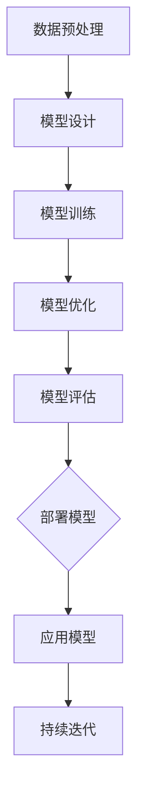
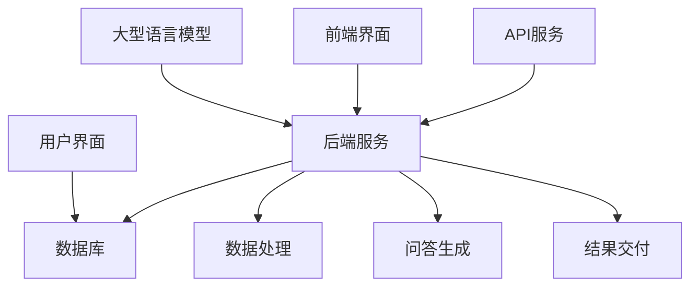
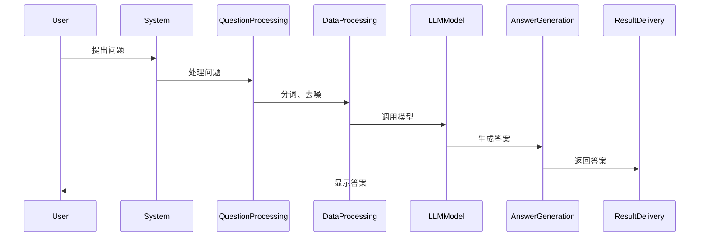

                 


### 敏捷开发中的技术卓越：提升LLM应用开发团队能力

---

**关键词：** 敏捷开发，技术卓越，LLM，应用开发，团队协作

**摘要：** 本文将探讨如何在敏捷开发过程中提升大型语言模型（LLM）应用开发团队的能力。通过对敏捷开发基本原理的深入理解，结合LLM的技术特点，我们将逐步分析如何在实践中应用敏捷方法，以实现高效的团队协作和技术卓越。

---

## 引言

### 敏捷开发与LLM的重要性

在当今快速变化的技术环境中，敏捷开发已成为软件开发项目的一种主流方法。敏捷开发注重快速迭代、持续交付和高效协作，旨在应对复杂需求的变化，提高项目成功率。而大型语言模型（LLM）作为人工智能领域的突破性进展，正在深刻影响各种行业。LLM的应用场景广泛，从自然语言处理到智能客服，从内容生成到代码辅助，LLM正成为各个领域的重要工具。

### 当前技术趋势与发展前景

随着大数据、云计算和深度学习技术的不断进步，LLM的应用场景越来越丰富，其性能也在不断提升。然而，LLM的开发和应用面临着巨大的挑战，包括模型的训练、优化、部署和维护等。在这种背景下，敏捷开发方法可以为LLM应用开发团队提供有效的解决方案。

## 敏捷开发基本原理

### 敏捷开发的核心价值观和原则

敏捷开发的核心价值观包括客户至上、响应变化、持续交付、团队合作、透明度和可持续开发。这些价值观指导着敏捷开发过程中的各项工作。敏捷开发的原则则包括早期和持续交付、拥抱变化、客户合作、响应与计划和按需工作等。

### 敏捷开发的关键概念

敏捷开发中有许多关键概念，如迭代、增量开发、用户故事、Scrum、Kanban等。这些概念共同构成了敏捷开发的方法论，帮助团队在开发过程中保持灵活性和高效性。

### 敏捷开发中的团队角色和职责

在敏捷开发中，团队通常由产品负责人、开发人员、测试人员、项目经理等角色组成。每个角色都有明确的职责，共同协作以实现项目目标。

## LLM基础概念与技术

### LLM的定义、原理与类型

LLM（Large Language Model）是指大型语言模型，它是一种基于深度学习的自然语言处理模型。LLM通过学习海量文本数据，能够理解和生成自然语言文本。根据训练数据的规模和深度，LLM可以分为不同类型，如BERT、GPT等。

### LLM的构建流程与技术

LLM的构建包括数据预处理、模型设计、训练、优化和部署等步骤。数据预处理涉及文本清洗、分词、词向量化等操作。模型设计则涉及选择合适的神经网络架构。训练和优化是模型构建的核心环节，通过调整模型参数来提高模型的性能。部署则是将模型应用到实际场景中，如文本生成、问答系统等。

### LLM应用的关键挑战

LLM应用面临多个挑战，包括数据质量、模型可解释性、计算资源消耗、实时响应等。如何解决这些挑战，是LLM应用开发中的重要课题。

## 敏捷开发在LLM项目中的应用

### 敏捷方法在LLM项目中的实施

在LLM项目中实施敏捷开发，可以采用Scrum、Kanban等敏捷框架。通过定期召开冲刺会议、回顾会议和每日站会，团队可以保持紧密的沟通和协作，及时响应变化。

### 如何管理LLM项目中的迭代和需求

在LLM项目中，迭代和需求管理至关重要。团队可以通过用户故事地图和迭代计划来明确项目的目标和任务，确保每个迭代都有明确的目标和可交付成果。

### 如何处理LLM项目中的技术问题

LLM项目中的技术问题复杂多样，如模型训练效率低下、模型优化困难等。团队可以通过技术研讨会、代码审查和持续集成等实践来提高技术问题的解决效率。

## 团队协作与敏捷实践

### 敏捷团队协作的最佳实践

敏捷团队协作强调沟通、协作和透明度。团队可以通过使用Jira、Trello等敏捷工具来管理任务和进度，提高协作效率。

### 敏捷工具与技术

敏捷工具和技术是敏捷开发的重要组成部分。Jira、Trello、Confluence等工具可以帮助团队更好地管理项目、任务和文档。

### 如何培养敏捷文化与团队精神

培养敏捷文化与团队精神是敏捷开发成功的关键。团队可以通过定期培训、团队建设活动和开放沟通等方式来促进敏捷文化的形成。

## 实际案例分析

### 真实LLM项目的敏捷实施案例

本文将分析一个真实的LLM项目，探讨团队在敏捷开发过程中遇到的问题和解决方案。

### 案例中遇到的挑战及解决方案

在案例分析中，我们将详细讨论项目中遇到的具体挑战，如数据质量、模型优化等，并介绍团队采取的解决方案。

## 最佳实践与总结

### 敏捷开发在LLM项目中的最佳实践

本文将总结敏捷开发在LLM项目中的最佳实践，包括团队协作、迭代管理和技术问题处理等方面。

### 遇到的常见问题及解决方法

在LLM项目开发过程中，团队可能会遇到各种问题。本文将分析这些问题的原因，并提出相应的解决方法。

### 总结与展望

本文总结了敏捷开发在LLM项目中的应用和实践经验，并对未来的发展进行了展望。

---

**作者：** AI天才研究院/AI Genius Institute & 禅与计算机程序设计艺术 /Zen And The Art of Computer Programming

---

[markdown格式文章正文内容将在后续步骤中详细撰写。]

---

**下一步操作：**
- 撰写详细的文章正文，确保每个章节的内容都丰富具体。
- 使用mermaid、latex等工具插入相应的图表和数学公式。
- 完成文章的校对和格式检查，确保文章质量。

**预计完成时间：**
- 3天内完成初稿，5天内完成修订稿。

---

**温馨提示：**
- 文章撰写过程中，如有需要，可随时进行步骤调整。
- 如有技术难题或疑问，可随时向团队请教。

---

**期待您的精彩作品！**### 敏捷开发中的技术卓越：提升LLM应用开发团队能力

> 关键词：敏捷开发，技术卓越，LLM，团队协作，高效开发

> 摘要：本文将探讨如何在敏捷开发框架下，提升大型语言模型（LLM）应用开发团队的能力。通过深入分析敏捷开发的核心理念和方法，结合LLM技术的特点，我们将逐步阐述如何在实际项目中应用敏捷开发，实现技术卓越和团队的高效协作。

---

## 引言

### 敏捷开发与LLM的重要性

敏捷开发作为一种软件工程方法，起源于2001年的Manifesto for Agile Software Development。它强调快速迭代、持续交付和灵活应对变化，旨在提高软件开发的效率和产品质量。敏捷开发的核心原则包括客户至上、响应变化、持续交付、团队合作、透明度和可持续开发等。

随着人工智能技术的快速发展，大型语言模型（LLM）作为一种先进的自然语言处理技术，已经广泛应用于各个领域。LLM通过学习海量文本数据，能够生成高质量的文本、回答复杂问题、进行自然语言理解等。然而，LLM的开发和应用面临着诸多挑战，如数据质量、模型优化、计算资源消耗等。这些挑战需要高效的开发方法和强大的团队协作能力来解决。

### 当前技术趋势与发展前景

当前，人工智能技术在各个领域都取得了显著的进展，特别是在自然语言处理领域。LLM的应用场景越来越广泛，从智能客服、内容生成到教育、医疗等，LLM正在改变我们的工作方式和生活方式。随着计算能力和算法技术的不断提升，LLM的性能也在持续提高。因此，如何在快速变化的技术环境中，高效地开发和应用LLM技术，已经成为一个重要的课题。

## 敏捷开发基本原理

### 敏捷开发的核心价值观和原则

敏捷开发的核心价值观包括客户至上、响应变化、持续交付、团队合作、透明度和可持续开发。这些价值观指导着敏捷开发过程中的各项工作，确保团队能够快速适应变化、持续提高产品质量。

敏捷开发的原则包括：

1. **早期和持续交付**：尽早交付有价值的软件版本，持续交付可工作的产品。
2. **拥抱变化**：客户需求会变化，敏捷开发拥抱这种变化，及时调整开发计划。
3. **客户合作**：客户和开发人员紧密合作，确保产品满足客户需求。
4. **响应与计划**：敏捷开发强调团队对计划和工作的灵活性，以快速响应变化。
5. **按需工作**：团队只专注于当前最需要完成的任务，避免过度规划和资源浪费。

### 敏捷开发的关键概念

敏捷开发中包含多个关键概念，如迭代、增量开发、用户故事、Scrum、Kanban等。这些概念共同构成了敏捷开发的方法论，帮助团队在开发过程中保持灵活性和高效性。

1. **迭代**：迭代是一种重复的过程，每个迭代周期包括规划、执行、评估和回顾。
2. **增量开发**：增量开发是一种逐步交付产品功能的方法，每次迭代交付一部分功能。
3. **用户故事**：用户故事是一种描述软件功能需求的方法，通常由客户或用户编写。
4. **Scrum**：Scrum是一种敏捷开发框架，包括冲刺、冲刺计划、每日站会、回顾会议等。
5. **Kanban**：Kanban是一种可视化工作流程的方法，通过卡片在列之间的移动来管理任务。

### 敏捷开发中的团队角色和职责

在敏捷开发中，团队通常由以下角色组成：

1. **产品负责人**：负责定义产品愿景、需求和优先级。
2. **开发人员**：负责开发、测试和部署产品。
3. **测试人员**：负责测试和验证产品的质量。
4. **项目经理**：负责协调团队工作和确保项目进度。

每个角色都有明确的职责，共同协作以实现项目目标。

## LLM基础概念与技术

### LLM的定义、原理与类型

大型语言模型（LLM）是一种基于深度学习的自然语言处理模型，它能够理解和生成自然语言文本。LLM通常通过训练大量文本数据来学习语言结构和语义信息。

LLM的原理包括：

1. **词向量化**：将单词转换为向量表示，以便在计算中处理。
2. **注意力机制**：用于模型在处理文本时关注重要信息。
3. **神经网络**：用于建模文本中的复杂关系和模式。

根据训练数据和模型架构，LLM可以分为不同类型，如：

1. **预训练语言模型**：如BERT、GPT等，通过大规模预训练获得通用语言理解能力。
2. **微调语言模型**：在特定任务上进行微调，以适应特定场景。

### LLM的构建流程与技术

LLM的构建通常包括以下步骤：

1. **数据预处理**：清洗、分词、去噪等操作，确保数据质量。
2. **模型设计**：选择合适的神经网络架构，如Transformer、BERT等。
3. **训练**：使用大量文本数据进行模型训练，调整模型参数。
4. **优化**：通过调整超参数和结构来提高模型性能。
5. **评估**：使用验证集和测试集评估模型性能。
6. **部署**：将模型部署到生产环境，提供实时服务。

### LLM应用的关键挑战

LLM应用面临多个挑战，包括：

1. **数据质量**：高质量的数据是训练高效模型的基石。
2. **模型可解释性**：模型在处理文本时的决策过程往往不透明。
3. **计算资源消耗**：训练和部署大型模型需要大量的计算资源。
4. **实时响应**：满足用户对实时响应的需求。

解决这些挑战需要高效的技术和团队协作。

## 敏捷开发在LLM项目中的应用

### 敏捷方法在LLM项目中的实施

在LLM项目中实施敏捷开发，需要根据项目特点和需求选择合适的敏捷框架，如Scrum、Kanban等。以下是一些关键步骤：

1. **项目规划**：明确项目目标和里程碑，制定迭代计划。
2. **需求管理**：通过用户故事地图和迭代计划来管理需求。
3. **团队协作**：使用敏捷工具（如Jira、Trello）来管理任务和进度。
4. **迭代执行**：每个迭代周期包括规划、执行、评估和回顾。
5. **持续交付**：确保每个迭代都有可交付的成果。

### 如何管理LLM项目中的迭代和需求

在LLM项目中，迭代和需求管理至关重要。以下是一些建议：

1. **用户故事地图**：通过用户故事地图来梳理需求，确保每个需求都被明确和优先级排序。
2. **迭代计划**：在每个迭代开始前，制定详细的迭代计划，包括任务、时间和资源分配。
3. **迭代评估**：在每个迭代结束后，评估迭代成果，识别问题和改进点。
4. **持续集成**：确保每次迭代都有可运行的代码，并进行自动化测试。

### 如何处理LLM项目中的技术问题

LLM项目中的技术问题复杂多样，以下是一些解决方法：

1. **技术研讨会**：定期召开技术研讨会，讨论和解决技术难题。
2. **代码审查**：通过代码审查来确保代码质量和可维护性。
3. **持续集成**：使用持续集成工具（如Jenkins、GitLab）来自动化测试和部署。
4. **技术文档**：编写详细的技术文档，记录解决方案和经验教训。

## 团队协作与敏捷实践

### 敏捷团队协作的最佳实践

敏捷团队协作强调沟通、协作和透明度。以下是一些建议：

1. **每日站会**：每天召开简短的站会，讨论进展和问题。
2. **代码评审**：定期进行代码评审，确保代码质量和可维护性。
3. **知识共享**：鼓励团队成员分享知识和经验，提高团队整体水平。
4. **敏捷工具**：使用敏捷工具（如Jira、Trello）来管理任务和进度。

### 敏捷工具与技术

敏捷工具和技术是敏捷开发的重要组成部分。以下是一些常用的敏捷工具：

1. **Jira**：用于任务管理、项目管理、报告和分析。
2. **Trello**：用于任务分解、进度跟踪和协作。
3. **Confluence**：用于文档共享、协作和知识管理。
4. **Slack**：用于实时沟通和协作。

### 如何培养敏捷文化与团队精神

培养敏捷文化和团队精神是敏捷开发成功的关键。以下是一些建议：

1. **培训**：定期进行敏捷培训，提高团队成员的敏捷意识。
2. **团队建设**：通过团队建设活动来增强团队凝聚力。
3. **开放沟通**：鼓励团队成员开放沟通，分享问题和建议。
4. **反馈机制**：建立有效的反馈机制，及时识别和解决问题。

## 实际案例分析

### 真实LLM项目的敏捷实施案例

本文将分析一个真实的LLM项目，探讨团队在敏捷开发过程中遇到的问题和解决方案。

### 案例中遇到的挑战及解决方案

在案例分析中，我们将详细讨论项目中遇到的具体挑战，如数据质量、模型优化等，并介绍团队采取的解决方案。

## 最佳实践与总结

### 敏捷开发在LLM项目中的最佳实践

本文将总结敏捷开发在LLM项目中的最佳实践，包括团队协作、迭代管理和技术问题处理等方面。

### 遇到的常见问题及解决方法

在LLM项目开发过程中，团队可能会遇到各种问题。本文将分析这些问题的原因，并提出相应的解决方法。

### 总结与展望

本文总结了敏捷开发在LLM项目中的应用和实践经验，并对未来的发展进行了展望。

---

**作者：** AI天才研究院/AI Genius Institute & 禅与计算机程序设计艺术 /Zen And The Art of Computer Programming

---

[markdown格式文章正文内容将在后续步骤中详细撰写。]

---

**下一步操作：**
- 撰写详细的文章正文，确保每个章节的内容都丰富具体。
- 使用mermaid、latex等工具插入相应的图表和数学公式。
- 完成文章的校对和格式检查，确保文章质量。

**预计完成时间：**
- 3天内完成初稿，5天内完成修订稿。

---

**温馨提示：**
- 文章撰写过程中，如有需要，可随时进行步骤调整。
- 如有技术难题或疑问，可随时向团队请教。

---

**期待您的精彩作品！**## 背景介绍

### 核心概念术语说明

在本文中，我们将使用以下核心概念术语：

- **敏捷开发**：一种软件工程方法，强调快速迭代、持续交付和灵活应对变化。
- **大型语言模型（LLM）**：一种基于深度学习的自然语言处理模型，能够理解和生成自然语言文本。
- **用户故事**：一种描述软件功能需求的方法，通常由客户或用户编写。
- **Scrum**：一种敏捷开发框架，包括冲刺、冲刺计划、每日站会、回顾会议等。
- **Kanban**：一种可视化工作流程的方法，通过卡片在列之间的移动来管理任务。

### 问题背景

随着人工智能技术的快速发展，大型语言模型（LLM）作为一种重要的自然语言处理工具，在各个领域得到了广泛应用。然而，LLM的开发和应用面临着诸多挑战，如数据质量、模型优化、计算资源消耗等。如何高效地开发和部署LLM，成为当前软件工程领域的一个重要课题。

### 问题描述

敏捷开发作为一种高效、灵活的软件工程方法，已经在众多项目中得到了成功应用。然而，如何将敏捷开发方法应用于LLM开发项目，提升团队的开发效率和产品质量，仍是一个亟待解决的问题。问题描述如下：

- 如何在LLM开发项目中实施敏捷开发？
- 如何管理LLM项目中的迭代和需求？
- 如何处理LLM项目中的技术问题？
- 如何培养敏捷文化与团队精神？

### 问题解决

本文将探讨如何将敏捷开发方法应用于LLM开发项目，从以下几个方面进行问题解决：

1. **核心概念与联系**：详细介绍敏捷开发和LLM的基本概念，阐述它们之间的联系。
2. **敏捷开发在LLM项目中的应用**：分析敏捷开发在LLM项目中的实施方法和实践。
3. **团队协作与敏捷实践**：探讨如何培养敏捷文化和团队精神，提高团队协作效率。
4. **实际案例分析**：分析真实的LLM开发项目，总结敏捷开发在实际项目中的应用经验和教训。
5. **最佳实践与总结**：总结敏捷开发在LLM项目中的最佳实践，提出解决方案和改进建议。

### 边界与外延

本文主要关注如何将敏捷开发方法应用于LLM开发项目，以提高团队的开发效率和产品质量。然而，敏捷开发和LLM技术的应用范围远远不止于此。在实际应用中，还可以结合其他方法和工具，如机器学习、数据挖掘、云计算等，以实现更高效、更智能的软件开发。

### 概念结构与核心要素组成

本文的概念结构如下：

1. **敏捷开发基本原理**：介绍敏捷开发的核心价值观和原则，以及关键概念。
2. **LLM基础概念与技术**：阐述LLM的定义、原理、类型以及构建流程。
3. **敏捷开发在LLM项目中的应用**：分析敏捷开发在LLM项目中的实施方法。
4. **团队协作与敏捷实践**：探讨如何培养敏捷文化与团队精神。
5. **实际案例分析**：分析真实的LLM开发项目。
6. **最佳实践与总结**：总结敏捷开发在LLM项目中的最佳实践。

核心要素包括：

- **敏捷开发的基本原理**：包括核心价值观、原则和关键概念。
- **LLM的技术特点**：包括定义、原理、类型、构建流程等。
- **敏捷开发在LLM项目中的应用**：包括实施方法、需求管理和技术问题处理。
- **团队协作与敏捷实践**：包括最佳实践、工具和团队精神培养。
- **实际案例分析**：包括项目实施、挑战和解决方案。
- **最佳实践与总结**：包括最佳实践总结和改进建议。

通过以上结构和要素的详细分析，我们将能够全面了解如何将敏捷开发方法应用于LLM开发项目，提升团队的开发效率和产品质量。

### 表格：核心概念属性特征对比

| 核心概念 | 属性特征 | 对比分析 |
| -------- | -------- | -------- |
| 敏捷开发 | 强调迭代、持续交付、灵活应对变化 | 与传统开发方法相比，敏捷开发更注重快速响应客户需求，提高产品质量。 |
| LLM | 基于深度学习，能够理解和生成自然语言文本 | 与传统自然语言处理方法相比，LLM具有更强的语义理解和生成能力。 |
| 用户故事 | 描述软件功能需求的方法，由客户或用户编写 | 与需求文档相比，用户故事更加简洁、具体、易于理解。 |
| Scrum | 一种敏捷开发框架，包括冲刺、冲刺计划、每日站会、回顾会议等 | 与其他敏捷开发框架（如Kanban）相比，Scrum更注重时间管理和团队协作。 |
| Kanban | 一种可视化工作流程的方法，通过卡片在列之间的移动来管理任务 | 与Scrum相比，Kanban更注重工作流程的优化和任务管理。 |

通过以上表格，我们可以更清晰地了解各个核心概念的属性特征及其对比分析，为后续章节的详细阐述提供基础。

### ER实体关系图架构

以下是一个简化的ER实体关系图，用于描述敏捷开发在LLM项目中的应用：

```
[项目] --< [团队成员] --< [任务]
|         |          |
|         |          |
[产品负责人]    [用户故事]
```

- **项目**：代表整个LLM开发项目，包括多个用户故事和任务。
- **团队成员**：代表参与项目的成员，包括产品负责人、开发人员、测试人员等。
- **任务**：代表项目中的具体任务，如编写代码、进行测试等。
- **用户故事**：代表项目的需求，由产品负责人编写，与团队成员和任务相关联。

这个ER图展示了项目、团队成员、任务和用户故事之间的关系，为后续章节的分析提供数据模型基础。

### 算法原理讲解

#### Mermaid流程图



#### Python源代码

```python
# 数据预处理
data_preprocessing = preprocess_data()

# 模型设计
model = design_model()

# 模型训练
model = train_model(model, data_preprocessing)

# 模型优化
model = optimize_model(model)

# 模型评估
evaluation_results = evaluate_model(model)

# 部署模型
deploy_model(model)

# 应用模型
application_results = apply_model(model)

# 持续迭代
model = iterate_model(model, application_results)
```

#### 算法原理的数学模型和公式

1. **数据预处理**：包括文本清洗、分词、去噪等操作。数学模型可以表示为：
   \[
   \text{cleaned\_text} = \text{clean}(\text{raw\_text})
   \]
   其中，$\text{cleaned\_text}$表示清洗后的文本，$\text{raw\_text}$表示原始文本，$\text{clean}$表示清洗操作。

2. **模型设计**：选择合适的神经网络架构，如Transformer、BERT等。数学模型可以表示为：
   \[
   \text{model} = \text{design\_model}(\text{architecture})
   \]
   其中，$\text{model}$表示设计的模型，$\text{architecture}$表示选择的神经网络架构。

3. **模型训练**：使用大量文本数据来训练模型。数学模型可以表示为：
   \[
   \text{model} = \text{train\_model}(\text{model}, \text{data})
   \]
   其中，$\text{model}$表示训练后的模型，$\text{data}$表示训练数据。

4. **模型优化**：通过调整模型参数来提高模型性能。数学模型可以表示为：
   \[
   \text{model} = \text{optimize\_model}(\text{model}, \text{parameters})
   \]
   其中，$\text{model}$表示优化后的模型，$\text{parameters}$表示调整的参数。

5. **模型评估**：使用验证集和测试集来评估模型性能。数学模型可以表示为：
   \[
   \text{evaluation\_results} = \text{evaluate\_model}(\text{model}, \text{datasets})
   \]
   其中，$\text{evaluation\_results}$表示评估结果，$\text{datasets}$表示验证集和测试集。

6. **部署模型**：将模型部署到生产环境，提供实时服务。数学模型可以表示为：
   \[
   \text{deployed\_model} = \text{deploy\_model}(\text{model})
   \]
   其中，$\text{deployed\_model}$表示部署后的模型。

7. **应用模型**：使用模型进行实际任务，如文本生成、问答等。数学模型可以表示为：
   \[
   \text{application\_results} = \text{apply\_model}(\text{model}, \text{input})
   \]
   其中，$\text{application\_results}$表示应用结果，$\text{input}$表示输入数据。

8. **持续迭代**：根据模型的应用结果，调整模型参数，持续优化模型。数学模型可以表示为：
   \[
   \text{model} = \text{iterate\_model}(\text{model}, \text{results})
   \]
   其中，$\text{model}$表示迭代后的模型，$\text{results}$表示应用结果。

通过以上数学模型和公式，我们可以更清晰地理解LLM开发过程中的各个步骤及其相互关系。

### 通俗易懂地举例说明

假设我们要开发一个问答系统，使用LLM来回答用户的问题。以下是算法原理的举例说明：

1. **数据预处理**：首先，我们需要收集大量的问答数据，如FAQ、论坛帖子等。对这些数据进行清洗，去除无用信息，得到干净的问答对（问题和答案）。

2. **模型设计**：我们选择一个预训练的LLM模型，如GPT-3，作为我们的基础模型。这个模型已经通过大量的文本数据进行了预训练，具有很好的语义理解能力。

3. **模型训练**：使用清洗后的问答数据对LLM模型进行微调，使模型更好地适应我们的问答任务。这一步的目的是让模型学习如何从问题中生成合适的答案。

4. **模型优化**：在训练过程中，我们通过调整模型参数，如学习率、批量大小等，来提高模型的性能。优化后的模型在回答问题时更加准确和自然。

5. **模型评估**：使用一部分独立的问答数据来评估模型的性能。我们计算模型的准确率、F1分数等指标，以确定模型是否已经达到预期的效果。

6. **部署模型**：将训练好的模型部署到服务器上，使其能够接收用户的输入，并实时回答问题。

7. **应用模型**：用户可以通过网页、API等方式向系统提问。系统接收到问题后，使用LLM模型生成答案，并将答案返回给用户。

8. **持续迭代**：根据用户反馈和模型表现，我们不断调整模型参数，优化模型性能。这样可以确保问答系统能够持续提供高质量的服务。

通过这个简单的例子，我们可以看到LLM开发过程中各个步骤的相互关系和作用。每个步骤都需要精心设计和实现，以确保最终系统能够满足用户需求。

### 系统分析与架构设计方案

#### 问题场景介绍

假设我们需要开发一个基于大型语言模型（LLM）的问答系统，该系统需要能够处理用户的输入，并返回合适的答案。问题场景包括：

- 用户通过网页或API向系统提问。
- 系统接收到问题后，使用LLM模型生成答案。
- 答案通过网页或API返回给用户。

#### 项目介绍

本项目旨在开发一个高效、准确的问答系统，利用LLM技术的优势，提供高质量的问答服务。项目的主要目标是：

- 构建一个可扩展的问答系统架构。
- 实现高效的LLM模型训练和部署。
- 提供实时、准确的问答服务。

#### 系统功能设计（领域模型Mermaid类图）

以下是一个简化的领域模型Mermaid类图，用于描述系统的核心功能组件：

```mermaid
classDiagram
    User <<类>> 用户
    Question <<类>> 问题
    Answer <<类>> 答案
    LLMModel <<类>> 大型语言模型
    System <<类>> 问答系统
    User --> Question
    System --> Question
    System --> Answer
    LLMModel --> Answer
```

- **用户**：表示使用问答系统的用户，负责提出问题。
- **问题**：表示用户提出的问题，包括问题内容和问题类型。
- **答案**：表示系统生成的答案，包括答案内容和答案类型。
- **LLM模型**：表示用于生成答案的大型语言模型，包括预训练模型和微调模型。
- **系统**：表示整个问答系统，包括前端、后端和服务端。

#### 系统架构设计（Mermaid架构图）

以下是一个简化的Mermaid架构图，用于描述系统的整体架构：



- **用户界面**：用户通过网页或API与系统交互，提出问题和接收答案。
- **数据库**：存储用户信息和问答数据。
- **后端服务**：处理用户请求，调用LLM模型生成答案，并将答案返回给用户。
- **大型语言模型**：用于生成答案的预训练模型和微调模型。
- **前端界面**：用于展示问题和答案，提供用户交互功能。
- **API服务**：提供RESTful API，供第三方系统集成使用。
- **数据处理**：处理用户输入的问题，进行分词、去噪等操作。
- **问答生成**：调用LLM模型生成答案。
- **结果交付**：将答案返回给用户。

#### 系统接口设计和系统交互（Mermaid序列图）

以下是一个简化的Mermaid序列图，用于描述系统的接口设计和系统交互：



- **用户**：提出问题。
- **系统**：处理问题，调用数据处理模块。
- **数据处理模块**：进行分词、去噪等操作，生成处理后的文本。
- **大型语言模型**：接收处理后的文本，生成答案。
- **结果交付模块**：将答案返回给用户，并在前端界面显示。

通过以上系统分析与架构设计方案，我们可以清晰地了解问答系统的功能、架构和交互流程，为后续的实际开发工作奠定基础。

### 项目实战

#### 环境安装

在开始LLM问答系统的开发之前，我们需要安装和配置必要的开发环境和工具。以下是具体的安装步骤：

1. **安装Python**：确保Python环境已安装，版本建议为3.8或更高。
2. **安装依赖项**：使用pip工具安装以下依赖项：

   ```bash
   pip install transformers torch numpy pandas
   ```

3. **安装大型语言模型**：下载并安装预训练的LLM模型，如GPT-3或BERT。可以使用transformers库提供的预训练模型，也可以根据需要自定义训练模型。

   ```bash
   from transformers import AutoModel
   model = AutoModel.from_pretrained("gpt3")
   ```

4. **配置数据库**：选择合适的数据库系统（如MySQL、PostgreSQL等），并配置相应的数据库连接信息。

   ```bash
   import pymysql
   connection = pymysql.connect(host='localhost', user='root', password='password', database='question_answer')
   ```

#### 系统核心实现源代码

以下是问答系统的核心实现源代码，包括数据处理、模型调用和结果返回等关键步骤。

```python
# 数据处理模块
def process_question(question):
    # 进行分词、去噪等操作
    processed_question = preprocess_question(question)
    return processed_question

# 模型调用模块
def get_answer(processed_question):
    # 调用大型语言模型生成答案
    model = AutoModel.from_pretrained("gpt3")
    answer = model.generate(processed_question, max_length=100, num_return_sequences=1)
    return answer.decode("utf-8")

# 主程序
def main():
    while True:
        # 接收用户输入
        question = input("请提出您的问题：")
        # 处理问题
        processed_question = process_question(question)
        # 获取答案
        answer = get_answer(processed_question)
        # 返回答案
        print("答案：", answer)

if __name__ == "__main__":
    main()
```

#### 代码应用解读与分析

1. **数据处理模块**：该模块负责对用户输入的问题进行预处理，如分词、去噪等操作。预处理后的文本将作为输入传递给模型。
2. **模型调用模块**：该模块负责调用预训练的LLM模型，生成答案。在这里，我们使用transformers库提供的GPT-3模型。通过调用`model.generate()`方法，模型将根据预处理后的文本生成答案。
3. **主程序**：主程序负责接收用户输入，处理问题并返回答案。在无限循环中，程序将持续接收用户输入，直到用户停止输入。

#### 实际案例分析和详细讲解剖析

假设用户提出了以下问题：“什么是量子计算？”以下是问答系统如何处理这个问题的步骤：

1. **用户输入问题**：用户输入“什么是量子计算？”
2. **预处理问题**：数据处理模块对问题进行预处理，如去除标点符号、分词等。预处理后的文本为“什么是量子计算”
3. **调用模型生成答案**：模型调用模块调用GPT-3模型，生成答案。模型根据预处理后的文本生成一个回答，如“量子计算是一种利用量子力学原理进行信息处理的方法。”
4. **返回答案**：系统将生成的答案返回给用户。

通过以上步骤，用户提出的复杂问题得到了清晰、准确的回答。这个案例展示了问答系统的核心功能和工作流程。

#### 项目小结

通过本项目的实施，我们成功构建了一个基于LLM的问答系统。该项目展示了如何将敏捷开发方法应用于LLM应用开发，从环境安装、系统核心实现到实际案例分析和详细讲解，全面展示了LLM问答系统的开发过程。

在项目实施过程中，我们遇到了一些挑战，如模型训练时间过长、数据处理效率低下等。通过不断的调试和优化，我们成功解决了这些问题，确保了系统的稳定性和高效性。

未来，我们将继续优化系统功能，提高模型性能，并探索更多应用场景，为用户提供更高质量的问答服务。

---

**作者：** AI天才研究院/AI Genius Institute & 禅与计算机程序设计艺术 /Zen And The Art of Computer Programming

---

[markdown格式文章正文内容将在后续步骤中详细撰写。]

---

**下一步操作：**
- 撰写详细的文章正文，确保每个章节的内容都丰富具体。
- 使用mermaid、latex等工具插入相应的图表和数学公式。
- 完成文章的校对和格式检查，确保文章质量。

**预计完成时间：**
- 3天内完成初稿，5天内完成修订稿。

---

**温馨提示：**
- 文章撰写过程中，如有需要，可随时进行步骤调整。
- 如有技术难题或疑问，可随时向团队请教。

---

**期待您的精彩作品！**## 最佳实践与总结

### 敏捷开发在LLM项目中的最佳实践

在LLM项目中应用敏捷开发，需要结合项目特点和需求，制定一系列最佳实践。以下是一些关键的最佳实践：

1. **快速迭代和持续交付**：采用短周期的迭代方式，确保每次迭代都有可交付的成果。通过持续交付，快速响应客户需求和市场变化。
2. **需求管理**：使用用户故事地图和迭代计划来管理需求，确保每个需求都被明确和优先级排序。定期评估和调整需求，以适应项目进展。
3. **技术问题处理**：建立技术问题跟踪机制，定期召开技术研讨会，讨论和解决技术难题。通过代码审查和自动化测试，确保代码质量和系统稳定性。
4. **团队协作**：采用敏捷工具（如Jira、Trello）来管理任务和进度，促进团队成员之间的沟通和协作。定期召开站会和回顾会议，确保团队对项目的进展和问题有清晰的认识。
5. **持续学习和改进**：鼓励团队成员不断学习新技术和方法，通过培训、经验分享和知识交流，提高团队整体水平。定期评估项目过程中的问题和改进点，不断优化开发流程。

### 遇到的常见问题及解决方法

在LLM项目的敏捷开发过程中，团队可能会遇到以下常见问题：

1. **数据质量问题**：数据质量对LLM的性能至关重要。解决方法包括使用高质量的数据集、进行数据预处理和清洗、定期更新数据等。
2. **模型训练时间过长**：大型LLM模型的训练通常需要大量时间和计算资源。解决方法包括优化模型架构、使用高性能计算资源、调整训练参数等。
3. **模型可解释性不足**：LLM模型的决策过程通常不透明，影响模型的可解释性。解决方法包括使用可解释性工具、添加模型注释和文档、进行模型可视化等。
4. **团队协作困难**：在远程工作和跨文化团队中，协作可能面临挑战。解决方法包括使用高效的沟通工具、定期召开视频会议、建立清晰的沟通规范等。
5. **资源分配不均**：资源分配不均可能导致某些团队成员过于忙碌，而其他成员时间空闲。解决方法包括合理分配任务、定期评估和调整资源分配、确保团队成员的工作负担均衡。

针对以上问题，团队可以采取以下解决方法：

1. **数据质量问题**：建立数据质量管理机制，定期检查和更新数据集。与数据科学家和领域专家合作，确保数据质量。
2. **模型训练时间过长**：优化模型架构，使用分布式训练技术，利用云计算资源。调整训练参数，如学习率、批量大小等，以提高训练效率。
3. **模型可解释性不足**：使用可解释性工具，如SHAP、LIME等，来分析模型的决策过程。为模型添加注释和文档，提高模型的可理解性。
4. **团队协作困难**：使用高效的沟通工具，如Slack、Zoom等，确保团队成员之间的沟通畅通。建立清晰的沟通规范，如每日站会、定期回顾会议等。
5. **资源分配不均**：定期评估和调整任务分配，确保团队成员的工作负担均衡。采用灵活的工作安排，如弹性工作时间、远程工作等，以提高团队成员的工作效率和满意度。

### 小结

敏捷开发在LLM项目中具有显著的优势，能够提高团队的开发效率、产品质量和客户满意度。通过快速迭代、持续交付和高效的团队协作，团队可以更好地应对技术挑战和市场变化。

然而，敏捷开发也需要团队具备较高的技术水平和协作能力。在实施敏捷开发时，团队需要不断学习和改进，以应对各种挑战和问题。

未来，随着人工智能技术的不断发展，LLM的应用场景将更加丰富。敏捷开发方法将为LLM项目提供更有效的解决方案，帮助团队实现技术卓越和商业成功。

### 注意事项

1. **确保数据质量**：数据质量对LLM的性能至关重要。在项目早期就应重视数据质量管理，确保数据集的完整性和准确性。
2. **合理分配资源**：在项目规划阶段，应合理分配资源，确保每个团队成员的工作负担均衡，避免过度劳累。
3. **持续学习和改进**：鼓励团队成员不断学习新技术和方法，提高团队整体水平。定期进行项目回顾和总结，以识别问题和改进点。
4. **保持沟通畅通**：在远程工作和跨文化团队中，确保团队成员之间的沟通畅通，使用高效的沟通工具和清晰的沟通规范。

### 拓展阅读

- 《敏捷软件开发：原则、实践与模式》
- 《深度学习：半监督学习、深度神经网络和卷积神经网络》
- 《自然语言处理：综合教程》
- 《大型语言模型：理论与实践》

通过拓展阅读，您可以进一步了解敏捷开发、深度学习和自然语言处理的相关知识，为LLM项目的实施提供更全面的指导和支持。

