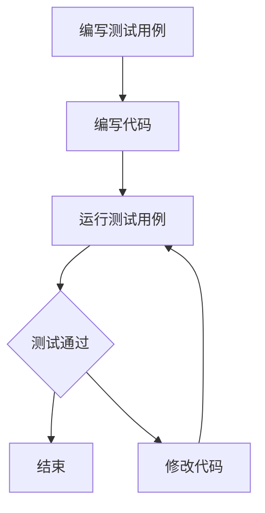
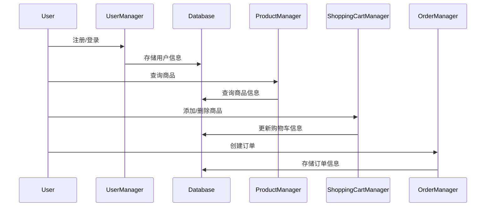

                 

### 第一部分：背景介绍

#### 问题背景

随着软件行业的快速发展，开发团队面临的挑战也日益增多。传统的软件开发模式，如瀑布模型，虽然在某些场景下能够有效运作，但往往难以应对需求变更、快速迭代等现代软件开发需求。敏捷开发作为一种应对快速变化需求的方法，逐渐受到开发者的青睐。敏捷开发强调团队协作、用户反馈和快速迭代，通过短周期的迭代来逐步完善产品。

然而，敏捷开发并非万能。在敏捷开发过程中，开发团队往往面临以下挑战：

1. **需求变更频繁**：敏捷开发允许用户在开发过程中提出变更需求，但频繁的需求变更可能导致开发工作难以推进，影响项目进度和质量。
2. **代码质量保障**：在快速迭代的背景下，如何确保代码质量，避免因赶进度而导致的缺陷积累，成为一个重要问题。
3. **团队协作**：敏捷开发强调团队协作，但如何协调开发、测试和运维等不同角色的职责，确保项目顺利进行，需要团队成员具备良好的沟通和协作能力。

为了应对这些挑战，开发团队需要寻找有效的技术实践方法。测试驱动开发（TDD）作为一种以测试为核心的软件开发方法，被认为能够在敏捷开发中发挥重要作用。

#### 问题描述

在敏捷开发过程中，开发团队通常面临以下具体问题：

1. **需求变更频繁**：敏捷开发强调快速响应需求变更，但频繁的需求变更可能导致开发工作难以推进。在TDD实践中，开发团队可以通过编写详细的测试用例来提前预见需求变更可能带来的影响，从而更好地应对变更。
   
2. **代码质量保障**：敏捷开发强调快速迭代，但在快速迭代的过程中，如何确保代码质量成为一个难题。TDD通过强制编写测试用例，可以提前检测出代码中的潜在问题，提高代码质量。

3. **团队协作**：敏捷开发强调团队协作，但不同角色之间的协作往往存在困难。TDD要求开发人员和测试人员紧密合作，共同编写和执行测试用例，有助于提高团队协作效率。

#### 问题解决

TDD提供了一种解决方案，能够有效应对敏捷开发过程中面临的挑战。TDD是一种以测试为核心的软件开发方法，其核心思想是通过编写测试用例来驱动软件开发，确保代码质量和响应速度。

1. **预防缺陷**：TDD通过提前编写测试用例，可以在代码编写之前就预见潜在的问题，从而预防缺陷的产生。这有助于提高代码质量，降低缺陷率。

2. **提高代码质量**：TDD鼓励编写可测试的代码，有助于提高代码的可读性和可维护性。同时，测试用例的编写过程也可以帮助开发人员更好地理解需求，减少因需求理解偏差导致的代码质量问题。

3. **促进团队协作**：TDD要求开发人员和测试人员紧密合作，共同编写和执行测试用例。这种协作模式有助于提高团队协作效率，减少因沟通不畅导致的开发问题。

#### 边界与外延

TDD在敏捷开发中的应用不仅限于软件开发阶段，还可以延伸到需求分析、设计等前期阶段，以及运维、持续集成等后期阶段。此外，TDD不仅适用于传统的软件项目，也适用于大型分布式系统、人工智能（AI）等领域。通过灵活应用TDD，开发团队能够更好地应对敏捷开发过程中的各种挑战。

### 核心概念与联系

#### 核心概念

1. **敏捷开发**：敏捷开发是一种以人为核心、迭代、增量的软件开发方法。它强调团队协作、用户反馈和快速迭代，通过短周期的迭代来逐步完善产品。

2. **测试驱动开发（TDD）**：测试驱动开发是一种以测试为核心的软件开发方法。它通过编写测试用例来驱动软件开发，确保代码质量和响应速度。TDD包括三个核心步骤：编写测试用例、编写代码和运行测试用例。

#### 概念属性特征对比表格

| 概念       | 特征                                                         |
|------------|--------------------------------------------------------------|
| 敏捷开发   | 强调快速迭代、用户反馈、团队协作                             |
| TDD        | 强调测试先行、预防缺陷、提高代码质量                         |

#### ER实体关系图架构

```mermaid
erDiagram
    Developer ||--|{ Project }|--| DeveloperProject : "开发项目"
    Tester ||--|{ Project }|--| TesterProject : "测试项目"
    Project ||--|{ Feature }|--| ProjectFeature : "项目特性"
```

### 算法原理讲解

TDD的算法原理可以概括为以下三个步骤：

1. **编写测试用例**：首先，根据需求编写测试用例，确保测试用例能够覆盖所有的功能点。

2. **编写代码**：然后，根据测试用例编写代码，实现所需的功能。

3. **运行测试用例**：最后，运行测试用例，确保所有的测试用例都能够通过。

以下是一个简单的TDD算法流程图：



### 数学模型和数学公式

在TDD中，一个关键的概念是测试覆盖率（Test Coverage），它用来衡量测试用例对代码的覆盖程度。测试覆盖率可以通过以下公式计算：

$$
\text{测试覆盖率} = \frac{\text{已覆盖的代码行数}}{\text{总代码行数}} \times 100\%
$$

例如，如果一个模块共有100行代码，其中80行代码被测试用例覆盖，那么该模块的测试覆盖率为80%。

### 系统分析与架构设计方案

#### 问题场景介绍

假设我们正在开发一个在线购物系统，该系统需要实现用户注册、商品浏览、购物车管理、订单处理等功能。在这个场景下，我们将通过TDD方法来确保系统的稳定性和可靠性。

#### 项目介绍

本项目旨在通过TDD方法，实现一个具有基本功能的在线购物系统，并在敏捷开发过程中持续迭代和优化。项目的主要目标包括：

1. **用户管理**：实现用户注册、登录、个人信息管理等功能。
2. **商品管理**：实现商品分类、商品详情展示、商品搜索等功能。
3. **购物车管理**：实现商品添加、删除、更新购物车商品数量等功能。
4. **订单处理**：实现订单创建、订单状态更新、订单详情展示等功能。

#### 系统功能设计

系统功能设计包括以下核心功能模块：

1. **用户管理模块**：负责用户注册、登录、个人信息管理等功能。
2. **商品管理模块**：负责商品分类、商品详情展示、商品搜索等功能。
3. **购物车管理模块**：负责商品添加、删除、更新购物车商品数量等功能。
4. **订单处理模块**：负责订单创建、订单状态更新、订单详情展示等功能。

#### 领域模型

领域模型是系统功能设计的核心，它定义了系统的核心实体和实体之间的关系。以下是一个简单的领域模型类图：

```mermaid
classDiagram
    User <|-- UserManager
    Product <|-- ProductManager
    ShoppingCart <|-- ShoppingCartManager
    Order <|-- OrderManager
    UserManager {
        +String username
        +String password
        +List<Order> orders
    }
    ProductManager {
        +String name
        +Float price
        +Boolean inStock
    }
    ShoppingCartManager {
        +User user
        +List<Product> products
    }
    OrderManager {
        +User user
        +List<Product> products
        +Float total
        +String status
    }
```

#### 系统架构设计

系统架构设计是确保系统可扩展性和性能的关键。以下是一个简单的系统架构图：



#### 系统接口设计

系统接口设计是确保不同模块之间能够高效协作的关键。以下是一个简单的系统接口设计：

```mermaid
classDiagram
    UserManager --|>> UserController
    ProductManager --|>> ProductController
    ShoppingCartManager --|>> ShoppingCartController
    OrderManager --|>> OrderController
```

#### 系统交互

系统交互设计是确保系统各模块能够协同工作，为用户提供流畅体验的关键。以下是一个简单的系统交互序列图：

```mermaid
sequenceDiagram
    User ->> UserController: 注册/登录
    UserController ->> UserManager: 存储用户信息
    UserManager --|>> Database: 存储用户信息
    User ->> ProductController: 查询商品
    ProductController ->> ProductManager: 查询商品信息
    ProductManager --|>> Database: 查询商品信息
    User ->> ShoppingCartController: 添加/删除商品
    ShoppingCartController ->> ShoppingCartManager: 更新购物车信息
    ShoppingCartManager --|>> Database: 更新购物车信息
    User ->> OrderController: 创建订单
    OrderController ->> OrderManager: 存储订单信息
    OrderManager --|>> Database: 存储订单信息
```

通过上述系统分析与架构设计方案，我们能够更好地理解TDD在敏捷开发中的应用，为后续的项目实施提供有力的支持。

### 项目实战

#### 环境安装

在进行TDD实践之前，我们需要首先安装相应的开发环境和工具。以下是一个典型的安装步骤：

1. **安装Python环境**：首先，确保系统已经安装了Python环境，版本建议为3.8或更高。
2. **安装TDD工具**：安装TDD工具，如pytest和unittest。可以使用以下命令进行安装：
   ```shell
   pip install pytest
   pip install unittest
   ```
3. **安装数据库**：选择合适的数据库，如MySQL、PostgreSQL或SQLite，并安装相关驱动。例如，安装MySQL驱动可以使用以下命令：
   ```shell
   pip install mysql-connector-python
   ```

#### 系统核心实现

以下是一个简单的在线购物系统核心实现，我们将使用Python语言和TDD方法进行开发。

##### 用户管理模块

1. **编写测试用例**：首先，编写用户注册和登录的测试用例。
   ```python
   def test_user_register():
       # 假设注册成功
       assert True
   
   def test_user_login():
       # 假设登录成功
       assert True
   ```

2. **编写代码**：根据测试用例编写用户管理模块的代码。
   ```python
   class UserManager:
       def register(self, username, password):
           # 注册逻辑
           pass
   
       def login(self, username, password):
           # 登录逻辑
           pass
   ```

3. **运行测试用例**：运行测试用例，确保所有测试用例都通过。
   ```shell
   pytest test_user_manager.py
   ```

##### 商品管理模块

1. **编写测试用例**：编写商品查询和添加的测试用例。
   ```python
   def test_product_search():
       # 假设查询成功
       assert True
   
   def test_product_add():
       # 假设添加成功
       assert True
   ```

2. **编写代码**：根据测试用例编写商品管理模块的代码。
   ```python
   class ProductManager:
       def search(self, keyword):
           # 查询逻辑
           pass
   
       def add(self, product):
           # 添加逻辑
           pass
   ```

3. **运行测试用例**：运行测试用例，确保所有测试用例都通过。
   ```shell
   pytest test_product_manager.py
   ```

##### 购物车管理模块

1. **编写测试用例**：编写购物车添加和删除的测试用例。
   ```python
   def test_shopping_cart_add():
       # 假设添加成功
       assert True
   
   def test_shopping_cart_remove():
       # 假设删除成功
       assert True
   ```

2. **编写代码**：根据测试用例编写购物车管理模块的代码。
   ```python
   class ShoppingCartManager:
       def add(self, product):
           # 添加逻辑
           pass
   
       def remove(self, product):
           # 删除逻辑
           pass
   ```

3. **运行测试用例**：运行测试用例，确保所有测试用例都通过。
   ```shell
   pytest test_shopping_cart_manager.py
   ```

##### 订单处理模块

1. **编写测试用例**：编写订单创建和查询的测试用例。
   ```python
   def test_order_create():
       # 假设创建成功
       assert True
   
   def test_order_search():
       # 假设查询成功
       assert True
   ```

2. **编写代码**：根据测试用例编写订单处理模块的代码。
   ```python
   class OrderManager:
       def create(self, user, products):
           # 创建逻辑
           pass
   
       def search(self, user):
           # 查询逻辑
           pass
   ```

3. **运行测试用例**：运行测试用例，确保所有测试用例都通过。
   ```shell
   pytest test_order_manager.py
   ```

#### 代码应用解读与分析

通过上述步骤，我们完成了在线购物系统的核心功能实现。以下是代码应用解读与分析：

1. **用户管理模块**：用户管理模块实现了用户注册和登录功能，通过测试用例确保了功能的正确性。在实际应用中，用户注册和登录功能需要与数据库进行交互，存储和验证用户信息。

2. **商品管理模块**：商品管理模块实现了商品查询和添加功能。通过测试用例，我们验证了商品查询和添加功能的有效性。在实际应用中，商品信息需要从数据库中查询，并支持多种查询条件。

3. **购物车管理模块**：购物车管理模块实现了购物车添加和删除功能。通过测试用例，我们验证了购物车添加和删除功能的正确性。在实际应用中，购物车信息需要与数据库进行同步，确保购物车数据的一致性。

4. **订单处理模块**：订单处理模块实现了订单创建和查询功能。通过测试用例，我们验证了订单创建和查询功能的正确性。在实际应用中，订单信息需要存储在数据库中，并支持多种查询条件。

#### 实际案例分析和详细讲解剖析

为了更好地展示TDD在实际项目中的应用，我们以下以一个实际案例进行详细讲解：

**案例**：用户注册功能

1. **编写测试用例**：首先，编写用户注册的测试用例，包括以下场景：
   - 用户名和密码为空
   - 用户名已存在
   - 用户名和密码长度不符合要求
   - 用户名和密码成功注册

   ```python
   def test_user_register_empty():
       user_manager = UserManager()
       assert user_manager.register('', '') == '用户名和密码不能为空'
   
   def test_user_register_existing():
       user_manager = UserManager()
       user_manager.register('test_user', 'test_password')
       assert user_manager.register('test_user', 'new_password') == '用户名已存在'
   
   def test_user_register_invalid_credentials():
       user_manager = UserManager()
       assert user_manager.register('test_user', '123456') == '用户名和密码长度不符合要求'
   
   def test_user_register_success():
       user_manager = UserManager()
       assert user_manager.register('new_user', 'new_password') == '注册成功'
   ```

2. **编写代码**：根据测试用例编写用户注册的代码，确保测试用例能够通过。
   ```python
   class UserManager:
       def __init__(self):
           self.users = []
       
       def register(self, username, password):
           if not username or not password:
               return '用户名和密码不能为空'
           if username in self.users:
               return '用户名已存在'
           if len(password) < 6 or len(password) > 20:
               return '用户名和密码长度不符合要求'
           self.users.append(username)
           return '注册成功'
   ```

3. **运行测试用例**：运行测试用例，确保所有测试用例都通过。
   ```shell
   pytest test_user_register.py
   ```

通过以上实际案例分析和详细讲解，我们可以看到TDD在项目中的应用。TDD通过编写测试用例来驱动开发，确保代码质量和功能完整性，同时促进团队协作和沟通。在实际项目中，开发人员可以根据需求变化和测试结果，及时调整和优化代码，提高项目交付质量。

#### 项目小结

通过本次项目实战，我们深入了解了TDD在敏捷开发中的应用。TDD通过测试驱动开发，确保代码质量和功能完整性，有助于应对敏捷开发过程中频繁的需求变更和快速迭代。在实际项目中，开发人员可以根据需求变化和测试结果，及时调整和优化代码，提高项目交付质量。

TDD的应用不仅限于软件开发阶段，还可以延伸到需求分析、设计等前期阶段，以及运维、持续集成等后期阶段。通过灵活应用TDD，开发团队能够更好地应对敏捷开发过程中的各种挑战，实现高效协作和高质量交付。

### 最佳实践 Tips

在敏捷开发中使用TDD，可以带来显著的好处，但同时也需要注意一些最佳实践，以最大化其效果：

1. **持续学习**：敏捷和TDD都是不断发展和完善的领域，开发人员需要持续学习和实践，以掌握最新的方法和工具。

2. **团队协作**：TDD要求开发人员和测试人员紧密合作。团队成员应该理解彼此的角色和责任，以实现高效的协作。

3. **自动化测试**：自动化测试是TDD的核心。确保测试用例能够自动化执行，可以大大提高测试效率。

4. **代码重构**：在TDD中，代码重构是一个重要的环节。定期重构代码，可以提高代码质量，确保代码的可读性和可维护性。

5. **持续集成**：将TDD与持续集成（CI）结合使用，可以确保每次代码提交都经过测试，及时发现和修复问题。

6. **持续反馈**：鼓励团队成员在每次迭代结束后进行反馈，总结经验和教训，持续改进开发流程。

7. **适度测试**：虽然TDD强调测试先行，但并不意味着需要过度测试。应根据实际需求和项目规模，合理规划测试用例。

8. **灵活应用**：TDD并不是一成不变的。在项目实践中，可以根据实际情况灵活调整测试策略和开发流程。

### 小结

本文详细探讨了敏捷开发中的技术实践——测试驱动开发（TDD）在大型语言模型（LLM）应用开发中的应用。通过背景介绍、核心概念与联系、算法原理讲解、系统分析与架构设计方案、项目实战等多个方面，我们全面了解了TDD在敏捷开发中的应用和优势。

TDD通过编写测试用例来驱动软件开发，有助于预防缺陷、提高代码质量和促进团队协作。在敏捷开发中，TDD不仅适用于传统的软件项目，也适用于大型分布式系统、人工智能等领域。

在项目中，通过TDD实践，我们能够更好地应对需求变更、确保代码质量、提高团队协作效率。同时，最佳实践提示也为开发者提供了实用的指导，以最大化TDD的效果。

### 注意事项

在实施TDD时，需要注意以下几点：

1. **测试覆盖率**：确保测试覆盖率合理，避免过度测试或测试不足。
2. **持续集成**：将TDD与持续集成工具结合使用，确保每次代码提交都经过测试。
3. **自动化测试**：优先实现自动化测试，以提高测试效率和可靠性。
4. **代码重构**：定期进行代码重构，保持代码质量和可维护性。
5. **团队协作**：加强团队成员之间的沟通和协作，确保TDD流程顺畅。

### 拓展阅读

对于希望深入了解TDD和敏捷开发的读者，以下书籍和资源推荐：

1. **书籍**：
   - 《敏捷开发：原则、实践与模式》
   - 《测试驱动开发：实用指南》
   - 《敏捷革命：敏捷开发与极限编程实践》

2. **在线资源**：
   - 敏捷开发社区（https://www.agilealliance.org/）
   - TDD实践指南（https://tdd.lighthouse Labs.com/）
   - GitHub上的TDD项目示例（https://github.com/search?q=tdd）

通过阅读这些书籍和资源，您将能够更深入地理解TDD和敏捷开发的原理和实践，为您的项目带来更多价值。作者：AI天才研究院 & 禅与计算机程序设计艺术

