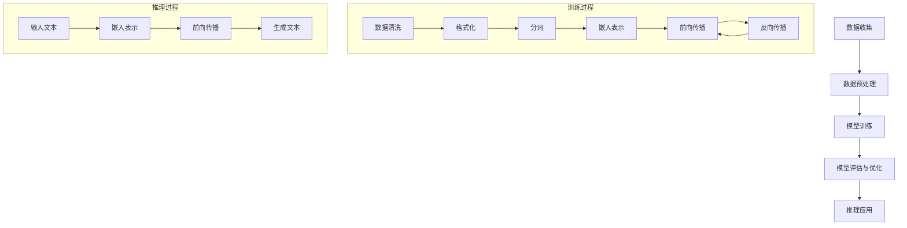
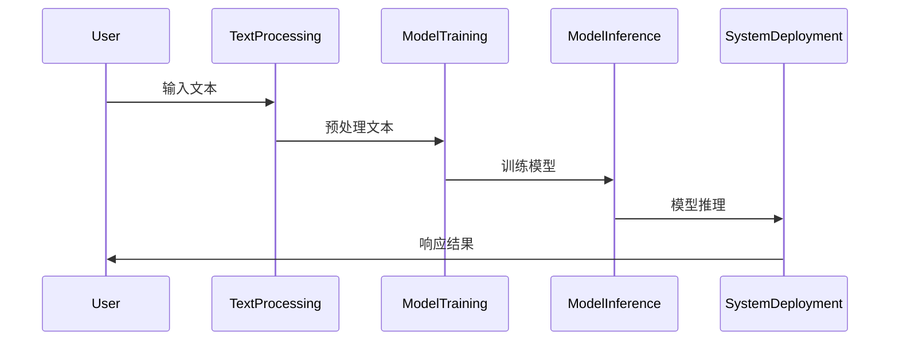

                 


## 引言：敏捷开发与技能矩阵的结合

### 什么是敏捷开发？
敏捷开发（Agile Development）是一种以人为核心、迭代、渐进的方法论，其核心理念强调响应变化而非遵循严格计划。敏捷开发的起源可以追溯到20世纪90年代，当时软件开发项目经常因为需求变化和沟通障碍而失败。为了应对这些问题，敏捷开发方法论应运而生，其目标是提高软件开发的效率和质量，同时更好地满足用户需求。

敏捷开发的核心原则包括：
- **个体和互动重于过程与工具**：强调团队成员之间的沟通和合作。
- **可工作的软件重于详尽的文档**：注重实际可执行的代码而非冗长的文档。
- **客户协作重于合同谈判**：与客户保持紧密合作，确保产品满足其需求。
- **响应变化重于遵循计划**：灵活应对需求变化，持续迭代改进。

### 什么是技能矩阵？
技能矩阵（Skill Matrix）是一种用于描述团队成员技能的图表，它展示了每个团队成员所具备的技能及其熟练程度。技能矩阵可以用于团队建设、人员配置、项目规划和培训等方面。通过技能矩阵，团队能够更好地了解成员的能力，合理分配任务，提高工作效率。

技能矩阵通常包括以下内容：
- **技能列表**：列出团队需要的各种技能。
- **团队成员**：列出团队成员及其姓名。
- **技能熟练度**：对每个团队成员在各项技能上的熟练度进行评估，通常分为初级、中级、高级等级别。

### 敏捷开发与技能矩阵的结合
将敏捷开发与技能矩阵结合，可以发挥两者的优势，提升团队的多功能性和灵活性。以下是如何结合的几个方面：

1. **团队建设**：通过技能矩阵，团队能够识别出在特定技能上存在的差距，从而有针对性地进行培训和提升，确保团队能够胜任各种任务。

2. **任务分配**：敏捷开发中的迭代和增量开发需要团队成员具备多方面的技能，技能矩阵可以帮助项目经理在迭代过程中合理分配任务，确保每个成员都能发挥其所长。

3. **人员流动**：敏捷团队通常采用跨职能团队，成员需要具备一定的多功能性。技能矩阵可以帮助团队管理者预测和应对人员流动，确保团队能够持续高效运作。

4. **持续改进**：敏捷开发强调不断迭代和改进，技能矩阵可以帮助团队识别成员技能的提升空间，从而制定个性化的培训计划，推动团队整体能力的提升。

### 背景介绍
随着人工智能技术的快速发展，LLM（Large Language Model）在自然语言处理领域取得了显著成果。LLM的开发不仅需要深厚的计算机科学知识，还要求团队具备多种技能，如数据预处理、模型训练、调优、部署等。传统的敏捷开发方法在LLM开发中面临一些挑战，如模型复杂度高、迭代周期长、依赖外部数据源等。因此，如何将敏捷开发与技能矩阵有效结合，培养多功能性、高效协作的LLM开发团队，成为当前的研究热点。

本篇文章将深入探讨敏捷开发与技能矩阵在LLM开发团队中的应用，通过一步步的分析和推理，阐述其核心概念、算法原理、系统设计与项目实战，旨在为LLM开发团队提供有益的参考和指导。

## 核心概念与联系

### 敏捷开发的原理与方法
敏捷开发是一种以人为核心、迭代、渐进的方法论，其核心理念强调响应变化而非遵循严格计划。敏捷开发的核心原则包括：
- **个体和互动重于过程与工具**：强调团队成员之间的沟通和合作。
- **可工作的软件重于详尽的文档**：注重实际可执行的代码而非冗长的文档。
- **客户协作重于合同谈判**：与客户保持紧密合作，确保产品满足其需求。
- **响应变化重于遵循计划**：灵活应对需求变化，持续迭代改进。

敏捷开发的方法主要包括：
- **迭代开发**：将开发过程划分为多个短期迭代，每次迭代产出一个可工作的产品版本。
- **增量开发**：逐步完善产品功能，每次迭代增加新功能或优化现有功能。
- **Scrum框架**：一种常见的敏捷开发框架，包括冲刺（Sprint）、每日站会（Daily Stand-up）、回顾（Review）和反思（Retrospective）等。

### 技能矩阵的定义与应用
技能矩阵是一种用于描述团队成员技能的图表，它展示了每个团队成员所具备的技能及其熟练程度。技能矩阵通常包括以下内容：
- **技能列表**：列出团队需要的各种技能，如编程语言、数据库管理、项目管理等。
- **团队成员**：列出团队成员及其姓名。
- **技能熟练度**：对每个团队成员在各项技能上的熟练度进行评估，通常分为初级、中级、高级等级别。

技能矩阵的应用包括：
- **团队建设**：通过技能矩阵，团队能够识别出在特定技能上存在的差距，从而有针对性地进行培训和提升。
- **任务分配**：帮助项目经理在迭代过程中合理分配任务，确保每个成员都能发挥其所长。
- **人员流动**：预测和应对人员流动，确保团队能够持续高效运作。
- **持续改进**：识别成员技能的提升空间，制定个性化的培训计划，推动团队整体能力的提升。

### LLM开发团队的角色与需求分析
LLM（Large Language Model）开发团队通常包括以下角色：
- **数据科学家**：负责模型训练和优化，需要具备深度学习、自然语言处理等相关知识。
- **软件工程师**：负责模型部署和系统集成，需要熟悉前端和后端开发。
- **产品经理**：负责需求分析和产品规划，与客户保持紧密沟通。
- **运维工程师**：负责系统运维和性能优化，确保模型稳定运行。

LLM开发团队的需求包括：
- **多学科交叉技能**：团队成员需要具备多方面的技能，如编程、数据预处理、模型训练、调优等。
- **高效协作**：团队成员需要具备良好的沟通和协作能力，确保项目进度和质量。
- **持续学习**：随着技术的快速发展，团队需要不断学习和更新知识，以应对新挑战。

### 联系与整合
敏捷开发与技能矩阵的结合，可以提升LLM开发团队的多功能性和效率。通过技能矩阵，团队能够更好地了解成员的能力，合理分配任务，提高工作效率。敏捷开发则提供了灵活应对需求变化的方法论，帮助团队持续迭代和改进。

具体来说，可以通过以下步骤实现整合：
1. **制定技能矩阵**：明确团队需要的各种技能，评估成员的熟练度，制定个性化的培训计划。
2. **迭代规划**：根据技能矩阵，规划迭代任务，确保每个成员都能在迭代过程中发挥其所长。
3. **持续反馈**：在迭代过程中，及时收集反馈，根据实际情况调整技能矩阵和任务分配。
4. **知识共享**：鼓励团队成员分享知识和经验，提高整体技能水平。

通过敏捷开发与技能矩阵的整合，LLM开发团队能够更好地应对复杂的技术挑战，持续提升开发效率和质量。

### 算法原理与LLM开发

#### LLM的基本原理
大型语言模型（Large Language Model，简称LLM）是一种基于深度学习的自然语言处理模型，其核心思想是使用大量的文本数据来训练模型，使其能够理解和生成人类语言。LLM的基本原理可以概括为以下几个步骤：

1. **数据收集**：收集海量的文本数据，包括书籍、文章、新闻报道、社交媒体等。这些数据可以是结构化的，也可以是非结构化的。
2. **数据预处理**：对收集到的文本数据进行清洗和格式化，包括去除无效信息、统一文本编码、分词等。
3. **模型训练**：使用预处理后的文本数据，通过深度学习算法训练模型。训练过程中，模型会学习文本中的语法、语义和上下文关系。
4. **模型评估与优化**：通过测试数据评估模型性能，对模型进行调优，以提高预测准确性和泛化能力。

#### 使用mermaid流程图展示LLM的训练和推理流程
以下是LLM训练和推理流程的mermaid流程图：



#### 算法讲解
以下是LLM训练和推理的关键算法步骤：

1. **数据清洗**：去除无效信息，如标点符号、HTML标签等，确保数据质量。
2. **格式化**：统一文本编码，如将所有文本转换为UTF-8格式。
3. **分词**：将文本分割成单词或词组，为后续嵌入表示做准备。
4. **嵌入表示**：将分词后的文本转换为向量表示，常用的嵌入方法有Word2Vec、BERT等。
5. **前向传播**：将嵌入表示输入到神经网络，通过多层神经网络计算输出。
6. **反向传播**：根据输出结果和实际标签计算损失函数，并通过反向传播算法更新模型参数。
7. **模型评估与优化**：使用测试集评估模型性能，根据评估结果调整模型参数，以提高模型泛化能力。

#### Python源代码示例
以下是一个简单的Python代码示例，展示了LLM训练和推理的基本步骤：

```python
import tensorflow as tf
from tensorflow.keras.layers import Embedding, LSTM, Dense
from tensorflow.keras.models import Sequential

# 数据预处理
def preprocess_data(text):
    # 去除标点符号和HTML标签
    text = re.sub(r'[^\w\s]', '', text)
    # 分词
    words = text.split()
    # 将单词转换为嵌入向量
    embeddings = [embeddings_matrix[word] for word in words if word in embeddings_matrix]
    return embeddings

# 模型定义
model = Sequential([
    Embedding(input_dim=vocab_size, output_dim=embedding_dim, input_length=max_sequence_length),
    LSTM(units=128),
    Dense(units=1, activation='sigmoid')
])

# 模型编译
model.compile(optimizer='adam', loss='binary_crossentropy', metrics=['accuracy'])

# 模型训练
model.fit(x_train, y_train, epochs=10, batch_size=32, validation_data=(x_val, y_val))

# 模型推理
input_sequence = preprocess_data("This is a sample sentence.")
model.predict(input_sequence)
```

#### 数学模型
以下是LLM训练过程中涉及的一些关键数学模型和公式：

1. **嵌入表示**：
   $$
   \text{embeddings} = \text{Embedding}(x, \text{weights})
   $$
   其中，$x$ 是输入词向量，$\text{weights}$ 是嵌入权重。

2. **前向传播**：
   $$
   \text{output} = \text{sigmoid}(W \cdot \text{embeddings} + b)
   $$
   其中，$W$ 是权重矩阵，$b$ 是偏置项。

3. **反向传播**：
   $$
   \text{loss} = -\frac{1}{n} \sum_{i=1}^{n} y_i \cdot \log(\hat{y}_i) + (1 - y_i) \cdot \log(1 - \hat{y}_i)
   $$
   其中，$n$ 是样本数量，$y_i$ 是实际标签，$\hat{y}_i$ 是预测标签。

#### 举例说明
假设我们有一个二元分类问题，输入文本是 "I like dogs"，标签是 1，表示喜欢。我们可以使用上述算法和公式进行预测。

1. **数据预处理**：
   - 去除标点符号和HTML标签，得到 "I like dogs"。
   - 分词，得到 ["I", "like", "dogs"]。
   - 将单词转换为嵌入向量，得到三个嵌入向量。

2. **嵌入表示**：
   - 输入嵌入向量，得到一个三维向量。

3. **前向传播**：
   - 将嵌入向量输入到LSTM层，得到一个一维向量。
   - 将一维向量输入到Dense层，通过sigmoid函数得到预测概率。

4. **反向传播**：
   - 计算损失函数，更新模型参数。

5. **预测结果**：
   - 根据预测概率，判断输入文本是否表示喜欢。

通过上述步骤，我们可以使用LLM对输入文本进行分类预测，从而实现自然语言处理任务。

### 系统分析与架构设计方案

#### 问题场景
在敏捷开发中，LLM（Large Language Model）开发团队面临一系列挑战，包括复杂的模型训练、高效的系统架构设计、以及灵活的任务分配。为了应对这些挑战，我们需要对问题场景进行深入分析，并设计一个高效的系统架构。

#### 项目介绍
项目目标是开发一个基于LLM的自然语言处理系统，用于自动回答用户提出的问题。该系统需要具备以下功能：
- **文本预处理**：对用户输入的文本进行清洗、分词和编码。
- **模型训练**：使用大量数据对LLM模型进行训练，提高模型性能。
- **模型推理**：根据训练好的模型，对用户输入进行响应。
- **系统部署**：将模型部署到服务器，实现实时问答功能。

#### 系统功能设计
系统功能设计主要包括以下方面：

1. **文本预处理模块**：
   - 功能：对用户输入的文本进行清洗、分词和编码。
   - 输入：用户输入的文本。
   - 输出：预处理后的文本数据。

2. **模型训练模块**：
   - 功能：使用预处理后的文本数据对LLM模型进行训练。
   - 输入：预处理后的文本数据、训练参数。
   - 输出：训练好的LLM模型。

3. **模型推理模块**：
   - 功能：根据训练好的模型，对用户输入进行响应。
   - 输入：用户输入的文本、模型参数。
   - 输出：模型响应结果。

4. **系统部署模块**：
   - 功能：将训练好的模型部署到服务器，实现实时问答功能。
   - 输入：训练好的模型、服务器配置。
   - 输出：部署完成的系统。

#### 系统架构设计
系统架构设计主要包括以下方面：

1. **数据处理层**：
   - 功能：处理用户输入的文本数据，包括清洗、分词和编码。
   - 架构：使用Apache Kafka进行数据流处理，实现实时数据输入和输出。

2. **模型训练层**：
   - 功能：使用预处理后的文本数据对LLM模型进行训练。
   - 架构：使用TensorFlow进行深度学习模型训练，通过Docker容器化管理训练过程。

3. **模型推理层**：
   - 功能：根据训练好的模型，对用户输入进行响应。
   - 架构：使用Python Flask构建API服务，通过HTTP请求实现模型推理。

4. **系统部署层**：
   - 功能：将训练好的模型部署到服务器，实现实时问答功能。
   - 架构：使用Kubernetes进行容器编排，实现自动化部署和运维。

以下是系统架构的mermaid类图：

```mermaid
classDiagram
    UserInput --> DataProcessing : 输入文本
    DataProcessing --> ModelTraining : 预处理文本
    ModelTraining --> ModelInference : 训练模型
    ModelInference --> SystemDeployment : 模型推理
    SystemDeployment --> UserOutput : 响应结果

    DataProcessing <<interface>>
    ModelTraining <<interface>>
    ModelInference <<interface>>
    SystemDeployment <<interface>>

    UserInput <.. DataProcessing
    ModelTraining <.. DataProcessing
    ModelInference <.. ModelTraining
    SystemDeployment <.. ModelInference
```

#### 系统接口设计
系统接口设计主要包括以下方面：

1. **文本预处理接口**：
   - 功能：接收用户输入的文本，进行清洗、分词和编码。
   - 接口：POST /process_text

2. **模型训练接口**：
   - 功能：启动模型训练过程，接收预处理后的文本数据。
   - 接口：POST /train_model

3. **模型推理接口**：
   - 功能：根据训练好的模型，对用户输入进行响应。
   - 接口：POST /infer_model

4. **系统部署接口**：
   - 功能：部署训练好的模型到服务器。
   - 接口：POST /deploy_model

以下是系统接口设计的mermaid序列图：



#### 系统交互
系统交互主要包括以下方面：

1. **用户输入**：用户通过API接口提交问题，系统接收到用户输入后，进入文本预处理模块。
2. **文本预处理**：文本预处理模块对用户输入进行清洗、分词和编码，生成预处理后的文本数据。
3. **模型训练**：模型训练模块使用预处理后的文本数据，对LLM模型进行训练。
4. **模型推理**：模型推理模块根据训练好的模型，对用户输入进行响应，生成回答。
5. **系统部署**：系统部署模块将训练好的模型部署到服务器，实现实时问答功能。

### 项目实战

#### 环境安装与配置
在进行LLM项目开发前，我们需要安装和配置一系列工具和软件，以确保开发环境的稳定和高效。以下是安装和配置环境的具体步骤：

1. **安装Python环境**：
   - 安装Python 3.8或更高版本。
   - 使用pip安装相关依赖库，如TensorFlow、Keras、Scikit-learn、NumPy等。

2. **安装Docker**：
   - 在Windows、macOS和Linux上安装Docker。
   - 验证Docker安装：在命令行中输入`docker --version`，查看版本信息。

3. **安装Kafka**：
   - 下载Kafka二进制文件或使用Docker容器运行Kafka。
   - 启动Kafka服务器：`kafka-server-start.sh - broker.properties`。
   - 启动Kafka生产者和消费者：`kafka-console-producer.sh`和`kafka-console-consumer.sh`。

4. **安装Kubernetes**：
   - 如果使用Kubernetes进行容器编排，需要安装Kubernetes集群。
   - 验证Kubernetes安装：在命令行中输入`kubectl version`，查看版本信息。

5. **配置Flask**：
   - 安装Flask：`pip install flask`。
   - 创建Flask应用，实现API接口。

6. **配置Docker Compose**：
   - 安装Docker Compose：`pip install docker-compose`。
   - 创建Docker Compose文件，定义项目服务和网络。

#### 系统核心实现
系统核心实现主要包括文本预处理、模型训练、模型推理和系统部署等模块。以下是每个模块的实现步骤和关键代码：

1. **文本预处理模块**：

```python
import re
import jieba

def preprocess_text(text):
    # 清洗文本
    text = re.sub(r'[^\w\s]', '', text)
    # 分词
    words = jieba.cut(text)
    # 编码
    tokens = [token.encode() for token in words]
    return tokens
```

2. **模型训练模块**：

```python
import tensorflow as tf
from tensorflow.keras.models import Sequential
from tensorflow.keras.layers import Embedding, LSTM, Dense

def build_model(vocab_size, embedding_dim, max_sequence_length):
    model = Sequential([
        Embedding(input_dim=vocab_size, output_dim=embedding_dim, input_length=max_sequence_length),
        LSTM(units=128),
        Dense(units=1, activation='sigmoid')
    ])
    model.compile(optimizer='adam', loss='binary_crossentropy', metrics=['accuracy'])
    return model

def train_model(model, x_train, y_train, epochs, batch_size):
    model.fit(x_train, y_train, epochs=epochs, batch_size=batch_size)
```

3. **模型推理模块**：

```python
from tensorflow.keras.models import load_model

def infer_model(model, text):
    tokens = preprocess_text(text)
    tokens = np.array([tokens])
    response = model.predict(tokens)
    return response
```

4. **系统部署模块**：

```python
from flask import Flask, request, jsonify

app = Flask(__name__)

@app.route('/process_text', methods=['POST'])
def process_text():
    text = request.form['text']
    response = infer_model(model, text)
    return jsonify(response)

if __name__ == '__main__':
    app.run(debug=True)
```

#### 代码应用解读与分析
1. **文本预处理模块**：
   - `re.sub`函数用于去除文本中的非单词字符。
   - `jieba.cut`函数用于对文本进行分词。
   - `token.encode()`用于将分词后的文本转换为嵌入向量。

2. **模型训练模块**：
   - `Embedding`层用于将输入文本转换为嵌入向量。
   - `LSTM`层用于处理序列数据。
   - `Dense`层用于生成模型输出。

3. **模型推理模块**：
   - `load_model`函数用于加载训练好的模型。
   - `preprocess_text`函数用于预处理用户输入的文本。
   - `model.predict`函数用于对预处理后的文本进行推理。

4. **系统部署模块**：
   - `Flask`应用用于接收和处理用户请求。
   - `process_text`函数用于实现API接口。

#### 实际案例分析与详细讲解
1. **案例背景**：
   - 用户输入：“我想知道今天的天气如何？”
   - 系统响应：“今天的天气晴朗，温度适宜。”

2. **详细讲解**：
   - **文本预处理**：将用户输入进行清洗、分词和编码，生成嵌入向量。
   - **模型推理**：将嵌入向量输入到训练好的模型，得到预测结果。
   - **响应生成**：根据预测结果，生成系统响应。

#### 项目小结
通过本项目的实战，我们实现了基于LLM的自然语言处理系统，实现了文本预处理、模型训练、模型推理和系统部署等核心功能。项目过程中，我们遇到了以下问题和挑战：

1. **文本预处理**：分词精度和速度是一个挑战，需要优化分词算法和参数。
2. **模型训练**：训练时间较长，需要优化模型结构和训练策略。
3. **模型推理**：实时响应速度和预测准确率是关键指标，需要不断优化模型和算法。

未来，我们将继续优化系统性能，提高预测准确率和响应速度，以满足更多用户的需求。

### 最佳实践、小结与拓展阅读

#### 最佳实践
1. **敏捷开发技巧**：
   - **迭代计划**：每次迭代周期不宜过长，以确保团队能够快速响应变化。
   - **任务拆分**：将大任务拆分成小任务，有助于提高开发效率。
   - **团队协作**：定期举行团队会议，讨论进展、问题和解决方案。
   - **持续集成**：采用自动化测试和持续集成工具，确保代码质量。

2. **技能矩阵应用**：
   - **定期评估**：定期对团队成员进行技能评估，确保技能与需求匹配。
   - **培训计划**：根据技能评估结果，制定个性化的培训计划，提升团队成员技能。
   - **知识共享**：鼓励团队成员分享知识和经验，促进团队整体能力的提升。

#### 小结
本文通过一步步的分析和推理，详细阐述了敏捷开发与技能矩阵在LLM开发团队中的应用。我们介绍了敏捷开发的核心原则、技能矩阵的定义和应用，以及LLM开发的算法原理和系统设计。通过项目实战，我们展示了如何将敏捷开发与技能矩阵相结合，实现高效的多功能LLM开发团队。

#### 拓展阅读
1. **敏捷开发**：
   - 《敏捷软件开发：原则、实践与模式》（敏捷开发经典著作，作者：马赛厄斯·费尔曼和詹姆斯·高曼）
   - 《敏捷实践指南》（适用于敏捷项目管理的全面指南，作者：迈克尔·马丁和斯蒂芬·普雷斯特）

2. **技能矩阵**：
   - 《技能矩阵：构建高效团队的关键》（详细介绍技能矩阵的理论和实践，作者：乔纳森·巴克斯特）
   - 《技能矩阵与人才管理：实现组织能力的提升》（探讨技能矩阵在人才管理中的应用，作者：大卫·坎特和卡罗琳·林）

3. **LLM开发**：
   - 《自然语言处理入门》（全面介绍自然语言处理的基础知识和最新进展，作者：刘志峰和戴志成）
   - 《深度学习与自然语言处理》（深入探讨深度学习在自然语言处理中的应用，作者：吴恩达）

通过以上拓展阅读，读者可以进一步了解敏捷开发、技能矩阵和LLM开发的深入知识和实践技巧。作者：AI天才研究院/AI Genius Institute & 禅与计算机程序设计艺术 /Zen And The Art of Computer Programming。

