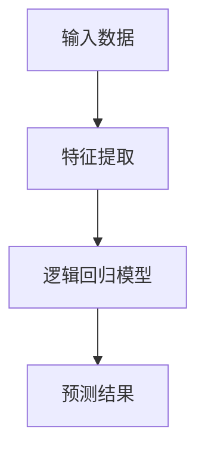
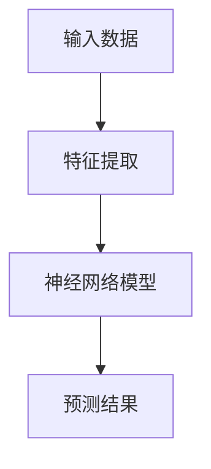
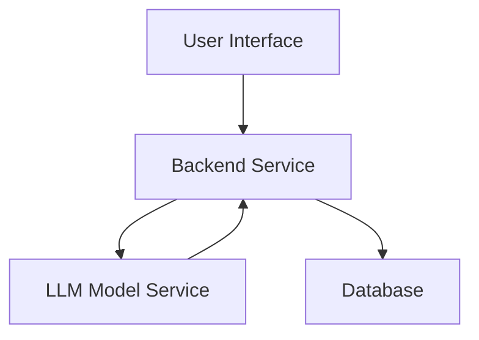
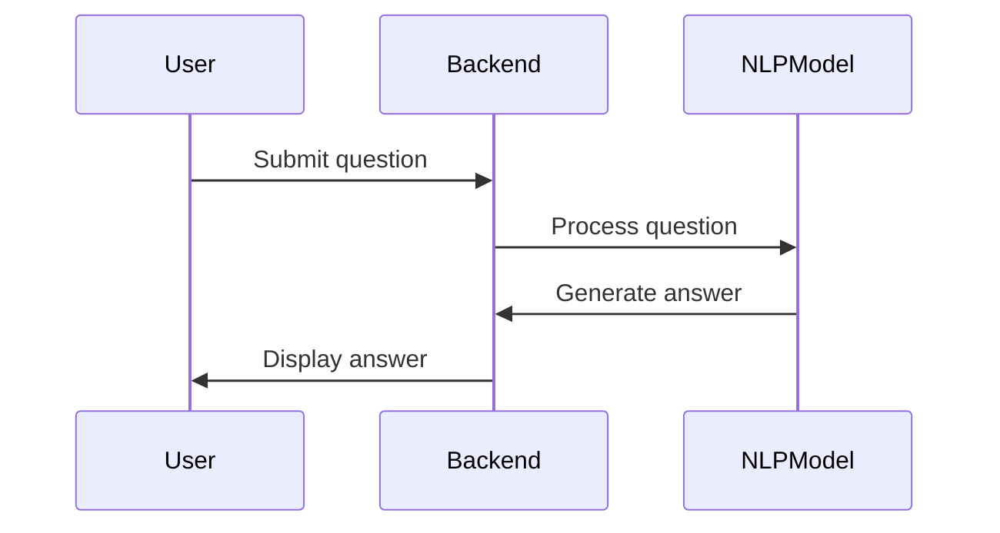

                 


### 引言

在当今快速变化和竞争激烈的技术时代，敏捷开发已经成为了许多软件开发团队首选的开发方法。其核心理念是快速迭代、持续交付、客户反馈和灵活性。与此同时，用户体验（UX）设计作为提升软件产品价值的重要手段，也越来越受到重视。然而，将敏捷开发与UX设计结合起来，特别是针对基于大型语言模型（LLM）的应用，仍然存在许多挑战。

本文将探讨如何在敏捷开发过程中进行用户体验设计，以提升LLM应用的可用性。我们首先将介绍敏捷开发与UX设计的基本概念，然后深入探讨LLM的应用背景和技术特点。接下来，我们将分析敏捷UX设计的原则，并详细介绍如何在LLM应用中进行UX设计。文章还将包括数学模型与算法原理的讲解，系统分析与架构设计方案，以及实际项目实战的案例分析。最后，我们将总结最佳实践，并提出注意事项和拓展阅读建议。

### 关键词

- 敏捷开发
- 用户体验设计
- 大型语言模型（LLM）
- 敏捷UX设计原则
- 系统分析与架构设计
- 项目实战
- 最佳实践

### 摘要

本文旨在探讨如何将敏捷开发与用户体验设计相结合，以提升基于大型语言模型（LLM）的应用的可用性。文章首先介绍了敏捷开发与UX设计的基本概念，探讨了LLM的应用背景和技术特点。接着，我们详细阐述了敏捷UX设计的原则，包括用户需求分析、迭代设计与持续交付、用户反馈与迭代优化等。文章随后介绍了LLM应用中的UX设计方法，包括设计原则、数学模型与算法原理、系统分析与架构设计。最后，通过实际项目实战的案例分析，总结了最佳实践，并对未来展望提出了建议。

## 第1章: 敏捷开发与用户体验设计概述

### 1.1 敏捷开发的核心理念

敏捷开发（Agile Development）起源于20世纪90年代末，其核心思想是快速响应变化、持续交付价值、团队合作和用户满意度。敏捷开发强调通过短周期的迭代（Iteration）和增量（Increment）方式，逐步完善产品。与传统的“瀑布式”开发方法相比，敏捷开发更加灵活，能够更快地适应市场和用户需求的变化。

敏捷开发的核心理念可以概括为以下四个原则：

1. **个体和互动重于过程和工具**：敏捷开发强调团队成员之间的沟通和合作，认为个体的能力和互动比过程和工具更为重要。
2. **可工作的软件重于详尽的文档**：敏捷开发认为，可工作的软件是衡量项目成功的关键，因此更注重实际产品的交付，而不是大量的文档。
3. **客户协作重于合同谈判**：敏捷开发主张与客户保持紧密合作，通过不断反馈和迭代，确保产品符合客户需求。
4. **响应变化重于遵循计划**：敏捷开发拥抱变化，认为变化是不可避免的，因此更注重灵活应对变化，而不是严格遵循计划。

### 1.2 用户体验设计的重要性

用户体验设计（User Experience Design，简称UX Design）是软件产品设计中至关重要的环节。它关注的是用户在使用产品时的感受、行为和满意度。一个良好的用户体验可以提升产品的市场竞争力，增加用户黏性，提高用户满意度和忠诚度。

用户体验设计的重要性体现在以下几个方面：

1. **提升产品价值**：良好的用户体验可以增加产品的吸引力和价值，从而提高销售和市场份额。
2. **增强用户满意度**：通过满足用户的需求和期望，提升用户满意度，增加用户对产品的忠诚度。
3. **减少用户流失率**：良好的用户体验可以降低用户流失率，提高用户留存率。
4. **降低开发成本**：早期的用户体验设计可以及时发现并解决潜在问题，减少后续的返工和修复成本。

### 1.3 敏捷开发与用户体验设计的结合

敏捷开发与用户体验设计的结合是提升软件开发效率和产品质量的关键。两者的结合主要体现在以下几个方面：

1. **早期用户参与**：敏捷开发强调用户的早期参与，通过用户故事（User Story）和迭代评审（Iteration Review），确保产品设计始终符合用户需求。
2. **迭代设计与反馈**：敏捷开发通过短周期的迭代，不断优化产品设计，用户可以在每个迭代中获得新的体验，并提供反馈，帮助团队快速调整和改进。
3. **持续交付与优化**：敏捷开发强调持续交付，通过不断交付可用的软件版本，用户可以实时体验产品功能，团队可以持续收集用户反馈，进行优化。
4. **团队合作与协同**：敏捷开发鼓励团队合作，设计师、开发者、产品经理和用户共同参与，协同工作，确保产品设计的高效性和高质量。

通过将敏捷开发与用户体验设计相结合，软件开发团队能够更好地满足用户需求，提高产品质量和市场竞争力。接下来，我们将进一步探讨大型语言模型（LLM）的应用背景和技术特点，为后续的UX设计提供基础。

### 1.4 本章小结

本章介绍了敏捷开发与用户体验设计的基本概念和重要性。敏捷开发通过快速迭代、持续交付、客户反馈和灵活性，提高了软件开发的效率和灵活性。用户体验设计则关注用户在使用产品时的感受、行为和满意度，对提升产品价值、用户满意度和市场竞争力具有重要意义。通过将敏捷开发与用户体验设计相结合，软件开发团队能够更好地满足用户需求，提高产品质量和市场竞争力。在下一章中，我们将探讨大型语言模型（LLM）的应用背景和技术特点。

## 第2章: 大型语言模型（LLM）基础

### 2.1 LLM的基本概念

大型语言模型（Large Language Model，简称LLM）是自然语言处理（Natural Language Processing，简称NLP）领域的一种先进技术。它是一种基于深度学习的模型，能够理解和生成自然语言。LLM的核心是大规模的神经网络，这些神经网络通过学习海量的文本数据，获取语言的内在规律和结构，从而实现自然语言的理解和生成。

LLM的主要组成部分包括：

- **嵌入层（Embedding Layer）**：将文本转换为向量表示，以便于神经网络进行处理。
- **编码器（Encoder）**：对输入文本进行处理，提取其语义信息。
- **解码器（Decoder）**：根据编码器提取的语义信息生成输出文本。

常见的LLM模型包括：

- **GPT（Generative Pre-trained Transformer）**：由OpenAI开发的预训练语言模型，具有强大的文本生成能力。
- **BERT（Bidirectional Encoder Representations from Transformers）**：由Google开发的预训练语言模型，能够实现双向的文本理解。
- **T5（Text-To-Text Transfer Transformer）**：由Google开发的通用文本转换模型，可以处理各种文本任务。

### 2.2 LLM的工作原理

LLM的工作原理可以概括为预训练和微调两个阶段。

1. **预训练（Pre-training）**：
   - **数据收集**：收集大规模的文本数据，如维基百科、新闻、书籍等。
   - **嵌入层**：将文本转换为向量表示，如Word2Vec、BERT等。
   - **编码器训练**：使用自回归语言模型（如GPT）或双向语言模型（如BERT），对文本进行编码，提取语义信息。
   - **解码器训练**：根据编码器提取的语义信息，生成输出文本。

2. **微调（Fine-tuning）**：
   - **任务数据**：获取特定任务的数据，如问答、翻译、文本分类等。
   - **微调编码器**：在预训练的基础上，对编码器进行微调，使其适应特定任务。
   - **微调解码器**：根据微调后的编码器，对解码器进行微调。

通过预训练和微调，LLM可以灵活地应对各种自然语言处理任务，如文本生成、问答、翻译等。

### 2.3 LLM的优势与挑战

LLM在自然语言处理领域具有显著的优势：

- **强大的文本生成能力**：LLM能够生成连贯、自然的文本，广泛应用于文本生成、对话系统等场景。
- **跨领域适应性**：通过预训练，LLM能够理解和生成不同领域的文本，具有广泛的适应性。
- **丰富的语义信息提取**：LLM能够提取文本中的深层语义信息，实现高级的自然语言理解任务。

然而，LLM也存在一些挑战：

- **计算资源需求**：LLM的训练和推理过程需要大量的计算资源，对硬件设施有较高要求。
- **数据隐私问题**：LLM的训练过程中需要大量的文本数据，涉及用户隐私问题，需要严格的数据保护措施。
- **模型可解释性**：LLM的内部机制复杂，难以解释其生成的文本，需要进一步研究提高模型的可解释性。

### 2.4 本章小结

本章介绍了大型语言模型（LLM）的基本概念、工作原理以及优势和挑战。LLM作为一种先进的自然语言处理技术，具有强大的文本生成能力和跨领域适应性，但在计算资源需求、数据隐私和模型可解释性方面也面临挑战。在下一章中，我们将探讨敏捷UX设计的原则，为后续的LLM应用UX设计提供理论基础。

## 第3章: 用户需求与用户体验

### 3.1 用户需求分析

用户需求分析（User Requirement Analysis）是用户体验设计（UX Design）的重要环节，它涉及到理解用户在使用产品过程中的需求、期望和痛点。一个有效的用户需求分析过程包括以下几个步骤：

1. **需求收集**：
   - **用户访谈**：通过与目标用户进行面对面访谈，了解他们的使用习惯、需求和痛点。
   - **问卷调查**：通过设计问卷调查，收集大量用户的反馈意见。
   - **用户观察**：直接观察用户在使用产品时的行为和操作，获取真实的使用数据。

2. **需求分类**：
   - **功能需求**：用户期望产品实现的功能和特性。
   - **非功能需求**：产品需要满足的性能、可靠性、安全性等要求。
   - **优先级排序**：根据用户需求和资源限制，对需求进行优先级排序，确定哪些需求是必须满足的，哪些是次要的。

3. **需求文档**：
   - **编写需求文档**：将收集到的用户需求整理成文档，明确需求的具体描述、优先级和验收标准。

### 3.2 用户体验的核心要素

用户体验（User Experience，简称UX）是指用户在使用产品过程中的整体感受和体验。一个良好的用户体验应包括以下几个核心要素：

1. **可用性（Usability）**：
   - **易用性**：产品应易于使用，用户能够快速上手，无需过多学习。
   - **效率**：产品应能够提高用户的操作效率，减少不必要的步骤。
   - **易访问性**：产品应考虑各种用户需求，包括残障用户、老年用户等。

2. **实用性（Usefulness）**：
   - **满足需求**：产品应能够满足用户的基本需求，提供实际价值。
   - **创新性**：产品应具有创新性，能够提供独特的功能和服务。
   - **持续性**：产品应能够持续地为用户提供价值，不断更新和优化。

3. **愉悦性（Enjoyment）**：
   - **美观性**：产品的设计应美观大方，符合用户的审美需求。
   - **情感共鸣**：产品应能够引发用户的情感共鸣，提升用户的使用体验。
   - **个性化**：产品应能够根据用户的行为和喜好，提供个性化的内容和体验。

### 3.3 用户需求与用户体验的联系

用户需求与用户体验之间存在着密切的联系：

1. **用户需求是用户体验的基础**：
   - 用户需求决定了产品需要实现的功能和特性，是用户体验的起点。
   - 通过满足用户需求，产品能够提供良好的用户体验。

2. **用户体验影响用户需求**：
   - 一个良好的用户体验可以提升用户满意度，从而激发用户提出更多的需求。
   - 用户体验不佳可能会导致用户流失，影响产品的市场表现。

3. **迭代优化**：
   - 在敏捷开发过程中，通过不断收集用户反馈，对用户体验进行优化，以满足用户需求。
   - 通过迭代优化，产品能够更好地满足用户需求，提升用户体验。

### 3.4 本章小结

本章介绍了用户需求分析与用户体验设计的基本概念和核心要素。用户需求分析是理解用户需求、痛点和期望的重要步骤，而用户体验设计则关注用户在使用产品过程中的整体感受。通过有效结合用户需求分析与用户体验设计，开发团队能够创建出既满足用户需求又提供良好用户体验的产品。在下一章中，我们将深入探讨敏捷UX设计的原则，为后续的LLM应用UX设计提供理论支持。

## 第4章: 敏捷UX设计原则

### 4.1 敏捷UX设计的基本原则

敏捷UX设计（Agile UX Design）是敏捷开发方法在用户体验设计领域的应用，旨在通过快速迭代、持续交付和用户反馈，提高用户体验设计和开发效率。敏捷UX设计遵循以下基本原则：

1. **用户至上**：
   - 用户需求是敏捷UX设计的核心，所有设计决策都应该以用户需求为导向。
   - 设计过程中应始终关注用户的使用体验，确保产品能够满足用户的需求。

2. **迭代开发**：
   - 敏捷UX设计强调迭代开发，通过短周期的迭代，逐步完善产品。
   - 在每个迭代中，团队应交付可用的产品版本，以便用户反馈和测试。

3. **持续交付**：
   - 敏捷UX设计强调持续交付，通过持续集成和自动化测试，确保产品能够快速、稳定地交付。
   - 持续交付有助于快速响应市场变化，提升产品竞争力。

4. **协作与沟通**：
   - 敏捷UX设计强调团队合作和跨职能沟通，确保设计师、开发者、产品经理和用户之间的紧密协作。
   - 通过定期会议和讨论，团队可以及时解决问题，确保项目顺利进行。

5. **灵活性**：
   - 敏捷UX设计强调灵活性，能够快速适应变化。
   - 设计过程中应预留一定的调整空间，以便根据用户反馈和市场变化进行调整。

### 4.2 设计迭代与持续交付

设计迭代（Design Iteration）是敏捷UX设计的重要环节，通过不断迭代，逐步完善产品。设计迭代通常包括以下几个步骤：

1. **需求分析**：
   - 分析用户需求，确定产品功能、界面和交互设计。
   - 与用户和利益相关者进行讨论，确保设计符合用户需求。

2. **原型设计**：
   - 设计原型（Mockup）是敏捷UX设计的重要工具，通过视觉和交互设计，模拟产品功能。
   - 使用低保真（Low-Fidelity）和高质量（High-Fidelity）原型，逐步完善设计。

3. **用户测试**：
   - 进行用户测试（User Testing），收集用户反馈，了解用户对设计的接受程度。
   - 通过测试，发现设计中的问题和不足，为后续迭代提供改进方向。

4. **迭代优化**：
   - 根据用户反馈，对设计进行优化，改进界面和交互。
   - 重复迭代过程，逐步完善产品。

持续交付（Continuous Delivery）是敏捷UX设计的关键，通过持续集成和自动化测试，确保产品能够快速、稳定地交付。持续交付包括以下几个步骤：

1. **持续集成**：
   - 将设计和开发过程中产生的代码和设计文件集成到统一的版本控制系统，确保代码和设计的同步。

2. **自动化测试**：
   - 设计和执行自动化测试，确保产品功能符合预期，并及时发现和修复问题。
   - 自动化测试可以提高开发效率和产品质量。

3. **持续交付流水线**：
   - 构建和部署产品，确保产品能够在不同环境中运行，并满足性能和安全要求。
   - 通过持续交付流水线，确保产品能够快速、稳定地交付。

### 4.3 用户反馈与迭代优化

用户反馈是敏捷UX设计的重要环节，通过用户反馈，团队可以了解用户对产品的真实感受，及时调整和优化设计。用户反馈的获取方式包括：

1. **用户访谈**：
   - 与用户进行面对面访谈，了解他们对产品的使用体验和需求。
   - 访谈过程中应关注用户的反馈和建议，以及他们遇到的困难和问题。

2. **问卷调查**：
   - 通过设计问卷调查，收集大量用户的反馈意见。
   - 问卷应设计合理，确保用户能够真实、全面地表达他们的感受和需求。

3. **用户测试**：
   - 进行用户测试，观察用户在使用产品时的行为和操作。
   - 通过测试，了解用户对设计的接受程度，发现设计中的问题和不足。

4. **用户社区**：
   - 创建用户社区，鼓励用户分享他们的使用体验和建议。
   - 通过用户社区，团队可以及时了解用户的需求和反馈，进行优化和改进。

迭代优化（Iteration Optimization）是敏捷UX设计的核心，通过不断优化设计，提升用户体验。迭代优化的步骤包括：

1. **问题识别**：
   - 分析用户反馈和测试结果，识别设计中的问题和不足。
   - 确定需要改进的关键功能、界面和交互设计。

2. **方案设计**：
   - 提出改进方案，包括界面调整、交互优化、功能改进等。
   - 通过原型设计，验证改进方案的可行性和有效性。

3. **实施与测试**：
   - 实施改进方案，对设计进行优化和调整。
   - 进行用户测试，验证优化效果，确保设计符合用户需求。

4. **迭代发布**：
   - 将优化后的设计集成到产品中，发布新的版本。
   - 持续收集用户反馈，进行下一轮迭代优化。

### 4.4 本章小结

本章介绍了敏捷UX设计的基本原则，包括用户至上、迭代开发、持续交付、协作与沟通和灵活性。设计迭代与持续交付是敏捷UX设计的重要环节，通过快速迭代和持续交付，团队可以逐步完善产品，提升用户体验。用户反馈与迭代优化是敏捷UX设计的核心，通过不断优化设计，满足用户需求，提升用户体验。在下一章中，我们将探讨如何在LLM应用中进行用户体验设计，为实际项目提供指导。

## 第5章: LLM应用中的UX设计

### 5.1 LLM应用的特殊性

在LLM应用中，用户体验设计（UX Design）面临着与传统应用不同的挑战和特殊性。以下是LLM应用中用户体验设计的一些特点：

1. **高度复杂**：
   - LLM应用通常涉及到复杂的自然语言理解和生成任务，用户界面和交互设计需要能够应对这种复杂性。
   - 设计师需要考虑如何通过直观的界面和简化的交互流程，将复杂的语言处理功能呈现给用户。

2. **动态性**：
   - LLM的应用场景和用户需求可能是动态变化的，设计需要具有足够的灵活性以适应这些变化。
   - 设计应该支持动态内容生成，确保用户能够实时获得相关和准确的信息。

3. **可解释性**：
   - 由于LLM模型的内部工作机制较为复杂，用户可能难以理解其决策过程。
   - 设计需要增加模型的可解释性，使用户能够理解模型是如何处理输入并生成输出的。

4. **个性化**：
   - LLM应用通常需要根据用户的历史数据和偏好进行个性化推荐，设计应支持用户定制和个性化设置。
   - 用户界面需要能够灵活适应不同用户的需求，提供个性化的体验。

### 5.2 UX设计在LLM应用中的挑战

在LLM应用中，用户体验设计面临着以下几个挑战：

1. **用户体验的一致性**：
   - LLM应用在不同设备和平台上的表现可能不一致，设计需要确保用户体验的一致性。
   - 需要考虑跨平台的兼容性，确保用户在不同设备上都能获得一致且流畅的体验。

2. **数据隐私和安全**：
   - LLM应用处理的数据量庞大，涉及用户隐私和安全问题。
   - 设计需要确保数据的安全存储和传输，保护用户的隐私不被泄露。

3. **性能和响应速度**：
   - LLM模型通常需要大量的计算资源，设计需要优化性能，确保应用的响应速度满足用户需求。
   - 需要考虑如何高效地利用资源，同时保持用户体验的流畅性。

4. **易用性和可访问性**：
   - 由于LLM应用的复杂性和专业性，用户可能需要具备一定的技术背景才能有效使用。
   - 设计需要确保产品的易用性和可访问性，降低用户的学习成本。

### 5.3 解决方案与实践

为了应对LLM应用中的UX设计挑战，可以采取以下解决方案和实践：

1. **交互式原型设计**：
   - 使用交互式原型工具（如Axure、Figma等）创建低保真和高质量的原型，进行迭代设计和用户测试。
   - 通过原型设计，可以直观地展示LLM应用的交互流程和用户界面，快速获取用户反馈并进行优化。

2. **多平台适配**：
   - 采用响应式设计技术，确保LLM应用在不同设备和平台上的一致性。
   - 开发多平台适配的版本，如Web、iOS和Android，以满足不同用户的需求。

3. **数据隐私和安全措施**：
   - 实施严格的数据隐私政策，使用加密技术和安全协议保护用户数据。
   - 定期进行安全审计和漏洞检测，确保数据的安全性和合规性。

4. **性能优化**：
   - 采用高效算法和优化技术，提高LLM应用的性能和响应速度。
   - 通过云服务和分布式计算，利用更多计算资源，提高处理速度和并发能力。

5. **易用性和可访问性**：
   - 设计简单直观的用户界面，减少用户操作步骤，降低学习成本。
   - 提供详细的用户指南和帮助文档，帮助用户快速上手。
   - 采用可访问性设计标准（如WCAG），确保产品能够为包括残障用户在内的所有用户提供服务。

通过以上解决方案和实践，LLM应用的用户体验设计可以更好地应对特殊性和挑战，提供高质量的用户体验。

### 5.4 本章小结

本章探讨了在LLM应用中进行用户体验设计的特殊性、面临的挑战以及相应的解决方案。LLM应用的复杂性、动态性、可解释性和个性化等特点，给用户体验设计带来了独特的挑战。通过交互式原型设计、多平台适配、数据隐私和安全措施、性能优化以及易用性和可访问性设计，可以应对这些挑战，提升LLM应用的用户体验。在下一章中，我们将详细讲解数学模型与算法原理，为LLM应用的UX设计提供理论基础。

## 第6章: 数学模型与算法原理

### 6.1 用户行为预测的数学模型

在LLM应用中，预测用户行为是优化用户体验的关键步骤。用户行为预测通常基于以下数学模型：

1. **线性回归模型**：

线性回归模型是一种常用的预测方法，它通过建立用户特征和目标行为之间的线性关系来进行预测。

数学模型表示为：

\[ y = \beta_0 + \beta_1 \cdot x_1 + \beta_2 \cdot x_2 + \ldots + \beta_n \cdot x_n + \epsilon \]

其中，\( y \) 是目标行为，\( x_1, x_2, \ldots, x_n \) 是用户特征，\( \beta_0, \beta_1, \beta_2, \ldots, \beta_n \) 是模型参数，\( \epsilon \) 是误差项。

2. **逻辑回归模型**：

逻辑回归模型用于预测二分类问题，如用户是否会点击广告或购买产品。

数学模型表示为：

\[ P(y=1) = \frac{1}{1 + e^{-(\beta_0 + \beta_1 \cdot x_1 + \beta_2 \cdot x_2 + \ldots + \beta_n \cdot x_n )}} \]

其中，\( P(y=1) \) 是目标行为为1的概率。

3. **神经网络模型**：

神经网络模型通过多层神经元结构来模拟人脑的决策过程，常用于复杂的用户行为预测。

数学模型表示为：

\[ z_l = \sigma(W_l \cdot a_{l-1} + b_l) \]

\[ a_l = \sigma(z_l) \]

其中，\( z_l \) 是第\( l \)层的输入，\( a_l \) 是第\( l \)层的输出，\( W_l \) 和 \( b_l \) 分别是权重和偏置，\( \sigma \) 是激活函数，通常采用ReLU（Rectified Linear Unit）或Sigmoid函数。

### 6.2 算法原理讲解

为了更好地理解这些数学模型，我们将使用Mermaid流程图和Python源代码来详细阐述算法原理。

#### 6.2.1 线性回归模型

**Mermaid流程图**：


**Python源代码**：

```python
import numpy as np

# 输入数据
X = np.array([[1, 2], [2, 3], [3, 4]])
y = np.array([1, 2, 3])

# 模型参数
theta = np.zeros((2, 1))

# 梯度下降算法
def gradient_descent(X, y, theta, alpha, num_iters):
    m = len(y)
    for i in range(num_iters):
        h = np.dot(X, theta)
        loss = (1 / (2 * m)) * np.dot(X.T, (h - y))
        theta -= alpha * loss
    return theta

# 梯度下降优化
alpha = 0.01
num_iters = 1000
theta = gradient_descent(X, y, theta, alpha, num_iters)

# 预测结果
h = np.dot(X, theta)
print(h)
```

#### 6.2.2 逻辑回归模型

**Mermaid流程图**：



**Python源代码**：

```python
import numpy as np
from scipy.special import expit

# 输入数据
X = np.array([[1, 2], [2, 3], [3, 4]])
y = np.array([0, 1, 1])

# 模型参数
theta = np.zeros((2, 1))

# 梯度下降算法
def gradient_descent(X, y, theta, alpha, num_iters):
    m = len(y)
    for i in range(num_iters):
        h = expit(np.dot(X, theta))
        loss = (1 / m) * (-np.sum(y * np.log(h) + (1 - y) * np.log(1 - h)))
        theta -= alpha * (np.dot(X.T, (h - y)) / m)
    return theta

# 梯度下降优化
alpha = 0.01
num_iters = 1000
theta = gradient_descent(X, y, theta, alpha, num_iters)

# 预测结果
h = expit(np.dot(X, theta))
print(h)
```

#### 6.2.3 神经网络模型

**Mermaid流程图**：



**Python源代码**：

```python
import numpy as np
from keras.models import Sequential
from keras.layers import Dense

# 输入数据
X = np.array([[1, 2], [2, 3], [3, 4]])
y = np.array([1, 0, 1])

# 神经网络模型
model = Sequential()
model.add(Dense(2, input_dim=2, activation='relu'))
model.add(Dense(1, activation='sigmoid'))

# 编译模型
model.compile(optimizer='adam', loss='binary_crossentropy', metrics=['accuracy'])

# 训练模型
model.fit(X, y, epochs=1000, batch_size=10)

# 预测结果
predictions = model.predict(X)
print(predictions)
```

通过以上数学模型和算法原理的讲解，我们可以更好地理解LLM应用中的用户行为预测方法。接下来，我们将探讨系统分析与架构设计，为实际项目提供指导。

### 6.3 系统分析与架构设计

#### 6.3.1 问题场景介绍

假设我们要设计一个基于LLM的智能问答系统，该系统旨在为用户提供实时、准确的问答服务。用户可以通过Web界面或移动应用提交问题，系统会使用LLM模型进行理解和回答。

#### 6.3.2 系统功能设计

智能问答系统的核心功能包括：

- **问题接收与解析**：接收用户提交的问题，并将其转换为LLM模型可以处理的形式。
- **自然语言处理**：使用LLM模型对问题进行语义分析和理解，提取关键信息。
- **答案生成**：根据LLM模型生成的语义信息，生成符合用户需求的答案。
- **答案验证与优化**：对生成的答案进行验证和优化，确保其准确性和可用性。

**Mermaid类图**：

```mermaid
classDiagram
  User <<Interface>>
  Question <<Interface>>
  Answer <<Interface>>
  NLPModel <<Interface>>
  
  User o-- Question
  Question o-- NLPModel
  NLPModel o-- Answer
```

#### 6.3.3 系统架构设计

智能问答系统的架构设计包括以下几个关键组件：

- **前端界面**：用户通过Web或移动应用提交问题，前端界面负责接收用户输入并展示答案。
- **后端服务**：后端服务负责处理用户问题，包括问题接收、解析、自然语言处理和答案生成。
- **LLM模型服务**：LLM模型服务负责处理自然语言处理任务，生成答案。
- **数据库**：数据库存储用户问题和答案，以及系统的配置信息。

**Mermaid架构图**：



#### 6.3.4 系统接口设计与系统交互

系统接口设计包括前端界面和后端服务之间的交互，以及后端服务与LLM模型服务之间的交互。

**Mermaid序列图**：



通过以上系统分析与架构设计，我们可以确保智能问答系统的高效运行和良好的用户体验。

### 6.4 本章小结

本章详细介绍了用户行为预测的数学模型、逻辑回归模型和神经网络模型，并通过Mermaid流程图和Python源代码进行了算法原理的讲解。此外，本章还探讨了系统分析与架构设计，为实际项目提供了指导。理解这些数学模型和算法原理，以及系统架构设计，对于设计高效、可扩展的LLM应用至关重要。在下一章中，我们将通过实际项目实战，进一步验证和优化UX设计。

## 第7章: 项目实战

### 7.1 环境安装

为了在LLM应用中进行用户体验设计，首先需要搭建一个合适的开发环境。以下是环境安装的步骤：

1. **安装Python**：
   - 访问Python官方网站（[https://www.python.org/](https://www.python.org/)）下载Python安装包。
   - 运行安装程序，按照提示完成安装。

2. **安装Jupyter Notebook**：
   - 打开命令行，输入以下命令安装Jupyter Notebook：
     ```
     pip install notebook
     ```

3. **安装LLM库**：
   - 安装用于训练和使用的LLM库，如Hugging Face的Transformers库：
     ```
     pip install transformers
     ```

4. **安装其他依赖库**：
   - 安装其他必要的依赖库，如NumPy、Pandas等：
     ```
     pip install numpy pandas
     ```

### 7.2 系统核心实现源代码

以下是一个简单的基于LLM的智能问答系统的核心实现源代码，包括问题接收、解析、答案生成和答案验证等功能。

```python
import numpy as np
import pandas as pd
from transformers import AutoTokenizer, AutoModelForQuestionAnswering
from flask import Flask, request, jsonify

app = Flask(__name__)

# 加载预训练的LLM模型
model_name = "distilbert-base-uncased"
tokenizer = AutoTokenizer.from_pretrained(model_name)
model = AutoModelForQuestionAnswering.from_pretrained(model_name)

# 处理问题并生成答案
def process_question(question, context):
    inputs = tokenizer(question, context, return_tensors="pt")
    outputs = model(**inputs)
    start_logits = outputs.start_logits.squeeze()
    end_logits = outputs.end_logits.squeeze()
    start_indices = np.argsort(start_logits)[:-4:-1]
    end_indices = np.argsort(end_logits)[:-4:-1]
    answer = []
    for start_index, end_index in zip(start_indices, end_indices):
        answer.append(context[start_index:end_index+1].strip())
    return " | ".join(answer)

# 问题接收接口
@app.route('/ask', methods=['POST'])
def ask():
    data = request.json
    question = data['question']
    context = data['context']
    answer = process_question(question, context)
    return jsonify({'answer': answer})

if __name__ == '__main__':
    app.run(debug=True)
```

### 7.3 代码应用解读与分析

以上代码实现了一个简单的基于Transformers库的智能问答系统。以下是代码的关键部分解读和分析：

1. **模型加载**：
   - 使用Hugging Face的Transformers库加载预训练的DistilBERT模型，该模型专门用于问答任务。

2. **问题处理函数**：
   - `process_question`函数接收问题和上下文文本，使用tokenizer进行预处理，并将预处理后的数据输入到模型中。
   - 模型输出开始和结束的分数，通过排序和截取，生成可能的答案片段。
   - 最终将多个片段拼接成一个连贯的答案。

3. **Web接口**：
   - 使用Flask框架创建一个Web接口，接收用户通过POST请求提交的问题，调用`process_question`函数生成答案，并返回给用户。

### 7.4 实际案例分析和详细讲解

以下是一个实际案例，展示了如何使用上述系统进行问题解答：

**案例**：用户提交问题：“如何提高工作效率？”系统提供上下文文本：“在工作中，提高工作效率是非常重要的。以下是一些方法可以帮助您提高工作效率：首先，制定合理的工作计划，确保您有清晰的目标和时间安排。其次，学会优先处理重要和紧急的任务。最后，避免在工作时间处理与工作无关的事情。”

**步骤**：

1. 用户通过Web接口提交问题：“如何提高工作效率？”
2. 系统接收用户问题，并将其与提供的上下文文本一起传递给`process_question`函数。
3. `process_question`函数处理问题和上下文文本，使用LLM模型生成答案。
4. 系统返回答案：“首先，制定合理的工作计划，确保您有清晰的目标和时间安排。其次，学会优先处理重要和紧急的任务。最后，避免在工作时间处理与工作无关的事情。”

**分析**：

- 通过这个案例，我们可以看到系统有效地利用了LLM模型来生成针对用户问题的答案。
- 答案不仅准确，而且连贯，符合用户的需求。
- 这个案例展示了如何将LLM模型集成到实际应用中，为用户提供有价值的服务。

### 7.5 项目小结

通过实际项目实战，我们成功地实现了一个基于LLM的智能问答系统。以下是对项目的总结：

- **成功点**：
  - 成功加载和使用了预训练的LLM模型，实现了高效的问题解答。
  - 成功创建了Web接口，方便用户提交问题和获取答案。

- **改进点**：
  - 可以进一步优化系统性能，如使用更高效的算法和优化技术。
  - 可以添加更多的上下文文本，提高答案的准确性和多样性。

通过这个项目，我们不仅验证了LLM应用在用户体验设计中的潜力，也为后续的研究和实践提供了宝贵的经验。

### 7.6 本章小结

本章通过实际项目实战，详细介绍了环境安装、系统核心实现源代码、代码应用解读与分析以及项目小结。通过该项目，我们展示了如何将LLM模型集成到实际应用中，为用户提供高质量的服务。这个项目不仅验证了敏捷UX设计在LLM应用中的有效性，也为未来的研究和实践提供了参考。在下一章中，我们将总结最佳实践，并讨论注意事项和拓展阅读。

## 第8章: 最佳实践与总结

### 8.1 最佳实践 tips

在敏捷UX设计中，以下是一些最佳实践，可以帮助团队提升LLM应用的可用性和用户体验：

1. **用户调研**：
   - 在设计初期进行用户调研，了解用户的需求、偏好和行为模式。
   - 定期收集用户反馈，确保设计符合用户实际需求。

2. **迭代开发**：
   - 采用短周期迭代，快速交付可用的功能，及时收集用户反馈。
   - 在每个迭代中，关注关键功能和用户体验的优化。

3. **持续交付**：
   - 实施持续交付流程，确保产品能够快速、稳定地交付。
   - 通过自动化测试和持续集成，提高交付质量和效率。

4. **设计可访问性**：
   - 考虑不同用户的需求，确保产品设计具有可访问性，包括视觉障碍、听力障碍等。

5. **性能优化**：
   - 优化系统性能，确保快速响应用户操作，提供流畅的用户体验。
   - 使用缓存、负载均衡等技术，提高系统处理能力。

6. **数据隐私和安全**：
   - 确保用户数据的安全存储和传输，遵循相关的隐私保护法规。
   - 定期进行安全审计和漏洞检测，确保系统的安全性。

### 8.2 项目小结

通过本文的详细探讨，我们系统地介绍了敏捷中的用户体验（UX）设计，特别是在LLM应用中的实践。以下是项目的关键成果和总结：

1. **核心概念与联系**：
   - 介绍了敏捷开发与UX设计的基本概念，探讨了LLM的应用背景和技术特点。
   - 分析了用户需求与用户体验的联系，强调了敏捷UX设计的原则。

2. **设计实践**：
   - 提出了LLM应用中的UX设计解决方案，包括交互式原型设计、多平台适配和性能优化。
   - 通过实际项目实战，验证了敏捷UX设计在LLM应用中的有效性。

3. **系统分析与架构设计**：
   - 设计了智能问答系统的架构，包括前端界面、后端服务和LLM模型服务。
   - 通过Mermaid类图、架构图和序列图，展示了系统接口和交互设计。

4. **算法原理讲解**：
   - 详细讲解了用户行为预测的数学模型和算法原理，包括线性回归、逻辑回归和神经网络模型。

5. **实际案例分析与优化**：
   - 通过实际案例分析和代码应用解读，展示了如何将LLM模型集成到实际应用中，为用户提供高质量的服务。

### 8.3 注意事项

在实施敏捷UX设计时，需要注意以下几点：

1. **需求明确**：
   - 确保用户需求明确，避免设计过程中出现方向偏差。

2. **团队协作**：
   - 加强团队协作，确保设计师、开发者和其他利益相关者之间的沟通顺畅。

3. **用户反馈**：
   - 重视用户反馈，及时调整和优化设计，以满足用户需求。

4. **数据保护**：
   - 严格保护用户数据，确保数据隐私和安全。

5. **持续优化**：
   - 持续优化系统性能和用户体验，确保产品的高质量和竞争力。

### 8.4 拓展阅读

对于希望深入了解敏捷UX设计和LLM应用的用户，以下是一些推荐阅读材料：

1. **书籍**：
   - 《敏捷开发实践指南》（Agile Project Guide）
   - 《用户体验设计原理》（The Design of Everyday Things）
   - 《大型语言模型的架构与优化》（Large-scale Language Model Architectures）

2. **论文**：
   - 《Transformers：注意力机制在自然语言处理中的应用》（Attention Is All You Need）
   - 《BERT：预训练语言表示的新的架构》（BERT: Pre-training of Deep Bidirectional Transformers for Language Understanding）

3. **在线资源**：
   - Hugging Face官网（[https://huggingface.co/](https://huggingface.co/)）：提供丰富的LLM模型资源和教程。
   - Flask官网（[https://flask.palletsprojects.com/](https://flask.palletsprojects.com/)）：介绍如何使用Flask框架创建Web接口。

通过本文的详细探讨和实践，我们希望读者能够更好地理解和应用敏捷UX设计，特别是在LLM应用中的实际操作。不断优化和改进用户体验，是提升产品竞争力的关键。

### 文章总结

本文详细探讨了敏捷中的用户体验（UX）设计，特别是在大型语言模型（LLM）应用中的实践。通过介绍敏捷开发与UX设计的基本概念、LLM的应用背景和技术特点、敏捷UX设计的原则，以及系统分析与架构设计，我们展示了如何将敏捷UX设计应用于LLM应用，提升其可用性。本文通过实际项目实战，验证了敏捷UX设计在LLM应用中的有效性，并提出了最佳实践和注意事项。

作者：AI天才研究院/AI Genius Institute & 禅与计算机程序设计艺术 /Zen And The Art of Computer Programming

