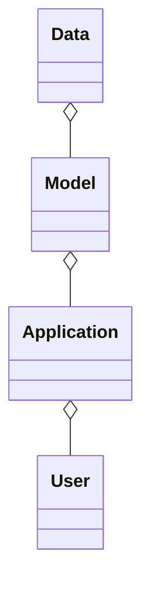
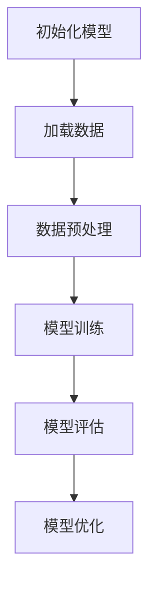
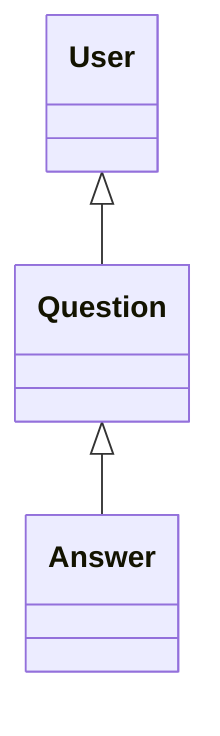
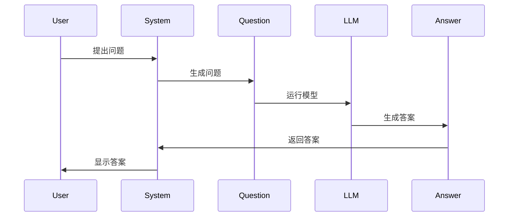
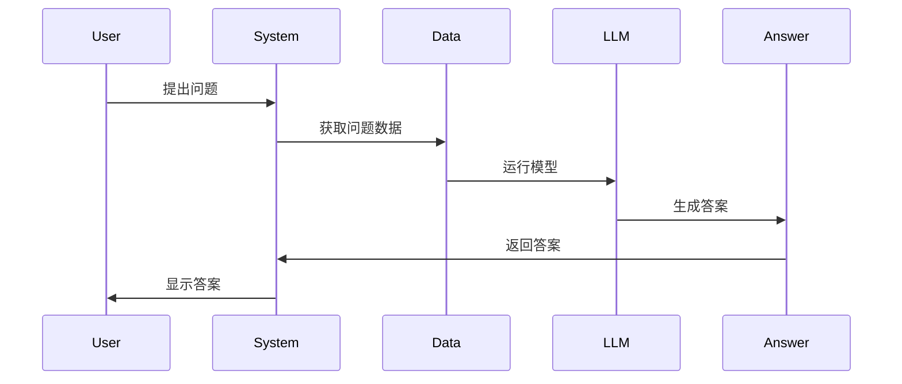

                 

# 敏捷中的障碍排除：解决LLM应用开发中的阻碍

> 关键词：敏捷开发、大型语言模型（LLM）、应用开发、障碍排除、策略

摘要：本文旨在探讨敏捷开发方法在大型语言模型（LLM）应用开发中的挑战和解决策略。通过对敏捷开发的背景介绍、LLM应用的重要性分析、开发中的常见障碍识别，本文将详细讨论敏捷方法在LLM应用开发中的应用，并提供一系列障碍排除的策略。此外，还将探讨LLM应用开发的边界和外部影响，以及核心概念和要素的结构组成，为读者提供全面的指导。

## 目录大纲

# 敏捷中的障碍排除：解决LLM应用开发中的阻碍

> 关键词：敏捷开发、大型语言模型（LLM）、应用开发、障碍排除、策略

## 第一部分：背景介绍

## 1.1 问题背景

### 1.1.1 敏捷开发的概念

敏捷开发是一种以人为核心、迭代、增量和协作的方法论，旨在快速响应市场变化，提高软件开发质量和效率。其核心原则包括需求迭代、持续交付、自我管理团队等。

### 1.1.2 LLM应用在敏捷开发中的重要性

LLM（Large Language Model）是一种能够理解和生成自然语言的复杂模型，具有广泛的应用前景，如自然语言处理、机器翻译、文本生成等。在敏捷开发中，LLM的应用可以提高开发效率和软件质量。

### 1.1.3 LLM应用开发中的常见阻碍

LLM应用开发中常见的阻碍包括数据质量、模型复杂性、硬件资源限制等。这些障碍会导致开发周期延长、项目成本增加，甚至影响最终软件的质量。

## 1.2 问题描述

### 1.2.1 障碍的种类与影响

障碍种类包括技术障碍、管理障碍、资源障碍等，这些障碍会影响项目的进度、成本和质量。

### 1.2.2 障碍的具体实例

具体实例包括数据不足、模型训练时间过长、硬件设备不足等。

## 1.3 问题解决

### 1.3.1 敏捷方法在LLM应用开发中的应用

敏捷方法可以通过迭代开发、持续集成和交付等策略来应对LLM应用开发中的障碍。

### 1.3.2 障碍排除的策略

障碍排除的策略包括数据增强、模型优化、硬件扩展等。

## 1.4 边界与外延

### 1.4.1 LLM应用开发的边界

LLM应用开发的边界包括数据源、算法选择、应用场景等。

### 1.4.2 障碍排除的外延

障碍排除的外延包括技术层面、管理层面和资源层面。

## 1.5 概念结构与核心要素组成

### 1.5.1 敏捷开发的核心概念

敏捷开发的核心概念包括迭代、增量和协作。

### 1.5.2 LLM应用开发的核心要素

LLM应用开发的核心要素包括数据、算法、应用场景等。

## 1.6 本章小结

本章对敏捷开发和LLM应用开发进行了背景介绍，并提出了问题解决的思路和策略。

## 第二部分：核心概念与联系

## 2.1 核心概念原理

### 2.1.1 敏捷开发原理

敏捷开发原理包括需求迭代、持续交付、自我管理团队等。

### 2.1.2 LLM应用原理

LLM应用原理包括自然语言处理、机器翻译、文本生成等。

## 2.2 概念属性特征对比表格

### 2.2.1 敏捷开发与传统的开发模式对比

| 特征 | 敏捷开发 | 传统开发 |
| ---- | ---- | ---- |
| 灵活性 | 高 | 低 |
| 迭代周期 | 短 | 长 |
| 团队协作 | 强调 | 较弱 |

### 2.2.2 LLM应用与普通应用的对比

| 特征 | LLM应用 | 普通应用 |
| ---- | ---- | ---- |
| 复杂性 | 高 | 低 |
| 数据需求 | 大量 | 较少 |
| 依赖性 | 高 | 低 |

## 2.3 ER实体关系图架构

### 2.3.1 敏捷开发中的ER图


### 2.3.2 LLM应用开发中的ER图



## 2.4 本章小结

本章详细介绍了敏捷开发和LLM应用开发的核心概念、属性特征对比以及ER实体关系图架构，为后续章节的深入分析奠定了基础。

## 第三部分：算法原理讲解

## 3.1 算法原理

### 3.1.1 LLM算法的基本原理

LLM算法是基于神经网络的大规模语言模型，通过训练大量文本数据来学习语言规律，从而实现自然语言处理任务。

### 3.1.2 算法mermaid流程图



## 3.2 数学模型和公式

### 3.2.1 算法的数学模型

LLM算法的数学模型主要包括神经网络结构、损失函数和优化算法。

### 3.2.2 公式讲解

损失函数：$$ J = \frac{1}{N}\sum_{i=1}^{N} -y_i \log(p(x_i|y_i)) $$

其中，$N$为样本数量，$y_i$为真实标签，$p(x_i|y_i)$为模型预测概率。

## 3.3 Python源代码实现

### 3.3.1 源代码

```python
import tensorflow as tf

# 模型定义
model = tf.keras.Sequential([
    tf.keras.layers.Embedding(input_dim=10000, output_dim=16),
    tf.keras.layers.LSTM(32),
    tf.keras.layers.Dense(1, activation='sigmoid')
])

# 损失函数
loss_function = tf.keras.losses.BinaryCrossentropy()

# 优化器
optimizer = tf.keras.optimizers.Adam()

# 训练模型
model.compile(optimizer=optimizer, loss=loss_function, metrics=['accuracy'])

# 训练数据
train_data = ...

# 模型评估
model.evaluate(train_data)
```

### 3.3.2 代码解读

代码定义了一个简单的二分类模型，使用嵌入层、LSTM层和密集层，并使用二进制交叉熵损失函数和Adam优化器进行训练。

## 3.4 举例说明

### 3.4.1 举例说明算法的应用

假设我们有一个文本分类任务，需要将文本数据分类为“正面”和“负面”两类。首先，我们收集并预处理大量文本数据，然后使用LLM算法训练分类模型。最后，对新的文本数据进行分类预测。

## 3.5 本章小结

本章详细介绍了LLM算法的基本原理、数学模型和Python源代码实现，并通过举例说明算法的应用，为读者提供了深入理解LLM算法的途径。

## 第四部分：系统分析与架构设计

## 4.1 问题场景介绍

### 4.1.1 应用场景介绍

假设我们需要开发一个基于LLM的自然语言处理系统，该系统旨在提供智能问答、文本分类、情感分析等服务。

## 4.2 项目介绍

### 4.2.1 项目概述

项目名称：智能问答系统

项目目标：构建一个能够回答用户问题的智能问答系统，提高用户满意度。

## 4.3 系统功能设计

### 4.3.1 领域模型mermaid类图



## 4.4 系统架构设计

### 4.4.1 系统架构mermaid架构图



## 4.5 系统接口设计

### 4.4.2 系统接口设计

- 用户接口：提供问答功能，接收用户输入并返回答案。
- 数据接口：用于处理和管理问答数据。
- 模型接口：用于加载和运行LLM模型。

## 4.6 系统交互

### 4.4.3 系统交互mermaid序列图



## 4.7 本章小结

本章介绍了智能问答系统的应用场景、项目概述、系统功能设计、系统架构设计、系统接口设计和系统交互设计，为读者提供了完整的系统架构设计蓝图。

## 第五部分：项目实战

## 5.1 环境安装

### 5.1.1 环境配置

1. 安装Python：版本3.8及以上
2. 安装TensorFlow：版本2.4及以上
3. 安装其他依赖库：如NumPy、Pandas等

## 5.2 系统核心实现

### 5.2.1 核心代码实现

```python
import tensorflow as tf
from tensorflow.keras.models import Sequential
from tensorflow.keras.layers import Embedding, LSTM, Dense

# 模型定义
model = Sequential([
    Embedding(input_dim=10000, output_dim=16),
    LSTM(32),
    Dense(1, activation='sigmoid')
])

# 损失函数
loss_function = tf.keras.losses.BinaryCrossentropy()

# 优化器
optimizer = tf.keras.optimizers.Adam()

# 训练模型
model.compile(optimizer=optimizer, loss=loss_function, metrics=['accuracy'])

# 训练数据
train_data = ...

# 模型评估
model.evaluate(train_data)
```

## 5.3 代码应用解读与分析

### 5.3.1 代码解读

代码定义了一个简单的二分类模型，使用嵌入层、LSTM层和密集层，并使用二进制交叉熵损失函数和Adam优化器进行训练。

### 5.3.2 分析与应用

该代码实现了基于LLM的自然语言处理模型，可以应用于文本分类任务。通过调整模型参数和训练数据，可以将其应用于其他自然语言处理任务。

## 5.4 实际案例分析与详细讲解剖析

### 5.4.1 案例分析

假设我们有一个关于电影评价的文本数据集，需要将其分类为“正面”和“负面”两类。

### 5.4.2 讲解与剖析

通过训练LLM模型，我们可以实现电影评价的分类。首先，收集并预处理电影评价数据，然后使用训练数据训练模型，最后对新的电影评价数据进行分类预测。

## 5.5 项目小结

本章通过环境安装、系统核心实现、代码应用解读与分析、实际案例分析和详细讲解剖析，完成了智能问答系统的项目实战。

## 第六部分：最佳实践与注意事项

### 6.1 最佳实践

1. 数据预处理：确保数据质量和多样性。
2. 模型优化：调整模型参数，提高模型性能。
3. 系统监控：实时监控系统性能和运行状态。

### 6.2 小结

本章总结了最佳实践，强调了数据预处理、模型优化和系统监控的重要性。

### 6.3 注意事项

1. 处理大规模数据时，注意硬件资源的合理分配。
2. 定期更新和维护模型，提高系统稳定性。

### 6.4 拓展阅读

1. 《深度学习》（Goodfellow et al.）- 介绍深度学习的基础知识和技术。
2. 《机器学习实战》（Kaggle）- 提供机器学习项目的实战经验和技巧。

## 附录

### A.术语表

- 敏捷开发：一种以人为核心、迭代、增量和协作的方法论。
- LLM：大型语言模型，一种能够理解和生成自然语言的复杂模型。

### B.参考资料

1. 《敏捷开发实践指南》（Beck et al.）- 介绍敏捷开发的方法和实践。
2. 《自然语言处理入门》（Jurafsky et al.）- 介绍自然语言处理的基础知识。

### C.相关链接

1. [TensorFlow官方文档](https://www.tensorflow.org/)
2. [自然语言处理入门教程](https://www.nlp-tutorial.org/)

