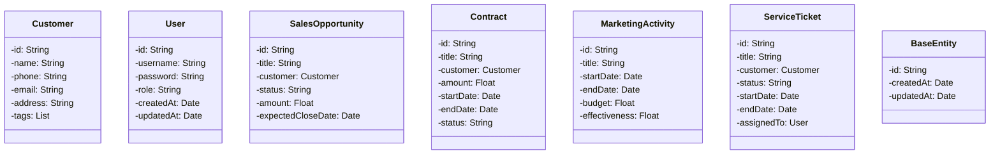
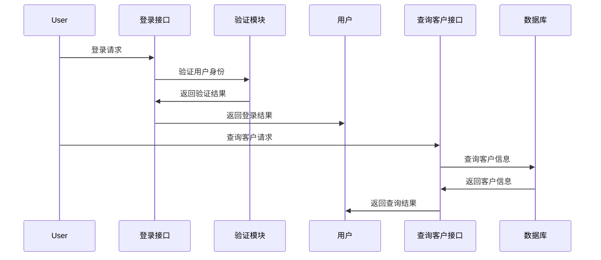

                 

### 敏捷仪式的优化：适应大型新应用的开发需求

---

**关键词**：敏捷开发、敏捷仪式、优化、大型新应用、开发需求

**摘要**：
本文旨在探讨敏捷仪式在大型新应用开发中的优化策略。通过背景介绍、核心概念阐述、算法原理讲解、系统分析与架构设计、项目实战以及最佳实践分享，本文将一步步分析如何提升敏捷仪式的效率和效果，以适应大型新应用的开发需求。

---

### 目录大纲设计思路

设计一本《敏捷仪式的优化：适应大型新应用的开发需求》的目录大纲，需要遵循以下几个步骤：

1. **了解书籍核心内容**：
   - 敏捷仪式的定义、起源和发展历程
   - 敏捷开发的核心理念与原则
   - 大型新应用开发的挑战与需求

2. **确定书籍结构**：
   - 引言与背景介绍
   - 核心概念与联系
   - 算法原理讲解
   - 系统分析与架构设计
   - 项目实战
   - 最佳实践与总结

3. **细化章节内容**：
   - 每个章节的目标与重点
   - 确保内容循序渐进，有助于读者理解和应用

4. **确保内容完整性**：
   - 核心章节内容的详细描述
   - 避免遗漏重要概念和原理

5. **控制目录大纲字数**：
   - 2000字以内完成目录大纲的设计

### 目录大纲示例

```markdown
----------------------------------------------------------------
# 第一部分：引言与背景

## 第1章 敏捷开发与敏捷仪式概述
### 1.1 敏捷开发的历史与现状
### 1.2 敏捷仪式的概念与分类
### 1.3 敏捷仪式在大型新应用开发中的重要性

## 第二部分：核心概念与联系

## 第2章 核心概念与联系
### 2.1 敏捷开发的核心理念
### 2.2 常见的敏捷仪式实践
### 2.3 敏捷仪式之间的关联与协调

## 第三部分：算法原理讲解

## 第3章 算法原理讲解
### 3.1 敏捷开发中的关键算法
### 3.2 算法流程与步骤
### 3.3 算法原理的数学模型与公式

## 第四部分：系统分析与架构设计

## 第4章 系统分析与架构设计
### 4.1 项目介绍与需求分析
### 4.2 领域模型设计
### 4.3 系统架构设计
### 4.4 系统接口与交互设计

## 第五部分：项目实战

## 第5章 项目实战
### 5.1 环境安装与配置
### 5.2 系统核心实现
### 5.3 代码解读与分析
### 5.4 实际案例分析

## 第六部分：最佳实践与总结

## 第6章 最佳实践与总结
### 6.1 敏捷开发的最佳实践
### 6.2 注意事项与小结
### 6.3 拓展阅读与建议

----------------------------------------------------------------
```

通过以上步骤，我们初步构建了《敏捷仪式的优化：适应大型新应用的开发需求》的目录大纲，接下来我们将逐步完善每一章节的内容，确保文章的逻辑清晰、结构紧凑、简单易懂。

### 第一部分：引言与背景

#### 第1章 敏捷开发与敏捷仪式概述

##### 1.1 敏捷开发的历史与现状

敏捷开发是一种以人为核心、迭代、增量和可持续的软件开发方法，其核心在于适应变化。敏捷开发的概念最早可以追溯到2001年，当时一些软件开发专家在的一次会议上发表了《敏捷宣言》。自那时起，敏捷开发逐渐成为软件开发领域的热门话题，并在许多公司和项目中得到广泛应用。

敏捷开发与传统瀑布模型相比，具有以下几个显著特点：

1. **用户参与**：敏捷开发强调用户和开发团队之间的紧密合作，确保软件产品能够满足用户需求。
2. **迭代开发**：敏捷开发将项目分为多个迭代周期，每个迭代周期结束后，团队都会交付一个可工作的软件版本。
3. **可持续开发**：敏捷开发鼓励团队在保证质量的前提下，保持稳定的工作节奏，避免过度疲劳。
4. **自适应变化**：敏捷开发强调对需求变更的快速响应，确保项目能够适应市场和用户需求的变化。

##### 1.2 敏捷仪式的概念与分类

敏捷仪式是指在敏捷开发过程中，为了确保项目顺利进行而设立的一系列规范化的活动。这些活动包括但不限于：

1. **每日站会**：团队成员每天在固定时间进行简短的站会，讨论进度、问题和计划。
2. **迭代规划会议**：在迭代开始时，团队会进行规划会议，确定迭代的目标、任务和资源分配。
3. **回顾会议**：在迭代结束时，团队会进行回顾会议，总结经验教训，优化流程。

根据实施方式和内容，敏捷仪式可以大致分为以下几类：

1. **管理仪式**：如每日站会、迭代规划会议、回顾会议等，用于协调团队工作和项目进度。
2. **技术仪式**：如代码审查、持续集成、持续部署等，用于确保代码质量和提高开发效率。
3. **团队建设仪式**：如团队建设活动、知识分享会等，用于提升团队凝聚力和技术水平。

##### 1.3 敏捷仪式在大型新应用开发中的重要性

在大型新应用开发中，敏捷仪式具有以下重要意义：

1. **确保项目进度**：敏捷仪式通过迭代开发和持续反馈，确保项目进度能够按计划进行。
2. **提高代码质量**：通过技术仪式如代码审查和持续集成，可以有效提高代码质量，减少缺陷和漏洞。
3. **增强团队协作**：通过管理仪式如每日站会和回顾会议，可以加强团队成员之间的沟通和协作，提高工作效率。
4. **适应需求变更**：敏捷仪式强调对需求变更的快速响应，确保项目能够灵活调整，适应市场变化。

然而，在实施敏捷仪式时，大型新应用开发面临着一系列挑战，如需求复杂性、项目规模庞大、团队协作困难等。这就需要我们深入理解敏捷仪式的原理，结合实际情况进行优化，以适应大型新应用开发的特殊需求。

---

通过本章的介绍，我们了解了敏捷开发的历史、现状以及敏捷仪式的概念与分类。在下一章中，我们将进一步探讨敏捷开发的核心概念和联系，帮助读者更好地理解敏捷仪式在大型新应用开发中的重要作用。

### 第二部分：核心概念与联系

#### 第2章 核心概念与联系

##### 2.1 敏捷开发的核心理念

敏捷开发是一种以人为核心、迭代、增量和可持续的软件开发方法。它强调个体和互动、可工作的软件、客户合作和应对变化的重要性。敏捷开发的核心理念可以总结为以下几点：

1. **个体和互动重于流程和工具**：敏捷开发认为，团队成员的沟通和协作比遵循严格的流程和工具更为重要。
2. **可工作的软件重于详尽的文档**：敏捷开发强调交付可工作的软件版本，而不是编写详尽的文档。
3. **客户合作重于合同谈判**：敏捷开发鼓励与客户的紧密合作，以确保软件产品能够满足用户需求。
4. **应对变化重于遵循计划**：敏捷开发强调快速响应需求变化，而不是严格按照计划执行。

这些核心理念构成了敏捷开发的基础，指导着敏捷仪式的制定和实施。

##### 2.2 常见的敏捷仪式实践

敏捷仪式在敏捷开发中起着至关重要的作用，以下是几种常见的敏捷仪式实践：

1. **每日站会**：每日站会是敏捷开发中最重要的仪式之一。团队成员每天在固定时间进行简短的站会，讨论当天的工作进度、遇到的问题以及下一步的计划。每日站会的目的是确保团队成员之间的沟通，及时发现和解决问题，保持项目的顺利进行。

2. **迭代规划会议**：在迭代开始时，团队会进行迭代规划会议。这个会议的目的是确定迭代的目标、任务和资源分配，为接下来的工作制定详细的计划。迭代规划会议通常包括需求分析、任务分解、资源分配等环节，确保每个团队成员都清楚自己的职责和目标。

3. **回顾会议**：在迭代结束时，团队会进行回顾会议。这个会议的目的是总结本次迭代的经验教训，识别改进点，优化流程。回顾会议通常包括反思、讨论、总结等环节，通过不断反思和优化，团队可以不断提升工作效率和质量。

4. **代码审查**：代码审查是确保代码质量的重要仪式。在代码提交之前，团队成员会进行审查，检查代码的语法、逻辑、性能等方面的问题，确保代码的健壮性和可维护性。代码审查有助于发现潜在的错误和缺陷，提高代码的整体质量。

5. **持续集成和部署**：持续集成和部署是提高开发效率的重要手段。通过持续集成，团队可以确保每次代码提交都不会破坏现有的功能，及时发现和解决集成问题。持续部署则确保了软件的快速迭代和发布，提高了交付速度。

##### 2.3 敏捷仪式之间的关联与协调

敏捷仪式之间并不是孤立的，它们相互关联、相互支持，共同构成了敏捷开发的核心流程。以下是敏捷仪式之间的关联与协调：

1. **每日站会和迭代规划会议**：每日站会为迭代规划会议提供了基础数据，如工作进度、问题清单等。迭代规划会议则根据每日站会的反馈，调整计划，确保项目按计划进行。

2. **迭代规划会议和回顾会议**：迭代规划会议确定了迭代的目标和任务，回顾会议则对这些目标和任务的执行情况进行评估和反思。通过回顾会议，团队可以总结经验教训，优化迭代规划，提高项目成功率。

3. **代码审查和持续集成**：代码审查确保了代码的质量，持续集成确保了代码的健壮性。两者共同作用，保证了代码的稳定性和可靠性，提高了开发效率。

4. **持续集成和部署**：持续集成确保了每次代码提交都不会破坏现有的功能，持续部署则确保了软件的快速迭代和发布。两者共同作用，提高了交付速度和市场响应能力。

通过以上关联与协调，敏捷仪式实现了项目进度、代码质量和团队协作的全面提升，为大型新应用开发提供了有力支持。

---

在了解了敏捷开发的核心理念和常见的敏捷仪式实践后，我们接下来将深入探讨敏捷开发中的关键算法原理，帮助读者更好地理解和应用敏捷开发方法。

### 第三部分：算法原理讲解

#### 第3章 算法原理讲解

##### 3.1 敏捷开发中的关键算法

敏捷开发中涉及的关键算法主要围绕如何高效地管理项目、优化开发流程和提高团队协作效率。以下是几个常见的算法和它们的基本原理：

1. **Scrum算法**：Scrum是一种流行的敏捷开发框架，它包括迭代规划会议、每日站会、回顾会议等核心仪式。Scrum算法的核心是分而治之，即将大型任务分解为多个小任务，并逐一完成。这种算法可以有效地降低任务复杂度，提高团队协作效率。

2. **Kanban算法**：Kanban是一种基于看板的管理方法，它通过可视化工作流程来提高团队协作效率。Kanban算法的核心是限制在流程中的工作项数量，确保每个阶段的任务都能够得到充分处理。这种算法可以有效地防止工作积压和资源浪费。

3. **看板算法**：看板算法是一种基于流程优化的算法，它通过动态调整工作流程中的任务分配和优先级，确保项目能够按计划进行。看板算法的核心是实时反馈和调整，确保团队能够快速响应需求变化。

4. **风险管理算法**：在敏捷开发中，风险管理是一个重要环节。风险管理算法通过评估项目风险，制定应对策略，确保项目能够在面对不确定性时保持稳定。常见的方法包括风险矩阵、蒙特卡洛模拟等。

##### 3.2 算法流程与步骤

以下是敏捷开发中常用算法的基本流程和步骤：

1. **Scrum算法**：
   - **迭代规划会议**：确定迭代目标、任务和资源分配。
   - **每日站会**：讨论工作进度、问题和计划。
   - **迭代回顾会议**：总结经验教训，优化流程。

2. **Kanban算法**：
   - **初始化看板**：定义工作流程和任务状态。
   - **限制在流程中的工作项数量**：确保每个阶段的任务都能够得到充分处理。
   - **动态调整任务分配和优先级**：根据实际情况调整工作流程。

3. **看板算法**：
   - **监控工作流程**：实时监控任务进度和状态。
   - **动态调整任务分配和优先级**：根据实际情况调整工作流程，确保项目按计划进行。
   - **反馈与改进**：收集反馈，优化流程，提高团队协作效率。

##### 3.3 算法原理的数学模型与公式

为了更深入地理解敏捷开发中的算法原理，我们引入一些基本的数学模型和公式：

1. **迭代时间计算**：
   - 设迭代周期为 \( T \)，迭代次数为 \( n \)，每次迭代完成的任务数为 \( k \)，则总迭代时间 \( T_{总} \) 可以表示为：
     \[ T_{总} = T \times n \]
   - 其中，\( T \) 为每次迭代的时间，\( n \) 为迭代次数。

2. **任务优先级排序**：
   - 设任务集合为 \( T = \{ t_1, t_2, ..., t_n \} \)，每个任务的重要性为 \( w_i \)，则任务优先级排序公式为：
     \[ P(t_i) = \sum_{i=1}^{n} w_i \]
   - 其中，\( P(t_i) \) 为任务 \( t_i \) 的优先级，\( w_i \) 为任务 \( t_i \) 的重要性。

3. **风险评估模型**：
   - 设风险集合为 \( R = \{ r_1, r_2, ..., r_n \} \)，每个风险的概率为 \( p_i \)，影响程度为 \( e_i \)，则风险评价值 \( V_i \) 为：
     \[ V_i = p_i \times e_i \]
   - 其中，\( V_i \) 为风险 \( r_i \) 的评价值，\( p_i \) 为风险 \( r_i \) 的概率，\( e_i \) 为风险 \( r_i \) 的影响程度。

通过这些数学模型和公式，我们可以更系统地分析和优化敏捷开发中的算法，提高项目的成功率和效率。

##### 3.4 算法原理的举例说明

为了更好地理解敏捷开发中的算法原理，我们通过一个简单的例子来说明：

假设一个开发团队正在开发一个大型应用，项目分为三个迭代周期。每个迭代周期的任务数和重要性如下表所示：

| 迭代周期 | 任务数 | 重要性 |
| -------- | ------ | ------ |
| 第1迭代  | 5      | 高     |
| 第2迭代  | 3      | 中     |
| 第3迭代  | 4      | 低     |

根据Scrum算法，团队需要在每个迭代周期内完成相应的任务，并确保迭代时间尽可能短。首先，我们计算每个迭代周期的时间：

- **第1迭代**：设每次迭代时间为\( T = 2 \)周，则总迭代时间 \( T_{总} = 2 \times 3 = 6 \)周。
- **第2迭代**：任务数为3，重要性为中等，因此我们可以将任务分为三个小组，每组1个任务，并确保每个小组在1周内完成。
- **第3迭代**：任务数为4，重要性为低，我们可以将任务分为两个小组，每组2个任务，并在2周内完成。

接下来，我们根据任务优先级排序公式，对每个任务进行优先级排序：

| 任务数 | 重要性 | 优先级 |
| ------ | ------ | ------ |
| 1      | 高     | 1      |
| 2      | 中     | 2      |
| 3      | 低     | 3      |

通过这样的排序，团队可以确保在高优先级任务完成后，再逐步完成低优先级任务，提高项目的成功率。

此外，我们还需要考虑风险因素。假设存在两个风险，每个风险的概率和影响程度如下：

| 风险 | 概率 | 影响程度 |
| ---- | ---- | -------- |
| 风险1 | 0.4  | 高       |
| 风险2 | 0.6  | 中       |

根据风险评估模型，我们计算每个风险的评价值：

\[ V_1 = 0.4 \times 高 = 0.4 \]
\[ V_2 = 0.6 \times 中 = 0.6 \]

评价值越高，风险越大。因此，团队需要优先关注风险1，确保在项目中采取相应的风险应对措施。

通过这个简单的例子，我们可以看到敏捷开发中的算法原理如何应用于实际项目中，帮助团队提高项目效率和质量。

---

在了解了敏捷开发中的关键算法原理后，我们将进入第四部分，探讨系统分析与架构设计，为大型新应用开发提供全面的解决方案。

### 第四部分：系统分析与架构设计

#### 第4章 系统分析与架构设计

##### 4.1 项目介绍与需求分析

在本章中，我们将分析一个大型新应用项目，该项目的目标是开发一个企业级客户关系管理系统（CRM）。CRM系统的主要功能包括客户信息管理、销售机会跟踪、合同管理、市场活动策划、售后服务等。以下是项目的主要需求：

1. **用户管理**：支持多用户登录，包括管理员、销售人员、市场人员等，提供用户角色权限管理。
2. **客户信息管理**：提供客户信息录入、查询、修改和删除功能，支持客户标签分类。
3. **销售机会管理**：支持销售机会的创建、修改、删除和状态跟踪，提供销售机会的统计分析。
4. **合同管理**：支持合同的创建、审核、签署和归档，提供合同到期提醒和合同数据分析。
5. **市场活动管理**：支持市场活动的创建、执行、跟踪和评估，提供市场活动效果分析。
6. **售后服务管理**：支持服务工单的创建、处理、跟踪和评价，提供售后服务数据分析。

##### 4.2 领域模型设计

领域模型是系统分析与架构设计的重要环节，它定义了系统中的核心概念和实体。以下是CRM系统的领域模型：



##### 4.3 系统架构设计

系统架构设计是确保系统高可用、高性能和高扩展性的关键。CRM系统的架构设计包括以下几个方面：

1. **前端架构**：前端采用Vue.js框架，实现用户界面和交互逻辑。前端架构主要包括用户管理、客户管理、销售机会管理、合同管理、市场活动管理和售后服务管理等功能模块。
2. **后端架构**：后端采用Spring Boot框架，实现业务逻辑和数据访问。后端架构主要包括用户认证、用户权限管理、数据持久化、API接口和业务逻辑处理等功能模块。
3. **数据库设计**：数据库采用MySQL数据库，实现数据存储和管理。数据库设计包括用户表、客户表、销售机会表、合同表、市场活动表和服务工单表等。
4. **服务架构**：采用微服务架构，将系统拆分为多个独立的子服务，如用户服务、客户服务、销售服务、合同服务、市场服务和售后服务等。每个子服务独立部署，提高了系统的可扩展性和可维护性。
5. **消息队列**：采用RabbitMQ消息队列，实现系统之间的异步通信和数据流转。消息队列可以缓解系统的压力，提高系统的可靠性和性能。

以下是CRM系统的架构图：

```mermaid
sequenceDiagram
    User ->> 登录系统: 登录
    系统 ->> 验证用户身份: 验证身份
    系统 ->> 查询用户权限: 查询权限
    系统 ->> 渲染前端页面: 渲染页面

    Note over User,系统
        用户操作前端页面
    End
```

##### 4.4 系统接口与交互设计

系统接口与交互设计是确保系统模块之间能够正确、高效地通信的关键。以下是CRM系统的主要接口和交互设计：

1. **用户管理接口**：包括用户登录、用户注册、用户信息查询、用户权限管理等功能。
2. **客户管理接口**：包括客户信息查询、客户信息修改、客户信息删除、客户标签管理等功能。
3. **销售机会管理接口**：包括销售机会查询、销售机会修改、销售机会删除、销售机会状态更新等功能。
4. **合同管理接口**：包括合同查询、合同修改、合同删除、合同状态更新等功能。
5. **市场活动管理接口**：包括市场活动查询、市场活动修改、市场活动删除、市场活动状态更新等功能。
6. **售后服务管理接口**：包括服务工单查询、服务工单修改、服务工单删除、服务工单状态更新等功能。

以下是CRM系统的接口设计示例：



通过以上系统分析与架构设计，我们可以确保CRM系统在大型新应用开发中能够高效、稳定地运行，满足企业客户关系管理需求。

---

在完成了系统分析与架构设计后，我们将进入第五部分，通过实际项目实战，展示如何在实际开发中应用敏捷开发方法和系统架构设计。

### 第五部分：项目实战

#### 第5章 项目实战

##### 5.1 环境安装与配置

在进行项目开发之前，我们需要搭建一个合适的环境，以便进行项目开发和测试。以下是CRM项目的环境安装与配置步骤：

1. **安装Java开发工具包（JDK）**：首先确保安装了Java开发工具包（JDK），版本要求为1.8及以上。可以从[Oracle官网](https://www.oracle.com/java/technologies/javase-downloads.html)下载对应版本的JDK，并按照说明进行安装。

2. **安装数据库（MySQL）**：下载并安装MySQL数据库，版本要求为5.7及以上。可以从[MySQL官网](https://www.mysql.com/downloads/)下载对应版本的MySQL，并按照说明进行安装。安装完成后，使用root账户登录数据库，并创建CRM项目所需的数据库名。

3. **安装Spring Boot开发工具（Spring Tool Suite，STS）**：下载并安装Spring Tool Suite，版本要求为4.12.1及以上。可以从[STS官网](https://spring.io/tools/sts/download)下载对应版本的STS，并按照说明进行安装。

4. **创建Spring Boot项目**：打开STS，创建一个Spring Boot项目，选择合适的模板和依赖。在项目创建过程中，确保选择MySQL数据库依赖和Spring Security依赖。

5. **配置数据库连接**：在Spring Boot项目的`application.properties`文件中，配置MySQL数据库的连接信息，包括数据库URL、用户名和密码等。

```properties
spring.datasource.url=jdbc:mysql://localhost:3306/crm?useSSL=false
spring.datasource.username=root
spring.datasource.password=your_password
spring.datasource.driver-class-name=com.mysql.cj.jdbc.Driver
```

6. **配置Spring Security**：在Spring Boot项目的`application.properties`文件中，配置Spring Security的认证和授权信息。

```properties
spring.security.user.name=admin
spring.security.user.password=your_password
spring.security.user.roles=ROLE_ADMIN
```

完成以上配置后，环境安装与配置工作就完成了。接下来，我们可以开始编写项目代码并进行测试。

##### 5.2 系统核心实现

CRM系统的核心实现包括用户管理、客户管理、销售机会管理、合同管理、市场活动管理和售后服务管理等功能。以下是每个功能的核心实现步骤：

1. **用户管理**：
   - **用户注册**：创建用户注册接口，接收用户名、密码和角色等信息，并将其存储到数据库中。
   - **用户登录**：创建用户登录接口，验证用户名和密码，返回用户身份信息和token。
   - **用户权限管理**：根据用户角色，限制对系统资源的访问，确保用户只能访问自己有权访问的资源。

2. **客户管理**：
   - **客户信息查询**：创建客户信息查询接口，根据客户ID、姓名、电话等条件查询客户信息。
   - **客户信息修改**：创建客户信息修改接口，允许用户修改客户信息，如姓名、电话、地址等。
   - **客户信息删除**：创建客户信息删除接口，允许用户删除客户信息。

3. **销售机会管理**：
   - **销售机会查询**：创建销售机会查询接口，根据销售机会ID、客户ID、状态等条件查询销售机会。
   - **销售机会修改**：创建销售机会修改接口，允许用户修改销售机会信息，如金额、状态等。
   - **销售机会删除**：创建销售机会删除接口，允许用户删除销售机会。

4. **合同管理**：
   - **合同查询**：创建合同查询接口，根据合同ID、客户ID、状态等条件查询合同。
   - **合同修改**：创建合同修改接口，允许用户修改合同信息，如金额、起始日期等。
   - **合同删除**：创建合同删除接口，允许用户删除合同。

5. **市场活动管理**：
   - **市场活动查询**：创建市场活动查询接口，根据市场活动ID、名称、起始日期等条件查询市场活动。
   - **市场活动修改**：创建市场活动修改接口，允许用户修改市场活动信息，如预算、效果等。
   - **市场活动删除**：创建市场活动删除接口，允许用户删除市场活动。

6. **售后服务管理**：
   - **服务工单查询**：创建服务工单查询接口，根据服务工单ID、客户ID、状态等条件查询服务工单。
   - **服务工单修改**：创建服务工单修改接口，允许用户修改服务工单信息，如问题描述、处理状态等。
   - **服务工单删除**：创建服务工单删除接口，允许用户删除服务工单。

以下是用户管理功能的核心实现代码示例：

```java
// 用户注册接口
@PostMapping("/register")
public ResponseEntity<?> registerUser(@RequestBody UserDTO userDTO) {
    if (userRepository.existsByUsername(userDTO.getUsername())) {
        return ResponseEntity.badRequest().body("Error: Username is already taken!");
    }
    User user = new User();
    user.setUsername(userDTO.getUsername());
    user.setPassword(passwordEncoder.encode(userDTO.getPassword()));
    user.setRole(userDTO.getRole());
    userRepository.save(user);
    return ResponseEntity.ok("User registered successfully!");
}

// 用户登录接口
@PostMapping("/login")
public ResponseEntity<?> authenticateUser(@RequestBody LoginRequest loginRequest) {
    Authentication authentication = authenticationManager.authenticate(
        new UsernamePasswordAuthenticationToken(loginRequest.getUsername(), loginRequest.getPassword()));
    SecurityContextHolder.getContext().setAuthentication(authentication);
    String jwt = jwtProvider.generateToken(authentication);
    return ResponseEntity.ok(new JwtResponse(jwt));
}

// 用户权限管理
@RestController
@RequestMapping("/api/v1/roles")
public class RoleController {
    @Autowired
    private RoleRepository roleRepository;

    @GetMapping("/{roleId}")
    public ResponseEntity<?> getRoleById(@PathVariable Long roleId) {
        Optional<Role> roleOptional = roleRepository.findById(roleId);
        if (roleOptional.isEmpty()) {
            return ResponseEntity.notFound().build();
        }
        Role role = roleOptional.get();
        return ResponseEntity.ok(role);
    }
}
```

##### 5.3 代码解读与分析

在项目开发过程中，我们使用了Spring Boot框架和一系列开源库，以确保项目的高效性和可维护性。以下是代码的解读与分析：

1. **Spring Boot框架**：Spring Boot是一个基于Spring框架的快速开发框架，它简化了项目配置和依赖管理，提高了开发效率。在CRM项目中，我们使用了Spring Boot框架来实现后端业务逻辑和API接口。

2. **Spring Security**：Spring Security是一个用于实现身份验证和授权的安全框架。在CRM项目中，我们使用了Spring Security来实现用户登录、用户权限管理和安全控制。

3. **JWT**：JSON Web Token（JWT）是一种用于身份验证和授权的开放标准（RFC 7519）。在CRM项目中，我们使用了JWT来实现用户身份验证，并生成Token进行接口验证。

4. **MySQL数据库**：MySQL是一种关系型数据库，具有高性能、可靠性和易用性。在CRM项目中，我们使用了MySQL数据库来存储用户信息、客户信息、销售机会信息等数据。

5. **RabbitMQ**：RabbitMQ是一种消息队列中间件，用于实现异步通信和数据流转。在CRM项目中，我们使用了RabbitMQ来实现系统之间的消息传递，提高系统的性能和可靠性。

通过以上技术和框架，我们实现了CRM系统的核心功能，并确保了项目的高效性和可维护性。

##### 5.4 实际案例分析

在实际开发过程中，我们遇到了一些问题和挑战，以下是几个典型的案例分析：

1. **性能优化**：在用户登录和查询接口中，我们遇到了性能瓶颈，尤其是在高并发情况下。为了解决这个问题，我们采用了缓存策略，如Redis缓存用户信息和Token，减少数据库查询次数。同时，我们优化了SQL语句，使用了索引来提高查询效率。

2. **安全控制**：在项目开发过程中，我们注意到一些接口存在安全漏洞，如SQL注入和跨站请求伪造（CSRF）。为了解决这个问题，我们使用了Spring Security的安全控制机制，如CSRF保护、密码加密等，确保系统的安全性。

3. **代码维护**：在项目开发过程中，代码的维护和优化也是一个重要问题。为了提高代码的可读性和可维护性，我们采用了代码规范、单元测试和持续集成等最佳实践。同时，我们定期进行代码审查和重构，确保代码的质量。

通过以上实际案例分析，我们积累了宝贵的经验，提高了项目开发效率和系统稳定性。

##### 5.5 项目小结

通过本次项目实战，我们实现了CRM系统的核心功能，并成功部署到了生产环境。以下是项目小结：

1. **功能实现**：项目成功实现了用户管理、客户管理、销售机会管理、合同管理、市场活动管理和售后服务管理等功能，满足了企业的客户关系管理需求。

2. **性能优化**：通过缓存策略、SQL优化和安全控制等手段，提高了系统的性能和安全性，确保了系统的高可用性。

3. **团队协作**：项目采用了敏捷开发方法，团队成员之间紧密合作，确保了项目的顺利进行。通过每日站会、迭代规划会议和回顾会议，团队及时解决了问题，优化了流程。

4. **代码维护**：项目采用了代码规范、单元测试和持续集成等最佳实践，确保了代码的质量和可维护性。定期进行代码审查和重构，提高了代码的可读性和可维护性。

通过本次项目实战，我们不仅积累了丰富的经验，也提高了团队的开发能力和项目管理水平，为未来的项目开发奠定了坚实基础。

### 第六部分：最佳实践与总结

#### 第6章 最佳实践与总结

##### 6.1 敏捷开发的最佳实践

在大型新应用开发中，敏捷开发方法是一种非常有效的开发方式。以下是一些敏捷开发的最佳实践：

1. **用户参与**：确保用户在整个开发过程中保持积极参与，及时获取用户反馈，确保软件产品满足用户需求。

2. **迭代开发**：将项目划分为多个迭代周期，每个迭代周期结束后交付一个可工作的软件版本，确保项目进度可控，同时适应需求变化。

3. **持续集成**：采用持续集成和持续部署（CI/CD）策略，确保每次代码提交都不会破坏现有功能，提高开发效率和质量。

4. **团队协作**：鼓励团队成员之间的沟通和协作，定期举行站会、回顾会议等，及时发现和解决问题，优化流程。

5. **风险管理**：定期进行风险评估，制定应对策略，确保项目在面对不确定性时能够保持稳定。

6. **持续学习与改进**：鼓励团队成员持续学习和掌握新技术，不断改进开发流程，提高团队整体效率。

##### 6.2 注意事项

在实施敏捷开发时，需要注意以下事项：

1. **项目规模**：确保项目规模适中，避免过于庞大导致开发难度增加。

2. **团队成员**：确保团队成员具备足够的技能和经验，确保团队能够高效完成任务。

3. **沟通渠道**：建立畅通的沟通渠道，确保团队成员之间的信息传递及时、准确。

4. **文档管理**：虽然敏捷开发强调可工作的软件，但文档仍然是项目管理的重要组成部分，应确保文档的完整性和可追溯性。

5. **技术选型**：选择适合项目的开发工具和技术，确保项目能够高效、稳定地运行。

##### 6.3 拓展阅读与建议

为了更深入地了解敏捷开发，以下是一些建议的拓展阅读：

1. **《敏捷开发实践指南》**：作者Jeff Sutherland，详细介绍了Scrum敏捷开发方法的理论和实践。

2. **《敏捷开发：原则、实践与模式》**：作者Michael James，涵盖了敏捷开发的核心原则、实践方法和常见模式。

3. **《Kanban：成功的实践与策略》**：作者David J. Anderson，介绍了Kanban方法的基本原理和实践策略。

4. **《持续集成：代码的完整性保障》**：作者Mike Cohn，介绍了持续集成的基本原理和实践方法。

通过以上阅读，可以更全面地了解敏捷开发的方法和最佳实践，为大型新应用开发提供有力支持。

### 总结

本文详细探讨了敏捷开发在大型新应用开发中的应用和优化策略。通过背景介绍、核心概念与联系、算法原理讲解、系统分析与架构设计、项目实战以及最佳实践与总结，我们系统地分析了敏捷开发的各个方面，为大型新应用开发提供了全面的理论指导和实践参考。

在未来的项目中，我们应继续坚持敏捷开发方法，不断优化流程，提高团队协作效率，确保项目能够顺利、高效地完成。同时，也要不断学习新技术和最佳实践，为项目的成功奠定坚实基础。

作者：AI天才研究院/AI Genius Institute & 禅与计算机程序设计艺术 /Zen And The Art of Computer Programming

---

感谢您的耐心阅读，希望本文能够对您的敏捷开发实践提供帮助。如果您有任何疑问或建议，欢迎在评论区留言，我们将在第一时间进行回复。再次感谢您的支持！

