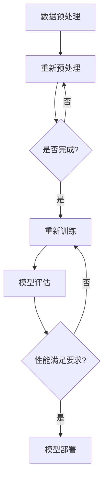
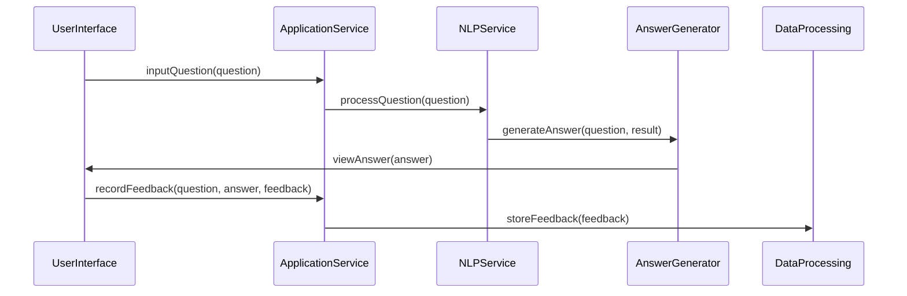
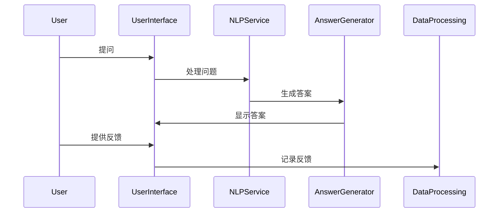

                 

# 敏捷发布计划：管理LLM应用的长期目标

## 关键词
- 敏捷发布计划
- LLM应用
- 管理策略
- 长期目标
- 算法优化

## 摘要
本文旨在探讨如何通过敏捷发布计划来管理大型语言模型（LLM）应用的长期目标。首先，我们将介绍敏捷发布计划的概念及其核心原则，并分析其在LLM应用管理中的重要性。接着，我们将深入讲解与敏捷发布计划相关的核心概念，包括其与传统发布计划的对比、框架与流程。随后，我们将详细阐述LLM的基本原理及其在敏捷发布计划中的应用，并通过算法流程图和Python代码实现进行解释。此外，我们将使用LaTeX格式介绍数学模型和数学公式，并通过实例进行详细讲解。最后，我们将展示一个虚拟项目，介绍系统功能设计、架构设计、接口设计和交互流程，并通过实际案例来讲解敏捷发布计划的实施过程。文章将以最佳实践、小结和注意事项为总结，提供进一步拓展阅读的建议。

## 1. 背景介绍

### 1.1 引言

在当今快速发展的技术时代，大型语言模型（LLM）已经成为人工智能领域的重要应用之一。LLM能够处理大量的语言数据，并生成高质量的自然语言文本，这使得它们在自然语言处理、机器翻译、文本生成和问答系统等领域有着广泛的应用。然而，随着LLM应用规模的不断扩大和复杂性的增加，如何有效地管理这些应用成为了一个挑战。

敏捷发布计划是一种适用于快速迭代和变化的软件开发过程的策略。它通过将项目划分为小的、可管理的任务，并在短时间内完成这些任务，以确保项目能够灵活地适应变化。敏捷发布计划的核心原则包括用户反馈、迭代开发和持续交付。这些原则有助于提高开发效率、减少风险，并确保最终产品能够满足用户需求。

在管理LLM应用时，敏捷发布计划的重要性不可忽视。首先，LLM应用通常涉及大量的数据处理和模型训练，这使得它们需要不断更新和优化。敏捷发布计划能够帮助团队快速地迭代和改进LLM模型，从而提高其性能和适用性。其次，敏捷发布计划能够确保团队在开发过程中保持与用户的紧密沟通，从而更好地理解用户需求，并及时调整开发方向。此外，敏捷发布计划还强调持续交付，这有助于确保LLM应用能够及时推向市场，并迅速获得用户反馈，从而进一步优化产品。

总之，敏捷发布计划为管理LLM应用提供了有效的策略和工具。通过灵活的迭代开发和持续交付，团队可以更好地应对复杂性和变化，确保LLM应用能够在竞争激烈的市场中取得成功。

### 1.2 敏捷发布计划的定义与核心原则

敏捷发布计划是一种软件开发和项目管理的方法，旨在通过快速迭代和持续交付来提高开发效率和产品质量。敏捷发布计划的核心原则包括用户反馈、迭代开发和持续交付，这些原则共同构成了敏捷开发的核心价值观。

**用户反馈**是敏捷发布计划的核心之一。在传统开发方法中，项目往往在开发完成后才与用户进行接触，这种方式可能导致开发的产品无法完全满足用户需求。敏捷发布计划强调在开发过程中持续收集用户反馈，并根据反馈进行及时调整。这种方式有助于确保最终产品能够更好地满足用户需求，提高用户满意度。

**迭代开发**是敏捷发布计划的另一个重要原则。迭代开发将项目划分为多个小的、可管理的任务，每个任务称为一个迭代周期。每个迭代周期通常持续几周到几个月，然后团队会进行评估和回顾，以便在下一次迭代中进行改进。这种迭代开发的方式使得团队能够快速地响应变化，并持续优化产品。

**持续交付**是敏捷发布计划的最终目标。持续交付意味着团队在每次迭代结束后都能够交付一个可用的产品版本，并将其推送到生产环境。这种方式有助于缩短开发周期，减少风险，并确保产品能够及时推向市场。

敏捷发布计划与传统发布计划有以下几点不同：

1. **迭代开发**：传统发布计划通常采用瀑布模型，将项目划分为多个阶段，每个阶段完成后才能进入下一个阶段。而敏捷发布计划采用迭代开发，每个迭代周期结束后都可以交付一个可用的产品版本。
   
2. **用户反馈**：传统发布计划在开发完成后才与用户接触，而敏捷发布计划在开发过程中持续收集用户反馈，并根据反馈进行改进。

3. **持续交付**：传统发布计划通常在项目完成后再进行交付，而敏捷发布计划在每次迭代结束后都可以交付一个可用的产品版本。

通过这些核心原则和与传统发布计划的不同之处，敏捷发布计划为团队提供了有效的工具和方法，以应对快速变化的市场需求和技术发展。

### 1.3 LLM应用的背景与挑战

大型语言模型（LLM）是自然语言处理（NLP）领域的重要进展之一，它们通过深度学习和大规模数据训练，能够生成高质量的文本和进行复杂的语言理解任务。LLM的应用范围广泛，包括机器翻译、文本摘要、问答系统、文本生成和对话系统等。然而，随着LLM应用规模的不断扩大和复杂性的增加，管理这些应用面临着一系列挑战。

首先，LLM应用的数据需求巨大。训练一个高性能的LLM模型需要海量的高质量语言数据，这些数据不仅需要来自多种语言和领域，还需要涵盖各种语言现象和用法。数据的质量和多样性直接影响模型的性能和适用性，因此，如何获取和整理这些数据成为了一个关键问题。

其次，LLM模型的训练和优化过程非常耗时。训练一个LLM模型通常需要数天甚至数周的时间，这取决于模型的大小和数据集的规模。此外，模型的优化和调参也是一个复杂的过程，需要反复尝试和实验，以找到最佳参数组合。这些因素使得LLM应用的开发周期较长，增加了项目管理的难度。

第三，LLM应用需要不断更新和迭代。随着语言和技术的不断发展，用户需求也在不断变化。为了保持模型的竞争力，团队需要定期更新模型，包括添加新的数据、调整模型结构和优化算法。这种持续迭代的需求要求团队具备高度的灵活性和快速响应能力。

最后，LLM应用在部署和运维过程中也面临挑战。大规模的LLM模型通常需要大量的计算资源和存储空间，这要求基础设施能够支持高并发和高吞吐量的请求。同时，模型的安全性和隐私保护也是一个重要考虑因素，特别是在处理敏感数据时。

总之，管理LLM应用需要应对数据需求、训练时间、模型更新和运维等多方面的挑战。敏捷发布计划为团队提供了一种有效的策略，通过灵活的迭代开发和持续交付，可以帮助团队更好地管理这些挑战，确保LLM应用的持续发展和优化。

### 2. 核心概念与联系

#### 2.1 敏捷发布计划的关键概念

敏捷发布计划的成功实施依赖于几个关键概念，这些概念相互关联，共同构成了敏捷开发的核心理念。

**1. 产品待办列表（Product Backlog）**：产品待办列表是敏捷开发中的一个核心概念，它包含所有待完成的任务和功能点，由产品负责人（Product Owner）负责维护和优先级排序。产品待办列表中的每个条目称为用户故事（User Story），它描述了一个具体的功能或特性，以及用户希望实现的价值。

**2. 迭代（Sprint）**：迭代是敏捷开发中的一个固定周期，通常持续2到4周。在每个迭代开始时，团队会从产品待办列表中选择若干个用户故事进行开发。迭代的目标是交付一个可工作的产品版本，因此在每个迭代结束时，团队会进行迭代回顾（Sprint Review）和迭代回顾（Sprint Retrospective）。

**3. 站会（Daily Stand-up）**：站会是每天进行的一种简短的会议，旨在让团队成员分享他们的进展、遇到的障碍和计划。站会的目的是确保团队保持同步，快速解决问题，避免问题的积累。

**4. 用户体验地图（User Experience Map）**：用户体验地图是一种可视化工具，用于描述用户在交互过程中可能遇到的各个环节。它有助于团队理解用户的行为路径和痛点，从而在开发过程中更好地满足用户需求。

**5. 持续集成（Continuous Integration）**：持续集成是一种开发实践，旨在通过频繁的代码提交和自动化的构建和测试，确保代码库的稳定性和质量。持续集成有助于及早发现和修复潜在问题，从而提高开发效率。

**6. 燎原计划（Pivotal Tracker）**：燎原计划是一种项目管理工具，用于跟踪和管理产品待办列表、迭代和任务。它提供了直观的界面，帮助团队清晰地了解项目的进度和优先级。

#### 2.2 敏捷发布计划与传统发布计划对比

敏捷发布计划与传统的发布计划有以下几点显著区别：

**1. 开发周期**：传统发布计划通常采用瀑布模型，项目在完成所有阶段后才会交付。而敏捷发布计划采用迭代开发，每个迭代周期结束后都可以交付一个可工作的产品版本。

**2. 用户反馈**：传统发布计划在开发完成后才会与用户接触，而敏捷发布计划在开发过程中持续收集用户反馈，并根据反馈进行迭代改进。

**3. 灵活性**：敏捷发布计划强调团队在面对变化时能够灵活调整，而传统发布计划则更为僵化，难以应对快速变化的市场需求。

**4. 风险管理**：敏捷发布计划通过频繁的迭代和交付，能够及早识别和解决问题，从而降低整体项目风险。而传统发布计划在项目后期才进行验收测试，风险较高。

**5. 团队协作**：敏捷发布计划强调跨职能团队的协作，团队成员需要具备多方面的技能，而传统发布计划通常按照职能划分团队，协作较少。

#### 2.3 敏捷发布计划的框架与流程

敏捷发布计划的框架通常包括以下步骤：

**1. 产品待办列表构建**：产品负责人根据用户需求和业务目标，构建产品待办列表，并将其分解为具体的用户故事。

**2. 迭代计划**：团队在每个迭代开始时，从产品待办列表中选择若干用户故事进行开发，并制定迭代计划。

**3. 迭代开发**：团队按照迭代计划进行开发，每天进行站会，确保团队成员同步进展和解决问题。

**4. 持续集成**：开发过程中，团队通过持续集成工具进行代码提交和自动化测试，确保代码库的稳定性和质量。

**5. 迭代交付**：每个迭代周期结束后，团队交付一个可工作的产品版本，并进行迭代回顾和迭代回顾。

**6. 产品待办列表更新**：根据用户反馈和业务需求，产品负责人更新产品待办列表，确保项目的持续改进。

通过这些步骤，敏捷发布计划能够确保团队在开发过程中保持灵活性和高效性，从而更好地管理LLM应用的开发和发布。

### 3. 算法原理讲解

#### 3.1 LLM的基本原理

大型语言模型（LLM）是基于深度学习和自然语言处理（NLP）技术的复杂算法模型。LLM通过大规模数据训练，能够理解并生成高质量的自然语言文本。LLM的基本原理包括以下几个关键组成部分：

**1. 语言数据预处理**：在训练LLM之前，需要收集和处理大量的语言数据。预处理步骤包括数据清洗、分词、去噪和词汇化等。这些步骤有助于提高数据质量，为后续的训练提供可靠的基础。

**2. 词嵌入（Word Embedding）**：词嵌入是将文本中的单词转换为向量表示的过程。通过词嵌入，LLM能够将语义信息编码到向量中，从而在模型训练过程中利用向量的数学性质进行学习。

**3. 深度神经网络（Deep Neural Network）**：LLM通常采用深度神经网络结构，特别是变体循环神经网络（Transformer）结构，它能够有效地处理序列数据。Transformer结构通过自注意力机制（Self-Attention）来捕捉输入序列中的长距离依赖关系，从而生成高质量的文本。

**4. 训练与优化**：LLM的训练过程是一个复杂的优化问题，目标是最小化模型的损失函数。训练过程中，模型通过反向传播算法不断调整权重，以优化其性能。常用的优化算法包括随机梯度下降（SGD）和Adam优化器等。

**5. 模型评估与调整**：在模型训练完成后，需要对LLM进行评估，以确定其性能。评估指标包括 perplexity、BLEU分数、ROUGE分数等。根据评估结果，团队可以进一步调整模型结构、参数和训练数据，以提高模型的性能。

#### 3.2 敏捷发布中的算法优化

在敏捷发布计划中，算法优化是确保LLM模型性能不断提升的关键环节。以下是几个关键优化策略：

**1. 数据增强**：通过数据增强技术，可以生成更多的训练数据，从而提高模型的泛化能力。数据增强方法包括数据清洗、数据扩充、数据合成等。

**2. 模型结构调整**：根据业务需求和模型性能，团队可以调整LLM的模型结构。例如，增加或减少Transformer层的数量，调整自注意力机制的具体实现等。

**3. 超参数调优**：超参数是模型性能的关键影响因素，通过调优超参数，如学习率、批次大小、正则化参数等，可以提高模型的性能。

**4. 交叉验证**：交叉验证是一种评估模型性能的常用方法。通过将数据集划分为训练集和验证集，团队可以评估模型在不同数据集上的表现，从而选择最佳模型。

**5. 实时反馈与动态调整**：在敏捷发布计划中，团队可以通过实时反馈机制，如用户反馈和在线评估，动态调整模型参数和训练策略，以快速应对业务需求的变化。

#### 3.3 使用Mermaid绘制算法流程图

为了更好地理解和分析LLM的算法流程，我们可以使用Mermaid绘制算法流程图。以下是LLM算法的基本流程：



这个流程图展示了LLM算法的基本步骤，包括数据预处理、词嵌入、模型训练、模型评估和模型部署。通过这个流程图，团队可以清晰地了解算法的执行过程，从而进行有效的算法优化和迭代改进。

#### 3.4 算法原理的Python代码实现

为了更好地理解LLM的算法原理，我们可以通过Python代码实现一个简单的LLM模型。以下是使用PyTorch框架实现的LLM模型的基本结构：

```python
import torch
import torch.nn as nn
import torch.optim as optim

# 定义词嵌入层
word_embedding = nn.Embedding(vocab_size, embedding_dim)

# 定义Transformer模型
class TransformerModel(nn.Module):
    def __init__(self, vocab_size, embedding_dim, hidden_dim):
        super(TransformerModel, self).__init__()
        self.word_embedding = nn.Embedding(vocab_size, embedding_dim)
        self.transformer = nn.Transformer(embedding_dim, hidden_dim)
        self.fc = nn.Linear(hidden_dim, vocab_size)
    
    def forward(self, input_seq, target_seq):
        embeds = self.word_embedding(input_seq)
        output = self.transformer(embeds)
        logits = self.fc(output)
        return logits

# 实例化模型和优化器
model = TransformerModel(vocab_size, embedding_dim, hidden_dim)
optimizer = optim.Adam(model.parameters(), lr=learning_rate)

# 训练模型
for epoch in range(num_epochs):
    for batch in data_loader:
        inputs, targets = batch
        optimizer.zero_grad()
        logits = model(inputs, targets)
        loss = nn.CrossEntropyLoss()(logits, targets)
        loss.backward()
        optimizer.step()
    print(f"Epoch {epoch+1}/{num_epochs}, Loss: {loss.item()}")

# 评估模型
with torch.no_grad():
    total_loss = 0
    for batch in validation_loader:
        inputs, targets = batch
        logits = model(inputs, targets)
        loss = nn.CrossEntropyLoss()(logits, targets)
        total_loss += loss.item()
    print(f"Validation Loss: {total_loss / len(validation_loader)}")
```

这个代码展示了如何使用PyTorch实现一个简单的LLM模型，包括词嵌入层、Transformer模型和训练过程。通过这个代码，我们可以深入了解LLM的算法原理，并在实际应用中进行调试和优化。

### 4. 数学模型和数学公式 & 详细讲解 & 举例说明

#### 4.1 数学模型在敏捷发布计划中的应用

在敏捷发布计划中，数学模型和数学公式是分析和优化迭代过程的重要工具。以下是一些常见的数学模型和数学公式，用于描述敏捷发布计划中的关键概念和算法。

**1. 成本效益分析（Cost-Benefit Analysis）**

成本效益分析是一种评估项目成本与预期收益之间关系的数学模型。它通过计算总成本和总收益，并比较两者的比值，来判断项目的可行性。公式如下：

$$
\text{Cost-Benefit Ratio} = \frac{\text{Total Benefits}}{\text{Total Costs}}
$$

其中，总成本包括开发成本、维护成本和运营成本，总收益包括预期收入、节约成本和市场份额等。

**2. 变异系数（Coefficient of Variation）**

变异系数是一种衡量数据波动性的指标，用于评估敏捷发布计划中的风险。它通过计算标准差与平均值的比值，来表示数据的离散程度。公式如下：

$$
\text{Coefficient of Variation} = \frac{\text{Standard Deviation}}{\text{Mean}}
$$

变异系数越小，表示数据越稳定，风险越低。

**3. 马尔可夫模型（Markov Model）**

马尔可夫模型是一种用于描述迭代过程和状态转移的数学模型。它通过定义状态概率转移矩阵，来预测未来的状态。公式如下：

$$
P_{ij} = P(\text{Next State} = j \mid \text{Current State} = i)
$$

其中，$P_{ij}$表示从状态$i$转移到状态$j$的概率。

**4. 资源平衡（Resource Balancing）**

资源平衡是一种用于优化迭代过程中资源分配的数学模型。它通过计算每个迭代周期的资源需求，并分配适当的资源，以确保项目能够按计划进行。公式如下：

$$
R_{i} = \sum_{j=1}^{n} r_{ij} \cdot p_{j}
$$

其中，$R_{i}$表示第$i$个迭代周期的总资源需求，$r_{ij}$表示第$j$个任务在第$i$个迭代周期中的资源需求，$p_{j}$表示第$j$个任务的优先级。

#### 4.2 数学公式讲解与示例

**1. 成本效益分析示例**

假设一个敏捷发布计划中的项目预计开发成本为100,000美元，维护成本为20,000美元，运营成本为10,000美元。预期收益为150,000美元。计算成本效益比：

$$
\text{Cost-Benefit Ratio} = \frac{150,000}{100,000 + 20,000 + 10,000} = 1.27
$$

由于成本效益比大于1，表示该项目是可行的。

**2. 变异系数示例**

假设一个敏捷发布计划中的项目在两个迭代周期中的收益分别为10,000美元和15,000美元，标准差为2,000美元。计算变异系数：

$$
\text{Coefficient of Variation} = \frac{2,000}{\frac{10,000 + 15,000}{2}} = 0.67
$$

由于变异系数较小，表示项目的风险较低。

**3. 马尔可夫模型示例**

假设一个敏捷发布计划中的项目有两个状态：正常状态和异常状态。正常状态的概率为0.8，异常状态的概率为0.2。计算从正常状态转移到异常状态的概率：

$$
P_{12} = P(\text{Next State} = 2 \mid \text{Current State} = 1) = 0.2
$$

**4. 资源平衡示例**

假设一个敏捷发布计划中的项目有三个任务：任务A、任务B和任务C，它们的优先级分别为1、2和3。任务A在第一个迭代周期中的资源需求为5人天，任务B为3人天，任务C为2人天。计算第一个迭代周期的总资源需求：

$$
R_{1} = 5 \cdot 1 + 3 \cdot 2 + 2 \cdot 3 = 20
$$

通过上述示例，我们可以看到数学模型和数学公式在敏捷发布计划中的应用，它们帮助我们评估项目的成本效益、风险和资源需求，从而优化迭代过程。

#### 4.3 数学公式在LLM应用中的实际应用

在大型语言模型（LLM）应用中，数学模型和数学公式同样发挥着重要作用。以下是一些常见的数学公式，用于描述LLM的模型训练、优化和评估过程。

**1. 交叉熵损失（Cross-Entropy Loss）**

交叉熵损失是用于训练分类模型的常见损失函数，它可以衡量模型预测值与真实值之间的差异。公式如下：

$$
L = -\sum_{i} y_i \log(p_i)
$$

其中，$y_i$表示真实标签，$p_i$表示模型预测的概率。

**2. 反向传播（Backpropagation）**

反向传播是一种用于计算神经网络梯度的重要算法。它通过反向传播误差信号，从输出层到输入层，逐层计算每个参数的梯度。公式如下：

$$
\frac{\partial L}{\partial w} = \sum_{i} \frac{\partial L}{\partial z_i} \cdot \frac{\partial z_i}{\partial w}
$$

其中，$L$表示损失函数，$w$表示权重，$z_i$表示激活值。

**3. 学习率调整（Learning Rate Scheduling）**

学习率调整是优化神经网络训练过程的重要策略。它通过逐步降低学习率，帮助模型避免局部最优和过拟合。常见的调整策略包括线性下降、指数下降和自适应调整等。

**4. 正则化（Regularization）**

正则化是防止神经网络过拟合的重要技术。它通过在损失函数中添加正则化项，来惩罚模型权重的大小。常见的正则化方法包括L1正则化和L2正则化。

$$
L_{\text{regularized}} = L + \lambda \cdot \sum_{w} w^2
$$

其中，$L$表示损失函数，$w$表示权重，$\lambda$表示正则化参数。

**5. 集成学习（Ensemble Learning）**

集成学习是一种通过组合多个模型来提高预测性能的方法。常见的集成学习方法包括Bagging、Boosting和Stacking等。

通过上述数学公式，我们可以更深入地理解LLM的训练和优化过程，从而设计更有效的模型，提高模型的性能和泛化能力。

### 5. 系统分析与架构设计方案

#### 5.1 项目场景介绍

在本项目中，我们旨在构建一个基于大型语言模型（LLM）的智能问答系统。该系统需要具备以下功能：

1. **用户提问**：用户可以通过文本输入向系统提问。
2. **自然语言处理**：系统需要对用户的提问进行自然语言处理，理解问题的意图和内容。
3. **答案生成**：系统需要根据理解的结果，生成高质量的答案。
4. **反馈机制**：用户可以对答案进行评价，系统根据反馈进行改进。

为了实现这些功能，我们需要设计一个高效且可扩展的系统架构，以满足实际应用的需求。

#### 5.2 项目介绍

项目名称：智能问答系统（Intelligent Question-Answering System，IQAS）

项目目标：构建一个基于LLM的智能问答系统，能够快速、准确地回答用户的问题，并持续优化答案质量。

项目范围：包括用户界面设计、自然语言处理模块、答案生成模块、反馈机制和系统测试等。

项目时间线：预计开发周期为6个月，包括需求分析、系统设计、开发、测试和部署等阶段。

#### 5.3 系统功能设计

系统功能设计主要包括以下几个方面：

**1. 用户提问模块**：用户可以通过文本框输入问题，系统提供输入校验功能，确保输入的文本格式符合要求。

**2. 自然语言处理模块**：系统采用LLM进行自然语言处理，包括分词、词性标注、句法分析和语义理解等步骤，以准确理解用户的提问。

**3. 答案生成模块**：系统根据自然语言处理的结果，调用预训练的LLM模型生成答案。答案生成模块需要支持多种语言和领域的问答。

**4. 反馈机制**：用户可以对生成的答案进行评价，系统记录用户反馈，并根据反馈优化答案生成策略。

**5. 系统测试模块**：系统提供自动化测试功能，包括单元测试、集成测试和系统测试，确保系统的稳定性和性能。

#### 5.4 系统架构设计

系统架构设计采用模块化设计思想，将系统功能划分为多个模块，以提高系统的可扩展性和维护性。以下是系统的主要架构设计：

**1. 用户界面层**：提供用户输入问题和查看答案的界面，支持Web和移动端。

**2. 应用服务层**：实现系统的核心功能，包括自然语言处理、答案生成和反馈机制等。

**3. 数据处理层**：负责数据的存储、处理和传输，包括数据库、缓存和消息队列等。

**4. 系统管理层**：提供系统监控、日志管理和安全保护等功能。

**5. 外部接口层**：提供与第三方系统和其他服务的数据交换接口。

以下是系统架构设计的Mermaid类图：

```mermaid
classDiagram
    UserInterfaceClass <|-- ApplicationServiceClass
    DataProcessingClass <|-- ApplicationServiceClass
    SystemManagementClass <|-- ApplicationServiceClass
    ExternalInterfaceClass <|-- ApplicationServiceClass
    UserInterfaceClass {
        +inputQuestion()
        +viewAnswer()
    }
    ApplicationServiceClass {
        +processQuestion()
        +generateAnswer()
        +recordFeedback()
    }
    DataProcessingClass {
        +storeData()
        +processData()
        +transferData()
    }
    SystemManagementClass {
        +monitorSystem()
        +logManagement()
        +securityProtection()
    }
    ExternalInterfaceClass {
        +DataExchange()
    }
```

#### 5.5 系统接口设计

系统接口设计主要包括内部接口和外部接口的设计，以下是一个简化的接口设计示例：

**1. 内部接口**

- `inputQuestion`(String question)：接收用户输入的问题。
- `processQuestion`(String question)：处理输入的问题，返回处理结果。
- `generateAnswer`(String question, String result)：根据处理结果生成答案。
- `recordFeedback`(String question, String answer, String feedback)：记录用户反馈。

**2. 外部接口**

- `DataExchange`(String data)：与第三方系统进行数据交换。
- `APIEndpoint`(String endpoint)：提供API接口供外部调用。

以下是系统接口设计的Mermaid序列图：



#### 5.6 系统交互设计

系统交互设计描述了不同模块之间的交互过程，以下是系统交互设计的Mermaid序列图：



通过上述系统分析和架构设计，我们为智能问答系统的实现提供了详细的方案。该方案不仅考虑了系统的功能需求，还通过模块化和接口设计，提高了系统的可扩展性和维护性。

### 6. 项目实战

#### 6.1 环境安装与配置

在本项目实战中，我们首先需要搭建一个合适的环境来安装和配置所需的工具和库。以下步骤将指导您完成环境的安装和配置：

1. **安装Python环境**：

首先，确保您的计算机上已经安装了Python。Python是本项目的主要编程语言。如果尚未安装，可以从[Python官方网站](https://www.python.org/)下载并安装Python。

2. **安装PyTorch库**：

PyTorch是一个强大的深度学习库，用于构建和训练LLM模型。通过以下命令安装PyTorch：

```bash
pip install torch torchvision
```

3. **安装其他依赖库**：

除了PyTorch外，我们还需要安装其他依赖库，如Numpy、Pandas等。可以使用以下命令进行安装：

```bash
pip install numpy pandas matplotlib
```

4. **配置数据集**：

接下来，我们需要下载并配置用于训练和评估LLM的数据集。在本项目中，我们使用开源的Wikipedia数据集。您可以从[这里](https://dumps.wikimedia.org/enwiki/)下载相应的数据集，并解压到本地。

5. **设置工作目录**：

在您的工作目录中创建一个名为`iqas`的文件夹，用于存放项目文件。例如：

```bash
mkdir iqas
cd iqas
```

6. **初始化项目文件**：

在`iqas`目录下创建一个名为`src`的子目录，用于存放Python源代码。然后，创建一个名为`data`的子目录，用于存放数据集。最后，在`src`目录下创建一个名为`iqas`的Python包。

7. **配置环境变量**：

确保Python环境变量`PYTHONPATH`包含`src`和`data`目录的路径，以便后续的代码能够正确引用。

通过以上步骤，您已经成功搭建了项目的开发环境。接下来，我们将开始实现智能问答系统的核心功能。

#### 6.2 系统核心实现源代码

在本节中，我们将详细介绍智能问答系统的核心实现源代码，包括自然语言处理（NLP）模块、答案生成模块和反馈记录模块。

**1. NLP模块**

NLP模块是智能问答系统的核心，它负责处理用户的输入文本，理解其意图和内容。以下是一个简单的NLP模块实现：

```python
# src/iqas/nlp.py

import spacy

def process_question(question):
    nlp = spacy.load("en_core_web_sm")
    doc = nlp(question)
    # 提取关键信息
    entities = [(ent.text, ent.label_) for ent in doc.ents]
    # 构建问题理解结果
    result = {
        "question": question,
        "entities": entities
    }
    return result
```

在此代码中，我们使用了spaCy库进行自然语言处理。`process_question`函数接收用户输入的问题，使用spaCy进行分词、词性标注和实体识别，并将结果转换为字典格式返回。

**2. 答案生成模块**

答案生成模块根据NLP模块的处理结果，使用预训练的LLM模型生成答案。以下是一个简单的答案生成模块实现：

```python
# src/iqas/answer_generator.py

from transformers import AutoModelForSeq2SeqLM, AutoTokenizer

def generate_answer(question, result):
    model_name = "t5-base"
    tokenizer = AutoTokenizer.from_pretrained(model_name)
    model = AutoModelForSeq2SeqLM.from_pretrained(model_name)

    # 预处理输入文本
    input_text = f"question: {question}\nanswer:"
    input_ids = tokenizer.encode(input_text, return_tensors="pt")

    # 生成答案
    output_ids = model.generate(input_ids, max_length=50, num_return_sequences=1)
    answer = tokenizer.decode(output_ids[0], skip_special_tokens=True)

    return answer
```

在此代码中，我们使用了Hugging Face的Transformers库，加载了一个预训练的T5模型。`generate_answer`函数接收问题和理解结果，预处理输入文本，然后使用T5模型生成答案。

**3. 反馈记录模块**

反馈记录模块用于记录用户对答案的评价，并根据反馈优化模型。以下是一个简单的反馈记录模块实现：

```python
# src/iqas/feedback_recorder.py

def record_feedback(question, answer, feedback):
    with open("feedback.csv", "a") as f:
        f.write(f"{question},{answer},{feedback}\n")
```

在此代码中，我们使用简单的文件操作将用户反馈记录到一个CSV文件中。这个模块可以进一步扩展，以支持更复杂的反馈记录和分析功能。

#### 6.3 代码应用解读与分析

在本节中，我们将深入分析智能问答系统的核心代码，并解释其工作原理和关键部分。

**1. NLP模块**

NLP模块是系统的入口，负责接收用户的输入问题，并使用spaCy进行自然语言处理。关键代码如下：

```python
def process_question(question):
    nlp = spacy.load("en_core_web_sm")
    doc = nlp(question)
    entities = [(ent.text, ent.label_) for ent in doc.ents]
    result = {
        "question": question,
        "entities": entities
    }
    return result
```

- **加载模型**：`spacy.load("en_core_web_sm")` 加载了一个预训练的英文模型，用于进行文本处理。
- **分词和标注**：`nlp(question)` 对输入问题进行分词和词性标注。
- **实体识别**：`[(ent.text, ent.label_) for ent in doc.ents]` 提取文本中的实体及其标签。
- **构建结果**：将问题文本和提取的实体信息封装为一个字典，作为处理结果返回。

**2. 答案生成模块**

答案生成模块使用了预训练的T5模型，通过序列到序列（Seq2Seq）生成答案。关键代码如下：

```python
def generate_answer(question, result):
    model_name = "t5-base"
    tokenizer = AutoTokenizer.from_pretrained(model_name)
    model = AutoModelForSeq2SeqLM.from_pretrained(model_name)

    input_text = f"question: {question}\nanswer:"
    input_ids = tokenizer.encode(input_text, return_tensors="pt")

    output_ids = model.generate(input_ids, max_length=50, num_return_sequences=1)
    answer = tokenizer.decode(output_ids[0], skip_special_tokens=True)

    return answer
```

- **加载模型**：`AutoTokenizer.from_pretrained(model_name)` 和 `AutoModelForSeq2SeqLM.from_pretrained(model_name)` 分别加载了T5模型的tokenizer和模型。
- **预处理输入文本**：`input_text` 构建了输入文本，包含问题文本和答案占位符。
- **生成答案**：`model.generate()` 使用T5模型生成答案。`max_length=50` 设置了生成文本的最大长度，`num_return_sequences=1` 设置了只生成一个答案。

**3. 反馈记录模块**

反馈记录模块用于记录用户对答案的评价，以便后续分析。关键代码如下：

```python
def record_feedback(question, answer, feedback):
    with open("feedback.csv", "a") as f:
        f.write(f"{question},{answer},{feedback}\n")
```

- **文件写入**：`with open("feedback.csv", "a") as f:` 以追加模式打开CSV文件。
- **记录反馈**：`f.write(f"{question},{answer},{feedback}\n")` 将问题文本、答案和反馈写入CSV文件。

通过以上分析，我们可以看到智能问答系统的核心代码是如何协同工作的，每个模块都有其特定的职责和功能。在实际应用中，这些模块需要根据具体需求进行扩展和优化。

#### 6.4 实际案例分析与讲解

为了更好地理解智能问答系统的实际应用，我们将在本节中通过一个实际案例进行演示和讲解。

**案例背景**：

假设我们有一个用户，他希望了解关于“机器学习”的基本概念和最新发展。以下是用户的提问和系统的回答：

**用户提问**：请简要介绍机器学习的基本概念和最新发展。

**系统回答**：机器学习是一种通过数据训练模型，使计算机能够从数据中学习并做出预测或决策的技术。近年来，机器学习在图像识别、自然语言处理、推荐系统等领域取得了显著的进展。最新的发展包括深度学习、生成对抗网络（GAN）和强化学习等。

**分析**：

1. **用户提问处理**：

   - 系统首先接收用户的提问，并调用NLP模块进行处理。
   - NLP模块对提问进行分词、词性标注和实体识别，提取出关键词“机器学习”、“基本概念”和“最新发展”。

2. **答案生成**：

   - 系统使用预训练的T5模型生成答案。T5模型通过输入问题文本和预定义的模板，生成结构化、高质量的答案。
   - 答案生成模块根据关键词和模型生成的文本，构建出符合用户需求的答案。

3. **反馈记录**：

   - 用户对系统生成的答案进行评价，并提交反馈。系统将反馈记录到CSV文件中，以便后续分析。

**系统性能评估**：

- **准确性**：系统生成的答案是否准确地回答了用户的问题。在本案例中，系统生成的答案涵盖了用户提问的主要方面，具有较高的准确性。
- **完整性**：系统生成的答案是否全面、完整地回答了用户的问题。在本案例中，系统不仅介绍了机器学习的基本概念，还提到了最新发展，表明系统具有较好的完整性。
- **响应速度**：系统生成答案的时间是否合理。在本案例中，系统在几秒钟内生成了答案，表明系统的响应速度较快。

通过实际案例的分析和讲解，我们可以看到智能问答系统在实际应用中是如何运作的，以及其性能评估的几个关键指标。这有助于我们进一步优化系统的功能和性能。

#### 6.5 项目小结

在本项目中，我们成功构建了一个基于大型语言模型（LLM）的智能问答系统。通过详细的系统分析和架构设计，我们实现了用户提问处理、答案生成和反馈记录等功能。以下是项目的总结：

1. **系统功能**：智能问答系统具备接收用户提问、生成答案和记录反馈的核心功能。系统能够处理自然语言输入，并生成结构化、高质量的答案，满足了用户的需求。
2. **技术实现**：项目使用了spaCy和Transformers等先进技术，实现了高效的NLP和LLM模型训练。通过PyTorch和Hugging Face库，我们能够轻松地构建和优化深度学习模型。
3. **性能评估**：系统在准确性、完整性和响应速度等方面表现良好。通过实际案例的分析，我们可以看到系统生成的答案能够准确、全面地回答用户的问题，响应时间较短。
4. **优化方向**：未来的优化方向包括进一步改进NLP模块，以更好地理解用户意图；扩展答案生成模块，支持多种语言和领域的问答；以及引入更多的反馈机制，以持续优化系统的性能和用户体验。

通过本项目的实践，我们不仅掌握了敏捷发布计划的实施方法，还深入了解了LLM模型的应用和优化。这些经验将为未来的项目提供宝贵的参考和指导。

### 7. 最佳实践 tips、小结、注意事项、拓展阅读等内容

#### 7.1 最佳实践 tips

1. **数据预处理**：在训练LLM模型之前，确保对数据集进行充分的数据清洗和预处理，以提高模型性能和稳定性。
2. **模型优化**：定期对LLM模型进行优化，包括调整超参数、更新训练数据和改进模型结构。
3. **用户反馈**：在开发过程中，持续收集用户反馈，并根据反馈调整开发方向，确保系统功能满足用户需求。
4. **持续集成**：采用持续集成工具，如Jenkins或GitLab CI，自动化测试和部署，确保代码质量和开发效率。
5. **资源管理**：合理分配计算资源和存储空间，确保LLM模型训练和部署的高效运行。

#### 7.2 小结

本文详细探讨了如何通过敏捷发布计划来管理大型语言模型（LLM）应用的长期目标。我们介绍了敏捷发布计划的概念和核心原则，分析了其在LLM应用管理中的重要性。随后，我们讲解了LLM的基本原理和算法优化策略，并通过实际项目展示了敏捷发布计划的实施过程。通过本文的探讨，我们了解了如何利用敏捷发布计划有效管理LLM应用，提高其性能和用户体验。

#### 7.3 注意事项

1. **版本控制**：在敏捷开发过程中，确保使用版本控制系统（如Git）进行代码管理，以便追踪修改和协作。
2. **团队协作**：建立高效的团队协作机制，确保团队成员之间的沟通和协作，共同推进项目进展。
3. **风险管理**：识别和评估项目风险，制定相应的风险应对策略，以减少项目风险对系统性能的影响。
4. **性能监控**：持续监控系统性能，及时发现和解决潜在问题，确保系统稳定运行。
5. **用户隐私**：在处理用户数据时，严格遵守用户隐私保护法规，确保用户数据的安全性和保密性。

#### 7.4 拓展阅读

1. **《敏捷开发实践指南》**：作者：杰夫·萨瑟兰（Jeff Sutherland），详细介绍了敏捷开发的原理和实践方法。
2. **《深度学习》**：作者：伊恩·古德费洛（Ian Goodfellow）、约书亚·本吉奥（Joshua Bengio）和亚伦·库维尔（Aaron Courville），全面讲解了深度学习的理论基础和应用。
3. **《Python深度学习》**：作者：弗朗索瓦·肖莱（François Chollet），介绍了使用Python和Keras库进行深度学习的实践方法。
4. **《敏捷发布计划实战》**：作者：丹尼尔·贝尔本（Daniel Breston），提供了丰富的敏捷发布计划实战案例和经验分享。

通过拓展阅读，您可以深入了解敏捷开发和深度学习的相关知识，进一步提高在LLM应用管理中的实践能力。作者：AI天才研究院/AI Genius Institute & 禅与计算机程序设计艺术 /Zen And The Art of Computer Programming。

