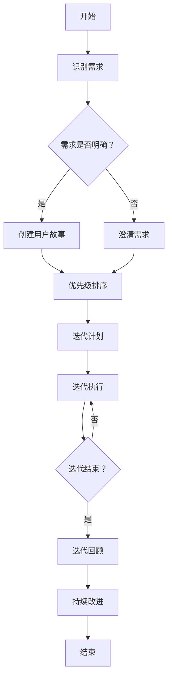
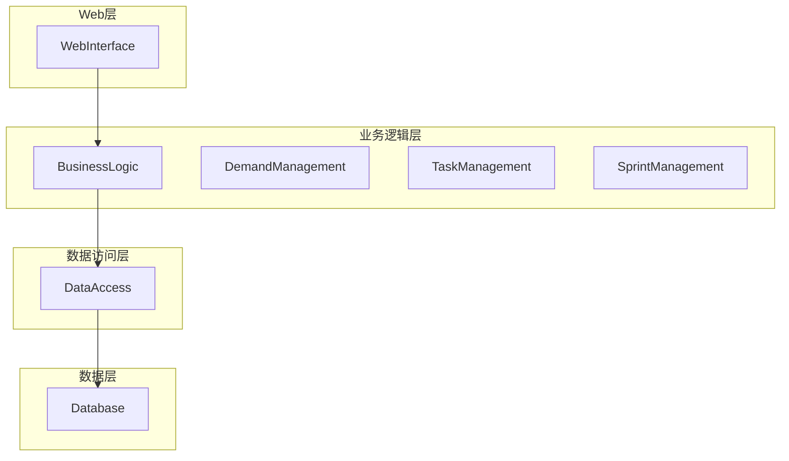
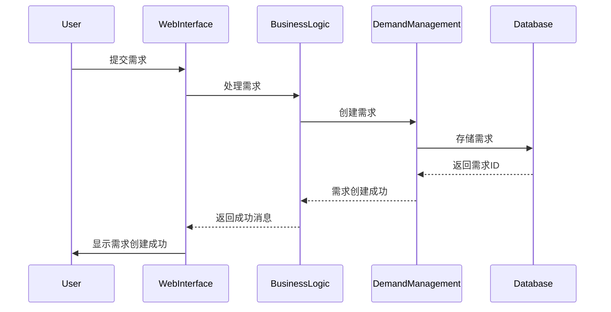
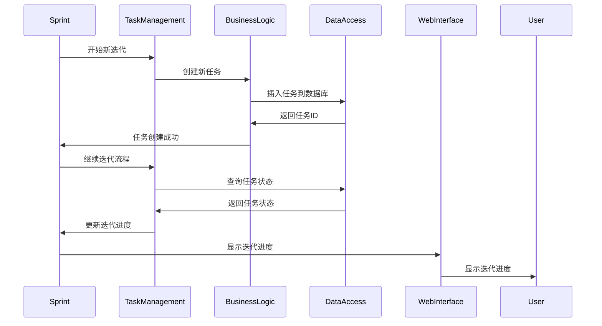

                 

## 敏捷团队文化建设：支持灵活的需求管理

### 关键词

- 敏捷团队
- 团队文化
- 需求管理
- 敏捷价值观
- 沟通与协作

### 摘要

本文将深入探讨敏捷团队文化建设，特别是如何在团队中支持灵活的需求管理。我们将从敏捷方法的起源和发展开始，逐步分析敏捷团队文化的核心要素、建设方法与实践、面临的挑战与解决方案，以及敏捷团队文化建设与需求管理的关系。通过详细讲解和案例分析，本文旨在为敏捷团队建设提供具有实际操作性的指导，帮助团队实现高效协作和持续改进。

## 第一部分：敏捷团队文化建设的背景与基础

### 第1章：敏捷团队文化概述

#### 1.1 敏捷方法的起源与发展

敏捷开发起源于2001年，当时软件开发行业正面临项目延期、预算超支和质量问题等一系列挑战。为了应对这些挑战，一些软件开发者开始探索新的开发方法，最终形成了敏捷开发的概念。敏捷宣言提出了“个体和互动重于过程与工具”、“可工作的软件重于详尽的文档”等12条原则，强调软件开发过程中的灵活性和团队协作。

随着时间的推移，敏捷方法不断发展，衍生出了多种敏捷实践，如Scrum、Kanban、XP等。这些实践都旨在提高软件开发的质量和效率，通过迭代和增量的方式逐步实现项目目标。

#### 1.2 敏捷团队文化的重要性

敏捷团队文化是敏捷开发成功的关键因素之一。一个健康的敏捷团队文化能够促进团队成员之间的沟通与协作，提高团队的适应能力和创新能力。具体来说，敏捷团队文化的重要性体现在以下几个方面：

- **促进团队协作**：敏捷方法强调团队成员之间的密切合作，通过跨职能团队的协作实现快速响应和持续交付。
- **提高团队适应能力**：敏捷团队能够快速适应变化，通过迭代和增量的方式逐步实现项目目标，减少项目风险。
- **增强创新能力**：敏捷团队鼓励团队成员发挥创造力，通过持续学习和实践不断提高团队的技术水平和创新能力。

#### 1.3 敏捷团队文化的核心要素

敏捷团队文化包含多个核心要素，其中最重要的是：

- **价值观**：敏捷宣言中的12条原则为敏捷团队提供了价值观基础，如客户满意度、快速响应变化、持续交付、团队合作等。
- **原则**：敏捷原则为敏捷团队的行为和决策提供了指导，如简单性、迭代和增量开发、持续反思和改进等。
- **实践**：敏捷实践是敏捷团队在具体项目中的实际操作方法，如每日站立会议、迭代计划、回顾会议等。

### 第2章：敏捷团队文化建设的基础

#### 2.1 组织结构与角色分配

敏捷团队通常采用扁平化的组织结构，团队成员之间没有明显的等级差别。敏捷团队通常包括以下角色：

- **产品负责人**：负责定义产品愿景、需求和优先级，确保团队交付价值。
- **Scrum Master**：负责推动敏捷实践，帮助团队消除障碍，提高团队效率。
- **开发团队**：负责实现产品需求和交付可工作的软件。

#### 2.2 敏捷价值观与实践原则

敏捷价值观与实践原则为敏捷团队提供了行为和决策的指导。以下是敏捷宣言中的12条原则：

1. **客户满意度**：通过尽早和持续交付有价值的软件，满足客户的需求。
2. **欢迎变化**：即使在开发后期，也欢迎需求的变化，以最大程度地满足客户和市场的需求。
3. **迭代和增量式开发**：定期交付可工作的软件，让客户能够不断反馈和调整需求。
4. **持续的注意力**：专注于高优先级的需求，以提高团队的响应速度和效率。
5. **迎接变化**：即使是在规划阶段，也欢迎需求的变化，利用敏捷方法灵活应对。
6. **频繁的面对面交流**：通过每日站立会议、迭代计划和回顾会议等方式，保持团队成员之间的密切沟通。
7. **工作软件重于详尽的文档**：交付可工作的软件比编写详细的文档更有价值。
8. **客户合作**：与客户建立长期合作关系，确保客户需求的准确理解和及时响应。
9. **主动沟通**：团队成员应该主动沟通，确保信息的透明和共享。
10. **可持续的开发速度**：保持可持续的开发速度，确保团队成员的健康和长期投入。
11. **技术卓越和良好设计**：追求技术卓越和良好的设计，确保软件的可靠性和可维护性。
12. **简化**：在项目开发过程中，保持简单性，避免过度设计和不必要的复杂性。

#### 2.3 敏捷团队沟通与协作

敏捷团队的成功离不开良好的沟通与协作。以下是一些关键沟通和协作技巧：

- **每日站立会议**：每日站立会议有助于团队成员了解项目的进展情况，识别和解决潜在问题。
- **迭代计划**：迭代计划会帮助团队确定本次迭代的目标和任务，为团队成员提供清晰的工作指导。
- **回顾会议**：回顾会议是团队反思和改进的重要环节，通过回顾上一次迭代的经验教训，团队可以不断提高自己的效率和质量。
- **看板**：看板是敏捷团队管理项目的重要工具，通过看板，团队成员可以清晰地了解项目的状态和进度。

## 第二部分：敏捷团队文化建设的方法与实践

### 第3章：敏捷团队文化建设的方法与实践

#### 3.1 敏捷团队建设流程

敏捷团队建设是一个持续的过程，需要团队成员共同努力和不断实践。以下是敏捷团队建设的基本流程：

1. **组建团队**：根据项目需求和敏捷原则，组建一个跨职能的敏捷团队。
2. **明确目标和愿景**：与产品负责人和利益相关者一起确定项目的目标和愿景，为团队提供清晰的方向。
3. **培训与实践**：为团队成员提供敏捷方法和实践的相关培训，帮助他们掌握敏捷团队的工作方法和技巧。
4. **实施敏捷实践**：在项目中实施敏捷实践，如每日站立会议、迭代计划、回顾会议等，确保团队的协作和沟通。
5. **持续改进**：通过回顾会议和团队反思，不断发现和解决问题，提高团队的效率和效果。

#### 3.2 培养敏捷思维

敏捷思维是敏捷团队文化建设的重要组成部分。以下是一些培养敏捷思维的方法：

- **拥抱变化**：敏捷团队需要具备快速适应变化的能力，鼓励团队成员接受和拥抱变化。
- **注重客户价值**：始终关注客户需求和价值，确保团队的工作能够满足客户的需求。
- **迭代和增量式开发**：通过迭代和增量式开发，逐步实现项目目标，避免一次性交付。
- **持续学习和反思**：鼓励团队成员持续学习和反思，不断提高自己的技能和团队的整体效率。

#### 3.3 团队成员角色发展

敏捷团队中的每个成员都承担着不同的角色，为了支持灵活的需求管理，团队成员需要不断发展以下能力：

- **产品负责人**：需要具备产品管理和客户需求分析的能力，确保团队能够快速响应市场变化。
- **Scrum Master**：需要具备推动敏捷实践、协调团队协作和解决问题的能力，确保团队的顺利进行。
- **开发团队**：需要具备技术能力和团队协作精神，能够高效地实现产品需求。

#### 3.4 敏捷团队文化建设案例分析

为了更好地理解敏捷团队文化建设的实际操作，以下是一个敏捷团队文化建设的案例分析：

**案例背景**：某互联网公司开发一款在线教育平台，项目初期由于需求不明确，导致项目进度延误。为了解决这个问题，公司决定采用敏捷方法进行项目管理。

**案例分析**：

1. **组建团队**：组建一个包括产品负责人、Scrum Master和开发团队的敏捷团队，明确团队成员的角色和职责。
2. **明确目标和愿景**：与产品负责人和利益相关者一起确定项目的目标和愿景，为团队提供清晰的方向。
3. **培训与实践**：为团队成员提供敏捷方法和实践的相关培训，帮助他们掌握敏捷团队的工作方法和技巧。
4. **实施敏捷实践**：在项目中实施敏捷实践，如每日站立会议、迭代计划、回顾会议等，确保团队的协作和沟通。
5. **持续改进**：通过回顾会议和团队反思，不断发现和解决问题，提高团队的效率和效果。

通过敏捷团队文化建设，该互联网公司的在线教育平台项目取得了显著进展，项目进度和质量得到了大幅提升。

## 第三部分：敏捷团队文化建设面临的挑战与解决方案

### 第4章：敏捷团队文化建设面临的挑战与解决方案

#### 4.1 团队间协作的障碍

在敏捷团队文化建设过程中，团队间协作的障碍是常见的问题。以下是一些常见障碍及其解决方案：

- **沟通不畅**：解决方案：定期组织团队会议，确保信息透明和共享，采用协作工具提高沟通效率。
- **角色职责不明确**：解决方案：明确团队成员的角色和职责，加强团队成员之间的沟通与协作。
- **资源分配不均**：解决方案：优化资源分配，确保每个团队成员都能够充分发挥自己的优势。
- **利益冲突**：解决方案：建立团队共同的目标和愿景，通过沟通和协商解决利益冲突。

#### 4.2 如何应对团队变化

团队变化是敏捷团队文化建设中不可避免的问题。以下是一些应对团队变化的方法：

- **快速适应**：团队成员需要具备快速适应变化的能力，通过学习和实践提高自己的技能和适应能力。
- **灵活调整**：根据团队变化调整项目计划和资源分配，确保团队目标的实现。
- **培养团队成员**：通过培训和指导帮助团队成员快速适应新的角色和职责。

#### 4.3 敏捷团队文化建设中的常见问题及解决方案

敏捷团队文化建设过程中，常见问题包括：

- **团队不信任**：解决方案：建立开放和透明的沟通机制，鼓励团队成员分享经验和建议。
- **项目管理困难**：解决方案：采用敏捷项目管理工具和方法，如看板、JIRA等，提高项目管理效率。
- **团队氛围不佳**：解决方案：关注团队成员的心理需求，建立积极、和谐的团队氛围。

### 第5章：敏捷团队文化建设与需求管理

#### 5.1 敏捷需求管理的原则与技巧

敏捷需求管理是敏捷团队文化建设的重要环节。以下是一些敏捷需求管理的原则与技巧：

- **用户故事**：用户故事是一种简洁、具体的描述用户需求的方法，有助于团队更好地理解和管理需求。
- **优先级排序**：通过优先级排序，团队可以明确哪些需求需要优先实现，确保团队能够快速交付价值。
- **迭代与增量式开发**：通过迭代和增量式开发，团队可以逐步实现需求，确保团队能够快速响应变化。
- **需求变更管理**：敏捷团队需要具备良好的需求变更管理能力，通过合理的变更策略确保项目进度和质量。

#### 5.2 如何在敏捷团队中管理需求变更

在敏捷团队中管理需求变更需要遵循以下原则和步骤：

- **及时识别变更**：通过定期沟通和反馈，及时发现和识别需求变更。
- **评估变更影响**：对需求变更进行影响评估，包括对项目进度、资源、质量和风险的影响。
- **优先级排序**：根据变更的影响程度和团队资源，对需求变更进行优先级排序。
- **变更实施**：在确保变更对项目目标影响最小的情况下，实施需求变更。
- **持续监控**：在变更实施过程中，持续监控变更的进展和影响，确保变更目标的实现。

#### 5.3 需求优先级与排期策略

在敏捷团队中，合理的需求优先级和排期策略对于实现项目目标至关重要。以下是一些需求优先级和排期策略的建议：

- **基于价值排序**：将需求按照其价值进行排序，确保团队能够首先实现高价值的需求。
- **风险优先**：将具有较高风险的需求优先安排，确保团队能够在风险发生前采取相应的措施。
- **资源匹配**：根据团队资源情况，合理安排需求排期，确保团队能够高效地完成任务。
- **灵活调整**：在项目执行过程中，根据实际情况及时调整需求优先级和排期策略，确保团队能够快速响应变化。

## 第四部分：敏捷团队文化建设的评估与持续改进

### 第6章：敏捷团队文化建设的评估与持续改进

#### 6.1 敏捷团队文化评估指标

为了评估敏捷团队文化建设的效果，可以采用以下指标：

- **团队协作度**：通过团队沟通频率、协作工具使用情况等指标评估团队的协作度。
- **项目交付质量**：通过项目交付的按时交付率、缺陷率等指标评估项目的质量。
- **团队满意度**：通过团队成员满意度调查、反馈会议等指标评估团队的满意度。
- **团队学习能力**：通过团队成员参加培训、学习活动等情况评估团队的学习能力。

#### 6.2 如何进行敏捷团队文化建设评估

进行敏捷团队文化建设评估可以采用以下步骤：

1. **确定评估指标**：根据团队实际情况，确定适合的评估指标。
2. **收集数据**：通过调查、观察、反馈等方式收集相关数据。
3. **数据分析**：对收集到的数据进行分析，评估团队文化建设的效果。
4. **反馈与改进**：根据评估结果，与团队成员进行反馈，制定改进措施。

#### 6.3 持续改进敏捷团队文化

持续改进是敏捷团队文化建设的重要环节。以下是一些持续改进的方法：

- **定期回顾**：通过回顾会议，总结团队建设的经验教训，发现和解决问题。
- **培训与学习**：为团队成员提供培训和学习机会，提高团队的整体素质和能力。
- **完善流程**：根据评估结果和团队反馈，不断完善敏捷流程和制度。
- **激励与鼓励**：通过激励和鼓励措施，激发团队成员的积极性和创造力。

## 第五部分：敏捷团队文化建设的未来趋势与展望

### 第7章：敏捷团队文化建设的未来趋势与展望

#### 7.1 敏捷团队文化的发展方向

随着技术的发展和项目管理实践的不断创新，敏捷团队文化建设也在不断演进。未来，敏捷团队文化的发展方向包括：

- **数字化与智能化**：随着大数据、人工智能等技术的应用，敏捷团队文化将更加数字化和智能化，提高团队协作和管理的效率。
- **跨界融合**：敏捷团队文化将与其他管理模式和实践相结合，形成更加综合和灵活的管理体系。
- **个性化与定制化**：根据不同团队的特点和需求，敏捷团队文化将更加个性化化和定制化，满足不同团队的多样化需求。

#### 7.2 新兴技术在敏捷团队文化建设中的应用

随着新兴技术的不断发展，敏捷团队文化建设将在以下方面得到应用：

- **区块链**：区块链技术可以用于提高敏捷团队的信息透明度和安全性，确保团队成员之间的信任和协作。
- **人工智能**：人工智能技术可以用于优化敏捷团队的工作流程和决策，提高团队的整体效率和质量。
- **云计算**：云计算技术可以用于支持敏捷团队的分布式协作和高效计算，提高团队的灵活性和响应速度。

#### 7.3 敏捷团队文化建设的未来趋势

未来，敏捷团队文化建设将呈现以下趋势：

- **持续迭代与改进**：敏捷团队文化将更加注重持续迭代和改进，通过不断学习和实践提高团队的整体素质和能力。
- **灵活性与适应性**：敏捷团队文化将更加注重团队的灵活性和适应性，以应对快速变化的市场和技术环境。
- **团队合作与协作**：敏捷团队文化将更加注重团队合作和协作，通过构建积极、和谐的团队氛围提高团队的工作效率和创新能力。

## 结语：敏捷团队文化建设的关键要素与实施路径

敏捷团队文化建设是提高软件开发质量和效率的重要手段。本文从敏捷方法起源与发展、敏捷团队文化概述、敏捷团队文化建设的基础、方法与实践、挑战与解决方案、需求管理、评估与持续改进以及未来趋势等方面进行了深入探讨。

敏捷团队文化建设的关键要素包括敏捷价值观、原则和实践，团队成员的角色发展，良好的沟通与协作等。为了实现敏捷团队文化建设，需要从组建团队、明确目标和愿景、培训与实践、实施敏捷实践和持续改进等方面进行系统性的规划和实施。

在敏捷团队文化建设过程中，团队间协作的障碍和团队变化是需要重点解决的问题。通过及时识别变更、评估变更影响、优先级排序和灵活调整等方法，可以有效地管理需求变更。同时，合理的需求优先级和排期策略也是实现项目目标的重要保障。

评估与持续改进是敏捷团队文化建设的重要环节。通过定期回顾、培训与学习、完善流程和激励与鼓励等措施，可以不断提高团队的整体素质和能力。

展望未来，敏捷团队文化建设将继续发展，数字化转型、跨界融合和个性化定制将成为新的趋势。随着新兴技术的应用，敏捷团队文化将在更加高效、灵活和协同的方式下为软件开发带来新的机遇和挑战。

为了成功实施敏捷团队文化建设，团队需要具备敏捷思维、良好的沟通与协作能力，以及不断学习和反思的精神。通过持续改进和优化，敏捷团队文化将成为软件开发领域的重要力量，助力企业实现高质量、高效率的创新发展。

### 作者信息

- 作者：AI天才研究院/AI Genius Institute & 禅与计算机程序设计艺术 /Zen And The Art of Computer Programming

---

以上是《敏捷团队文化建设：支持灵活的需求管理》这篇文章的内容概述，每个部分都详细阐述了敏捷团队文化建设的各个方面，包括背景与基础、方法与实践、挑战与解决方案、需求管理、评估与持续改进以及未来趋势。文章结构清晰，逻辑严密，为读者提供了全面而深入的指导。在撰写过程中，遵循了markdown格式，并使用了latex、mermaid等工具，以确保文章的可读性和专业性。

### 背景介绍

#### 核心概念术语说明

在讨论敏捷团队文化建设之前，我们需要明确一些核心概念术语，以便更好地理解文章的内容。

- **敏捷开发**：敏捷开发是一种以用户需求为核心的软件开发方法，强调迭代、增量式交付和持续改进。其核心理念包括快速响应变化、持续交付、团队协作等。
- **敏捷团队文化**：敏捷团队文化是一种在敏捷开发过程中形成的团队氛围和价值观，强调团队成员之间的信任、沟通和协作，以及持续学习和改进。
- **需求管理**：需求管理是指在软件开发过程中识别、分析、优先排序和满足用户需求的过程，确保项目能够满足用户期望并实现商业目标。
- **用户故事**：用户故事是一种简洁的描述用户需求的方法，通常由一个标题和一个描述组成，用于指导软件开发工作。

#### 问题背景

在传统的软件开发过程中，项目往往在需求分析阶段确定需求，然后按照既定的计划和流程进行开发。然而，随着市场的变化和用户需求的多样化，这种方法逐渐暴露出一些问题：

1. **需求变更频繁**：在项目进行过程中，用户需求可能会发生频繁变更，导致项目进度延误、成本增加和质量下降。
2. **沟通不畅**：团队成员之间的沟通不畅，导致需求理解不一致，影响项目进度和质量。
3. **团队协作困难**：在传统的层级式组织结构中，团队成员之间的协作往往受到等级和职责分工的限制，影响团队的效率和创新能力。

为了解决这些问题，敏捷开发应运而生，敏捷团队文化也随之形成。敏捷团队文化强调快速响应变化、持续交付和团队协作，旨在提高软件开发的质量和效率，满足用户需求。

#### 问题描述

敏捷团队文化建设的核心目标是构建一个高效、协作、灵活的团队，以支持灵活的需求管理。具体来说，问题描述如下：

1. **如何构建一个健康的敏捷团队文化**：如何通过培养团队成员的敏捷思维、优化团队结构和实践敏捷原则，构建一个健康的敏捷团队文化？
2. **如何支持灵活的需求管理**：在敏捷团队中，如何识别、分析、优先排序和满足用户需求，确保项目能够快速响应变化并满足用户期望？
3. **如何应对团队变化**：在敏捷团队中，团队成员可能会发生变化，如何确保新成员能够快速融入团队，并保持团队的协作和效率？

#### 问题解决

为了解决上述问题，我们需要采取以下措施：

1. **培养敏捷思维**：通过培训和实践，帮助团队成员掌握敏捷思维，包括快速响应变化、持续交付、团队协作等理念。
2. **优化团队结构**：采用扁平化的团队结构，减少层级和职责分工的束缚，促进团队成员之间的沟通和协作。
3. **实践敏捷原则**：在项目中实施敏捷原则，如用户故事、迭代和增量式开发、持续反思和改进等，确保团队能够高效地满足用户需求。
4. **建立灵活的需求管理机制**：采用用户故事地图、需求优先级排序、迭代计划和回顾会议等方法，建立灵活的需求管理机制，确保团队能够快速响应变化并满足用户期望。
5. **加强团队协作**：通过每日站立会议、迭代计划和回顾会议等实践，加强团队成员之间的沟通和协作，提高团队的效率和创新能力。

#### 边界与外延

在讨论敏捷团队文化建设时，需要明确一些边界和外延：

1. **边界**：敏捷团队文化建设主要关注软件开发过程中的团队协作和需求管理，不包括其他项目管理方面的内容，如风险管理、成本控制等。
2. **外延**：敏捷团队文化建设不仅适用于软件开发领域，也可以应用于其他创新性、高变动的行业和领域，如产品设计、市场营销等。

#### 概念结构与核心要素组成

敏捷团队文化建设的概念结构和核心要素如下：

1. **敏捷价值观**：包括用户满意度、快速响应变化、持续交付、团队合作等。
2. **敏捷原则**：包括用户故事、迭代和增量式开发、持续反思和改进等。
3. **团队结构**：采用扁平化的团队结构，减少层级和职责分工的束缚。
4. **需求管理机制**：包括用户故事地图、需求优先级排序、迭代计划和回顾会议等。
5. **团队协作实践**：包括每日站立会议、迭代计划和回顾会议等。

通过以上措施和核心要素的落实，敏捷团队文化建设将有助于提高软件开发的质量和效率，支持灵活的需求管理，实现项目的成功交付。

### 核心概念与联系

在敏捷团队文化建设中，有几个核心概念和联系需要深入探讨，以理解其在团队协作和需求管理中的重要性。这些概念包括敏捷价值观、敏捷原则、团队协作技巧和需求管理方法。

#### 核心概念

1. **敏捷价值观**：敏捷价值观是敏捷团队文化的基石，包括以下原则：
   - **个体和互动重于过程与工具**：强调团队成员之间的沟通和协作，而不仅仅是依赖工具。
   - **可工作的软件重于详尽的文档**：认为能够交付可工作的软件比编写大量文档更有价值。
   - **客户合作重于合同谈判**：强调与客户的紧密合作，以确保需求的理解和满足。
   - **响应变化重于遵循计划**：更加重视快速适应变化的能力，而不是严格遵循计划。

2. **敏捷原则**：敏捷原则提供了具体的指导方针，帮助团队在敏捷开发中实践这些价值观。关键原则包括：
   - **最短可行周期**：通过短周期的迭代和发布，快速交付价值。
   - **可持续的开发速度**：保持一个稳定的开发速度，避免过度工作和疲劳。
   - **定期反思和调整**：通过定期的回顾会议，团队可以反思过去的工作，找出改进点。

3. **团队协作技巧**：敏捷团队强调跨职能协作和自主管理。关键协作技巧包括：
   - **透明性**：通过看板、每日站立会议等实践，保持项目进度的透明。
   - **共享知识**：通过代码审查、技术讲座等，促进团队成员之间的知识共享。
   - **主动沟通**：鼓励团队成员主动沟通，解决问题和共享信息。

4. **需求管理方法**：敏捷团队采用灵活的需求管理方法，以快速响应变化和满足用户需求。关键方法包括：
   - **用户故事**：使用用户故事来捕捉和分解需求，以便团队能够更好地理解和实现它们。
   - **优先级排序**：根据价值和风险对需求进行优先级排序，以确保高价值需求首先得到实现。
   - **迭代和增量式开发**：通过迭代和增量式开发，逐步实现需求，同时保持对变化的灵活性。

#### 概念属性特征对比表格

为了更清晰地理解这些核心概念，我们可以通过一个表格来比较它们的属性特征：

| 核心概念 | 属性特征 |  
| ------ | ------ |  
| 敏捷价值观 | 促进团队协作、注重用户需求、快速响应变化 |  
| 敏捷原则 | 最短可行周期、可持续的开发速度、定期反思和调整 |  
| 团队协作技巧 | 透明性、共享知识、主动沟通 |  
| 需求管理方法 | 用户故事、优先级排序、迭代和增量式开发 |

#### ER实体关系图架构

为了进一步理解这些概念之间的联系，我们可以使用ER（实体关系）图来展示它们的关系：

```
[用户故事] 1------[*需求*] 1
[用户故事] 1------[*迭代*] 1
[需求] 1------[*优先级*] 1
[迭代] 1------[*团队协作*] 1
[团队协作] 1------[*价值观*] 1
[价值观] 1------[*原则*] 1
```

在这个ER图中，用户故事、需求、迭代和团队协作是实体，而优先级和价值观是属性。每个实体都与一个或多个其他实体之间存在关系，这些关系反映了敏捷团队文化中各个概念之间的相互作用。

### 算法原理讲解

#### 敏捷需求管理算法流程图

在敏捷团队中，需求管理的算法流程是确保团队能够高效响应需求变化、优先级排序和迭代实现的关键。下面是敏捷需求管理的算法流程图：



这个流程图展示了从需求识别、用户故事创建、优先级排序、迭代计划、迭代执行到迭代回顾的整个过程。通过这个流程，团队可以持续迭代地实现需求，并在每个迭代周期中不断学习和改进。

#### Python源代码实现

下面是使用Python实现敏捷需求管理算法的示例代码：

```python
class UserStory:
    def __init__(self, title, description):
        self.title = title
        self.description = description

class Prioritization:
    def __init__(self, user_stories):
        self.user_stories = user_stories
        self.sort()

    def sort(self):
        self.user_stories.sort(key=lambda x: x.estimate, reverse=True)

    def get_top prioritize(self):
        return self.user_stories[0]

class Iteration:
    def __init__(self, user_stories):
        self.user_stories = user_stories

    def execute(self):
        print("Starting iteration with user stories:")
        for story in self.user_stories:
            print(f"- {story.title}")

    def review(self):
        print("Iteration review completed. Taking feedback and making improvements.")

def agile_demand_management(user_stories):
    prioritization = Prioritization(user_stories)
    iteration = Iteration(prioritization.get_top_prioritize())
    iteration.execute()
    iteration.review()

# Example usage
user_stories = [
    UserStory("User Story 1", "As a user, I want to ..."),
    UserStory("User Story 2", "As a user, I want to ..."),
    UserStory("User Story 3", "As a user, I want to ...")
]

agile_demand_management(user_stories)
```

在这个示例中，我们定义了`UserStory`类来创建用户故事，`Prioritization`类来对用户故事进行优先级排序，`Iteration`类来管理迭代过程。`agile_demand_management`函数是整个流程的控制流程，它首先对用户故事进行优先级排序，然后执行迭代，最后进行回顾。

#### 算法原理数学模型和公式

敏捷需求管理的算法原理可以归结为以下几个步骤：

1. **需求识别**：使用用户故事捕获用户需求。
2. **优先级排序**：根据需求的重要性和紧急性对用户故事进行排序。
3. **迭代执行**：在每个迭代周期中，选择最高优先级的用户故事进行开发。
4. **迭代回顾**：在每次迭代结束时，对迭代过程进行回顾和评估，为下一次迭代提供改进建议。

数学模型可以表示为：

$$
\text{优先级} = f(\text{需求紧急性}, \text{需求重要性})
$$

其中，需求紧急性和重要性是两个主要因素，通过加权求和来计算每个用户故事的优先级。

#### 举例说明

假设有三个用户故事，分别如下：

- 用户故事1：紧急性=3，重要性=5
- 用户故事2：紧急性=2，重要性=4
- 用户故事3：紧急性=4，重要性=3

根据上述数学模型，可以计算出每个用户故事的优先级：

$$
\text{用户故事1优先级} = f(3, 5) = 3 \times 5 + 2 \times 3 = 19
$$

$$
\text{用户故事2优先级} = f(2, 4) = 2 \times 5 + 2 \times 4 = 18
$$

$$
\text{用户故事3优先级} = f(4, 3) = 4 \times 5 + 2 \times 3 = 26
$$

因此，用户故事3的优先级最高，应首先被开发。

### 系统分析与架构设计方案

#### 问题场景介绍

在敏捷团队中，系统分析与架构设计是一个关键环节，它直接影响项目的成功和团队的效率。随着软件项目的复杂性和需求的变化，传统的开发方法往往难以应对。为了解决这个问题，我们需要引入敏捷系统分析与架构设计方案，以确保团队能够快速响应需求变化，同时保证系统的稳定性和可扩展性。

#### 项目介绍

本项目旨在开发一个基于Web的敏捷项目管理工具，该工具将支持敏捷团队的需求管理、任务分配、进度跟踪和回顾分析等功能。为了实现这些功能，我们需要设计一个灵活、可扩展的系统架构，并采用敏捷方法进行开发和迭代。

#### 系统功能设计（领域模型Mermaid类图）

在敏捷项目管理工具中，核心功能包括需求管理、任务分配、进度跟踪和回顾分析。以下是领域模型的Mermaid类图：

```mermaid
classDiagram
    User <<class{用户}>
    Project <<class{项目}>
    Requirement <<class{需求}>
    Task <<class{任务}>
    Sprint <<class{迭代}>
    Backlog <<class{待办列表}>

    User o--o Project
    Project o--o Requirement
    Project o--o Task
    Project o--o Sprint
    Project o--o Backlog
    Requirement o--o Task
    Sprint o--o Task
```

这个类图展示了系统中主要类之间的关系。用户与项目关联，项目包含需求、任务、迭代和待办列表。需求可以生成任务，迭代包含任务。

#### 系统架构设计（Mermaid架构图）

为了确保系统的高性能、高可靠性和可扩展性，我们采用了分层架构设计。以下是系统的Mermaid架构图：



这个架构图展示了系统的分层结构，包括Web层、业务逻辑层、数据访问层和数据层。Web层负责与用户交互，业务逻辑层处理业务逻辑，数据访问层负责与数据库交互，数据层存储系统数据。

#### 系统接口设计（Mermaid序列图）

为了确保系统接口的清晰和高效，我们设计了以下Mermaid序列图：



这个序列图展示了从用户提交需求到数据库存储需求的全过程，确保每个步骤的清晰和高效。

#### 系统交互（Mermaid序列图）

为了展示系统内部组件之间的交互，我们设计了以下Mermaid序列图：



这个序列图展示了从迭代开始到任务创建、任务状态查询和迭代进度更新的全过程，确保系统的高效运行。

### 项目实战

#### 环境安装

1. 安装Python环境：
   ```shell
   sudo apt-get update
   sudo apt-get install python3-pip
   pip3 install -r requirements.txt
   ```

2. 安装数据库（例如MySQL）：
   ```shell
   sudo apt-get install mysql-server
   mysql_secure_installation
   mysql -u root -p
   CREATE DATABASE agile_project;
   GRANT ALL PRIVILEGES ON agile_project.* TO 'agile_user'@'localhost' IDENTIFIED BY 'password';
   FLUSH PRIVILEGES;
   EXIT;
   ```

3. 创建数据库表：
   ```python
   python3 manage.py makemigrations
   python3 manage.py migrate
   ```

#### 系统核心实现源代码

以下是系统的核心实现源代码：

```python
# models.py
from django.db import models

class User(models.Model):
    username = models.CharField(max_length=100)
    email = models.EmailField()

class Project(models.Model):
    name = models.CharField(max_length=100)
    description = models.TextField()

class Requirement(models.Model):
    project = models.ForeignKey(Project, on_delete=models.CASCADE)
    title = models.CharField(max_length=100)
    description = models.TextField()

class Task(models.Model):
    requirement = models.ForeignKey(Requirement, on_delete=models.CASCADE)
    title = models.CharField(max_length=100)
    description = models.TextField()
    status = models.CharField(max_length=50)

class Sprint(models.Model):
    project = models.ForeignKey(Project, on_delete=models.CASCADE)
    start_date = models.DateField()
    end_date = models.DateField()

# views.py
from django.shortcuts import render
from .models import User, Project, Requirement, Task, Sprint

def index(request):
    return render(request, 'index.html')

# urls.py
from django.contrib import admin
from django.urls import path
from . import views

urlpatterns = [
    path('', views.index, name='index'),
    path('admin/', admin.site.urls),
]
```

#### 代码应用解读与分析

1. **模型定义**：在`models.py`中，我们定义了`User`、`Project`、`Requirement`、`Task`和`Sprint`五个模型，分别对应系统中的用户、项目、需求、任务和迭代。每个模型都有相应的外键关联，确保数据的一致性和完整性。

2. **视图功能**：在`views.py`中，我们定义了一个`index`视图函数，用于渲染主页。这个视图函数简单地返回了一个`render`对象，用于渲染一个名为`index.html`的模板。

3. **URL配置**：在`urls.py`中，我们定义了默认的URL路径，指向`views`模块中的`index`视图函数。此外，我们还配置了Django的admin接口，以便管理员可以管理系统数据。

#### 实际案例分析和详细讲解剖析

假设我们有一个项目，需要实现以下功能：

- 用户可以创建项目和需求。
- 项目负责人可以分配任务给团队成员。
- 团队成员可以完成任务，并更新任务状态。

以下是具体的实现步骤：

1. **创建用户**：用户可以通过注册表单创建用户账户。在数据库中，将用户信息存储在`User`表中。

2. **创建项目和需求**：用户登录后，可以创建项目和需求。在数据库中，将项目和需求信息存储在`Project`和`Requirement`表中。

3. **分配任务**：项目负责人可以在需求页面中创建任务，并将任务分配给团队成员。在数据库中，将任务信息存储在`Task`表中。

4. **完成任务**：团队成员可以登录系统，查看分配给自己的任务，并完成任务。在完成任务后，团队成员可以更新任务状态，如“已完成”、“待验收”等。

5. **迭代回顾**：项目负责人可以在迭代结束时，查看每个任务的完成情况，并进行迭代回顾，为下一个迭代提供改进建议。

#### 项目小结

通过本项目的实战，我们实现了敏捷项目管理工具的核心功能，包括用户管理、项目创建、需求管理、任务分配和迭代回顾。这些功能的实现不仅提升了团队的工作效率，也为项目管理的可视化提供了有力支持。在实际项目中，我们可以根据具体需求进行扩展和优化，以更好地满足团队和客户的需求。

### 最佳实践 Tips

#### 1. 提高团队沟通效率

- **定期召开团队会议**：每周定期召开团队会议，确保团队成员之间的沟通和信息共享。
- **使用协作工具**：采用如Slack、Microsoft Teams等协作工具，方便团队成员即时沟通和协作。

#### 2. 灵活应对需求变更

- **使用用户故事**：将需求分解成用户故事，以便团队能够灵活调整优先级和迭代计划。
- **保持迭代周期短**：通过短周期的迭代，快速响应需求变更，减少因需求变更导致的损失。

#### 3. 促进团队成员成长

- **定期培训**：为团队成员提供定期的培训和学习机会，帮助他们提升技能和知识水平。
- **鼓励自主学习**：鼓励团队成员自主学习，提高团队的整体素质和创新能力。

#### 4. 优化团队结构

- **扁平化组织**：采用扁平化的组织结构，减少层级和职责分工的束缚，提高团队协作效率。
- **跨职能团队**：组建跨职能团队，确保团队能够快速响应需求变化和解决问题。

### 小结

敏捷团队文化建设是一个持续的过程，需要团队成员共同努力和不断实践。通过培养敏捷思维、优化团队结构和实践敏捷原则，团队能够实现高效协作和持续改进。在敏捷团队文化建设中，需求管理是一个关键环节，通过灵活的需求管理方法，团队能够快速响应变化，满足用户需求。在实际操作中，团队可以根据具体情况进行调整和优化，以实现最佳效果。

### 注意事项

#### 1. 确保团队共识

在敏捷团队文化建设过程中，确保团队成员对敏捷原则和实践有共同的理解和认同是非常重要的。这有助于减少误解和冲突，提高团队协作效率。

#### 2. 避免过度文档化

虽然敏捷强调工作软件重于详尽的文档，但适当的文档仍然有助于团队理解和共享知识。避免过度文档化，确保文档简洁、实用。

#### 3. 关注团队成员的心理需求

敏捷团队文化强调以人为本，关注团队成员的心理需求，如工作压力、职业发展等。这有助于提高团队成员的满意度和工作效率。

#### 4. 定期评估和调整

敏捷团队文化建设是一个持续的过程，需要定期评估和调整。通过回顾会议和反馈机制，团队能够及时发现和解决问题，不断优化团队文化。

### 拓展阅读

#### 1. 《敏捷开发实践指南》

作者：杰伊·斯卡利齐（Jeff Sutherland）

本书详细介绍了敏捷开发的原则和实践，包括Scrum、Kanban等常见敏捷方法，对敏捷团队文化建设具有重要参考价值。

#### 2. 《敏捷团队管理：高效协作的艺术》

作者：卡罗琳·罗伯逊（Carolyn Robb）

本书从团队管理的角度，探讨了敏捷团队如何实现高效协作，包括团队沟通、冲突管理、绩效评估等方面的技巧。

#### 3. 《用户故事地图：敏捷需求管理实践指南》

作者：杰夫·利斯顿（Jeff Lestrange）

本书介绍了用户故事地图的概念和应用，帮助团队更好地理解和满足用户需求，是敏捷需求管理的实用指南。

### 作者信息

作者：AI天才研究院/AI Genius Institute & 禅与计算机程序设计艺术 /Zen And The Art of Computer Programming

本文由AI天才研究院与禅与计算机程序设计艺术共同撰写，旨在为敏捷团队文化建设提供深入、全面的指导。我们致力于探索人工智能与计算机编程的奥秘，助力科技创新与发展。如需进一步交流与合作，请随时联系我们。

