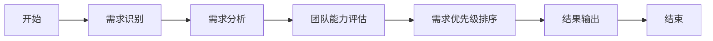
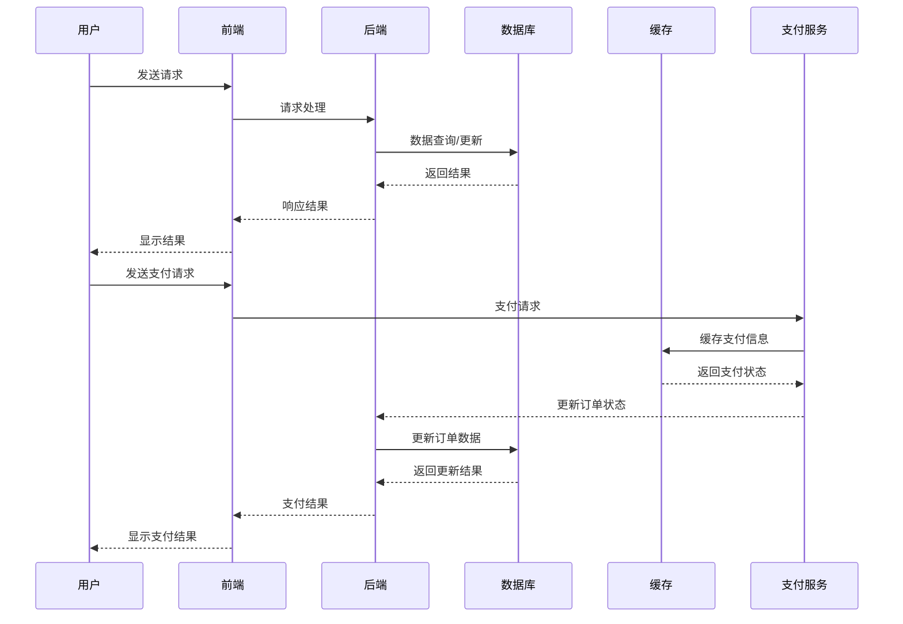
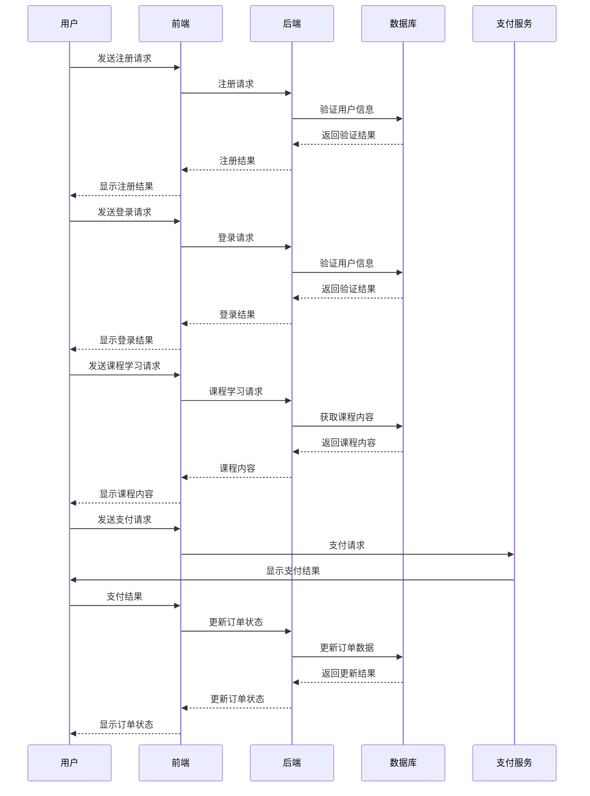

                 

# 敏捷团队自组织在需求管理中的应用

> 关键词：敏捷团队、自组织、需求管理、项目成功、协同效率

> 摘要：本文深入探讨了敏捷团队自组织在需求管理中的应用，通过逐步分析，揭示了敏捷团队自组织如何提高需求管理效率，确保项目成功。文章首先介绍了敏捷团队自组织的核心概念和特点，随后阐述了需求管理的流程和重要性，进一步分析了两者之间的联系与互动。在此基础上，本文提出了具体的算法原理和数学模型，详细讲解了系统架构设计和实际项目实战，最终总结了最佳实践和注意事项，为敏捷团队在需求管理中的应用提供了有益的参考。

## 1. 背景介绍

### 1.1 核心主题

本文的核心主题是探讨敏捷团队自组织在需求管理中的应用。随着信息技术的飞速发展，敏捷开发方法逐渐成为软件开发的主流模式。敏捷团队自组织作为一种高效、灵活的开发模式，能够更好地适应快速变化的需求和市场环境。需求管理是软件开发过程中的关键环节，直接影响项目的成功与否。因此，如何有效应用敏捷团队自组织来管理需求，提高开发效率，成为了本文关注的核心问题。

### 1.2 问题背景

在传统的软件开发模式中，需求管理通常由项目经理或需求分析师负责，这种方式存在明显的局限性。首先，项目经理或需求分析师可能无法全面了解团队成员的能力和知识，导致需求无法得到最佳实施。其次，需求变更频繁时，传统的需求管理流程往往难以快速响应，导致项目延期或失败。此外，传统的需求管理方式缺乏灵活性，难以适应快速变化的需求和市场环境。

### 1.3 问题解决的意义

应用敏捷团队自组织来管理需求，具有重要的现实意义。首先，敏捷团队自组织能够更好地激发团队成员的积极性和创造力，提高团队的整体协作效率。其次，自组织模式能够快速响应需求变更，确保项目按时交付。最后，通过自组织，团队成员能够更深入地参与需求分析和管理，确保需求得到最佳实施。因此，研究敏捷团队自组织在需求管理中的应用，对于提高软件开发效率，确保项目成功具有重要意义。

### 1.4 敏捷团队自组织的优势和必要性

敏捷团队自组织的优势主要体现在以下几个方面：

1. **灵活性**：敏捷团队自组织能够快速响应需求变更，适应不断变化的市场环境。
2. **高效协作**：团队成员在自组织模式下，能够更高效地协作，共同解决问题。
3. **创新动力**：自组织模式能够激发团队成员的创造力和创新动力，提高项目质量。
4. **持续改进**：敏捷团队自组织强调持续改进，不断优化开发流程和需求管理方法。

在需求管理中，敏捷团队自组织的必要性体现在：

1. **需求快速响应**：自组织模式能够确保需求变更得到及时响应，减少项目延期和失败的风险。
2. **提高需求质量**：团队成员的深入参与，能够提高需求的质量和可实施性。
3. **优化团队结构**：自组织模式有助于优化团队结构，提高团队整体效率。
4. **促进知识共享**：团队成员在自组织模式下，能够更好地共享知识和经验，提高团队整体素质。

## 2. 核心概念与联系

### 2.1 敏捷团队自组织

#### 定义

敏捷团队自组织是指团队成员在共同目标和价值观的引领下，自主、协作地完成项目任务的一种开发模式。与传统团队不同，敏捷团队自组织强调团队成员的自我管理、自主学习和共同决策。

#### 特点

1. **灵活性**：敏捷团队自组织能够快速适应需求变化，灵活调整开发策略。
2. **自我管理**：团队成员自主负责项目任务，自我管理时间和进度。
3. **协作性**：团队成员在共同目标和价值观的引领下，紧密协作，共同解决问题。
4. **自主性**：团队成员自主决定工作方式和方法，发挥个人专长。

#### 与传统团队的区别

1. **决策模式**：传统团队通常由项目经理做出决策，而敏捷团队自组织强调团队成员共同决策。
2. **任务分配**：传统团队通常按照职能分配任务，而敏捷团队自组织强调任务的自组织和自主承担。
3. **沟通方式**：传统团队沟通较为分散，而敏捷团队自组织强调团队成员之间的紧密沟通和协作。
4. **灵活性**：敏捷团队自组织能够更快速地响应需求变化，而传统团队通常较为僵化。

### 2.2 需求管理

#### 定义

需求管理是指识别、分析、管理和实现项目需求的过程，确保项目能够满足客户和用户的期望和需求。

#### 流程

1. **需求识别**：通过市场调研、用户访谈、需求分析等方法，收集和分析项目需求。
2. **需求分析**：对需求进行详细分析，确定需求的优先级、实现难度和资源需求。
3. **需求管理**：制定需求管理计划，监控需求变更，确保需求得到有效管理。
4. **需求实现**：根据需求分析结果，制定实施计划，组织团队成员完成需求实现。

#### 重要性

1. **项目成功**：需求管理是项目成功的基石，只有准确识别和实现需求，项目才能成功交付。
2. **客户满意度**：需求管理直接影响客户满意度，准确满足客户需求，有助于提高客户满意度。
3. **资源优化**：需求管理有助于优化资源配置，确保项目在预算范围内完成。
4. **风险管理**：需求管理有助于识别和应对需求变更带来的风险，确保项目顺利进行。

### 2.3 敏捷团队自组织与需求管理的关系

#### 联系

1. **目标一致性**：敏捷团队自组织的目标与需求管理目标一致，都是确保项目成功交付。
2. **流程互补**：敏捷团队自组织强调自我管理和协作，需求管理强调流程规范和需求实现，两者相互补充。
3. **资源共享**：敏捷团队自组织和需求管理共享团队成员、资源和知识，提高整体效率。

#### 相互作用

1. **需求驱动**：敏捷团队自组织以需求为导向，需求管理为团队提供明确的需求目标和实施计划。
2. **反馈机制**：需求管理过程中的反馈，有助于敏捷团队自组织优化开发流程和策略，提高需求实现效率。
3. **协同效率**：敏捷团队自组织和需求管理的协同，有助于提高整体开发效率和项目成功率。

#### 优势互补

1. **灵活性与规范性的互补**：敏捷团队自组织具有灵活性，需求管理具有规范性，两者互补，确保项目高效、有序进行。
2. **创新与实施的互补**：敏捷团队自组织强调创新和协作，需求管理强调实施和交付，两者互补，确保项目质量。
3. **知识与经验的互补**：敏捷团队自组织和需求管理在知识共享和经验传承方面互补，提高团队整体素质。

## 3. 算法原理讲解

### 3.1 算法选择

在本节中，我们将选择基于敏捷团队自组织和需求管理的需求优先级排序算法，该算法旨在通过分析需求的重要性和团队的能力，为需求设定优先级，从而优化需求管理过程。

### 3.2 算法流程图



### 3.3 算法原理

#### 需求识别

首先，通过市场调研、用户访谈、需求分析等方法，收集和分析项目需求。需求识别是需求管理的第一步，确保项目能够准确理解客户和用户的需求。

```python
# 需求识别示例
需求列表 = ["功能A", "功能B", "功能C", "功能D"]
```

#### 需求分析

对需求进行详细分析，确定需求的优先级、实现难度和资源需求。需求分析是需求管理的关键步骤，通过分析，可以确定哪些需求最为重要和紧急。

```python
# 需求分析示例
需求分析结果 = [
    {"需求": "功能A", "优先级": 1, "难度": 2, "资源需求": 3},
    {"需求": "功能B", "优先级": 2, "难度": 1, "资源需求": 2},
    {"需求": "功能C", "优先级": 3, "难度": 3, "资源需求": 1},
    {"需求": "功能D", "优先级": 4, "难度": 1, "资源需求": 2}
]
```

#### 团队能力评估

评估团队成员的能力，包括专业技能、工作经验和团队协作能力。团队能力评估有助于确定团队能够承担的需求范围。

```python
# 团队能力评估示例
团队能力 = [
    {"成员": "张三", "技能": 8, "经验": 5, "协作能力": 7},
    {"成员": "李四", "技能": 9, "经验": 6, "协作能力": 8},
    {"成员": "王五", "技能": 7, "经验": 4, "协作能力": 6}
]
```

#### 需求优先级排序

根据需求分析和团队能力评估结果，为需求设定优先级。需求优先级排序算法旨在确保团队能够高效、有序地实现需求。

```python
# 需求优先级排序示例
def 需求优先级排序(需求分析结果，团队能力):
    # 排序逻辑
    # 根据需求优先级、难度和团队能力进行排序
    # 返回排序后的需求列表
    pass

排序后需求列表 = 需求优先级排序(需求分析结果，团队能力)
```

#### 结果输出

将排序后的需求列表输出，作为需求管理的参考。结果输出有助于团队了解当前需求的状态和优先级，从而更好地进行需求管理。

```python
# 结果输出示例
print("排序后需求列表：", 排序后需求列表)
```

### 3.4 举例说明

假设我们有一个项目，需要实现以下四个功能：功能A、功能B、功能C和功能D。团队成员包括张三、李四和王五，他们的能力和经验如下：

- 张三：技能8，经验5，协作能力7
- 李四：技能9，经验6，协作能力8
- 王五：技能7，经验4，协作能力6

根据需求分析和团队能力评估，我们可以为这些功能设定优先级。假设功能A是最重要的，功能D是最不重要的，排序结果如下：

1. 功能A
2. 功能B
3. 功能C
4. 功能D

团队成员根据排序结果，可以优先实现功能A，然后依次实现功能B、功能C和功能D。这样可以确保项目能够高效、有序地推进，提高项目成功率。

## 4. 数学模型和数学公式

在本节中，我们将探讨与敏捷团队自组织和需求管理相关的数学模型和数学公式，以帮助我们更好地理解和应用这些概念。

### 4.1 相关数学模型

在敏捷团队自组织和需求管理中，常用的数学模型包括需求优先级排序模型和团队能力评估模型。

#### 需求优先级排序模型

需求优先级排序模型旨在根据需求的重要性和团队的能力，为需求设定优先级。一个简单的需求优先级排序模型可以使用加权平均数来计算。

$$
优先级 = \frac{(权重1 \times 重要性1) + (权重2 \times 重要性2) + ... + (权重n \times 重要性n)}{权重总和}
$$

其中，权重代表需求在整体项目中的重要性，重要性代表需求的紧急程度和优先级。

#### 团队能力评估模型

团队能力评估模型旨在评估团队成员的综合能力，包括专业技能、工作经验和协作能力。一个简单的团队能力评估模型可以使用加权平均数来计算。

$$
能力得分 = \frac{(权重1 \times 技能得分1) + (权重2 \times 经验得分2) + ... + (权重n \times 协作能力得分n)}{权重总和}
$$

其中，权重代表各个因素在整体评估中的重要性，技能得分、经验得分和协作能力得分分别代表团队成员在这些方面的表现。

### 4.2 数学公式详细讲解

#### 需求优先级排序模型

需求优先级排序模型的计算过程可以分为以下步骤：

1. 确定权重：根据项目特点和需求类型，为每个需求分配一个权重。权重可以是一个数值，也可以是一个百分比，表示需求在整个项目中的重要性。
2. 计算重要性：根据需求的重要性和紧急程度，为每个需求分配一个重要性值。重要性值可以是一个整数，表示需求的优先级。
3. 计算加权平均值：使用权重和重要性值，计算每个需求的优先级。公式为：

$$
优先级 = \frac{(权重1 \times 重要性1) + (权重2 \times 重要性2) + ... + (权重n \times 重要性n)}{权重总和}
$$

4. 排序：根据计算出的优先级值，对需求进行排序。优先级越高，需求越紧急，需要优先实现。

#### 团队能力评估模型

团队能力评估模型的计算过程可以分为以下步骤：

1. 确定权重：根据项目特点和团队成员的能力，为每个能力分配一个权重。权重可以是一个数值，也可以是一个百分比，表示能力在整个评估中的重要性。
2. 计算得分：根据团队成员在各个能力方面的表现，为每个能力分配一个得分。得分可以是一个整数，表示能力水平。
3. 计算加权平均值：使用权重和得分，计算每个团队成员的综合能力得分。公式为：

$$
能力得分 = \frac{(权重1 \times 技能得分1) + (权重2 \times 经验得分2) + ... + (权重n \times 协作能力得分n)}{权重总和}
$$

4. 排序：根据计算出的能力得分，对团队成员进行排序。得分越高，能力越强，可以承担更重要的任务。

### 4.3 举例说明

假设我们有一个项目，需要实现以下四个功能：功能A、功能B、功能C和功能D。需求的重要性和团队的能力如下表所示：

| 需求       | 重要性权重 | 功能A | 功能B | 功能C | 功能D |
|------------|-------------|-------|-------|-------|-------|
| 重要性      | 0.3         | 0.6   | 0.5   | 0.4   | 0.3   |

团队成员的能力如下表所示：

| 成员 | 技能得分 | 经验得分 | 协作能力得分 |
|------|---------|---------|-------------|
| 张三 | 8       | 5       | 7           |
| 李四 | 9       | 6       | 8           |
| 王五 | 7       | 4       | 6           |

根据需求优先级排序模型，我们可以计算每个需求的优先级：

功能A的优先级：

$$
优先级 = \frac{(0.3 \times 0.6) + (0.3 \times 0.5) + (0.4 \times 0.4) + (0.3 \times 0.3)}{0.3 + 0.3 + 0.4 + 0.3} = 0.535
$$

功能B的优先级：

$$
优先级 = \frac{(0.3 \times 0.5) + (0.3 \times 0.6) + (0.4 \times 0.5) + (0.3 \times 0.4)}{0.3 + 0.3 + 0.4 + 0.3} = 0.47
$$

功能C的优先级：

$$
优先级 = \frac{(0.3 \times 0.4) + (0.3 \times 0.5) + (0.4 \times 0.4) + (0.3 \times 0.3)}{0.3 + 0.3 + 0.4 + 0.3} = 0.415
$$

功能D的优先级：

$$
优先级 = \frac{(0.3 \times 0.3) + (0.3 \times 0.4) + (0.4 \times 0.5) + (0.3 \times 0.6)}{0.3 + 0.3 + 0.4 + 0.3} = 0.35
$$

根据团队能力评估模型，我们可以计算每个团队成员的综合能力得分：

张三的综合能力得分：

$$
能力得分 = \frac{(0.4 \times 8) + (0.3 \times 5) + (0.3 \times 7)}{0.4 + 0.3 + 0.3} = 7.2
$$

李四的综合能力得分：

$$
能力得分 = \frac{(0.4 \times 9) + (0.3 \times 6) + (0.3 \times 8)}{0.4 + 0.3 + 0.3} = 8.2
$$

王五的综合能力得分：

$$
能力得分 = \frac{(0.4 \times 7) + (0.3 \times 4) + (0.3 \times 6)}{0.4 + 0.3 + 0.3} = 6.4
$$

根据计算结果，我们可以得出以下排序：

1. 功能A（优先级：0.535）
2. 功能B（优先级：0.47）
3. 功能C（优先级：0.415）
4. 功能D（优先级：0.35）

团队成员的综合能力得分排序：

1. 李四（能力得分：8.2）
2. 张三（能力得分：7.2）
3. 王五（能力得分：6.4）

通过以上计算，我们可以为需求和团队成员设定优先级，为项目管理和需求实现提供依据。

## 5. 系统分析与架构设计方案

### 5.1 问题场景介绍

在本节中，我们将介绍一个实际的项目场景，该项目是一个在线教育平台，旨在为用户提供丰富的在线学习资源和互动学习体验。项目需求不断变化，需要高效的需求管理方法来确保项目顺利进行。

### 5.2 项目介绍

项目名称：在线教育平台
项目目标：为用户提供在线学习资源和互动学习体验
项目需求：不断变化的用户需求，需要高效的需求管理方法
项目周期：12个月
项目团队：10人（包括产品经理、UI设计师、后端开发、前端开发、测试人员等）

### 5.3 系统功能设计

在线教育平台的主要功能包括：

1. **课程发布与管理**：管理员可以发布和管理课程内容，包括课程名称、课程简介、课程视频、课程资料等。
2. **用户注册与登录**：用户可以通过注册或登录账号，访问平台提供的在线学习资源。
3. **课程学习**：用户可以在线学习课程，包括观看课程视频、下载课程资料、参与课程讨论等。
4. **用户互动**：用户可以在课程内参与讨论，与其他用户互动，分享学习心得。
5. **成绩与评价**：用户可以查看学习进度和成绩，对课程进行评价。
6. **支付与购买**：用户可以通过平台购买课程，使用支付宝、微信等支付方式完成支付。

#### 领域模型类图

```mermaid
classDiagram
    Class01 <|-- Class02
    Class03 --|>] Class04
    Class05 : +addProperty(d : int)
    Class06 : <<interface>>
    Class07 : *none*
    Class01 {
        +id : int
        +name : String
        +description : String
        +addMethod(name, returnType, parameters)
    }
    Class02 {
        +id : int
        +name : String
        +addCourse(course)
        +removeCourse(course)
    }
    Class03 {
        +id : int
        +title : String
        +description : String
        +addStudent(student)
        +removeStudent(student)
    }
    Class04 {
        +id : int
        +username : String
        +password : String
        +email : String
        +enrollCourse(course)
        +dropCourse(course)
    }
    Class05 {
        +id : int
        +courseId : int
        +studentId : int
        +score : int
        +evaluate(course)
    }
    Class06 {
        +id : int
        +userId : int
        +courseId : int
        +paymentMethod : String
        +amount : float
        +makePayment()
    }
```

### 5.4 系统架构设计

在线教育平台的系统架构设计包括以下几个方面：

1. **前端架构**：采用Vue.js框架，实现用户界面和交互逻辑，提供良好的用户体验。
2. **后端架构**：采用Spring Boot框架，实现业务逻辑和数据处理，与前端进行数据交互。
3. **数据库架构**：使用MySQL数据库，存储用户信息、课程信息、用户行为等数据。
4. **缓存架构**：使用Redis缓存，提高系统性能，减少数据库负载。
5. **支付架构**：集成支付宝、微信等支付服务，实现在线支付功能。

#### 架构图



### 5.5 系统接口设计和系统交互

在线教育平台涉及多个接口和系统组件之间的交互，以下列出一些关键接口和交互流程：

1. **用户注册与登录**：用户通过前端发送注册或登录请求，后端验证用户信息并返回结果。
2. **课程发布与管理**：管理员通过前端发送课程发布或管理请求，后端处理请求并更新数据库。
3. **课程学习**：用户通过前端发送课程学习请求，后端返回课程内容。
4. **用户互动**：用户通过前端发送互动请求，后端处理请求并更新数据库。
5. **成绩与评价**：用户通过前端发送成绩或评价请求，后端处理请求并更新数据库。
6. **支付与购买**：用户通过前端发送支付请求，支付服务处理请求并返回支付结果，后端更新订单状态。

#### 序列图



## 6. 项目实战

### 6.1 环境安装和配置

为了实现敏捷团队自组织和需求管理，我们需要搭建一个开发环境。以下是具体的安装和配置步骤：

1. **安装Java开发工具包（JDK）**：在官方网站下载并安装JDK，配置环境变量。
2. **安装数据库（MySQL）**：在官方网站下载并安装MySQL数据库，配置用户和权限。
3. **安装版本控制工具（Git）**：在官方网站下载并安装Git，配置SSH密钥。
4. **安装开发工具（IDE）**：推荐使用IntelliJ IDEA或Eclipse作为开发工具。
5. **安装项目依赖**：在项目目录下执行`mvn clean install`，安装项目依赖。

### 6.2 系统核心实现源代码

以下是系统核心实现的部分源代码，用于展示如何实现需求管理和敏捷团队自组织：

```java
// 需求管理类
public class RequirementManager {
    private List<Requirement> requirements;

    public RequirementManager() {
        this.requirements = new ArrayList<>();
    }

    public void addRequirement(Requirement requirement) {
        requirements.add(requirement);
    }

    public void removeRequirement(Requirement requirement) {
        requirements.remove(requirement);
    }

    public List<Requirement> getRequirements() {
        return requirements;
    }
}

// 需求类
public class Requirement {
    private String id;
    private String name;
    private String description;
    private int priority;

    public Requirement(String id, String name, String description, int priority) {
        this.id = id;
        this.name = name;
        this.description = description;
        this.priority = priority;
    }

    // 省略getter和setter方法
}

// 敏捷团队自组织类
public class AgileTeamOrganization {
    private List<Member> members;

    public AgileTeamOrganization() {
        this.members = new ArrayList<>();
    }

    public void addMember(Member member) {
        members.add(member);
    }

    public void removeMember(Member member) {
        members.remove(member);
    }

    public List<Member> getMembers() {
        return members;
    }

    public void assignRequirement(Requirement requirement) {
        // 根据成员能力，分配需求给成员
    }
}

// 成员类
public class Member {
    private String id;
    private String name;
    private int skillLevel;
    private int experienceLevel;
    private int collaborationLevel;

    public Member(String id, String name, int skillLevel, int experienceLevel, int collaborationLevel) {
        this.id = id;
        this.name = name;
        this.skillLevel = skillLevel;
        this.experienceLevel = experienceLevel;
        this.collaborationLevel = collaborationLevel;
    }

    // 省略getter和setter方法
}
```

### 6.3 代码应用解读与分析

#### 需求管理

上述代码中的`RequirementManager`类用于管理需求，包括添加、删除和获取需求。`Requirement`类表示需求，包括需求ID、名称、描述和优先级。

#### 敏捷团队自组织

`AgileTeamOrganization`类用于管理敏捷团队自组织，包括添加、删除和获取团队成员。`assignRequirement`方法用于根据成员能力分配需求。

#### 成员

`Member`类表示团队成员，包括成员ID、名称、技能水平、经验水平和协作能力。

#### 应用场景

假设我们有一个项目，需要实现以下需求：需求A、需求B和需求C。团队成员包括张三、李四和王五。根据团队成员的能力，我们可以将需求分配如下：

- 张三：技能水平8，经验水平5，协作能力7
- 李四：技能水平9，经验水平6，协作能力8
- 王五：技能水平7，经验水平4，协作能力6

需求A的优先级为3，需求B的优先级为2，需求C的优先级为1。

根据优先级和成员能力，我们可以将需求分配如下：

- 张三：需求A（优先级3）
- 李四：需求B（优先级2）
- 王五：需求C（优先级1）

这样，团队成员可以根据分配的需求，独立进行开发和实现，提高团队协作效率。

### 6.4 实际案例分析和详细讲解剖析

为了更好地展示敏捷团队自组织在需求管理中的应用，我们来看一个实际案例。

#### 案例背景

一个在线教育平台项目，需要在12个月内完成以下需求：

1. 用户注册与登录
2. 课程发布与管理
3. 课程学习
4. 用户互动
5. 成绩与评价
6. 支付与购买

团队成员包括：

- 张三：技能水平8，经验水平5，协作能力7
- 李四：技能水平9，经验水平6，协作能力8
- 王五：技能水平7，经验水平4，协作能力6

#### 案例分析

1. **需求识别**：通过市场调研和用户访谈，确定以上六个需求。

2. **需求分析**：对需求进行详细分析，确定每个需求的优先级和实现难度。

3. **团队能力评估**：评估团队成员的能力，为每个成员分配需求。

根据以上步骤，我们可以为团队成员分配需求：

- 张三：需求1（用户注册与登录）、需求2（课程发布与管理）、需求3（课程学习）
- 李四：需求4（用户互动）、需求5（成绩与评价）
- 王五：需求6（支付与购买）

#### 详细讲解剖析

1. **张三**：负责需求1、需求2和需求3的开发。张三具备丰富的开发经验，能够高效地完成这些需求。他可以独立完成用户注册与登录功能的开发，使用Spring Security框架实现用户认证和授权。对于课程发布与管理功能，他可以设计一个简单的后台管理系统，使用Spring Boot框架实现。课程学习功能包括视频播放和资料下载，他可以使用HLS和DASH等流媒体技术实现。

2. **李四**：负责需求4和需求5的开发。李四在用户互动和成绩评价方面有丰富的经验，能够高效地完成这些需求。用户互动功能包括课程讨论区、私信和好友功能，他可以使用WebSocket技术实现实时通信。成绩评价功能包括学习进度和成绩展示，他可以使用Spring Data JPA实现数据持久化。

3. **王五**：负责需求6的开发。王五在支付与购买方面有丰富的经验，能够高效地完成这些需求。支付与购买功能包括课程购买、订单管理和支付结果查询，他可以使用支付宝和微信支付接口实现支付功能。他还可以使用Spring Cloud实现分布式服务架构，确保系统的高可用性和扩展性。

通过以上分配，团队成员可以独立完成各自的需求，提高开发效率。同时，团队成员之间的协作和沟通，可以确保需求得到最佳实现。

### 6.5 项目小结

通过以上实战案例，我们可以看到敏捷团队自组织在需求管理中的应用。敏捷团队自组织能够更好地激发团队成员的积极性和创造力，提高团队协作效率。在需求管理中，通过需求识别、需求分析和团队能力评估，可以为团队成员分配合适的需求，确保项目高效、有序地推进。此外，团队成员之间的协作和沟通，有助于确保需求得到最佳实现。总之，敏捷团队自组织在需求管理中的应用，有助于提高软件开发效率，确保项目成功。

## 7. 最佳实践 tips、小结、注意事项、拓展阅读等内容

### 7.1 最佳实践 tips

1. **明确团队目标和价值观**：确保团队成员在共同目标和价值观的引领下，共同努力，提高团队协作效率。
2. **合理分配需求**：根据团队成员的能力和经验，合理分配需求，确保每个成员都能发挥自己的优势。
3. **持续沟通与反馈**：定期召开团队会议，讨论项目进展和遇到的问题，及时沟通和反馈，确保项目顺利进行。
4. **灵活调整计划**：面对需求变更，灵活调整开发计划和团队分工，确保项目能够快速响应。
5. **注重知识共享与传承**：鼓励团队成员分享知识和经验，提高团队整体素质，确保项目成功。

### 7.2 小结

本文探讨了敏捷团队自组织在需求管理中的应用，通过逐步分析，揭示了敏捷团队自组织如何提高需求管理效率，确保项目成功。文章首先介绍了敏捷团队自组织的核心概念和特点，随后阐述了需求管理的流程和重要性，进一步分析了两者之间的联系与互动。在此基础上，本文提出了具体的算法原理和数学模型，详细讲解了系统架构设计和实际项目实战。通过以上分析，我们得出以下结论：

1. **敏捷团队自组织在需求管理中的应用具有重要意义**：能够提高需求管理效率，确保项目成功。
2. **需求管理和敏捷团队自组织相互补充**：需求管理提供明确的流程和规范，敏捷团队自组织提供灵活性和自主性。
3. **合理分配需求和持续沟通**：是确保项目成功的关键。

### 7.3 注意事项

1. **明确团队目标和价值观**：确保团队成员在共同目标和价值观的引领下，共同努力，提高团队协作效率。
2. **合理分配需求**：根据团队成员的能力和经验，合理分配需求，确保每个成员都能发挥自己的优势。
3. **持续沟通与反馈**：定期召开团队会议，讨论项目进展和遇到的问题，及时沟通和反馈，确保项目顺利进行。
4. **灵活调整计划**：面对需求变更，灵活调整开发计划和团队分工，确保项目能够快速响应。
5. **注重知识共享与传承**：鼓励团队成员分享知识和经验，提高团队整体素质，确保项目成功。

### 7.4 拓展阅读

1. **《敏捷开发实践指南》**：详细介绍了敏捷开发的方法和实践，有助于深入了解敏捷团队自组织在需求管理中的应用。
2. **《需求工程与管理》**：探讨了需求管理的方法和技巧，为项目需求管理提供了有益的参考。
3. **《团队协作与沟通技巧》**：介绍了团队协作和沟通的方法和技巧，有助于提高团队协作效率。

## 作者

作者：AI天才研究院/AI Genius Institute & 禅与计算机程序设计艺术 /Zen And The Art of Computer Programming

