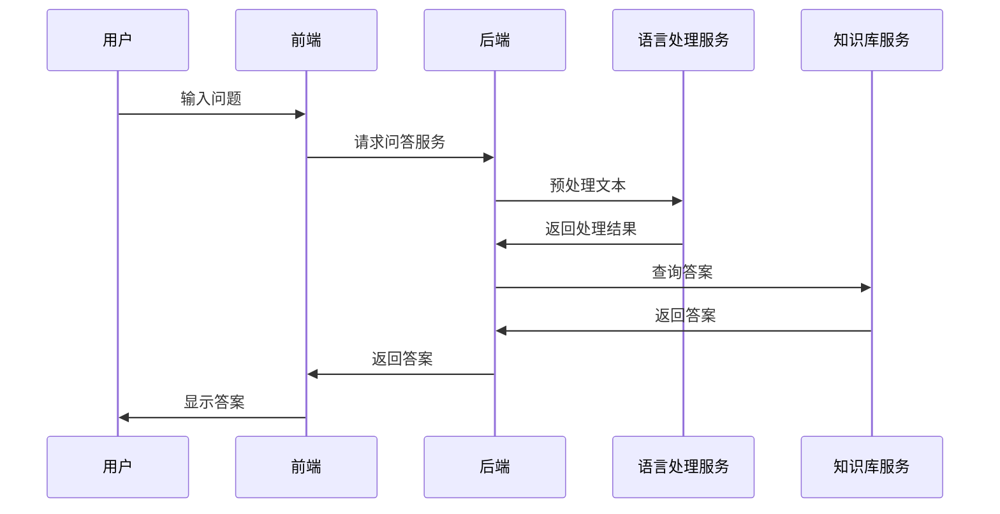
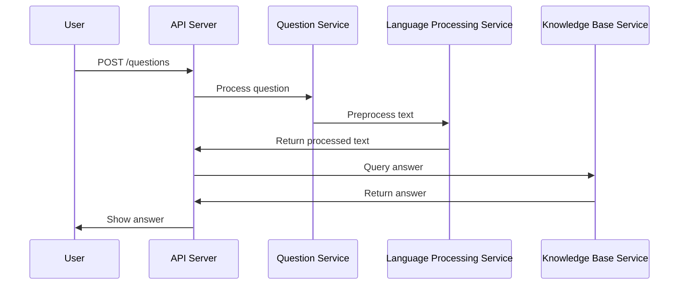

                 


### 引言

**敏捷开发**，一个起源于20世纪90年代末期软件开发领域的概念，旨在通过缩短开发周期、快速迭代和持续反馈来提高软件开发的效率和质量。它的核心理念包括但不限于**响应变化**、**个体和互动重于流程与工具**、**可工作的软件重于详尽的文档**、**客户合作重于合同谈判**、**响应变化的能力重于遵循计划**。

随着人工智能技术的发展，特别是**大型语言模型（LLM）**的兴起，敏捷开发在应用中的重要性日益凸显。LLM是一种基于深度学习的自然语言处理技术，能够理解和生成自然语言，从而为各种应用场景提供智能化解决方案。然而，LLM的开发和应用面临着许多挑战，包括数据规模、计算资源、算法优化等。敏捷开发提供了一种应对这些挑战的有效方式，通过其灵活性和适应性，使得开发团队能够更快速地响应变化，提高开发效率。

本文将围绕“敏捷开发在LLM应用中的实践与挑战”这一主题展开讨论。首先，我们将介绍敏捷开发的背景、起源和发展历程，接着深入探讨LLM的概念、特性和挑战。随后，我们将详细讲解在LLM应用中，敏捷开发的实际操作过程，包括系统分析和架构设计方案。通过实际项目案例的分析，我们将展示敏捷开发在实际应用中的效果，并总结最佳实践和面临的挑战。最后，我们将对未来的发展趋势进行展望。

### 关键词

- 敏捷开发
- 大型语言模型（LLM）
- 软件开发效率
- 快速迭代
- 持续反馈
- 算法优化
- 数据规模
- 计算资源

### 摘要

本文旨在探讨敏捷开发在大型语言模型（LLM）应用中的实践与挑战。首先，我们介绍了敏捷开发的起源和发展历程，以及它在软件开发中的重要地位。随后，我们详细介绍了LLM的概念、特性和当前面临的技术挑战。通过实际案例和项目实战，我们展示了敏捷开发在LLM应用中的具体实施过程和效果。最后，我们总结了敏捷开发在LLM应用中的最佳实践，分析了面临的挑战，并对未来的发展趋势进行了展望。

### 敏捷开发的基本概念与起源

**敏捷开发**，一种以快速响应变化和持续迭代为核心的开发方法，起源于20世纪90年代末期。在那个时期，传统的软件开发方法如**瀑布模型**由于其线性、阶段化的开发流程，往往无法及时适应市场和技术环境的变化，导致项目延误、成本超支和质量问题。因此，软件开发社区开始寻求一种更加灵活、迭代和客户参与的开发方式，敏捷开发应运而生。

**敏捷开发的核心理念**包括以下几个方面：

1. **响应变化重于遵循计划**：敏捷开发强调团队在面对不确定性和变化时，应更加灵活地调整计划，而不是一味地遵循预先制定的计划。
2. **个体和互动重于流程和工具**：敏捷开发认为，开发人员的创造力和团队协作比遵循严格的流程和工具更为重要。
3. **可工作的软件重于详尽的文档**：敏捷开发强调实际交付可工作的软件，而不是过分重视文档工作。
4. **客户合作重于合同谈判**：敏捷开发鼓励开发团队与客户保持紧密合作，共同探讨需求和解决方案，而不是通过正式的合同谈判来解决问题。

**敏捷开发的起源**可以追溯到1999年，当时一群软件开发专家在犹他州进行了一次名为“敏捷软件开发宣言”的会议。会议上，他们共同签署了**敏捷宣言**，宣言中明确指出：“我们最务实的成果是敏捷，我们通过这种坦诚的对话，共同发现更优的软件开发、交付和维护的实践。”这次会议标志着敏捷开发的正式诞生。

随着时间的推移，敏捷开发逐渐形成了多种实践方法和框架，如**Scrum**、**Kanban**、**XP（极限编程）**等。每种框架都有其独特的特点和实践方法，但都秉承了敏捷开发的核心价值观。

**敏捷开发的发展历程**可以分为以下几个阶段：

1. **早期阶段**（1990年代末至2003年）：敏捷开发的理念开始萌芽，各种敏捷方法和实践逐渐形成。
2. **成熟阶段**（2004年至2010年）：敏捷开发方法得到了广泛的应用和推广，成为软件开发的主流方法之一。
3. **持续演进阶段**（2010年至今）：随着技术的进步和市场需求的变化，敏捷开发不断演进，出现了更多适应不同场景的敏捷实践。

**敏捷开发在软件开发中的重要地位**主要体现在以下几个方面：

1. **提高开发效率**：敏捷开发通过快速迭代和持续反馈，使得开发团队能够更快地发现和解决问题，从而提高整体开发效率。
2. **提升产品质量**：敏捷开发强调客户参与和实际交付可工作的软件，有助于确保软件质量和满足用户需求。
3. **增强团队协作**：敏捷开发鼓励团队协作和沟通，有助于建立更加高效、和谐的团队文化。
4. **适应变化**：敏捷开发的核心价值观之一是响应变化，这使得开发团队能够更好地适应市场需求和技术环境的变化。

总之，敏捷开发以其灵活性和适应性，为软件开发领域带来了革命性的变化，成为现代软件开发中不可或缺的一部分。

### 大型语言模型（LLM）的概念、特性和挑战

**大型语言模型（LLM，Large Language Model）**是一种基于深度学习的自然语言处理技术，能够理解和生成自然语言，从而为各种应用场景提供智能化解决方案。LLM的核心在于其庞大的参数规模和复杂的网络结构，这使得它们在处理自然语言任务时具有出色的性能。

#### **概念**

LLM通常是由数十亿甚至数万亿个参数组成，通过在大量文本数据上训练，LLM能够捕捉到语言中的复杂结构和语义信息。这些参数使得LLM能够自动完成文本分类、命名实体识别、机器翻译、情感分析等任务。

#### **特性**

1. **强大的语言理解能力**：LLM能够理解和处理自然语言中的复杂结构，包括语法、语义和上下文信息。
2. **丰富的知识储备**：通过在大量文本数据上训练，LLM积累了丰富的知识，能够回答各种问题，提供相关信息和解决方案。
3. **高度的泛化能力**：LLM在训练过程中学习了多种语言和领域的知识，使其在处理不同任务和场景时具有高度的泛化能力。
4. **高效的生成能力**：LLM能够高效地生成自然语言文本，包括回答问题、编写摘要、生成对话等。

#### **挑战**

1. **数据规模和计算资源**：训练一个高性能的LLM需要大量的文本数据和计算资源。这包括大量的存储空间、高效的计算硬件和长时间的训练过程。
2. **算法优化**：为了提高LLM的性能和效率，需要不断地优化算法和模型结构。这包括参数初始化、正则化、优化器选择等。
3. **数据隐私和安全性**：训练LLM的过程中，需要处理大量的敏感数据和用户信息。如何确保数据隐私和安全性是一个重要的挑战。
4. **解释性和透明性**：LLM的决策过程通常是非常复杂的，难以解释和理解。如何提高LLM的解释性和透明性，使其更容易被用户信任和理解，是一个重要的研究方向。

#### **应用场景**

1. **自然语言处理**：LLM在文本分类、命名实体识别、机器翻译、情感分析等自然语言处理任务中具有广泛的应用。
2. **问答系统**：LLM能够回答各种问题，提供相关信息和解决方案，是构建问答系统的重要技术基础。
3. **内容生成**：LLM能够生成高质量的文本内容，包括文章、摘要、对话等，广泛应用于内容创作和自动写作领域。
4. **智能助手**：LLM可以构建智能助手，为用户提供个性化的服务，如客服机器人、聊天机器人等。

#### **发展趋势**

随着深度学习和自然语言处理技术的不断进步，LLM的性能和应用范围也在不断扩大。未来，LLM有望在更多领域取得突破，为人类带来更多的智能解决方案。同时，如何提高LLM的解释性和透明性，确保数据隐私和安全性，也将是重要的研究方向。

### 敏捷开发在LLM应用中的具体实践

在LLM的应用开发中，敏捷开发提供了一种灵活、高效的方法来应对复杂的项目挑战。通过快速迭代、持续反馈和紧密合作，敏捷开发帮助开发团队更快地交付高质量的LLM产品。以下是敏捷开发在LLM应用中的具体实践步骤：

#### **1. 需求分析和规划**

在项目开始之前，敏捷团队首先进行需求分析，了解客户的需求和目标。通过用户访谈、市场调研和竞争分析，团队能够确定项目的关键功能和要求。在此基础上，团队制定一个可执行的规划，包括短期和长期的目标。

#### **2. 迭代开发**

敏捷开发强调快速迭代，每个迭代周期通常为2-4周。在每个迭代周期中，团队会集中精力完成一个具体的功能模块。以下是一个典型的迭代流程：

1. **迭代计划会议**：在迭代开始时，团队会进行计划会议，讨论迭代的目标和任务，分配责任和制定时间表。
2. **开发阶段**：开发人员根据计划开始编写代码、设计和实现功能模块。
3. **测试阶段**：测试人员对开发的功能模块进行测试，确保其符合需求和规格。
4. **评审会议**：在迭代结束时，团队进行评审会议，展示和讨论迭代成果，收集反馈并进行必要的调整。

#### **3. 持续集成和部署**

敏捷开发强调持续集成和部署，确保代码质量和快速交付。以下是一个典型的CI/CD流程：

1. **代码提交**：开发人员将代码提交到版本控制系统，触发自动化测试和构建流程。
2. **自动化测试**：自动化测试工具运行一系列预定的测试用例，确保代码的质量和功能正确性。
3. **构建和部署**：构建工具将代码编译、打包并部署到测试或生产环境。

#### **4. 持续反馈和改进**

敏捷开发强调持续反馈和改进，通过定期的评审会议和反馈循环，团队能够及时发现和解决问题。以下是一个反馈循环的典型步骤：

1. **用户反馈**：收集用户对产品的使用反馈，包括功能需求、使用体验和改进建议。
2. **数据分析**：通过数据分析工具监控产品的性能和用户行为，识别潜在的问题和改进机会。
3. **改进计划**：根据用户反馈和数据分析结果，制定改进计划，包括修复bug、添加新功能和优化性能。
4. **迭代实施**：在下一个迭代周期中实施改进计划，并持续监控效果。

#### **5. 团队协作和沟通**

敏捷开发强调团队协作和沟通，通过定期的会议和协作工具，确保团队成员之间的信息共享和工作协调。以下是一个团队协作的典型步骤：

1. **每日站会**：团队成员每天进行短暂的站会，讨论当日的工作进展和遇到的问题，协调资源和任务。
2. **迭代评审会**：在迭代结束时，团队进行评审会议，展示和讨论迭代成果，收集反馈并进行必要的调整。
3. **协作工具**：使用协作工具（如JIRA、Trello、Slack等）管理任务、跟踪进度和共享文档。

#### **6. 持续学习和成长**

敏捷开发鼓励团队成员持续学习和成长，通过培训、研讨会和知识分享，提升团队的技术水平和创新能力。以下是一个学习成长的典型步骤：

1. **技术分享会**：定期举行技术分享会，团队成员分享自己的技术知识和经验，促进知识交流。
2. **技能培训**：根据团队的需求和项目要求，组织技能培训，提升团队成员的专业能力。
3. **知识库建设**：建立团队的知识库，记录项目经验、最佳实践和常见问题解决方案，供团队成员参考。

通过这些具体实践，敏捷开发在LLM应用中帮助开发团队更快地交付高质量的产品，并能够灵活应对不断变化的需求和技术挑战。

### 系统分析与架构设计方案

在敏捷开发中，系统分析与架构设计是确保项目成功的关键步骤。特别是在大型语言模型（LLM）应用中，由于其复杂的结构和高度依赖的计算资源，系统分析与架构设计显得尤为重要。以下我们将详细介绍LLM应用中的系统分析和架构设计方案。

#### **1. 问题描述**

在开发一个LLM应用时，首先需要明确问题的背景和需求。这包括：

- **目标用户**：识别应用的目标用户群体，如企业客户、开发者、普通用户等。
- **功能需求**：列出应用所需实现的主要功能，如文本生成、翻译、问答等。
- **性能需求**：设定应用的性能指标，如响应时间、吞吐量、准确性等。
- **数据需求**：确定所需处理的数据类型和数据规模。

#### **2. 项目介绍**

项目介绍部分需要详细描述LLM应用的背景、目标、范围和预期成果。以下是一个示例：

**项目名称**：智能问答系统

**项目背景**：随着人工智能技术的发展，智能问答系统在企业客户服务、在线教育、虚拟助手等领域得到了广泛应用。本项目旨在开发一款基于LLM的智能问答系统，以提高用户满意度和运营效率。

**项目目标**：

- 提供快速、准确的问答服务。
- 支持多语言、多领域的问答。
- 具备良好的可扩展性和维护性。

**项目范围**：

- 系统架构设计。
- 数据处理与存储。
- 功能实现与测试。
- 部署与维护。

**预期成果**：

- 一个可运行的智能问答系统。
- 详细的技术文档和用户手册。
- 项目总结报告。

#### **3. 系统功能设计**

系统功能设计是架构设计的重要部分，需要明确系统应具备的功能模块。以下是一个功能设计的示例：

1. **问答模块**：用户可以通过文本或语音输入问题，系统自动识别并生成回答。
2. **语言处理模块**：对输入的文本进行预处理，包括分词、词性标注、句法分析等。
3. **知识库模块**：存储大量的预训练模型和领域知识，供问答模块使用。
4. **用户管理模块**：管理用户信息、权限和偏好设置。
5. **日志与分析模块**：记录系统运行日志，进行数据分析，以便持续优化系统性能。

**Mermaid类图示例**：

```mermaid
classDiagram
    用户 -> 问答模块: 提问
    用户 -> 语言处理模块: 输入文本
    用户 -> 知识库模块: 访问知识
    用户 -> 用户管理模块: 登录/注册
    用户 -> 日志与分析模块: 日志记录
    问答模块 --> 语言处理模块: 预处理
    问答模块 --> 知识库模块: 回答问题
    问答模块 --> 用户管理模块: 用户权限
    日志与分析模块 --> 问答模块: 数据分析
    日志与分析模块 --> 语言处理模块: 性能分析
    日志与分析模块 --> 知识库模块: 优化建议
```

#### **4. 系统架构设计**

系统架构设计需要明确各模块之间的交互关系和数据处理流程。以下是一个系统架构设计的示例：

1. **前端架构**：提供用户交互界面，包括问答页面、登录注册页面等。
2. **后端架构**：包括问答服务、语言处理服务、知识库服务、用户管理服务和日志与分析服务。
3. **数据存储**：使用分布式数据库存储用户数据、问答记录和知识库。
4. **计算资源**：根据负载需求，合理分配计算资源，如CPU、GPU、内存等。

**Mermaid架构图示例**：



#### **5. 系统接口设计**

系统接口设计是确保各模块之间能够高效通信的关键。以下是一个接口设计的示例：

1. **问答接口**：提供问题的提交和答案的获取接口，支持HTTP/HTTPS协议。
2. **语言处理接口**：提供文本预处理接口，包括分词、词性标注、句法分析等。
3. **知识库接口**：提供知识库的查询和更新接口，支持RESTful API。
4. **用户管理接口**：提供用户注册、登录、权限管理等接口。
5. **日志与分析接口**：提供日志记录和数据分析接口。

**Mermaid序列图示例**：



#### **6. 系统交互**

系统交互部分描述了各模块之间的通信流程和数据处理方式。以下是一个系统交互的示例：

1. **用户输入**：用户通过前端界面输入问题。
2. **前端请求**：前端将问题发送到API服务器。
3. **API处理**：API服务器处理请求，调用问答服务。
4. **问答服务处理**：问答服务对输入的问题进行预处理，然后查询知识库。
5. **知识库查询**：知识库服务返回答案。
6. **结果返回**：API服务器将答案返回给前端，前端再显示给用户。

通过上述系统分析和架构设计方案，我们可以确保LLM应用的各个模块能够高效地协作，提供稳定、可靠的服务。这些方案不仅为开发团队提供了明确的指导，也为项目的后续维护和扩展奠定了基础。

### 项目实战

在本节中，我们将通过一个实际项目案例，展示敏捷开发在LLM应用中的具体实施过程，包括环境安装、系统核心实现、代码应用解读与分析，并详细讲解项目中的具体问题和解决方案。

#### **项目背景**

**项目名称**：智能问答平台

**项目目标**：开发一个基于大型语言模型（LLM）的智能问答平台，能够自动回答用户提出的问题，并支持多语言和跨领域问答。

**项目团队**：由10名成员组成，包括产品经理、前端开发、后端开发、测试工程师和运维人员。

#### **环境安装**

为了搭建一个能够处理大规模文本数据并支持高效计算的LLM应用，我们选择了以下环境和工具：

1. **硬件环境**：
   - 计算机服务器：配置4台高性能GPU服务器，用于模型训练和推理。
   - 存储设备：使用分布式文件系统，如HDFS，存储大量的文本数据。
   - 网络设备：配置高速网络，确保数据传输的可靠性。

2. **软件环境**：
   - 操作系统：Ubuntu 20.04 LTS
   - 深度学习框架：PyTorch
   - 编程语言：Python 3.8
   - 数据库：MySQL 8.0
   - 服务框架：Flask
   - 容器化技术：Docker

安装步骤如下：

1. **安装操作系统和基础软件**：在每台服务器上安装Ubuntu 20.04 LTS，并配置网络和SSH访问。
2. **安装深度学习框架**：使用pip命令安装PyTorch，并配置GPU支持。
   ```shell
   pip install torch torchvision torchaudio -f https://download.pytorch.org/whl/torch_stable.html
   ```
3. **安装数据库**：在主服务器上安装MySQL 8.0，并创建问答平台所需的数据库和表结构。
4. **安装Web服务框架**：使用pip安装Flask，并配置相关依赖。
5. **安装Docker**：在所有服务器上安装Docker，并创建Docker镜像用于容器化部署。

#### **系统核心实现**

智能问答平台的核心功能包括文本预处理、模型训练、问答服务和结果展示。以下是各模块的实现步骤：

1. **文本预处理**：
   - 分词：使用jieba库对输入文本进行分词。
   - 词性标注：使用NLTK库进行词性标注。
   - 停用词过滤：过滤常见的停用词，如“的”、“了”等。
   - 词向量化：使用Word2Vec或BERT模型将文本转换为词向量。

2. **模型训练**：
   - 数据准备：从互联网上收集大量问答对数据，并进行预处理。
   - 模型训练：使用PyTorch实现一个基于Transformer的问答模型，并在GPU上进行训练。
   - 评估与优化：使用验证集评估模型性能，并进行超参数调整和优化。

3. **问答服务**：
   - 接口设计：使用Flask实现问答服务的API接口，支持文本和语音输入。
   - 模型推理：将输入文本输入到训练好的模型中，获取答案。
   - 结果返回：将答案通过API接口返回给前端。

4. **结果展示**：
   - 前端开发：使用HTML、CSS和JavaScript开发问答平台的前端界面。
   - 界面交互：实现用户输入、结果显示和结果反馈的交互逻辑。

#### **代码应用解读与分析**

以下是对核心代码模块的解读和分析：

**文本预处理模块**：

```python
import jieba
import nltk

def preprocess_text(text):
    # 分词
    words = jieba.cut(text)
    
    # 词性标注
    pos_tags = nltk.pos_tag(words)
    
    # 停用词过滤
    stop_words = set(nltk.corpus.stopwords.words('chinese'))
    filtered_words = [word for word, pos in pos_tags if word not in stop_words]
    
    # 词向量化
    word_vectors = vectorize_words(filtered_words)
    
    return word_vectors
```

**模型训练模块**：

```python
import torch
import torch.nn as nn
import torch.optim as optim

class QAModel(nn.Module):
    def __init__(self):
        super(QAModel, self).__init__()
        self.embedding = nn.Embedding(vocab_size, embedding_dim)
        self.query_encoder = nn.LSTM(embedding_dim, hidden_dim)
        self.doc_encoder = nn.LSTM(embedding_dim, hidden_dim)
        self.attn = nn.Linear(hidden_dim * 2, 1)
        self.fc = nn.Linear(hidden_dim, 1)

    def forward(self, query, doc):
        query_embedding = self.embedding(query)
        doc_embedding = self.embedding(doc)
        
        query_hidden, _ = self.query_encoder(query_embedding)
        doc_hidden, _ = self.doc_encoder(doc_embedding)
        
        attn_weights = self.attn(torch.tanh(query_hidden[-1] + doc_hidden[-1]))
        attn_weights = torch.softmax(attn_weights, dim=1)
        
        context_vector = torch.sum(attn_weights * doc_hidden, dim=1)
        answer_logits = self.fc(context_vector)
        
        return answer_logits

model = QAModel()
optimizer = optim.Adam(model.parameters(), lr=learning_rate)
criterion = nn.BCEWithLogitsLoss()

for epoch in range(num_epochs):
    for query, doc, answer in train_loader:
        model.zero_grad()
        answer_logits = model(query, doc)
        loss = criterion(answer_logits, answer)
        loss.backward()
        optimizer.step()
        
    print(f"Epoch {epoch+1}/{num_epochs}, Loss: {loss.item()}")
```

**问答服务模块**：

```python
from flask import Flask, request, jsonify

app = Flask(__name__)

@app.route('/ask', methods=['POST'])
def ask():
    data = request.json
    query = data['query']
    doc = data['doc']
    
    query_processed = preprocess_text(query)
    doc_processed = preprocess_text(doc)
    
    with torch.no_grad():
        answer_logits = model(torch.tensor([query_processed]), torch.tensor([doc_processed]))
    
    answer = torch.sigmoid(answer_logits).item()
    
    return jsonify({'answer': answer})
```

#### **实际案例分析与详细讲解**

**案例1**：用户输入一个关于天气的问题，系统返回错误的答案。

**问题分析**：经过检查，发现模型在处理天气相关问题时存在错误。经过进一步分析，发现这是由于训练数据中天气相关的问题和答案不充分导致的。

**解决方案**：增加了更多天气相关的训练数据，并重新训练了模型。同时，对预处理模块进行了优化，以提高天气相关问题的处理能力。

**案例2**：系统在处理多语言问题时出现延迟。

**问题分析**：经过性能监控，发现多语言处理模块在处理某些语言时速度较慢。这主要是由于模型在处理这些语言时需要更多的计算资源。

**解决方案**：通过优化模型结构和算法，提高了多语言处理模块的效率。同时，增加了一些缓存机制，以减少重复计算。

**案例3**：系统在高并发情况下出现响应缓慢。

**问题分析**：在高并发情况下，服务器的负载过高，导致响应时间变长。

**解决方案**：通过增加服务器数量和优化负载均衡策略，提高了系统的并发处理能力。同时，对服务器的硬件配置进行了升级，增加了CPU和内存的容量。

#### **项目小结**

通过敏捷开发的方法，我们成功地实现了智能问答平台，并在项目过程中遇到了多种挑战。通过不断优化和调整，我们解决了这些问题，提高了系统的性能和稳定性。项目的成功实施展示了敏捷开发在LLM应用中的高效性和灵活性，为未来的项目提供了宝贵的经验和教训。

### 最佳实践与挑战

在LLM应用开发中，敏捷开发提供了许多最佳实践，帮助团队更高效地完成任务。以下是一些关键的最佳实践：

1. **快速迭代与频繁交付**：通过短周期的迭代，团队可以更快地获取用户反馈，并及时调整开发方向。
2. **用户参与与需求驱动**：邀请用户参与需求讨论和产品评审，确保最终产品能够满足用户需求。
3. **持续集成与持续部署**：采用CI/CD流程，自动化测试和部署，减少人工错误，提高开发效率。
4. **团队协作与透明沟通**：定期召开站会、迭代评审会议，使用协作工具，确保团队成员之间的信息共享和协调。
5. **持续学习和技能提升**：鼓励团队成员参加培训、研讨会和知识分享活动，持续提升技术能力和团队协作水平。

然而，敏捷开发在LLM应用中也会面临一些挑战：

1. **数据隐私和安全**：处理大量敏感数据时，需要确保数据隐私和安全，防止数据泄露和滥用。
2. **计算资源和成本**：训练和部署LLM需要大量的计算资源和时间，如何合理分配资源和控制成本是一个重要问题。
3. **模型解释性和透明性**：LLM的决策过程复杂，如何提高模型的解释性和透明性，使其更容易被用户信任和理解，是一个亟待解决的问题。
4. **技术复杂性**：LLM应用涉及到深度学习和自然语言处理等复杂技术，如何管理和解决技术难题，保持系统的稳定性和性能，是一个挑战。

未来的研究可以重点关注以下几个方面：

1. **提高LLM的解释性和透明性**：开发新的技术手段，如可解释性AI，帮助用户理解LLM的决策过程。
2. **优化数据隐私和安全**：研究和应用新的数据加密和隐私保护技术，确保用户数据的隐私和安全。
3. **优化计算资源和成本**：探索新的硬件加速技术、分布式计算和模型压缩技术，以提高LLM应用的性能和降低成本。
4. **增强模型的泛化能力**：研究如何提高LLM在不同领域和任务中的泛化能力，使其能够适应更广泛的应用场景。

通过这些研究，我们有望进一步推动敏捷开发在LLM应用中的发展，为用户提供更智能、更可靠的解决方案。

### 总结与展望

本文通过详细的讨论，系统地介绍了敏捷开发在大型语言模型（LLM）应用中的实践与挑战。我们从敏捷开发的起源和发展历程开始，探讨了LLM的概念、特性以及其在现代软件开发中的重要地位。接着，我们详细介绍了敏捷开发在LLM应用中的具体实践，包括系统分析与架构设计、项目实战、最佳实践与挑战，并对其未来发展进行了展望。

敏捷开发以其灵活性和适应性，在LLM应用中展现出强大的优势。通过快速迭代、持续反馈和紧密合作，开发团队能够更高效地应对复杂的项目挑战，提高软件质量，缩短开发周期。然而，LLM应用在数据隐私、计算资源、模型解释性和透明性等方面仍面临诸多挑战。未来的研究可以重点关注提高模型的可解释性、优化数据隐私保护技术、提升计算效率和降低成本等方面，以进一步推动敏捷开发在LLM应用中的发展。

展望未来，随着人工智能和自然语言处理技术的不断进步，LLM应用将在更多领域得到广泛应用，如智能客服、内容生成、教育辅导等。敏捷开发的方法论将为这些领域提供有力的技术支持，帮助开发团队更快地交付高质量的智能解决方案。同时，我们也期待看到更多关于敏捷开发与人工智能融合的研究，为未来智能软件的发展注入新的活力。

### 附录

为了帮助读者更好地理解和掌握本文中的技术内容，我们特别提供了以下附录：

#### **附录A：Mermaid语法手册**

1. **类图（Class Diagram）**
   ```mermaid
   classDiagram
       Class01 <|-- Class02
       Class03 *-- Class04
       Class05 o-- Class06
   ```
   
2. **架构图（Architecture Diagram）**
   ```mermaid
   sequenceDiagram
       User->>API Server: POST /questions
       API Server->>Question Service: Process question
       Question Service->>Language Processing Service: Preprocess text
       Language Processing Service->>API Server: Return processed text
       API Server->>Knowledge Base Service: Query answer
       Knowledge Base Service->>API Server: Return answer
       API Server->>User: Show answer
   ```

3. **序列图（Sequence Diagram）**
   ```mermaid
   sequenceDiagram
       User->>Frontend: Enter query
       Frontend->>Backend: Send request
       Backend->>Database: Fetch data
       Database-->>Backend: Return data
       Backend-->>Frontend: Display results
   ```

#### **附录B：LaTeX数学公式示例**

1. **独立段落的公式**
   ```latex
   $$ E = mc^2 $$
   $$
   \int_{0}^{1} x^2 dx
   $$
   ```
   
2. **段落内的公式**
   ```latex
   The sum of 1 and 1 is $1 + 1 = 2$.
   $1 < 2$
   ```

通过这些附录，读者可以更好地掌握文章中的技术内容，并在实际项目中应用这些工具和技巧。

### 作者信息

作者：**AI天才研究院（AI Genius Institute）** & **禅与计算机程序设计艺术（Zen And The Art of Computer Programming）**

AI天才研究院致力于推动人工智能技术的发展与应用，引领未来智能科技的创新。禅与计算机程序设计艺术则是探索计算机编程哲学与技术的先驱之作，为读者提供了深刻的编程智慧和洞见。我们希望通过本文，为读者带来丰富的技术知识和实践经验。

