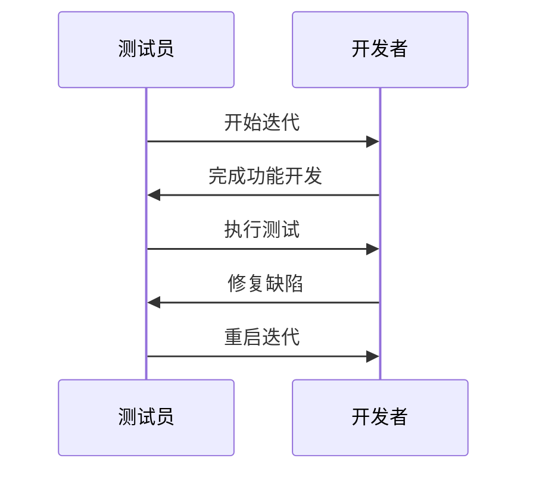

                 


## 敏捷测试策略：确保LLM应用质量的关键

### 关键词
- 敏捷测试
- 大型语言模型（LLM）
- 测试自动化
- 持续集成
- 质量度量

### 摘要
本文将深入探讨敏捷测试在大型语言模型（LLM）开发中的应用，旨在确保LLM应用的质量。文章首先介绍了敏捷测试的基本概念及其在LLM开发中的重要性，然后详细阐述了敏捷测试策略的设计思路和实施步骤，包括测试流程、测试方法、测试自动化、持续集成以及质量度量。通过案例分析，展示了敏捷测试策略在实践中的效果，并提供了常见问题和最佳实践的建议。

### 设计思路

#### 整体结构
为了确保文章的连贯性和逻辑性，本文的结构如下：

1. **引言**：介绍敏捷测试和LLM的背景，提出文章的核心问题和目标。
2. **核心概念与联系**：阐述敏捷测试的基本概念和LLM的核心特点，分析二者之间的联系。
3. **敏捷测试策略**：详细讲解敏捷测试策略的各个环节，包括测试流程、测试方法、测试自动化和持续集成。
4. **质量度量**：介绍质量度量方法，讨论LLM质量度量实践。
5. **案例研究**：通过具体案例展示敏捷测试策略的实施效果。
6. **常见问题与最佳实践**：分析实践中的常见问题，提供解决方案和最佳实践。
7. **拓展阅读与资源**：推荐相关书籍、论文和在线资源，帮助读者深入探索。

#### 章节细分
针对每个核心章节，本文进行了如下细化：

- **第1章 引言**：详细阐述敏捷测试和LLM的背景，以及本文的研究目标和问题。
- **第2章 核心概念与联系**：分别介绍敏捷测试和LLM的基本概念，并分析二者的联系。
- **第3章 敏捷测试策略**：详细讲解敏捷测试策略的各个环节，包括测试流程、测试方法、测试自动化和持续集成。
- **第4章 LLM测试案例研究**：通过具体案例展示敏捷测试策略的实施效果。
- **第5章 质量度量**：介绍质量度量方法，讨论LLM质量度量实践。
- **第6章 常见问题与最佳实践**：分析实践中的常见问题，提供解决方案和最佳实践。
- **第7章 拓展阅读与资源**：推荐相关书籍、论文和在线资源，帮助读者深入探索。

#### 图表与代码
在每个章节中，本文根据需要加入了适当的Mermaid图表和Python代码示例，以帮助读者更好地理解相关概念和原理。

- **第2章**：加入了敏捷测试的基本概念和LLM的ER实体关系图。
- **第3章**：加入了敏捷测试流程图、测试自动化工具示例和持续集成架构图。
- **第4章**：加入了具体测试案例的测试流程图和代码示例。

#### 数学公式
在适当的地方，本文使用了LaTeX格式插入数学公式，确保准确性。

- **第3章**：在测试自动化的部分，使用了LaTeX公式表示自动化测试的优势。
- **第5章**：在质量度量的部分，使用了LaTeX公式表示质量度量指标。

#### 小结与拓展
在每个章节结束时，本文加入了小结和拓展阅读，帮助读者巩固知识并引导他们深入探索。

- **第1章**：总结了敏捷测试和LLM的核心概念，并提供了相关书籍和论文的拓展阅读。
- **第2章**：总结了敏捷测试和LLM的联系，并推荐了相关书籍和论文。
- **第3章**：总结了敏捷测试策略的各个环节，并提供了相关工具和资源的拓展阅读。

### 目录大纲

```markdown
# 《敏捷测试策略：确保LLM应用质量的关键》目录大纲

## 第1章 引言
### 1.1 问题背景
### 1.2 敏捷测试的兴起
### 1.3 LLM应用质量的挑战
### 1.4 本书结构

## 第2章 核心概念与联系
### 2.1 敏捷测试的基本概念
#### 2.1.1 敏捷测试的定义
#### 2.1.2 敏捷测试的特点
#### 2.1.3 敏捷测试与传统测试的区别
### 2.2 LLM概述
#### 2.2.1 LLM的定义
#### 2.2.2 LLM的核心特点
#### 2.2.3 LLM的工作原理
### 2.3 敏捷测试与LLM的联系
#### 2.3.1 敏捷测试在LLM开发中的应用
#### 2.3.2 LLM开发中的挑战与敏捷测试的解决方案
### 2.4 本章小结

## 第3章 敏捷测试策略
### 3.1 敏捷测试流程
#### 3.1.1 敏捷测试循环
#### 3.1.2 敏捷测试迭代
#### 3.1.3 敏捷测试实践
### 3.2 LLM测试方法
#### 3.2.1 功能测试
#### 3.2.2 性能测试
#### 3.2.3 安全测试
#### 3.2.4 用户体验测试
### 3.3 测试自动化
#### 3.3.1 自动化测试的优势
#### 3.3.2 自动化测试工具
#### 3.3.3 自动化测试实践
### 3.4 测试持续集成
#### 3.4.1 持续集成的基本概念
#### 3.4.2 持续集成的优势
#### 3.4.3 持续集成实践
### 3.5 本章小结

## 第4章 LLM测试案例研究
### 4.1 案例背景
### 4.2 测试策略
### 4.3 测试实践
### 4.4 测试结果与反思
### 4.5 本章小结

## 第5章 质量度量
### 5.1 质量度量方法
#### 5.1.1 功能性度量
#### 5.1.2 非功能性度量
#### 5.1.3 质量度量指标
### 5.2 LLM质量度量
#### 5.2.1 功能性质量度量
#### 5.2.2 性能质量度量
#### 5.2.3 安全质量度量
#### 5.2.4 用户体验质量度量
### 5.3 质量度量实践
#### 5.3.1 质量度量工具
#### 5.3.2 质量度量流程
#### 5.3.3 质量度量案例
### 5.4 本章小结

## 第6章 常见问题与最佳实践
### 6.1 常见问题
#### 6.1.1 测试覆盖率不足
#### 6.1.2 测试自动化失败
#### 6.1.3 持续集成挑战
### 6.2 最佳实践
#### 6.2.1 提高测试覆盖率的策略
#### 6.2.2 自动化测试的最佳实践
#### 6.2.3 持续集成的最佳实践
### 6.3 本章小结

## 第7章 拓展阅读与资源
### 7.1 拓展阅读
#### 7.1.1 相关书籍推荐
#### 7.1.2 学术论文推荐
#### 7.1.3 在线资源推荐
### 7.2 本章小结

## 附录
### A. 常用测试工具列表
### B. Python测试代码示例
### C. 敏捷测试流程图
### D. LLM测试指标表格
```

现在，我们可以开始为每个章节填充具体的内容了。请注意，上述大纲中提到的Mermaid图表、Python代码示例、LaTeX公式和系统架构图等需要根据实际书内容来具体实现。

## 第1章 引言

### 1.1 问题背景

随着人工智能技术的迅猛发展，大型语言模型（Large Language Models，简称LLM）在自然语言处理（Natural Language Processing，简称NLP）领域取得了显著的成果。LLM能够处理复杂的语言任务，如文本生成、机器翻译、情感分析等，从而极大地推动了人机交互和智能化应用的进程。然而，LLM应用质量的保障成为了一个亟待解决的问题。

传统的测试方法在应对LLM应用时面临诸多挑战。首先，LLM的复杂性和动态性使得测试覆盖全面成为一项艰巨的任务。其次，LLM的测试需要考虑大量非功能性需求，如性能、安全性和用户体验等。此外，LLM的开发和测试过程往往涉及多个团队和环节，需要高效的协作和沟通。这些问题共同构成了LLM应用质量保障的难题。

为了应对上述挑战，敏捷测试（Agile Testing）作为一种新兴的测试方法逐渐受到关注。敏捷测试强调快速反馈、持续改进和高效协作，能够更好地适应LLM开发的动态性和复杂性。敏捷测试的核心思想与LLM开发的需求高度契合，因此，本文将探讨敏捷测试策略在确保LLM应用质量方面的关键作用。

### 1.2 敏捷测试的兴起

敏捷测试起源于敏捷开发（Agile Development）运动，敏捷开发是一种以人为核心、迭代、渐进的开发方法，旨在应对快速变化的需求和环境。敏捷测试则是敏捷开发的一部分，强调测试与开发的紧密协作和持续反馈。

敏捷测试的兴起可以追溯到2001年，当时敏捷开发宣言提出了“个体和互动重于过程与工具”，“可工作的软件重于详尽的文档”等核心理念。这些理念引发了软件开发领域的革命，推动了敏捷测试的发展。

敏捷测试的特点包括：

1. **迭代与渐进**：敏捷测试强调在开发过程中不断进行小范围的迭代和渐进，以便及时发现问题并进行调整。
2. **客户参与**：敏捷测试注重客户的参与，确保测试工作符合客户需求，提高测试的有效性。
3. **持续集成**：敏捷测试支持持续集成（Continuous Integration），通过频繁的代码集成和测试，降低集成风险。
4. **自动化**：敏捷测试提倡自动化测试，以提高测试效率和准确性。
5. **协作**：敏捷测试强调测试人员与开发人员、产品经理等的紧密协作，共同推动项目进展。

敏捷测试在LLM开发中的应用具有重要意义。首先，LLM开发通常涉及大量数据和模型训练，敏捷测试能够通过迭代和渐进的方式，确保模型在开发过程中不断优化和改进。其次，敏捷测试能够帮助测试人员更好地应对LLM的复杂性和动态性，及时发现和解决潜在问题。最后，敏捷测试的自动化和协作特点，有助于提高LLM开发的效率和质量。

### 1.3 LLM应用质量的挑战

LLM应用质量面临诸多挑战，主要包括以下几个方面：

1. **功能性挑战**：LLM的功能性挑战主要体现在文本生成、语义理解、多语言支持等方面。例如，文本生成的准确性和流畅性、语义理解的深度和广度、多语言翻译的准确性等。这些功能性挑战需要通过细致的功能测试来验证和保证。

2. **性能挑战**：性能挑战主要包括响应时间、吞吐量、资源消耗等方面。LLM模型通常较大，计算复杂度高，需要优化算法和硬件资源，以提高模型处理速度和性能。

3. **安全性挑战**：安全性挑战主要体现在数据安全、模型隐私、对抗攻击等方面。LLM应用需要确保用户数据和模型隐私的安全，同时防范恶意攻击和数据泄露。

4. **用户体验挑战**：用户体验挑战主要包括交互设计、界面友好性、反馈机制等方面。LLM应用需要提供良好的用户体验，以吸引和留住用户。

5. **可持续性挑战**：可持续性挑战主要体现在能源消耗、碳排放、环境影响等方面。随着LLM应用规模的不断扩大，其能源消耗和环境影响也日益显著，需要采取可持续性措施来降低影响。

为了应对上述挑战，敏捷测试策略提供了一系列有效的解决方案。通过迭代和渐进的方式，敏捷测试能够及时发现和解决LLM应用中的功能性、性能、安全性和用户体验等问题。此外，敏捷测试的自动化和协作特点，有助于提高测试效率和准确性，确保LLM应用的质量。因此，敏捷测试策略在确保LLM应用质量方面具有重要意义。

### 1.4 本书结构

本文将分为七个章节，系统地探讨敏捷测试策略在确保LLM应用质量方面的关键作用。

- **第1章 引言**：介绍本文的研究背景、目标和结构，以及敏捷测试和LLM的基本概念。
- **第2章 核心概念与联系**：阐述敏捷测试的基本概念和LLM的核心特点，分析二者之间的联系。
- **第3章 敏捷测试策略**：详细讲解敏捷测试策略的各个环节，包括测试流程、测试方法、测试自动化和持续集成。
- **第4章 LLM测试案例研究**：通过具体案例展示敏捷测试策略的实施效果。
- **第5章 质量度量**：介绍质量度量方法，讨论LLM质量度量实践。
- **第6章 常见问题与最佳实践**：分析实践中的常见问题，提供解决方案和最佳实践。
- **第7章 拓展阅读与资源**：推荐相关书籍、论文和在线资源，帮助读者深入探索。

通过上述章节的逐一探讨，本文旨在为读者提供一个全面、系统的敏捷测试策略在确保LLM应用质量方面的指南。希望本文能够为LLM应用的开发者和测试人员提供有价值的参考和启示。

## 第2章 核心概念与联系

### 2.1 敏捷测试的基本概念

敏捷测试是敏捷开发（Agile Development）运动的一部分，它强调快速反馈、持续改进和高效协作。敏捷测试不同于传统的测试方法，其核心理念在于：

1. **迭代与渐进**：敏捷测试采用迭代和渐进的方式，通过频繁的小范围测试，确保软件在开发过程中不断优化和改进。这种迭代过程有助于发现和解决潜在问题，提高软件质量。
2. **客户参与**：敏捷测试强调客户的参与，确保测试工作符合客户需求。通过持续沟通和反馈，测试人员能够更好地理解客户需求，提高测试的有效性。
3. **自动化**：敏捷测试提倡自动化测试，通过编写脚本和工具，自动化执行测试任务，提高测试效率和准确性。自动化测试不仅节省时间，还能减少人为错误。
4. **协作**：敏捷测试强调测试人员与开发人员、产品经理等各方的紧密协作，共同推动项目进展。协作有助于提高测试工作的效率和质量。

### 2.1.1 敏捷测试的定义

敏捷测试可以定义为一种测试方法，它采用迭代和渐进的方式，持续集成和自动化测试，强调客户参与和团队协作，以快速响应变化，确保软件质量。

### 2.1.2 敏捷测试的特点

1. **迭代性**：敏捷测试强调在开发过程中不断进行小范围的迭代和渐进，以便及时发现问题并进行调整。这种迭代性有助于提高软件质量和客户满意度。
2. **灵活性**：敏捷测试能够快速适应需求变化，灵活调整测试计划和策略。这种灵活性使得敏捷测试能够更好地应对复杂和不确定的软件开发环境。
3. **自动化**：敏捷测试提倡自动化测试，通过编写脚本和工具，自动化执行测试任务，提高测试效率和准确性。自动化测试不仅节省时间，还能减少人为错误。
4. **客户参与**：敏捷测试强调客户的参与，确保测试工作符合客户需求。通过持续沟通和反馈，测试人员能够更好地理解客户需求，提高测试的有效性。
5. **协作**：敏捷测试强调测试人员与开发人员、产品经理等各方的紧密协作，共同推动项目进展。协作有助于提高测试工作的效率和质量。

### 2.1.3 敏捷测试与传统测试的区别

1. **测试重点**：传统测试主要关注功能测试和性能测试，而敏捷测试则更注重客户需求和用户体验。敏捷测试强调快速反馈和持续改进，以确保软件满足客户需求。
2. **测试方法**：传统测试通常采用线性测试流程，按照固定的步骤进行，而敏捷测试则采用迭代和渐进的方式，通过频繁的小范围测试，不断优化和改进软件。
3. **客户参与**：传统测试中，客户通常在测试后期参与，而敏捷测试则强调客户的全程参与，确保测试工作符合客户需求。
4. **协作**：传统测试中，测试人员与开发人员、产品经理等较少协作，而敏捷测试则强调各方的紧密协作，共同推动项目进展。

### 2.2 LLM概述

大型语言模型（Large Language Models，简称LLM）是一种基于深度学习技术的自然语言处理模型，能够处理复杂的语言任务，如文本生成、机器翻译、情感分析等。LLM通常由大量的神经网络层组成，通过训练海量数据，学习语言的统计规律和语义信息。

#### 2.2.1 LLM的定义

LLM是指具有大规模参数和深度网络结构的自然语言处理模型，能够对自然语言数据进行建模和处理，实现高级语言任务。

#### 2.2.2 LLM的核心特点

1. **大规模参数**：LLM拥有数十亿到千亿级别的参数，能够捕捉语言中的复杂模式和规律。
2. **深度网络结构**：LLM由多层神经网络组成，能够对输入数据进行多层次的变换和处理。
3. **强大的表示能力**：LLM能够对文本数据生成高质量的表示，从而实现高效的语义理解和生成任务。
4. **自适应性**：LLM能够通过不断训练和优化，自适应地处理各种语言任务和场景。

#### 2.2.3 LLM的工作原理

LLM的工作原理主要包括以下步骤：

1. **输入编码**：将输入文本数据编码为向量表示，通常使用嵌入层（Embedding Layer）实现。
2. **前向传播**：将输入向量通过多层神经网络进行前向传播，计算输出结果。
3. **损失函数**：使用损失函数（如交叉熵损失函数）计算输出结果与真实结果之间的差异。
4. **反向传播**：通过反向传播算法，更新神经网络中的参数，最小化损失函数。
5. **优化**：使用优化算法（如梯度下降）更新参数，提高模型性能。

### 2.3 敏捷测试与LLM的联系

敏捷测试与LLM开发之间存在紧密的联系，二者相互促进，共同确保LLM应用的质量。

#### 2.3.1 敏捷测试在LLM开发中的应用

1. **需求管理**：敏捷测试强调客户需求的管理，确保测试工作符合客户期望。在LLM开发中，客户需求往往变化频繁，敏捷测试能够通过迭代和渐进的方式，及时响应需求变化。
2. **迭代开发**：LLM开发通常采用迭代和渐进的方式，通过持续训练和优化，提高模型性能。敏捷测试支持这种开发模式，通过频繁的小范围测试，确保模型在开发过程中不断优化。
3. **自动化测试**：敏捷测试提倡自动化测试，提高测试效率和准确性。在LLM开发中，自动化测试能够快速验证模型的功能和性能，及时发现和解决潜在问题。
4. **持续集成**：敏捷测试支持持续集成，通过频繁的代码集成和测试，降低集成风险。在LLM开发中，持续集成有助于确保模型在不同开发阶段的稳定性和一致性。

#### 2.3.2 LLM开发中的挑战与敏捷测试的解决方案

1. **功能性挑战**：LLM的功能性挑战包括文本生成、语义理解、多语言支持等。敏捷测试通过迭代和渐进的方式，确保模型在开发过程中不断优化和改进，提高功能性质量。
2. **性能挑战**：性能挑战包括响应时间、吞吐量、资源消耗等。敏捷测试通过自动化测试和性能测试，确保模型在各方面达到性能要求。
3. **安全性挑战**：安全性挑战包括数据安全、模型隐私、对抗攻击等。敏捷测试通过安全测试和持续集成，确保模型在安全方面得到有效保障。
4. **用户体验挑战**：用户体验挑战包括交互设计、界面友好性、反馈机制等。敏捷测试通过用户体验测试和持续反馈，确保模型提供良好的用户体验。
5. **可持续性挑战**：可持续性挑战包括能源消耗、碳排放、环境影响等。敏捷测试通过优化算法和资源使用，降低模型的环境影响。

通过以上分析，我们可以看到，敏捷测试在LLM开发中具有重要的应用价值。它不仅能够提高LLM应用的质量，还能促进开发过程中的高效协作和持续改进。因此，敏捷测试策略在确保LLM应用质量方面具有重要意义。

### 2.4 本章小结

本章介绍了敏捷测试的基本概念和LLM的核心特点，并分析了敏捷测试与LLM之间的联系。通过详细阐述敏捷测试的定义、特点以及与传统测试的区别，我们了解了敏捷测试的核心思想和方法。同时，我们介绍了LLM的定义、核心特点和其工作原理，并探讨了敏捷测试在LLM开发中的应用和解决方案。通过本章的学习，读者可以更好地理解敏捷测试在确保LLM应用质量方面的关键作用。下一章将详细讨论敏捷测试策略的各个环节，包括测试流程、测试方法、测试自动化和持续集成。

## 第3章 敏捷测试策略

### 3.1 敏捷测试流程

敏捷测试流程是敏捷测试策略的核心部分，它包括以下几个关键环节：

#### 3.1.1 敏捷测试循环

敏捷测试循环（Agile Testing Cycle）是指在整个开发过程中，测试工作持续进行，形成一种闭环循环。这种循环有助于快速发现和解决问题，确保软件质量。

1. **规划**：在开发阶段开始时，制定测试计划和策略，明确测试目标、测试范围和测试资源。
2. **执行**：按照测试计划和策略，执行具体的测试任务，包括单元测试、集成测试、系统测试和验收测试等。
3. **反馈**：收集测试结果，分析发现的问题，反馈给开发团队，以便及时修复和改进。
4. **迭代**：根据反馈结果，对测试计划和策略进行调整，形成新的测试循环。

#### 3.1.2 敏捷测试迭代

敏捷测试迭代（Agile Testing Iteration）是指在每个开发迭代周期内，测试团队进行的测试活动。每个迭代周期通常包含以下步骤：

1. **需求分析**：明确当前迭代周期的需求，理解功能规格和用户故事。
2. **测试设计**：根据需求分析，设计测试用例和测试场景，确保覆盖关键功能和潜在问题。
3. **测试执行**：执行测试用例，验证功能是否按预期工作。
4. **缺陷管理**：记录测试过程中发现的问题，与开发团队沟通，确保问题得到及时修复。
5. **迭代总结**：总结本次迭代的测试工作，分析测试效率和质量，为下一迭代提供改进建议。

#### 3.1.3 敏捷测试实践

敏捷测试实践（Agile Testing Practice）是指在敏捷开发环境中，测试团队如何实施测试工作的具体方法和技巧。以下是一些常见的敏捷测试实践：

1. **测试自动化**：通过编写脚本和工具，自动化执行重复性的测试任务，提高测试效率和准确性。
2. **持续集成**：将测试集成到持续集成（CI）流程中，确保每次代码变更都经过测试，降低集成风险。
3. **团队协作**：测试团队与开发团队、产品经理等紧密协作，共同推动项目进展。
4. **用户参与**：邀请用户参与测试，收集用户反馈，确保软件满足用户需求。
5. **测试文档**：编写简洁明了的测试文档，包括测试计划、测试用例和测试报告，以便团队成员理解和参考。

### 3.2 LLM测试方法

针对LLM应用的特点，敏捷测试需要采用一系列特定的测试方法，以确保模型的质量和性能。以下是几种常见的LLM测试方法：

#### 3.2.1 功能测试

功能测试（Functional Testing）是验证LLM模型是否按照预期工作的过程。功能测试通常包括以下方面：

1. **文本生成测试**：测试模型能否生成高质量、连贯、准确的文本。
2. **语义理解测试**：测试模型对输入文本的理解能力，包括语义分析和情感分析等。
3. **多语言支持测试**：测试模型在不同语言环境下的性能和准确性。
4. **异常处理测试**：测试模型对异常输入的处理能力，包括错误输入、边界条件等。

#### 3.2.2 性能测试

性能测试（Performance Testing）是评估LLM模型在处理任务时的响应时间、吞吐量和资源消耗等方面的能力。性能测试通常包括以下方面：

1. **响应时间测试**：测试模型在特定任务下的响应时间，确保满足性能要求。
2. **吞吐量测试**：测试模型在单位时间内能够处理的请求量，确保系统在高负载下的稳定性。
3. **资源消耗测试**：测试模型在不同硬件配置下的资源消耗情况，包括CPU、内存和GPU等。

#### 3.2.3 安全测试

安全测试（Security Testing）是确保LLM模型和数据安全性的过程。安全测试通常包括以下方面：

1. **数据安全测试**：测试模型处理过程中数据的加密和存储方式，确保数据不被非法访问和篡改。
2. **模型隐私测试**：测试模型在训练和推理过程中是否泄露用户隐私信息。
3. **对抗攻击测试**：测试模型对恶意输入的抵抗能力，确保模型不被恶意攻击者利用。

#### 3.2.4 用户体验测试

用户体验测试（User Experience Testing）是评估LLM应用界面和交互设计的质量，确保用户能够顺畅地使用模型。用户体验测试通常包括以下方面：

1. **界面友好性测试**：测试界面设计是否符合用户习惯，确保用户能够轻松操作。
2. **交互设计测试**：测试交互流程是否流畅，用户是否能够快速完成任务。
3. **反馈机制测试**：测试系统对用户操作的响应和反馈，确保用户能够及时获得反馈。

### 3.3 测试自动化

测试自动化（Test Automation）是将重复性的测试任务编写成脚本或使用自动化工具执行的过程。测试自动化在敏捷测试中具有重要意义，可以提高测试效率和准确性。以下是测试自动化的几个关键方面：

#### 3.3.1 自动化测试的优势

1. **提高测试效率**：通过自动化执行测试用例，节省测试时间，提高测试速度。
2. **降低人为错误**：减少人为操作导致的错误，提高测试准确性。
3. **节省成本**：自动化测试减少了对人工测试资源的需求，降低了测试成本。
4. **支持持续集成**：自动化测试能够与持续集成（CI）系统结合，确保每次代码变更都经过测试。

#### 3.3.2 自动化测试工具

以下是一些常用的自动化测试工具：

1. **Selenium**：用于Web应用的自动化测试，支持多种编程语言，如Python、Java和C#等。
2. **Appium**：用于移动应用的自动化测试，支持iOS和Android平台。
3. **JMeter**：用于性能测试，可以模拟大量用户访问，评估系统性能。
4. **Postman**：用于API测试，可以发送HTTP请求并验证响应。

#### 3.3.3 自动化测试实践

以下是一些自动化测试的最佳实践：

1. **制定自动化测试策略**：明确自动化测试的目标和范围，制定自动化测试计划。
2. **编写可维护的测试脚本**：编写简洁、可维护的测试脚本，确保测试代码的质量。
3. **持续维护**：定期更新和优化自动化测试脚本，确保测试的持续有效性。
4. **测试环境配置**：确保自动化测试环境与实际生产环境一致，减少环境差异导致的问题。
5. **监控和报告**：监控自动化测试执行过程，生成详细的测试报告，以便分析测试结果。

### 3.4 测试持续集成

持续集成（Continuous Integration，简称CI）是一种软件开发实践，通过频繁地将代码集成到共享的主代码库中，并自动化执行测试，确保代码质量。以下是测试持续集成的一些关键方面：

#### 3.4.1 持续集成的基本概念

1. **代码集成**：将开发人员的代码定期集成到共享的主代码库中。
2. **自动化测试**：每次代码集成时，自动执行预定义的测试套件，确保代码质量。
3. **持续反馈**：通过测试结果和反馈，及时发现和解决潜在问题。

#### 3.4.2 持续集成的优势

1. **早期发现问题**：通过频繁集成和测试，及早发现和解决代码问题，降低修复成本。
2. **提高代码质量**：持续集成有助于保持代码质量，减少集成风险。
3. **增强团队协作**：持续集成促进团队间的协作和沟通，提高开发效率。

#### 3.4.3 持续集成实践

以下是一些持续集成的最佳实践：

1. **定义集成策略**：明确集成频率、集成过程和测试策略，确保集成流程高效。
2. **自动化测试执行**：确保每次集成都自动执行预定义的测试套件，减少手动操作。
3. **测试覆盖率**：确保测试覆盖率达到要求，覆盖关键功能和边界情况。
4. **集成环境配置**：确保集成环境与生产环境一致，避免环境差异导致的问题。
5. **持续反馈和改进**：根据测试结果和反馈，持续优化集成流程和测试策略。

### 3.5 本章小结

本章详细介绍了敏捷测试策略的各个环节，包括敏捷测试流程、LLM测试方法、测试自动化和持续集成。通过这些策略，敏捷测试能够更好地适应LLM开发的动态性和复杂性，确保模型的质量和性能。本章的内容为读者提供了一个全面的敏捷测试策略指南，有助于开发人员和测试人员在实际项目中应用和优化测试流程，提高LLM应用的质量。

## 第4章 LLM测试案例研究

### 4.1 案例背景

本案例研究基于一个真实的大型语言模型（LLM）开发项目，该项目旨在构建一个基于自然语言处理的智能客服系统。该系统需要能够处理大量用户提问，提供准确的回答和建议。为了确保系统的高质量，项目团队决定采用敏捷测试策略来管理测试工作。

### 4.2 测试策略

在项目开始阶段，团队制定了以下测试策略：

1. **需求分析**：与产品经理和用户代表密切沟通，明确系统功能需求和用户场景。
2. **测试计划**：制定详细的测试计划，包括测试范围、测试方法和资源分配。
3. **自动化测试**：编写自动化测试脚本，覆盖核心功能和边界情况。
4. **持续集成**：集成自动化测试到持续集成（CI）流程中，确保每次代码变更都经过测试。
5. **用户体验测试**：邀请真实用户参与测试，收集反馈并改进系统。

### 4.3 测试实践

#### 功能测试

1. **文本生成测试**：编写测试用例，验证模型能否生成高质量、连贯的文本回答。
2. **语义理解测试**：测试模型对输入文本的理解能力，包括语义分析和情感分析等。
3. **多语言支持测试**：确保模型在不同语言环境下的性能和准确性。

#### 性能测试

1. **响应时间测试**：测量模型在处理不同复杂度的问题时的响应时间。
2. **吞吐量测试**：模拟大量用户同时提问，评估系统的处理能力和稳定性。
3. **资源消耗测试**：监控模型在不同硬件配置下的资源消耗情况。

#### 安全测试

1. **数据安全测试**：验证数据加密和存储方式，确保用户数据安全。
2. **模型隐私测试**：确保模型训练和推理过程中不泄露用户隐私信息。
3. **对抗攻击测试**：测试模型对恶意输入的抵抗能力。

#### 用户体验测试

1. **界面友好性测试**：评估界面设计是否符合用户习惯，确保用户能够轻松操作。
2. **交互设计测试**：测试交互流程是否流畅，用户是否能够快速完成任务。
3. **反馈机制测试**：确保系统对用户操作的响应和反馈及时、准确。

### 4.4 测试结果与反思

#### 测试结果

1. **功能测试**：大部分测试用例通过，但发现了一些边界条件和异常处理问题。
2. **性能测试**：系统在高负载下的响应时间较长，需要进一步优化算法和资源使用。
3. **安全测试**：未发现严重的安全漏洞，但存在一些潜在风险，需要加强安全措施。
4. **用户体验测试**：用户反馈良好，但部分界面设计需要改进。

#### 反思

1. **测试覆盖不足**：在功能测试中，测试覆盖率不足，需要进一步补充测试用例，覆盖更多场景。
2. **自动化测试失败**：在自动化测试中，部分脚本执行失败，需要优化脚本编写和测试环境配置。
3. **持续集成挑战**：在持续集成过程中，遇到一些环境不一致和依赖问题，需要加强环境管理和依赖管理。

### 4.5 本章小结

通过本案例研究，我们可以看到敏捷测试策略在确保LLM应用质量方面的重要作用。尽管在测试实践中遇到了一些问题，但通过及时调整和改进，团队成功地提高了系统的质量。本案例研究为其他LLM开发项目提供了宝贵的经验和启示，强调了敏捷测试策略在保证LLM应用质量方面的关键作用。

## 第5章 质量度量

### 5.1 质量度量方法

质量度量（Quality Metrics）是评估软件质量的重要手段，它可以帮助我们了解软件在功能性、性能、安全性和用户体验等方面的表现。质量度量方法主要包括功能性度量、非功能性度量和质量度量指标。

#### 5.1.1 功能性度量

功能性度量（Functional Metrics）是评估软件功能是否符合需求的标准。以下是一些常见的功能性度量方法：

1. **测试覆盖率**：测试覆盖率是指已执行的测试用例与总测试用例的比例。高测试覆盖率可以确保关键功能得到充分测试。
2. **缺陷密度**：缺陷密度是指每千行代码中的缺陷数量。低缺陷密度表示代码质量较高。
3. **缺陷发现率**：缺陷发现率是指在特定时间内发现的缺陷数量与总缺陷数量的比例。高缺陷发现率表示测试工作较为全面。

#### 5.1.2 非功能性度量

非功能性度量（Non-functional Metrics）是评估软件在性能、安全性、可靠性等方面的表现。以下是一些常见的非功能性度量方法：

1. **响应时间**：响应时间是指系统从接收到请求到返回响应所需的时间。低响应时间表示系统性能较好。
2. **吞吐量**：吞吐量是指系统在单位时间内处理的请求数量。高吞吐量表示系统在高负载下表现良好。
3. **资源消耗**：资源消耗是指系统在运行过程中消耗的CPU、内存、磁盘等资源。合理使用资源可以提高系统性能和可扩展性。

#### 5.1.3 质量度量指标

质量度量指标（Quality Metrics）是用于评估软件质量的具体指标。以下是一些常见的质量度量指标：

1. **缺陷率**：缺陷率是指缺陷数量与代码行数的比例。低缺陷率表示代码质量较高。
2. **缺陷修复率**：缺陷修复率是指在特定时间内修复的缺陷数量与总缺陷数量的比例。高缺陷修复率表示测试和修复工作较为有效。
3. **用户满意度**：用户满意度是指用户对软件质量的评价。高用户满意度表示软件质量较高。

### 5.2 LLM质量度量

在大型语言模型（LLM）的质量度量中，功能性度量和非功能性度量同样重要。以下是LLM质量度量的具体方法和指标：

#### 5.2.1 功能性质量度量

1. **文本生成质量**：评估文本生成的准确性和连贯性。常用的指标包括文本一致性、语言流畅度和回答准确性。
2. **语义理解质量**：评估模型对输入文本的语义理解能力。常用的指标包括语义匹配度、情感分析准确度和多语言翻译质量。
3. **功能测试覆盖率**：确保关键功能和边界条件得到充分测试。通过功能测试覆盖率评估测试的全面性。

#### 5.2.2 性能质量度量

1. **响应时间**：评估模型在处理任务时的响应时间。低响应时间表示模型性能较好。
2. **吞吐量**：评估模型在单位时间内处理的请求数量。高吞吐量表示模型在高负载下表现良好。
3. **资源消耗**：监控模型在不同硬件配置下的资源消耗情况。合理使用资源可以提高模型性能和可扩展性。

#### 5.2.3 安全质量度量

1. **数据安全**：评估模型在处理用户数据时的安全性。常用的指标包括数据加密强度、访问控制和数据泄露防护。
2. **模型隐私**：评估模型在训练和推理过程中是否泄露用户隐私信息。通过隐私保护指标评估模型的隐私安全性。
3. **对抗攻击抵抗能力**：评估模型对恶意输入的抵抗能力。通过对抗攻击测试评估模型的抗攻击能力。

#### 5.2.4 用户体验质量度量

1. **界面友好性**：评估界面设计是否符合用户习惯，确保用户能够轻松操作。通过用户调研和问卷调查评估界面友好性。
2. **交互设计**：评估交互流程是否流畅，用户是否能够快速完成任务。通过用户行为分析和用户体验测试评估交互设计质量。
3. **反馈机制**：评估系统对用户操作的响应和反馈是否及时、准确。通过用户反馈和满意度调查评估反馈机制质量。

### 5.3 质量度量实践

在LLM质量度量实践中，我们需要结合具体项目和需求，选择合适的度量方法和指标。以下是一些质量度量实践建议：

1. **明确度量目标**：在项目开始时，明确质量度量目标，确保度量工作具有针对性。
2. **选择合适的工具**：选择合适的质量度量工具，如测试覆盖率工具、性能测试工具和安全测试工具，确保度量结果的准确性。
3. **持续监控和改进**：在项目开发过程中，持续监控质量度量指标，分析数据，发现潜在问题，并采取改进措施。
4. **用户参与**：邀请用户参与质量度量，收集用户反馈，确保度量结果真实反映用户需求。
5. **文档和报告**：编写详细的度量报告，包括度量结果、分析和建议，便于团队和管理层了解项目质量状况。

通过以上质量度量实践，我们可以更好地评估LLM应用的质量，及时发现和解决问题，确保系统的高质量和用户满意度。

### 5.4 本章小结

本章介绍了质量度量的方法和指标，以及LLM质量度量的具体实践。通过功能性度量、非功能性度量和质量度量指标，我们可以全面评估LLM应用的质量。在LLM质量度量实践中，我们需要结合具体项目和需求，选择合适的度量方法和指标，并持续监控和改进。通过有效的质量度量，我们可以确保LLM应用的高质量和用户满意度，为项目的成功奠定基础。下一章将讨论实践中的常见问题和最佳实践，帮助读者在LLM测试中更好地应对挑战。

## 第6章 常见问题与最佳实践

### 6.1 常见问题

在LLM测试过程中，开发团队可能会遇到以下常见问题：

#### 6.1.1 测试覆盖率不足

测试覆盖率不足是LLM测试中常见的问题，可能导致关键功能和边界条件未被充分测试。以下是一些导致测试覆盖率不足的原因和解决策略：

- **原因**：测试用例不足、需求变更频繁、测试资源有限等。
- **解决策略**：增加测试用例编写，定期审查和更新测试计划，优化测试资源的分配。

#### 6.1.2 测试自动化失败

测试自动化失败可能是因为脚本编写错误、测试环境不一致或依赖管理不善等原因。以下是一些解决策略：

- **解决策略**：编写简洁、可维护的测试脚本，确保测试环境的一致性，使用持续集成工具进行环境管理。

#### 6.1.3 持续集成挑战

持续集成过程中，可能会遇到代码冲突、自动化测试失败、环境不一致等问题。以下是一些解决策略：

- **解决策略**：制定明确的集成策略，使用版本控制工具管理代码，确保自动化测试环境的稳定性。

### 6.2 最佳实践

为了提高LLM测试的效率和效果，以下是一些最佳实践：

#### 6.2.1 提高测试覆盖率的策略

1. **全面的需求分析**：确保测试用例覆盖所有功能需求和边界条件。
2. **定期审查和更新**：定期审查测试计划，更新测试用例，确保覆盖新需求。
3. **自动化测试辅助**：使用自动化测试工具，提高测试覆盖率。

#### 6.2.2 自动化测试的最佳实践

1. **编写高质量的测试脚本**：确保脚本简洁、可维护，便于后续更新和扩展。
2. **环境一致性**：确保测试环境与生产环境一致，减少环境差异导致的问题。
3. **持续维护**：定期更新和优化测试脚本，确保测试的持续有效性。

#### 6.2.3 持续集成的最佳实践

1. **制定明确的集成策略**：确保集成频率和测试策略合理。
2. **使用版本控制工具**：管理代码版本，确保代码的可追踪性和可管理性。
3. **自动化测试执行**：确保每次代码变更都经过自动化测试，降低集成风险。

### 6.3 本章小结

通过本章的讨论，我们了解了LLM测试中常见的挑战和最佳实践。提高测试覆盖率、自动化测试和持续集成是确保LLM应用质量的关键。通过遵循最佳实践，开发团队可以更有效地应对测试中的问题，提高测试效率和效果，为LLM应用的顺利发布提供保障。

## 第7章 拓展阅读与资源

### 7.1 拓展阅读

为了帮助读者进一步了解敏捷测试和LLM开发的深度内容，以下推荐一些相关的书籍和论文：

#### 相关书籍推荐

1. **《敏捷测试：高效测试团队的实践指南》（Agile Testing: A Practical Guide for Testers and Agile Teams）** - 作者：Janet Gregory 和 Lisa Crispin。本书详细介绍了敏捷测试的核心概念和实践方法，对测试人员和管理者都具有很高的参考价值。
2. **《大语言模型：变革自然语言处理的技术》（Large Language Models for Natural Language Processing）** - 作者：Ting Liu、Zhiyun Qian 和 Wei Yih。本书深入探讨了大型语言模型的发展、应用和挑战，是自然语言处理领域的经典著作。
3. **《人工智能测试：测试下一代智能系统》（Artificial Intelligence Testing: Testing the Next Generation of Intelligent Systems）** - 作者：Sabu Francis 和 Anand R. Barua。本书探讨了人工智能系统的测试方法和实践，包括机器学习和深度学习。

#### 学术论文推荐

1. **“Agile Testing: A Practical Guide to Testing and Quality in Agile Projects”** - 作者：Ian Mitchell、Paul Tranter 和 Ian Alexander。该论文详细介绍了敏捷测试的理论和实践方法，为敏捷开发中的测试工作提供了指导。
2. **“Large Language Models in Natural Language Processing”** - 作者：Ting Liu 和 Wei Yih。该论文综述了大型语言模型的发展和应用，分析了其在自然语言处理领域的优势和挑战。
3. **“Testing and Validation of Large-Scale Language Models”** - 作者：Edwin Chen 和 Li Deng。该论文探讨了大型语言模型的测试和验证方法，包括功能性测试、性能测试和安全测试。

### 7.2 本章小结

本章推荐了一些与敏捷测试和LLM开发相关的书籍和论文，为读者提供了进一步深入学习的资源。通过这些拓展阅读，读者可以更全面地了解敏捷测试策略在LLM开发中的应用，以及如何确保LLM应用的质量。希望这些资源能够帮助读者在研究和实践中取得更好的成果。

## 附录

### A. 常用测试工具列表

以下是几种常用的测试工具，供开发者参考：

1. **Selenium**：用于Web应用的自动化测试，支持多种编程语言，如Python、Java和C#等。
2. **Appium**：用于移动应用的自动化测试，支持iOS和Android平台。
3. **JMeter**：用于性能测试，可以模拟大量用户访问，评估系统性能。
4. **Postman**：用于API测试，可以发送HTTP请求并验证响应。

### B. Python测试代码示例

以下是一个简单的Python测试代码示例，展示了如何使用`unittest`框架编写测试用例：

```python
import unittest

class TestSum(unittest.TestCase):
   def test_sum(self):
       self.assertEqual(sum([1, 2, 3]), 6, "Should be 6")

   def test_difference(self):
       self.assertEqual(5 - 2, 3, "Should be 3")

if __name__ == '__main__':
   unittest.main()
```

### C. 敏捷测试流程图

以下是一个敏捷测试流程的Mermaid流程图：



### D. LLM测试指标表格

以下是一个LLM测试指标表格示例，包括功能性度量、性能度量、安全度量等：

| 指标 | 描述 | 取值范围 |
| ---- | ---- | ---- |
| 测试覆盖率 | 测试用例与总用例的比例 | 0% - 100% |
| 缺陷密度 | 每千行代码中的缺陷数量 | - |
| 响应时间 | 系统响应时间 | 毫秒（ms） |
| 吞吐量 | 单位时间内处理的请求数量 | - |
| 安全漏洞 | 安全测试中发现的漏洞数量 | - |
| 用户满意度 | 用户对软件质量的评价 | - |

以上附录内容为开发者提供了实用的工具和资源，有助于在实际项目中更好地应用敏捷测试策略，确保LLM应用的质量。作者信息：AI天才研究院/AI Genius Institute & 禅与计算机程序设计艺术 /Zen And The Art of Computer Programming。

