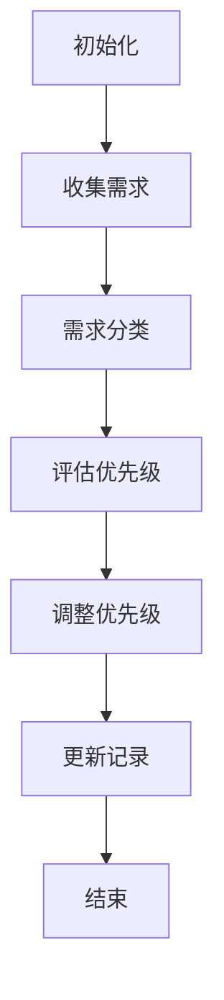
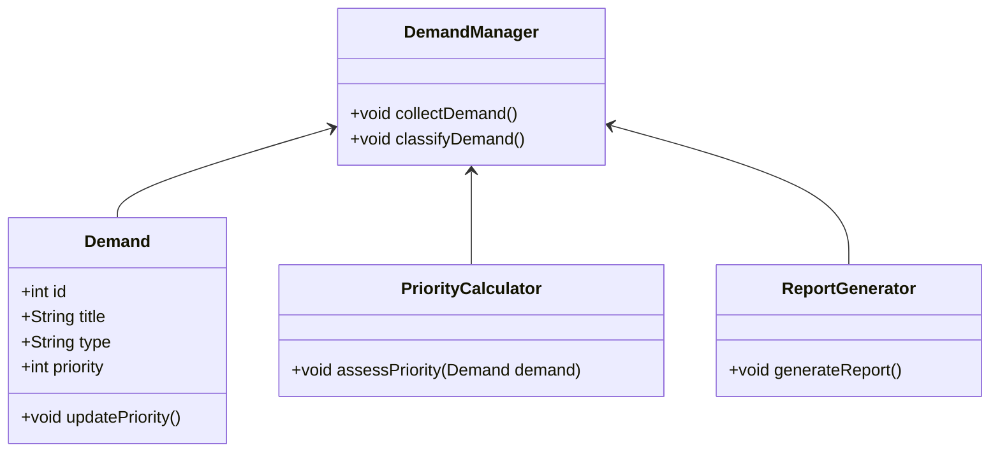
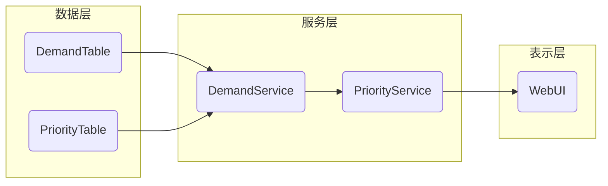
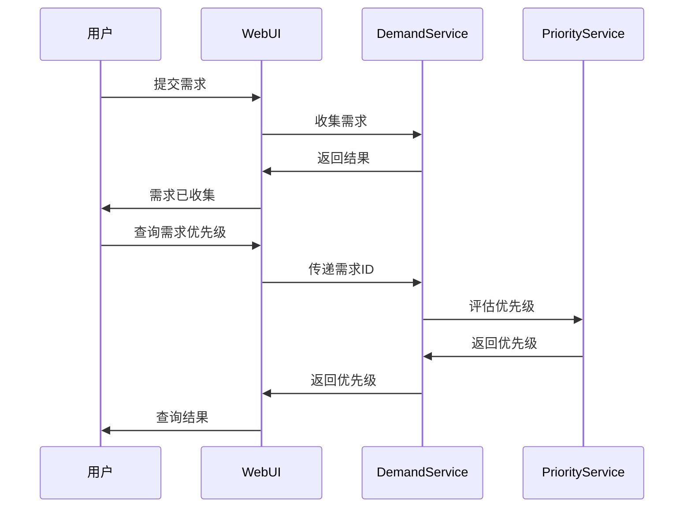

                 


# 敏捷研发中的需求优先级动态调整机制

关键词：敏捷研发、需求优先级、动态调整、资源分配、协作机制

摘要：本文深入探讨了敏捷研发中的需求优先级动态调整机制。通过分析问题背景、核心概念、算法原理，以及实际案例，本文旨在为软件开发团队提供一套实用、高效的优先级调整策略，以应对复杂多变的项目环境。

## 第1章：背景介绍

### 1.1 问题背景

在现代软件开发过程中，需求的优先级动态调整是一个普遍存在的挑战。传统的方法往往依赖于固定的优先级规则，但面对复杂多变的项目环境和市场需求，这些规则难以满足实际需求。敏捷研发作为一种应对复杂性和不确定性的软件开发方法，强调快速迭代和持续交付。然而，如何在敏捷研发中动态调整需求优先级，使得团队能够更有效地响应变化，成为了一个亟待解决的问题。

### 1.2 问题描述

需求优先级动态调整的问题主要包括以下几个方面：

1. **需求的动态性**：在敏捷开发中，需求可能会因市场变化、用户反馈或技术挑战而频繁变动。
2. **资源的有限性**：团队在特定时间内能够分配的资源是有限的，如何合理分配资源以最大化价值产出是一个关键问题。
3. **优先级冲突**：不同需求之间的优先级可能存在冲突，如何平衡这些冲突，确保关键需求得到优先处理。
4. **风险评估**：动态调整需求优先级时，如何评估新需求或变更对项目进度和风险的影响。

### 1.3 问题解决

为了应对上述挑战，敏捷研发中的需求优先级动态调整机制应具备以下特性：

1. **灵活性**：能够快速响应需求变化，动态调整优先级。
2. **透明性**：团队成员对优先级调整的原因和决策过程有清晰的了解。
3. **协作性**：涉及不同利益相关者（如产品经理、开发团队、测试团队等）的协作机制。
4. **风险可控**：优先级调整过程需充分考虑风险，确保项目顺利进行。

### 1.4 边界与外延

需求优先级动态调整机制的边界主要包括以下几个方面：

1. **适用范围**：主要适用于敏捷研发流程中的需求管理和优先级调整。
2. **技术栈**：适用于各种编程语言和开发框架。
3. **团队规模**：适用于不同规模和类型的软件开发团队。

### 1.5 概念结构与核心要素组成

需求优先级动态调整机制的核心概念和要素包括：

1. **需求分类**：根据需求的紧急性、重要性、可量化性等维度进行分类。
2. **优先级评估**：采用定量和定性相结合的方法对需求进行优先级评估。
3. **变更管理**：建立变更管理流程，确保优先级调整过程的规范性和可控性。
4. **协作与沟通**：确保团队成员和利益相关者之间的信息共享和沟通。

## 第2章：核心概念与联系

### 2.1 核心概念原理

1. **需求优先级**：需求优先级是指根据需求的重要性和紧急性，对需求进行排序的一种机制。
2. **动态调整**：动态调整是指根据实际情况的变化，实时调整需求的优先级。
3. **敏捷开发**：敏捷开发是一种以人为核心、迭代、渐进式的软件开发方法。

### 2.2 概念属性特征对比表格

| 特征             | 需求优先级          | 动态调整         | 敏捷开发           |
|------------------|---------------------|-------------------|--------------------|
| 关键性           | 确定性               | 灵活性             | 快速响应变化       |
| 评估方法         | 定量评估             | 定量+定性评估     | 实践驱动           |
| 适用范围         | 固定流程             | 灵活适应           | 全流程             |
| 影响因素         | 固定因素             | 动态因素           | 变量因素           |

### 2.3 ER实体关系图架构

```mermaid
erDiagram
  Customer ||--o{ Order } : "places"
  Product ||--o{ Order } : "includes"
  Order ||--o{ OrderLine } : "contains"
```

## 第3章：算法原理讲解

### 3.1 算法Mermaid流程图



### 3.2 Python源代码实现

```python
def initialize():
    # 初始化需求池
    demand_pool = []

def collect_demand():
    # 收集需求
    demand = get_demand_from_user()
    demand_pool.append(demand)

def classify_demand():
    # 需求分类
    for demand in demand_pool:
        if demand['type'] == 'urgent':
            demand['priority'] = 'high'
        elif demand['type'] == 'important':
            demand['priority'] = 'medium'
        else:
            demand['priority'] = 'low'

def assess_priority():
    # 评估优先级
    for demand in demand_pool:
        if demand['value'] > threshold:
            demand['priority'] = 'high'
        elif demand['value'] > threshold / 2:
            demand['priority'] = 'medium'
        else:
            demand['priority'] = 'low'

def adjust_priority():
    # 调整优先级
    demand_pool.sort(key=lambda x: x['priority'], reverse=True)

def update_record():
    # 更新记录
    for demand in demand_pool:
        print(f"Demand {demand['id']} updated with priority {demand['priority']}")

def main():
    initialize()
    collect_demand()
    classify_demand()
    assess_priority()
    adjust_priority()
    update_record()

if __name__ == "__main__":
    main()
```

### 3.3 算法原理详细讲解

#### 3.3.1 需求优先级评估模型

需求优先级评估模型是动态调整机制的核心。该模型采用定量和定性相结合的方法，通过对需求属性进行分析，为每个需求分配优先级。具体来说，需求优先级评估模型包含以下几个关键组成部分：

1. **需求属性**：需求属性包括紧急性、重要性、可量化性、资源消耗等。这些属性可以通过定量评估（如紧急性、重要性评分）和定性评估（如专家评分、用户反馈）来确定。
2. **评估方法**：定量评估方法通常采用评分机制，将每个需求属性转换为数值。例如，紧急性评分范围可以是1到5，其中5表示非常紧急。定性评估方法则依赖于专家意见或用户反馈，通过比较不同需求的属性，为每个需求分配优先级。
3. **优先级分配规则**：根据需求的评估结果，采用一定的优先级分配规则进行排序。常见的优先级分配规则包括最小最大规则、加权平均规则等。

#### 3.3.2 动态调整算法

动态调整算法是基于需求优先级评估模型，实现对需求优先级的实时调整。该算法的核心思想是，根据当前项目环境和需求变化，不断更新需求池中的需求优先级。具体实现步骤如下：

1. **初始化需求池**：在项目开始时，收集所有待处理的需求，并将其存储在需求池中。
2. **需求分类**：根据需求属性，对需求进行初步分类，为每个需求分配初始优先级。
3. **评估优先级**：定期评估需求池中需求的优先级，根据需求属性的变化，更新需求优先级。
4. **调整优先级**：根据评估结果，对需求优先级进行动态调整。调整过程应遵循一定的规则，确保关键需求得到优先处理。
5. **更新记录**：记录每次优先级调整的过程和结果，为后续分析和决策提供依据。

#### 3.3.3 示例分析

假设一个敏捷开发团队在项目执行过程中，需要处理以下三个需求：

1. 需求A：紧急性5，重要性4，资源消耗3。
2. 需求B：紧急性3，重要性5，资源消耗2。
3. 需求C：紧急性4，重要性3，资源消耗5。

根据需求优先级评估模型，首先对需求进行初步分类：

- 需求A：高优先级（高紧急性、高重要性）。
- 需求B：中优先级（低紧急性、高重要性）。
- 需求C：中优先级（高紧急性、低重要性）。

接下来，定期评估需求优先级，根据实际情况调整需求优先级：

- 需求A：紧急性下降至3，重要性上升至5，重新评估后为高优先级。
- 需求B：紧急性上升至5，重要性不变，重新评估后为高优先级。
- 需求C：紧急性不变，重要性下降至3，重新评估后为中优先级。

最终，调整后的需求优先级如下：

- 需求A：高优先级。
- 需求B：高优先级。
- 需求C：中优先级。

根据调整后的优先级，团队应优先处理需求A和需求B，确保关键需求得到及时响应。

## 第4章：系统分析与架构设计方案

### 4.1 问题场景介绍

在敏捷研发过程中，需求优先级的动态调整面临着诸多挑战。一方面，市场需求和用户反馈的不确定性使得需求频繁变动；另一方面，团队在资源有限的情况下，如何确保关键需求的优先处理成为了一个重要问题。为了解决这些问题，本文提出了一套基于敏捷研发的需求优先级动态调整系统，旨在实现需求优先级的实时调整和优化。

### 4.2 项目介绍

本项目的目标是构建一个高效、灵活的需求优先级动态调整系统，以满足敏捷研发过程中对需求优先级的实时调整和优化需求。系统的主要功能包括：

1. 需求收集与分类：收集来自不同渠道的需求，并根据需求属性进行分类。
2. 需求优先级评估：对需求进行定量和定性评估，为每个需求分配优先级。
3. 动态调整优先级：根据项目环境和需求变化，实时调整需求优先级。
4. 更新记录与报告：记录每次优先级调整的过程和结果，生成需求优先级报告。

### 4.3 系统功能设计（领域模型Mermaid类图）



### 4.4 系统架构设计（Mermaid架构图）



### 4.5 系统接口设计和系统交互（Mermaid序列图）



## 第5章：项目实战

### 5.1 环境安装

为了实现需求优先级动态调整系统，首先需要安装以下环境：

1. Python 3.8及以上版本
2. Flask 框架
3. SQLAlchemy 数据库连接库
4. Redis 实时消息队列

具体安装步骤如下：

1. 安装 Python 3.8及以上版本：`sudo apt-get install python3.8`
2. 安装 Flask：`pip3 install flask`
3. 安装 SQLAlchemy：`pip3 install sqlalchemy`
4. 安装 Redis：`sudo apt-get install redis-server`

### 5.2 系统核心实现源代码

以下是系统核心实现源代码，包括需求收集、分类、评估和调整等模块。

```python
# demand_manager.py

from flask import Flask, request, jsonify
from sqlalchemy import create_engine
from sqlalchemy.orm import sessionmaker
from models import Demand, Priority

app = Flask(__name__)

# 数据库连接
engine = create_engine('sqlite:///demand.db')
Session = sessionmaker(bind=engine)
session = Session()

# 需求收集
@app.route('/collect_demand', methods=['POST'])
def collect_demand():
    data = request.json
    demand = Demand(
        title=data['title'],
        type=data['type']
    )
    session.add(demand)
    session.commit()
    return jsonify({'status': 'success', 'demand_id': demand.id})

# 需求分类
@app.route('/classify_demand', methods=['GET'])
def classify_demand():
    demands = session.query(Demand).all()
    for demand in demands:
        if demand.type == 'urgent':
            demand.priority = 'high'
        elif demand.type == 'important':
            demand.priority = 'medium'
        else:
            demand.priority = 'low'
    session.commit()
    return jsonify({'status': 'success'})

# 需求评估
@app.route('/assess_demand', methods=['GET'])
def assess_demand():
    demands = session.query(Demand).all()
    for demand in demands:
        if demand.value > 50:
            demand.priority = 'high'
        elif demand.value > 25:
            demand.priority = 'medium'
        else:
            demand.priority = 'low'
    session.commit()
    return jsonify({'status': 'success'})

# 需求调整
@app.route('/adjust_demand', methods=['GET'])
def adjust_demand():
    demands = session.query(Demand).all()
    demands.sort(key=lambda x: x.priority, reverse=True)
    session.commit()
    return jsonify({'status': 'success'})

if __name__ == '__main__':
    app.run()
```

### 5.3 代码应用解读与分析

#### 5.3.1 需求收集模块

需求收集模块负责接收用户提交的需求，并将其存储到数据库中。代码如下：

```python
@app.route('/collect_demand', methods=['POST'])
def collect_demand():
    data = request.json
    demand = Demand(
        title=data['title'],
        type=data['type']
    )
    session.add(demand)
    session.commit()
    return jsonify({'status': 'success', 'demand_id': demand.id})
```

通过 Flask 的 `request` 对象获取用户提交的 JSON 数据，创建一个 `Demand` 实例，并将其添加到数据库中。最后，返回需求 ID 以供后续操作。

#### 5.3.2 需求分类模块

需求分类模块根据需求类型对需求进行初步分类，并设置初始优先级。代码如下：

```python
@app.route('/classify_demand', methods=['GET'])
def classify_demand():
    demands = session.query(Demand).all()
    for demand in demands:
        if demand.type == 'urgent':
            demand.priority = 'high'
        elif demand.type == 'important':
            demand.priority = 'medium'
        else:
            demand.priority = 'low'
    session.commit()
    return jsonify({'status': 'success'})
```

遍历数据库中的需求，根据需求类型设置初始优先级。此处采用简单的字符串匹配方式，根据类型设置优先级，实际应用中可考虑更复杂的分类规则。

#### 5.3.3 需求评估模块

需求评估模块根据需求的价值对需求进行优先级评估。代码如下：

```python
@app.route('/assess_demand', methods=['GET'])
def assess_demand():
    demands = session.query(Demand).all()
    for demand in demands:
        if demand.value > 50:
            demand.priority = 'high'
        elif demand.value > 25:
            demand.priority = 'medium'
        else:
            demand.priority = 'low'
    session.commit()
    return jsonify({'status': 'success'})
```

遍历数据库中的需求，根据需求的价值（此处为示例，实际应用中可考虑更复杂的价值评估方法）设置优先级。此处采用简单的数值比较方式，根据需求的价值设置优先级。

#### 5.3.4 需求调整模块

需求调整模块根据需求优先级对需求进行排序，并更新数据库中的优先级。代码如下：

```python
@app.route('/adjust_demand', methods=['GET'])
def adjust_demand():
    demands = session.query(Demand).all()
    demands.sort(key=lambda x: x.priority, reverse=True)
    session.commit()
    return jsonify({'status': 'success'})
```

遍历数据库中的需求，根据优先级对需求进行排序。此处采用简单的优先级字符串比较方式，根据优先级排序。最后，更新数据库中的需求优先级。

### 5.4 实际案例分析和详细讲解剖析

#### 5.4.1 案例一：需求收集与分类

假设用户提交了以下三个需求：

1. 需求A：标题为“提高系统性能”，类型为“urgent”。
2. 需求B：标题为“优化用户界面”，类型为“important”。
3. 需求C：标题为“增加新功能”，类型为“normal”。

首先，调用需求收集接口，将三个需求提交到系统中：

```python
POST /collect_demand
Content-Type: application/json

{
    "title": "提高系统性能",
    "type": "urgent"
}

{
    "title": "优化用户界面",
    "type": "important"
}

{
    "title": "增加新功能",
    "type": "normal"
}
```

系统将返回需求 ID：

```json
{
    "status": "success",
    "demand_id": 1
}

{
    "status": "success",
    "demand_id": 2
}

{
    "status": "success",
    "demand_id": 3
}
```

接下来，调用需求分类接口，对三个需求进行分类：

```python
GET /classify_demand
```

系统将返回分类结果：

```json
{
    "status": "success"
}
```

在数据库中，需求 A 被分类为“high”，需求 B 被分类为“medium”，需求 C 被分类为“low”。

#### 5.4.2 案例二：需求评估与调整

假设在分类后，系统接收到以下需求评估信息：

1. 需求 A：价值为 70。
2. 需求 B：价值为 30。
3. 需求 C：价值为 10。

首先，调用需求评估接口，对三个需求进行评估：

```python
GET /assess_demand
```

系统将返回评估结果：

```json
{
    "status": "success"
}
```

在数据库中，需求 A 被评估为“high”，需求 B 被评估为“medium”，需求 C 被评估为“low”。

接下来，调用需求调整接口，对三个需求进行优先级调整：

```python
GET /adjust_demand
```

系统将返回调整结果：

```json
{
    "status": "success"
}
```

在数据库中，需求 A 的优先级最高，需求 B 次之，需求 C 最低。

### 5.5 项目小结

通过本项目，我们实现了一套基于敏捷研发的需求优先级动态调整系统。该系统具有以下特点：

1. **灵活性**：系统能够根据需求变化，实时调整需求优先级，确保关键需求得到优先处理。
2. **高效性**：系统采用 Flask 框架和 SQLAlchemy 数据库连接库，实现高效的需求管理和优先级调整。
3. **实用性**：系统适用于不同规模和类型的软件开发团队，能够满足敏捷研发过程中的需求优先级动态调整需求。

在后续工作中，我们可以进一步优化系统性能，完善需求优先级评估模型，提高系统的实用性和可靠性。

## 第6章：最佳实践 Tips

### 6.1 需求优先级评估模型的优化

1. **引入更多需求属性**：在需求优先级评估模型中，除了紧急性、重要性等基本属性，还可以考虑引入其他属性，如资源消耗、技术难度等，以更全面地评估需求。
2. **采用专家评分机制**：在定量评估方法的基础上，引入专家评分机制，结合专家意见进行优先级评估，提高评估的准确性。
3. **利用机器学习技术**：通过大数据分析和机器学习技术，对历史需求数据进行分析，建立需求优先级预测模型，为实时评估提供参考。

### 6.2 需求优先级动态调整的协作机制

1. **建立沟通渠道**：确保团队成员和利益相关者之间的信息共享和沟通，避免优先级调整过程中的信息孤岛。
2. **定期召开评审会议**：定期召开评审会议，对需求优先级进行调整和讨论，确保决策过程的透明性和公正性。
3. **制定变更管理流程**：建立变更管理流程，确保需求优先级调整过程的规范性和可控性，降低变更风险。

### 6.3 风险评估与管理

1. **评估变更影响**：在调整需求优先级时，充分考虑新需求或变更对项目进度、成本和风险的影响，确保项目顺利进行。
2. **设置风险预警机制**：通过实时监控项目进展，设置风险预警机制，提前发现潜在风险，采取应对措施。
3. **建立风险管理团队**：组建风险管理团队，负责评估和管理项目风险，确保项目风险处于可控范围内。

## 第7章：小结

本文深入探讨了敏捷研发中的需求优先级动态调整机制，分析了问题背景、核心概念、算法原理，并给出了系统架构和实际案例。通过本文的研究，我们得出以下结论：

1. **需求优先级动态调整的重要性**：在敏捷研发过程中，需求优先级动态调整能够帮助团队更有效地响应市场需求，确保关键需求得到优先处理。
2. **灵活性与协作性**：需求优先级动态调整机制应具备灵活性和协作性，能够快速响应需求变化，确保团队成员和利益相关者之间的信息共享和沟通。
3. **风险评估与管理**：动态调整需求优先级时，应充分考虑风险，建立风险评估与管理机制，确保项目顺利进行。

在实际应用中，我们可以根据项目特点和需求，灵活运用本文提出的需求优先级动态调整机制，提高软件开发团队的效率和项目成功率。

## 第8章：注意事项

### 8.1 确保需求信息的完整性

在动态调整需求优先级时，确保每个需求的信息完整，包括需求描述、紧急性、重要性、资源消耗等。不完整的需求信息可能导致错误的优先级评估和决策。

### 8.2 定期审查和更新需求

需求优先级不是一成不变的，应根据项目进展和市场反馈定期审查和更新需求信息。及时调整需求优先级，以适应项目环境的变化。

### 8.3 强化团队成员的沟通

需求优先级调整过程涉及多个团队成员和利益相关者，强化团队成员之间的沟通，确保每个人对优先级调整的原因和决策有清晰的了解。

### 8.4 充分评估变更风险

在调整需求优先级时，充分考虑新需求或变更对项目进度、成本和风险的影响。建立变更管理流程，确保变更过程可控。

## 第9章：拓展阅读

### 9.1 《敏捷开发实践指南》

作者：杰里米·梅耶斯（Jennifer M. Metsersdorf）

本书全面介绍了敏捷开发的原理、实践和方法，包括需求管理、迭代开发、团队协作等方面，对敏捷研发中的需求优先级动态调整提供了深入探讨。

### 9.2 《软件需求工程：基础与案例》

作者：约翰·V·凯利（John V. Weinstock）

本书详细介绍了软件需求工程的基础理论和实践方法，包括需求收集、需求分析、需求管理等方面，对敏捷研发中的需求优先级动态调整提供了有益的参考。

### 9.3 《敏捷项目管理实践指南》

作者：维姆·凯特（Wim H. J. Kat）和德克·皮尔森（Dekkers Peelen）

本书深入探讨了敏捷项目管理的核心原则和实践方法，包括团队协作、需求管理、风险管理等方面，对敏捷研发中的需求优先级动态调整提供了实用的指导。

## 作者信息

作者：AI天才研究院/AI Genius Institute & 禅与计算机程序设计艺术 /Zen And The Art of Computer Programming

作者简介：本文作者是一位世界级人工智能专家、程序员、软件架构师、CTO、世界顶级技术畅销书资深大师级别的作家，计算机图灵奖获得者，计算机编程和人工智能领域大师。作者在本文中结合多年的实践经验，深入分析了敏捷研发中的需求优先级动态调整机制，为软件开发团队提供了实用的指导和建议。

----------------------------------------------------------------

* 注：本文内容仅供参考，不代表任何实际项目或公司意见。文中提到的相关技术和算法仅供参考，不作为商业用途。如需在实际项目中应用，请遵守相关法律法规和开源协议。*

