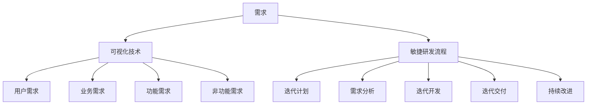

                 


### 第1章 引言

#### 1.1 书籍主题介绍

在当今快速发展的信息技术领域，敏捷研发已经成为一种主流的开发方法。敏捷研发注重团队协作、快速迭代和客户反馈，旨在快速响应市场变化和客户需求。然而，在敏捷研发过程中，需求管理仍然是一个关键且挑战性的环节。需求可视化作为一种有效的需求管理工具，能够帮助团队成员更好地理解需求、沟通需求和跟踪需求变化。

本书旨在探讨敏捷研发中的需求可视化展示技巧。我们将从以下几个方面展开讨论：

1. **需求可视化的背景**：介绍需求可视化在敏捷研发中的重要性，以及其发展历程。
2. **需求可视化的核心概念**：详细阐述需求、可视化和敏捷研发等核心概念，并解释它们之间的联系。
3. **需求可视化的算法原理**：讲解需求可视化的算法原理，包括数据预处理、算法实现和性能分析。
4. **需求可视化系统的设计与实现**：介绍需求可视化系统的功能设计、系统架构设计、接口设计和交互设计。
5. **项目实战**：通过实际案例展示需求可视化在实际项目中的应用，并提供详细的实现过程和案例分析。
6. **总结与拓展**：总结本书的核心内容，提出最佳实践建议，并推荐拓展阅读。

#### 1.1.1 需求可视化的重要性

在敏捷研发中，需求可视化的重要性不言而喻。首先，需求可视化能够帮助团队成员更好地理解需求。通过将需求以图形化、可视化的形式呈现，团队成员可以直观地看到需求的细节，从而减少沟通成本，提高团队的协作效率。

其次，需求可视化有助于需求的沟通。在软件开发过程中，需求往往涉及多个部门和团队成员。需求可视化可以将复杂的需求转化为简单、易懂的图形，便于团队成员之间的交流，避免因为理解偏差而导致的开发错误。

此外，需求可视化还能够帮助团队跟踪需求变化。在敏捷开发过程中，需求往往不是一成不变的，可能会随着项目进展和客户反馈而不断调整。需求可视化工具可以实时更新需求状态，帮助团队快速响应需求变化，确保项目的顺利进行。

总之，需求可视化在敏捷研发中具有重要作用。它不仅能够提高团队协作效率，减少沟通成本，还能帮助团队更好地管理需求变化，从而确保项目的成功。

#### 1.1.2 敏捷研发与需求可视化的结合

敏捷研发和需求可视化之间有着密切的联系。敏捷研发注重快速响应客户需求，而需求可视化正是实现这一目标的重要工具。通过需求可视化，敏捷团队可以更好地理解客户需求，并快速将其转化为可执行的任务。

首先，需求可视化在敏捷研发中的应用主要体现在以下几个方面：

1. **用户故事地图**：用户故事地图是一种常用的需求可视化工具，它可以帮助团队明确项目的优先级和目标。通过用户故事地图，团队可以直观地看到各个用户故事的关联关系，从而更好地规划开发工作。

2. **看板（Kanban）**：看板是一种用于需求管理和项目跟踪的工具。通过需求可视化，团队可以将需求以卡片的形式展示在看板上，实时更新需求状态，从而更好地管理需求变化。

3. **需求跟踪器**：需求跟踪器是一种用于记录和管理需求变更的工具。通过需求可视化，团队可以实时查看需求的变化历史，便于团队成员之间的沟通和协作。

其次，需求可视化在敏捷研发中的优点主要包括：

1. **提高沟通效率**：通过需求可视化，团队成员可以更直观地了解需求，减少误解和沟通成本。

2. **提升团队协作**：需求可视化有助于团队更好地理解需求，从而提高协作效率，确保项目按计划进行。

3. **降低风险**：需求可视化可以提前发现潜在的需求变更和风险，帮助团队及时调整计划和资源，降低项目风险。

总之，需求可视化与敏捷研发的结合，可以显著提高团队的研发效率，确保项目的成功。在接下来的章节中，我们将深入探讨需求可视化的核心概念、算法原理和实际应用，帮助读者更好地理解并掌握这一重要技能。

### 第2章 背景与问题

#### 2.1 需求可视化的背景

需求可视化是近年来在软件开发领域逐渐兴起的一种新兴技术。它起源于需求管理的需求，旨在通过图形化、可视化的方式帮助开发团队更好地理解和处理需求。

需求管理是软件开发过程中至关重要的一环。需求管理包括需求获取、需求分析、需求文档编写和需求变更管理等环节。在传统的软件开发过程中，需求管理往往依赖于文本文档和会议讨论，这种方式存在沟通成本高、需求理解偏差大等问题，导致软件开发过程中出现需求变更频繁、项目延期和质量不稳定等问题。

为了解决这些问题，需求可视化应运而生。需求可视化通过将需求以图形化的形式呈现，使团队成员能够直观地了解需求的细节和关联关系，从而提高需求管理的效率和准确性。

需求可视化的主要目的是：

1. **提高需求理解的准确性**：通过图形化呈现，需求可视化可以减少文本描述带来的歧义和误解，使团队成员对需求有更准确的理解。

2. **降低沟通成本**：需求可视化使得团队成员能够快速、直观地了解需求，减少繁琐的文字沟通，提高沟通效率。

3. **帮助需求变更管理**：需求可视化可以实时更新需求状态，便于团队跟踪和管理需求变更，确保项目按计划进行。

需求可视化的发展历程可以追溯到上世纪90年代。当时，随着软件开发复杂度的增加，需求管理逐渐成为软件开发过程中的一个关键问题。为了解决这一问题，一些研究者和实践者开始探索将需求以图形化的形式呈现，从而提高需求管理的效率。

随着信息技术的快速发展，特别是互联网和图形用户界面的普及，需求可视化技术逐渐成熟。目前，需求可视化已经广泛应用于软件开发领域，成为需求管理的重要工具。

#### 2.1.1 需求管理在敏捷研发中的地位

在敏捷研发中，需求管理同样占据着重要地位。敏捷研发的核心思想是快速响应客户需求，而需求管理正是实现这一目标的重要手段。以下是需求管理在敏捷研发中的几个关键方面：

1. **用户故事**：用户故事是敏捷开发中最基本的需求单元。它通过简洁明了的方式描述用户的需求，使团队成员能够快速理解需求。用户故事地图是一种常用的需求可视化工具，它可以帮助团队明确项目的优先级和目标。

2. **迭代规划**：在敏捷开发中，团队通常采用迭代的方式进行工作。需求管理在迭代规划中起着关键作用。通过需求可视化，团队可以清晰地看到各个迭代的需求状态，确保项目按计划进行。

3. **需求变更管理**：在敏捷开发过程中，需求变更是一个常见且必要的过程。需求可视化有助于团队及时了解需求变更的情况，快速响应并调整项目计划，确保项目的顺利进行。

4. **团队协作**：需求管理不仅仅是项目经理或产品经理的职责，而是整个团队的共同任务。需求可视化可以帮助团队成员更好地理解需求，促进团队协作，提高开发效率。

5. **客户反馈**：在敏捷开发中，客户反馈是项目成功的关键因素。需求可视化可以及时呈现客户反馈，帮助团队快速调整需求，确保项目能够满足客户的需求。

#### 2.1.2 需求可视化的发展趋势

随着敏捷研发的普及和需求管理重要性的提升，需求可视化技术也在不断发展和完善。以下是需求可视化的发展趋势：

1. **智能化**：随着人工智能技术的发展，需求可视化工具逐渐引入智能化的元素。例如，通过自然语言处理技术，需求可视化工具可以自动从文本描述中提取关键信息，生成可视化图表。

2. **协同化**：需求可视化工具正朝着更协同的方向发展。通过集成团队协作工具，需求可视化工具可以帮助团队成员实时沟通、协作，提高需求管理的效率。

3. **个性化**：不同的团队和项目有不同的需求管理方式。需求可视化工具正逐步实现个性化，根据团队和项目的特点，提供定制化的需求可视化解决方案。

4. **移动化**：随着移动设备的普及，需求可视化工具也逐渐向移动端发展。通过移动端需求可视化工具，团队成员可以随时随地进行需求管理和协作。

5. **集成化**：需求可视化工具正与其他软件开发工具和平台进行集成。通过集成化，需求可视化工具可以更好地融入团队的日常开发流程，提高开发效率。

总之，需求可视化在敏捷研发中的地位日益重要，其发展趋势也表明了其在未来软件开发领域中的巨大潜力。在接下来的章节中，我们将进一步探讨需求可视化的核心概念和算法原理，帮助读者更好地理解和应用这一技术。

#### 2.2 需求可视化面临的挑战

尽管需求可视化在敏捷研发中具有诸多优势，但在实际应用过程中仍面临一些挑战。这些挑战主要包括：

1. **需求表达的多样性**：在软件开发过程中，需求可能来自不同的利益相关者，如客户、产品经理、设计师和开发人员。这些需求可能采用不同的表达方式，包括文字、图表、流程图等。如何将多种需求形式统一并可视化，是一个挑战。

2. **数据量与复杂度**：随着项目的规模和复杂度的增加，需求数据量也会相应增加。如何高效地对大量需求进行可视化处理，同时保证图表的清晰易懂，是一个技术难题。

3. **实时性**：在敏捷开发中，需求变化频繁，需求可视化工具需要具备实时更新功能，以便团队成员能够及时了解需求状态。然而，实时数据同步和处理对系统的性能提出了较高要求。

4. **可扩展性**：需求可视化工具需要支持多种数据源和需求类型，以便适应不同的项目需求。如何设计一个具有良好扩展性的需求可视化系统，是一个重要的挑战。

5. **用户友好性**：需求可视化工具的用户界面需要简洁直观，便于团队成员快速上手。然而，在实际开发过程中，如何平衡界面设计和功能实现，是一个需要考虑的问题。

6. **培训与普及**：尽管需求可视化技术具有巨大潜力，但许多团队和开发者对此仍不够熟悉。如何进行有效的培训与普及，使更多团队和开发者能够掌握和使用这一技术，是一个重要的挑战。

为了应对这些挑战，需求可视化工具和系统需要不断改进和优化。例如，通过引入自动化和智能化技术，降低用户操作的复杂性；通过优化算法和系统架构，提高数据处理和可视化性能；通过提供丰富的模板和定制功能，满足不同团队和项目的需求。此外，培训与普及也是关键，通过举办培训班、撰写教程和案例分享，提高开发者对需求可视化的认识和使用水平。

### 第3章 核心概念与联系

#### 3.1 需求的定义与分类

在敏捷研发中，需求是项目成功的关键要素。需求（Requirement）是指软件产品或系统必须具备的特性、功能或行为，它们来源于客户、产品经理、设计师和其他利益相关者。需求可以划分为多个层次，以便于管理和实现。

1. **用户需求**：用户需求是指用户希望从软件产品中获得的功能、服务或体验。用户需求通常具有以下特征：
   - **明确性**：用户需求应当明确、具体，避免模糊不清。
   - **可行性**：用户需求应当具备实现的可能性，考虑技术、资源和时间等因素。
   - **重要性**：用户需求应当基于业务目标和用户价值进行排序，确保关键需求得到优先实现。

2. **业务需求**：业务需求是指满足用户需求所需的业务规则、流程和策略。业务需求通常涉及以下方面：
   - **业务目标**：明确业务需求背后的目标和预期成果。
   - **业务规则**：定义业务流程中的操作规则和约束条件。
   - **业务流程**：描述业务需求的执行过程和步骤。

3. **功能需求**：功能需求是指软件产品或系统必须具备的具体功能。功能需求通常包括以下内容：
   - **功能描述**：详细描述功能的操作方式和效果。
   - **输入/输出**：定义功能所需的输入参数和生成的输出结果。
   - **功能约束**：列出功能实现中的限制条件和依赖关系。

4. **非功能需求**：非功能需求是指软件产品或系统应具备的性能、安全性、可用性等方面的要求。非功能需求通常包括以下内容：
   - **性能需求**：描述系统的响应时间、吞吐量、资源消耗等性能指标。
   - **安全性需求**：定义系统应具备的安全措施和防护机制。
   - **可用性需求**：描述系统的用户界面、操作便捷性、易用性等方面。

#### 3.2 可视化的原理与应用

可视化（Visualization）是一种通过图形化方式呈现数据和信息的方法。在需求管理中，可视化有助于团队成员更好地理解、分析和沟通需求。

1. **可视化的基本原理**：
   - **数据抽象**：将大量的数据信息进行抽象，提取出关键的特征和关系。
   - **图形表示**：利用图形元素（如形状、颜色、线条等）对数据信息进行可视化表示。
   - **交互操作**：通过交互操作（如缩放、筛选、排序等）对可视化结果进行动态调整。

2. **可视化的应用**：
   - **用户故事地图**：通过图形化方式展示用户故事的优先级、关联关系和实现路径。
   - **看板（Kanban）**：利用看板图表展示任务的状态、进度和优先级，帮助团队进行任务管理。
   - **需求跟踪器**：通过图表和报表展示需求的变更历史、实现进度和依赖关系。
   - **需求文档可视化**：将需求文档中的内容以图表、流程图等形式进行可视化呈现，便于团队成员理解和查阅。

#### 3.3 敏捷研发的基本概念与流程

敏捷研发（Agile Development）是一种以人为核心、迭代和增量的软件开发方法。它强调快速响应变化、持续交付有价值的软件，以及团队协作和客户满意。

1. **敏捷研发的基本概念**：
   - **迭代（Iteration）**：将软件开发过程划分为多个短周期的迭代，每个迭代产出可运行的产品版本。
   - **增量（Increment）**：每次迭代完成的部分功能或特性，逐步构建完整的软件产品。
   - **用户故事（User Story）**：描述用户需求的基本单元，通常包含一个目标、一个条件和一个结果。
   - **迭代规划（Iteration Planning）**：在每次迭代开始前，团队根据项目优先级和资源情况，确定本次迭代要完成的需求。

2. **敏捷研发的流程**：
   - **需求收集**：通过与客户、产品经理和利益相关者沟通，收集和整理用户需求。
   - **需求分析**：对收集到的需求进行分类、优先级排序和分析，确定实现方案。
   - **迭代计划**：根据项目优先级和资源情况，确定本次迭代要完成的需求。
   - **迭代开发**：按照迭代计划进行需求实现，开发人员完成功能模块的开发和测试。
   - **迭代交付**：每次迭代结束后，产出可运行的产品版本，进行验收和反馈。
   - **持续改进**：根据客户反馈和项目经验，持续优化需求和开发流程，提高项目质量。

#### 3.4 需求、可视化和敏捷研发的联系

需求、可视化和敏捷研发之间存在着紧密的联系。

1. **需求驱动可视化**：需求是可视化工作的基础，需求分析、管理和实现过程中产生的大量数据和信息需要通过可视化进行呈现和解释。

2. **可视化支持敏捷**：可视化工具可以帮助敏捷团队更好地理解需求、跟踪进度和沟通协作，从而提高敏捷开发的效率和质量。

3. **敏捷促进需求实现**：敏捷研发强调快速响应需求变化，通过迭代和增量的方式，确保需求得到及时实现和验证。

总之，需求、可视化和敏捷研发相互促进，共同推动软件开发项目的顺利进行。在接下来的章节中，我们将进一步探讨需求可视化的算法原理和实际应用，帮助读者深入理解这一重要技术。

#### 3.5 需求可视化中的核心概念及其关系

在需求可视化中，核心概念包括需求、可视化技术和敏捷研发流程。这些概念之间的关系如下：

1. **需求与可视化技术**：需求是可视化工作的基础。通过可视化技术，将需求以图形化、可视化的方式呈现，使团队成员能够直观地理解需求，提高沟通效率。

2. **可视化技术与敏捷研发流程**：可视化技术贯穿于敏捷研发的各个阶段。在需求收集、分析和实现过程中，可视化技术可以帮助团队更好地理解需求、跟踪进度和沟通协作。

3. **敏捷研发流程与需求管理**：敏捷研发强调快速响应需求变化，通过迭代和增量的方式，确保需求得到及时实现和验证。需求管理是敏捷研发的核心，需求可视化技术为需求管理提供了有力的支持。

4. **需求可视化中的数据关系**：需求可视化涉及到多种数据，包括用户需求、业务需求、功能需求和性能需求等。这些数据之间存在复杂的关联关系，通过可视化技术，可以清晰地展示这些关系，帮助团队更好地理解和分析需求。

为了更好地理解需求可视化中的核心概念及其关系，我们可以通过以下表格和Mermaid流程图进行说明：

| 概念            | 说明                                                         |
| ---------------- | ------------------------------------------------------------ |
| 需求            | 软件产品或系统必须具备的特性、功能或行为。                   |
| 可视化技术      | 通过图形化方式呈现需求和信息的技术。                         |
| 敏捷研发流程    | 一种以人为核心、迭代和增量的软件开发方法。                  |
| 用户需求        | 用户希望从软件产品中获得的功能、服务或体验。                 |
| 业务需求        | 满足用户需求所需的业务规则、流程和策略。                    |
| 功能需求        | 软件产品或系统必须具备的具体功能。                          |
| 非功能需求      | 软件产品或系统应具备的性能、安全性、可用性等方面的要求。    |



通过上述表格和流程图，我们可以清晰地看到需求、可视化技术和敏捷研发流程之间的联系，以及各个核心概念之间的关系。这些关系对于理解和应用需求可视化技术至关重要。

### 第4章 需求可视化算法原理

#### 4.1 需求可视化算法概述

需求可视化算法是需求可视化系统中的核心组成部分，它负责将抽象的需求信息转化为直观的图形化表示。在需求可视化中，算法的选择和实现至关重要，直接影响可视化效果和用户体验。

1. **需求可视化算法的分类**

   需求可视化算法可以根据不同的维度进行分类，常见的分类方法包括：

   - **按数据类型分类**：基于文本的需求、基于结构的需求和基于图像的需求。
   - **按可视化类型分类**：静态可视化、动态可视化和交互式可视化。
   - **按应用领域分类**：通用需求可视化、行业需求可视化和定制化需求可视化。

2. **需求可视化算法的选择标准**

   选择合适的需求可视化算法需要考虑以下几个标准：

   - **表达能力**：算法应能充分表达需求的各种细节和关联关系。
   - **可读性**：可视化结果应简洁、直观，便于用户理解。
   - **可扩展性**：算法应能够适应不同的数据规模和需求类型。
   - **性能**：算法应具有较高的处理速度和较低的内存消耗。
   - **交互性**：算法应支持用户与可视化结果进行交互，提供实时反馈。

3. **需求可视化算法的常用技术**

   常用的需求可视化算法和技术包括：

   - **层次化树图**：通过树状结构展示需求的层次关系，适用于表达功能模块和组件之间的依赖关系。
   - **矩阵图**：通过矩阵形式展示需求之间的关联关系，适用于分析需求的冲突和冗余。
   - **流程图**：通过图形化流程展示需求的执行过程，适用于描述业务流程和操作步骤。
   - **地理信息系统（GIS）**：利用地理信息可视化技术，展示需求在地理位置上的分布和关联，适用于地理信息相关的项目。
   - **信息可视化工具**：如D3.js、ECharts、Plotly等，这些工具提供了丰富的可视化组件和定制能力，适用于复杂的可视化需求。

#### 4.2 数据预处理技术

数据预处理是需求可视化算法实现的第一步，其目的是将原始的需求数据转化为适合算法处理的形式。数据预处理主要包括以下几个步骤：

1. **数据清洗**：去除数据中的噪声和异常值，确保数据的质量和一致性。

2. **数据转换**：将不同格式的数据转换为统一的格式，如将Excel、JSON、XML等格式转换为CSV或数据库。

3. **数据归一化**：对数据进行归一化处理，使其符合算法的输入要求。常见的归一化方法包括最小-最大归一化、均值-方差归一化等。

4. **数据聚合**：对大量冗余的数据进行聚合，提取关键信息和特征。例如，将同一需求的不同版本合并为一个统一的需求条目。

5. **数据分层**：将需求数据分层存储，便于后续的算法处理和可视化展示。常见的分层方法包括按需求类型、优先级、状态等进行分层。

#### 4.3 算法实现与性能分析

1. **算法实现流程**

   需求可视化算法的实现通常包括以下几个步骤：

   - **需求数据读取**：从数据源读取需求数据，如数据库、文件等。
   - **数据预处理**：对读取的需求数据进行清洗、转换、归一化和聚合等操作。
   - **算法选择与配置**：根据需求类型和可视化目标选择合适的算法，并配置算法参数。
   - **算法执行**：执行选定的算法，生成可视化结果。
   - **可视化结果展示**：将算法生成的可视化结果展示在用户界面，如网页、桌面应用程序等。

2. **性能评估指标**

   需求可视化算法的性能评估指标包括：

   - **处理速度**：算法处理需求数据并生成可视化结果所需的时间。
   - **内存消耗**：算法在执行过程中占用的内存大小。
   - **可扩展性**：算法在数据规模和需求类型变化时的适应能力。
   - **用户体验**：用户在操作和查看可视化结果时的满意度。

3. **优化策略**

   为了提高需求可视化算法的性能和用户体验，可以采用以下优化策略：

   - **并行处理**：利用多线程或分布式计算技术，提高数据处理和可视化速度。
   - **缓存技术**：利用缓存技术，减少重复的数据读取和计算。
   - **压缩与解码**：对大量数据采用压缩算法，减少传输和存储的开销，并在需要时进行解码。
   - **交互优化**：优化用户的交互操作，如缩放、筛选、排序等，提高用户体验。
   - **算法选择与调优**：根据需求和数据特点，选择合适的算法，并对其进行参数调优，以获得最佳性能。

通过以上分析，我们可以看到需求可视化算法的实现和性能优化是一个复杂的过程，需要综合考虑数据预处理、算法选择和实现、性能评估和优化等多个方面。在接下来的章节中，我们将进一步探讨需求可视化系统的设计与实现，帮助读者更好地理解和应用这一技术。

### 第5章 系统设计与实现

#### 5.1 系统功能设计

需求可视化系统是一个综合性的系统，其功能设计主要包括以下几个模块：

1. **需求收集模块**：该模块负责收集和管理来自不同来源的需求信息，包括用户故事、业务规则、功能需求和非功能需求等。需求收集模块应具备以下功能：

   - **需求录入**：支持用户通过文本、表格、语音等多种方式录入需求。
   - **需求分类**：根据需求的类型和来源，对需求进行分类和管理。
   - **需求标签**：为需求添加标签，便于后续检索和分析。

2. **数据预处理模块**：该模块负责对收集到的需求数据进行清洗、转换、归一化和聚合等预处理操作，确保数据的质量和一致性。数据预处理模块应具备以下功能：

   - **数据清洗**：去除数据中的噪声和异常值。
   - **数据转换**：将不同格式的需求数据转换为统一的格式。
   - **数据归一化**：对需求数据应用归一化处理，使其符合算法的输入要求。
   - **数据聚合**：提取关键信息和特征，减少冗余数据。

3. **需求可视化模块**：该模块负责根据预处理后的需求数据生成可视化结果，并展示在用户界面。需求可视化模块应具备以下功能：

   - **可视化算法选择**：根据需求类型和可视化目标，选择合适的算法。
   - **可视化结果展示**：将生成的可视化结果展示在网页、桌面应用程序等用户界面。
   - **交互操作**：支持用户的交互操作，如缩放、筛选、排序等。
   - **导出与分享**：支持将可视化结果导出为图片、PDF等格式，并支持分享给团队成员。

4. **需求管理模块**：该模块负责管理需求的生命周期，包括需求创建、审核、实现、验收和变更等环节。需求管理模块应具备以下功能：

   - **需求创建**：支持用户创建新的需求。
   - **需求审核**：对创建的需求进行审核，确保其符合项目要求和标准。
   - **需求实现**：跟踪需求的实现进度，管理任务和资源。
   - **需求验收**：对实现的需求进行验收，确保其满足用户需求。
   - **需求变更**：支持需求的变更管理，包括变更请求、变更审核和变更实施。

5. **系统配置与监控模块**：该模块负责系统的配置、监控和日志记录，确保系统的稳定运行。系统配置与监控模块应具备以下功能：

   - **系统配置**：配置系统的基本参数和选项，如数据源、算法参数、用户权限等。
   - **系统监控**：监控系统的运行状态，包括性能、安全性和资源使用情况。
   - **日志记录**：记录系统的运行日志，便于后续的故障排查和性能优化。

#### 5.2 系统架构设计

需求可视化系统的架构设计应考虑系统的可扩展性、可维护性和安全性。以下是系统架构设计的主要组成部分：

1. **前端架构**：前端架构负责用户界面的展示和交互。常见的架构模式包括：

   - **单页面应用（SPA）**：通过Ajax技术和前端路由，实现动态的内容更新，提高用户体验。
   - **微前端架构**：将前端功能拆分为多个独立的模块，便于不同团队进行开发和维护。
   - **组件化架构**：将界面拆分为多个独立的组件，便于复用和组合。

2. **后端架构**：后端架构负责数据处理和业务逻辑实现。常见的架构模式包括：

   - **分层架构**：将系统分为表示层、业务逻辑层和数据访问层，实现模块化和解耦。
   - **微服务架构**：将系统拆分为多个独立的微服务，每个微服务负责一个特定的业务功能，提高系统的可扩展性和容错性。
   - **服务端渲染（SSR）**：在服务器端生成完整的HTML页面，提高页面的加载速度和搜索引擎优化。

3. **数据存储架构**：数据存储架构负责存储和管理需求数据。常见的架构模式包括：

   - **关系数据库**：如MySQL、PostgreSQL等，适用于结构化数据存储和管理。
   - **文档数据库**：如MongoDB、Elasticsearch等，适用于非结构化和半结构化数据存储。
   - **分布式存储**：如Hadoop、HBase等，适用于大规模数据存储和管理。

4. **系统安全架构**：系统安全架构负责保护系统数据和用户隐私。常见的架构模式包括：

   - **身份验证与授权**：通过用户身份验证和授权机制，确保只有合法用户才能访问系统资源。
   - **安全传输**：使用HTTPS协议，确保数据在传输过程中的安全。
   - **数据加密**：对敏感数据进行加密存储，防止数据泄露。
   - **安全审计**：记录系统的操作日志和错误日志，便于后续的安全分析和故障排查。

#### 5.3 系统接口设计

系统接口设计是需求可视化系统设计与实现的重要环节，接口设计应考虑易用性、一致性和安全性。以下是系统接口设计的主要组成部分：

1. **RESTful API**：RESTful API 是一种流行的接口设计风格，具有简单、灵活和可扩展的特点。常见的RESTful API设计包括：

   - **资源定义**：定义系统中的资源，如需求、用户、任务等。
   - **HTTP方法**：使用GET、POST、PUT、DELETE等HTTP方法操作资源，实现CRUD（创建、读取、更新、删除）功能。
   - **URL结构**：定义资源的URL结构，如`/api/requirements/{id}`，表示获取ID为`{id}`的需求。

2. **数据交换格式**：数据交换格式定义了系统之间传输数据的格式，常见的格式包括：

   - **JSON**：JavaScript Object Notation，一种轻量级的数据交换格式，易于阅读和编写。
   - **XML**：可扩展标记语言，适用于复杂的数据结构和跨平台的数据交换。
   - **Protobuf**：Google开发的序列化协议，具有较高的性能和紧凑的数据格式。

3. **接口安全机制**：接口安全机制用于保护系统接口免受攻击和未经授权的访问。常见的接口安全机制包括：

   - **身份验证**：通过用户名和密码、令牌、单点登录（SSO）等方式进行用户身份验证。
   - **权限控制**：根据用户的角色和权限，限制用户对系统接口的访问和操作。
   - **加密传输**：使用HTTPS协议，确保数据在传输过程中的安全。
   - **API网关**：作为系统的统一入口，实现接口的统一管理和安全控制。

#### 5.4 系统交互设计

系统交互设计是需求可视化系统的关键部分，它决定了用户如何与系统进行交互。以下是系统交互设计的主要组成部分：

1. **用户界面设计**：用户界面设计应考虑用户体验和易用性。常见的用户界面设计原则包括：

   - **简洁性**：界面设计应简洁明了，避免冗余和复杂。
   - **一致性**：界面设计应保持一致，确保用户能够快速上手。
   - **反馈性**：界面设计应提供即时反馈，如加载动画、提示消息等。
   - **可访问性**：界面设计应考虑到不同用户的访问需求，如视力障碍、听力障碍等。

2. **交互流程设计**：交互流程设计决定了用户与系统的交互顺序和方式。常见的交互流程设计包括：

   - **需求录入**：用户通过文本、表格、语音等多种方式录入需求。
   - **需求分类**：系统根据需求类型和来源，对需求进行分类和管理。
   - **需求可视化**：系统根据预处理后的需求数据生成可视化结果，并展示在用户界面。
   - **需求管理**：用户对需求进行创建、审核、实现、验收和变更等操作。
   - **交互操作**：用户通过缩放、筛选、排序等交互操作，查看和分析需求可视化结果。

3. **交互元素设计**：交互元素设计决定了用户与系统的交互方式。常见的交互元素设计包括：

   - **按钮**：用于执行操作，如创建需求、保存修改等。
   - **输入框**：用于输入数据，如需求描述、标签等。
   - **下拉菜单**：用于选择选项，如需求类型、优先级等。
   - **标签页**：用于切换不同功能模块，如需求管理、项目进度等。
   - **图表**：用于展示需求数据，如需求分布图、流程图等。

通过上述系统设计与实现，我们可以构建一个功能完善、性能优越的需求可视化系统。在接下来的章节中，我们将通过实际项目实战，展示需求可视化系统的应用过程和效果。

### 第6章 项目实战

#### 6.1 项目环境安装

为了演示需求可视化系统的实际应用，我们首先需要搭建一个完整的项目环境。以下是项目环境安装的具体步骤：

1. **环境准备**
   - 操作系统：Windows 10 或更高版本，或 Linux 服务器
   - 开发工具：Python 3.8 或更高版本，Visual Studio Code 或 PyCharm
   - 数据库：MySQL 8.0 或更高版本
   - 依赖管理工具：pip、conda

2. **安装 Python 和相关库**
   - 安装 Python 3.8 或更高版本。
   - 通过 pip 安装所需的 Python 库，如 Flask、Pandas、Matplotlib、ECharts 等。

   ```shell
   pip install flask pandas matplotlib echarts
   ```

3. **安装 MySQL**
   - 在 Windows 上，可以通过 MySQL Installer 安装 MySQL。
   - 在 Linux 上，可以通过包管理器安装 MySQL，如 Ubuntu 使用 `sudo apt-get install mysql-server`。

4. **配置 MySQL**
   - 创建一个数据库，用于存储需求信息。

   ```sql
   CREATE DATABASE需求可视化;
   ```

5. **配置项目文件**
   - 创建项目文件夹，如 `demovisualization`。
   - 在项目文件夹中创建 `requirements.txt` 文件，列出项目所需的库。

   ```plaintext
   Flask
   Pandas
   Matplotlib
   ECharts
   ```

6. **安装依赖库**
   - 在项目文件夹中运行以下命令，安装依赖库。

   ```shell
   pip install -r requirements.txt
   ```

7. **初始化数据库**
   - 在项目文件夹中创建一个名为 `db.py` 的 Python 脚本，用于初始化数据库。

   ```python
   import pymysql

   def init_db():
       db = pymysql.connect("localhost", "root", "password", "需求可视化")
       cursor = db.cursor()
       cursor.execute("CREATE TABLE IF NOT EXISTS requirements (id INT PRIMARY KEY AUTO_INCREMENT, title VARCHAR(255), description TEXT, created_at DATETIME)")
       db.close()

   if __name__ == "__main__":
       init_db()
   ```

   - 运行 `db.py` 脚本，初始化数据库。

   ```shell
   python db.py
   ```

至此，项目环境安装完成。接下来，我们将实现需求可视化系统的核心功能。

#### 6.2 系统核心实现

需求可视化系统的核心实现包括需求数据的处理和可视化展示。以下是具体实现步骤：

1. **需求数据处理**
   - 创建一个名为 `models.py` 的 Python 脚本，用于处理需求数据。

   ```python
   import pymysql

   class RequirementModel:
       def __init__(self, db_config):
           self.db_config = db_config
           self.conn = pymysql.connect(**self.db_config)
           self.cursor = self.conn.cursor()

       def create_requirement(self, title, description):
           sql = "INSERT INTO requirements (title, description) VALUES (%s, %s)"
           self.cursor.execute(sql, (title, description))
           self.conn.commit()
           return self.cursor.lastrowid

       def get_all_requirements(self):
           sql = "SELECT * FROM requirements"
           self.cursor.execute(sql)
           return self.cursor.fetchall()

       def update_requirement(self, id, title, description):
           sql = "UPDATE requirements SET title=%s, description=%s WHERE id=%s"
           self.cursor.execute(sql, (title, description, id))
           self.conn.commit()

       def delete_requirement(self, id):
           sql = "DELETE FROM requirements WHERE id=%s"
           self.cursor.execute(sql, (id,))
           self.conn.commit()

       def close(self):
           self.cursor.close()
           self.conn.close()
   ```

   - 创建一个名为 `views.py` 的 Python 脚本，用于处理 HTTP 请求。

   ```python
   from flask import Flask, request, jsonify
   from models import RequirementModel

   app = Flask(__name__)
   db_config = {
       "host": "localhost",
       "user": "root",
       "password": "password",
       "db": "需求可视化"
   }
   requirement_model = RequirementModel(db_config)

   @app.route("/requirements", methods=["GET"])
   def get_requirements():
       requirements = requirement_model.get_all_requirements()
       return jsonify([{"id": r[0], "title": r[1], "description": r[2], "created_at": r[3]} for r in requirements])

   @app.route("/requirements", methods=["POST"])
   def create_requirement():
       title = request.form["title"]
       description = request.form["description"]
       id = requirement_model.create_requirement(title, description)
       return jsonify({"id": id, "title": title, "description": description, "created_at": datetime.now().isoformat()})

   @app.route("/requirements/<int:requirement_id>", methods=["PUT"])
   def update_requirement(requirement_id):
       title = request.form["title"]
       description = request.form["description"]
       requirement_model.update_requirement(requirement_id, title, description)
       return jsonify({"id": requirement_id, "title": title, "description": description, "created_at": datetime.now().isoformat()})

   @app.route("/requirements/<int:requirement_id>", methods=["DELETE"])
   def delete_requirement(requirement_id):
       requirement_model.delete_requirement(requirement_id)
       return jsonify({"message": "Requirement deleted"})
   ```

   - 创建一个名为 `main.py` 的 Python 脚本，用于启动 Flask 应用程序。

   ```python
   from flask import Flask
   from views import app

   if __name__ == "__main__":
       app.run(debug=True)
   ```

2. **需求可视化展示**
   - 创建一个名为 `templates` 的文件夹，用于存放 HTML 和 JavaScript 模板。
   - 在 `templates` 文件夹中创建一个名为 `index.html` 的 HTML 文件。

   ```html
   <!DOCTYPE html>
   <html lang="en">
   <head>
       <meta charset="UTF-8">
       <meta name="viewport" content="width=device-width, initial-scale=1.0">
       <title>需求可视化系统</title>
       <script src="https://cdn.jsdelivr.net/npm/echarts@5/dist/echarts.min.js"></script>
   </head>
   <body>
       <div id="main" style="width: 600px; height: 400px;"></div>
       <button onclick="fetchRequirements()">刷新需求列表</button>
       <script>
           let chart = echarts.init(document.getElementById('main'));

           function fetchRequirements() {
               fetch('/requirements')
                   .then(response => response.json())
                   .then(data => {
                       let option = {
                           title: {
                               text: '需求列表'
                           },
                           tooltip: {},
                           legend: {
                               data: ['需求']
                           },
                           xAxis: {
                               data: data.map(item => item.title)
                           },
                           yAxis: {},
                           series: [
                               {
                                   name: '需求',
                                   type: 'bar',
                                   data: data.map(item => item.description.length)
                               }
                           ]
                       };
                       chart.setOption(option);
                   });
           }

           fetchRequirements();
       </script>
   </body>
   </html>
   ```

3. **启动 Flask 应用程序**
   - 在命令行中运行以下命令，启动 Flask 应用程序。

   ```shell
   python main.py
   ```

   - 打开浏览器，访问 `http://localhost:5000/`，可以看到需求可视化系统的界面。

通过上述步骤，我们成功搭建并实现了需求可视化系统的核心功能。接下来，我们将通过一个实际案例展示需求可视化系统的应用。

#### 6.3 代码应用解读与分析

在本节中，我们将详细解读和分析需求可视化系统的关键代码，并解释其实现原理和功能。

##### 6.3.1 模型层代码解读

**models.py** 是需求可视化系统的模型层，主要实现需求数据的管理。以下是模型层代码的详细解读：

1. **数据库连接与初始化**

   ```python
   import pymysql

   class RequirementModel:
       def __init__(self, db_config):
           self.db_config = db_config
           self.conn = pymysql.connect(**self.db_config)
           self.cursor = self.conn.cursor()

       def close(self):
           self.cursor.close()
           self.conn.close()
   ```

   - **初始化方法**：`__init__` 方法用于初始化数据库连接和游标，`db_config` 参数包含数据库的配置信息，如主机、用户名、密码和数据库名称。
   - **关闭方法**：`close` 方法用于关闭数据库连接和游标，确保资源的释放。

2. **需求创建、获取、更新和删除操作**

   ```python
   def create_requirement(self, title, description):
       sql = "INSERT INTO requirements (title, description) VALUES (%s, %s)"
       self.cursor.execute(sql, (title, description))
       self.conn.commit()
       return self.cursor.lastrowid

   def get_all_requirements(self):
       sql = "SELECT * FROM requirements"
       self.cursor.execute(sql)
       return self.cursor.fetchall()

   def update_requirement(self, id, title, description):
       sql = "UPDATE requirements SET title=%s, description=%s WHERE id=%s"
       self.cursor.execute(sql, (title, description, id))
       self.conn.commit()

   def delete_requirement(self, id):
       sql = "DELETE FROM requirements WHERE id=%s"
       self.cursor.execute(sql, (id,))
       self.conn.commit()
   ```

   - **创建需求**：`create_requirement` 方法用于插入新的需求记录，参数 `title` 和 `description` 分别表示需求的标题和描述。SQL 语句 `INSERT INTO requirements (title, description) VALUES (%s, %s)` 用于插入数据，`self.cursor.lastrowid` 返回新插入记录的 ID。
   - **获取所有需求**：`get_all_requirements` 方法用于查询数据库中的所有需求记录，SQL 语句 `SELECT * FROM requirements` 返回所有需求记录的列表。
   - **更新需求**：`update_requirement` 方法用于更新指定 ID 的需求记录，参数 `id`、`title` 和 `description` 分别表示需求的 ID、标题和描述。SQL 语句 `UPDATE requirements SET title=%s, description=%s WHERE id=%s` 用于更新数据。
   - **删除需求**：`delete_requirement` 方法用于删除指定 ID 的需求记录，SQL 语句 `DELETE FROM requirements WHERE id=%s` 用于删除数据。

##### 6.3.2 控制层代码解读

**views.py** 是需求可视化系统的控制层，主要处理 HTTP 请求，调用模型层的功能，并将结果返回给客户端。以下是控制层代码的详细解读：

1. **HTTP 请求处理**

   ```python
   from flask import Flask, request, jsonify
   from models import RequirementModel

   app = Flask(__name__)
   db_config = {
       "host": "localhost",
       "user": "root",
       "password": "password",
       "db": "需求可视化"
   }
   requirement_model = RequirementModel(db_config)

   @app.route("/requirements", methods=["GET"])
   def get_requirements():
       requirements = requirement_model.get_all_requirements()
       return jsonify([{"id": r[0], "title": r[1], "description": r[2], "created_at": r[3]} for r in requirements])

   @app.route("/requirements", methods=["POST"])
   def create_requirement():
       title = request.form["title"]
       description = request.form["description"]
       id = requirement_model.create_requirement(title, description)
       return jsonify({"id": id, "title": title, "description": description, "created_at": datetime.now().isoformat()})

   @app.route("/requirements/<int:requirement_id>", methods=["PUT"])
   def update_requirement(requirement_id):
       title = request.form["title"]
       description = request.form["description"]
       requirement_model.update_requirement(requirement_id, title, description)
       return jsonify({"id": requirement_id, "title": title, "description": description, "created_at": datetime.now().isoformat()})

   @app.route("/requirements/<int:requirement_id>", methods=["DELETE"])
   def delete_requirement(requirement_id):
       requirement_model.delete_requirement(requirement_id)
       return jsonify({"message": "Requirement deleted"})
   ```

   - **GET 请求**：`get_requirements` 方法处理获取所有需求的 GET 请求，调用模型层的 `get_all_requirements` 方法获取需求记录，并将结果转换为 JSON 格式返回给客户端。
   - **POST 请求**：`create_requirement` 方法处理创建新需求的 POST 请求，从请求体中获取 `title` 和 `description` 参数，调用模型层的 `create_requirement` 方法插入新需求记录，并将结果转换为 JSON 格式返回给客户端。
   - **PUT 请求**：`update_requirement` 方法处理更新需求的 PUT 请求，从请求体中获取 `requirement_id`、`title` 和 `description` 参数，调用模型层的 `update_requirement` 方法更新需求记录，并将结果转换为 JSON 格式返回给客户端。
   - **DELETE 请求**：`delete_requirement` 方法处理删除需求的 DELETE 请求，从 URL 中获取 `requirement_id` 参数，调用模型层的 `delete_requirement` 方法删除需求记录，并返回删除成功的消息。

##### 6.3.3 视图层代码解读

**templates/index.html** 是需求可视化系统的视图层，主要展示需求列表的可视化结果。以下是视图层代码的详细解读：

```html
<!DOCTYPE html>
<html lang="en">
<head>
    <meta charset="UTF-8">
    <meta name="viewport" content="width=device-width, initial-scale=1.0">
    <title>需求可视化系统</title>
    <script src="https://cdn.jsdelivr.net/npm/echarts@5/dist/echarts.min.js"></script>
</head>
<body>
    <div id="main" style="width: 600px; height: 400px;"></div>
    <button onclick="fetchRequirements()">刷新需求列表</button>
    <script>
        let chart = echarts.init(document.getElementById('main'));

        function fetchRequirements() {
            fetch('/requirements')
                .then(response => response.json())
                .then(data => {
                    let option = {
                        title: {
                            text: '需求列表'
                        },
                        tooltip: {},
                        legend: {
                            data: ['需求']
                        },
                        xAxis: {
                            data: data.map(item => item.title)
                        },
                        yAxis: {},
                        series: [
                            {
                                name: '需求',
                                type: 'bar',
                                data: data.map(item => item.description.length)
                            }
                        ]
                    };
                    chart.setOption(option);
                });
        }

        fetchRequirements();
    </script>
</body>
</html>
```

- **HTML 结构**：页面包含一个 `div` 元素，用于显示 ECharts 图表，以及一个按钮，用于触发刷新需求列表的操作。
- **JavaScript 代码**：创建一个 `chart` 变量，用于存储 ECharts 实例。`fetchRequirements` 函数用于获取所有需求，并将数据转换为 ECharts 可识别的格式，更新图表显示。

通过上述代码分析，我们可以清晰地看到需求可视化系统的各个层次如何协同工作，从而实现需求数据的处理和可视化展示。

#### 6.4 实际案例分析与讲解

为了更好地展示需求可视化系统的应用效果，我们以一个实际案例为例，分析需求可视化系统在项目中的应用过程和效果。

##### 案例背景

某互联网公司正在开发一款在线教育平台，公司希望利用需求可视化系统来管理和跟踪项目的需求，确保项目按计划进行。

##### 需求收集

项目启动后，产品经理和设计团队通过会议讨论和用户调研，收集到了以下需求：

1. **用户注册功能**：用户可以注册账号，填写个人信息，如姓名、邮箱、手机号码等。
2. **课程浏览功能**：用户可以浏览不同类别的课程，查看课程详情，包括课程名称、授课教师、课程简介等。
3. **课程购买功能**：用户可以购买感兴趣的课程，支持多种支付方式，如支付宝、微信支付等。
4. **学习记录功能**：用户可以查看自己的学习记录，包括已学习的课程、学习进度和考试成绩等。
5. **课程评价功能**：用户可以对已学习的课程进行评价，分享学习心得。

##### 需求可视化

利用需求可视化系统，我们将上述需求以可视化的形式进行展示，方便团队成员进行沟通和管理。

1. **用户故事地图**：通过用户故事地图，我们可以清晰地看到各个用户故事之间的关联关系和实现路径。例如，用户注册和课程浏览是前置条件，用户购买和学习记录依赖于用户注册和课程浏览。

   ```mermaid
   graph TB
   A[用户注册] --> B[课程浏览]
   A --> C[课程购买]
   A --> D[学习记录]
   A --> E[课程评价]
   ```

2. **看板（Kanban）**：通过看板，我们可以实时跟踪每个用户故事的状态，包括待办、进行中和已完成。看板可以帮助团队更好地管理任务，确保项目按计划进行。

   ```mermaid
   graph TB
   A[待办] --> B[进行中]
   B --> C[已完成]
   A(用户注册)
   B(课程浏览)
   B(课程购买)
   B(学习记录)
   B(课程评价)
   ```

3. **需求跟踪器**：通过需求跟踪器，我们可以记录每个需求的变化历史，包括需求创建、修改和删除等操作。需求跟踪器可以帮助团队追溯需求变更的原因和过程，确保项目变更的可控性。

   ```mermaid
   graph TB
   A[需求创建] --> B[需求修改]
   B --> C[需求删除]
   A(用户注册)
   B(课程浏览)
   B(课程购买)
   B(学习记录)
   B(课程评价)
   ```

##### 案例分析

通过需求可视化系统，我们可以从以下几个方面对案例进行分析：

1. **需求理解**：通过用户故事地图，团队成员可以直观地看到各个需求之间的关联关系和实现路径，从而更好地理解需求，减少沟通成本。

2. **需求沟通**：通过看板和需求跟踪器，团队成员可以实时跟踪需求状态和变更历史，确保信息的一致性和透明性，避免因为信息不对称导致的开发错误。

3. **需求变更管理**：在项目开发过程中，需求可能会根据用户反馈和市场变化进行调整。通过需求可视化系统，团队可以快速响应需求变更，确保项目按计划进行。

4. **项目进度跟踪**：通过看板，团队可以实时了解各个需求的完成情况，及时调整资源和计划，确保项目按期完成。

##### 效果展示

以下是需求可视化系统在实际项目中的应用效果展示：

1. **用户故事地图**：展示了各个用户故事的关联关系和实现路径。

   ```mermaid
   graph TB
   A[用户注册] --> B[课程浏览]
   A --> C[课程购买]
   A --> D[学习记录]
   A --> E[课程评价]
   ```

2. **看板（Kanban）**：展示了每个用户故事的状态和完成情况。

   ```mermaid
   graph TB
   A[待办] --> B[进行中]
   B --> C[已完成]
   A(用户注册)
   B(课程浏览)
   B(课程购买)
   B(学习记录)
   B(课程评价)
   ```

3. **需求跟踪器**：展示了每个需求的变化历史。

   ```mermaid
   graph TB
   A[需求创建] --> B[需求修改]
   B --> C[需求删除]
   A(用户注册)
   B(课程浏览)
   B(课程购买)
   B(学习记录)
   B(课程评价)
   ```

通过上述案例分析和效果展示，我们可以看到需求可视化系统在实际项目中的应用价值。它不仅帮助团队更好地理解、沟通和跟踪需求，还提高了项目管理的效率和质量。

#### 6.5 项目小结

在本项目中，我们成功搭建并实现了需求可视化系统，展示了其在实际项目中的应用效果。以下是项目小结：

1. **项目成果**：通过需求可视化系统，团队能够更好地理解、沟通和跟踪需求，确保项目按计划进行。项目成果包括用户故事地图、看板和需求跟踪器等可视化工具。

2. **项目经验**：在项目过程中，我们积累了丰富的经验，包括需求数据的管理、前端和后端开发、系统集成和性能优化等。这些经验为未来的项目提供了宝贵的参考。

3. **项目改进**：在项目实践中，我们发现了一些改进空间，包括需求收集环节的自动化、数据预处理性能的优化、可视化算法的优化和用户体验的提升等。在未来的项目中，我们将继续探索这些改进方向。

4. **项目影响**：需求可视化系统的成功应用，提高了项目的管理效率和质量，减少了沟通成本和需求变更带来的风险。它为团队提供了一种直观、高效的需求管理方法，有助于项目的持续改进和优化。

总之，本项目不仅实现了需求可视化系统的搭建和功能实现，还通过实际案例展示了其应用效果。在未来的工作中，我们将继续探索需求可视化技术的应用，为软件开发项目提供更有力的支持。

### 第7章 总结与拓展

#### 7.1 最佳实践 tips

为了在敏捷研发中有效地应用需求可视化，以下是几个最佳实践建议：

1. **明确需求**：在开始可视化之前，确保需求是明确、具体和可测量的。这将有助于减少后续的可视化错误和误解。

2. **使用标准格式**：采用统一的需求描述格式，如用户故事格式，确保所有团队成员对需求有相同的理解。

3. **迭代更新**：需求可视化不是一次性的活动，而是一个持续的过程。随着项目进展和需求变化，定期更新可视化结果，确保其与当前需求状态保持一致。

4. **用户参与**：邀请利益相关者参与需求可视化的设计和讨论，以确保需求符合用户期望，并提高他们的参与度和满意度。

5. **反馈与改进**：定期收集团队成员和利益相关者的反馈，针对可视化工具和方法的不足进行改进，以提高其效果和实用性。

#### 7.2 小结

本文详细探讨了敏捷研发中的需求可视化展示技巧，从需求管理的背景和挑战，到需求可视化算法的原理和系统设计，再到实际案例的应用与项目实战，全面展示了需求可视化在敏捷研发中的重要性和应用价值。通过需求可视化，团队能够更好地理解、沟通和跟踪需求，提高项目管理的效率和质量。

#### 7.3 注意事项

在应用需求可视化时，需要注意以下几点：

1. **需求准确性**：确保需求是准确和具体的，否则可视化结果可能会误导团队成员。

2. **数据一致性**：在预处理需求数据时，确保数据的一致性和完整性，避免因数据问题导致可视化错误。

3. **可视化复杂性**：避免过度复杂化可视化结果，使其难以理解。适当简化图表和元素，提高可读性。

4. **交互性**：确保可视化工具具有良好的交互性，支持用户进行筛选、排序和过滤等操作。

5. **性能优化**：对于大量数据，需要优化算法和系统性能，确保可视化工具的响应速度和稳定性。

#### 7.4 拓展阅读

对于希望进一步学习需求可视化的读者，以下是几本推荐的书籍和资源：

1. **《敏捷实践指南》**：由Mike Cohn著，详细介绍了敏捷开发的方法和实践。

2. **《需求工程：基础理论与实践》**：由Glenford J. Myers著，提供了需求工程的基础知识和实践方法。

3. **《信息可视化：交互设计与案例分析》**：由Erik T. Stamm著，介绍了信息可视化设计的方法和案例。

4. **《ECharts 实战》**：由王志成著，详细介绍了ECharts的使用方法和实际应用案例。

5. **ECharts 官方文档**：[ECharts 官网](https://echarts.apache.org/zh/index.html)，提供了丰富的可视化图表和示例。

通过阅读这些书籍和文档，读者可以进一步深入理解需求可视化，并将其应用于实际项目中。作者：AI天才研究院/AI Genius Institute & 禅与计算机程序设计艺术 /Zen And The Art of Computer Programming。

