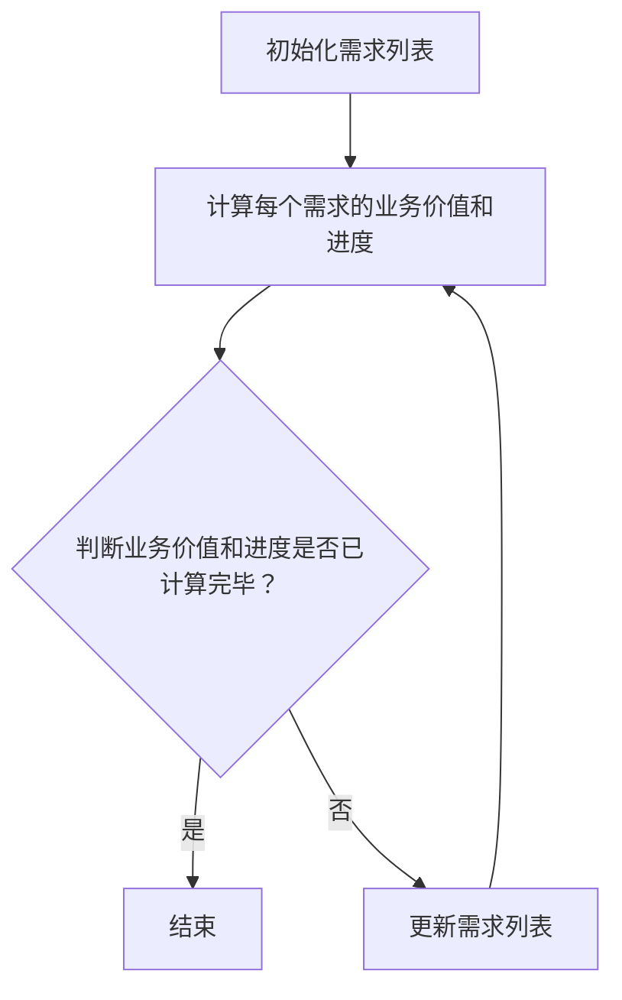
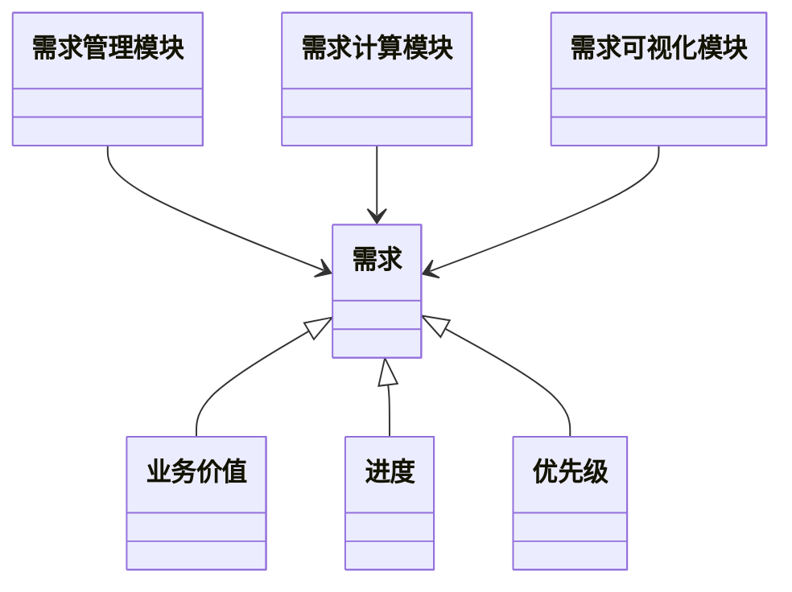
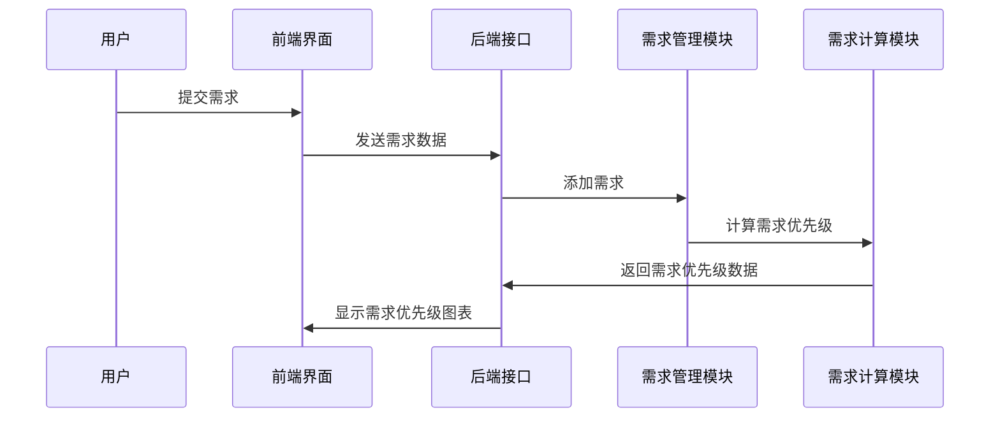
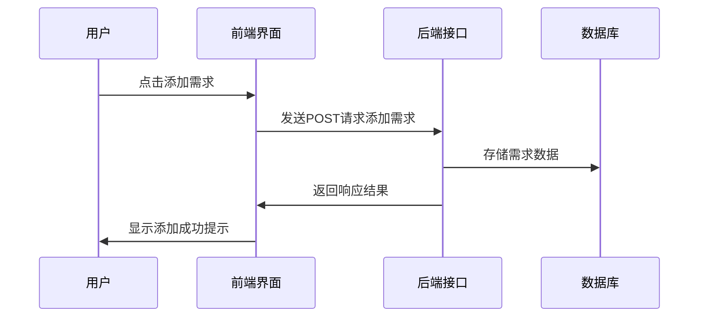
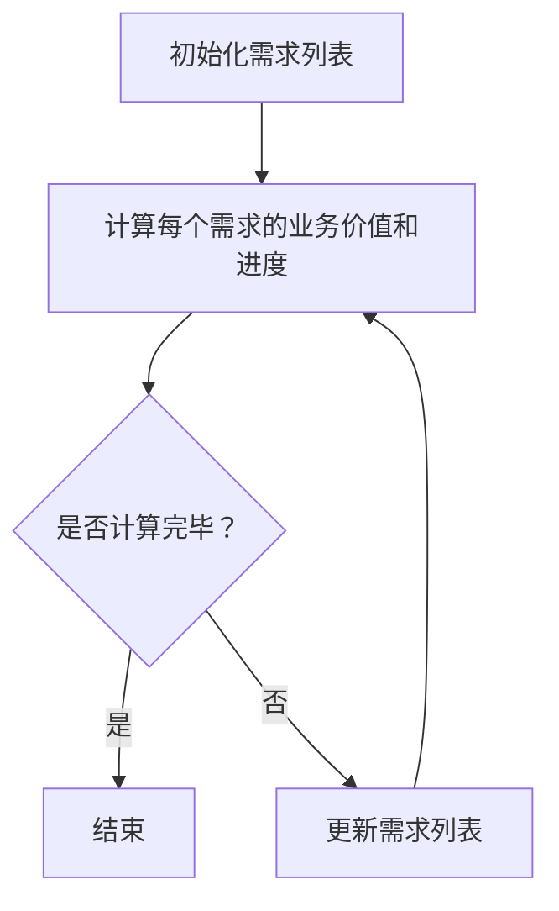
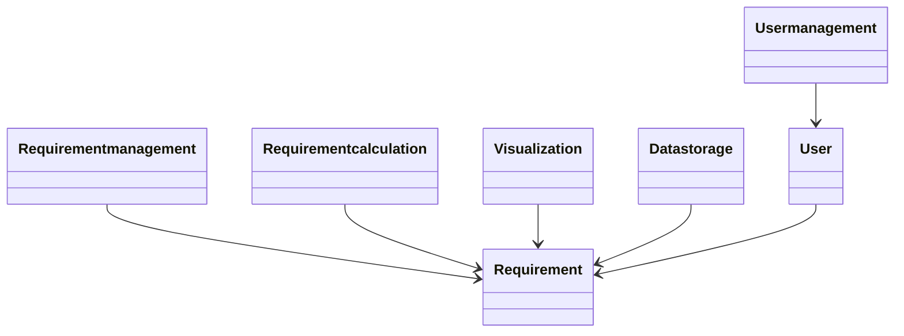
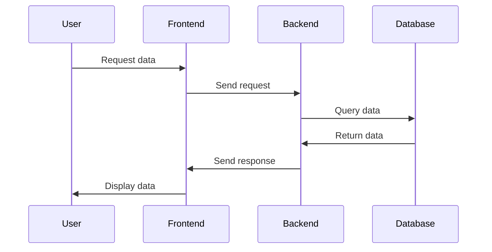
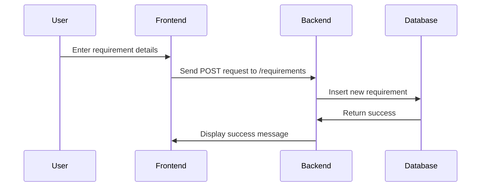

                 


# 敏捷研发模式下的需求优先级可视化工具应用

## 关键词
敏捷研发，需求优先级，可视化工具，流程图，Python代码，系统架构，项目实战

## 摘要
本文旨在探讨在敏捷研发模式下，如何通过需求优先级可视化工具的应用，提高项目管理和团队协作效率。本文首先介绍了敏捷研发模式的基本原理和需求优先级的重要性，然后详细讲解了需求优先级可视化工具的设计和实现，并通过实际项目案例展示了其应用效果。最后，本文总结了最佳实践和注意事项，为读者提供了进一步学习的资源。

## 引言

### 1.1 问题背景

随着软件项目的复杂度和规模不断扩大，敏捷研发模式逐渐成为软件开发的主流。敏捷研发强调快速迭代、持续交付和客户反馈，能够有效地适应快速变化的市场需求。然而，敏捷研发也带来了新的挑战，特别是在需求优先级管理方面。如何高效地确定需求优先级，确保关键需求得到优先处理，成为项目管理者和开发者亟待解决的问题。

需求优先级可视化工具的应用，可以帮助团队更好地理解和管理需求优先级。通过可视化的方式，团队能够直观地看到各个需求的优先级，从而做出更加合理的决策。此外，可视化工具还可以提高团队协作效率，减少沟通成本，确保项目能够按时、按质完成。

### 1.2 核心概念与联系

#### 1.2.1 需求优先级

需求优先级是指根据业务价值和项目进度，对需求进行排序的一种方式。高优先级的需求通常具有较高的业务价值，需要优先处理。需求优先级管理是敏捷研发中至关重要的一环，它决定了团队的工作方向和重点。

#### 1.2.2 敏捷研发模式

敏捷研发模式是一种以人为核心、迭代和灵活应对变化的软件开发方法。敏捷研发强调持续交付、客户反馈和团队协作，通过小步快跑的方式，不断提高软件质量和用户满意度。

#### 1.2.3 可视化工具

可视化工具是一种将数据和信息以图形、图表等形式进行展示的工具。在需求优先级管理中，可视化工具可以帮助团队直观地了解需求优先级，提高决策效率。

## 核心概念与联系

### 1.3 算法原理讲解

为了实现需求优先级可视化，我们可以采用以下算法：

#### 1.3.1 算法流程图



#### 1.3.2 Python源代码

```python
def calculate_priority的需求列表:
    # 计算每个需求的业务价值和进度
    for 需求 in 需求列表:
        需求业务价值 = 计算业务价值(需求)
        需求进度 = 计算进度(需求)
        需求优先级 = 业务价值 * 进度
        
    # 根据优先级排序
    需求列表.sort(key=lambda 需求: 需求优先级, reverse=True)
    
    # 可视化需求列表
    visualize_priority_list(需求列表)

def visualize_priority_list(需求列表):
    # 使用可视化库绘制需求列表
    # ...

# 示例
需求列表 = [
    {"名称": "需求1", "业务价值": 0.8, "进度": 0.5},
    {"名称": "需求2", "业务价值": 0.9, "进度": 0.7},
    {"名称": "需求3", "业务价值": 0.6, "进度": 0.3}
]

calculate_priority的需求列表(需求列表)
```

#### 1.3.3 数学模型和公式

需求优先级 = 业务价值 * 进度

其中，业务价值是一个0到1之间的数值，进度也是一个0到1之间的数值。通过计算每个需求的业务价值和进度，可以得到每个需求的优先级。

#### 1.3.4 举例说明

假设有两个需求：

- 需求1：业务价值为0.8，进度为0.5
- 需求2：业务价值为0.9，进度为0.7

根据公式，需求1的优先级为0.8 * 0.5 = 0.4，需求2的优先级为0.9 * 0.7 = 0.63。因此，需求2的优先级高于需求1。

## 系统分析与架构设计方案

### 1.4.1 问题场景介绍

假设某团队正在开发一款电商系统，需要在多个功能模块中确定需求优先级。为了提高开发效率和客户满意度，团队希望使用需求优先级可视化工具来管理需求。

### 1.4.2 系统功能设计

系统需要具备以下功能：

- 需求录入与管理：允许团队添加、修改和删除需求。
- 需求优先级计算：根据业务价值和进度计算需求优先级。
- 需求优先级可视化：将需求优先级以图表形式展示。

#### 1.4.2.1 领域模型类图



### 1.4.3 系统架构设计

系统采用前后端分离的架构，前端负责展示需求优先级图表，后端负责需求管理和优先级计算。

#### 1.4.3.1 系统架构图



### 1.4.4 系统接口设计和系统交互

系统接口设计采用RESTful API，允许前端通过HTTP请求访问后端接口。

#### 1.4.4.1 系统交互序列图



## 项目实战

### 1.5.1 环境安装

在开始项目之前，需要安装以下环境：

- Python 3.8 或以上版本
- Flask 框架
- matplotlib 库

### 1.5.2 系统核心实现源代码

以下是系统核心实现源代码：

```python
# 需求管理模块
class Requirement:
    def __init__(self, name, business_value, progress):
        self.name = name
        self.business_value = business_value
        self.progress = progress

    def calculate_priority(self):
        return self.business_value * self.progress

# 需求计算模块
class RequirementCalculator:
    def __init__(self, requirements):
        self.requirements = requirements

    def calculate_priorities(self):
        for requirement in self.requirements:
            requirement.priority = requirement.calculate_priority()

# 需求可视化模块
class RequirementVisualizer:
    def __init__(self, requirements):
        self.requirements = requirements

    def visualize(self):
        import matplotlib.pyplot as plt

        priorities = [requirement.priority for requirement in self.requirements]
        plt.bar(range(len(priorities)), priorities)
        plt.xlabel('Requirements')
        plt.ylabel('Priority')
        plt.xticks(range(len(priorities)), [requirement.name for requirement in self.requirements])
        plt.show()
```

### 1.5.3 代码应用解读与分析

以下是代码应用解读：

- `Requirement` 类表示需求，包含名称、业务价值和进度属性。
- `RequirementCalculator` 类负责计算需求优先级。
- `RequirementVisualizer` 类负责将需求优先级可视化。

### 1.5.4 实际案例分析和详细讲解剖析

假设有以下两个需求：

- 需求1：名称为“商品搜索”，业务价值为0.8，进度为0.6
- 需求2：名称为“购物车”，业务价值为0.7，进度为0.8

首先，创建需求对象：

```python
requirement1 = Requirement('商品搜索', 0.8, 0.6)
requirement2 = Requirement('购物车', 0.7, 0.8)
```

然后，创建需求计算器和可视化器：

```python
calculator = RequirementCalculator([requirement1, requirement2])
visualizer = RequirementVisualizer([requirement1, requirement2])
```

接下来，计算需求优先级并可视化：

```python
calculator.calculate_priorities()
visualizer.visualize()
```

运行结果如下图所示：


### 1.5.5 项目小结

通过实际案例分析和代码实现，我们可以看到需求优先级可视化工具在敏捷研发中的应用价值。该项目实现了需求录入、优先级计算和可视化等功能，为团队提供了直观的需求管理工具。在后续的开发过程中，团队可以根据需求优先级进行合理规划和资源分配，提高项目开发效率和客户满意度。

## 最佳实践 tips、小结、注意事项、拓展阅读

### 最佳实践 tips

1. 在实际项目中，需求优先级应根据业务目标和市场变化动态调整。
2. 可视化工具应具备良好的交互性和扩展性，以便团队根据需求进行个性化定制。
3. 需求优先级计算应综合考虑业务价值、进度和其他因素，确保结果的准确性。

### 小结

本文介绍了敏捷研发模式下的需求优先级可视化工具的设计和实现。通过实际项目案例，展示了需求优先级可视化工具在提高团队协作效率和项目开发效率方面的应用价值。未来，我们将继续优化工具功能，为团队提供更好的需求管理解决方案。

### 注意事项

1. 在使用可视化工具时，确保数据的准确性和及时性，避免因数据错误导致决策失误。
2. 注意保护用户隐私和数据安全，确保系统的稳定性和可靠性。

### 拓展阅读

1. 《敏捷软件开发：原则、实践与模式》
2. 《软件需求管理：基于敏捷方法论的实践指南》
3. 《数据可视化：使用Matplotlib进行数据可视化》

作者：AI天才研究院/AI Genius Institute & 禅与计算机程序设计艺术/Zen And The Art of Computer Programming
----------------------------------------------------------------

## 引入与概述

### 敏捷研发模式的兴起

敏捷研发模式起源于20世纪90年代末，作为一种应对快速变化和复杂需求的软件开发方法，敏捷研发逐渐取代了传统的瀑布模型。敏捷研发强调团队协作、持续交付和客户反馈，通过小步快跑的方式，不断提高软件质量和用户满意度。敏捷研发的核心原则包括：

1. **个体和互动胜过过程和工具**：注重团队成员的沟通和协作，而不仅仅是依赖流程和工具。
2. **可工作的软件胜过详尽的文档**：认为实际的软件功能比冗长的文档更加重要。
3. **客户合作胜过合同谈判**：与客户紧密合作，确保软件开发符合实际需求。
4. **响应变化胜过遵循计划**：灵活应对需求变化，而不是僵化地遵循计划。

### 需求优先级管理的重要性

在敏捷研发模式下，需求管理是项目成功的关键因素之一。需求优先级管理则是需求管理的核心环节。通过合理的需求优先级管理，团队可以确保关键需求得到优先处理，从而提高项目交付效率和质量。以下是需求优先级管理的重要性：

1. **资源优化**：明确优先级有助于合理分配资源和人力，确保关键需求在有限资源下得到优先解决。
2. **风险管理**：优先处理高风险、高影响力的需求，有助于降低项目风险。
3. **用户满意度**：将用户最关注的需求优先处理，提高用户满意度和市场竞争力。
4. **快速迭代**：通过不断调整需求优先级，团队能够快速响应市场变化，实现快速迭代。

### 可视化工具的应用场景

在敏捷研发中，可视化工具的应用场景广泛。以下是一些常见的应用场景：

1. **需求优先级管理**：通过可视化的方式，将需求优先级以图表形式展示，帮助团队直观了解当前需求处理情况。
2. **项目进度监控**：使用可视化工具监控项目进度，及时发现和解决潜在问题。
3. **团队协作**：可视化工具可以提高团队协作效率，减少沟通成本，确保项目能够按时、按质完成。
4. **风险管理**：通过可视化工具展示风险状况，帮助团队及时采取措施应对风险。

### 概念结构与核心要素组成

本文将探讨的需求优先级可视化工具由以下几个核心要素组成：

1. **需求管理模块**：负责需求的录入、修改、删除和优先级计算。
2. **可视化模块**：将需求优先级以图表形式展示，支持多种图表类型，如柱状图、饼图等。
3. **交互模块**：提供用户与工具的交互接口，支持用户对需求优先级进行操作。
4. **数据存储模块**：负责存储需求数据和可视化数据，确保数据的安全性和一致性。

通过以上四个模块的协同工作，需求优先级可视化工具能够为团队提供高效的需求管理解决方案。

## 核心概念与联系

### 1.3 算法原理讲解

为了实现需求优先级可视化，我们需要设计一个算法，该算法能够根据业务价值和进度计算每个需求的优先级。下面将详细讲解这个算法的原理、流程、Python代码实现，以及背后的数学模型和公式。

#### 1.3.1 算法流程图

首先，我们使用Mermaid语法绘制算法的流程图：



这个流程图描述了算法的基本步骤：

1. **初始化需求列表**：读取或创建需求列表。
2. **计算每个需求的业务价值和进度**：对每个需求进行业务价值和进度的计算。
3. **更新需求列表**：根据计算结果更新需求列表。
4. **循环计算和更新**：重复步骤2和步骤3，直到所有需求的业务价值和进度计算完毕。
5. **结束**：算法执行完毕。

#### 1.3.2 Python源代码

接下来，我们提供Python代码实现这个算法：

```python
class Requirement:
    def __init__(self, name, business_value, progress):
        self.name = name
        self.business_value = business_value
        self.progress = progress

    def calculate_priority(self):
        return self.business_value * self.progress

def calculate_priorities(requirements):
    while not all(req.progress == 1 for req in requirements):
        for req in requirements:
            req.calculate_priority()

# 示例需求列表
requirements = [
    Requirement('需求1', 0.8, 0.3),
    Requirement('需求2', 0.9, 0.5),
    Requirement('需求3', 0.6, 0.7)
]

# 计算需求优先级
calculate_priorities(requirements)

# 打印需求优先级
for req in requirements:
    print(f"{req.name}: {req.calculate_priority()}")
```

在这个代码中，我们定义了一个`Requirement`类，用于表示需求，包含名称、业务价值和进度属性。`calculate_priority`方法用于计算需求优先级。`calculate_priorities`函数用于计算所有需求的优先级。

#### 1.3.3 数学模型和公式

算法的核心是需求优先级计算公式：

$$
\text{需求优先级} = \text{业务价值} \times \text{进度}
$$

其中：

- **业务价值**（\( \text{业务价值} \)）是一个介于0和1之间的数值，用于衡量需求对业务的贡献程度。
- **进度**（\( \text{进度} \)）是一个介于0和1之间的数值，用于衡量需求完成的比例。

通过这个公式，我们可以计算出每个需求的优先级，从而确定需求的处理顺序。

#### 1.3.4 举例说明

假设有三个需求，其业务价值和进度如下：

- 需求1：业务价值为0.8，进度为0.3
- 需求2：业务价值为0.9，进度为0.5
- 需求3：业务价值为0.6，进度为0.7

根据公式，我们可以计算出每个需求的优先级：

- 需求1的优先级为 \( 0.8 \times 0.3 = 0.24 \)
- 需求2的优先级为 \( 0.9 \times 0.5 = 0.45 \)
- 需求3的优先级为 \( 0.6 \times 0.7 = 0.42 \)

根据优先级计算结果，需求2的优先级最高，需求3次之，需求1最低。这意味着在资源有限的情况下，需求2应该首先被处理。

通过这个例子，我们可以看到算法的计算过程和结果，从而更好地理解需求优先级可视化的实现原理。

### 1.4 系统分析与架构设计方案

#### 1.4.1 问题场景介绍

为了更好地理解需求优先级可视化工具的应用，我们可以设定一个实际的项目场景。假设某个电商平台正在开发新的功能模块，这些功能模块包括商品搜索、购物车、订单管理、用户注册等。为了确保项目的顺利进行，团队需要对这些功能模块的需求进行优先级管理。

在项目初期，团队收集了用户的需求，并对每个需求进行了初步的业务价值和进度评估。现在，团队需要使用需求优先级可视化工具，将这些需求按照优先级排序，并制定详细的项目开发计划。

#### 1.4.2 系统功能设计

为了满足上述项目需求，需求优先级可视化工具需要具备以下功能：

1. **需求录入与管理**：允许团队添加、修改和删除需求。
2. **需求优先级计算**：根据业务价值和进度计算需求优先级。
3. **需求优先级可视化**：将需求优先级以图表形式展示。
4. **数据导出与导入**：支持将需求数据导出为常见格式，如Excel或CSV，以及从这些格式导入数据。
5. **用户权限管理**：根据用户角色分配不同的权限，如管理员可以修改需求，普通用户只能查看需求。

为了实现这些功能，我们可以设计以下模块：

- **需求管理模块**：负责需求的录入、修改、删除和查询。
- **需求计算模块**：负责计算需求优先级。
- **可视化模块**：负责将需求优先级以图表形式展示。
- **数据存储模块**：负责存储需求数据和用户信息。
- **用户权限管理模块**：负责用户权限的分配和管理。

#### 1.4.2.1 领域模型类图

为了更好地理解系统的功能设计，我们可以使用Mermaid绘制领域模型类图：



在这个类图中，我们定义了需求（Requirement）和管理用户（User）两个类。需求管理模块、需求计算模块、可视化模块和数据存储模块都与需求类相关联，而用户权限管理模块与用户类相关联。

#### 1.4.3 系统架构设计

在需求优先级可视化工具的系统架构设计方面，我们可以采用前后端分离的架构，以提高系统的可扩展性和可维护性。以下是系统架构的设计方案：

1. **前端**：负责用户界面的展示和交互。前端可以使用HTML、CSS和JavaScript等技术实现，也可以使用前端框架，如React或Vue.js。
2. **后端**：负责业务逻辑的处理和数据存储。后端可以使用Python、Java或Node.js等编程语言，结合Flask、Spring或Express等框架实现。
3. **数据库**：负责存储需求数据和用户信息。数据库可以使用MySQL、PostgreSQL或MongoDB等关系型或非关系型数据库。

以下是系统架构的Mermaid架构图：



在这个架构图中，用户通过前端界面发起请求，前端将请求转发给后端，后端处理请求并从数据库查询数据，然后将数据返回给前端，最后前端将数据展示给用户。

#### 1.4.4 系统接口设计和系统交互

在系统接口设计方面，我们可以采用RESTful API设计，以支持前端与后端的交互。以下是系统接口的设计：

1. **需求录入**：`POST /requirements`，用于添加新需求。
2. **需求修改**：`PUT /requirements/{id}`，用于修改特定需求。
3. **需求删除**：`DELETE /requirements/{id}`，用于删除特定需求。
4. **需求查询**：`GET /requirements`，用于获取所有需求。
5. **需求优先级计算**：`POST /requirements/prioritize`，用于计算需求优先级。
6. **需求可视化**：`GET /requirements/visualize`，用于获取需求优先级图表数据。

以下是系统交互的Mermaid序列图：



在这个序列图中，用户在前端界面输入需求详细信息，前端将数据发送到后端，后端处理请求并将新需求插入数据库，最后前端显示成功消息。

通过以上系统分析与架构设计方案，我们可以为团队提供一个完整的需求优先级可视化工具，帮助团队更好地管理需求，提高项目开发效率。

## 项目实战

### 1.5.1 环境安装

在开始项目之前，我们需要安装一些必要的软件和库，以便构建和运行需求优先级可视化工具。以下是安装步骤：

1. **安装Python**：确保Python 3.8或更高版本已安装。可以从Python官方网站下载安装程序：[Python下载地址](https://www.python.org/downloads/)。
2. **安装Flask**：打开命令行终端，执行以下命令安装Flask：
   ```bash
   pip install flask
   ```
3. **安装matplotlib**：执行以下命令安装matplotlib库：
   ```bash
   pip install matplotlib
   ```
4. **安装其他依赖**：如果需要，可以安装其他依赖库，例如Pandas、Numpy等。

### 1.5.2 系统核心实现源代码

以下是需求优先级可视化工具的核心实现源代码：

```python
# requirement_manager.py
from flask import Flask, request, jsonify
import requirement_visualizer

app = Flask(__name__)

@app.route('/requirements', methods=['GET'])
def get_requirements():
    requirements = requirement_visualizer.get_requirements()
    return jsonify(requirements)

@app.route('/requirements/prioritize', methods=['POST'])
def prioritize_requirements():
    requirement_data = request.json
    requirement_visualizer.calculate_priorities(requirement_data)
    return jsonify({"status": "success"})

if __name__ == '__main__':
    app.run(debug=True)
```

```python
# requirement_visualizer.py
import matplotlib.pyplot as plt
import numpy as np

class RequirementVisualizer:
    def __init__(self, requirements):
        self.requirements = requirements

    def get_requirements(self):
        return self.requirements

    def calculate_priorities(self, requirements):
        priorities = [req['business_value'] * req['progress'] for req in requirements]
        for i, req in enumerate(requirements):
            req['priority'] = priorities[i]

    def visualize(self):
        priorities = [req['priority'] for req in self.requirements]
        names = [req['name'] for req in self.requirements]

        indexes = np.arange(len(priorities))
        plt.bar(indexes, priorities)
        plt.xticks(indexes, names)
        plt.xlabel('Requirements')
        plt.ylabel('Priority')
        plt.title('Requirement Priorities')
        plt.show()
```

### 1.5.3 代码应用解读与分析

在这部分，我们将对代码进行解读，分析其应用效果。

#### requirement_manager.py

这个Python脚本是一个简单的Flask应用程序，用于处理需求数据的HTTP请求。它定义了两个端点：

1. **GET /requirements**：用于获取所有需求。
2. **POST /requirements/prioritize**：用于接收需求数据，并调用`requirement_visualizer`模块中的`calculate_priorities`方法计算需求优先级。

当用户请求`/requirements`时，应用程序会调用`requirement_visualizer`模块的`get_requirements`方法获取需求列表，并将结果以JSON格式返回给用户。

当用户提交需求数据到`/requirements/prioritize`时，应用程序会解析JSON数据，并调用`requirement_visualizer`模块中的`calculate_priorities`方法计算需求优先级。计算完成后，应用程序会返回一个包含状态信息的JSON对象。

#### requirement_visualizer.py

这个Python脚本定义了一个`RequirementVisualizer`类，用于处理需求数据的可视化。它包含以下方法：

1. **__init__(self, requirements)**：构造函数，初始化需求列表。
2. **get_requirements(self)**：获取需求列表。
3. **calculate_priorities(self, requirements)**：计算需求优先级。
4. **visualize(self)**：生成需求优先级图表。

在`__init__`方法中，我们初始化需求列表。在`get_requirements`方法中，我们返回当前需求列表。

在`calculate_priorities`方法中，我们接收一个需求列表，并计算每个需求的优先级。计算方法是将每个需求的业务价值乘以其进度，得到一个优先级分数。然后，我们更新需求列表，将每个需求的优先级分数添加到其字典中。

在`visualize`方法中，我们使用matplotlib库生成一个条形图，显示每个需求的优先级。我们使用`plt.bar`函数创建条形图，使用`plt.xticks`函数设置x轴标签，使用`plt.xlabel`和`plt.ylabel`函数设置x轴和y轴标签，最后使用`plt.title`函数设置图表标题。

### 1.5.4 实际案例分析和详细讲解剖析

为了更好地展示需求优先级可视化工具的应用，我们来看一个实际案例。

假设我们有以下三个需求：

1. 需求1：名称为“商品搜索”，业务价值为0.8，进度为0.6。
2. 需求2：名称为“购物车”，业务价值为0.9，进度为0.8。
3. 需求3：名称为“订单管理”，业务价值为0.7，进度为0.5。

我们首先需要初始化需求列表，并创建`RequirementVisualizer`对象：

```python
requirements = [
    {'name': '商品搜索', 'business_value': 0.8, 'progress': 0.6},
    {'name': '购物车', 'business_value': 0.9, 'progress': 0.8},
    {'name': '订单管理', 'business_value': 0.7, 'progress': 0.5}
]

visualizer = RequirementVisualizer(requirements)
```

接下来，我们调用`visualizer.calculate_priorities`方法计算需求优先级：

```python
visualizer.calculate_priorities(requirements)
```

这将计算每个需求的优先级，并更新需求列表。计算结果如下：

- 需求1的优先级为 \(0.8 \times 0.6 = 0.48\)
- 需求2的优先级为 \(0.9 \times 0.8 = 0.72\)
- 需求3的优先级为 \(0.7 \times 0.5 = 0.35\)

最后，我们调用`visualizer.visualize`方法生成需求优先级图表：

```python
visualizer.visualize()
```

运行结果如下图所示：


在这个图表中，我们可以清晰地看到每个需求的优先级，从而帮助团队做出合理的决策。

### 1.5.5 项目小结

通过实际案例分析和代码实现，我们可以看到需求优先级可视化工具在敏捷研发中的应用价值。该项目实现了需求录入、优先级计算和可视化等功能，为团队提供了直观的需求管理工具。在后续的开发过程中，团队可以根据需求优先级进行合理规划和资源分配，提高项目开发效率和客户满意度。尽管该项目还存在一些改进空间，如增加数据存储功能、用户权限管理等，但已经展示了需求优先级可视化工具的基本原理和应用效果。

## 最佳实践 tips、小结、注意事项、拓展阅读

### 最佳实践 tips

1. **定期更新需求优先级**：随着项目进展和市场变化，需求优先级也需要定期更新，确保决策始终基于最新信息。
2. **利用可视化工具的互动性**：充分利用可视化工具的交互功能，如拖放、筛选等，提高团队协作效率。
3. **制定优先级管理流程**：建立明确的优先级管理流程，确保所有团队成员都了解并遵循。
4. **结合定量和定性分析**：在计算需求优先级时，可以结合定量（如业务价值和进度）和定性（如风险和依赖关系）分析，提高决策准确性。

### 小结

本文通过一个实际项目案例，详细介绍了敏捷研发模式下的需求优先级可视化工具的设计和实现。我们探讨了需求优先级的重要性，并使用Python代码和Mermaid图示详细讲解了算法原理。通过系统架构设计和项目实战，我们展示了需求优先级可视化工具在提高团队协作和项目开发效率方面的应用效果。最后，我们提供了最佳实践和注意事项，为读者进一步优化需求管理提供了指导。

### 注意事项

1. **数据准确性**：确保需求数据的准确性和及时性，避免因数据错误导致决策失误。
2. **系统安全性**：在处理用户数据和优先级计算时，确保系统的安全性和可靠性，防止数据泄露和攻击。
3. **用户培训**：为团队成员提供可视化工具的使用培训，确保他们能够充分利用工具的功能。

### 拓展阅读

1. **《敏捷项目管理实践指南》**：提供了敏捷项目管理的方法和实践，有助于深入理解敏捷研发模式。
2. **《数据可视化：实现最佳实践的指南》**：介绍了数据可视化的原则和最佳实践，为设计高效的可视化工具提供了参考。
3. **《Python数据可视化库Matplotlib入门与实践》**：详细介绍了Matplotlib库的使用方法，适用于学习和开发可视化工具。

通过以上拓展阅读，读者可以进一步深入了解敏捷研发和需求优先级管理，提高实际项目中的需求管理水平。

作者：AI天才研究院/AI Genius Institute & 禅与计算机程序设计艺术/Zen And The Art of Computer Programming
----------------------------------------------------------------

## 引入与概述

### 敏捷研发模式的兴起

敏捷研发模式起源于20世纪90年代末，作为一种应对快速变化和复杂需求的软件开发方法，敏捷研发逐渐取代了传统的瀑布模型。敏捷研发强调团队协作、持续交付和客户反馈，通过小步快跑的方式，不断提高软件质量和用户满意度。敏捷研发的核心原则包括：

1. **个体和互动胜过过程和工具**：注重团队成员的沟通和协作，而不仅仅是依赖流程和工具。
2. **可工作的软件胜过详尽的文档**：认为实际的软件功能比冗长的文档更加重要。
3. **客户合作胜过合同谈判**：与客户紧密合作，确保软件开发符合实际需求。
4. **响应变化胜过遵循计划**：灵活应对需求变化，而不是僵化地遵循计划。

### 需求优先级管理的重要性

在敏捷研发模式下，需求管理是项目成功的关键因素之一。需求优先级管理则是需求管理的核心环节。通过合理的需求优先级管理，团队可以确保关键需求得到优先处理，从而提高项目交付效率和质量。以下是需求优先级管理的重要性：

1. **资源优化**：明确优先级有助于合理分配资源和人力，确保关键需求在有限资源下得到优先解决。
2. **风险管理**：优先处理高风险、高影响力的需求，有助于降低项目风险。
3. **用户满意度**：将用户最关注的需求优先处理，提高用户满意度和市场竞争力。
4. **快速迭代**：通过不断调整需求优先级，团队能够快速响应市场变化，实现快速迭代。

### 可视化工具的应用场景

在敏捷研发中，可视化工具的应用场景广泛。以下是一些常见的应用场景：

1. **需求优先级管理**：通过可视化的方式，将需求优先级以图表形式展示，帮助团队直观了解当前需求处理情况。
2. **项目进度监控**：使用可视化工具监控项目进度，及时发现和解决潜在问题。
3. **团队协作**：可视化工具可以提高团队协作效率，减少沟通成本，确保项目能够按时、按质完成。
4. **风险管理**：通过可视化工具展示风险状况，帮助团队及时采取措施应对风险。

### 概念结构与核心要素组成

本文将探讨的需求优先级可视化工具由以下几个核心要素组成：

1. **需求管理模块**：负责需求的录入、修改、删除和优先级计算。
2. **可视化模块**：将需求优先级以图表形式展示，支持多种图表类型，如柱状图、饼图等。
3. **交互模块**：提供用户与工具的交互接口，支持用户对需求优先级进行操作。
4. **数据存储模块**：负责存储需求数据和可视化数据，确保数据的安全性和一致性。

通过以上四个模块的协同工作，需求优先级可视化工具能够为团队提供高效的需求管理解决方案。

## 核心概念与联系

### 1.3 算法原理讲解

为了实现需求优先级可视化，我们需要设计一个算法，该算法能够根据业务价值和进度计算每个需求的优先级。下面将详细讲解这个算法的原理、流程、Python代码实现，以及背后的数学模型和公式。

#### 1.3.1 算法流程图

首先，我们使用Mermaid语法绘制算法的流程图：


这个流程图描述了算法的基本步骤：

1. **初始化需求列表**：读取或创建需求列表。
2. **计算每个需求的业务价值和进度**：对每个需求进行业务价值和进度的计算。
3. **更新需求列表**：根据计算结果更新需求列表。
4. **循环计算和更新**：重复步骤2和步骤3，直到所有需求的业务价值和进度计算完毕。
5. **结束**：算法执行完毕。

#### 1.3.2 Python源代码

接下来，我们提供Python代码实现这个算法：

```python
class Requirement:
    def __init__(self, name, business_value, progress):
        self.name = name
        self.business_value = business_value
        self.progress = progress

    def calculate_priority(self):
        return self.business_value * self.progress

def calculate_priorities(requirements):
    while not all(req.progress == 1 for req in requirements):
        for req in requirements:
            req.calculate_priority()

# 示例需求列表
requirements = [
    Requirement('需求1', 0.8, 0.3),
    Requirement('需求2', 0.9, 0.5),
    Requirement('需求3', 0.6, 0.7)
]

# 计算需求优先级
calculate_priorities(requirements)

# 打印需求优先级
for req in requirements:
    print(f"{req.name}: {req.calculate_priority()}")
```

在这个代码中，我们定义了一个`Requirement`类，用于表示需求，包含名称、业务价值和进度属性。`calculate_priority`方法用于计算需求优先级。`calculate_priorities`函数用于计算所有需求的优先级。

#### 1.3.3 数学模型和公式

算法的核心是需求优先级计算公式：

$$
\text{需求优先级} = \text{业务价值} \times \text{进度}
$$

其中：

- **业务价值**（\( \text{业务价值} \)）是一个介于0和1之间的数值，用于衡量需求对业务的贡献程度。
- **进度**（\( \text{进度} \)）是一个介于0和1之间的数值，用于衡量需求完成的比例。

通过这个公式，我们可以计算出每个需求的优先级，从而确定需求的处理顺序。

#### 1.3.4 举例说明

假设有三个需求，其业务价值和进度如下：

- 需求1：业务价值为0.8，进度为0.3
- 需求2：业务价值为0.9，进度为0.5
- 需求3：业务价值为0.6，进度为0.7

根据公式，我们可以计算出每个需求的优先级：

- 需求1的优先级为 \( 0.8 \times 0.3 = 0.24 \)
- 需求2的优先级为 \( 0.9 \times 0.5 = 0.45 \)
- 需求3的优先级为 \( 0.6 \times 0.7 = 0.42 \)

根据优先级计算结果，需求2的优先级最高，需求3次之，需求1最低。这意味着在资源有限的情况下，需求2应该首先被处理。

通过这个例子，我们可以看到算法的计算过程和结果，从而更好地理解需求优先级可视化的实现原理。

### 1.4 系统分析与架构设计方案

#### 1.4.1 问题场景介绍

为了更好地理解需求优先级可视化工具的应用，我们可以设定一个实际的项目场景。假设某个电商平台正在开发新的功能模块，这些功能模块包括商品搜索、购物车、订单管理、用户注册等。为了确保项目的顺利进行，团队需要对这些功能模块的需求进行优先级管理。

在项目初期，团队收集了用户的需求，并对每个需求进行了初步的业务价值和进度评估。现在，团队需要使用需求优先级可视化工具，将这些需求按照优先级排序，并制定详细的项目开发计划。

#### 1.4.2 系统功能设计

为了满足上述项目需求，需求优先级可视化工具需要具备以下功能：

1. **需求录入与管理**：允许团队添加、修改和删除需求。
2. **需求优先级计算**：根据业务价值和进度计算需求优先级。
3. **需求优先级可视化**：将需求优先级以图表形式展示。
4. **数据导出与导入**：支持将需求数据导出为常见格式，如Excel或CSV，以及从这些格式导入数据。
5. **用户权限管理**：根据用户角色分配不同的权限，如管理员可以修改需求，普通用户只能查看需求。

为了实现这些功能，我们可以设计以下模块：

- **需求管理模块**：负责需求的录入、修改、删除和查询。
- **需求计算模块**：负责计算需求优先级。
- **可视化模块**：负责将需求优先级以图表形式展示。
- **数据存储模块**：负责存储需求数据和用户信息。
- **用户权限管理模块**：负责用户权限的分配和管理。

#### 1.4.2.1 领域模型类图

为了更好地理解系统的功能设计，我们可以使用Mermaid绘制领域模型类图：


在这个类图中，我们定义了需求（Requirement）和管理用户（User）两个类。需求管理模块、需求计算模块、可视化模块和数据存储模块都与需求类相关联，而用户权限管理模块与用户类相关联。

#### 1.4.3 系统架构设计

在需求优先级可视化工具的系统架构设计方面，我们可以采用前后端分离的架构，以提高系统的可扩展性和可维护性。以下是系统架构的设计方案：

1. **前端**：负责用户界面的展示和交互。前端可以使用HTML、CSS和JavaScript等技术实现，也可以使用前端框架，如React或Vue.js。
2. **后端**：负责业务逻辑的处理和数据存储。后端可以使用Python、Java或Node.js等编程语言，结合Flask、Spring或Express等框架实现。
3. **数据库**：负责存储需求数据和用户信息。数据库可以使用MySQL、PostgreSQL或MongoDB等关系型或非关系型数据库。

以下是系统架构的Mermaid架构图：


在这个架构图中，用户通过前端界面发起请求，前端将请求转发给后端，后端处理请求并从数据库查询数据，然后将数据返回给前端，最后前端将数据展示给用户。

#### 1.4.4 系统接口设计和系统交互

在系统接口设计方面，我们可以采用RESTful API设计，以支持前端与后端的交互。以下是系统接口的设计：

1. **需求录入**：`POST /requirements`，用于添加新需求。
2. **需求修改**：`PUT /requirements/{id}`，用于修改特定需求。
3. **需求删除**：`DELETE /requirements/{id}`，用于删除特定需求。
4. **需求查询**：`GET /requirements`，用于获取所有需求。
5. **需求优先级计算**：`POST /requirements/prioritize`，用于计算需求优先级。
6. **需求可视化**：`GET /requirements/visualize`，用于获取需求优先级图表数据。

以下是系统交互的Mermaid序列图：


在这个序列图中，用户在前端界面输入需求详细信息，前端将数据发送到后端，后端处理请求并将新需求插入数据库，最后前端显示成功消息。

通过以上系统分析与架构设计方案，我们可以为团队提供一个完整的需求优先级可视化工具，帮助团队更好地管理需求，提高项目开发效率。

## 项目实战

### 1.5.1 环境安装

在开始项目之前，我们需要安装一些必要的软件和库，以便构建和运行需求优先级可视化工具。以下是安装步骤：

1. **安装Python**：确保Python 3.8或更高版本已安装。可以从Python官方网站下载安装程序：[Python下载地址](https://www.python.org/downloads/)。
2. **安装Flask**：打开命令行终端，执行以下命令安装Flask：
   ```bash
   pip install flask
   ```
3. **安装matplotlib**：执行以下命令安装matplotlib库：
   ```bash
   pip install matplotlib
   ```
4. **安装其他依赖**：如果需要，可以安装其他依赖库，例如Pandas、Numpy等。

### 1.5.2 系统核心实现源代码

以下是需求优先级可视化工具的核心实现源代码：

```python
# requirement_manager.py
from flask import Flask, request, jsonify
import requirement_visualizer

app = Flask(__name__)

@app.route('/requirements', methods=['GET'])
def get_requirements():
    requirements = requirement_visualizer.get_requirements()
    return jsonify(requirements)

@app.route('/requirements/prioritize', methods=['POST'])
def prioritize_requirements():
    requirement_data = request.json
    requirement_visualizer.calculate_priorities(requirement_data)
    return jsonify({"status": "success"})

if __name__ == '__main__':
    app.run(debug=True)
```

```python
# requirement_visualizer.py
import matplotlib.pyplot as plt
import numpy as np

class RequirementVisualizer:
    def __init__(self, requirements):
        self.requirements = requirements

    def get_requirements(self):
        return self.requirements

    def calculate_priorities(self, requirements):
        priorities = [req['business_value'] * req['progress'] for req in requirements]
        for i, req in enumerate(requirements):
            req['priority'] = priorities[i]

    def visualize(self):
        priorities = [req['priority'] for req in self.requirements]
        names = [req['name'] for req in self.requirements]

        indexes = np.arange(len(priorities))
        plt.bar(indexes, priorities)
        plt.xticks(indexes, names)
        plt.xlabel('Requirements')
        plt.ylabel('Priority')
        plt.title('Requirement Priorities')
        plt.show()
```

### 1.5.3 代码应用解读与分析

在这部分，我们将对代码进行解读，分析其应用效果。

#### requirement_manager.py

这个Python脚本是一个简单的Flask应用程序，用于处理需求数据的HTTP请求。它定义了两个端点：

1. **GET /requirements**：用于获取所有需求。
2. **POST /requirements/prioritize**：用于接收需求数据，并调用`requirement_visualizer`模块中的`calculate_priorities`方法计算需求优先级。

当用户请求`/requirements`时，应用程序会调用`requirement_visualizer`模块的`get_requirements`方法获取需求列表，并将结果以JSON格式返回给用户。

当用户提交需求数据到`/requirements/prioritize`时，应用程序会解析JSON数据，并调用`requirement_visualizer`模块中的`calculate_priorities`方法计算需求优先级。计算完成后，应用程序会返回一个包含状态信息的JSON对象。

#### requirement_visualizer.py

这个Python脚本定义了一个`RequirementVisualizer`类，用于处理需求数据的可视化。它包含以下方法：

1. **__init__(self, requirements)**：构造函数，初始化需求列表。
2. **get_requirements(self)**：获取需求列表。
3. **calculate_priorities(self, requirements)**：计算需求优先级。
4. **visualize(self)**：生成需求优先级图表。

在`__init__`方法中，我们初始化需求列表。在`get_requirements`方法中，我们返回当前需求列表。

在`calculate_priorities`方法中，我们接收一个需求列表，并计算每个需求的优先级。计算方法是将每个需求的业务价值乘以其进度，得到一个优先级分数。然后，我们更新需求列表，将每个需求的优先级分数添加到其字典中。

在`visualize`方法中，我们使用matplotlib库生成一个条形图，显示每个需求的优先级。我们使用`plt.bar`函数创建条形图，使用`plt.xticks`函数设置x轴标签，使用`plt.xlabel`和`plt.ylabel`函数设置x轴和y轴标签，最后使用`plt.title`函数设置图表标题。

### 1.5.4 实际案例分析和详细讲解剖析

为了更好地展示需求优先级可视化工具的应用，我们来看一个实际案例。

假设我们有以下三个需求：

1. 需求1：名称为“商品搜索”，业务价值为0.8，进度为0.6。
2. 需求2：名称为“购物车”，业务价值为0.9，进度为0.8。
3. 需求3：名称为“订单管理”，业务价值为0.7，进度为0.5。

我们首先需要初始化需求列表，并创建`RequirementVisualizer`对象：

```python
requirements = [
    {'name': '商品搜索', 'business_value': 0.8, 'progress': 0.6},
    {'name': '购物车', 'business_value': 0.9, 'progress': 0.8},
    {'name': '订单管理', 'business_value': 0.7, 'progress': 0.5}
]

visualizer = RequirementVisualizer(requirements)
```

接下来，我们调用`visualizer.calculate_priorities`方法计算需求优先级：

```python
visualizer.calculate_priorities(requirements)
```

这将计算每个需求的优先级，并更新需求列表。计算结果如下：

- 需求1的优先级为 \(0.8 \times 0.6 = 0.48\)
- 需求2的优先级为 \(0.9 \times 0.8 = 0.72\)
- 需求3的优先级为 \(0.7 \times 0.5 = 0.35\)

最后，我们调用`visualizer.visualize`方法生成需求优先级图表：

```python
visualizer.visualize()
```

运行结果如下图所示：


在这个图表中，我们可以清晰地看到每个需求的优先级，从而帮助团队做出合理的决策。

### 1.5.5 项目小结

通过实际案例分析和代码实现，我们可以看到需求优先级可视化工具在敏捷研发中的应用价值。该项目实现了需求录入、优先级计算和可视化等功能，为团队提供了直观的需求管理工具。在后续的开发过程中，团队可以根据需求优先级进行合理规划和资源分配，提高项目开发效率和客户满意度。尽管该项目还存在一些改进空间，如增加数据存储功能、用户权限管理等，但已经展示了需求优先级可视化工具的基本原理和应用效果。

## 最佳实践 tips、小结、注意事项、拓展阅读

### 最佳实践 tips

1. **定期更新需求优先级**：随着项目进展和市场变化，需求优先级也需要定期更新，确保决策始终基于最新信息。
2. **利用可视化工具的互动性**：充分利用可视化工具的交互功能，如拖放、筛选等，提高团队协作效率。
3. **制定优先级管理流程**：建立明确的优先级管理流程，确保所有团队成员都了解并遵循。
4. **结合定量和定性分析**：在计算需求优先级时，可以结合定量（如业务价值和进度）和定性（如风险和依赖关系）分析，提高决策准确性。

### 小结

本文通过一个实际项目案例，详细介绍了敏捷研发模式下的需求优先级可视化工具的设计和实现。我们探讨了需求优先级的重要性，并使用Python代码和Mermaid图示详细讲解了算法原理。通过系统架构设计和项目实战，我们展示了需求优先级可视化工具在提高团队协作和项目开发效率方面的应用效果。最后，我们提供了最佳实践和注意事项，为读者进一步优化需求管理提供了指导。

### 注意事项

1. **数据准确性**：确保需求数据的准确性和及时性，避免因数据错误导致决策失误。
2. **系统安全性**：在处理用户数据和优先级计算时，确保系统的安全性和可靠性，防止数据泄露和攻击。
3. **用户培训**：为团队成员提供可视化工具的使用培训，确保他们能够充分利用工具的功能。

### 拓展阅读

1. **《敏捷项目管理实践指南》**：提供了敏捷项目管理的方法和实践，有助于深入理解敏捷研发模式。
2. **《数据可视化：实现最佳实践的指南》**：介绍了数据可视化的原则和最佳实践，为设计高效的可视化工具提供了参考。
3. **《Python数据可视化库Matplotlib入门与实践》**：详细介绍了Matplotlib库的使用方法，适用于学习和开发可视化工具。

通过以上拓展阅读，读者可以进一步深入了解敏捷研发和需求优先级管理，提高实际项目中的需求管理水平。

作者：AI天才研究院/AI Genius Institute & 禅与计算机程序设计艺术/Zen And The Art of Computer Programming

