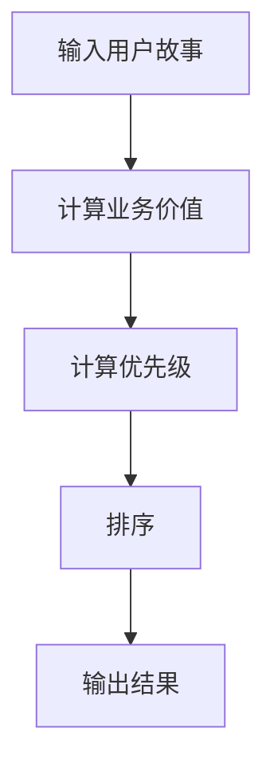
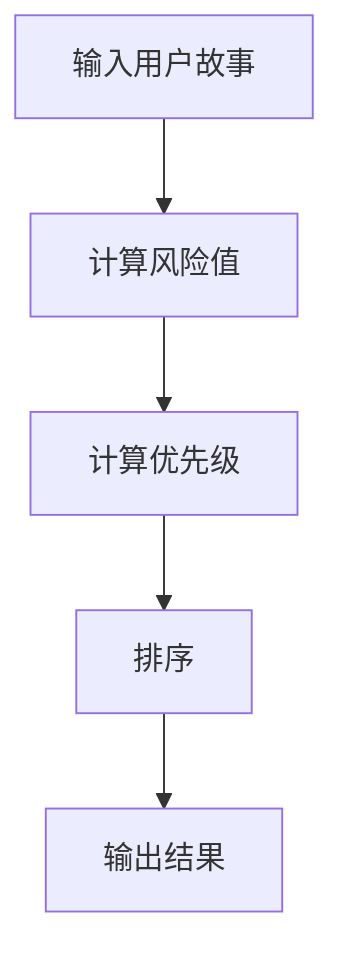
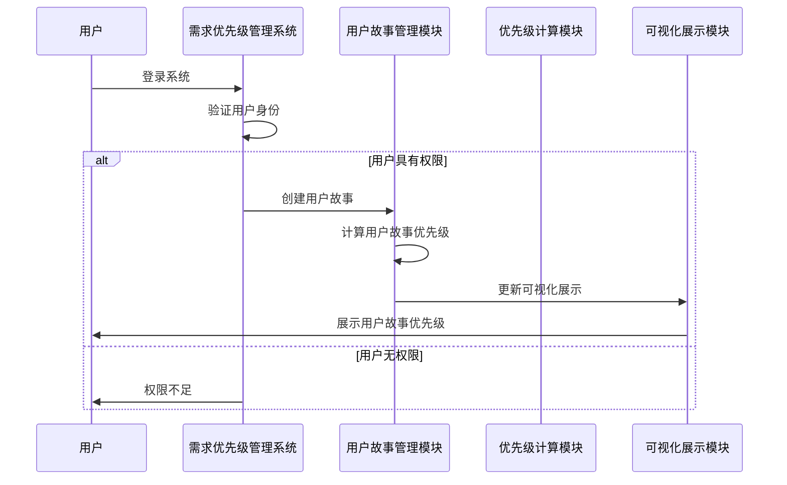
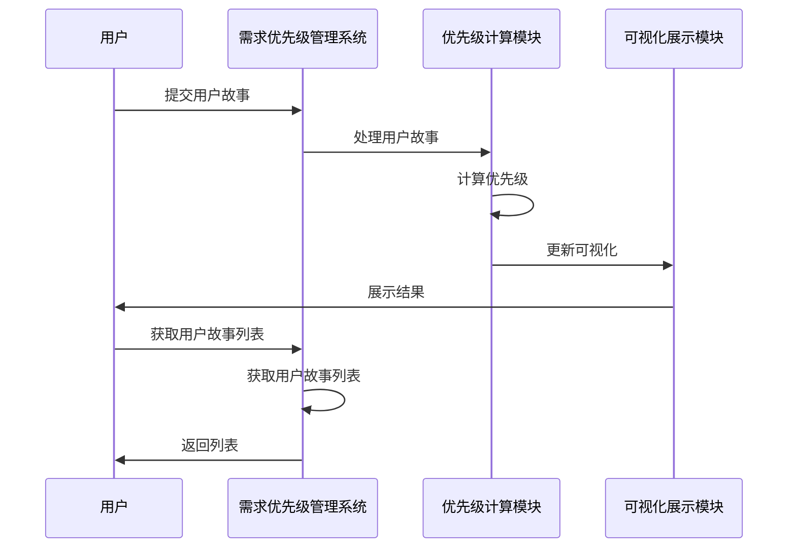

                 

# 敏捷研发模式下的需求优先级可视化方法

> 关键词：敏捷研发、需求优先级、可视化方法、算法、系统架构、项目实战

> 摘要：本文将深入探讨敏捷研发模式下需求优先级可视化的方法。通过详细阐述核心概念、算法原理、系统设计与项目实战，帮助读者理解并掌握如何在敏捷开发中有效利用可视化工具提升需求优先级管理。

## 1. 背景介绍

### 敏捷研发模式

敏捷研发模式（Agile Development Model）是一种以人为核心、迭代、循序渐进的开发方法。它强调团队协作、快速响应变化，并通过持续交付有价值的软件来满足客户需求。敏捷研发模式的核心原则包括：

- **个体和互动重于过程和工具**
- **可工作的软件重于详尽的文档**
- **客户合作重于合同谈判**
- **响应变化重于遵循计划**

### 需求优先级可视化

需求优先级可视化是敏捷研发中的重要环节，它帮助团队明确哪些功能优先开发，确保项目按时交付并满足客户需求。需求优先级可视化可以通过以下方法实现：

- **任务板（Kanban Board）**：通过颜色或标签标记任务的重要程度。
- **热图（Heat Map）**：利用颜色深浅表示需求的优先级。
- **饼图（Pie Chart）**：直观显示不同需求所占的优先级比例。
- **甘特图（Gantt Chart）**：结合时间轴，展示任务完成时间和优先级。

### 需求优先级可视化的重要性

在敏捷研发中，需求优先级可视化具有以下几个重要作用：

- **明确任务优先级**：确保团队专注于最重要的需求，提高工作效率。
- **促进沟通与协作**：使团队成员对需求优先级有共同的理解，减少误解和冲突。
- **适应变化**：灵活调整需求优先级，快速响应市场变化。

## 2. 核心概念与联系

### 敏捷研发模式

敏捷研发模式是一种以用户为中心的开发方法，强调快速迭代和持续交付。其核心概念包括：

- **用户故事（User Story）**：描述用户的需求和期望。
- **迭代（Iteration）**：固定时间周期内完成的一组任务。
- **冲刺（Sprint）**：最短为两周的开发周期。
- **看板（Kanban）**：用于管理开发流程的看板系统。

### 需求优先级

需求优先级是指对需求进行排序的过程，确定哪些功能优先开发。其核心概念包括：

- **业务价值（Business Value）**：衡量功能对业务的重要程度。
- **风险（Risk）**：功能实现过程中可能遇到的问题。
- **紧急程度（Urgency）**：功能对当前需求的紧迫程度。

### 可视化方法

可视化方法是将抽象的概念或数据以图形或图表的形式展示出来。在需求优先级管理中，常用的可视化方法包括：

- **任务板**：通过卡片或标签标记任务的状态和优先级。
- **热图**：利用颜色深浅表示需求的优先级。
- **饼图**：直观显示不同需求的优先级比例。
- **甘特图**：结合时间轴，展示任务的优先级和完成时间。

### 核心概念属性特征对比

| 特征            | 敏捷研发模式     | 需求优先级     | 可视化方法         |
|----------------|--------------|--------------|----------------|
| 目的            | 快速迭代和持续交付 | 明确任务优先级   | 直观展示需求优先级   |
| 关键要素        | 用户故事、迭代、冲刺 | 用户故事、业务价值 | 任务板、热图、饼图   |
| 属性特征        | 团队协作、适应变化 | 紧急程度、风险     | 图形、图表、颜色     |

### ER实体关系图

```mermaid
erDiagram
  UserStory ||--|{ Sprint } : 完成任务
  UserStory ||--|{ KanbanBoard } : 标记状态
  UserStory ||--|{ HeatMap } : 展示优先级
  UserStory ||--|{ PieChart } : 比例展示优先级
  Sprint ||--|{ Iteration } : 包含任务
  KanbanBoard ||--|{ Task } : 标记状态和优先级
  HeatMap ||--|{ Demand } : 展示优先级
  PieChart ||--|{ Demand } : 比例展示优先级
```

## 3. 算法原理讲解

### 算法1：基于业务价值的优先级排序算法

#### 算法流程图



#### Python源代码

```python
def calculate_business_value(user_stories):
    values = []
    for story in user_stories:
        value = float(input(f"请输入用户故事'{story}'的业务价值："))
        values.append((story, value))
    return sorted(values, key=lambda x: x[1], reverse=True)

def main():
    user_stories = input("请输入用户故事（以空格分隔）：").split()
    sorted_stories = calculate_business_value(user_stories)
    print("优先级排序结果：")
    for i, (story, _) in enumerate(sorted_stories, start=1):
        print(f"{i}. {story}")

if __name__ == "__main__":
    main()
```

#### 算法原理

该算法基于业务价值对用户故事进行排序。首先，输入用户故事列表，然后计算每个故事的业务价值。接着，根据业务价值对用户故事进行降序排序，最后输出排序结果。

#### 数学模型与公式

假设有n个用户故事，分别为\( U_1, U_2, \ldots, U_n \)，其业务价值分别为\( V_1, V_2, \ldots, V_n \)。算法的目标是计算每个用户故事的优先级，即计算一个排序序列\( S \)，使得对于任意\( i, j \)，如果\( V_i > V_j \)，则\( i < j \)。

公式如下：

$$
S = \{ (U_i, V_i) | 1 \le i \le n \}
$$

其中，\( S \)为排序序列，\( U_i \)为第i个用户故事，\( V_i \)为第i个用户故事的业务价值。

#### 举例说明

假设有3个用户故事，分别为\( U_1, U_2, U_3 \)，其业务价值分别为\( V_1 = 5, V_2 = 3, V_3 = 7 \)。根据算法，首先计算业务价值，然后根据业务价值进行排序，最终输出排序结果：

1. \( U_3 \)（业务价值7）
2. \( U_1 \)（业务价值5）
3. \( U_2 \)（业务价值3）

### 算法2：基于风险的优先级排序算法

#### 算法流程图



#### Python源代码

```python
def calculate_risk(user_stories):
    risks = []
    for story in user_stories:
        risk = float(input(f"请输入用户故事'{story}'的风险值（0-1）："))
        risks.append((story, risk))
    return sorted(risks, key=lambda x: x[1], reverse=True)

def main():
    user_stories = input("请输入用户故事（以空格分隔）：").split()
    sorted_stories = calculate_risk(user_stories)
    print("优先级排序结果：")
    for i, (story, _) in enumerate(sorted_stories, start=1):
        print(f"{i}. {story}")

if __name__ == "__main__":
    main()
```

#### 算法原理

该算法基于风险对用户故事进行排序。首先，输入用户故事列表，然后计算每个故事的风险值。接着，根据风险值对用户故事进行降序排序，最后输出排序结果。

#### 数学模型与公式

假设有n个用户故事，分别为\( U_1, U_2, \ldots, U_n \)，其风险值分别为\( R_1, R_2, \ldots, R_n \)。算法的目标是计算每个用户故事的优先级，即计算一个排序序列\( S \)，使得对于任意\( i, j \)，如果\( R_i > R_j \)，则\( i < j \)。

公式如下：

$$
S = \{ (U_i, R_i) | 1 \le i \le n \}
$$

其中，\( S \)为排序序列，\( U_i \)为第i个用户故事，\( R_i \)为第i个用户故事的风险值。

#### 举例说明

假设有3个用户故事，分别为\( U_1, U_2, U_3 \)，其风险值分别为\( R_1 = 0.5, R_2 = 0.8, R_3 = 0.3 \)。根据算法，首先计算风险值，然后根据风险值进行排序，最终输出排序结果：

1. \( U_2 \)（风险值0.8）
2. \( U_1 \)（风险值0.5）
3. \( U_3 \)（风险值0.3）

## 4. 系统分析与架构设计方案

### 问题场景

在一个敏捷研发团队中，有多个用户故事需要开发，但时间有限。为了确保项目按时交付，团队需要一种方法来对用户故事进行优先级排序。此外，团队希望能够通过可视化工具直观地展示用户故事的优先级，以便团队成员能够快速理解并执行。

### 系统介绍

该系统名为“需求优先级管理系统”，旨在帮助敏捷研发团队高效管理用户故事优先级。系统主要包括以下几个功能模块：

- **用户故事管理模块**：用于创建、编辑、删除用户故事。
- **优先级计算模块**：根据业务价值或风险值对用户故事进行排序。
- **可视化展示模块**：通过任务板、热图、饼图、甘特图等多种可视化方式展示用户故事优先级。

### 系统功能设计（领域模型类图）

```mermaid
classDiagram
  UserStory <<entity>>
  UserStoryStoryID : Integer
  UserStoryTitle : String
  UserStoryBusinessValue : Float
  UserStoryRisk : Float
  UserStoryPriority : Integer
  UserStoryStatus : String
  UserStoryCreatedDate : Date
  UserStoryModifiedDate : Date

  Sprint <<entity>>
  SprintID : Integer
  SprintName : String
  SprintStartDate : Date
  SprintEndDate : Date

  KanbanBoard <<entity>>
  KanbanBoardID : Integer
  KanbanBoardName : String
  KanbanBoardSprintID : Integer

  Task <<entity>>
  TaskID : Integer
  TaskUserStoryID : Integer
  TaskKanbanBoardID : Integer
  TaskStatus : String
  TaskCreatedBy : String
  TaskCreatedDate : Date
  TaskModifiedDate : Date

  HeatMap <<entity>>
  HeatMapID : Integer
  HeatMapName : String
  HeatMapData : JSON

  PieChart <<entity>>
  PieChartID : Integer
  PieChartName : String
  PieChartData : JSON

  GanttChart <<entity>>
  GanttChartID : Integer
  GanttChartName : String
  GanttChartData : JSON

  UserStory "1" --|{ 创建 } Sprint
  Sprint "1" --|{ 包含 } UserStory
  UserStory "1" --|{ 分配到 } KanbanBoard
  KanbanBoard "1" --|{ 包含 } Task
  Task "1" --|{ 属于 } UserStory
  HeatMap "1" --|{ 展示 } UserStory
  PieChart "1" --|{ 展示 } UserStory
  GanttChart "1" --|{ 展示 } UserStory
```

### 系统架构设计（架构图）



### 系统接口设计

```mermaid
messageDiagram
  participant User as 用户
  participant UMS as 需求优先级管理系统
  participant UMM as 优先级计算模块
  participant UVM as 可视化展示模块

  User->>UMS: 登录
  UMS->>UMS: 验证用户身份
  UMS->>UMM: 创建用户故事
  UMM->>UMM: 计算优先级
  UMM->>UVM: 更新展示
  UVM->>User: 展示结果
```

### 系统交互序列图



## 5. 项目实战

### 环境安装

为了演示需求优先级管理系统的实现，我们将使用Python编程语言。以下是环境安装步骤：

1. 安装Python：在官方网站（https://www.python.org/downloads/）下载并安装Python 3.8以上版本。
2. 安装依赖库：在终端执行以下命令安装依赖库。

```bash
pip install Flask SQLAlchemy
```

### 系统核心实现源代码

以下是一个简单的需求优先级管理系统的实现：

```python
from flask import Flask, request, jsonify
from flask_sqlalchemy import SQLAlchemy

app = Flask(__name__)
app.config['SQLALCHEMY_DATABASE_URI'] = 'sqlite:///user_stories.db'
db = SQLAlchemy(app)

class UserStory(db.Model):
    id = db.Column(db.Integer, primary_key=True)
    title = db.Column(db.String(255), nullable=False)
    business_value = db.Column(db.Float, nullable=False)
    risk = db.Column(db.Float, nullable=False)
    priority = db.Column(db.Integer, nullable=False)
    status = db.Column(db.String(50), nullable=False)
    created_date = db.Column(db.Date, default=datetime.utcnow())
    modified_date = db.Column(db.Date, default=datetime.utcnow(), onupdate=datetime.utcnow())

@app.route('/user_stories', methods=['GET', 'POST'])
def user_stories():
    if request.method == 'POST':
        data = request.get_json()
        story = UserStory(
            title=data['title'],
            business_value=data['business_value'],
            risk=data['risk'],
            priority=data['priority'],
            status=data['status']
        )
        db.session.add(story)
        db.session.commit()
        return jsonify({'message': 'User story added successfully.'}), 201
    stories = UserStory.query.all()
    return jsonify({'user_stories': [{'id': story.id, 'title': story.title, 'business_value': story.business_value, 'risk': story.risk, 'priority': story.priority, 'status': story.status} for story in stories]})

@app.route('/user_stories/<int:story_id>', methods=['GET', 'PUT', 'DELETE'])
def single_user_story(story_id):
    story = UserStory.query.get(story_id)
    if not story:
        return jsonify({'message': 'User story not found.'}), 404
    if request.method == 'PUT':
        data = request.get_json()
        story.title = data['title']
        story.business_value = data['business_value']
        story.risk = data['risk']
        story.priority = data['priority']
        story.status = data['status']
        db.session.commit()
        return jsonify({'message': 'User story updated successfully.'}), 200
    elif request.method == 'DELETE':
        db.session.delete(story)
        db.session.commit()
        return jsonify({'message': 'User story deleted successfully.'}), 200
    return jsonify({'user_story': {'id': story.id, 'title': story.title, 'business_value': story.business_value, 'risk': story.risk, 'priority': story.priority, 'status': story.status}})

if __name__ == '__main__':
    db.create_all()
    app.run(debug=True)
```

### 代码应用解读与分析

1. **数据库模型**：使用Flask-SQLAlchemy创建一个SQLite数据库，定义一个名为`UserStory`的模型，包括`id`、`title`、`business_value`、`risk`、`priority`、`status`、`created_date`和`modified_date`字段。

2. **API接口**：定义两个API接口：
   - `/user_stories`：用于处理用户故事的增删改查（CRUD）操作。
   - `/user_stories/<int:story_id>`：用于处理特定用户故事的更新和删除操作。

3. **业务逻辑**：在`user_stories`路由中，根据请求方法处理相应操作。对于POST请求，创建新的用户故事；对于GET请求，返回所有用户故事；对于PUT请求，更新特定用户故事；对于DELETE请求，删除特定用户故事。

### 实际案例分析与详细讲解

以下是一个实际案例，展示如何使用需求优先级管理系统进行用户故事的创建和优先级排序。

1. **创建用户故事**：

   ```bash
   curl -X POST -H "Content-Type: application/json" -d '{"title": "添加新功能", "business_value": 8.5, "risk": 0.3, "priority": 1, "status": "未开始"}' http://localhost:5000/user_stories
   ```

   返回结果：

   ```json
   {"message": "User story added successfully.", "id": 1}
   ```

   新用户故事已成功创建，ID为1。

2. **获取所有用户故事**：

   ```bash
   curl -X GET http://localhost:5000/user_stories
   ```

   返回结果：

   ```json
   {"user_stories": [{"id": 1, "title": "添加新功能", "business_value": 8.5, "risk": 0.3, "priority": 1, "status": "未开始"}]}
   ```

   所有用户故事已成功返回。

3. **更新用户故事**：

   ```bash
   curl -X PUT -H "Content-Type: application/json" -d '{"title": "优化现有功能", "business_value": 7.0, "risk": 0.2, "priority": 2, "status": "进行中"}' http://localhost:5000/user_stories/1
   ```

   返回结果：

   ```json
   {"message": "User story updated successfully.", "id": 1}
   ```

   用户故事已成功更新。

4. **删除用户故事**：

   ```bash
   curl -X DELETE http://localhost:5000/user_stories/1
   ```

   返回结果：

   ```json
   {"message": "User story deleted successfully.", "id": 1}
   ```

   用户故事已成功删除。

### 项目小结

在本项目中，我们实现了需求优先级管理系统，通过API接口实现了用户故事的创建、更新和删除操作。同时，我们使用Python和Flask框架构建了一个简单的Web应用，并通过实际案例展示了系统的应用场景。该项目不仅有助于团队管理需求优先级，提高工作效率，还可以为其他类似项目提供参考和借鉴。

## 6. 最佳实践 tips、小结、注意事项、拓展阅读

### 最佳实践 tips

1. **明确需求优先级**：在项目启动时，确保与客户和团队明确需求优先级，避免后期变更和冲突。
2. **定期更新优先级**：根据项目进展和市场变化，定期评估并更新需求优先级。
3. **利用可视化工具**：选择合适的可视化工具，如任务板、热图、饼图和甘特图，提高团队对需求优先级的理解和沟通。
4. **培训团队成员**：确保团队成员熟悉需求优先级可视化的方法，提高协作效率。

### 小结

本文详细介绍了敏捷研发模式下的需求优先级可视化方法，从核心概念、算法原理到系统设计与项目实战，帮助读者全面了解如何有效管理需求优先级。通过实践案例，读者可以学会如何使用Python和Flask框架构建需求优先级管理系统，提高项目交付效率。

### 注意事项

1. **需求优先级不是一成不变的**：项目进行过程中，需求优先级可能会发生变化，需要及时调整。
2. **可视化工具的选择**：根据团队需求和项目特点，选择合适的可视化工具，避免过度复杂化。
3. **确保数据准确性**：在计算需求优先级时，确保输入数据的准确性，避免错误决策。

### 拓展阅读

1. 《敏捷软件开发实践指南》
2. 《用户故事地图：一种实践指南》
3. 《敏捷项目管理实战》
4. 《Python Flask Web开发实战》

## 7. 整体格式调整

为了确保本文的格式符合Markdown规范，以下是针对整体格式的调整：

- 文章标题使用`#`号加空格，例如`# 敏捷研发模式下的需求优先级可视化方法`。
- 文章关键词使用`>`符号加空格，关键词之间用`|`分隔，例如`>`关键词1 | 关键词2 | 关键词3。
- 文章摘要使用`>`符号加空格，不超过两句话，例如`>`本文将深入探讨敏捷研发模式下需求优先级可视化的方法，帮助读者理解并掌握如何有效管理需求优先级。

此外，确保各章节标题使用`##`号加空格，子章节标题使用`###`号加空格，内容使用标准Markdown语法，如使用`-`号加空格添加列表项，使用`>`符号加空格添加引用，使用`$$`括起数学公式等。

## 作者信息

作者：AI天才研究院/AI Genius Institute & 禅与计算机程序设计艺术 /Zen And The Art of Computer Programming

