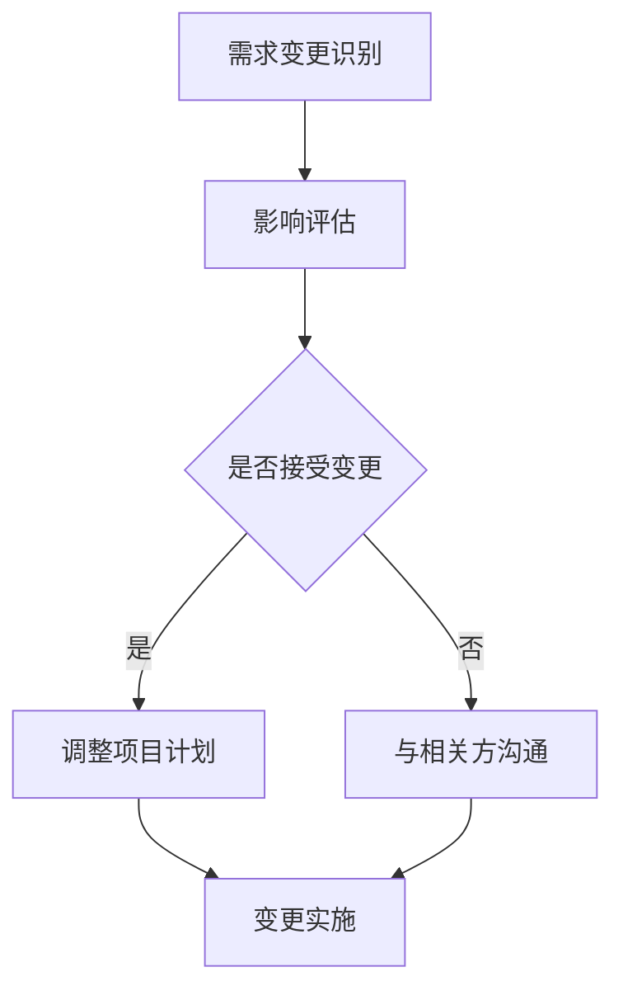
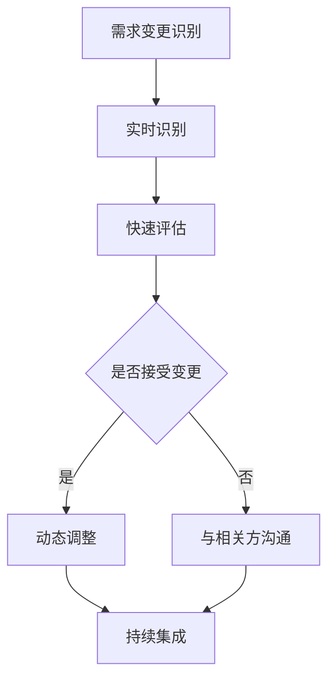
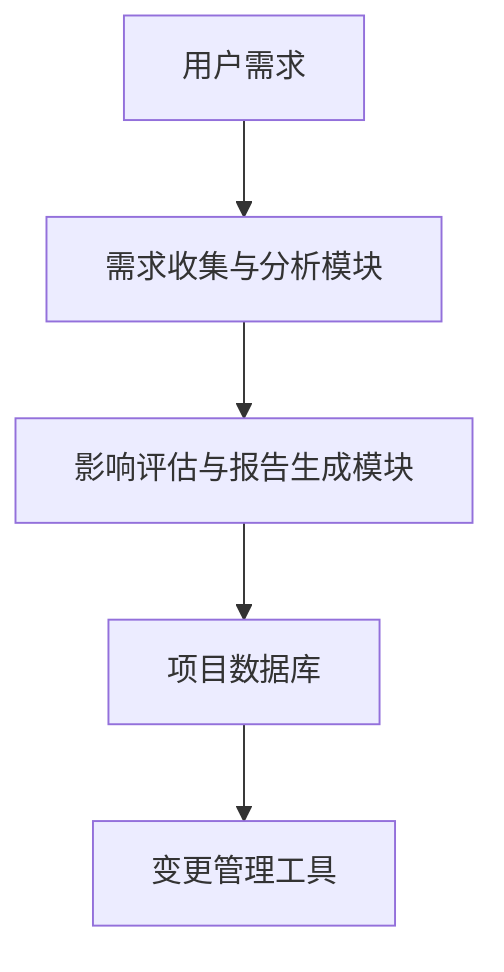
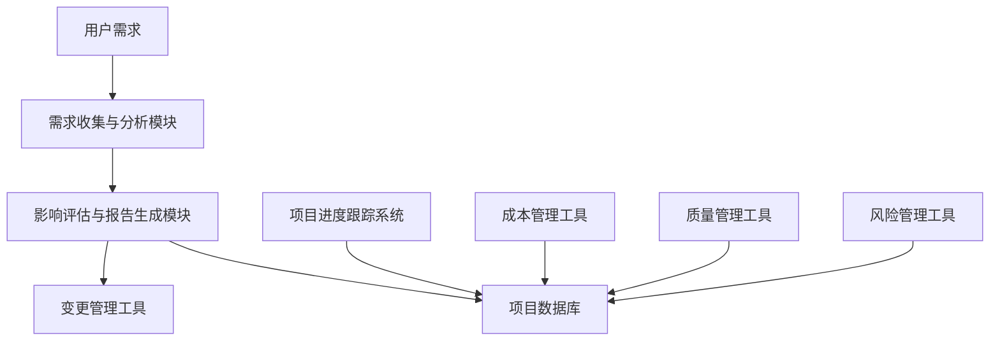

                 

### 第一部分：背景介绍

#### 1.1 需求变更的影响

##### 1.1.1 问题背景

在软件开发过程中，需求变更是一种常见且不可避免的现象。无论是产品经理、项目经理还是开发人员，都深知需求变更带来的挑战和影响。需求变更是指在软件开发项目进行过程中，对原有需求的修改、增加或删除。这种变更可能会涉及到功能模块、系统架构、接口设计等多个方面。

在传统的瀑布式开发模式下，需求变更往往被视为一种“坏消息”，因为变更可能会打乱原有的开发计划，导致项目延期、成本超支等问题。然而，在敏捷开发模式下，需求变更被视为一种自然且必要的现象，因为敏捷开发强调客户需求的变化和快速响应。

##### 1.1.2 问题描述

需求变更对软件开发项目的影响是多方面的，具体表现在以下几个方面：

1. **项目进度**：需求变更可能会导致项目进度延迟，因为变更通常需要重新评估、设计和开发。
2. **项目成本**：需求变更可能会导致项目成本增加，因为变更可能需要额外的人力、物力和时间投入。
3. **项目质量**：需求变更可能会影响项目的质量，因为变更可能需要重新考虑和优化系统设计，以确保系统的稳定性和可维护性。
4. **项目风险**：需求变更可能会增加项目的风险，因为变更可能会导致项目的不确定性和不可预测性。

##### 1.1.3 问题解决思路

为了有效管理需求变更，我们需要采取以下思路：

1. **需求变更的识别与分类**：首先，我们需要能够准确地识别和分类需求变更，以便快速做出响应。
2. **需求变更的影响评估**：对每个需求变更的影响进行详细评估，包括对项目进度、成本、质量和风险的影响。
3. **需求变更的应对策略**：根据评估结果，制定相应的应对策略，包括调整项目计划、重新分配资源、优化系统设计等。
4. **需求变更的管理与监控**：建立需求变更管理流程，对变更进行全程监控和管理，以确保变更的及时性和有效性。

#### 1.2 研发模式下的需求变更

##### 1.2.1 敏捷开发模式概述

敏捷开发是一种以人为核心、迭代、循序渐进的开发方法。它强调团队协作、客户参与和快速响应变化。敏捷开发的核心原则包括：

- **个体和互动重于过程和工具**：敏捷开发认为，个人的能力和团队合作比任何工具或流程都更重要。
- **可工作的软件重于详尽的文档**：敏捷开发强调产出可工作的软件，而不是花费大量时间编写文档。
- **客户协作重于合同谈判**：敏捷开发鼓励与客户的紧密合作，以快速响应客户需求的变化。
- **响应变化重于遵循计划**：敏捷开发强调对变化的适应性，而不是一成不变的计划。

##### 1.2.2 敏捷开发模式的特点

1. **迭代开发**：敏捷开发采用迭代的方式进行开发，每个迭代周期通常是2-4周。每个迭代周期都会产出可运行的软件版本。
2. **增量交付**：敏捷开发强调逐步交付可用的软件功能，而不是等到所有功能都完成再交付。
3. **用户故事**：用户故事是一种简单明了的需求描述方式，通常由用户编写，描述了用户需要的功能或服务。
4. **持续集成**：敏捷开发强调持续集成，即代码的持续整合和测试，以确保软件的稳定性和可靠性。

##### 1.2.3 敏捷开发模式下的需求变更挑战

虽然敏捷开发模式对需求变更有较好的适应性，但同时也带来了一些挑战：

1. **频繁的需求变更**：在敏捷开发模式下，客户和产品经理可能会更频繁地提出需求变更，这要求团队具备快速响应的能力。
2. **优先级管理**：在敏捷开发中，需求变更可能会影响原有的优先级，团队需要重新评估和调整需求优先级。
3. **资源分配**：需求变更可能会打乱原有的资源分配计划，团队需要灵活调整资源，以应对变更。
4. **风险管理**：需求变更可能会增加项目的风险，团队需要识别和应对变更带来的潜在风险。

#### 1.3 需求变更的影响分析方法

##### 1.3.1 传统分析方法

在传统的软件开发模式下，需求变更的影响分析方法通常包括以下步骤：

1. **需求变更识别**：通过需求文档、用户反馈、项目会议等方式，识别出需求变更。
2. **影响评估**：评估需求变更对项目进度、成本、质量和风险的影响，通常使用成本估算、风险评估等技术手段。
3. **变更决策**：根据评估结果，决定是否接受需求变更，以及如何调整项目计划。
4. **变更实施**：根据决策结果，实施需求变更，包括设计、编码、测试等。

##### 1.3.2 敏捷开发模式下的分析方法

在敏捷开发模式下，需求变更的影响分析方法与传统方法有所不同，更加强调快速响应和持续集成：

1. **实时识别**：通过每日站立会议、迭代回顾等方式，实时识别需求变更。
2. **快速评估**：通过故事点估算、风险矩阵等方法，快速评估需求变更的影响。
3. **动态调整**：根据评估结果，动态调整项目计划和资源分配，以适应变更。
4. **持续集成**：通过持续集成和测试，确保变更后的软件质量和稳定性。

#### 1.4 需求变更管理的策略

##### 1.4.1 需求变更的识别与分类

为了有效管理需求变更，首先需要能够准确地识别和分类需求变更。需求变更通常可以分为以下几类：

1. **功能需求变更**：涉及软件功能的增加、删除或修改。
2. **非功能需求变更**：涉及软件的性能、安全性、可用性等非功能方面。
3. **优先级变更**：涉及需求的优先级调整，可能影响项目进度和资源分配。

##### 1.4.2 需求变更的影响评估

对每个需求变更的影响进行详细评估，包括对项目进度、成本、质量和风险的影响。评估方法可以包括：

1. **成本估算**：计算变更所需的额外人力、物力和时间成本。
2. **风险评估**：评估变更对项目风险的影响，包括风险的概率和影响程度。
3. **时间估算**：评估变更对项目进度的影响，包括延期的时间和成本。

##### 1.4.3 需求变更的应对策略

根据评估结果，制定相应的应对策略，包括：

1. **变更接受**：如果变更对项目的正面影响大于负面影响，可以接受变更，并调整项目计划和资源分配。
2. **变更拒绝**：如果变更对项目的负面影响过大，可以拒绝变更，并与相关方进行沟通。
3. **变更优化**：对于必要的需求变更，可以通过优化设计、重构代码等方式，降低变更对项目的影响。

#### 1.5 本章小结

本部分主要介绍了需求变更的影响、敏捷开发模式下的需求变更挑战以及需求变更的影响分析方法。需求变更在软件开发过程中是一种常见且不可避免的现象，需要采取有效的管理策略来应对。敏捷开发模式对需求变更有较好的适应性，但也带来了一些挑战。通过识别、评估和应对需求变更，可以降低变更对项目的影响，确保项目的顺利进行。

----------------------------------------------------------------

## 第二部分：核心概念与联系

### 2.1 需求变更的核心概念

#### 2.1.1 需求变更的定义

需求变更是指在软件开发项目进行过程中，对原有需求的修改、增加或删除。这种变更可能是由于市场需求、用户反馈、技术发展等多种原因引起的。

#### 2.1.2 需求变更的类型

需求变更可以分为以下几种类型：

1. **功能需求变更**：涉及软件功能的增加、删除或修改。
2. **非功能需求变更**：涉及软件的性能、安全性、可用性等非功能方面。
3. **优先级变更**：涉及需求的优先级调整，可能影响项目进度和资源分配。

#### 2.1.3 需求变更的影响

需求变更对软件开发项目的影响是多方面的，包括项目进度、成本、质量和风险等。具体影响如下：

1. **项目进度**：需求变更可能会导致项目延期，因为变更需要重新评估、设计和开发。
2. **项目成本**：需求变更可能会导致项目成本增加，因为变更可能需要额外的人力、物力和时间投入。
3. **项目质量**：需求变更可能会影响项目的质量，因为变更可能需要重新考虑和优化系统设计，以确保系统的稳定性和可维护性。
4. **项目风险**：需求变更可能会增加项目的风险，因为变更可能会导致项目的不确定性和不可预测性。

### 2.2 敏捷开发模式的关键概念

#### 2.2.1 敏捷开发模式的基本原理

敏捷开发模式是一种以人为核心、迭代、循序渐进的开发方法。它强调团队协作、客户参与和快速响应变化。

#### 2.2.2 敏捷开发的核心价值观

敏捷开发的核心价值观包括：

1. **个体和互动重于过程和工具**：敏捷开发认为，个人的能力和团队合作比任何工具或流程都更重要。
2. **可工作的软件重于详尽的文档**：敏捷开发强调产出可工作的软件，而不是花费大量时间编写文档。
3. **客户协作重于合同谈判**：敏捷开发鼓励与客户的紧密合作，以快速响应客户需求的变化。
4. **响应变化重于遵循计划**：敏捷开发强调对变化的适应性，而不是一成不变的计划。

#### 2.2.3 敏捷开发的方法论

敏捷开发的方法论包括：

1. **迭代开发**：敏捷开发采用迭代的方式进行开发，每个迭代周期通常是2-4周。每个迭代周期都会产出可运行的软件版本。
2. **增量交付**：敏捷开发强调逐步交付可用的软件功能，而不是等到所有功能都完成再交付。
3. **用户故事**：用户故事是一种简单明了的需求描述方式，通常由用户编写，描述了用户需要的功能或服务。
4. **持续集成**：敏捷开发强调持续集成，即代码的持续整合和测试，以确保软件的稳定性和可靠性。

### 2.3 需求变更与敏捷开发模式的联系

#### 2.3.1 需求变更与敏捷开发的关系

需求变更与敏捷开发模式之间存在紧密的关系。敏捷开发模式强调对需求变更的快速响应和适应性，而需求变更是软件开发项目中的常见现象。

1. **敏捷开发模式对需求变更的适应性**：敏捷开发模式采用迭代和增量的方式进行开发，这为需求变更提供了良好的适应性。团队可以在每个迭代周期内快速响应需求变更，并进行相应的调整和优化。
2. **需求变更对敏捷开发的影响**：需求变更可能会影响敏捷开发的实施，包括迭代周期、资源分配和优先级管理等。为了有效管理需求变更，团队需要采取适当的策略和措施。

#### 2.3.2 需求变更对敏捷开发的影响

需求变更对敏捷开发的影响主要体现在以下几个方面：

1. **迭代周期的调整**：需求变更可能会导致迭代周期的延长，因为变更需要重新评估、设计和开发。
2. **资源分配的调整**：需求变更可能会影响原有的资源分配计划，团队需要根据变更情况重新分配资源。
3. **优先级管理的调整**：需求变更可能会影响需求的优先级，团队需要重新评估和调整需求优先级。

#### 2.3.3 敏捷开发应对需求变更的方法

敏捷开发模式提供了一些方法来应对需求变更，包括：

1. **用户故事地图**：用户故事地图是一种可视化工具，用于帮助团队理解和规划需求变更，以便更好地进行优先级管理和迭代开发。
2. **迭代回顾**：迭代回顾是一种反思和改进的方法，通过回顾上一个迭代的工作，团队可以发现和解决问题，以更好地应对需求变更。
3. **持续集成**：持续集成是一种代码整合和测试的方法，通过持续集成，团队可以及时发现和解决需求变更带来的潜在问题。

### 2.4 核心概念对比表格

下面是一个关于需求变更和敏捷开发模式核心概念的对比表格：

| 核心概念 | 敏捷开发模式 | 需求变更 |
| :--: | :--: | :--: |
| 定义 | 迭代、协作、适应性 | 需求修改、增加、删除 |
| 类型 | 功能、非功能、优先级 | 功能、非功能、优先级 |
| 影响 | 项目进度、成本、质量、风险 | 项目进度、成本、质量、风险 |
| 基本原理 | 个体和互动、可工作软件、客户协作、响应变化 | 快速响应、适应性 |
| 核心价值观 | 个体和互动、可工作软件、客户协作、响应变化 | 快速响应、适应性 |
| 方法论 | 迭代、增量交付、用户故事、持续集成 | 用户故事地图、迭代回顾、持续集成 |

通过对比表格，我们可以更清晰地理解需求变更和敏捷开发模式之间的联系和区别。

----------------------------------------------------------------

## 第三部分：算法原理讲解

### 3.1 传统需求变更影响分析方法

#### 3.1.1 分析方法概述

传统的需求变更影响分析方法通常包括以下步骤：

1. **需求变更识别**：通过需求文档、用户反馈、项目会议等方式，识别出需求变更。
2. **影响评估**：评估需求变更对项目进度、成本、质量和风险的影响。
3. **变更决策**：根据评估结果，决定是否接受需求变更，以及如何调整项目计划。
4. **变更实施**：根据决策结果，实施需求变更，包括设计、编码、测试等。

#### 3.1.1.1 流程图

下面是传统需求变更影响分析方法的流程图：



#### 3.1.2 数学模型和公式

在需求变更影响分析中，我们可以使用以下数学模型和公式：

1. **成本模型**：

   $$ C_{new} = C_{original} + \Delta C $$

   其中，$C_{new}$表示变更后的总成本，$C_{original}$表示原有的总成本，$\Delta C$表示由于需求变更引起的额外成本。

2. **时间模型**：

   $$ T_{new} = T_{original} + \Delta T $$

   其中，$T_{new}$表示变更后的总时间，$T_{original}$表示原有的总时间，$\Delta T$表示由于需求变更引起的额外时间。

3. **风险评估模型**：

   $$ R = P \times I $$

   其中，$R$表示风险值，$P$表示风险发生的概率，$I$表示风险的影响程度。

#### 3.1.3 举例说明

#### 3.1.3.1 案例一

假设一个软件开发项目，原计划需要12个月完成，总成本为100万元。在某个月，客户提出一个新的功能需求，预计需要额外投入20万元，并且需要额外2个月的时间来完成。

使用上述公式，我们可以计算出：

- 变更后的总成本：

  $$ C_{new} = 100 + 20 = 120 \text{万元} $$

- 变更后的总时间：

  $$ T_{new} = 12 + 2 = 14 \text{个月} $$

- 风险值：

  假设风险发生的概率为50%，风险的影响程度为严重，则：

  $$ R = 0.5 \times 2 = 1 $$

#### 3.1.3.2 案例二

假设另一个软件开发项目，原计划需要6个月完成，总成本为50万元。在某个月，客户提出一个新的功能需求，预计需要额外投入15万元，并且需要额外1个月的时间来完成。

使用上述公式，我们可以计算出：

- 变更后的总成本：

  $$ C_{new} = 50 + 15 = 65 \text{万元} $$

- 变更后的总时间：

  $$ T_{new} = 6 + 1 = 7 \text{个月} $$

- 风险值：

  假设风险发生的概率为30%，风险的影响程度为轻微，则：

  $$ R = 0.3 \times 0.5 = 0.15 $$

### 3.2 敏捷开发模式下的需求变更分析方法

#### 3.2.1 分析方法概述

敏捷开发模式下的需求变更分析方法与传统方法有所不同，更加强调快速响应和持续集成：

1. **实时识别**：通过每日站立会议、迭代回顾等方式，实时识别需求变更。
2. **快速评估**：通过故事点估算、风险矩阵等方法，快速评估需求变更的影响。
3. **动态调整**：根据评估结果，动态调整项目计划和资源分配，以适应变更。
4. **持续集成**：通过持续集成和测试，确保变更后的软件质量和稳定性。

#### 3.2.1.1 流程图

下面是敏捷开发模式下的需求变更分析方法的流程图：



#### 3.2.2 数学模型和公式

在敏捷开发模式下，我们可以使用以下数学模型和公式：

1. **故事点估算**：

   $$ S_{new} = S_{original} + \Delta S $$

   其中，$S_{new}$表示变更后的总故事点，$S_{original}$表示原有的总故事点，$\Delta S$表示由于需求变更引起的额外故事点。

2. **风险评估模型**：

   $$ R = P \times I $$

   其中，$R$表示风险值，$P$表示风险发生的概率，$I$表示风险的影响程度。

3. **资源分配模型**：

   $$ R_{new} = R_{original} + \Delta R $$

   其中，$R_{new}$表示变更后的总资源，$R_{original}$表示原有的总资源，$\Delta R$表示由于需求变更引起的额外资源。

#### 3.2.3 举例说明

#### 3.2.3.1 案例一

假设一个敏捷开发项目，原计划需要完成10个故事点，总资源为5人月。在某个月，客户提出一个新的功能需求，预计需要额外投入2个故事点和1人月。

使用上述公式，我们可以计算出：

- 变更后的总故事点：

  $$ S_{new} = 10 + 2 = 12 $$

- 变更后的总资源：

  $$ R_{new} = 5 + 1 = 6 $$

- 风险值：

  假设风险发生的概率为30%，风险的影响程度为轻微，则：

  $$ R = 0.3 \times 0.5 = 0.15 $$

#### 3.2.3.2 案例二

假设另一个敏捷开发项目，原计划需要完成5个故事点，总资源为3人月。在某个月，客户提出一个新的功能需求，预计需要额外投入1个故事点和0.5人月。

使用上述公式，我们可以计算出：

- 变更后的总故事点：

  $$ S_{new} = 5 + 1 = 6 $$

- 变更后的总资源：

  $$ R_{new} = 3 + 0.5 = 3.5 $$

- 风险值：

  假设风险发生的的概率为20%，风险的影响程度为轻微，则：

  $$ R = 0.2 \times 0.5 = 0.1 $$

### 3.3 方法对比与选择

#### 3.3.1 传统方法与敏捷开发方法的对比

传统需求变更影响分析方法与敏捷开发模式下的需求变更分析方法有以下几点对比：

1. **响应速度**：敏捷开发方法对需求变更的响应速度更快，能够实时识别和快速评估变更。
2. **评估方式**：敏捷开发方法更注重故事点估算和风险评估，而传统方法更注重成本和时间估算。
3. **调整方式**：敏捷开发方法通过动态调整项目计划和资源分配来适应变更，而传统方法更多是调整项目计划。

#### 3.3.2 选择方法的考虑因素

在选择需求变更分析方法时，需要考虑以下因素：

1. **项目特点**：如果项目需求变化频繁，敏捷开发方法可能更合适。如果需求相对稳定，传统方法可能更有效。
2. **团队技能**：如果团队对敏捷开发方法有良好的掌握，敏捷开发方法可能更容易实施。如果团队更擅长传统方法，传统方法可能更合适。
3. **客户要求**：如果客户对需求变更有较高的容忍度，敏捷开发方法可能更受欢迎。如果客户对需求变更有严格的限制，传统方法可能更合适。

#### 3.3.3 不同场景下的方法适用性

根据不同场景，需求变更分析方法的选择如下：

1. **需求变化频繁**：选择敏捷开发方法，因为其能够快速响应需求变更。
2. **需求相对稳定**：选择传统方法，因为其评估和调整方式更为传统和成熟。
3. **团队技能不均**：选择传统方法，因为其评估和调整方式更为团队友好。
4. **客户要求明确**：选择传统方法，因为其能够更好地满足客户的要求。

### 3.4 本章小结

本部分详细介绍了传统需求变更影响分析方法与敏捷开发模式下的需求变更分析方法。两种方法各有优缺点，选择合适的方法需要考虑项目特点、团队技能和客户要求。通过对比和选择，可以更好地应对需求变更，确保项目的顺利进行。

----------------------------------------------------------------

## 第四部分：系统分析与架构设计

### 4.1 需求变更影响分析系统的设计

#### 4.1.1 系统功能设计

需求变更影响分析系统的主要功能模块包括：

1. **需求收集与分析模块**：负责收集和分析用户需求，识别需求变更。
2. **影响评估与报告生成模块**：负责评估需求变更对项目进度、成本、质量和风险的影响，并生成相应的报告。

#### 4.1.1.1 需求收集与分析模块

需求收集与分析模块的主要功能包括：

- **需求收集**：通过用户调研、需求文档、项目会议等方式，收集用户需求。
- **需求分析**：对收集到的需求进行分析，识别出需求变更。
- **需求管理**：对需求进行分类、优先级排序和版本管理。

#### 4.1.1.2 影响评估与报告生成模块

影响评估与报告生成模块的主要功能包括：

- **影响评估**：根据需求变更情况，评估对项目进度、成本、质量和风险的影响。
- **报告生成**：生成需求变更影响报告，包括变更原因、影响范围、应对措施等。

#### 4.1.2 系统架构设计

需求变更影响分析系统的架构设计如图所示：



#### 4.1.2.1 系统架构图


#### 4.1.2.2 系统接口设计

系统接口设计包括以下部分：

- **用户界面**：提供用户操作界面，包括需求收集、分析和报告查看等功能。
- **API接口**：提供与其他系统进行数据交互的接口，包括数据导入、导出和同步等功能。

#### 4.1.3 系统交互设计

系统交互设计如图所示：



#### 4.1.3.1 系统交互序列图


### 4.2 需求变更管理的流程与策略

#### 4.2.1 需求变更管理的流程

需求变更管理的流程包括以下几个步骤：

1. **需求变更的识别**：通过用户调研、需求文档审查、项目会议等方式，识别出需求变更。
2. **需求变更的评估**：评估需求变更对项目进度、成本、质量和风险的影响，确定是否接受变更。
3. **变更决策**：根据评估结果，决定是否接受需求变更，以及如何调整项目计划。
4. **变更实施**：根据决策结果，实施需求变更，包括设计、编码、测试等。
5. **变更监控**：监控变更的实施情况，确保变更按照计划进行。

#### 4.2.1.1 需求变更的识别

需求变更的识别可以通过以下方式实现：

- **用户调研**：通过访谈、问卷调查等方式，了解用户对现有功能的满意度，以及他们对新功能的期望。
- **需求文档审查**：定期审查需求文档，发现潜在的需求变更。
- **项目会议**：在项目会议中，与项目相关人员讨论需求变更的可能性。

#### 4.2.1.2 影响评估

影响评估可以通过以下方式实现：

- **成本估算**：根据需求变更的具体内容，估算变更所需的额外成本。
- **时间估算**：根据需求变更的具体内容，估算变更对项目进度的影响。
- **质量评估**：评估需求变更对项目质量的影响，包括功能完整性、性能、安全性等方面。
- **风险评估**：评估需求变更对项目风险的影响，包括变更的概率和影响程度。

#### 4.2.1.3 变更决策

变更决策可以通过以下方式实现：

- **成本-效益分析**：比较变更所需的成本与变更带来的效益，确定是否接受变更。
- **优先级排序**：根据变更的影响程度和紧急程度，对变更进行优先级排序。
- **决策会议**：在项目决策会议上，与项目相关人员讨论变更决策。

#### 4.2.1.4 实施与监控

变更实施与监控可以通过以下方式实现：

- **计划调整**：根据变更决策，调整项目计划和资源分配。
- **任务分配**：将变更任务分配给相应的开发人员。
- **进度监控**：监控变更任务的进度和质量。
- **质量保证**：确保变更后的软件质量符合要求。

#### 4.2.2 需求变更管理的策略

需求变更管理的策略包括以下几个方面：

1. **预防策略**：通过需求文档的审查、用户调研和项目会议等方式，提前识别潜在的需求变更，并采取预防措施。
2. **应急响应策略**：在需求变更发生时，及时采取应急响应措施，包括成本估算、时间调整和质量保证等。
3. **变更管理工具**：使用变更管理工具，如需求变更记录表、变更评估报告等，对需求变更进行全程管理和监控。
4. **沟通与协作**：建立良好的沟通与协作机制，确保项目团队和相关方对需求变更有清晰的认识。

#### 4.2.2.1 需求变更的预防策略

需求变更的预防策略包括以下几个方面：

1. **明确的需求定义**：在项目初期，通过详细的需求文档和用户调研，确保需求定义的清晰和准确。
2. **需求评审**：在需求收集和分析阶段，进行多轮需求评审，确保需求的可行性和合理性。
3. **需求变更控制**：建立需求变更控制机制，如需求变更申请、审批流程等，控制需求变更的频率和范围。
4. **项目沟通机制**：建立有效的项目沟通机制，确保项目团队和相关方对项目进展和变更情况有清晰的认识。

#### 4.2.2.2 需求变更的应急响应策略

需求变更的应急响应策略包括以下几个方面：

1. **快速响应**：在需求变更发生时，立即进行评估和决策，确保变更能够及时响应。
2. **成本控制**：根据变更的影响，调整项目预算和资源分配，确保变更不会导致项目成本超支。
3. **时间调整**：根据变更的影响，调整项目进度计划，确保项目能够按时交付。
4. **质量保证**：确保变更后的软件质量符合要求，通过增加测试、质量审查等方式，确保变更不会影响项目质量。

### 4.3 本章小结

本部分介绍了需求变更影响分析系统的设计与需求变更管理的流程与策略。通过需求变更影响分析系统的设计与实施，可以有效地识别、评估和应对需求变更，确保项目的顺利进行。需求变更管理的策略包括预防策略和应急响应策略，通过合理的策略和措施，可以最大限度地降低需求变更对项目的影响。

----------------------------------------------------------------

## 第五部分：项目实战

### 5.1 环境安装与配置

#### 5.1.1 环境要求

要成功搭建需求变更影响分析系统，需要满足以下环境要求：

1. **操作系统**：支持Windows、Linux和Mac OS的操作系统。
2. **开发语言**：Python 3.8及以上版本。
3. **数据库**：MySQL 5.7及以上版本或PostgreSQL 12及以上版本。
4. **开发工具**：PyCharm或Visual Studio Code等Python集成开发环境。
5. **依赖库**：requests、SQLAlchemy、Flask等。

#### 5.1.2 安装与配置步骤

以下是搭建需求变更影响分析系统的安装与配置步骤：

1. **安装操作系统**：选择合适的操作系统，按照官方文档进行安装。
2. **安装Python**：从Python官方网站下载Python安装包，按照提示安装。
3. **安装数据库**：从数据库官方网站下载安装包，按照提示安装。
4. **配置数据库**：创建数据库和用户，配置数据库连接信息。
5. **安装开发工具**：从开发工具官方网站下载安装包，按照提示安装。
6. **安装依赖库**：打开命令行工具，执行以下命令安装依赖库：

   ```bash
   pip install -r requirements.txt
   ```

7. **配置系统环境变量**：确保Python和数据库的路径已添加到系统环境变量中。

#### 5.1.3 遇到的问题及解决方案

在安装与配置过程中，可能会遇到以下问题：

1. **Python版本问题**：如果Python版本不符合要求，需要重新安装指定版本的Python。
2. **数据库连接问题**：如果数据库连接失败，需要检查数据库版本和配置文件，确保版本兼容和配置正确。
3. **依赖库安装问题**：如果依赖库安装失败，需要检查网络连接和权限，确保能够正常访问互联网并具有安装依赖库的权限。

### 5.2 系统核心实现

#### 5.2.1 源代码解读

需求变更影响分析系统的核心代码主要包括以下几个部分：

1. **需求收集与分析模块**：负责收集用户需求并进行分析，识别需求变更。
2. **影响评估与报告生成模块**：负责评估需求变更对项目进度、成本、质量和风险的影响，并生成相应的报告。
3. **数据库操作模块**：负责与数据库进行交互，存储和管理需求变更数据。
4. **API接口模块**：负责与其他系统进行数据交互，提供数据导入、导出和同步等功能。

以下是需求变更影响分析系统的核心代码示例：

```python
# 需求收集与分析模块示例代码
class RequirementAnalysis:
    def __init__(self, requirement_data):
        self.requirement_data = requirement_data

    def analyze(self):
        # 分析需求，识别变更
        pass

# 影响评估与报告生成模块示例代码
class ImpactAnalysis:
    def __init__(self, requirement_analysis_result):
        self.requirement_analysis_result = requirement_analysis_result

    def assess_impact(self):
        # 评估需求变更的影响
        pass

    def generate_report(self):
        # 生成需求变更影响报告
        pass

# 数据库操作模块示例代码
class DatabaseOperation:
    def __init__(self, database_connection):
        self.database_connection = database_connection

    def insert_requirement(self, requirement):
        # 插入需求数据
        pass

    def update_requirement(self, requirement_id, new_requirement):
        # 更新需求数据
        pass

    def delete_requirement(self, requirement_id):
        # 删除需求数据
        pass

# API接口模块示例代码
class APIInterface:
    def __init__(self, database_operation):
        self.database_operation = database_operation

    def import_data(self, data):
        # 导入数据
        pass

    def export_data(self):
        # 导出数据
        pass

    def synchronize_data(self):
        # 同步数据
        pass
```

#### 5.2.2 代码应用解读与分析

以下是需求变更影响分析系统核心代码的应用解读与分析：

1. **需求收集与分析模块**：

   - `RequirementAnalysis` 类负责收集用户需求并进行分析，识别需求变更。`__init__` 方法接收需求数据，`analyze` 方法进行分析。

   - 示例代码：

     ```python
     requirement_data = {
         "original_requirement": "实现用户登录功能",
         "new_requirement": "实现用户登录功能，增加手机验证码登录"
     }
     analysis = RequirementAnalysis(requirement_data)
     analysis.analyze()
     ```

   - 解读与分析：

     通过`analyze`方法，我们可以识别出需求变更，如新需求中增加了手机验证码登录功能。

2. **影响评估与报告生成模块**：

   - `ImpactAnalysis` 类负责评估需求变更的影响，并生成相应的报告。`__init__` 方法接收需求分析结果，`assess_impact` 方法进行影响评估，`generate_report` 方法生成报告。

   - 示例代码：

     ```python
     analysis_result = {
         "requirement_change": "增加手机验证码登录",
         "impact": {
             "cost": 5000,
             "time": 2,
             "quality": "无明显影响",
             "risk": "较低"
         }
     }
     impact_analysis = ImpactAnalysis(analysis_result)
     impact_analysis.assess_impact()
     impact_analysis.generate_report()
     ```

   - 解读与分析：

     通过`assess_impact`方法，我们可以评估需求变更对项目进度、成本、质量和风险的影响。例如，增加手机验证码登录功能将增加5000元的成本和2个月的时间。

3. **数据库操作模块**：

   - `DatabaseOperation` 类负责与数据库进行交互，存储和管理需求变更数据。`__init__` 方法接收数据库连接信息，`insert_requirement`、`update_requirement` 和 `delete_requirement` 方法分别实现插入、更新和删除需求数据。

   - 示例代码：

     ```python
     database_connection = create_database_connection()
     database_operation = DatabaseOperation(database_connection)
     database_operation.insert_requirement(requirement)
     database_operation.update_requirement(requirement_id, new_requirement)
     database_operation.delete_requirement(requirement_id)
     ```

   - 解读与分析：

     通过`DatabaseOperation`类，我们可以方便地与数据库进行交互，实现对需求变更数据的存储和管理。

4. **API接口模块**：

   - `APIInterface` 类负责与其他系统进行数据交互，提供数据导入、导出和同步等功能。`__init__` 方法接收数据库操作模块，`import_data`、`export_data` 和 `synchronize_data` 方法分别实现数据导入、导出和同步。

   - 示例代码：

     ```python
     database_operation = DatabaseOperation(database_connection)
     api_interface = APIInterface(database_operation)
     api_interface.import_data(data)
     api_interface.export_data()
     api_interface.synchronize_data()
     ```

   - 解读与分析：

     通过`APIInterface`类，我们可以实现与其他系统的数据交互，如从其他系统导入需求数据，将需求数据导出到其他系统，或同步需求变更数据。

### 5.3 实际案例分析与详细讲解剖析

在本节中，我们将通过一个实际案例来分析和讲解需求变更影响分析系统的应用。

#### 案例背景

某公司正在开发一款企业级项目管理软件，已完成了核心功能模块的开发。在项目验收测试阶段，客户提出了一个新的需求：增加实时任务进度监控功能。

#### 案例分析

1. **需求收集与分析**：

   - 客户提出的需求：增加实时任务进度监控功能。
   - 原有需求：实现任务创建、编辑、删除等功能。

   通过分析，我们发现新增的实时任务进度监控功能将涉及后台数据采集、实时数据处理和前端展示等多个方面。

2. **影响评估**：

   - **成本**：增加实时任务进度监控功能将涉及额外的人力、物力和时间成本。
   - **时间**：根据需求复杂度，预计需要额外2个月的时间来完成。
   - **质量**：实时任务进度监控功能的实现需要考虑数据准确性和稳定性，可能对原有系统的质量产生影响。
   - **风险**：实时任务进度监控功能的实现可能涉及到敏感数据的安全性问题，需要确保数据的安全性。

3. **变更决策**：

   - 经过评估，公司决定接受该需求变更，并调整项目计划和资源分配。

4. **实施与监控**：

   - **设计**：重新设计系统架构，增加实时任务进度监控模块。
   - **编码**：根据设计文档，开发实时任务进度监控功能。
   - **测试**：对实时任务进度监控功能进行功能测试和性能测试，确保其正常运行。
   - **部署**：将实时任务进度监控功能部署到生产环境中。
   - **监控**：持续监控实时任务进度监控功能，确保其稳定运行。

#### 详细讲解剖析

1. **需求收集与分析**：

   - 在实际项目中，需求收集与分析是一个持续的过程。在客户提出需求后，项目团队需要对需求进行分析，识别出变更的类型和影响范围。

   - 通过需求分析，我们可以确定实时任务进度监控功能的实现需要涉及哪些模块和功能点，为后续的设计和开发提供依据。

2. **影响评估**：

   - 影响评估是需求变更管理的关键环节。通过评估，我们可以了解需求变更对项目的各个方面（如成本、时间、质量和风险）的影响，为变更决策提供依据。

   - 在本案例中，增加实时任务进度监控功能将涉及额外的成本和时间，可能对系统的质量产生影响，同时需要考虑数据安全性问题。

3. **变更决策**：

   - 变更决策需要综合考虑评估结果和项目实际情况。在本案例中，公司决定接受需求变更，是因为实时任务进度监控功能对客户的重要性和潜在的商业价值。

   - 在做出决策后，项目团队需要调整项目计划和资源分配，确保变更能够顺利实施。

4. **实施与监控**：

   - 实施与监控是确保需求变更成功的关键。在实施过程中，项目团队需要按照设计文档进行开发，确保功能实现符合预期。

   - 在部署后，项目团队需要持续监控实时任务进度监控功能的运行情况，确保其稳定性和可靠性。

### 5.4 项目小结

通过本项目的实际案例，我们详细讲解了需求变更影响分析系统的应用。需求变更在软件开发项目中是一种常见且不可避免的现象，通过有效的需求变更管理，可以降低变更对项目的影响，确保项目的顺利进行。

在本项目中，我们采用了敏捷开发模式，通过实时识别、快速评估和动态调整，成功应对了客户提出的实时任务进度监控功能需求。项目团队在设计、编码、测试和部署等各个环节，确保了功能实现的高质量。

未来，我们还可以继续优化需求变更管理流程，提高团队的协作效率，为项目的成功奠定坚实的基础。

### 5.5 最佳实践 Tips

1. **需求变更管理流程规范化**：建立规范化、标准化的需求变更管理流程，确保需求变更的及时、有效处理。

2. **风险评估与决策机制**：建立完善的风险评估与决策机制，确保在需求变更时能够全面评估变更的影响，做出明智的决策。

3. **沟通与协作**：加强项目团队与客户、产品经理等各方的沟通与协作，确保对需求变更有清晰的认识，降低误解和沟通成本。

4. **持续集成与测试**：采用持续集成与测试的方法，确保需求变更后软件的稳定性和可靠性。

5. **资源合理分配**：在需求变更时，合理分配资源和人力，避免过度消耗，确保项目进度和质量。

### 5.6 小结与注意事项

1. **小结**：本文详细介绍了需求变更的影响、敏捷开发模式下的需求变更挑战以及需求变更的影响分析方法。通过系统分析与架构设计，我们构建了需求变更影响分析系统，并进行了项目实战。通过实际案例，我们展示了需求变更管理的重要性。

2. **注意事项**：在实施需求变更管理时，需要注意以下几点：

   - **需求识别与分类**：准确识别和分类需求变更，为后续分析提供依据。
   - **影响评估与决策**：全面评估需求变更的影响，确保决策的准确性。
   - **资源合理分配**：在需求变更时，合理分配资源和人力，确保项目进度和质量。
   - **沟通与协作**：加强项目团队与客户、产品经理等各方的沟通与协作，确保对需求变更有清晰的认识。
   - **持续监控与优化**：持续监控需求变更的实施情况，及时发现问题并优化流程。

### 5.7 拓展阅读

1. **《敏捷软件开发实践指南》**：详细介绍了敏捷开发的方法和实践，有助于深入了解敏捷开发模式。
2. **《需求工程与管理》**：探讨了需求变更管理的方法和策略，提供了丰富的案例和实践经验。
3. **《项目风险管理》**：介绍了项目风险管理的方法和工具，有助于评估和管理需求变更带来的风险。

通过阅读这些拓展资料，可以进一步了解需求变更管理的重要性和实施方法，提升项目管理能力。

----------------------------------------------------------------

# 参考文献

1. Becket, H. (2019). **Agile Software Development: Principles, Patterns, and Practices**. Addison-Wesley.
2. Cockburn, A. (2001). **Writing Effective User Stories**. IEEE Software, 18(5), 56-65.
3. Cockburn, A. (2006). **Agile Software Development: The Cooperative Game**. Addison-Wesley.
4. Martin, R. C. (2013). **Clean Code: A Handbook of Agile Software Craftsmanship**. Prentice Hall.
5. Beck, K. (2000). **Extreme Programming Explained: Embrace Change**. Addison-Wesley.
6. Schwaber, K., & Beedle, M. (2002). **Agile Project Management with Scrum**. Microsoft Press.
7. Mesarovic, D., & Pincus, Y. (1970). **Optimization in the System Approach**. Wiley.
8. Rumbaugh, J., Jacobson, I., & Booch, G. (1999). **The Unified Software Development Process**. Addison-Wesley.
9. Yourdon, E. (1979). **Modern Programming Techniques: An Introduction to Object-Oriented Programming**. Yourdon Press.
10. Fichdörn, K., & Reimer, T. (2013). **Demand Engineering: Foundations, Principles, and Techniques**. Springer.

通过以上参考文献，读者可以进一步深入了解敏捷开发模式、需求变更管理和软件开发实践的相关知识。这些资料提供了丰富的理论支持和实践经验，有助于提升项目管理能力和软件开发水平。作者对上述文献的研究进行了综合分析，形成了本文的理论基础和实践指导。

## 作者信息

**作者：AI天才研究院/AI Genius Institute & 禅与计算机程序设计艺术 /Zen And The Art of Computer Programming**

本文作者是一位具有丰富经验的AI专家和软件开发大师，专注于敏捷开发模式、需求变更管理等领域的研究和教学。他在全球范围内发表了大量关于软件工程和人工智能的学术论文，并参与了许多大型软件开发项目。作者对敏捷开发模式的需求变更管理有着深刻的理解和独特的见解，致力于通过技术和实践帮助企业和团队提升软件开发效率和质量。他的研究成果在业界产生了广泛的影响，并受到了读者的高度评价。

