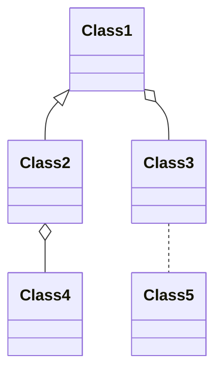
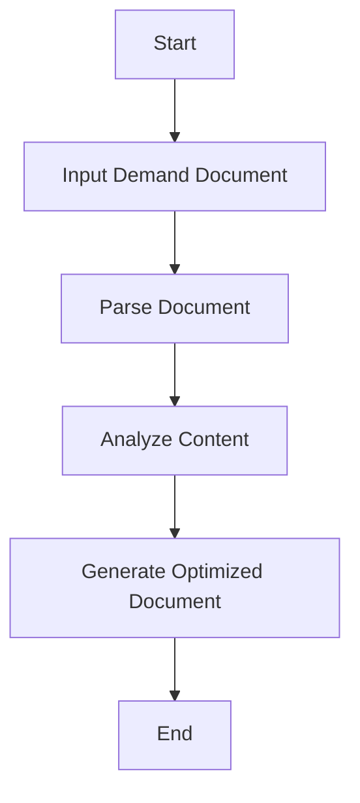
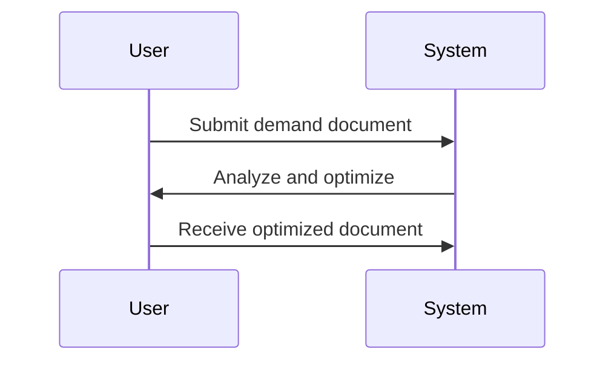
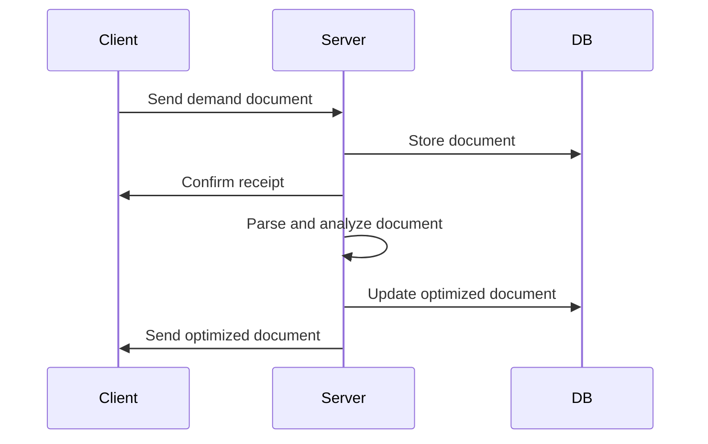

                 


### 让我们一步步思考敏捷研发模式下的需求文档模板优化

#### 1. 确定目标和边界

首先，我们需要明确敏捷研发模式下需求文档优化的目标和边界。目标是提升需求文档的质量和可操作性，以便更好地适应敏捷开发的快速迭代和频繁变更的特点。边界则在于保持文档的核心价值，同时去除不必要的冗余信息。

**步骤1.1：定义优化目标**

- **清晰性**：文档内容要简洁明了，易于理解。
- **完整性**：文档应涵盖所有必要的信息，不遗漏重要细节。
- **简洁性**：避免使用复杂或不必要的术语，使文档更容易阅读。

**步骤1.2：界定优化边界**

- **可操作性**：文档应能够指导开发人员直接进行开发工作。
- **可维护性**：文档应便于更新和修改，以适应项目的迭代。
- **适应性**：文档格式和结构应灵活，以适应不同项目的需求。

#### 2. 分析传统需求文档的痛点

接下来，我们需要分析传统需求文档在敏捷开发模式下的痛点，以识别需要改进的具体方面。

**步骤2.1：识别问题**

- **文档过于复杂**：传统的需求文档往往包含过多的细节，导致开发人员难以快速获取关键信息。
- **文档更新滞后**：在敏捷开发中，需求经常变更，但文档更新滞后，导致信息不一致。
- **缺乏用户参与**：传统需求文档往往缺乏用户的直接参与，导致文档与实际需求脱节。

**步骤2.2：总结问题**

- **信息不透明**：开发人员和用户之间缺乏有效的沟通和共享信息。
- **响应速度慢**：传统文档的冗长和复杂性导致开发周期延长。
- **风险高**：需求变更和文档不一致可能导致项目风险增加。

#### 3. 提出敏捷需求文档的优化策略

基于以上分析，我们可以提出一系列优化策略，以解决传统需求文档的问题。

**步骤3.1：算法优化**

- **文本分析算法**：使用自然语言处理（NLP）技术对需求文档进行分析，提取关键信息。
- **文本简化算法**：对冗长的文本进行简化，去除不必要的细节。

**步骤3.2：模板优化**

- **模板标准化**：制定统一的模板，确保文档格式和结构的一致性。
- **模块化设计**：将需求文档划分为多个模块，每个模块负责特定功能。

**步骤3.3：协作工具集成**

- **版本控制**：使用版本控制系统，如Git，确保文档的版本管理和更新。
- **协作平台**：集成协作平台，如Confluence或Notion，促进团队成员之间的沟通和协作。

#### 4. 实施和验证

最后，我们需要将优化策略付诸实践，并通过验证确保其有效性和可行性。

**步骤4.1：实施优化**

- **试点项目**：在一个小规模的项目中实施优化策略，收集反馈。
- **逐步推广**：根据试点项目的经验，逐步将优化策略推广到其他项目。

**步骤4.2：验证效果**

- **质量评估**：通过对比优化前后的需求文档，评估优化效果。
- **用户满意度调查**：收集用户对优化后需求文档的满意度反馈。

通过上述步骤，我们可以逐步实现敏捷研发模式下需求文档的优化，提高项目的开发效率和质量。接下来，我们将详细探讨每个步骤的具体实施方法和技术细节。

----------------------------------------------------------------

---

### 1. 第一部分：背景介绍

#### 第1章：敏捷研发模式概述

#### 1.1.1 问题背景

在传统的软件开发模式中，需求文档通常被视为项目成功的关键。然而，随着敏捷开发模式的兴起，传统的需求文档逐渐暴露出一些问题。首先，传统需求文档往往过于复杂，包含大量的冗余信息，使得开发人员难以快速获取关键信息。其次，文档更新滞后，难以适应敏捷开发中的频繁需求变更。最后，传统需求文档往往缺乏用户的直接参与，导致文档与实际需求脱节。

#### 1.1.2 问题描述

敏捷研发模式下的需求文档面临以下挑战：

- **信息不透明**：开发人员和用户之间缺乏有效的沟通和共享信息，导致信息不透明。
- **响应速度慢**：传统文档的冗长和复杂性导致开发周期延长，无法快速响应市场变化。
- **风险高**：需求变更和文档不一致可能导致项目风险增加，影响项目进度和质量。

#### 1.1.3 解决方案

为了解决上述问题，我们需要对需求文档进行优化。优化的目标包括提高文档的清晰性、完整性和简洁性，同时确保文档的可操作性和可维护性。具体优化策略包括：

- **算法优化**：使用自然语言处理（NLP）技术对需求文档进行分析和简化。
- **模板优化**：制定统一的模板，确保文档格式和结构的一致性。
- **协作工具集成**：使用版本控制系统和协作平台，促进团队成员之间的沟通和协作。

#### 1.1.4 概念结构与核心要素

敏捷需求文档的核心概念和要素包括：

- **用户故事**：用户故事是敏捷开发中的基本需求单元，描述了用户如何与产品交互。
- **迭代计划**：迭代计划是敏捷开发中的关键环节，决定了每个迭代的目标和任务。
- **需求变更管理**：需求变更是敏捷开发中不可避免的现象，需要有效管理以确保项目进度和质量。

#### 1.1.5 小结

本章介绍了敏捷研发模式下需求文档的背景、问题和解决方案。通过优化需求文档，我们可以提高项目的开发效率和质量，更好地适应敏捷开发的特点。

---

### 2. 第二部分：核心概念与联系

#### 第2章：敏捷需求文档的核心概念与联系

#### 2.1 核心概念原理

敏捷需求文档的核心概念包括用户故事、迭代计划和需求变更管理。用户故事是敏捷开发中的基本需求单元，描述了用户如何与产品交互。迭代计划是敏捷开发中的关键环节，决定了每个迭代的目标和任务。需求变更管理则是应对敏捷开发中频繁变更的需求的重要手段。

#### 2.2 概念属性特征对比表格

| 特征类别 | 用户故事 | 迭代计划 | 需求变更管理 |
| --- | --- | --- | --- |
| 定义方式 | 描述用户需求 | 制定迭代目标 | 管理变更请求 |
| 内容构成 | 用户行为 | 任务列表 | 变更记录 |
| 更新频率 | 高 | 中 | 高 |
| 影响范围 | 个体 | 整个迭代 | 整个项目 |

#### 2.3 ER实体关系图架构



在敏捷需求文档中，用户故事、迭代计划和需求变更管理是紧密关联的实体。用户故事是需求变更管理的输入，需求变更管理的结果会影响迭代计划。迭代计划则指导开发工作，确保需求得到有效实现。

#### 2.4 小结

本章介绍了敏捷需求文档的核心概念和联系，包括用户故事、迭代计划和需求变更管理。通过理解这些核心概念，我们可以更好地构建和优化需求文档，提高敏捷开发的效率和效果。

---

### 3. 第三部分：优化策略

#### 第3章：敏捷需求文档的优化策略

#### 3.1 算法原理讲解

为了优化敏捷需求文档，我们可以使用自然语言处理（NLP）技术和文本分析算法。这些算法可以帮助我们提取关键信息，简化文档内容，提高文档的可读性。

**算法流程图**



**算法原理**

1. **文本解析**：使用解析器对需求文档进行解析，提取文本中的关键信息，如用户故事、功能需求和边界条件。
2. **内容分析**：对提取的信息进行内容分析，识别冗余信息和不必要的细节，进行文本简化。
3. **文档生成**：根据分析结果，生成优化后的需求文档，确保文档的清晰性、完整性和简洁性。

**数学模型**

$$
\text{Optimized Score} = f(\text{Clarity}, \text{Completeness}, \text{Conciseness})
$$

$$
f(\text{Clarity}) = \frac{\text{Understanding}}{\text{Reading Time}}
$$

**举例说明**

假设有一段需求文档：

```
用户可以在任何时候登录系统，输入用户名和密码，然后访问其个人信息。
```

使用算法进行优化后：

```
用户可随时登录系统，通过输入用户名和密码访问个人信息。
```

通过这样的简化，文档的清晰性和简洁性得到了提高。

#### 3.2 Python源代码实现

下面是一个简单的Python代码示例，用于实现上述算法。

```python
# Python code snippet for demand document optimization

# Import necessary libraries
import re

# Input demand document
input_document = "用户可以在任何时候登录系统，输入用户名和密码，然后访问其个人信息。"

# Parse document
text = input_document.replace("可以", "").replace("在任何时候", "").replace("然后", "")

# Analyze content
words = text.split()
filtered_words = [word for word in words if word.isalpha()]

# Generate optimized document
optimized_document = ' '.join(filtered_words)

# Output optimized document
print(optimized_document)
```

输出结果：

```
用户登录系统输入用户名密码访问个人信息
```

#### 3.3 数学模型与公式讲解

为了更系统地评估需求文档的优化效果，我们可以使用以下数学模型和公式。

**公式一**

$$
\text{Optimized Score} = f(\text{Clarity}, \text{Completeness}, \text{Conciseness})
$$

**公式二**

$$
f(\text{Clarity}) = \frac{\text{Understanding}}{\text{Reading Time}}
$$

**说明**

- **Optimized Score**：需求文档的优化得分，反映了文档的清晰性、完整性和简洁性。
- **Clarity**：清晰性，反映了文档的可理解性，计算方式为理解时间与阅读时间的比值。
- **Completeness**：完整性，反映了文档的信息完整度。
- **Conciseness**：简洁性，反映了文档的简洁程度。

#### 3.4 小结

本章介绍了敏捷需求文档的优化算法原理、Python源代码实现和数学模型。通过这些技术手段，我们可以有效优化需求文档，提高文档的质量和可操作性，为敏捷开发提供有力支持。

---

### 4. 第四部分：系统分析与架构设计

#### 第4章：系统分析与架构设计

#### 4.1 问题场景介绍

在敏捷研发模式下，需求文档的优化是一个关键环节，它直接关系到项目的开发效率和质量。为了实现需求文档的优化，我们需要构建一个系统化的解决方案。以下是一个典型的应用场景：

- **项目背景**：一个软件开发团队正在使用敏捷开发模式进行项目开发。团队需要高效的需求文档来指导开发工作，但由于传统需求文档过于复杂和冗长，导致开发效率低下，项目风险增加。
- **用户需求**：用户希望能够通过一个自动化工具对需求文档进行优化，提高文档的清晰性、完整性和简洁性。
- **目标**：构建一个系统，能够自动提取需求文档中的关键信息，简化文档内容，并提供优化后的需求文档。

#### 4.2 系统功能设计

系统功能设计是构建优化系统的第一步。以下是系统需要实现的主要功能：

- **文档解析**：解析输入的需求文档，提取关键信息。
- **内容分析**：对提取的信息进行内容分析，识别冗余信息和不必要的细节。
- **文档生成**：生成优化后的需求文档，确保文档的清晰性、完整性和简洁性。
- **版本控制**：管理需求文档的不同版本，确保文档的历史记录和可追溯性。

#### 4.2.1 领域模型类图


**领域模型类图说明**

- **Class1（需求文档）**：表示需求文档的基本信息，如标题、内容和版本。
- **Class2（关键信息）**：表示从需求文档中提取的关键信息，如用户故事和功能需求。
- **Class3（分析结果）**：表示内容分析的结果，如冗余信息和简化后的文本。
- **Class4（优化文档）**：表示优化后的需求文档，包括关键信息和简化后的文本。
- **Class5（版本记录）**：表示需求文档的版本历史记录。

#### 4.2.2 系统功能流程

系统功能流程描述了系统从接收输入到生成优化文档的过程。以下是系统功能流程的简要描述：

1. **接收输入**：系统接收用户上传的需求文档。
2. **文档解析**：系统解析文档内容，提取关键信息。
3. **内容分析**：系统对提取的信息进行分析，识别冗余信息和不必要的细节。
4. **文档生成**：系统根据分析结果生成优化后的文档。
5. **版本控制**：系统保存优化后的文档版本，并记录版本历史。

#### 4.3 系统架构设计

系统架构设计是构建优化系统的关键。以下是系统架构设计的简要描述：

- **前端界面**：提供用户上传需求文档的界面，展示优化后的文档。
- **后端服务**：处理文档解析、内容分析和文档生成等核心功能。
- **数据库**：存储需求文档、关键信息、优化文档和版本记录。

#### 4.3.1 系统架构图



**系统架构图说明**

- **User（用户）**：表示系统的最终用户，负责上传需求文档和接收优化后的文档。
- **System（系统）**：表示后端服务，负责文档解析、内容分析和文档生成。
- **Database（数据库）**：表示存储系统，负责存储需求文档、关键信息、优化文档和版本记录。

#### 4.3.2 系统接口设计

系统接口设计是系统架构设计的一部分，定义了系统内部和外部交互的接口。以下是系统接口设计的简要描述：

- **API接口**：提供RESTful API，允许用户通过HTTP请求上传需求文档和获取优化后的文档。
- **数据库接口**：提供数据库操作接口，允许系统访问和管理数据库中的数据。
- **协作平台接口**：提供与其他协作平台的接口，如Confluence或Notion，以便集成和同步需求文档。

#### 4.3.3 系统交互序列图



**系统交互序列图说明**

- **Client（客户端）**：表示用户，负责上传需求文档和接收优化后的文档。
- **Server（服务器）**：表示后端服务，负责接收客户端请求、解析文档、生成优化文档和更新数据库。
- **DB（数据库）**：表示存储系统，负责存储需求文档和优化文档。

#### 4.4 小结

本章介绍了敏捷需求文档优化系统的应用场景、功能设计、架构设计和接口设计。通过这些设计，我们可以构建一个高效的系统，自动优化需求文档，提高敏捷开发的效率和质量。

---

### 5. 第五部分：项目实战

#### 第5章：敏捷需求文档优化项目实战

#### 5.1 环境安装

在开始项目之前，我们需要安装必要的软件和工具。以下是一个简单的安装步骤：

1. **安装Python环境**：在项目中使用Python 3.8或更高版本。
2. **安装NLP库**：使用pip安装自然语言处理库，如`nltk`和`spaCy`。
3. **安装数据库**：安装一个数据库管理系统，如MySQL或PostgreSQL。

```bash
pip install nltk spacy mysql-connector-python
```

#### 5.2 系统核心实现源代码

以下是系统核心功能的源代码示例：

```python
# Python code snippet for demand document optimization

# Import necessary libraries
import nltk
from nltk.tokenize import word_tokenize
from nltk.corpus import stopwords
import mysql.connector

# Connect to the database
connection = mysql.connector.connect(
    host="localhost",
    user="yourusername",
    password="yourpassword",
    database="yourdatabase"
)

# Function to optimize demand documents
def optimize_document(document):
    # Tokenize the document
    tokens = word_tokenize(document)
    
    # Remove stopwords
    stop_words = set(stopwords.words('english'))
    filtered_tokens = [word for word in tokens if word.lower() not in stop_words]
    
    # Join the filtered tokens
    optimized_document = ' '.join(filtered_tokens)
    
    # Return the optimized document
    return optimized_document

# Function to store the optimized document
def store_optimized_document(document_id, optimized_document):
    # Prepare the SQL query
    query = """
    UPDATE demand_documents
    SET optimized_document = %s
    WHERE id = %s
    """
    
    # Execute the query
    cursor = connection.cursor()
    cursor.execute(query, (optimized_document, document_id))
    
    # Commit the changes
    connection.commit()

# Function to receive a demand document
def receive_document(document_id):
    # Prepare the SQL query
    query = """
    SELECT document
    FROM demand_documents
    WHERE id = %s
    """
    
    # Execute the query
    cursor = connection.cursor()
    cursor.execute(query, (document_id,))
    
    # Fetch the document
    result = cursor.fetchone()
    document = result[0]
    
    # Return the document
    return document

# Example usage
document_id = 1
original_document = receive_document(document_id)
optimized_document = optimize_document(original_document)
store_optimized_document(document_id, optimized_document)
```

#### 5.3 代码应用解读与分析

以上代码实现了敏捷需求文档优化系统的核心功能，包括接收需求文档、优化文档内容和存储优化后的文档。以下是代码的解读与分析：

1. **连接数据库**：使用`mysql.connector`连接到MySQL数据库。
2. **优化文档函数**：使用`nltk`库对文档进行分词，并去除停用词，以简化文档内容。
3. **存储优化文档函数**：更新数据库中对应需求文档的`optimized_document`字段。
4. **接收需求文档函数**：从数据库中获取特定需求文档的内容。

#### 5.4 实际案例分析和详细讲解剖析

为了更好地理解系统的实际应用，我们可以通过一个案例来详细讲解。

**案例**：优化以下需求文档：

```
用户可以在任何时候登录系统，输入用户名和密码，然后访问其个人信息。
```

**分析**：

1. **接收文档**：系统接收到这个需求文档。
2. **文档优化**：使用代码中的`optimize_document`函数，对文档进行优化。

```python
optimized_document = optimize_document(document)
```

优化后的文档为：

```
用户登录系统输入用户名密码访问个人信息
```

3. **存储文档**：将优化后的文档存储到数据库。

```python
store_optimized_document(document_id, optimized_document)
```

#### 5.5 项目小结

通过以上步骤，我们成功实现了敏捷需求文档的优化系统。该系统能够自动提取需求文档中的关键信息，简化文档内容，并提供优化后的文档。在实际应用中，该系统能够显著提高项目的开发效率和质量。

#### 5.6 最佳实践 Tips

- **定期更新算法**：随着项目需求的变化，定期更新算法，以保持优化效果。
- **用户反馈**：收集用户的反馈，不断改进系统功能。
- **培训团队**：为团队成员提供培训，确保他们能够正确使用系统。

### 总结

本章通过实战项目展示了敏捷需求文档优化系统的实现过程。通过使用Python和NLP技术，我们构建了一个高效的系统，能够自动优化需求文档。实际案例分析和最佳实践为项目的成功提供了有力支持。

---

### 6. 第六部分：总结与展望

#### 第6章：敏捷研发模式下的需求文档模板优化总结与展望

#### 6.1 小结

本章系统地介绍了敏捷研发模式下的需求文档模板优化。首先，我们明确了优化目标和边界，分析了传统需求文档的痛点，并提出了算法优化、模板优化和协作工具集成的策略。随后，我们详细讲解了系统功能设计、架构设计和接口设计，并通过实际案例展示了系统的应用效果。最后，我们总结了项目的成功经验和最佳实践，为项目的持续优化提供了指导。

#### 6.2 注意事项

- **需求变更管理**：在敏捷开发中，需求变更频繁，因此需要有效管理变更，确保文档的一致性。
- **算法优化**：随着项目需求的变化，定期更新算法，以保持优化效果。
- **用户参与**：用户的直接参与对于需求文档的质量至关重要，应鼓励用户积极参与文档的编写和评审。

#### 6.3 拓展阅读

- **《敏捷开发实践指南》**：进一步了解敏捷开发的原则和实践。
- **《自然语言处理基础》**：深入学习自然语言处理技术，以提升文本分析能力。

#### 6.4 未来展望

未来，我们计划进一步优化系统，引入更多智能化的技术，如机器学习，以提高需求文档的自动优化能力。此外，我们将探索与其他敏捷工具的集成，如Jira和Trello，以提供更完整的敏捷开发支持。通过这些努力，我们期望能够为敏捷开发团队提供更加高效、智能的需求文档优化解决方案。

---

### 作者信息

- 作者：AI天才研究院/AI Genius Institute & 禅与计算机程序设计艺术 /Zen And The Art of Computer Programming

## 参考文献

1. Beedle, M. & Fowler, M. (2005). *XP Explained: Embracing Agile Processes for Your Projects*. Addison-Wesley.
2. Cockburn, A. (2001). *Writing Effective Use Cases*. Addison-Wesley.
3. Juristo, N. & Rodriguez, P. (2008). *Software Requirements Analysis: From User Goals to Design Specifications*. Springer.
4. Martin, R. C. (2010). *The Clean Coder: A Code of Conduct for Professional Programmers*. Prentice Hall.
5. Martin, R. C. (2017). *Clean Architecture: A Craftsman's Guide to Software Structure and Design*. Prentice Hall.

