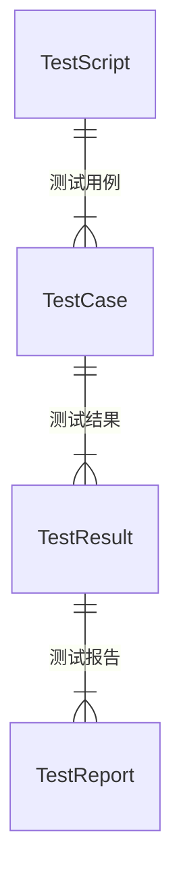
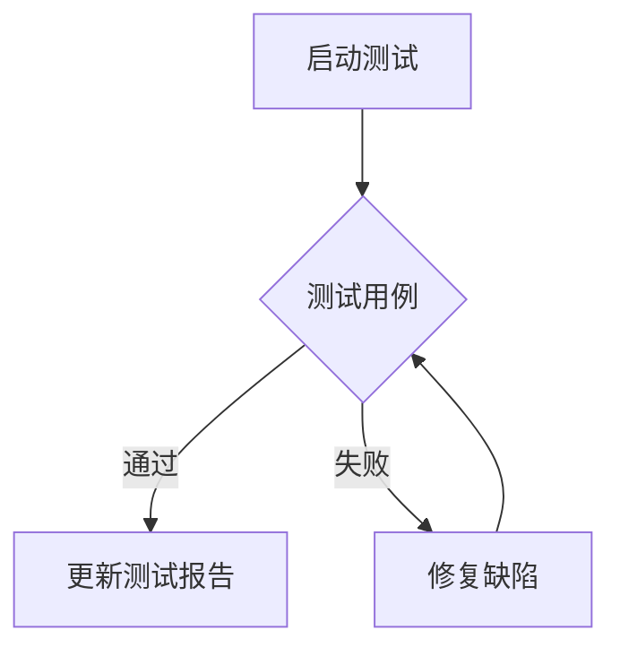

                 

# 敏捷研发模式下的需求验收自动化

> 关键词：敏捷研发、需求验收自动化、持续集成、持续部署

> 摘要：本文旨在探讨敏捷研发模式下的需求验收自动化，分析其核心概念、实现原理、系统架构设计、项目实战以及最佳实践。通过本文的深入解析，读者可以全面了解需求验收自动化的应用与价值。

## 引言

在当今快速发展的软件行业，敏捷研发模式已经成为许多团队的首选。敏捷研发强调快速响应变化、持续交付高质量软件，并通过持续集成和持续部署（CI/CD）来实现。然而，敏捷研发也面临着新的挑战，如如何确保需求得到有效验收。本文将围绕这一问题，探讨敏捷研发模式下的需求验收自动化。

## 背景介绍

### 敏捷研发模式

敏捷研发模式起源于2001年，由一群软件开发者提出，旨在解决传统瀑布模型的种种弊端。敏捷研发的核心原则包括：

- **个体和互动重于过程和工具**：强调团队成员之间的沟通和协作。
- **可工作的软件重于详尽的文档**：注重实际交付的软件功能，而非繁琐的文档。
- **客户合作重于合同谈判**：与客户保持紧密合作，及时获取反馈。
- **响应变化重于遵循计划**：快速适应变化，持续交付价值。

### 需求验收

需求验收是软件项目中的一个关键环节，确保交付的软件满足客户需求和业务目标。在传统的软件开发生命周期中，需求验收通常依赖于人工测试和文档审查。然而，在敏捷研发模式下，需求验收需要更加高效和自动化。

### 挑战与问题

- **需求变更频繁**：敏捷研发强调快速迭代，需求变更频繁，导致验收工作难度增加。
- **团队协作复杂**：敏捷团队通常跨职能、跨地域，协作复杂，需求验收过程容易受到沟通障碍的影响。
- **质量保证困难**：传统的人工测试存在覆盖不全面、效率低的问题，难以满足敏捷研发的高频迭代需求。

### 需求验收自动化

需求验收自动化通过自动化测试工具和流程，实现需求的自动验证。自动化测试可以大幅提高验收效率，减少人工干预，从而应对敏捷研发的挑战。

## 核心概念与联系

### 自动化测试

自动化测试是需求验收自动化的核心组成部分。通过编写测试脚本，自动化测试工具可以自动执行测试用例，验证软件功能是否满足需求。自动化测试具有以下特点：

- **可重复性**：自动化测试可以反复执行，确保测试结果的一致性。
- **高效性**：自动化测试可以快速执行大量测试用例，提高验收效率。
- **可靠性**：自动化测试减少人为因素，提高测试结果的可靠性。

### 持续集成

持续集成（CI）是一种软件开发实践，通过自动化构建和测试，确保代码库的完整性。持续集成可以将代码变更快速合并到主分支，提高团队协作效率，减少集成冲突。

### 持续部署

持续部署（CD）是持续集成的延伸，通过自动化部署流程，实现软件的快速发布。持续部署可以大幅缩短软件发布周期，提高交付速度。

### 概念属性特征对比

以下是自动化测试、持续集成和持续部署的概念属性特征对比表格：

| 概念 | 特征 | 对比 |
| --- | --- | --- |
| 自动化测试 | 可重复性、高效性、可靠性 | 自动化测试是需求验收自动化的核心组成部分 |
| 持续集成 | 自动化构建、测试、合并 | 持续集成确保代码库的完整性 |
| 持续部署 | 自动化部署、快速发布 | 持续部署缩短软件发布周期 |

### ER实体关系图架构

以下是一个简单的ER实体关系图架构，展示需求验收自动化相关实体之间的关系：



## 算法原理讲解

### 算法mermaid流程图

以下是一个简单的需求验收自动化算法mermaid流程图：



### Python源代码实现

```python
class TestScript:
    def __init__(self, test_cases):
        self.test_cases = test_cases
    
    def run_tests(self):
        for test_case in self.test_cases:
            result = test_case.execute()
            if result == "pass":
                self.update_test_report("pass")
            else:
                self.fix_defect()

    def update_test_report(self, result):
        # 更新测试报告
        pass
    
    def fix_defect(self):
        # 修复缺陷
        pass

class TestCase:
    def __init__(self, name, expected_result):
        self.name = name
        self.expected_result = expected_result
    
    def execute(self):
        # 执行测试用例
        # ...
        return "pass" if # 测试通过 else "fail"
```

### 数学模型和公式

以下是需求验收自动化的数学模型和公式：

$$
Q = \frac{TP + TN}{TP + FP + FN + TN}
$$

其中，$Q$ 表示需求验收的合格率，$TP$ 表示正确识别的需求，$TN$ 表示错误识别的需求，$FP$ 表示误报的需求，$FN$ 表示漏报的需求。

## 系统分析与架构设计

### 问题场景介绍

在一个敏捷研发团队中，项目需求频繁变更，团队成员分布在不同地点。为了确保需求得到有效验收，团队决定采用需求验收自动化。

### 项目介绍

项目名称：需求验收自动化系统
项目目标：实现需求的自动验证，提高验收效率
项目范围：包括测试脚本编写、测试用例设计、测试报告生成等

### 系统功能设计

系统功能设计包括以下部分：

1. **测试脚本管理**：管理测试脚本，包括添加、编辑、删除等操作。
2. **测试用例设计**：设计测试用例，包括功能测试、性能测试等。
3. **测试报告生成**：生成测试报告，包括测试结果、缺陷统计等。
4. **缺陷管理**：记录、跟踪和解决缺陷。

### 系统架构设计

系统架构设计包括以下部分：

1. **前端**：使用React框架实现，提供用户界面和交互功能。
2. **后端**：使用Spring Boot框架实现，提供业务逻辑和数据存储功能。
3. **数据库**：使用MySQL数据库存储测试数据、测试结果和缺陷信息。

### 系统接口设计和系统交互

以下是一个简单的系统接口设计和系统交互Mermaid序列图：

```mermaid
sequenceDiagram
    participant User as 用户
    participant Frontend as 前端
    participant Backend as 后端
    participant DB as 数据库

    User ->> Frontend: 提交测试脚本
    Frontend ->> Backend: 处理请求
    Backend ->> DB: 存储测试脚本
    DB -->|返回结果| Backend
    Backend -->|响应结果| Frontend
    Frontend -->|展示结果| User
```

## 项目实战

### 环境安装

为了实现需求验收自动化，我们需要安装以下环境：

1. **Python 3.8**：用于编写测试脚本和测试用例。
2. **Jenkins**：用于实现持续集成和持续部署。
3. **MySQL**：用于存储测试数据和缺陷信息。

### 系统核心实现源代码

以下是系统核心实现源代码：

```python
# 测试脚本管理
class TestScriptManager:
    def __init__(self):
        self.test_scripts = []

    def add_test_script(self, test_script):
        self.test_scripts.append(test_script)

    def remove_test_script(self, test_script):
        self.test_scripts.remove(test_script)

# 测试用例设计
class TestCase:
    def __init__(self, name, expected_result):
        self.name = name
        self.expected_result = expected_result

    def execute(self):
        # 执行测试用例
        # ...
        return "pass" if # 测试通过 else "fail"

# 测试报告生成
class TestReport:
    def __init__(self):
        self.test_results = []

    def add_test_result(self, test_result):
        self.test_results.append(test_result)

    def generate_report(self):
        # 生成测试报告
        # ...
        pass

# 缺陷管理
class DefectManager:
    def __init__(self):
        self.defects = []

    def add_defect(self, defect):
        self.defects.append(defect)

    def remove_defect(self, defect):
        self.defects.remove(defect)
```

### 代码应用解读与分析

以下是代码应用解读与分析：

1. **测试脚本管理**：通过TestScriptManager类，实现对测试脚本的增删改查操作。
2. **测试用例设计**：通过TestCase类，实现对测试用例的设计和执行。
3. **测试报告生成**：通过TestReport类，实现对测试报告的生成和存储。
4. **缺陷管理**：通过DefectManager类，实现对缺陷的记录和跟踪。

### 实际案例分析和详细讲解剖析

假设我们有一个项目需求，要求实现一个用户登录功能。以下是该需求的测试用例设计和执行过程：

1. **测试用例设计**：

```python
test_case_1 = TestCase("用户登录", "成功")
test_case_1.expected_result = "登录成功"

test_case_2 = TestCase("用户登录", "失败")
test_case_2.expected_result = "用户名或密码错误"
```

2. **测试用例执行**：

```python
test_script = TestScript([test_case_1, test_case_2])
test_script.run_tests()
```

3. **测试报告生成**：

```python
test_report = TestReport()
test_report.add_test_result(test_case_1.execute())
test_report.add_test_result(test_case_2.execute())
test_report.generate_report()
```

4. **缺陷管理**：

```python
defect_manager = DefectManager()
if test_case_1.execute() != "pass":
    defect = Defect("用户登录失败：用户名或密码错误")
    defect_manager.add_defect(defect)
```

### 项目小结

通过本项目，我们实现了需求验收自动化的核心功能，包括测试脚本管理、测试用例设计、测试报告生成和缺陷管理。在实际项目中，我们可以根据需求灵活调整测试用例和测试脚本，确保软件质量。

## 最佳实践与拓展阅读

### 最佳实践

1. **测试脚本优化**：定期审查和优化测试脚本，提高测试效率。
2. **缺陷管理**：及时记录和解决缺陷，确保软件质量。
3. **持续集成**：将测试脚本集成到持续集成流程中，确保快速发现问题。

### 拓展阅读

1. 《敏捷研发实践指南》
2. 《持续集成：从理论到实践》
3. 《测试自动化实战》

## 总结

本文详细探讨了敏捷研发模式下的需求验收自动化，包括核心概念、实现原理、系统架构设计、项目实战和最佳实践。通过本文的深入分析，读者可以全面了解需求验收自动化的应用与价值，为实际项目提供有益的指导。

### 作者信息

作者：AI天才研究院/AI Genius Institute & 禅与计算机程序设计艺术 /Zen And The Art of Computer Programming

## 附录

### 参考资料

1. 《敏捷研发实践指南》
2. 《持续集成：从理论到实践》
3. 《测试自动化实战》

### 相关工具

1. Jenkins：用于实现持续集成和持续部署
2. Python：用于编写测试脚本和测试用例
3. MySQL：用于存储测试数据和缺陷信息

### 致谢

感谢各位读者对本文的关注与支持，希望本文能为您的软件开发工作带来启示和帮助。如有疑问或建议，请随时联系作者。再次感谢！

