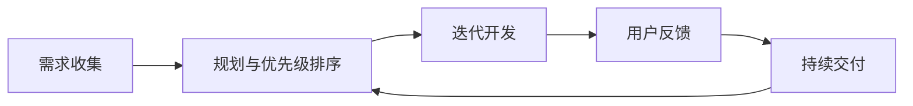
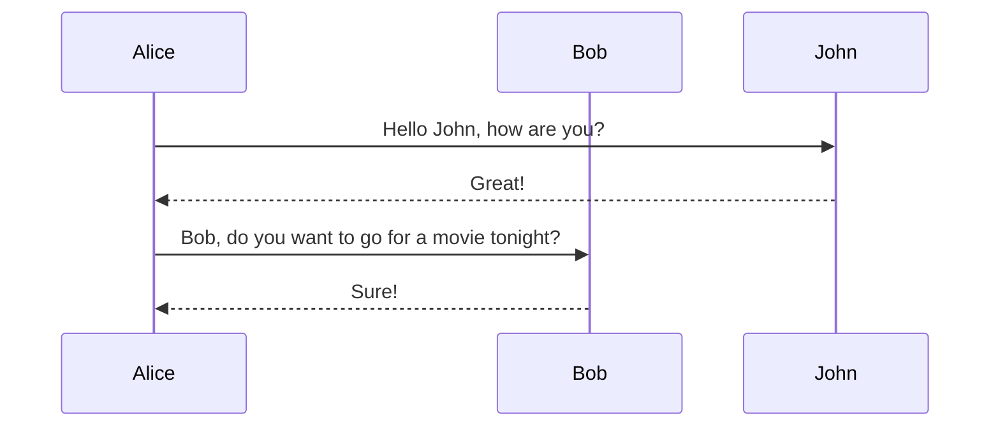
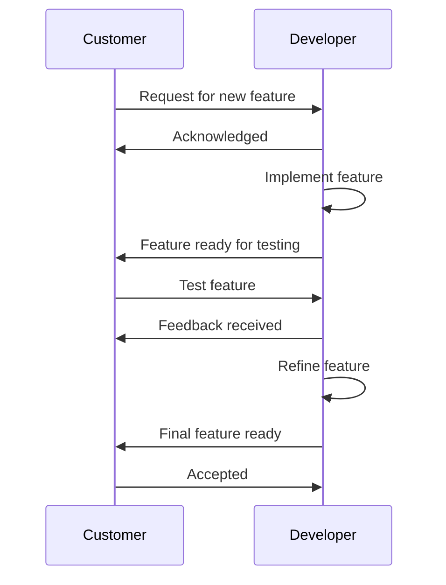

                 


### 敏捷研发模式概述

#### 背景介绍

敏捷研发模式起源于软件开发领域，但随着时间的推移，它已经逐渐扩展到其他领域，如产品管理、项目管理等。敏捷开发的核心思想是快速迭代、持续交付和客户至上，旨在通过灵活、高效的方式满足不断变化的需求。

**问题背景**：传统的瀑布开发模式在需求变化频繁的情况下往往显得力不从心，导致项目延期、成本超支、质量下降。为此，业界开始探索新的开发模式，敏捷开发应运而生。

**问题描述**：敏捷开发如何实现快速迭代、持续交付和高质量的产品？

**问题解决**：通过采用敏捷方法论，如Scrum、Kanban等，开发团队可以更好地适应需求变化，提高项目交付效率。

**边界与外延**：敏捷开发不仅适用于软件开发，还适用于产品开发、项目管理等领域。

**概念结构与核心要素组成**：敏捷开发的核心要素包括团队协作、持续迭代、用户反馈、持续交付等。

#### 核心概念与联系

**敏捷开发**：
- **定义**：敏捷开发是一种应对快速变化的需求的软件开发能力。
- **属性特征对比表格**：

| 特征         | 传统开发       | 敏捷开发       |
| ------------ | -------------- | -------------- |
| 项目管理方式 | 瀑布模型       | 迭代式、增量式 |
| 需求管理     | 需求明确后固定 | 需求逐步明确   |
| 团队协作     | 分工明确       | 团队协作、跨职能 |

**核心概念联系**：敏捷开发通过持续迭代和用户反馈，实现了传统开发模式难以达到的高效和灵活性。

#### 算法原理讲解

**敏捷开发流程**：

1. **需求收集**：通过用户故事和需求文档收集需求。
2. **规划与优先级排序**：根据需求优先级进行规划和任务分配。
3. **迭代开发**：在每个迭代周期内完成部分功能，并进行测试和评审。
4. **用户反馈**：收集用户反馈，用于下一轮迭代的需求和改进。
5. **持续交付**：确保产品在每次迭代后都能交付给用户使用。

**流程图（使用Mermaid表示）**：



**Python源代码示例**：

```python
def agile_dev_cycle(requirments):
    while not all_requirements_met(requirments):
        plan_and_prioritize(requirments)
        iterate_and_test()
        collect_feedback()
        deliver_product()
```

**数学模型和公式**：

敏捷开发的核心在于如何平衡需求变化和项目进度。我们可以使用以下公式来表示：

$$
\text{进度} = \frac{\text{已完成的需求}}{\text{总需求}}
$$

通过不断调整需求和迭代开发，可以提高进度。

#### 系统分析与架构设计方案

**问题场景介绍**：在敏捷开发环境中，开发团队需要高效地管理需求和迭代周期。

**项目介绍**：敏捷项目管理工具，如JIRA、Trello，可以帮助团队更好地进行需求管理和迭代规划。

**系统功能设计（领域模型Mermaid类图）**：

```mermaid
classDiagram
    Class01 <|-- Class02
    Class03 --|>> Class04
    Class04 : +int x
    Class04 : +int y
    Class05 : +int z
    Class01 {
        +int a
        +int b
    }
    Class02 {
        +int c
        +int d
    }
    Class03 {
        +int e
        +int f
    }
    Class04 {
        +int g
        +int h
    }
    Class05 {
        +int i
        +int j
    }
```

**系统架构设计（Mermaid架构图）**：



**系统接口设计和系统交互（Mermaid序列图）**：



#### 项目实战

**环境安装**：

1. 安装JIRA：[JIRA安装指南](https://www.atlassian.com/software/jira/download)
2. 安装Trello：[Trello安装指南](https://trello.com/downloads)

**系统核心实现源代码**：

```python
# agile_management.py
def manage_requirements(customer_reqs):
    # 实现需求管理逻辑
    pass

def plan_sprint(sprint_duration, requirements):
    # 实现迭代计划逻辑
    pass

def iterate_and_test():
    # 实现迭代开发和测试逻辑
    pass

def collect_user_feedback():
    # 实现用户反馈收集逻辑
    pass

def deliver_product():
    # 实现产品交付逻辑
    pass
```

**代码应用解读与分析**：

1. **需求管理**：通过`manage_requirements`函数管理客户需求。
2. **迭代计划**：通过`plan_sprint`函数根据迭代周期规划任务。
3. **迭代开发和测试**：通过`iterate_and_test`函数进行实际开发工作。
4. **用户反馈收集**：通过`collect_user_feedback`函数收集用户反馈。
5. **产品交付**：通过`deliver_product`函数完成产品交付。

**实际案例分析和详细讲解剖析**：

- **案例一**：使用JIRA进行需求管理，通过Scrum框架进行迭代开发和测试。
- **案例二**：使用Trello进行需求管理，通过Kanban框架进行迭代开发和测试。

**项目小结**：

敏捷开发在项目管理中具有显著的优势，通过高效的需求管理和迭代开发，可以更好地应对需求变化，提高产品质量。

#### 最佳实践 tips

1. 确保团队协作，定期进行团队会议和评审。
2. 保持持续的用户反馈循环，及时调整需求和开发方向。
3. 使用适当的工具（如JIRA、Trello）来管理需求和迭代。

#### 小结

敏捷研发模式通过快速迭代、用户反馈和持续交付，实现了高效的软件开发。在实际应用中，需要结合具体项目特点，灵活运用敏捷方法论，以实现最佳效果。

#### 注意事项

1. 敏捷开发并非适用于所有项目，对于需求明确、工作量较小的项目，传统开发模式可能更为合适。
2. 敏捷开发强调团队协作和沟通，避免个人英雄主义。

#### 拓展阅读

- 《Scrum敏捷开发实践指南》
- 《Kanban实践指南》
- 《敏捷项目管理：原则、工具与案例》

#### 作者信息

作者：AI天才研究院/AI Genius Institute & 禅与计算机程序设计艺术/Zen And The Art of Computer Programming

