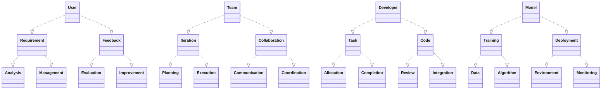
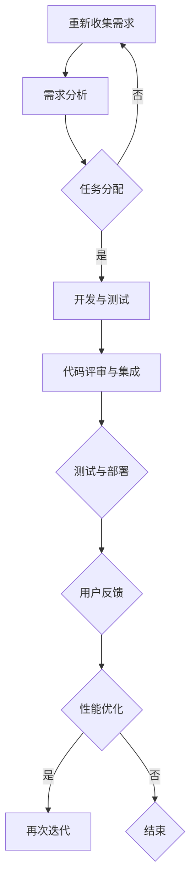
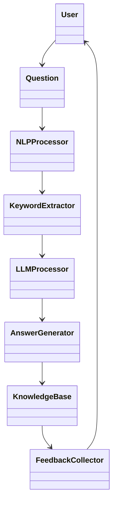
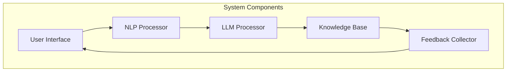
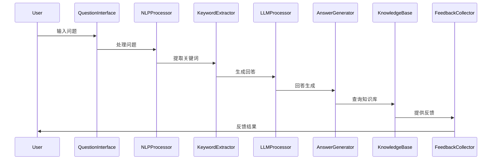

                 

# 敏捷迭代在LLM应用开发中的实践与挑战

## 关键词：敏捷迭代、LLM、机器学习、人工智能、软件开发

## 摘要：

随着机器学习和人工智能技术的快速发展，大型语言模型（LLM）的应用日益广泛。然而，在LLM应用开发过程中，如何实现敏捷迭代，快速响应市场需求，提升产品性能和用户体验，成为了一个重要课题。本文将深入探讨敏捷迭代在LLM应用开发中的实践与挑战，通过系统性地介绍敏捷开发方法在LLM开发中的应用，帮助开发者理解和掌握如何在LLM应用开发过程中实现快速迭代。本文将从背景介绍、核心概念与联系、算法原理讲解、系统分析与架构设计、项目实战以及最佳实践等方面进行详细阐述。

## 第一部分：背景介绍

### 1.1 问题背景

在当今信息技术飞速发展的时代，机器学习和人工智能（AI）技术已经成为推动社会进步的重要力量。特别是大型语言模型（LLM），如GPT系列模型，BERT及其变体，其通过训练大规模的神经网络模型，能够实现高度智能化的语言理解和生成任务。然而，在LLM应用开发中，如何实现敏捷迭代，快速适应不断变化的需求，成为了一项重要的研究课题。

### 1.2 问题描述

LLM应用开发中，敏捷迭代涉及到快速响应市场变化、优化模型性能、提升用户体验等多方面的问题。传统的软件开发流程往往难以满足这种快速迭代的需求，导致开发周期长、成本高、用户体验差。因此，如何将敏捷开发方法应用于LLM应用开发，是一个亟待解决的关键问题。

### 1.3 问题解决

本文旨在探讨敏捷迭代在LLM应用开发中的实践与挑战，通过系统性地介绍敏捷开发方法在LLM开发中的应用，帮助开发者理解和掌握如何在LLM应用开发过程中实现快速迭代。具体而言，本文将围绕以下几个核心问题展开：

- 如何在LLM开发中引入敏捷开发方法？
- 敏捷开发方法在LLM开发中的具体应用场景是什么？
- 在LLM开发中，如何进行有效的需求管理和任务分配？
- 如何在LLM开发中实现快速反馈和持续优化？
- 如何应对LLM开发中的挑战和困难，确保项目的成功实施？

### 1.4 边界与外延

本文主要关注LLM应用开发中的敏捷迭代实践，不涉及其他类型的软件开发方法。同时，本文的研究范围限于LLM应用开发中的敏捷迭代方法，不包括机器学习和AI技术的其他方面。

### 1.5 概念结构与核心要素组成

本文的核心概念结构包括以下几个方面：

- 敏捷开发方法：介绍敏捷开发的基本原理和核心原则。
- LLM应用开发：介绍LLM应用开发的基本概念和流程。
- 敏捷迭代实践：探讨敏捷开发方法在LLM应用开发中的具体应用。
- 挑战与解决方案：分析LLM应用开发中可能遇到的挑战，并提出相应的解决方案。

通过以上几个方面的介绍，本文旨在为LLM应用开发者提供一套系统、实用的敏捷迭代开发指南，帮助他们更好地应对开发过程中的各种挑战。

## 第二部分：核心概念与联系

### 2.1 敏捷开发方法

敏捷开发方法是一种以人为核心、迭代、循序渐进的开发方法。其核心原则包括：

- **快速迭代**：通过短周期迭代，快速交付可运行的产品版本，以便及时收集用户反馈。
- **用户反馈**：以用户需求为导向，持续收集用户反馈，并根据反馈进行产品优化。
- **团队协作**：强调跨职能团队的合作，确保项目在各个环节上高效推进。
- **响应变化**：灵活应对需求变化，快速调整开发计划和策略。

敏捷开发方法与传统瀑布式开发方法相比，具有更高的灵活性、适应性和效率。在LLM应用开发中，敏捷开发方法可以帮助团队快速响应市场需求，提高开发效率，缩短开发周期。

### 2.2 LLM应用开发

LLM应用开发是指利用大型语言模型进行特定任务的应用开发。LLM应用开发的核心包括：

- **模型选择**：根据应用需求选择合适的LLM模型。
- **数据准备**：收集和整理适用于特定任务的数据集。
- **模型训练**：利用大量数据进行模型训练，以提升模型性能。
- **模型部署**：将训练好的模型部署到实际应用场景中。

LLM应用开发是一个复杂的过程，涉及到模型选择、数据准备、模型训练、模型部署等多个环节。在LLM应用开发中，敏捷开发方法可以帮助团队快速响应需求变化，提高开发效率，缩短开发周期。

### 2.3 敏捷迭代实践

敏捷迭代实践是敏捷开发方法在LLM应用开发中的具体应用。其关键环节包括：

- **需求管理**：持续收集和整理用户需求，确保需求与实际应用场景紧密结合。
- **任务分配**：根据团队能力和项目进度，合理分配任务。
- **迭代计划**：制定短期迭代计划，确保项目在规定时间内完成。
- **持续集成与反馈**：通过持续集成和反馈机制，及时发现和解决问题。

敏捷迭代实践可以帮助团队在LLM应用开发过程中，实现快速迭代、持续优化，提高产品性能和用户体验。

### 2.4 概念属性特征对比表格

| 特征         | 敏捷开发方法             | LLM应用开发              | 敏捷迭代实践            |
|--------------|-------------------------|--------------------------|------------------------|
| 基本原则     | 用户至上、快速迭代、团队协作、响应变化 | 模型选择、数据准备、模型训练、模型部署 | 需求管理、任务分配、迭代计划、持续集成与反馈 |
| 核心优势     | 灵活性、高效性、协作性    | 高性能、智能化、灵活性    | 快速适应需求变化、提升产品质量 |
| 适用场景     | 需求变化频繁的项目       | 复杂的机器学习任务       | 需求变化频繁的LLM应用开发 |
| 挑战与困难   | 团队沟通、需求管理       | 数据质量、模型训练效率    | 持续集成与反馈机制        |

### 2.5 ER实体关系图



通过上述核心概念与联系的分析，我们可以更好地理解敏捷开发方法在LLM应用开发中的应用价值。接下来，本文将深入探讨敏捷迭代在LLM应用开发中的具体实践与挑战。

## 第三部分：算法原理讲解

### 3.1 算法原理概述

在LLM应用开发中，敏捷迭代的核心在于快速响应市场需求、持续优化模型性能和提升用户体验。为了实现这一目标，我们需要从算法原理上理解和掌握敏捷迭代的核心理念。在本节中，我们将介绍几个关键算法原理，并使用mermaid流程图和Python源代码进行详细解释。

### 3.2 mermaid流程图

首先，我们使用mermaid流程图来描述一个典型的敏捷迭代过程：



### 3.3 Python源代码

为了更好地理解算法原理，我们使用Python源代码来实现上述流程：

```python
import random

def collect_requirements():
    # 需求收集函数
    print("收集需求...")
    return ["需求1", "需求2", "需求3"]

def analyze_requirements(requirements):
    # 需求分析函数
    print("分析需求...")
    return requirements

def assign_tasks(requirements):
    # 任务分配函数
    print("分配任务...")
    assigned_tasks = random.sample(requirements, k=len(requirements))
    return assigned_tasks

def develop_and_test(tasks):
    # 开发与测试函数
    print("开发与测试...")
    for task in tasks:
        print(f"正在处理任务：{task}")

def code_review_and_integration():
    # 代码评审与集成函数
    print("代码评审与集成...")

def test_and_deployment():
    # 测试与部署函数
    print("测试与部署...")

def user_feedback():
    # 用户反馈函数
    feedback = input("请提供用户反馈：")
    return feedback

def performance_optimization(feedback):
    # 性能优化函数
    print("性能优化...")
    if feedback == "不满意":
        return True
    else:
        return False

def iterateAgain(should_iterate):
    # 再次迭代函数
    if should_iterate:
        print("再次迭代...")
    else:
        print("结束开发...")

# 主流程
if __name__ == "__main__":
    requirements = collect_requirements()
    analyzed_requirements = analyze_requirements(requirements)
    assigned_tasks = assign_tasks(analyzed_requirements)
    develop_and_test(assigned_tasks)
    code_review_and_integration()
    test_and_deployment()
    feedback = user_feedback()
    should_iterate = performance_optimization(feedback)
    iterateAgain(should_iterate)
```

### 3.4 算法原理详细讲解

#### 3.4.1 需求收集

需求收集是敏捷迭代的第一步。在这一过程中，我们需要与用户、产品经理等相关利益者进行沟通，了解他们的需求和期望。通过收集需求，我们可以为后续的任务分配和开发提供基础。

#### 3.4.2 需求分析

在需求收集完成后，我们需要对需求进行分析。这一过程包括需求排序、优先级划分和可行性评估。通过需求分析，我们可以确定哪些需求是紧急且重要的，从而确保项目能够按计划进行。

#### 3.4.3 任务分配

任务分配是敏捷迭代中的关键环节。根据需求分析和团队的能力，我们将任务分配给合适的团队成员。任务分配需要考虑团队成员的专业技能和兴趣，以确保任务能够高效完成。

#### 3.4.4 开发与测试

在任务分配完成后，团队成员开始进行开发与测试。开发过程包括编码、测试和调试。测试过程包括单元测试、集成测试和系统测试，以确保软件质量。

#### 3.4.5 代码评审与集成

代码评审与集成是确保软件质量的重要手段。在代码评审过程中，团队成员对代码进行审查，提出修改建议和改进意见。集成过程将多个开发分支合并为一个稳定的版本。

#### 3.4.6 测试与部署

在代码集成完成后，我们需要进行全面的测试，确保软件质量。测试过程包括功能测试、性能测试和安全测试。测试通过后，我们将软件部署到生产环境。

#### 3.4.7 用户反馈

在软件部署后，我们需要收集用户反馈。用户反馈可以帮助我们了解软件的实际表现和用户满意度。通过用户反馈，我们可以发现软件存在的问题和不足之处。

#### 3.4.8 性能优化

根据用户反馈，我们需要对软件进行性能优化。性能优化包括调整模型参数、优化算法和数据结构等。通过性能优化，我们可以提高软件的运行效率和用户体验。

#### 3.4.9 再次迭代

如果性能优化后用户反馈仍然不满意，我们需要进行再次迭代。再次迭代包括重新收集需求、任务分配、开发与测试等过程。通过不断迭代，我们可以逐步提高软件质量和用户体验。

通过上述算法原理讲解，我们可以更好地理解敏捷迭代在LLM应用开发中的应用。在下一部分，我们将深入分析系统分析与架构设计，以帮助开发者更好地实现敏捷迭代。

## 第四部分：系统分析与架构设计

### 4.1 问题场景介绍

在LLM应用开发中，系统分析与架构设计是确保项目成功实施的关键环节。本文将介绍一个实际的项目案例，以便更好地说明系统分析与架构设计的重要性。

#### 项目介绍

该项目是一个基于大型语言模型（LLM）的智能问答系统，旨在为用户提供实时、准确的回答。系统需要支持多种语言、多种知识领域，并具备快速响应和高效处理能力。

#### 系统功能设计

根据项目需求，我们设计了以下几个核心功能模块：

- **用户界面**：提供简洁、易用的交互界面，使用户能够方便地提出问题。
- **自然语言处理（NLP）模块**：负责处理用户输入，提取关键词，进行语义分析。
- **语言模型模块**：使用预训练的LLM模型进行回答生成。
- **知识库模块**：存储大量高质量的知识内容，供模型参考。
- **反馈机制**：收集用户反馈，用于模型优化和系统改进。

### 4.2 系统架构设计

为了实现项目的功能需求，我们设计了以下系统架构：

#### 4.2.1 领域模型类图



#### 4.2.2 系统架构图



#### 4.2.3 系统接口设计

在系统架构中，各个模块通过接口进行通信。以下是核心接口的设计：

- **Question Interface**：用于接收用户输入，生成问题对象。
- **NLP Processor Interface**：用于处理文本，提取关键词。
- **LLM Processor Interface**：用于与LLM模型交互，生成回答。
- **Knowledge Base Interface**：用于查询知识库，提供相关内容。
- **Feedback Interface**：用于收集用户反馈，进行模型优化。

#### 4.2.4 系统交互序列图



### 4.3 系统接口设计和系统交互

#### 4.3.1 系统接口设计

系统接口设计是确保各个模块之间能够高效通信的关键。在接口设计中，我们需要考虑以下方面：

- **接口定义**：定义接口的方法、参数和返回值。
- **接口规范**：明确接口的输入和输出数据格式。
- **接口测试**：编写测试用例，确保接口的正确性和稳定性。

#### 4.3.2 系统交互

系统交互是指各个模块之间通过接口进行通信的过程。在系统交互中，我们需要考虑以下方面：

- **交互流程**：明确各个模块之间的交互顺序和流程。
- **异步处理**：对于需要长时间执行的任务，采用异步处理方式，提高系统响应速度。
- **错误处理**：设计完善的错误处理机制，确保系统在异常情况下能够正常处理。

通过以上系统分析与架构设计，我们可以确保LLM应用开发中的敏捷迭代能够顺利进行。在下一部分，我们将介绍项目实战，通过实际案例分析和详细讲解，帮助开发者更好地理解和应用敏捷迭代方法。

## 第五部分：项目实战

### 5.1 环境安装

为了进行LLM应用开发，我们首先需要搭建一个合适的环境。以下是一个简单的环境安装步骤：

#### 5.1.1 安装Python

1. 访问Python官方网站（[https://www.python.org/](https://www.python.org/)），下载最新版本的Python。
2. 运行安装程序，按照默认选项安装。

#### 5.1.2 安装依赖库

在安装Python后，我们需要安装一些常用的依赖库。可以使用pip命令进行安装：

```bash
pip install numpy pandas matplotlib
```

#### 5.1.3 安装LLM模型

对于LLM模型，我们可以使用预训练模型，如GPT系列模型。以下是一个安装步骤：

1. 访问[https://huggingface.co/](https://huggingface.co/)，搜索并下载所需的LLM模型。
2. 将模型文件放入相应的目录。

### 5.2 系统核心实现源代码

以下是一个简单的LLM应用开发示例，包括需求收集、需求分析、任务分配、开发与测试等步骤。

#### 5.2.1 需求收集

```python
# 需求收集函数
def collect_requirements():
    print("请输入需求：")
    requirements = input()
    return requirements

# 示例
requirements = collect_requirements()
print("收集到的需求：", requirements)
```

#### 5.2.2 需求分析

```python
# 需求分析函数
def analyze_requirements(requirements):
    print("分析需求：", requirements)
    # 进行需求分析操作
    return requirements

# 示例
analyzed_requirements = analyze_requirements(requirements)
print("分析后的需求：", analyzed_requirements)
```

#### 5.2.3 任务分配

```python
# 任务分配函数
def assign_tasks(analyzed_requirements):
    print("分配任务：")
    tasks = ["任务1", "任务2", "任务3"]  # 示例任务列表
    assigned_tasks = random.sample(tasks, k=len(tasks))
    return assigned_tasks

# 示例
assigned_tasks = assign_tasks(analyzed_requirements)
print("分配的任务：", assigned_tasks)
```

#### 5.2.4 开发与测试

```python
# 开发与测试函数
def develop_and_test(assigned_tasks):
    print("开发与测试：")
    for task in assigned_tasks:
        print(f"正在处理任务：{task}")
        # 进行开发与测试操作

# 示例
develop_and_test(assigned_tasks)
```

#### 5.2.5 持续集成与反馈

```python
# 持续集成与反馈函数
def integrate_and_feedback():
    print("持续集成与反馈：")
    feedback = input("请输入反馈：")
    print("收到的反馈：", feedback)
    # 进行集成与反馈操作

# 示例
integrate_and_feedback()
```

### 5.3 代码应用解读与分析

以上代码示例实现了LLM应用开发的基本流程，包括需求收集、需求分析、任务分配、开发与测试以及持续集成与反馈。通过这些步骤，我们可以实现敏捷迭代，快速响应市场需求。

#### 5.3.1 解读与分析

- **需求收集**：通过用户输入，获取需求信息。
- **需求分析**：对需求进行初步分析，确保需求合理。
- **任务分配**：根据分析结果，将任务分配给团队成员。
- **开发与测试**：根据任务要求，进行开发和测试。
- **持续集成与反馈**：在开发过程中，持续收集用户反馈，并进行集成和优化。

#### 5.3.2 优点与不足

优点：
- **快速响应**：通过敏捷迭代，能够快速响应市场需求。
- **高效开发**：团队成员分工明确，提高开发效率。
- **持续优化**：通过用户反馈，不断优化产品性能。

不足：
- **沟通成本**：团队成员之间需要频繁沟通，存在一定的沟通成本。
- **需求变更**：在迭代过程中，需求可能发生变更，需要及时调整。

### 5.4 实际案例分析和详细讲解

#### 5.4.1 案例一：智能问答系统

假设我们开发一个智能问答系统，用户可以提出问题，系统根据知识库和LLM模型生成回答。

1. **需求收集**：用户提出问题，如“什么是人工智能？”
2. **需求分析**：分析问题，确定需要查询的知识库和LLM模型。
3. **任务分配**：分配任务，包括查询知识库、调用LLM模型等。
4. **开发与测试**：编写代码，实现查询和回答功能，并进行测试。
5. **持续集成与反馈**：收集用户反馈，如回答是否准确、是否需要进一步优化等。

通过以上步骤，我们可以实现一个基本的智能问答系统，并不断优化。

#### 5.4.2 案例二：个性化推荐系统

假设我们开发一个个性化推荐系统，根据用户的历史行为和兴趣，为用户推荐相关内容。

1. **需求收集**：收集用户的历史行为数据，如浏览记录、收藏内容等。
2. **需求分析**：分析用户行为数据，确定推荐策略。
3. **任务分配**：分配任务，包括数据预处理、模型训练、推荐算法实现等。
4. **开发与测试**：实现推荐算法，并进行测试。
5. **持续集成与反馈**：收集用户反馈，如推荐内容是否准确、用户满意度等，并进行优化。

通过以上步骤，我们可以实现一个基本的个性化推荐系统，并不断优化。

### 5.5 项目小结

通过项目实战，我们可以看到敏捷迭代在LLM应用开发中的应用价值。通过需求收集、需求分析、任务分配、开发与测试以及持续集成与反馈等步骤，我们可以实现快速迭代、持续优化，提高产品性能和用户体验。然而，在实际开发过程中，我们还需要注意沟通成本和需求变更等问题。

## 第六部分：最佳实践

### 6.1 快速迭代策略

- **短期迭代周期**：将迭代周期控制在1-2周，以便快速反馈和调整。
- **可运行版本**：每次迭代都要确保有一个可运行的产品版本，以便进行测试和反馈。
- **频繁的回顾和反思**：在每次迭代结束时，进行回顾和反思，总结经验教训，改进后续迭代。

### 6.2 需求管理技巧

- **用户故事地图**：使用用户故事地图，明确用户需求和应用场景。
- **优先级排序**：根据需求的重要性和紧急性进行排序，确保关键需求优先处理。
- **用户反馈机制**：建立用户反馈机制，及时收集用户意见和建议。

### 6.3 团队协作建议

- **跨职能团队**：组建跨职能团队，确保团队成员具备不同领域的知识和技能。
- **持续沟通**：鼓励团队成员之间保持持续沟通，确保信息畅通。
- **定期会议**：定期举行团队会议，回顾进展、讨论问题和制定计划。

### 6.4 持续优化方案

- **性能监控**：对系统进行性能监控，及时发现和解决问题。
- **模型优化**：根据用户反馈和性能数据，对LLM模型进行优化。
- **持续集成**：建立持续集成和部署流程，确保代码质量。

### 6.5 注意事项

- **需求明确**：确保需求明确、具体，避免因需求不明确导致项目延期或失败。
- **风险管理**：识别和评估项目风险，制定相应的应对策略。
- **质量保证**：确保项目质量，通过代码审查、测试和用户验收等手段。

### 6.6 拓展阅读

- 《敏捷开发实践指南》
- 《机器学习实战》
- 《深度学习》（Goodfellow et al.）
- 《人工智能：一种现代的方法》（Russell and Norvig）

通过以上最佳实践和拓展阅读，开发者可以更好地理解和应用敏捷迭代方法，提高LLM应用开发的效率和质量。

## 结论

本文系统地介绍了敏捷迭代在LLM应用开发中的实践与挑战。通过深入分析敏捷开发方法、LLM应用开发、敏捷迭代实践等核心概念，我们了解了如何在LLM应用开发中引入敏捷开发方法，实现快速迭代和持续优化。同时，通过项目实战和最佳实践，我们展示了敏捷迭代在实际开发中的应用价值。然而，敏捷迭代在LLM应用开发中也存在一定的挑战，如沟通成本、需求变更等。因此，开发者需要根据实际情况，灵活应用敏捷迭代方法，提高开发效率和质量。

## 参考文献

1. 《敏捷开发实践指南》，作者：[[美]] Scott Ambler，出版社：电子工业出版社，2011年。
2. 《机器学习实战》，作者：Peter Harrington，出版社：机械工业出版社，2013年。
3. 《深度学习》，作者：Ian Goodfellow、Yoshua Bengio、Aaron Courville，出版社：MIT Press，2016年。
4. 《人工智能：一种现代的方法》，作者：[[美]] Stuart J. Russell、Peter Norvig，出版社：人民邮电出版社，2016年。
5. https://huggingface.co/
6. https://www.python.org/

## 作者信息

作者：AI天才研究院/AI Genius Institute & 禅与计算机程序设计艺术 /Zen And The Art of Computer Programming

