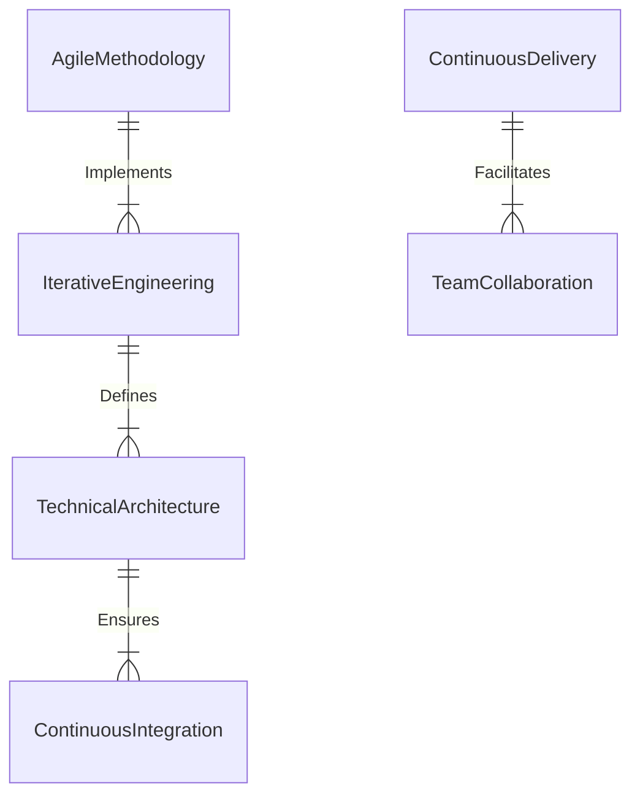

                 

# **敏捷迭代工程技术架构的核心原则与实践**

## 关键词

- 敏捷开发
- 迭代工程
- 技术架构
- 核心原则
- 实践应用

## 摘要

本文旨在探讨敏捷迭代工程技术架构的核心原则与实践。通过深入分析敏捷开发的背景和起源，本文将详细阐述敏捷迭代工程技术架构的基本概念、核心原则和实践方法。同时，结合具体案例，我们将展示如何在实际项目中应用这些原则，以实现高效的工程架构设计。文章还将讨论如何通过持续改进和最佳实践来不断提升技术架构的质量和效率。

## 引言

在当今快速变化的IT行业，敏捷开发已成为软件开发的主流方法论。敏捷开发强调快速迭代、灵活响应变化、注重团队合作和持续交付价值。然而，在实际工程实践中，如何有效地将敏捷原则应用于技术架构设计，仍然是一个具有挑战性的问题。本文将探讨敏捷迭代工程技术架构的核心原则和实践，以帮助读者理解并掌握这一重要的工程方法论。

## 核心原则

敏捷迭代工程技术架构的核心原则源于敏捷开发方法论，包括但不限于以下几个关键点：

### 1. 快速迭代

敏捷开发强调通过快速迭代来不断优化产品。每个迭代周期通常是几周，这样可以确保开发团队能够及时响应市场变化和客户需求。

### 2. 用户反馈

用户反馈是敏捷开发的核心，它帮助开发团队了解产品的实际使用情况和用户需求，从而指导后续的开发工作。

### 3. 小步快跑

小步快跑意味着每次迭代都尽可能完成一个可交付的增量，这样可以降低开发风险，并确保产品始终具有实际价值。

### 4. 持续集成和持续交付

持续集成和持续交付是敏捷开发的重要组成部分，它们确保代码质量和交付效率，同时减少发布周期。

### 5. 团队协作

敏捷开发强调团队成员之间的紧密协作，通过跨职能团队的协同工作，提高整体效率。

## 核心概念与联系

为了更好地理解敏捷迭代工程技术架构，我们需要明确一些核心概念及其相互关系。以下是几个关键概念及其Mermaid ER图：

### 1. 敏捷方法论

敏捷方法论是一套指导软件开发过程的哲学和实践，包括但不限于敏捷宣言和Scrum框架。

### 2. 迭代工程

迭代工程是一种软件开发模型，强调通过多次迭代逐步完善产品。

### 3. 技术架构

技术架构是软件系统的总体设计，包括组件、模块和接口的安排。

### 4. 持续集成

持续集成是一种软件开发实践，通过自动化测试确保代码质量。

### 5. 持续交付

持续交付是一种软件开发实践，确保软件产品能够快速、可靠地交付到生产环境。

### 6. 团队协作

团队协作是敏捷开发的关键，通过跨职能团队的紧密协作提高开发效率。

## 实践应用

在工程实践中，敏捷迭代工程技术架构的应用通常涉及以下几个步骤：

### 1. 需求分析

首先，对项目需求进行详细分析，明确产品功能和技术需求。

### 2. 迭代计划

根据需求分析，制定迭代计划，确定每个迭代的目标和任务。

### 3. 技术设计

在迭代开始前，进行技术设计，包括架构设计、数据库设计和接口设计。

### 4. 开发与测试

按照迭代计划，进行开发工作，同时进行单元测试和集成测试。

### 5. 持续集成

通过持续集成工具，确保代码质量，自动化测试结果，并快速修复问题。

### 6. 持续交付

在迭代结束时，通过持续交付流程将产品部署到生产环境。

### 7. 用户反馈

收集用户反馈，用于指导后续的迭代开发。

### 8. 持续改进

根据用户反馈和项目评估，持续改进技术架构和开发流程。

## 设计迭代工程架构

在设计迭代工程架构时，我们需要考虑以下几个方面：

### 1. 域模型设计

通过领域模型设计，明确系统的业务领域和实体关系。

### 2. 架构设计

选择合适的架构风格，如分层架构、事件驱动架构等，并设计组件和模块。

### 3. 接口设计

设计系统接口，确保模块之间的松耦合和易于集成。

### 4. 安全设计

确保系统具有足够的安全措施，如访问控制、数据加密等。

### 5. 性能设计

优化系统性能，确保在高并发场景下仍能稳定运行。

### 6. 可扩展性设计

设计具有可扩展性的系统，以便在未来能够轻松扩展功能。

## 案例分析

为了更好地理解敏捷迭代工程技术架构的应用，我们来看一个实际案例。

### 项目背景

某电子商务平台需要开发一个全新的购物车功能，以支持多种支付方式和订单处理。

### 需求分析

通过对用户需求的调研，确定购物车功能的基本需求和扩展功能。

### 迭代计划

根据需求分析，制定迭代计划，确定每个迭代的目标和任务。

### 技术设计

在迭代开始前，进行技术设计，包括架构设计、数据库设计和接口设计。

### 开发与测试

按照迭代计划，进行开发工作，同时进行单元测试和集成测试。

### 持续集成

通过持续集成工具，确保代码质量，自动化测试结果，并快速修复问题。

### 持续交付

在迭代结束时，通过持续交付流程将购物车功能部署到生产环境。

### 用户反馈

收集用户反馈，用于指导后续的迭代开发。

### 持续改进

根据用户反馈和项目评估，持续改进购物车功能的技术架构和开发流程。

## 最佳实践与注意事项

在敏捷迭代工程技术架构的实施过程中，以下是一些最佳实践和注意事项：

- **重视需求分析**：准确的需求分析是迭代成功的关键。
- **保持团队协作**：团队成员之间的紧密协作可以提高开发效率。
- **持续集成和交付**：持续集成和交付可以确保代码质量和交付效率。
- **用户反馈**：及时收集用户反馈，以指导后续迭代开发。
- **持续改进**：不断评估项目进展，根据实际情况进行调整和优化。

## 结论

敏捷迭代工程技术架构是一种高效的技术方法论，通过快速迭代、用户反馈和团队协作，可以提高软件开发的质量和效率。本文详细阐述了敏捷迭代工程技术架构的核心原则和实践方法，并结合实际案例进行了分析。通过掌握这些方法，开发团队可以更好地应对复杂的项目挑战，实现持续交付和业务价值。

## 拓展阅读

- 《敏捷开发实践指南》
- 《Scrum敏捷开发》
- 《持续集成：代码和流程的自动化》
- 《领域驱动设计》

作者：AI天才研究院/AI Genius Institute & 禅与计算机程序设计艺术 /Zen And The Art of Computer Programming

