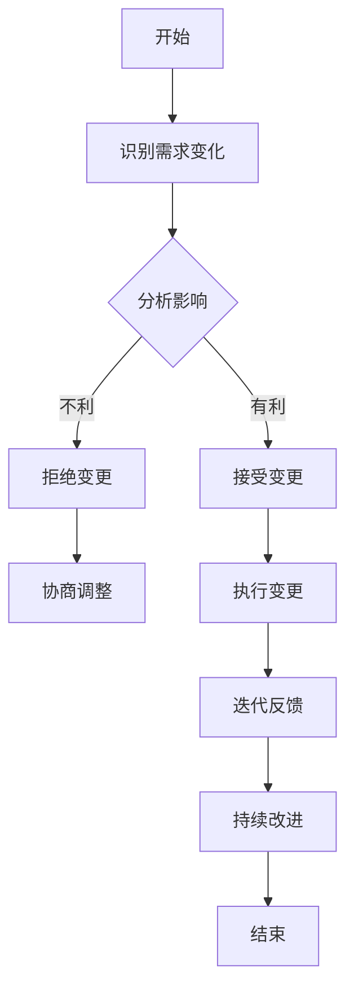
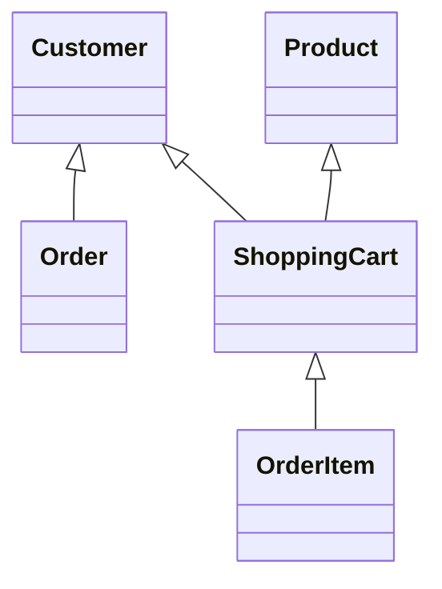
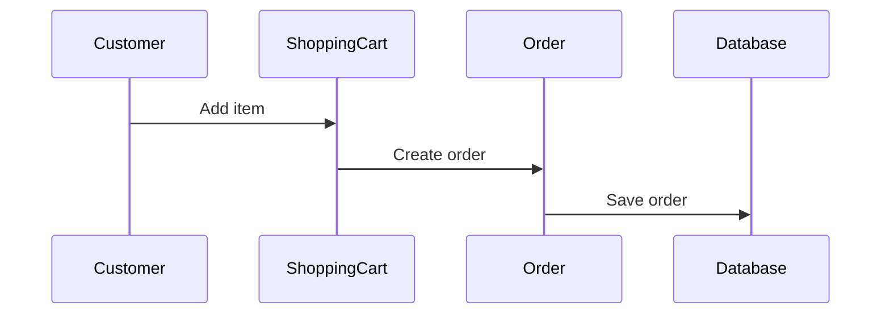
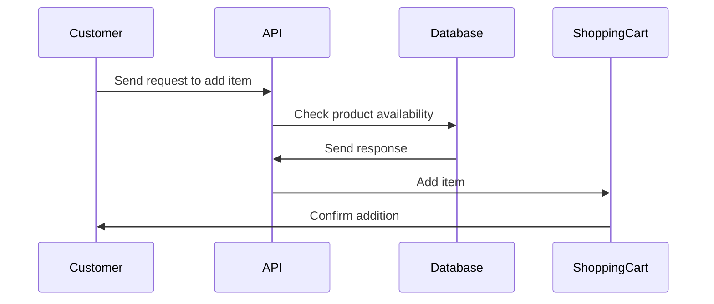

                 

### **敏捷领导力：驱动大型应用开发的需求变革**

> **关键词**：敏捷领导力、大型应用开发、需求变革、团队协作、项目成功
>
> **摘要**：本文将探讨敏捷领导力在大型应用开发中的作用，通过详细的分析和实例，解释如何利用敏捷领导力来推动需求变革，提升项目开发的效率和成功率。

## **背景介绍**

### **核心概念术语说明**

- **敏捷领导力**：一种以快速响应变化、注重团队协作和持续改进为核心的管理理念。
- **大型应用开发**：涉及复杂系统设计和大规模团队协作的应用项目开发。
- **需求变革**：在项目开发过程中，根据用户反馈和市场变化，对原始需求进行修改和优化的过程。

### **问题背景**

在当今快速变化的技术环境中，大型应用开发面临着诸多挑战，如需求频繁变更、资源限制、团队协作困难等。传统的领导力模式往往难以适应这种变化，导致项目延迟、成本超支和质量下降。因此，引入敏捷领导力成为解决这些问题的关键。

### **问题描述**

如何通过敏捷领导力来驱动大型应用开发中的需求变革，提高项目的灵活性和响应速度，确保项目成功交付？

### **问题解决**

敏捷领导力通过以下几个方面解决上述问题：

1. **透明性**：通过建立透明的沟通机制，确保团队成员了解项目的进展和变更。
2. **团队协作**：强调跨职能团队的协作，共同应对需求变更。
3. **持续改进**：通过迭代开发和持续反馈，不断优化需求。
4. **灵活响应**：领导者具备快速响应变化的能力，调整策略以应对新的挑战。

### **边界与外延**

- **边界**：敏捷领导力适用于大型、复杂的应用开发项目。
- **外延**：除了应用开发，敏捷领导力也适用于其他领域，如产品管理、项目管理等。

### **概念结构与核心要素组成**

- **概念结构**：敏捷领导力由多个核心要素组成，包括透明性、团队协作、持续改进和灵活响应。
- **核心要素组成**：每个要素在大型应用开发中都起着关键作用，共同推动需求变革。

## **核心概念与联系**

### **核心概念原理**

敏捷领导力是一种管理理念，强调领导者与团队成员之间的紧密合作，通过快速响应变化和持续改进，实现组织的愿景和目标。

### **概念属性特征对比表格**

| 特征           | 敏捷领导力               | 传统领导力             |
| -------------- | ------------------------ | ---------------------- |
| 沟通机制       | 透明、协作、开放          | 层级、封闭、权威       |
| 团队协作       | 强调跨职能团队协作       | 强调个人能力和层级    |
| 快速响应       | 灵活、快速响应变化       | 稳定、规划性较强       |
| 持续改进       | 通过迭代和反馈持续优化   | 长期规划和阶段性评估   |

### **ER实体关系图架构**

```mermaid
erDiagram
  项目 --> 需求
  项目 --> 团队
  需求 --> 变更
  团队 --> 成员
  成员 --> 任务
```

## **算法原理讲解**

### **算法mermaid流程图**



### **算法原理**

敏捷领导力的核心算法是需求变更管理。该算法通过以下几个步骤实现：

1. **识别需求变化**：监控项目进展，识别需求变更。
2. **分析影响**：评估变更对项目的影响。
3. **决策**：根据分析结果，决定是否接受变更。
4. **执行变更**：如果接受变更，执行变更并更新相关文档。
5. **迭代反馈**：在执行变更后，收集反馈，持续改进。

### **算法原理的数学模型和公式**

```latex
\text{需求变更管理} = f(\text{变更识别}, \text{影响分析}, \text{决策}, \text{变更执行}, \text{迭代反馈})
```

### **通俗易懂地举例说明**

假设一个电商项目在开发过程中，用户反馈希望增加一个购物车功能。敏捷领导者会通过以下步骤来管理需求变更：

1. **识别需求变化**：用户反馈购物车功能的需求。
2. **分析影响**：评估购物车功能对项目进度、成本和质量的影响。
3. **决策**：如果变更对项目有利，接受变更并分配开发资源。
4. **执行变更**：开发团队开始实现购物车功能。
5. **迭代反馈**：在购物车功能开发完成后，收集用户反馈，持续优化。

## **系统分析与架构设计方案**

### **问题场景介绍**

某电商平台需要在现有系统基础上增加购物车功能，以提升用户体验。

### **项目介绍**

项目目标是增加一个高效、稳定的购物车功能，确保用户体验和系统性能。

### **系统功能设计(领域模型mermaid类图)**



### **系统架构设计mermaid架构图**



### **系统接口设计和系统交互mermaid序列图**



## **项目实战**

### **环境安装**

确保项目环境配置正确，包括数据库、开发工具和服务器等。

### **系统核心实现源代码**

```python
# 购物车类
class ShoppingCart:
    def __init__(self):
        self.items = []

    def add_item(self, product):
        self.items.append(product)

    def remove_item(self, product):
        self.items.remove(product)

    def get_total(self):
        return sum([item.price for item in self.items])

# 产品类
class Product:
    def __init__(self, name, price):
        self.name = name
        self.price = price
```

### **代码应用解读与分析**

通过上述代码，我们可以看到购物车功能的基本实现。购物车类和产品类分别负责管理购物车中的商品信息和商品对象。

### **实际案例分析和详细讲解剖析**

假设用户在购物过程中添加了商品A和商品B到购物车中，我们需要实现以下功能：

1. **添加商品到购物车**：调用`add_item`方法。
2. **从购物车中删除商品**：调用`remove_item`方法。
3. **计算购物车总金额**：调用`get_total`方法。

### **项目小结**

通过本项目实战，我们实现了购物车功能，提高了用户体验。接下来，我们将进一步优化和扩展该功能，以满足更多用户的需求。

## **最佳实践 tips**

- **定期需求评审**：定期组织需求评审会议，确保团队对需求的了解和共识。
- **敏捷工具**：使用敏捷工具（如Jira、Trello等）来跟踪需求和项目进度。
- **持续沟通**：保持团队成员之间的持续沟通，确保信息流通。

## **小结**

敏捷领导力在大型应用开发中发挥着重要作用，通过透明性、团队协作、持续改进和灵活响应，领导者能够有效驱动需求变革，提高项目成功率和用户体验。

## **注意事项**

- **避免频繁变更**：需求变更需谨慎，避免频繁变更导致项目不稳定。
- **保持团队稳定**：保持团队稳定，减少人员变动对项目的影响。

## **拓展阅读**

- 《敏捷软件开发：原理、实践与模式》
- 《敏捷领导力：如何领导敏捷团队》
- 《敏捷方法在大型软件项目中的应用》

---

**作者**：AI天才研究院/AI Genius Institute & 禅与计算机程序设计艺术 /Zen And The Art of Computer Programming

