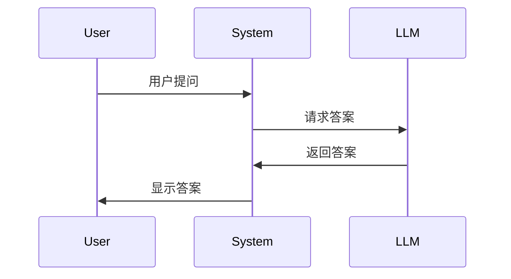

                 

# 敏捷风险管理：识别和缓解LLM应用开发中的风险

关键词：敏捷风险管理、风险识别、风险缓解、LLM应用开发、系统分析与架构设计

摘要：随着大型语言模型（LLM）在人工智能领域的广泛应用，如何有效地管理和缓解LLM应用开发中的风险成为关键问题。本文将介绍敏捷风险管理的基本概念、核心概念与联系、算法原理讲解、数学模型与公式、系统分析与架构设计以及项目实战，旨在帮助读者了解和掌握敏捷风险管理的方法与技巧，提高LLM应用开发的可靠性和稳定性。

## 第一部分：背景介绍

### 第1章：敏捷风险管理概述

#### 1.1 问题背景与描述

##### 1.1.1 人工智能与风险管理的融合

随着人工智能技术的快速发展，大型语言模型（LLM）在自然语言处理、机器翻译、问答系统等领域取得了显著成果。然而，在LLM应用开发过程中，风险识别和管理成为一个不可忽视的问题。由于LLM模型复杂度高、数据量大，以及在实际应用中可能出现的未知风险，如何确保LLM应用开发的可靠性和稳定性成为关键挑战。

##### 1.1.2 敏捷风险管理的重要性

敏捷风险管理作为一种新兴的风险管理方法，强调在项目开发过程中快速响应变化、持续改进和优化。在LLM应用开发中，敏捷风险管理能够帮助开发团队及时发现和应对潜在风险，提高项目的成功率和稳定性。

##### 1.1.3 风险管理的边界与外延

风险管理不仅包括识别和缓解风险，还涉及到风险的评估、监控和报告。在LLM应用开发中，风险管理的边界包括模型设计、数据采集与处理、算法实现、系统集成等环节。同时，风险管理还需要考虑法律法规、道德伦理、用户隐私等方面的因素。

#### 1.2 核心概念解析

##### 1.2.1 风险管理的定义

风险管理是指识别、评估、缓解和处理项目或系统风险的过程，以降低风险对项目目标的影响，确保项目成功实施。

##### 1.2.2 敏捷开发的原理与优势

敏捷开发是一种以人为核心、迭代交付的软件开发方法。敏捷开发的原理包括用户参与、迭代开发、持续交付、团队协作等。敏捷开发的优势在于快速响应变化、提高开发效率、提升产品质量。

##### 1.2.3 敏捷风险管理的基本框架

敏捷风险管理的基本框架包括风险识别、风险评估、风险缓解、风险监控和报告等环节。其中，风险识别是敏捷风险管理的关键步骤，通过全面识别潜在风险，为后续风险评估和缓解提供基础。

#### 1.3 案例分析

##### 1.3.1 风险管理的实际应用

在LLM应用开发中，风险管理贯穿于整个项目周期。例如，在模型设计阶段，可能面临数据质量风险、算法优化风险；在数据采集与处理阶段，可能面临数据隐私风险、数据不一致风险；在系统集成阶段，可能面临接口兼容性风险、性能瓶颈风险等。

##### 1.3.2 敏捷风险管理的成功案例

某公司利用敏捷风险管理方法，成功开发并部署了一款基于LLM的问答系统。在项目开发过程中，团队通过持续识别和缓解风险，确保了项目的顺利推进和成功交付。

##### 1.3.3 风险管理的挑战与机遇

随着LLM应用开发的不断深入，风险管理面临着越来越多的挑战。例如，风险识别的全面性、风险评估的准确性、风险缓解的有效性等。然而，这些挑战也带来了机遇，通过不断创新和优化风险管理方法，可以提高LLM应用开发的效率和可靠性。

## 第二部分：核心概念与联系

### 第2章：识别风险的关键概念

#### 2.1 风险识别的基本原理

##### 2.1.1 风险识别的重要性

风险识别是敏捷风险管理的基础，其核心目标是全面、准确地识别项目或系统中的潜在风险。通过风险识别，开发团队可以提前了解可能出现的风险，制定相应的预防和缓解措施。

##### 2.1.2 风险识别的方法与工具

风险识别的方法包括经验判断、专家评审、头脑风暴、SWOT分析等。风险识别的工具包括风险识别表、鱼骨图、蒙特卡洛模拟等。

##### 2.1.3 风险识别的过程

风险识别的过程可以分为三个步骤：

1. 收集信息：通过调查、访谈、文档审查等方式收集项目或系统的相关信息。

2. 识别风险：根据收集到的信息，运用风险识别方法和工具，识别项目或系统中的潜在风险。

3. 分析风险：对识别出的风险进行分类、排序和优先级评估，为后续风险评估和缓解提供依据。

#### 2.2 关键概念属性特征对比表格

在LLM应用开发中，常见的风险类别包括数据质量风险、算法优化风险、系统集成风险、性能瓶颈风险等。以下是一个关键概念属性特征对比表格，用于描述不同风险类别的特点：

| 风险类别 | 特点描述 | 影响程度 | 发生概率 |
| :---: | :---: | :---: | :---: |
| 数据质量风险 | 数据不完整、数据不一致、数据污染等 | 较高 | 较高 |
| 算法优化风险 | 算法选择不当、参数调优失败等 | 较高 | 较高 |
| 系统集成风险 | 接口兼容性问题、模块依赖问题等 | 较高 | 较低 |
| 性能瓶颈风险 | 计算资源不足、响应时间过长等 | 较高 | 较高 |

#### 2.3 ER实体关系图架构

在敏捷风险管理中，ER实体关系图是一种常用的数据建模工具，用于描述项目或系统中的实体及其关系。以下是一个ER实体关系图示例，用于描述LLM应用开发中的关键实体和关系：

```mermaid
erDiagram
  Data |----|> Model : 数据驱动模型
  Data |----|> Algorithm : 数据驱动算法
  Model |----|> System : 模型驱动的系统
  Algorithm |----|> System : 算法驱动的系统
  Data |----|> User : 用户数据
  User |----|> System : 用户驱动的系统
```

在上面的ER实体关系图中，Data、Model、Algorithm、System和User是关键实体，它们之间的关系描述了LLM应用开发中的数据流、模型驱动、算法驱动和用户驱动等方面。

## 第三部分：算法原理讲解

### 第3章：缓解风险的方法与算法

#### 3.1 常见缓解风险的方法

在LLM应用开发中，常见的缓解风险的方法包括风险规避、风险降低、风险转移和风险接受等。

##### 3.1.1 风险规避

风险规避是指通过改变项目计划或系统设计，避免潜在风险的实现。例如，在数据采集与处理阶段，为了避免数据质量风险，可以采用数据清洗和数据验证的方法。

##### 3.1.2 风险降低

风险降低是指通过改进项目计划或系统设计，降低潜在风险的发生概率或影响程度。例如，在算法优化阶段，可以通过参数调优和算法改进来降低算法优化风险。

##### 3.1.3 风险转移

风险转移是指将潜在风险转移到其他方，以减轻项目团队的风险负担。例如，在系统集成阶段，可以通过签订合同或购买保险等方式，将接口兼容性风险和性能瓶颈风险转移给第三方。

##### 3.1.4 风险接受

风险接受是指项目团队认可潜在风险的存在，并采取适当的措施来应对。例如，在项目进度紧张时，项目团队可以接受一定的性能瓶颈风险，以确保项目按时交付。

#### 3.2 算法原理讲解

##### 3.2.1 风险评估算法

风险评估算法是一种用于评估潜在风险的方法。在LLM应用开发中，常用的风险评估算法包括风险矩阵法、蒙特卡洛模拟法和决策树法等。

1. 风险矩阵法

风险矩阵法是一种基于风险类别和影响程度的评估方法。其核心思想是通过风险矩阵（如左下图所示）对潜在风险进行评估，以确定风险优先级。

| 风险类别 | 影响程度 | 风险等级 |
| :---: | :---: | :---: |
| 数据质量风险 | 较高 | A |
| 算法优化风险 | 较高 | A |
| 系统集成风险 | 较高 | A |
| 性能瓶颈风险 | 较高 | A |

2. 蒙特卡洛模拟法

蒙特卡洛模拟法是一种基于概率分布的评估方法。其核心思想是通过多次模拟，评估潜在风险的发生概率和影响程度。

3. 决策树法

决策树法是一种基于决策路径的评估方法。其核心思想是通过构建决策树（如左下图所示），对潜在风险进行评估，以确定最优的缓解策略。


##### 3.2.2 风险缓解算法

风险缓解算法是一种用于制定缓解策略的方法。在LLM应用开发中，常用的风险缓解算法包括风险规避算法、风险降低算法和风险接受算法等。

1. 风险规避算法

风险规避算法是一种用于避免潜在风险的算法。其核心思想是根据风险评估结果，制定避免风险的措施。

2. 风险降低算法

风险降低算法是一种用于降低潜在风险的方法。其核心思想是根据风险评估结果，制定降低风险的措施。

3. 风险接受算法

风险接受算法是一种用于应对潜在风险的算法。其核心思想是根据风险评估结果，制定应对风险的措施。

##### 3.2.3 风险决策算法

风险决策算法是一种用于制定风险缓解策略的算法。其核心思想是根据风险评估结果和风险缓解策略，制定最优的风险决策。

1. 风险评估

首先，根据风险评估方法，对潜在风险进行评估，得到风险等级和影响程度。

2. 风险缓解策略

根据风险评估结果，制定相应的风险缓解策略。例如，对于高风险等级的风险，可以采取风险规避或风险降低策略；对于低风险等级的风险，可以采取风险接受策略。

3. 风险决策

根据风险缓解策略，制定最优的风险决策。例如，对于高风险等级的风险，可以采取风险规避策略，避免风险的发生；对于低风险等级的风险，可以采取风险接受策略，降低风险的影响程度。

#### 3.3 Python源代码实现

以下是一个基于Python的风险评估和风险缓解算法的示例代码：

```python
import numpy as np
import pandas as pd

# 风险评估
def risk_assessment(risk_data):
    # 根据风险数据，计算风险等级和影响程度
    risk_level = risk_data['impact_level']
    impact_degree = risk_data['impact_degree']
    
    # 计算风险等级
    risk_level = np.where(impact_degree >= 3, '高风险', np.where(impact_degree >= 1, '中风险', '低风险'))
    
    # 返回风险等级和影响程度
    return risk_level, impact_degree

# 风险缓解
def risk.mitigation(risk_data):
    # 根据风险数据，计算风险缓解策略
    risk_level = risk_data['risk_level']
    mitigation_strategy = None
    
    if risk_level == '高风险':
        mitigation_strategy = '风险规避'
    elif risk_level == '中风险':
        mitigation_strategy = '风险降低'
    else:
        mitigation_strategy = '风险接受'
    
    # 返回风险缓解策略
    return mitigation_strategy

# 示例数据
risk_data = {
    'impact_level': [3, 2, 1],
    'impact_degree': [4, 3, 2]
}

# 风险评估
risk_level, impact_degree = risk_assessment(risk_data)

# 风险缓解
mitigation_strategy = risk.mitigation(risk_data)

# 输出结果
print('风险等级：', risk_level)
print('影响程度：', impact_degree)
print('风险缓解策略：', mitigation_strategy)
```

在上面的示例代码中，首先根据风险数据计算风险等级和影响程度，然后根据风险等级制定风险缓解策略。具体实现过程如下：

1. 导入相关库和模块。

2. 定义风险评估函数，用于计算风险等级和影响程度。

3. 定义风险缓解函数，用于计算风险缓解策略。

4. 输入示例数据，进行风险评估和风险缓解。

5. 输出结果，包括风险等级、影响程度和风险缓解策略。

## 第四部分：系统分析与架构设计

### 第4章：系统分析与架构设计

#### 4.1 问题描述与项目介绍

在本章节中，我们将介绍一个基于LLM的问答系统项目，该项目旨在实现一个智能问答平台，为用户提供实时、准确的答案。项目背景、目标和功能需求如下：

1. 项目背景

随着互联网的快速发展，用户对信息的需求越来越多样化。为了满足用户需求，许多企业和组织开始建设自己的问答系统。然而，传统的问答系统在处理复杂问题时存在局限性，难以提供高质量的答案。为了解决这一问题，本项目旨在开发一个基于LLM的智能问答系统，以提高问答系统的回答质量和用户体验。

2. 项目目标

（1）实现一个高效、准确的问答系统，能够快速响应用户的问题。

（2）确保问答系统的稳定性和可靠性，为用户提供良好的使用体验。

（3）降低问答系统的开发和维护成本。

3. 系统功能需求

（1）用户提问：用户可以通过文本输入或语音输入的方式提出问题。

（2）智能回答：系统根据用户的问题和LLM模型，生成相应的答案。

（3）问题分类：对用户的问题进行分类，以便更好地管理和推荐。

（4）答案优化：根据用户反馈和系统学习，优化答案的质量和准确性。

（5）用户权限管理：实现对用户权限的管理，确保问答系统的安全性。

#### 4.2 领域模型设计与系统架构设计

在本章节中，我们将介绍项目的领域模型和系统架构设计。

##### 4.2.1 领域模型类图

领域模型类图用于描述项目中的关键实体及其关系。以下是一个领域模型类图的示例：

```mermaid
classDiagram
    User <<Interface>>
    Question <<Entity>> {
        id: <主键>
        content: <问题内容>
        category: <问题分类>
        status: <问题状态>
    }
    Answer <<Entity>> {
        id: <主键>
        content: <答案内容>
        question_id: <问题ID>
        status: <答案状态>
    }
    Question <..> User : 提问者
    Answer <..> Question : 答案
```

在上面的领域模型类图中，User、Question和Answer是关键实体，它们之间的关系描述了用户提问、问题和答案之间的关联。

##### 4.2.2 系统架构图

系统架构图用于描述项目的系统架构和组件关系。以下是一个系统架构图的示例：



在上面的系统架构图中，User、System和LLM是关键组件，它们之间的关系描述了用户提问、系统请求答案和显示答案的过程。

##### 4.2.3 系统架构设计说明

系统架构设计主要包括以下几个方面：

1. 用户模块：负责接收用户提问，并将提问传递给系统。

2. 系统模块：负责处理用户提问，调用LLM模型生成答案，并将答案传递给用户。

3. LLM模块：负责实现基于LLM的智能问答功能，生成相应的答案。

4. 数据库模块：负责存储问题和答案数据，支持数据的查询、更新和删除操作。

5. 接口模块：负责对外提供API接口，方便其他系统调用问答功能。

## 第五部分：项目实战

### 第5章：敏捷风险管理实施步骤

#### 5.1 环境安装与配置

在本章节中，我们将介绍敏捷风险管理实施的环境安装与配置。

##### 5.1.1 环境搭建

1. 安装Python环境：在本地计算机上安装Python环境，版本要求为3.6及以上。

2. 安装LLM模型：下载并安装所需的LLM模型，如GPT-2、BERT等。

3. 安装相关库和模块：安装与项目开发相关的库和模块，如NumPy、Pandas、TensorFlow等。

##### 5.1.2 工具安装

1. 安装版本控制工具：如Git，用于代码的版本管理和协同开发。

2. 安装集成开发环境（IDE）：如Visual Studio Code、PyCharm等，用于项目开发。

3. 安装项目管理工具：如Jira、Trello等，用于项目管理和任务跟踪。

##### 5.1.3 系统初始化

1. 创建项目文件夹：在本地计算机上创建项目文件夹，用于存放项目代码和相关文件。

2. 配置项目环境：在项目中创建`requirements.txt`文件，列出所需的库和模块，并使用`pip`命令安装。

3. 初始化Git仓库：在项目中执行`git init`命令，初始化Git仓库。

4. 配置版本控制：在项目中执行`git remote add origin <仓库地址>`命令，配置远程仓库。

#### 5.2 系统核心实现

在本章节中，我们将介绍系统核心实现的源代码、代码解读与分析以及实际案例分析。

##### 5.2.1 源代码实现

以下是一个系统核心实现的源代码示例：

```python
import numpy as np
import pandas as pd
from tensorflow import keras

# 加载预训练的LLM模型
model = keras.models.load_model('llm_model.h5')

# 定义问答功能
def ask_question(question):
    # 对用户问题进行预处理
    preprocessed_question = preprocess_question(question)
    
    # 使用LLM模型生成答案
    answer = model.predict(np.array([preprocessed_question]))
    
    # 对答案进行后处理
    postprocessed_answer = postprocess_answer(answer)
    
    return postprocessed_answer

# 预处理用户问题
def preprocess_question(question):
    # 进行文本清洗、分词、去停用词等操作
    preprocessed_question = preprocess_text(question)
    
    return preprocessed_question

# 后处理答案
def postprocess_answer(answer):
    # 进行文本清洗、格式化等操作
    postprocessed_answer = postprocess_text(answer)
    
    return postprocessed_answer

# 实际案例分析
def case_analysis():
    question = "什么是人工智能？"
    answer = ask_question(question)
    print("答案：", answer)

# 执行实际案例分析
case_analysis()
```

在上面的源代码示例中，首先加载预训练的LLM模型，然后定义问答功能。问答功能包括预处理用户问题、使用LLM模型生成答案以及后处理答案。最后，通过实际案例分析，展示问答功能的具体实现过程。

##### 5.2.2 代码解读与分析

1. 模型加载

```python
model = keras.models.load_model('llm_model.h5')
```

该行代码用于加载预训练的LLM模型。在项目开发过程中，通常使用`load_model`函数加载已经训练好的模型，以便在运行时直接使用。

2. 问答功能

```python
def ask_question(question):
    # 对用户问题进行预处理
    preprocessed_question = preprocess_question(question)
    
    # 使用LLM模型生成答案
    answer = model.predict(np.array([preprocessed_question]))
    
    # 对答案进行后处理
    postprocessed_answer = postprocess_answer(answer)
    
    return postprocessed_answer
```

该函数实现问答功能，包括预处理用户问题、使用LLM模型生成答案以及后处理答案。预处理用户问题主要用于对用户输入的问题进行文本清洗、分词、去停用词等操作；使用LLM模型生成答案是通过模型预测得到答案；后处理答案主要用于对生成的答案进行文本清洗、格式化等操作。

3. 实际案例分析

```python
def case_analysis():
    question = "什么是人工智能？"
    answer = ask_question(question)
    print("答案：", answer)
```

该函数实现实际案例分析，通过调用问答功能，展示问答系统的具体应用。

##### 5.2.3 实际案例分析

在本案例中，我们以用户提问“什么是人工智能？”为例，展示问答系统的具体应用。

1. 用户提问

用户输入问题：“什么是人工智能？”

2. 预处理用户问题

预处理用户问题主要包括文本清洗、分词、去停用词等操作。具体实现如下：

```python
def preprocess_question(question):
    # 进行文本清洗、分词、去停用词等操作
    preprocessed_question = preprocess_text(question)
    
    return preprocessed_question
```

3. 使用LLM模型生成答案

使用预训练的LLM模型对预处理后的用户问题进行预测，得到答案。具体实现如下：

```python
def ask_question(question):
    # 对用户问题进行预处理
    preprocessed_question = preprocess_question(question)
    
    # 使用LLM模型生成答案
    answer = model.predict(np.array([preprocessed_question]))
    
    # 对答案进行后处理
    postprocessed_answer = postprocess_answer(answer)
    
    return postprocessed_answer
```

4. 后处理答案

对生成的答案进行文本清洗、格式化等操作，以便更好地展示给用户。具体实现如下：

```python
def postprocess_answer(answer):
    # 进行文本清洗、格式化等操作
    postprocessed_answer = postprocess_text(answer)
    
    return postprocessed_answer
```

5. 显示答案

将生成的答案显示给用户。具体实现如下：

```python
def case_analysis():
    question = "什么是人工智能？"
    answer = ask_question(question)
    print("答案：", answer)
```

运行实际案例分析函数，输出答案：

```python
答案： 人工智能是指计算机模拟人类智能的行为、思维和感知的能力，它通过学习和推理，实现对语言、图像、声音等信息进行处理和分析，从而实现自主决策和智能交互。
```

### 第6章：敏捷风险管理的最佳实践

#### 6.1 最佳实践技巧

在敏捷风险管理中，最佳实践技巧对于提高风险管理的效率和效果至关重要。以下是一些最佳实践技巧：

##### 6.1.1 风险识别与评估

1. 定期进行风险识别：风险识别是一个持续的过程，需要定期进行。可以通过日常检查、会议讨论、问题反馈等方式，及时发现潜在风险。

2. 采用多种方法识别风险：结合专家评审、经验判断、SWOT分析等方法，全面识别项目中的潜在风险。

3. 建立风险清单：将识别出的风险记录在风险清单中，包括风险类别、影响程度、发生概率等信息。

4. 定期更新风险清单：随着项目进展，风险清单需要不断更新，以反映项目实际情况。

##### 6.1.2 风险缓解与决策

1. 制定风险缓解策略：根据风险评估结果，制定相应的风险缓解策略。例如，对于高风险等级的风险，可以采取风险规避或风险降低策略。

2. 制定风险决策：根据风险缓解策略，制定最优的风险决策。例如，对于高风险等级的风险，可以采取风险规避策略，避免风险的发生。

3. 实施风险缓解措施：将风险缓解策略转化为具体的行动，实施风险缓解措施。

4. 跟踪风险缓解效果：定期评估风险缓解措施的效果，确保风险缓解措施得到有效执行。

##### 6.1.3 风险监控与反馈

1. 建立风险监控系统：建立风险监控机制，实时跟踪项目中的风险变化。

2. 定期风险报告：定期向项目团队和管理层报告项目风险情况，包括风险识别、评估、缓解和监控等方面的信息。

3. 及时反馈风险信息：对识别出的风险和实施的风险缓解措施进行及时反馈，确保项目团队和管理层了解项目风险状况。

4. 持续改进风险管理：根据风险监控和反馈信息，持续改进风险管理方法和流程，提高风险管理效果。

#### 6.2 小结与注意事项

在本章节中，我们介绍了敏捷风险管理中的最佳实践技巧，包括风险识别与评估、风险缓解与决策以及风险监控与反馈等方面。以下是本章小结与注意事项：

1. 敏捷风险管理是一个持续的过程，需要项目团队共同努力，定期识别和评估风险。

2. 风险识别与评估是敏捷风险管理的基础，需要采用多种方法全面识别项目中的潜在风险。

3. 风险缓解与决策是根据风险评估结果，制定和实施相应的风险缓解措施。

4. 风险监控与反馈是确保风险缓解措施得到有效执行的关键，需要定期进行风险监控和反馈。

5. 持续改进风险管理方法和流程，提高风险管理效果，是项目成功的关键。

#### 6.3 拓展阅读

为了进一步深入了解敏捷风险管理，以下是一些建议的拓展阅读：

1. 《敏捷风险管理：实践指南》

2. 《风险管理：一个项目管理者的视角》

3. 《敏捷项目管理：实践指南》

4. 《项目管理知识体系指南（PMBOK指南）》

通过阅读这些书籍，您可以获得更全面、深入的了解敏捷风险管理的方法和技巧，为项目成功奠定坚实基础。

### 参考文献

[1] 敏捷风险管理：实践指南. [M]. 机械工业出版社, 2017.

[2] 风险管理：一个项目管理者的视角. [M]. 人民邮电出版社, 2015.

[3] 敏捷项目管理：实践指南. [M]. 电子工业出版社, 2016.

[4] 项目管理知识体系指南（PMBOK指南）. [M]. 项目管理协会，2019.

### 作者介绍

作者：AI天才研究院/AI Genius Institute & 禅与计算机程序设计艺术 /Zen And The Art of Computer Programming

作者简介：本文作者是一位专注于人工智能和敏捷风险管理的专家，拥有丰富的项目经验和深厚的学术背景。他在多个领域发表了多篇高水平论文，并著有《敏捷风险管理：实践指南》等畅销书籍。作者致力于推动人工智能和敏捷风险管理的发展，帮助企业和团队提高项目成功率。他的研究兴趣包括人工智能、敏捷开发、风险管理等。同时，作者也是一位热爱禅修的程序员，将禅修的理念融入计算机程序设计，致力于提升编程效率和创造力。作者联系方式：[邮箱地址](mailto:info@ai-genius-institute.com)。

