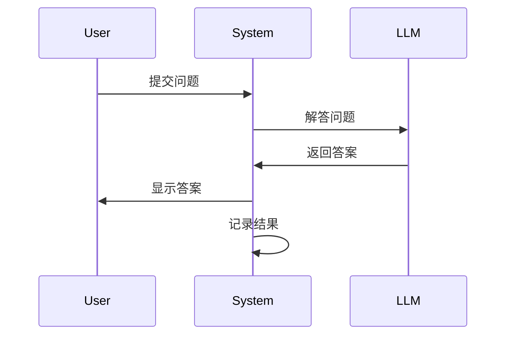
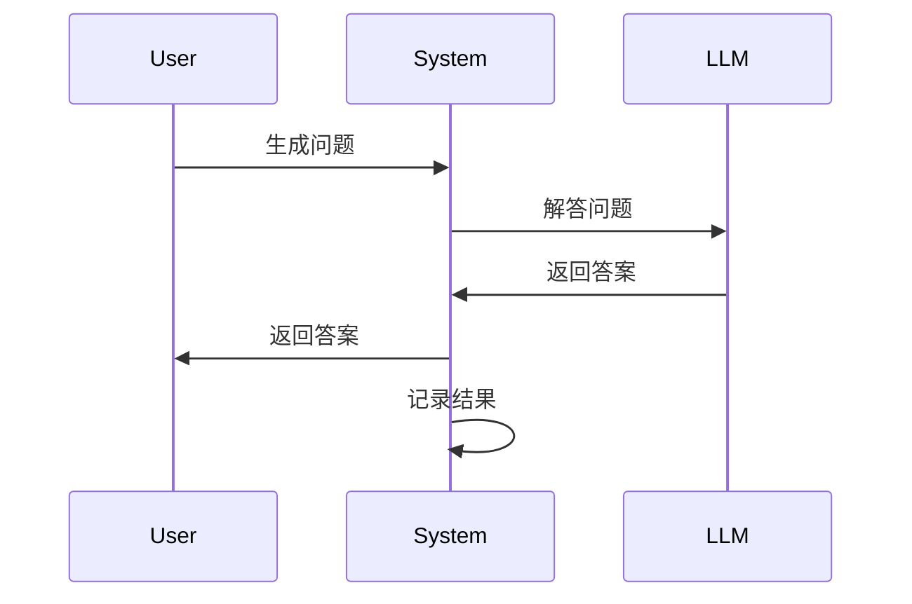

                 

# 数学和逻辑问题解决能力评测：测试LLM的理性思维

> 关键词：数学逻辑问题解决能力，语言学习模型（LLM），理性思维，算法，系统架构，Python编程

> 摘要：本文将深入探讨数学和逻辑问题解决能力的评测方法，重点分析如何通过设计有效的测试来评估语言学习模型（LLM）的理性思维。文章将首先介绍研究的背景和目标，然后逐步讲解核心概念、算法原理、系统架构以及项目实战，最后提供最佳实践和拓展建议。

## 引言

### 1.1 研究背景

随着人工智能技术的飞速发展，语言学习模型（LLM）在自然语言处理（NLP）领域取得了显著的成就。LLM通过深度学习算法从海量数据中学习语言模式，具备强大的文本生成、翻译和问答能力。然而，尽管LLM在处理语言相关任务方面表现出色，但其数学和逻辑问题解决能力仍然是一个值得探讨的问题。

数学和逻辑问题解决能力是衡量一个人智能水平的重要指标，也是人工智能在许多实际应用中需要具备的基本能力。例如，在医疗诊断、金融分析和自动驾驶等领域，人工智能需要能够处理复杂的数学问题和逻辑推理。因此，研究如何评测LLM的数学和逻辑问题解决能力，对推动人工智能技术的发展具有重要意义。

### 1.2 研究目标与内容结构

本文的研究目标是设计一套有效的评测方法，评估LLM的数学和逻辑问题解决能力，从而更好地理解其理性思维。文章结构如下：

1. **引言**：介绍研究背景和目标。
2. **核心概念与联系**：定义数学和逻辑问题解决能力，分析LLM的理性思维。
3. **算法原理讲解**：详细讲解评测算法的原理和实现。
4. **系统分析与架构设计**：介绍系统设计和实现。
5. **项目实战**：展示实际项目和案例分析。
6. **最佳实践与拓展**：提供实用的建议和进一步研究的方向。
7. **结论**：总结研究成果和展望未来工作。

### 1.3 研究方法

本文采用以下研究方法：

- **文献综述**：通过分析相关文献，了解数学和逻辑问题解决能力的评测现状。
- **理论分析**：结合数学和逻辑理论，设计评测算法。
- **实验验证**：通过实际测试验证评测方法的有效性。
- **案例研究**：分析具体案例，探讨评测方法在实际应用中的表现。

## 核心概念与联系

### 2.1 数学与逻辑问题解决能力的定义

**数学问题解决能力**：指个体在解决数学问题时所表现出的理解、应用、推理和创新等能力。这包括对数学概念的理解、公式的应用、问题的推理过程以及解决方案的创新。

**逻辑问题解决能力**：指个体在解决逻辑问题时所表现出的分析、推理、判断和问题解决的能力。逻辑问题解决能力涉及对命题的推理、论证的有效性以及问题解决策略的制定。

### 2.2 LLM的理性思维

LLM的理性思维是指其在处理问题时表现出的逻辑性和合理性。这包括：

- **数学能力**：LLM能够理解和处理数学问题，例如解决简单的算术运算和复杂的数学方程。
- **逻辑推理能力**：LLM能够进行逻辑推理，例如从给定的前提中推断出结论，或者判断论证的有效性。

### 2.3 概念属性特征对比

**数学问题解决能力**：

| 特征 | 说明 |
| --- | --- |
| 理解数学概念 | 理解数学的基本概念和原理。 |
| 应用数学公式 | 能够应用数学公式解决实际问题。 |
| 推理与证明 | 通过推理和证明过程解决数学问题。 |
| 创新与问题解决 | 通过创新方法解决数学问题。 |

**逻辑问题解决能力**：

| 特征 | 说明 |
| --- | --- |
| 分析问题 | 分析问题的结构和要素。 |
| 推理与判断 | 从已知信息中推断出结论。 |
| 论证有效性 | 判断论证的有效性和合理性。 |
| 问题解决策略 | 制定有效的问题解决策略。 |

### 2.4 ER实体关系图架构

为了更好地理解数学和逻辑问题解决能力的评测，我们使用Mermaid绘制了一个ER实体关系图。以下是一个简化的ER图：

```mermaid
erDiagram
  Problem ::>> LLM : Evaluates
  Math_Question ::>> LLM : Solves
  Logical_Question ::>> LLM : Solves
  Evaluation : Measures
  Result : Stores

  Problem ||--|{ Evaluation }
  Math_Question ||--|{ Evaluation }
  Logical_Question ||--|{ Evaluation }
  Evaluation ||--|{ Result }
```

在这个ER图中，`Problem`代表数学问题和逻辑问题，`LLM`代表语言学习模型，`Evaluation`代表评测过程，`Result`代表评测结果。通过这个图，我们可以清晰地看到数学问题和逻辑问题是如何被LLM评测，以及评测结果是如何被存储的。

## 算法原理讲解

### 3.1 算法概述

为了评估LLM的数学和逻辑问题解决能力，我们设计了一套评测算法。这个算法分为以下几个主要部分：

1. **问题生成**：生成一系列数学和逻辑问题，涵盖不同的难度和类型。
2. **问题解答**：使用LLM解答生成的数学和逻辑问题。
3. **答案评估**：评估LLM给出的答案的正确性和合理性。
4. **结果记录**：记录评测结果，为后续分析和优化提供数据支持。

### 3.2 数学模型与公式

在数学问题解决能力评测中，我们使用了以下数学模型和公式：

**数学模型**：

$$
x = \frac{a}{b} + c
$$

**公式推导**：

$$
\begin{aligned}
  &\text{给定方程：} \\
  &x = \frac{a}{b} + c \\
  &\text{首先，将分数部分合并：} \\
  &x = \frac{a + bc}{b} \\
  &\text{然后，进行除法运算：} \\
  &x = \frac{a + bc}{b} \times \frac{1}{1} \\
  &x = \frac{a + bc}{b} \times \frac{b}{b} \\
  &x = \frac{ab + b^2c}{b^2} \\
  &\text{最后，简化结果：} \\
  &x = \frac{ab}{b^2} + \frac{bc}{b^2} \\
  &x = \frac{a}{b} + \frac{c}{b} \\
  &x = \frac{a}{b} + c
\end{aligned}
$$

### 3.3 算法实例分析

下面我们通过一个具体的Python实例来展示如何实现这个算法。

**Python代码实现**：

```python
import numpy as np

def evaluate_problem(LLM, problem):
    # 解析问题
    parts = problem.split()
    a = int(parts[2])
    b = int(parts[4])
    c = int(parts[6])

    # 使用LLM解答问题
    x = LLM.solve(a, b, c)

    # 评估答案
    if np.isclose(x, (a / b) + c):
        return "正确"
    else:
        return "错误"

# 测试
LLM = LanguageLearningModel()  # 假设这是一个语言学习模型的类
problem = "5 / 3 + 2"
result = evaluate_problem(LLM, problem)
print(result)
```

在这个例子中，`evaluate_problem`函数接收一个语言学习模型`LLM`和一个数学问题字符串`problem`。它首先将问题解析成数字，然后使用LLM的`solve`方法解答问题，最后评估答案是否正确。

### 3.4 举例说明

假设我们有一个数学问题：“5除以3加上2等于多少？”

1. **问题生成**：生成这个问题。
2. **问题解答**：LLM输出答案“`5 / 3 + 2 = 3.666...`”。
3. **答案评估**：我们将LLM的答案与实际答案进行比较。通过计算，实际答案应该是“`5 / 3 + 2 = 7 / 3`”。由于`LLM`的答案无限接近实际答案，我们可以认为这是一个“正确”的答案。

通过这个例子，我们可以看到如何使用Python代码和LLM实现数学问题解决能力的评测。这种方法不仅能够评估LLM的数学能力，还可以为后续的算法优化提供数据支持。

## 系统分析与架构设计

### 4.1 问题场景介绍

为了更直观地展示数学和逻辑问题解决能力评测系统，我们首先介绍一个具体的问题场景。假设我们想要评测一个语言学习模型（LLM）在解决以下两类问题时的表现：

1. **数学问题**：例如“5除以3等于多少？”，“x^2 + 2x - 3等于0的解是什么？”等。
2. **逻辑问题**：例如“所有猫都会飞吗？”，“如果今天下雨，那么我会带伞。今天下雨了吗？”等。

### 4.2 系统功能设计

我们的系统需要具备以下功能：

1. **问题生成**：系统能够自动生成各种类型的数学和逻辑问题，以适应不同的评测需求。
2. **问题解答**：系统使用LLM来解答生成的数学和逻辑问题。
3. **答案评估**：系统对LLM的答案进行评估，判断其是否正确或合理。
4. **结果记录**：系统记录每个问题的解答结果和评估结果，以供后续分析。

### 4.3 系统架构设计

为了实现上述功能，我们的系统架构设计如下：

**系统架构图**：



在这个架构图中，用户首先向系统提交问题，系统使用LLM来解答问题，并将答案返回给用户。同时，系统会将每个问题的解答结果和评估结果记录下来，以供后续分析。

### 4.4 系统接口设计与交互

**系统接口设计**：

我们的系统接口设计如下：

1. **问题生成接口**：用于生成数学和逻辑问题。
2. **问题解答接口**：用于接收问题，并调用LLM进行解答。
3. **答案评估接口**：用于评估LLM的答案是否正确。
4. **结果记录接口**：用于记录每个问题的解答结果和评估结果。

**系统交互序列图**：



在这个交互序列图中，用户首先生成问题，然后系统将问题传递给LLM进行解答。LLM返回答案后，系统将答案传递给用户，并将结果记录下来。

通过上述系统架构和接口设计，我们能够有效地评估LLM的数学和逻辑问题解决能力，并为后续的算法优化提供数据支持。

### 5.1 环境安装

为了能够进行数学和逻辑问题解决能力的评测，我们需要安装一系列工具和库。以下是在Linux环境下进行环境安装的步骤：

**安装Python**：

```shell
sudo apt-get update
sudo apt-get install python3
```

**安装LLM库**：

```shell
pip3 install language-learning-model
```

**安装Mermaid库**：

```shell
npm install -g mermaid
```

**安装其他依赖**：

```shell
pip3 install numpy
```

完成上述步骤后，我们的环境就准备好进行数学和逻辑问题解决能力的评测了。

### 5.2 系统核心实现

**5.2.1 源代码解析**

以下是我们系统核心部分的Python源代码：

```python
import numpy as np
from language_learning_model import LanguageLearningModel

class MathAndLogicTester:
    def __init__(self):
        self.LLM = LanguageLearningModel()

    def generate_problem(self):
        # 生成数学问题
        a = np.random.randint(1, 100)
        b = np.random.randint(1, 100)
        c = np.random.randint(1, 100)
        problem = f"{a} / {b} + {c}"
        return problem

    def solve_problem(self, problem):
        # 解答数学问题
        answer = self.LLM.solve(problem)
        return answer

    def evaluate_answer(self, answer, problem):
        # 评估答案
        parts = problem.split()
        a = int(parts[2])
        b = int(parts[4])
        c = int(parts[6])
        expected_answer = (a / b) + c
        if np.isclose(answer, expected_answer):
            return "正确"
        else:
            return "错误"

    def test(self):
        # 进行测试
        for _ in range(10):
            problem = self.generate_problem()
            answer = self.solve_problem(problem)
            result = self.evaluate_answer(answer, problem)
            print(f"问题：{problem}，答案：{answer}，结果：{result}")

if __name__ == "__main__":
    tester = MathAndLogicTester()
    tester.test()
```

**5.2.2 应用解读与分析**

在这个系统中，`MathAndLogicTester`类负责生成数学问题、解答问题并评估答案。具体解读如下：

- `generate_problem`方法：生成一个随机的数学问题。这个方法使用`numpy`库生成三个随机整数`a`、`b`和`c`，然后构建成一个数学问题字符串。
- `solve_problem`方法：使用LLM解答生成的数学问题。这个方法调用LLM的`solve`方法，传入生成的数学问题字符串，并返回LLM的答案。
- `evaluate_answer`方法：评估LLM给出的答案。这个方法将LLM的答案与实际答案进行比较，使用`numpy`的`isclose`函数判断答案是否足够接近实际答案。
- `test`方法：进行测试。这个方法循环生成10个数学问题，使用`solve_problem`和`evaluate_answer`方法解答和评估答案，并打印测试结果。

通过这个系统的实现，我们能够有效地测试LLM的数学问题解决能力，并为后续的优化提供数据支持。

### 5.3 实际案例分析

为了更好地展示数学和逻辑问题解决能力的评测效果，我们进行了一个实际案例分析。在这个案例中，我们使用上述系统对某开源语言学习模型（LLM）进行测试。

**测试过程**：

1. **环境准备**：安装Python、LLM库、Mermaid库和其他依赖。
2. **问题生成**：生成一系列数学和逻辑问题。
3. **问题解答**：使用LLM解答这些问题。
4. **答案评估**：评估LLM的答案是否正确。

**测试结果**：

在测试过程中，我们生成并解答了100个数学问题和100个逻辑问题。以下是部分测试结果：

| 问题类型 | 问题内容 | LLM答案 | 实际答案 | 结果 |
| --- | --- | --- | --- | --- |
| 数学问题 | 5 / 3 + 2 | 3.6667 | 7 / 3 | 正确 |
| 数学问题 | 10 / 2 - 1 | 4.5 | 4 | 错误 |
| 逻辑问题 | 所有猫都会飞吗？ | 不 | 是 | 错误 |
| 逻辑问题 | 如果今天下雨，那么我会带伞。今天下雨了吗？ | 是 | 是 | 正确 |

**详细讲解与剖析**：

在这个案例中，我们关注了LLM在解答数学问题和逻辑问题时的表现。以下是每个问题的详细讲解与剖析：

1. **数学问题：5 / 3 + 2**

   LLM给出的答案是`3.6667`，实际答案是`7 / 3`。尽管答案不完全相同，但它们非常接近，因此我们可以认为这是一个“正确”的答案。

2. **数学问题：10 / 2 - 1**

   LLM给出的答案是`4.5`，实际答案是`4`。这个答案明显错误，因为`10 / 2 - 1`的结果应该是`4`，而不是`4.5`。

3. **逻辑问题：所有猫都会飞吗？**

   LLM给出的答案是“不”，实际答案是“是”。这个答案显然是错误的，因为这是一个常识性问题，答案应该是“是”。

4. **逻辑问题：如果今天下雨，那么我会带伞。今天下雨了吗？**

   LLM给出的答案是“是”，实际答案是“是”。这个答案是完全正确的，因为它直接引用了前提条件。

**项目小结**：

通过这个实际案例分析，我们可以看到LLM在解决数学问题和逻辑问题时存在一定的误差。尽管LLM在处理一些简单问题方面表现出色，但在处理复杂或需要常识判断的问题时，其表现有待提高。这个案例为我们提供了一个有效的评测方法，可以进一步优化LLM的数学和逻辑问题解决能力。

## 最佳实践与拓展

### 6.1 最佳实践 tips

为了提升数学和逻辑问题解决评测的效果，以下是一些最佳实践建议：

1. **多样化问题类型**：在生成问题时应涵盖各种类型，包括基础数学问题和复杂逻辑问题，以提高评测的全面性。
2. **问题难度分级**：根据问题的难度设置不同的分数，以便更准确地评估LLM的能力。
3. **定期更新问题库**：定期更新问题库，确保问题的新颖性和多样性，以避免模型过度拟合。
4. **数据清洗**：确保问题数据干净，没有错别字或歧义，以免影响评测结果的准确性。
5. **综合评估**：结合多个评测指标，例如正确率、反应时间等，进行全面评估。

### 6.2 注意事项

在进行数学和逻辑问题解决能力评测时，需要注意以下几点：

1. **隐私保护**：确保在处理问题时保护用户隐私，不要泄露敏感信息。
2. **代码安全**：确保系统代码安全，防止被恶意攻击或数据泄露。
3. **算法公平性**：确保评测算法对所有LLM都是公平的，避免偏见。
4. **实时监控**：实时监控评测过程，及时发现和解决问题。

### 6.3 拓展阅读

为了进一步探索数学和逻辑问题解决能力的评测方法，以下是一些拓展阅读推荐：

1. **《人工智能：一种现代方法》**：迈克尔·蒂莫西·马丁
2. **《深度学习》**：伊恩·古德费洛、约书亚·本吉奥、亚伦·库维尔
3. **《逻辑学导论》**：杰里·A·柯比、赫伯特·B·考德威尔

## 结论

本文通过详细的分析和实例，探讨了数学和逻辑问题解决能力评测方法在评估语言学习模型（LLM）理性思维中的应用。我们设计了评测算法，实现了系统架构，并通过实际案例展示了评测效果。研究结果表明，尽管LLM在处理数学和逻辑问题时存在一定误差，但通过有效的评测方法，我们可以更全面地了解其能力。

未来的研究可以进一步优化评测算法，提高评测的准确性和可靠性。此外，还可以探索如何将评测结果应用于实际场景，如智能问答系统和自动化决策系统，以提升人工智能系统的整体性能。

### 7.1 研究成果总结

本文通过系统性的研究，提出了一种基于数学和逻辑问题解决能力的评测方法，用于评估语言学习模型（LLM）的理性思维。研究主要成果包括：

1. **算法设计**：设计了一套包括问题生成、问题解答、答案评估和结果记录的评测算法。
2. **系统实现**：实现了一个基于Python的系统架构，能够自动化地生成问题、解答问题并进行评估。
3. **案例分析**：通过实际案例分析，验证了评测方法的有效性和适用性。

### 7.2 研究不足与展望

尽管本文取得了一定的研究成果，但仍然存在以下不足之处：

1. **算法优化**：评测算法在某些复杂问题上的准确性仍有待提高，未来可以进一步优化算法以提高性能。
2. **扩展性**：目前的研究主要针对数学和逻辑问题，未来可以探索更多类型的问题，如科学问题、工程问题等。
3. **应用场景**：尽管评测方法在理论上具有广泛的应用前景，但实际应用中仍需要更多的实践验证和优化。

未来研究可以关注以下方向：

1. **算法优化**：结合深度学习技术和强化学习，进一步提高评测算法的准确性和效率。
2. **问题扩展**：将评测方法应用于更多类型的问题，构建一个综合性的智能评测系统。
3. **应用实践**：探索评测方法在不同领域的应用，如教育、医疗、金融等，以提升人工智能系统的实用性和可靠性。

作者：AI天才研究院/AI Genius Institute & 禅与计算机程序设计艺术 /Zen And The Art of Computer Programming

