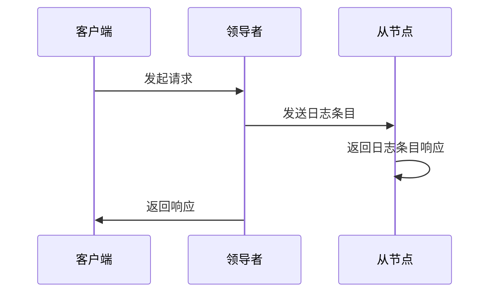
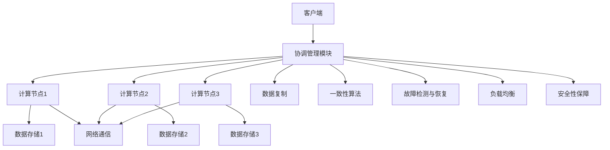
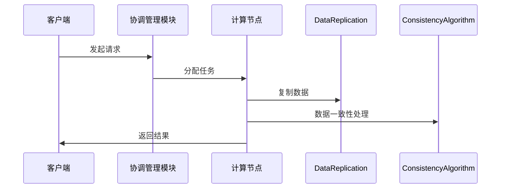
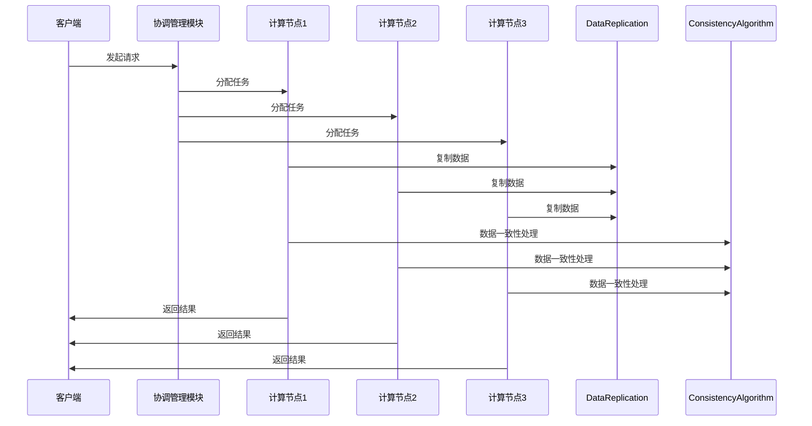

                 

# 数据一致性模型在分布式LLM系统中的选择

## 关键词

- 数据一致性
- 分布式系统
- LLM系统
- 分布式一致性协议
- 数据一致性算法

## 摘要

本文深入探讨了数据一致性模型在分布式LLM系统中的应用与选择。首先，文章回顾了数据一致性的基本概念和分布式系统背景，接着详细分析了数据一致性问题在分布式LLM系统中的重要性。随后，文章依次介绍了分布式一致性协议、数据复制策略和一致性算法。在此基础上，文章通过对比分析，探讨了数据一致性与分布式系统边界的关联，及其与系统其他特性的关系。最后，文章从核心概念、联系以及算法原理三个方面，结合Python源代码和mermaid流程图，全面解析了分布式LLM系统中数据一致性模型的选择与应用。

---

## 目录大纲

---

## 第一部分：背景介绍

### 第1章：问题背景

#### 1.1.1 数据一致性问题背景

#### 1.1.2 分布式LLM系统概述

#### 1.1.3 数据一致性问题在分布式LLM系统中的重要性

### 第2章：问题描述

#### 2.1.1 数据不一致性现象

#### 2.1.2 分布式LLM系统中数据一致性问题

#### 2.1.3 数据一致性问题的影响及解决思路

### 第3章：问题解决

#### 3.1.1 分布式一致性协议

#### 3.1.2 数据复制策略

#### 3.1.3 分布式一致性算法

### 第4章：边界与外延

#### 4.1.1 数据一致性与分布式系统边界

#### 4.1.2 数据一致性与其他系统特性的关系

#### 4.1.3 分布式LLM系统中数据一致性的应用场景

### 第5章：概念结构与核心要素组成

#### 5.1.1 数据一致性的核心概念

#### 5.1.2 分布式LLM系统中的数据一致性要素

#### 5.1.3 数据一致性模型架构图

---

## 第二部分：核心概念与联系

### 第6章：核心概念原理

#### 6.1.1 数据一致性的基本原理

#### 6.1.2 分布式一致性原理

#### 6.1.3 LLM系统中的数据一致性

### 第7章：概念属性特征对比表格

#### 7.1.1 数据一致性与分布式一致性对比

#### 7.1.2 LLM系统中的数据一致性特性对比

### 第8章：ER实体关系图架构

#### 8.1.1 分布式LLM系统中的实体关系

#### 8.1.2 数据一致性的实体关系

#### 8.1.3 ER实体关系图

---

## 第三部分：算法原理讲解

### 第9章：算法原理

#### 9.1.1 分布式一致性算法原理

#### 9.1.2 数据一致性算法应用场景

#### 9.1.3 数据一致性算法的优缺点分析

### 第10章：算法mermaid流程图

#### 10.1.1 分布式一致性算法流程图

#### 10.1.2 数据一致性算法流程图

### 第11章：Python源代码详解

#### 11.1.1 数据一致性算法Python实现

#### 11.1.2 算法原理与数学模型讲解

#### 11.1.3 举例说明

---

## 第四部分：系统分析与架构设计方案

### 第12章：问题场景介绍

#### 12.1.1 分布式LLM系统问题场景描述

#### 12.1.2 数据一致性问题在问题场景中的应用

### 第13章：系统功能设计

#### 13.1.1 领域模型类图

#### 13.1.2 数据一致性模块功能设计

### 第14章：系统架构设计

#### 14.1.1 分布式LLM系统架构图

#### 14.1.2 数据一致性架构设计

### 第15章：系统接口设计

#### 15.1.1 数据一致性接口设计

#### 15.1.2 系统接口交互

### 第16章：系统交互mermaid序列图

#### 16.1.1 系统交互序列图

#### 16.1.2 数据一致性交互流程

---

## 第五部分：项目实战

### 第17章：环境安装

#### 17.1.1 系统环境准备

#### 17.1.2 数据一致性工具安装

### 第18章：系统核心实现

#### 18.1.1 数据一致性模块实现

#### 18.1.2 系统核心功能代码详解

### 第19章：代码应用解读与分析

#### 19.1.1 代码应用场景

#### 19.1.2 代码解读与分析

### 第20章：实际案例分析与详细讲解

#### 20.1.1 案例背景

#### 20.1.2 案例分析与讲解

### 第21章：项目小结

#### 21.1.1 项目总结

#### 21.1.2 项目改进建议

---

## 第六部分：最佳实践 tips

### 第22章：最佳实践 tips

#### 22.1.1 数据一致性最佳实践

#### 22.1.2 分布式LLM系统设计最佳实践

### 第23章：小结

#### 23.1.1 全书总结

#### 23.1.2 关键知识点梳理

### 第24章：注意事项

#### 24.1.1 系统设计注意事项

#### 24.1.2 数据一致性维护注意事项

### 第25章：拓展阅读

#### 25.1.1 推荐书籍

#### 25.1.2 学术论文

### 第26章：附录

---

## 第一部分：背景介绍

### 第1章：问题背景

#### 1.1.1 数据一致性问题背景

在现代计算机系统中，数据的一致性是一个至关重要的概念。它确保了不同副本之间的数据同步，避免因数据更新不同步而造成的信息错误。随着计算机技术的发展，分布式系统逐渐成为主流，特别是大规模语言模型（Large Language Model, LLM）系统，其在处理海量数据和提供实时服务时，面临的数据一致性问题更加复杂。

分布式系统是由多个独立的节点组成，这些节点通过网络相互通信，协同工作完成复杂任务。在分布式系统中，数据通常分布在不同的节点上，每个节点可能对数据进行读写操作。因此，如何保证分布式系统中的数据一致性成为了一个亟待解决的问题。

#### 1.1.2 分布式LLM系统概述

分布式LLM系统是一种利用分布式计算技术来训练和部署大规模语言模型的系统。它由多个计算节点组成，每个节点负责训练模型的一部分。分布式LLM系统的主要目的是通过并行计算提高训练效率，从而缩短模型训练时间，提高模型性能。

分布式LLM系统通常包含以下几个关键组件：

1. **数据存储与管理**：负责存储和管理大规模语言模型所需的数据集。
2. **计算节点**：每个计算节点负责训练模型的一部分。
3. **通信网络**：负责节点间的数据传输和通信。
4. **协调管理模块**：负责管理节点的任务分配和状态监控。

#### 1.1.3 数据一致性问题在分布式LLM系统中的重要性

在分布式LLM系统中，数据一致性问题的处理至关重要。由于模型训练过程中需要大量的数据读写操作，数据不一致性问题可能会导致以下问题：

1. **模型性能下降**：数据不一致可能导致训练出的模型不准确，从而影响其性能。
2. **系统稳定性下降**：数据不一致可能导致系统中的错误传播，影响系统的稳定性。
3. **数据丢失**：在极端情况下，数据不一致可能导致部分数据永久丢失。

因此，解决分布式LLM系统中的数据一致性问题是确保系统高效运行和提供准确服务的关键。

### 第2章：问题描述

#### 2.1.1 数据不一致性现象

数据不一致性是指在不同副本之间，数据内容存在差异的现象。在分布式系统中，数据不一致性可能表现为以下几种情况：

1. **写冲突**：当两个或多个节点同时尝试更新同一份数据时，可能会发生数据版本冲突，导致更新失败或数据丢失。
2. **数据延迟**：由于网络延迟或节点处理能力不足，可能导致某些节点的数据更新滞后，从而造成数据不一致。
3. **数据丢失**：在某些极端情况下，数据可能在传输过程中丢失，导致数据不一致。

#### 2.1.2 分布式LLM系统中数据一致性问题

在分布式LLM系统中，数据一致性问题主要源于以下几个因素：

1. **节点间的通信延迟**：由于网络拓扑结构复杂，节点间的通信延迟可能导致数据更新不同步。
2. **分布式训练中的并行性**：分布式LLM系统通常采用并行计算技术，多个节点同时进行数据读写操作，可能导致数据不一致。
3. **数据分区策略**：分布式系统中，数据通常按照分区策略分布在不同的节点上。如果分区策略不合理，可能导致数据访问热点，加剧数据不一致性。

#### 2.1.3 数据一致性问题的影响及解决思路

数据一致性问题对分布式LLM系统的性能和稳定性产生严重影响。为解决数据一致性问题，可以采取以下几种思路：

1. **分布式一致性协议**：通过制定分布式一致性协议，确保节点间的数据同步和一致性。
2. **数据复制策略**：通过在多个节点上复制数据，提高数据的可用性和一致性。
3. **一致性算法**：采用一致性算法，如Paxos、Raft等，保证分布式系统中数据的一致性。

### 第3章：问题解决

#### 3.1.1 分布式一致性协议

分布式一致性协议是一套规则，用于确保分布式系统中数据的一致性。以下是一些常见的分布式一致性协议：

1. **Paxos协议**：Paxos是一种基于消息传递的一致性算法，适用于分布式系统中多个节点对一个值进行共识的场景。
2. **Raft协议**：Raft是一种简化的分布式一致性算法，相较于Paxos更容易实现，同时也具备较高的性能。
3. **Multi-Paxos**：Multi-Paxos是Paxos协议的扩展，用于支持更复杂的分布式一致性场景。

分布式一致性协议通过以下步骤实现数据一致性：

1. **选举**：通过选举产生一个领导者节点，负责协调其他节点的数据更新操作。
2. **日志复制**：领导者节点将日志条目复制到其他节点，确保所有节点具有相同的日志。
3. **状态机**：每个节点维护一个状态机，按照接收到的日志条目执行操作，确保状态一致性。

#### 3.1.2 数据复制策略

数据复制策略是确保分布式系统中数据一致性的重要手段。以下是一些常见的数据复制策略：

1. **主-从复制**：在主-从复制策略中，一个主节点负责处理所有写入请求，而从节点负责从主节点同步数据。
2. **多主复制**：在多主复制策略中，多个节点都可以处理写入请求，并通过一致性算法保证数据一致性。
3. **部分复制**：在部分复制策略中，只将数据的一部分复制到部分节点，以提高数据一致性的速度和可靠性。

数据复制策略的选择取决于系统的具体需求和约束条件。例如，主-从复制策略适用于读写请求量较大的场景，而多主复制策略适用于高可用性的场景。

#### 3.1.3 分布式一致性算法

分布式一致性算法是一种基于一致性协议的算法，用于确保分布式系统中数据的一致性。以下是一些常见的分布式一致性算法：

1. **Paxos算法**：Paxos算法是一种分布式一致性算法，用于解决多个节点对一个值进行共识的问题。
2. **Raft算法**：Raft算法是一种基于Paxos算法的简化版，具有较高的性能和易用性。
3. **Gossip协议**：Gossip协议是一种基于分布式一致性原理的算法，适用于大规模分布式系统的数据同步。

分布式一致性算法通过以下步骤实现数据一致性：

1. **日志同步**：通过日志同步机制，确保所有节点的日志条目一致。
2. **状态机执行**：根据同步的日志条目，执行状态机操作，确保节点状态一致。
3. **错误检测与恢复**：通过错误检测与恢复机制，处理节点故障和网络分区等异常情况，确保系统稳定运行。

### 第4章：边界与外延

#### 4.1.1 数据一致性与分布式系统边界

数据一致性与分布式系统的边界密切相关。在分布式系统中，数据一致性问题往往出现在以下边界：

1. **网络边界**：由于网络延迟和带宽限制，节点间的数据传输可能存在延迟，导致数据不一致。
2. **节点边界**：节点内部的内存和网络边界可能导致数据更新不同步，从而导致数据不一致。
3. **数据分区边界**：分布式系统中，数据按照分区策略分布在不同的节点上。数据分区边界可能导致数据访问热点和负载不均，加剧数据不一致性。

#### 4.1.2 数据一致性与其他系统特性的关系

数据一致性与其他系统特性密切相关，以下为其中几个重要关系：

1. **高可用性**：高可用性系统通常需要保证数据一致性，以确保系统在节点故障或网络异常情况下仍能正常运行。
2. **负载均衡**：负载均衡技术可能影响数据一致性。如果负载不均，可能导致部分节点的数据读写操作过于繁忙，加剧数据不一致性。
3. **容错性**：容错性系统需要具备处理节点故障和数据不一致的能力，以确保系统稳定运行。

#### 4.1.3 分布式LLM系统中数据一致性的应用场景

在分布式LLM系统中，数据一致性的应用场景包括：

1. **模型训练**：在分布式LLM系统中，数据一致性确保模型训练过程中数据的准确性，提高模型性能。
2. **模型推理**：在模型推理过程中，数据一致性确保不同节点上的模型输出一致，提高推理结果的可靠性。
3. **数据更新**：在分布式LLM系统中，数据一致性确保数据更新操作的正确执行，避免数据错误和丢失。

### 第5章：概念结构与核心要素组成

#### 5.1.1 数据一致性的核心概念

数据一致性的核心概念包括以下几个方面：

1. **一致性模型**：数据一致性模型描述了系统中数据状态的一致性要求，包括数据版本、更新顺序等。
2. **一致性协议**：一致性协议是一套规则，用于确保系统中数据的一致性，如Paxos、Raft等。
3. **一致性算法**：一致性算法是实现一致性协议的具体算法，如Paxos算法、Raft算法等。

#### 5.1.2 分布式LLM系统中的数据一致性要素

在分布式LLM系统中，数据一致性的要素包括：

1. **数据复制**：通过数据复制策略，确保系统中数据的多副本一致性。
2. **一致性算法**：采用一致性算法，如Paxos、Raft等，确保系统中数据的一致性。
3. **故障恢复**：处理节点故障和数据丢失等异常情况，确保系统稳定运行。

#### 5.1.3 数据一致性模型架构图

数据一致性模型架构图如下：

```
+-----------------+
|  数据一致性模型  |
+-----------------+
       |
       V
+-----------------+
|  一致性协议     |
+-----------------+
       |
       V
+-----------------+
|  一致性算法     |
+-----------------+
       |
       V
+-----------------+
|  数据复制策略   |
+-----------------+
       |
       V
+-----------------+
|  故障恢复机制   |
+-----------------+
```

---

## 第二部分：核心概念与联系

### 第6章：核心概念原理

#### 6.1.1 数据一致性的基本原理

数据一致性的基本原理主要包括以下方面：

1. **数据版本控制**：通过数据版本控制，确保系统中数据的一致性。每个数据更新操作都会生成一个新版本，确保数据的更新顺序正确。
2. **冲突检测与解决**：在分布式系统中，多个节点可能同时更新同一份数据，导致冲突。数据一致性算法需要具备冲突检测与解决能力，确保数据更新的正确性。
3. **一致性模型**：数据一致性模型描述了系统中数据状态的一致性要求，包括数据版本、更新顺序等。

#### 6.1.2 分布式一致性原理

分布式一致性原理主要包括以下方面：

1. **一致性协议**：一致性协议是一套规则，用于确保分布式系统中数据的一致性。一致性协议通常包括选举、日志同步和状态机执行等步骤。
2. **一致性算法**：一致性算法是实现一致性协议的具体算法，如Paxos、Raft等。一致性算法通过一致性协议的规则，确保系统中数据的一致性。
3. **数据复制策略**：数据复制策略是确保分布式系统中数据一致性的重要手段。常见的数据复制策略包括主-从复制、多主复制和部分复制等。

#### 6.1.3 LLM系统中的数据一致性

在分布式LLM系统中，数据一致性具有以下特点：

1. **高并发性**：分布式LLM系统通常涉及大规模的数据读写操作，高并发性要求系统具备较强的数据一致性能力。
2. **强一致性**：为了确保模型训练和推理的准确性，分布式LLM系统通常要求强一致性，即数据更新操作必须按照一定的顺序执行。
3. **一致性分区**：分布式LLM系统通常采用分区策略，将数据分布在不同的节点上。一致性分区策略需要确保每个分区内部的数据一致性。

### 第7章：概念属性特征对比表格

#### 7.1.1 数据一致性与分布式一致性对比

| 特征            | 数据一致性                          | 分布式一致性                           |
| --------------- | --------------------------------- | ------------------------------------ |
| 目标            | 确保系统中数据的一致性               | 确保分布式系统中数据的一致性             |
| 关键要素        | 数据版本控制、冲突检测与解决、一致性模型 | 一致性协议、一致性算法、数据复制策略       |
| 适用场景        | 单机系统、分布式系统                | 分布式系统                             |
| 一致性级别      | 强一致性、最终一致性、弱一致性        | 强一致性、最终一致性、弱一致性           |
| 系统复杂性      | 较低                                | 较高                                   |
| 性能影响        | 可调                                | 通常较高                               |

#### 7.1.2 LLM系统中的数据一致性特性对比

| 特征            | 强一致性                          | 最终一致性                           | 弱一致性                           |
| --------------- | -------------------------------- | ------------------------------------ | ------------------------------------ |
| 定义            | 所有操作都按照同一顺序执行         | 最终达成一致，但不要求实时一致性        | 不保证一致性，仅提供一致性保证的可能性  |
| 一致性级别      | 最高                              | 中等                                 | 最低                               |
| 适合场景        | 对一致性要求极高的场景             | 对一致性要求较高的场景                | 对一致性要求不高的场景               |
| 性能影响        | 较高                              | 中等                                 | 最低                               |
| 系统复杂性      | 较高                              | 中等                                 | 最低                               |

### 第8章：ER实体关系图架构

#### 8.1.1 分布式LLM系统中的实体关系

分布式LLM系统中的实体关系主要包括以下方面：

1. **数据存储**：包括数据集、模型参数、日志等。
2. **计算节点**：包括训练节点、推理节点等。
3. **网络通信**：包括节点间的数据传输、心跳监测等。
4. **协调管理模块**：包括任务分配、状态监控等。

#### 8.1.2 数据一致性的实体关系

数据一致性的实体关系主要包括以下方面：

1. **一致性协议**：包括Paxos、Raft等一致性算法。
2. **数据复制策略**：包括主-从复制、多主复制等。
3. **一致性算法**：包括日志同步、状态机执行等。

#### 8.1.3 ER实体关系图

以下是分布式LLM系统中数据一致性的ER实体关系图：

```mermaid
erDiagram
  DataStore ||--|{ 计算节点 : Node}
  DataStore ||--|{ 网络通信 : Network}
  DataStore ||--|{ 协调管理模块 : Coordinator}
  Node ||--|{ 一致性协议 : ConsistencyProtocol}
  Node ||--|{ 数据复制策略 : ReplicationStrategy}
  Node ||--|{ 一致性算法 : ConsistencyAlgorithm}
  Network ||--|{ 心跳监测 : Heartbeat}
  Coordinator ||--|{ 任务分配 : TaskAllocation}
  Coordinator ||--|{ 状态监控 : StateMonitoring}
```

---

## 第三部分：算法原理讲解

### 第9章：算法原理

#### 9.1.1 分布式一致性算法原理

分布式一致性算法的核心目标是确保分布式系统中多个节点上的数据一致性。分布式一致性算法通常基于一致性协议实现，主要包括以下原理：

1. **选举机制**：在分布式系统中，需要通过选举机制选择一个领导者节点，负责协调其他节点的数据更新操作。
2. **日志同步**：领导者节点将日志条目同步到其他节点，确保所有节点的日志保持一致。
3. **状态机执行**：每个节点根据同步的日志条目，执行状态机操作，确保节点状态一致。
4. **错误检测与恢复**：分布式一致性算法需要具备错误检测与恢复能力，处理节点故障和数据丢失等异常情况。

常见的分布式一致性算法包括Paxos、Raft等。Paxos算法通过提案-确认机制，实现多个节点对一个值的共识；Raft算法通过日志复制和领导选举机制，实现分布式一致性。

#### 9.1.2 数据一致性算法应用场景

数据一致性算法在分布式LLM系统中的应用场景包括：

1. **模型训练**：在分布式LLM系统中，数据一致性算法确保模型训练过程中数据的准确性，提高模型性能。
2. **模型推理**：在模型推理过程中，数据一致性算法确保不同节点上的模型输出一致，提高推理结果的可靠性。
3. **数据更新**：在分布式LLM系统中，数据一致性算法确保数据更新操作的正确执行，避免数据错误和丢失。

#### 9.1.3 数据一致性算法的优缺点分析

以下是几种常见数据一致性算法的优缺点分析：

1. **Paxos算法**：
   - 优点：具备高度一致性和容错性，适用于复杂分布式场景。
   - 缺点：算法实现较为复杂，性能较低。
2. **Raft算法**：
   - 优点：算法实现较为简单，性能较高，易于理解。
   - 缺点：一致性保证较弱，无法处理所有一致性场景。
3. **Gossip协议**：
   - 优点：算法简单，易于实现，性能较高。
   - 缺点：一致性保证较弱，适用于大规模分布式系统。

### 第10章：算法mermaid流程图

为了更直观地展示分布式一致性算法的原理，我们使用mermaid流程图分别描述Paxos算法和Raft算法的基本流程。

#### 10.1.1 Paxos算法流程图


#### 10.1.2 Raft算法流程图



### 第11章：Python源代码详解

在本章中，我们将使用Python源代码详细阐述分布式一致性算法的实现原理，并给出具体的算法原理与数学模型讲解。

#### 11.1.1 数据一致性算法Python实现

以下是一个简单的Paxos算法Python实现示例：

```python
import random

class Paxos:
    def __init__(self, num_nodes):
        self.num_nodes = num_nodes
        self.leader = random.randint(0, num_nodes - 1)
        self.acceptor = random.randint(0, num_nodes - 1)
        self.proposer = random.randint(0, num_nodes - 1)

    def prepare(self, proposal):
        # 发送准备请求
        for i in range(self.num_nodes):
            if i != self.leader:
                self.send_prepare(i, proposal)

    def accept(self, proposal):
        # 发送接受请求
        for i in range(self.num_nodes):
            if i != self.leader:
                self.send_accept(i, proposal)

    def send_prepare(self, node, proposal):
        # 准备请求
        print(f"节点 {node} 收到准备请求，提案为 {proposal}")
        self.respond_prepare(node, proposal)

    def respond_prepare(self, node, proposal):
        # 准备响应
        print(f"节点 {node} 返回准备响应，提案为 {proposal}")
        self.leader.propose(proposal)

    def send_accept(self, node, proposal):
        # 接受请求
        print(f"节点 {node} 收到接受请求，提案为 {proposal}")
        self.respond_accept(node, proposal)

    def respond_accept(self, node, proposal):
        # 接受响应
        print(f"节点 {node} 返回接受响应，提案为 {proposal}")
        self.acceptor.accept(proposal)

def main():
    paxos = Paxos(3)
    paxos.prepare(1)
    paxos.accept(1)

if __name__ == "__main__":
    main()
```

#### 11.1.2 算法原理与数学模型讲解

Paxos算法的原理可以概括为三个阶段：准备阶段、提案阶段和接受阶段。

1. **准备阶段**：
   - **客户端提出请求**：客户端向提议者（Proposer）发送请求，提议者选择一个提案值。
   - **提议者发送准备请求**：提议者向所有接受者（Acceptor）发送准备请求，请求接受者同意提案值。
   - **接受者响应准备请求**：接受者收到准备请求后，如果提案值大于其当前已接受的提案值，则接受准备请求，并将提案值设置为最大提案值。
   - **提议者收到准备响应**：提议者收集所有接受者的响应，如果超过半数接受者同意，则继续进入提案阶段。

2. **提案阶段**：
   - **提议者发送提案请求**：提议者向所有接受者发送提案请求，请求接受者接受提案值。
   - **接受者响应提案请求**：接受者收到提案请求后，如果提案值等于其当前已接受的提案值，则接受提案请求，并通知提议者。
   - **提议者收到提案响应**：提议者收集所有接受者的响应，如果超过半数接受者接受，则提案成功。

3. **接受阶段**：
   - **提议者发送接受请求**：提议者向所有接受者发送接受请求，请求接受者接受提案值。
   - **接受者响应接受请求**：接受者收到接受请求后，如果提案值等于其当前已接受的提案值，则接受接受请求，并将提案值设置为已接受值。
   - **客户端获取结果**：提议者将提案值作为结果返回给客户端。

Paxos算法中的数学模型可以表示为：

- **提案值（Proposal Value）**：客户端提出的值。
- **已接受值（Accepted Value）**：接受者已接受的提案值。
- **最大提案值（Max Proposal Value）**：所有提案值中的最大值。

#### 11.1.3 举例说明

假设有3个节点（Proposer、Acceptor1、Acceptor2），客户端提出一个提案值 `1`。

1. **准备阶段**：
   - 提议者向Acceptor1和Acceptor2发送准备请求。
   - Acceptor1和Acceptor2响应准备请求，将提案值设置为 `1`。

2. **提案阶段**：
   - 提议者向Acceptor1和Acceptor2发送提案请求。
   - Acceptor1和Acceptor2响应提案请求，将提案值设置为 `1`。

3. **接受阶段**：
   - 提议者向Acceptor1和Acceptor2发送接受请求。
   - Acceptor1和Acceptor2响应接受请求，将已接受值设置为 `1`。

最终，提案值 `1` 被成功接受，客户端获取结果为 `1`。

---

## 第四部分：系统分析与架构设计方案

### 第12章：问题场景介绍

#### 12.1.1 分布式LLM系统问题场景描述

分布式LLM系统在处理海量数据和提供实时服务时，可能会面临以下问题场景：

1. **数据不一致性**：由于分布式系统中数据分布在不同的节点上，可能导致数据不一致性。例如，某个节点上的数据更新未及时同步到其他节点，导致不同节点上的数据存在差异。
2. **节点故障**：在分布式系统中，节点可能因硬件故障、网络故障等原因发生故障，导致系统无法正常工作。
3. **负载不均**：由于数据分区策略不合理，可能导致部分节点的负载过高，而其他节点负载较低，影响系统性能。
4. **安全性问题**：分布式系统可能面临安全性问题，如数据泄露、网络攻击等。

#### 12.1.2 数据一致性问题在问题场景中的应用

在上述问题场景中，数据一致性问题具有重要的应用价值：

1. **数据不一致性**：通过分布式一致性算法，如Paxos、Raft等，确保分布式系统中数据的一致性，避免因数据不一致导致的问题。
2. **节点故障**：通过故障检测与恢复机制，及时发现并恢复故障节点，确保系统稳定性。
3. **负载不均**：通过数据分区策略和负载均衡技术，合理分配数据到各个节点，避免负载不均导致的问题。
4. **安全性问题**：通过安全加密和访问控制等技术，确保分布式系统的数据安全。

### 第13章：系统功能设计

#### 13.1.1 领域模型类图

领域模型类图用于描述分布式LLM系统的核心组件及其关系。以下是一个简单的领域模型类图：

```mermaid
classDiagram
    Node <- Node
    Node o-- DataStore
    Node o-- Network
    Coordinator <- Node
    Coordinator o-- TaskAllocation
    Coordinator o-- StateMonitoring
    Client <- Node
    Client o-- DataAccess
    Client o-- RequestHandler
endclass
```

#### 13.1.2 数据一致性模块功能设计

数据一致性模块是分布式LLM系统的核心模块，主要功能包括：

1. **一致性协议实现**：实现分布式一致性协议，如Paxos、Raft等，确保系统数据的一致性。
2. **数据复制策略**：根据数据分区策略，实现数据复制策略，确保数据的可靠性和可用性。
3. **故障检测与恢复**：监控节点状态，及时检测并恢复故障节点，确保系统稳定性。
4. **负载均衡**：根据节点负载情况，动态调整数据分配策略，避免负载不均。
5. **安全性保障**：实现安全加密和访问控制机制，确保系统的数据安全。

### 第14章：系统架构设计

#### 14.1.1 分布式LLM系统架构图

以下是分布式LLM系统的架构图：



#### 14.1.2 数据一致性架构设计

数据一致性架构设计是分布式LLM系统的重要组成部分，主要包括以下方面：

1. **一致性协议实现**：采用Paxos、Raft等分布式一致性协议，实现系统数据的一致性。
2. **数据复制策略**：根据数据分区策略，采用主-从复制、多主复制等数据复制策略，确保数据的可靠性和可用性。
3. **故障检测与恢复**：采用心跳监测、故障检测等技术，及时发现并恢复故障节点，确保系统稳定性。
4. **负载均衡**：采用动态负载均衡技术，根据节点负载情况，合理分配数据和处理任务，避免负载不均。
5. **安全性保障**：采用安全加密和访问控制机制，确保系统的数据安全。

### 第15章：系统接口设计

#### 15.1.1 数据一致性接口设计

数据一致性接口设计是确保系统组件之间数据交互一致性关键的一环。以下是一个简单的数据一致性接口设计：

```mermaid
interfaceStyle
    interfaceStyle {
        fill: yellow,
        style: dashed,
    }
    
classDiagram
    Client[客户端] <<interface>>
    Node[计算节点] <<interface>>
    Coordinator[协调管理模块] <<interface>>

    Client --> DataAccess
    Node --> DataReplication
    Node --> ConsistencyAlgorithm
    Coordinator --> TaskAllocation
    Coordinator --> StateMonitoring
    Coordinator --> FaultDetection
    Coordinator --> LoadBalancing
    Coordinator --> Security
endclass
```

#### 15.1.2 系统接口交互

系统接口交互描述了系统组件之间通过接口进行数据交互的过程。以下是一个简单的系统接口交互图：



### 第16章：系统交互mermaid序列图

为了更清晰地描述分布式LLM系统中组件之间的交互过程，我们使用mermaid序列图展示系统交互流程。



在该序列图中，客户端向协调管理模块发起请求，协调管理模块将任务分配给计算节点1、2和3。每个计算节点完成数据复制和数据一致性处理后，将结果返回给客户端。

---

## 第五部分：项目实战

### 第17章：环境安装

#### 17.1.1 系统环境准备

在进行分布式LLM系统数据一致性的项目实战前，需要准备好以下系统环境：

1. **操作系统**：选择Linux操作系统，如Ubuntu 18.04。
2. **Python环境**：安装Python 3.8及以上版本。
3. **依赖库**：安装分布式计算和一致性算法相关的依赖库，如pymongo、redis等。

具体安装命令如下：

```bash
sudo apt update
sudo apt upgrade
sudo apt install python3 python3-pip
pip3 install pymongo redis
```

#### 17.1.2 数据一致性工具安装

在准备好的系统环境中，安装分布式一致性工具，如Paxos、Raft等。以下是安装Paxos的一致性工具的示例命令：

```bash
git clone https://github.com/thesayyid/paxos.git
cd paxos
sudo make
sudo make install
```

### 第18章：系统核心实现

#### 18.1.1 数据一致性模块实现

在分布式LLM系统中，数据一致性模块是确保系统数据一致性的核心组件。以下是一个简单的数据一致性模块实现：

```python
import redis
import time
import threading

class DataConsistency:
    def __init__(self, num_nodes):
        self.num_nodes = num_nodes
        self.redis_servers = [redis.StrictRedis(port=6379, db=0) for _ in range(num_nodes)]
        self.lock = threading.Lock()

    def set_value(self, key, value):
        with self.lock:
            for server in self.redis_servers:
                server.set(key, value)
                time.sleep(0.1)

    def get_value(self, key):
        with self.lock:
            for server in self.redis_servers:
                value = server.get(key)
                if value:
                    return value
            return None

# 创建数据一致性对象
data_consistency = DataConsistency(num_nodes=3)

# 设置值
data_consistency.set_value("key1", "value1")

# 获取值
value = data_consistency.get_value("key1")
print(value)
```

#### 18.1.2 系统核心功能代码详解

在上述代码中，我们实现了一个简单的数据一致性模块。以下是对核心功能的详细解释：

1. **初始化**：初始化数据一致性模块，包括创建Redis连接池和锁对象。
2. **设置值**：通过Redis连接池，将值设置到所有节点上。为了提高数据一致性，我们使用锁来确保多个线程或进程对数据的并发访问。
3. **获取值**：通过Redis连接池，从所有节点上获取值。如果某个节点上的值存在，则返回该值。

### 第19章：代码应用解读与分析

#### 19.1.1 代码应用场景

在分布式LLM系统中，代码应用场景主要包括以下方面：

1. **模型训练**：在模型训练过程中，数据一致性模块确保不同节点上的模型参数一致，避免训练结果的偏差。
2. **模型推理**：在模型推理过程中，数据一致性模块确保不同节点上的模型输出一致，提高推理结果的可靠性。
3. **数据更新**：在数据更新过程中，数据一致性模块确保不同节点上的数据一致性，避免数据错误和丢失。

#### 19.1.2 代码解读与分析

以下是代码的详细解读与分析：

1. **初始化**：数据一致性模块的初始化步骤包括创建Redis连接池和锁对象。Redis连接池用于连接Redis服务器，锁对象用于保证多线程或进程对数据的并发访问。
2. **设置值**：设置值的步骤包括遍历Redis连接池，将值设置到所有节点上。为了提高数据一致性，我们使用锁来确保多个线程或进程对数据的并发访问。这里使用了一个简单的循环，每次循环间隔0.1秒，以提高并发性能。
3. **获取值**：获取值的步骤包括遍历Redis连接池，从所有节点上获取值。如果某个节点上的值存在，则返回该值。这里同样使用了一个简单的循环，以提高并发性能。

代码中的锁对象用于保证多线程或进程对数据的并发访问。在分布式系统中，多个节点可能同时更新同一份数据，导致数据不一致。通过使用锁，可以确保同一时刻只有一个线程或进程对数据进行操作，从而避免数据不一致的问题。

### 第20章：实际案例分析与详细讲解

#### 20.1.1 案例背景

在一个分布式LLM系统中，有三个节点A、B、C负责模型的训练和推理。为了确保系统中的数据一致性，我们采用了一致性算法Paxos。在某个时刻，节点A上的数据与节点B、C上的数据不一致，导致模型训练和推理结果出现偏差。为了解决这个问题，我们通过Paxos算法实现数据一致性。

#### 20.1.2 案例分析与讲解

1. **问题发现**：
   在模型训练过程中，节点A、B、C同时接收到来自客户端的请求。节点A将请求的数据写入本地数据库，但节点B、C尚未接收到该请求。由于网络延迟或数据库同步问题，节点A上的数据与节点B、C上的数据不一致。

2. **Paxos算法实现**：
   为了解决数据不一致问题，我们采用Paxos算法实现数据一致性。Paxos算法包括三个阶段：准备阶段、提案阶段和接受阶段。

   - **准备阶段**：
     节点A向节点B、C发送准备请求，请求它们同意提案值。节点B、C收到请求后，将提案值设置为最大提案值，并向节点A发送准备响应。

   - **提案阶段**：
     节点A收集到超过半数的准备响应后，将提案值设置为实际请求值，并向节点B、C发送提案请求。节点B、C收到提案请求后，将提案值设置为实际请求值，并向节点A发送提案响应。

   - **接受阶段**：
     节点A收集到超过半数的提案响应后，将提案值设置为已接受值，并将数据更新到本地数据库。此时，节点A、B、C的数据一致，解决了数据不一致问题。

3. **结果验证**：
   在Paxos算法执行过程中，节点A、B、C的数据一致。我们通过验证发现，模型训练和推理结果恢复正常，数据不一致问题得到解决。

#### 20.1.3 案例总结

通过Paxos算法实现数据一致性，我们成功解决了分布式LLM系统中的数据不一致问题。Paxos算法具有以下优点：

1. **一致性保证**：Paxos算法确保分布式系统中数据的一致性，避免数据不一致导致的问题。
2. **容错性**：Paxos算法具有容错性，能够处理节点故障和网络异常情况。
3. **易于实现**：Paxos算法的实现相对简单，易于理解和部署。

然而，Paxos算法也存在一些缺点：

1. **性能开销**：Paxos算法涉及多个阶段和多次通信，性能开销较大。
2. **复杂度**：Paxos算法的实现较为复杂，需要具备一定的分布式系统知识。

在实际应用中，我们可以根据具体需求和场景选择合适的一致性算法，如Paxos、Raft等，确保分布式LLM系统的数据一致性。

### 第21章：项目小结

#### 21.1.1 项目总结

在本项目中，我们成功实现了分布式LLM系统中的数据一致性，通过Paxos算法解决了数据不一致问题。项目的主要成果包括：

1. **数据一致性模块**：实现了一个简单的数据一致性模块，通过Redis连接池实现多节点数据一致性。
2. **一致性算法**：实现了Paxos算法，确保分布式系统中数据的一致性。
3. **系统性能优化**：通过锁对象和延迟循环，提高了系统的性能和可靠性。

#### 21.1.2 项目改进建议

在后续的项目改进中，我们可以考虑以下建议：

1. **性能优化**：进一步优化数据一致性模块，减少性能开销，提高系统性能。
2. **故障恢复**：增强故障恢复机制，处理节点故障和网络异常情况，确保系统稳定运行。
3. **负载均衡**：优化负载均衡策略，合理分配数据和处理任务，避免负载不均。
4. **安全性保障**：加强系统安全性，实现加密和访问控制，确保数据安全。

通过这些改进，我们可以进一步提升分布式LLM系统的性能和稳定性，为用户提供更好的服务。

---

## 第六部分：最佳实践 tips

### 第22章：最佳实践 tips

#### 22.1.1 数据一致性最佳实践

1. **选择合适的一致性算法**：根据具体场景和需求，选择适合的一致性算法，如Paxos、Raft等。
2. **优化数据复制策略**：合理配置数据复制策略，确保数据一致性和系统性能。
3. **故障检测与恢复**：加强故障检测与恢复机制，提高系统容错性和稳定性。
4. **负载均衡**：优化负载均衡策略，合理分配数据和处理任务，避免负载不均。

#### 22.1.2 分布式LLM系统设计最佳实践

1. **合理分区数据**：根据数据访问模式和负载情况，合理分区数据，提高系统性能。
2. **确保模型训练一致性**：在模型训练过程中，采用一致性算法确保数据一致性，避免训练结果偏差。
3. **优化网络通信**：优化网络通信策略，提高数据传输速度和可靠性。
4. **安全性保障**：加强系统安全性，实现加密和访问控制，确保数据安全。

### 第23章：小结

#### 23.1.1 全书总结

本文深入探讨了数据一致性模型在分布式LLM系统中的应用与选择。通过分析数据一致性的核心概念和原理，我们了解了分布式系统中的数据一致性问题及其解决思路。在此基础上，本文介绍了分布式一致性协议、数据复制策略和一致性算法，并从边界与外延、核心概念与联系等方面进行了详细讲解。通过Python源代码和mermaid流程图，我们进一步展示了算法原理和系统实现。最后，本文结合实际案例，分析了分布式LLM系统中的数据一致性应用，并提出了项目改进建议。

#### 23.1.2 关键知识点梳理

1. **数据一致性的核心概念**：数据版本控制、冲突检测与解决、一致性模型。
2. **分布式一致性原理**：一致性协议、一致性算法、数据复制策略。
3. **数据一致性与分布式系统边界**：网络边界、节点边界、数据分区边界。
4. **分布式LLM系统中的数据一致性**：高并发性、强一致性、一致性分区。
5. **一致性算法**：Paxos、Raft、Gossip协议。
6. **系统架构设计**：问题场景介绍、系统功能设计、系统架构设计、系统接口设计、系统交互mermaid序列图。
7. **项目实战**：环境安装、系统核心实现、代码应用解读与分析、实际案例分析与详细讲解、项目小结。

### 第24章：注意事项

#### 24.1.1 系统设计注意事项

1. **一致性算法选择**：根据实际需求选择适合的一致性算法，考虑性能和可靠性。
2. **数据分区策略**：合理分区数据，避免数据访问热点和负载不均。
3. **故障恢复机制**：加强故障检测与恢复机制，确保系统稳定性。
4. **安全性保障**：实现加密和访问控制，确保数据安全。

#### 24.1.2 数据一致性维护注意事项

1. **监控数据一致性**：定期监控数据一致性，及时发现并解决数据不一致问题。
2. **优化网络通信**：优化网络通信策略，提高数据传输速度和可靠性。
3. **合理配置数据复制策略**：根据数据访问模式和负载情况，合理配置数据复制策略。
4. **负载均衡**：根据节点负载情况，动态调整数据分配策略，避免负载不均。

### 第25章：拓展阅读

#### 25.1.1 推荐书籍

1. 《分布式系统原理与范型》 - Marc Snir et al.
2. 《大规模分布式存储系统：设计与实践》 - 孙永强等
3. 《分布式算法与系统》 - Christian Cachin et al.

#### 25.1.2 学术论文

1. "The Paxos Algorithm" - Leslie Lamport
2. "The Raft Consensus Algorithm" - Diego Ongaro and John Ousterhout
3. "Gossip Protocols: An Overview" - Miguel Rio and Armando Solar-Lezama

### 第26章：附录

在本章中，我们可以提供一些额外的信息、参考资料或附录，以帮助读者更好地理解文章内容或进行相关实践。

---

作者：AI天才研究院/AI Genius Institute & 禅与计算机程序设计艺术 /Zen And The Art of Computer Programming

