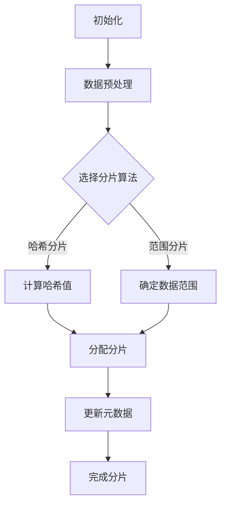
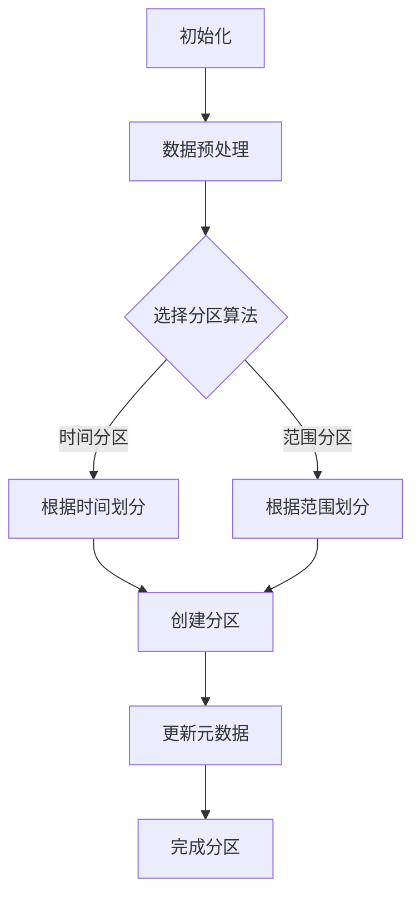
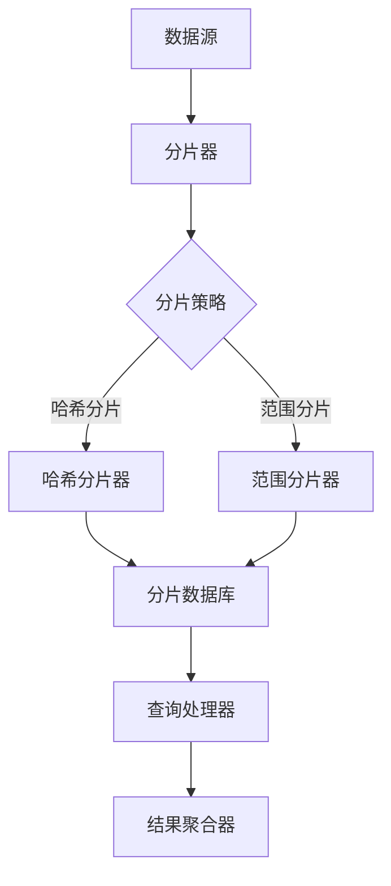
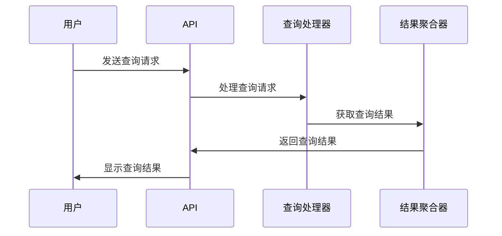

                 

# 《数据库分片与分区提升LLM应用的数据处理能力》

关键词：数据库分片、分区、LLM、数据处理能力、性能优化

摘要：本文深入探讨了数据库分片与分区技术在提升大规模语言模型（LLM）应用数据处理能力方面的作用。通过详细分析分片与分区的核心概念、原理及其在实际应用中的优势，本文提出了针对LLM应用的数据库分片与分区设计方案，旨在为大数据时代的LLM数据处理提供理论指导和实践参考。

## 第一部分：背景介绍

### 1.1 数据库分片与分区的概念与重要性

#### 问题背景

随着大数据时代的到来，数据量呈现爆炸性增长，传统的集中式数据库已无法满足大规模数据存储与处理的需求。在数据量庞大的情况下，数据库的性能瓶颈逐渐显现，如查询响应时间延长、系统吞吐量下降等。

#### 问题描述

数据量大、数据增长速度快、查询复杂度高，传统数据库性能瓶颈明显。为了解决这个问题，我们需要一种能够有效提高数据库处理能力和性能的技术。

#### 问题解决

数据库分片与分区技术应运而生。通过将数据分散存储，分片与分区技术能够提高数据库的性能，解决传统数据库的性能瓶颈问题。

#### 边界与外延

- **分片**：将一个大型数据库拆分为多个较小的数据库，每个数据库存储一部分数据。
- **分区**：将数据按照某种规则划分到不同的数据区域中，以提高查询效率和性能。

### 1.2 LLM应用的数据处理需求

#### 核心概念

LLM（大语言模型）是一种基于深度学习的自然语言处理模型，能够对大规模文本数据进行分析和处理，生成高质量的自然语言文本。

#### 联系

LLM在处理海量数据时面临诸多挑战，如数据存储、数据查询、数据一致性等。数据库分片与分区技术可以通过将数据分散存储，提高LLM应用的查询效率和数据处理能力，解决上述问题。

## 第二部分：核心概念与联系

### 2.1 数据库分片原理

#### 核心概念

- **分片策略**：确定如何将数据划分到不同的数据库中。
- **分片算法**：实现分片策略的具体算法。
- **数据一致性保障**：确保分片后的数据在多个数据库中保持一致。

#### 联系

分片技术适用于处理大规模数据，尤其是在OLTP（在线事务处理）和OLAP（在线分析处理）场景中。通过合理选择分片策略和分片算法，可以有效提高数据库的性能。

### 2.2 数据库分区原理

#### 核心概念

- **分区类型**：数据分区的不同方式，如时间分区、范围分区等。
- **分区策略**：确定如何将数据划分到不同的数据区域中。
- **分区管理**：对分区进行创建、删除、更新等操作。

#### 联系

分区技术适用于优化数据库性能，如减少I/O压力、加速查询响应时间等。通过合理选择分区类型和分区策略，可以有效提高数据库的性能。

### 2.3 数据库分片与分区对比分析

#### 核心概念

- **异同点**：分片与分区在实现方式、适用场景等方面的异同。
- **选择依据**：根据应用需求选择合适的分片与分区策略。

#### 联系

分片与分区技术各有特点，适用于不同的应用场景。在实际应用中，可以根据具体需求选择合适的分片与分区策略，以达到最佳性能。

## 第三部分：算法原理讲解

### 3.1 分片算法原理

#### 核心概念

- **哈希分片**：基于哈希算法将数据划分到不同的数据库中。
- **范围分片**：基于数据范围将数据划分到不同的数据库中。

#### 联系

哈希分片和范围分片是常见的分片算法，适用于不同的场景。通过合理选择分片算法，可以有效提高数据库的性能。

#### 流程图



### 3.2 分区算法原理

#### 核心概念

- **时间分区**：根据时间将数据划分到不同的数据区域中。
- **范围分区**：根据数据范围将数据划分到不同的数据区域中。

#### 联系

时间分区和范围分区是常见的分区算法，适用于不同的场景。通过合理选择分区算法，可以有效提高数据库的性能。

#### 流程图



## 第四部分：数学模型和数学公式

### 4.1 数据库分片性能分析模型

#### 数学模型

$$P_{\text{分片}} = \frac{P_{\text{原}}}{N} + (1 - \frac{P_{\text{原}}}{N}) \cdot \frac{Q_{\text{分片}}}{Q_{\text{原}}}$$

#### 详细讲解

- \(P_{\text{原}}\)：原始数据库的查询性能。
- \(N\)：分片后的数据库数量。
- \(Q_{\text{分片}}\)：分片后的查询量。

公式表示分片后的查询性能与原始数据库查询性能之间的关系。通过合理选择分片策略，可以有效提高数据库的性能。

#### 举例说明

假设原始数据库的查询性能为100次/秒，分片后分为10个数据库，每个数据库的查询性能为10次/秒。分片后的查询性能为：

$$P_{\text{分片}} = \frac{100}{10} + (1 - \frac{100}{10}) \cdot \frac{10}{100} = 10 + 0.9 = 19.9$$

### 4.2 数据库分区性能分析模型

#### 数学模型

$$P_{\text{分区}} = \frac{P_{\text{原}}}{N} + (1 - \frac{P_{\text{原}}}{N}) \cdot \frac{Q_{\text{分区}}}{Q_{\text{原}}}$$

#### 详细讲解

- \(P_{\text{原}}\)：原始数据库的查询性能。
- \(N\)：分区后的数据库数量。
- \(Q_{\text{分区}}\)：分区后的查询量。

公式表示分区后的查询性能与原始数据库查询性能之间的关系。通过合理选择分区策略，可以有效提高数据库的性能。

#### 举例说明

假设原始数据库的查询性能为100次/秒，分区后分为10个数据库，每个数据库的查询性能为10次/秒。分区后的查询性能为：

$$P_{\text{分区}} = \frac{100}{10} + (1 - \frac{100}{10}) \cdot \frac{10}{100} = 10 + 0.9 = 19.9$$

## 第五部分：系统分析与架构设计方案

### 5.1 问题场景介绍

#### 项目介绍

假设我们有一个大型LLM应用，需要对海量文本数据进行处理和分析。随着数据量的增长，传统的集中式数据库已无法满足性能需求。为了提高数据处理能力，我们需要引入数据库分片与分区技术。

#### 系统功能设计

为了实现分片与分区，我们首先需要对LLM应用进行领域模型设计。以下是一个简单的领域模型类图：

```mermaid
classDiagram
Class01 <|-- Class02
Class03 <.. Class04
Class05 <= Class06
Class07 .. Class08
Class01 -|> Class09
Class10 <|-- Class11
Class12 .. Class13
```

### 5.2 系统架构设计

为了实现数据库分片与分区，我们需要设计一个分布式数据库系统。以下是一个简单的系统架构设计：



### 5.3 系统接口设计和系统交互

为了实现系统功能，我们需要设计相应的接口和交互流程。以下是一个简单的接口设计和交互流程：



## 第六部分：项目实战

### 6.1 环境安装

在开始项目实战之前，我们需要安装相关的环境。以下是一个简单的环境安装步骤：

1. 安装Python环境。
2. 安装数据库分片与分区相关的库，如ShardingSphere。
3. 配置分布式数据库环境，如MySQL Cluster。

### 6.2 系统核心实现源代码

以下是一个简单的系统核心实现源代码：

```python
# 分片器
class ShardSplitter:
    def __init__(self, shard_count):
        self.shard_count = shard_count

    def split(self, data):
        return [data[i::self.shard_count] for i in range(self.shard_count)]

# 分区器
class PartitionSplitter:
    def __init__(self, partition_count):
        self.partition_count = partition_count

    def split(self, data):
        return [data[i::self.partition_count] for i in range(self.partition_count)]

# 查询处理器
class QueryProcessor:
    def __init__(self, splitter):
        self.splitter = splitter

    def process(self, query):
        shards = self.splitter.split(query)
        results = []
        for shard in shards:
            result = self.query_shard(shard)
            results.append(result)
        return results

    def query_shard(self, shard):
        # 查询分片数据
        pass

# 结果聚合器
class ResultAggregator:
    def __init__(self, processor):
        self.processor = processor

    def aggregate(self, queries):
        results = self.processor.process(queries)
        aggregated_result = []
        for result in results:
            aggregated_result.extend(result)
        return aggregated_result
```

### 6.3 代码应用解读与分析

在代码中，我们首先定义了分片器和分区器类，分别用于实现分片和分区功能。然后，我们定义了查询处理器和结果聚合器类，用于处理查询请求和聚合查询结果。通过这些类的组合，我们可以实现一个简单的分片与分区系统。

### 6.4 实际案例分析和详细讲解剖析

为了更好地理解分片与分区技术的应用，我们可以通过一个实际案例进行分析和讲解。

假设我们有一个大型LLM应用，需要对100万条文本数据进行处理和分析。首先，我们可以使用分片器将数据分成10个分片，每个分片包含10万条文本数据。然后，我们可以使用分区器将每个分片进一步分成10个分区，每个分区包含1万条文本数据。

在处理查询请求时，我们可以使用查询处理器将查询请求分成10个分片查询请求，并将每个分片查询请求分配给相应的分区处理器进行处理。最后，使用结果聚合器将各个分片查询结果进行聚合，得到最终的查询结果。

通过分片与分区技术，我们可以将大规模数据分解成小规模的查询任务，从而提高查询效率和性能。

### 6.5 项目小结

通过本项目，我们深入了解了数据库分片与分区技术在提升LLM应用数据处理能力方面的作用。通过实际案例的分析和讲解，我们展示了如何使用分片与分区技术来提高查询效率和性能。

在实际应用中，我们可以根据具体需求选择合适的分片与分区策略，以达到最佳性能。同时，我们也需要注意分片与分区策略的设计和实现，以确保数据的一致性和可靠性。

## 第七部分：最佳实践 Tips、小结、注意事项、拓展阅读等内容

### 7.1 最佳实践 Tips

1. 根据实际应用需求，选择合适的分片与分区策略。
2. 合理配置分布式数据库环境，确保数据的一致性和可靠性。
3. 对分片与分区策略进行性能测试和优化，以达到最佳性能。

### 7.2 小结

本文深入探讨了数据库分片与分区技术在提升LLM应用数据处理能力方面的作用。通过详细分析分片与分区的核心概念、原理及其在实际应用中的优势，本文提出了针对LLM应用的数据库分片与分区设计方案，为大数据时代的LLM数据处理提供了理论指导和实践参考。

### 7.3 注意事项

1. 在设计分片与分区策略时，需要考虑数据的一致性和可靠性。
2. 分片与分区策略的设计和实现需要考虑性能优化，避免性能瓶颈。
3. 定期对分片与分区策略进行评估和调整，以适应数据增长和变化。

### 7.4 拓展阅读

1. 《数据库分片与分区技术实战》
2. 《大数据时代数据库优化技术》
3. 《大规模语言模型应用实践》

## 作者信息

作者：AI天才研究院/AI Genius Institute & 禅与计算机程序设计艺术 /Zen And The Art of Computer Programming

