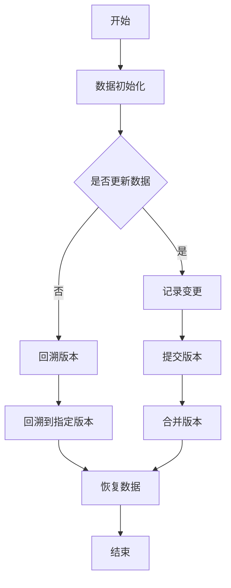
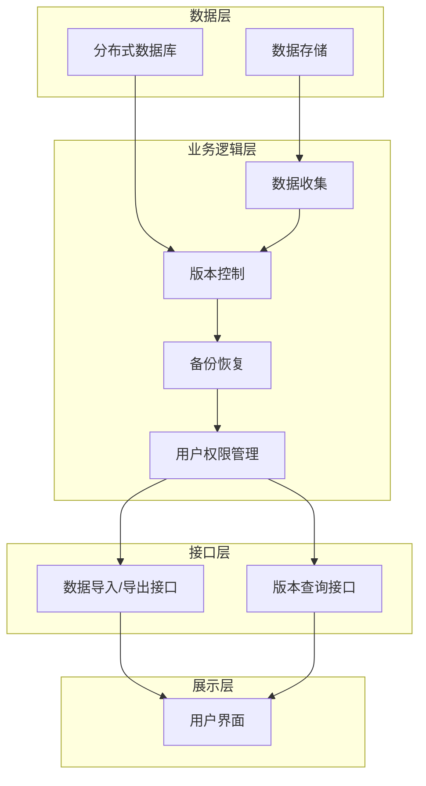
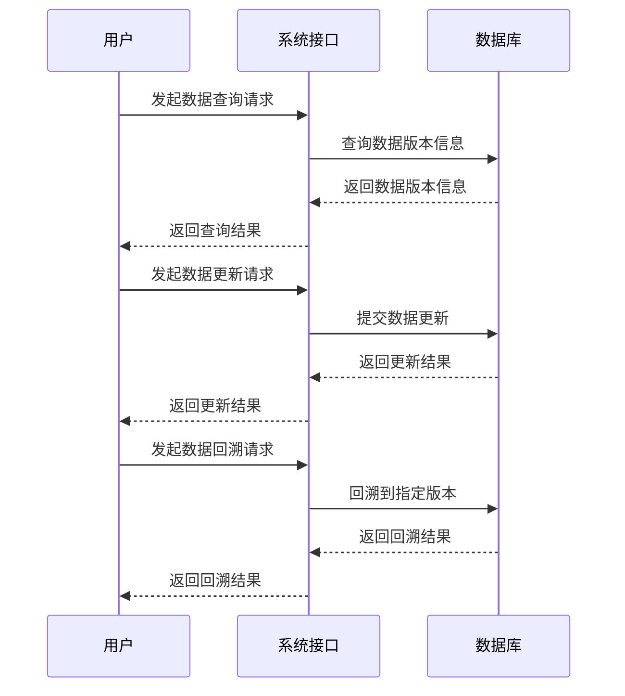

                 


### 第1章 引言与背景

在当今人工智能（AI）迅猛发展的时代，大模型如语言学习模型（LLM）已经成为研究和应用的热点。LLM在大规模数据处理、自然语言理解与生成等领域展现出了强大的潜力，但是其应用过程中的数据版本控制问题却不容忽视。本章将围绕数据版本控制在LLM应用迭代中的应用进行探讨，旨在阐述问题的背景、核心概念及其重要性。

#### 1.1 问题的背景

**1.1.1 大模型在人工智能领域的重要性**

人工智能作为计算机科学的前沿领域，已经取得了令人瞩目的成果。随着计算能力和数据资源的不断增长，深度学习模型，尤其是大型语言模型（LLM）的研究和应用越来越广泛。LLM通过学习海量的文本数据，可以实现对自然语言的生成、理解和翻译等任务的高效处理。例如，GPT-3、BERT等模型在多个领域都展现出了卓越的性能。

**1.1.2 LLMO的迭代需求**

然而，LLM的应用并不是一成不变的。随着技术进步和应用需求的不断变化，LLM需要不断地进行迭代和优化。每一次迭代都可能带来模型性能的提升，也可能引入新的问题和挑战。这就需要我们对模型所依赖的数据进行有效的版本控制，以确保数据的一致性和可靠性。

**1.1.3 数据版本控制的需求与挑战**

数据版本控制是一种管理数据变更的技术手段，其目的是确保数据在不同版本之间的可追溯性和一致性。在LLM应用迭代中，数据版本控制的需求主要来源于以下几个方面：

1. **数据更新**：随着模型的迭代，训练数据集需要不断更新，以适应新的应用场景和需求。
2. **数据回溯**：在模型迭代过程中，如果出现问题，可能需要回溯到之前的版本，进行故障排查和修复。
3. **数据一致性**：在多个模型迭代之间，数据的一致性至关重要，以确保模型训练结果的稳定性和可靠性。

然而，数据版本控制也面临着一系列挑战，如数据规模庞大、数据更新频率高、版本冲突等问题。这些问题需要通过有效的数据版本控制策略来解决。

#### 1.2 数据版本控制概述

**1.2.1 数据版本控制的基本概念**

数据版本控制是一种跟踪和管理数据变更的技术，它通过为数据赋予唯一的版本号或标签，来记录数据的每一次修改和变更。版本控制的核心目标是确保数据在不同版本之间的可追溯性、一致性和可靠性。

**1.2.2 数据版本控制的重要性**

数据版本控制的重要性体现在以下几个方面：

1. **数据可追溯性**：通过版本控制，可以清晰地记录数据的每一次变更，便于后续的数据分析和问题排查。
2. **数据一致性**：版本控制可以确保在不同迭代过程中，使用的数据是一致的，从而避免因数据不一致导致的问题。
3. **数据可靠性**：版本控制有助于提高数据的可靠性，通过回溯和对比不同版本的数据，可以发现和修复数据中的错误。

总之，数据版本控制在LLM应用迭代中扮演着至关重要的角色，它不仅是数据管理的基础，也是确保模型迭代顺利进行的关键。

---

在本章中，我们介绍了数据版本控制在LLM应用迭代中的背景和重要性。随着人工智能技术的不断发展，大模型如LLM的应用越来越广泛，而数据版本控制作为数据管理的重要组成部分，对于模型迭代和优化具有不可替代的作用。在接下来的章节中，我们将进一步探讨数据版本控制的理论基础、具体方法及其在实际应用中的挑战和解决方案。

关键词：数据版本控制，LLM，模型迭代，自然语言处理，版本管理

摘要：本文探讨了数据版本控制在LLM应用迭代中的重要性，分析了数据版本控制的基本概念和核心原则，并探讨了其在LLM应用中的实际应用挑战和解决方案。通过本文的讨论，读者可以深入了解数据版本控制在人工智能领域的重要性及其应用方法。

作者：AI天才研究院/AI Genius Institute & 禅与计算机程序设计艺术 /Zen And The Art of Computer Programming

---

接下来，我们将进一步探讨数据版本控制的基本理论，包括其核心概念和实现机制，为后续章节的深入讨论打下基础。

## 第2章 数据版本控制理论

在深入探讨数据版本控制在LLM应用迭代中的应用之前，我们需要首先理解数据版本控制的基本理论。数据版本控制是一种管理数据变更的技术，通过为数据赋予唯一的版本号或标签来记录数据的每一次修改和变更。本章将详细阐述数据版本控制的核心概念和实现机制，并分析不同的数据版本控制方法及其优缺点。

### 2.1 数据版本控制的原理

**2.1.1 数据版本控制的核心概念**

数据版本控制的核心概念包括版本号、变更记录、分支管理和合并操作等。

1. **版本号**：版本号是标识数据不同版本的一种数字或字符串。通常，版本号采用递增的方式，如1.0、1.1、1.2等，以表示数据的更新历史。

2. **变更记录**：变更记录是记录数据变更的具体内容和细节。每次数据变更都需要记录变更的类型（如增加、删除、修改）、变更的时间和作者等信息，以便后续的追踪和分析。

3. **分支管理**：分支管理是数据版本控制中的一个重要机制。它允许开发者在不同的开发阶段创建独立的分支，从而在数据变更过程中保持数据的隔离性和可追溯性。

4. **合并操作**：合并操作是将不同分支或版本的数据合并为一个统一版本的过程。合并操作需要解决版本之间的冲突和依赖关系，以确保合并后的数据一致性。

**2.1.2 数据版本控制机制**

数据版本控制机制主要包括版本库（Repository）和版本控制工具（Version Control Tool）。

1. **版本库**：版本库是存储数据版本信息的中心仓库，它通常包含多个分支和每个分支的多个版本。版本库可以位于本地计算机或远程服务器上，以实现数据的集中管理和分布式协作。

2. **版本控制工具**：版本控制工具是用于操作版本库的软件，它提供了各种命令和界面，以便用户对数据进行版本管理。常见的版本控制工具包括Git、Subversion（SVN）、Mercurial等。

### 2.2 数据版本控制方法

**2.2.1 常见的数据版本控制方法**

数据版本控制方法可以分为集中式和分布式两种。

**集中式版本控制**

集中式版本控制（Centralized Version Control）是一种传统的数据版本控制方法。在这种方法中，版本库位于一个中央服务器上，用户需要从服务器上获取数据，并对数据进行修改后提交回服务器。集中式版本控制的优点是数据管理和维护相对简单，但缺点是依赖中央服务器，容易出现单点故障。

**分布式版本控制**

分布式版本控制（Distributed Version Control）是近年来兴起的一种数据版本控制方法。与集中式版本控制不同，分布式版本控制将版本库分布在多个节点上，每个节点都包含完整的版本库。分布式版本控制的优点是数据分布式存储，提高了系统的可靠性和扩展性，但缺点是数据管理和维护相对复杂。

**2.2.2 方法比较与分析**

集中式版本控制和分布式版本控制各有优缺点，选择适合的方法需要根据具体的应用场景和需求来决定。

1. **数据规模**：对于数据规模较小的项目，集中式版本控制更为适合；对于数据规模较大的项目，分布式版本控制更具优势。

2. **协作需求**：如果项目需要多人协作，分布式版本控制可以更好地支持多人并行开发。

3. **安全性**：集中式版本控制安全性较高，因为所有数据都存储在中央服务器上；分布式版本控制安全性相对较低，因为数据分布在多个节点上。

4. **性能**：分布式版本控制具有更高的性能，尤其是在处理大量并发操作时。

总之，数据版本控制方法的选择应综合考虑数据规模、协作需求、安全性和性能等因素，以满足具体应用的需求。

### 2.3 数据版本控制的应用场景

数据版本控制广泛应用于软件工程、数据库管理和人工智能等领域。在LLM应用迭代中，数据版本控制主要用于以下几个方面：

1. **数据更新与回溯**：随着LLM的迭代，训练数据集需要不断更新。数据版本控制可以帮助记录数据的变更历史，并在出现问题时快速回溯到之前的版本。

2. **数据一致性**：在多个模型迭代之间，数据的一致性至关重要。数据版本控制可以确保不同迭代过程中使用的数据是一致的，从而避免因数据不一致导致的问题。

3. **数据安全性**：数据版本控制可以记录数据的变更历史，提高数据的安全性。在出现数据泄露或损坏等问题时，可以通过版本库中的历史记录进行恢复。

4. **数据共享与协作**：在多人协作开发LLM应用时，数据版本控制可以更好地管理数据变更，提高团队协作效率。

通过本章的讨论，我们了解了数据版本控制的基本理论、核心概念和实现机制。数据版本控制作为一种重要的数据管理技术，在LLM应用迭代中发挥着关键作用。在下一章中，我们将进一步探讨数据版本控制在LLM应用迭代中的实际应用，分析其面临的挑战和解决方案。

---

在本章中，我们详细介绍了数据版本控制的基本理论，包括核心概念和实现机制。通过分析集中式和分布式版本控制方法的优缺点，我们为后续章节的应用讨论奠定了基础。在下一章中，我们将探讨数据版本控制在LLM应用迭代中的具体应用，分析其在迭代过程中面临的挑战和解决方案。读者可以通过了解这些理论和方法，为实际应用提供有益的指导。

关键词：数据版本控制，集中式版本控制，分布式版本控制，LLM应用迭代，版本库，变更记录，分支管理，合并操作

摘要：本章深入探讨了数据版本控制的基本理论，包括核心概念和实现机制。通过分析集中式和分布式版本控制方法的优缺点，我们为LLM应用迭代中的数据版本控制提供了理论依据。读者可以借此了解数据版本控制在人工智能领域的重要性及其应用方法。

作者：AI天才研究院/AI Genius Institute & 禅与计算机程序设计艺术 /Zen And The Art of Computer Programming

---

在了解了数据版本控制的基本理论和应用方法后，接下来我们将深入探讨数据版本控制在LLM应用迭代中的具体应用。本章将分析LLM应用迭代中的数据管理问题，探讨数据版本控制的需求与挑战，并介绍实际的数据版本控制流程和工具选择。

## 第3章 数据版本控制在LLM中的应用

随着人工智能技术的不断进步，语言学习模型（LLM）在自然语言处理（NLP）领域取得了显著成就。LLM的应用范围广泛，包括机器翻译、文本生成、问答系统等。然而，在LLM的应用迭代过程中，数据管理成为了一个关键挑战。数据版本控制作为一种有效的数据管理方法，在LLM应用迭代中发挥着重要作用。本章将探讨数据版本控制在LLM应用迭代中的具体应用，分析其在迭代过程中面临的挑战和解决方案。

### 3.1 LLMO应用迭代中的挑战

**3.1.1 模型迭代中的数据管理问题**

在LLM的应用迭代过程中，数据管理问题尤为突出。首先，LLM的训练数据集通常非常庞大，且数据来源多样，包括互联网文本、书籍、新闻、社交媒体等。在模型迭代过程中，需要不断更新和扩展训练数据集，以适应新的应用场景和需求。然而，数据更新不仅增加了数据管理的复杂性，还可能导致数据质量下降，影响模型性能。

其次，数据版本控制的需求在模型迭代过程中显得尤为重要。每次模型迭代都可能引入新的数据，或者对现有数据进行修改。如果无法有效地管理这些数据版本，就可能导致数据不一致、数据丢失或者数据冗余等问题。这不仅会降低模型的训练效果，还可能对实际应用产生负面影响。

**3.1.2 数据版本控制的必要性**

数据版本控制在LLM应用迭代中的必要性体现在以下几个方面：

1. **数据可追溯性**：通过数据版本控制，可以清晰地记录每次数据变更的历史，包括变更的时间、作者和变更内容。这有助于在模型迭代过程中进行数据分析和问题排查，提高数据管理的透明度和可追溯性。

2. **数据一致性**：在多个模型迭代之间，数据的一致性至关重要。数据版本控制可以确保在不同迭代过程中使用的数据是一致的，从而避免因数据不一致导致的问题，如模型性能下降、预测结果不准确等。

3. **数据可靠性**：数据版本控制有助于提高数据的可靠性。通过回溯和对比不同版本的数据，可以发现和修复数据中的错误，确保模型训练结果的稳定性和可靠性。

4. **数据共享与协作**：在多人协作开发LLM应用时，数据版本控制可以更好地管理数据变更，提高团队协作效率。每个团队成员都可以在自己的分支上进行数据修改，然后通过合并操作将变更合并到主分支上，确保数据的一致性和可靠性。

### 3.2 数据版本控制流程

**3.2.1 数据版本控制流程设计**

在LLM应用迭代中，数据版本控制流程设计至关重要。一个典型数据版本控制流程包括以下几个步骤：

1. **数据收集与整理**：首先，收集原始数据，并对数据进行初步整理和预处理。这一步骤可能包括数据清洗、去重、分词、标注等操作。

2. **数据存储与管理**：将整理好的数据存储在版本库中，并对数据进行分类和标签管理。版本库可以选择分布式版本控制工具，如Git，以支持多用户协作和分布式存储。

3. **数据变更记录**：每次对数据进行修改时，都需要记录变更的详细信息，包括变更的类型、时间、作者和变更内容。这有助于在后续的版本回溯和分析中进行问题排查。

4. **数据版本回溯**：在模型迭代过程中，如果出现问题，可以回溯到之前的版本，查看数据变更历史，以确定问题出现的原因。这有助于快速定位问题并采取相应的修复措施。

5. **数据合并与更新**：在多个迭代过程中，不同分支上的数据变更需要定期进行合并和更新。合并操作需要解决版本之间的冲突和依赖关系，确保合并后的数据一致性。

6. **数据安全性管理**：为了确保数据的安全性，需要对版本库进行备份和加密。这有助于在数据丢失或损坏时进行恢复，并防止数据泄露。

**3.2.2 数据版本控制工具选择**

选择适合的数据版本控制工具对于实现有效的数据版本控制至关重要。以下是一些常见的数据版本控制工具及其特点：

1. **Git**：Git是一个分布式版本控制工具，支持多用户协作和分布式存储。它具有强大的分支管理和合并功能，适用于大型项目。

2. **SVN**：SVN是一个集中式版本控制工具，适用于中小型项目。它支持版本库的集中存储和统一管理，但容易出现单点故障。

3. **Mercurial**：Mercurial是一个分布式版本控制工具，与Git类似，支持多用户协作和分布式存储。它具有较好的兼容性和稳定性。

4. **Apache Subversion**：Apache Subversion是一个集中式版本控制工具，与SVN类似，适用于中小型项目。它具有较好的性能和扩展性。

在选择数据版本控制工具时，需要根据项目规模、协作需求、数据安全性等因素进行综合考虑。对于大型项目，分布式版本控制工具如Git和Mercurial更适合；对于中小型项目，集中式版本控制工具如SVN和Apache Subversion可能更为适合。

通过本章的讨论，我们了解了数据版本控制在LLM应用迭代中的重要性及其应用流程和工具选择。数据版本控制不仅有助于提高数据管理的效率和质量，还能确保模型迭代过程中的数据一致性和可靠性。在下一章中，我们将通过实际案例分析，进一步探讨数据版本控制在LLM应用迭代中的具体应用和实践技巧。

---

在本章中，我们深入探讨了数据版本控制在LLM应用迭代中的应用，分析了模型迭代中的数据管理问题和数据版本控制的必要性。通过介绍数据版本控制流程和工具选择，我们为读者提供了在实际应用中实施数据版本控制的方法和指导。在下一章中，我们将通过实际案例进一步剖析数据版本控制在LLM应用迭代中的应用，分享实践经验和优化策略。

关键词：数据版本控制，LLM应用迭代，数据管理，版本库，变更记录，分支管理，合并操作，Git，SVN，Mercurial

摘要：本章详细阐述了数据版本控制在LLM应用迭代中的应用，分析了模型迭代中的数据管理问题和数据版本控制的必要性。通过介绍数据版本控制流程和工具选择，以及实际案例的应用，我们为读者提供了实施数据版本控制的实用方法和策略。读者可以借此深入理解数据版本控制在人工智能领域的重要性及其实际应用。

作者：AI天才研究院/AI Genius Institute & 禅与计算机程序设计艺术 /Zen And The Art of Computer Programming

---

在了解了数据版本控制的基本理论和应用流程之后，本章将通过实际案例来深入探讨数据版本控制在LLM应用迭代中的具体应用。我们将分析一个具体的LLM应用迭代场景，详细描述数据版本控制的实施过程，包括环境安装与配置、系统核心实现、实际案例分析及项目小结，从而为读者提供实践经验和优化策略。

## 第4章 数据版本控制的实践

### 4.1 LLMO应用迭代案例分析

在本案例中，我们将探讨一个实际的LLM应用迭代场景，该场景涉及一个面向企业客户的服务机器人。该机器人旨在提供24/7的客户服务，能够回答用户的问题并提供相应的解决方案。在应用迭代过程中，数据版本控制是确保模型性能和稳定性的关键环节。

#### 4.1.1 案例背景

该服务机器人基于一个预训练的LLM模型，最初在内部测试中表现出色。然而，在实际部署过程中，客户反馈表明模型在某些特定场景下的回答不够准确，甚至出现了误导性的回答。为了解决这个问题，研发团队决定对模型进行迭代优化，并引入数据版本控制机制，以确保每次迭代过程中的数据一致性。

#### 4.1.2 数据版本控制的需求

在这个案例中，数据版本控制的需求主要体现在以下几个方面：

1. **数据更新**：为了提升模型性能，需要不断更新训练数据集，包括用户反馈、FAQ文档和新上线的产品信息等。
2. **数据回溯**：在模型迭代过程中，如果新的数据引入导致模型性能下降，需要能够快速回溯到之前的版本，进行问题排查和修复。
3. **数据一致性**：在多个模型迭代之间，确保训练数据的一致性，避免因数据不一致导致模型预测结果的不稳定。

### 4.2 实践技巧与优化

#### 4.2.1 数据版本控制流程设计

为了满足上述需求，研发团队设计了一套完整的数据版本控制流程，具体步骤如下：

1. **数据收集与整理**：从各个渠道收集原始数据，并进行初步整理和预处理。这一步骤包括数据清洗、去重、分词、标注等操作。
   
2. **数据存储与管理**：将预处理后的数据存储在分布式版本库中，如Git。对数据进行分类和标签管理，以便后续的数据更新和回溯。

3. **数据变更记录**：每次对数据进行修改时，使用版本控制工具记录变更的详细信息，包括变更的时间、作者和变更内容。

4. **数据版本回溯**：在模型迭代过程中，如果出现性能问题，可以回溯到之前的版本，查看数据变更历史，定位问题并进行修复。

5. **数据合并与更新**：在多个迭代过程中，定期将不同分支上的数据变更合并到主分支上，确保数据的一致性。

6. **数据备份与加密**：定期对版本库进行备份，并采用加密措施，确保数据的安全性。

#### 4.2.2 数据版本控制工具选择

在这个案例中，团队选择了Git作为数据版本控制工具。Git具有以下优点：

1. **分布式存储**：Git支持分布式存储，提高了数据存储的可靠性和扩展性。
2. **强大的分支管理**：Git提供了强大的分支管理功能，支持多用户并行开发，便于数据变更的管理和跟踪。
3. **灵活的合并策略**：Git的合并策略灵活，可以有效地解决数据版本之间的冲突和依赖关系。

### 4.3 实际案例分析与讲解

#### 4.3.1 案例背景

在本次迭代中，研发团队新增了一个功能模块，用于处理客户提出的个性化问题。为了实现这一功能，团队决定引入一组新的FAQ文档作为训练数据。在引入新数据之前，团队进行了以下步骤：

1. **数据收集**：从企业内部的知识库和客户反馈中收集FAQ文档。
2. **数据预处理**：对FAQ文档进行清洗和标注，提取关键信息并转换为适合训练的格式。
3. **数据存储**：将预处理后的FAQ文档存储在Git版本库中，并进行分类和标签管理。

#### 4.3.2 案例分析

在一次模型迭代中，团队引入了新FAQ文档进行训练。然而，在模型部署后，客户反馈表明新功能模块在某些场景下的回答依然不够准确。团队立即进行了以下分析：

1. **数据回溯**：回溯到上一个版本的训练数据，对比分析数据差异。发现新引入的FAQ文档中存在一些错误标注和格式不一致的问题。
2. **数据修正**：对错误的FAQ文档进行修正，并重新存储在版本库中。
3. **模型重训练**：使用修正后的FAQ文档重新训练模型，并在内部测试中验证模型性能。

经过多次迭代和优化，模型性能显著提升，客户反馈也变得更加积极。以下为具体的数据版本控制流程和优化策略：

#### 4.3.3 项目小结

通过本次案例，团队总结出以下实践技巧和优化策略：

1. **数据质量检查**：在引入新数据前，必须进行严格的数据质量检查，确保数据的一致性和准确性。
2. **版本控制策略**：制定明确的版本控制策略，包括数据收集、整理、存储、变更记录和回溯等步骤，确保数据版本的可追溯性和一致性。
3. **持续优化**：在模型迭代过程中，持续优化数据版本控制流程，根据实际情况调整策略和工具，以提高模型性能和稳定性。

通过本次实践，团队成功实现了LLM应用迭代的优化，为后续项目提供了宝贵的经验和指导。

---

在本章中，我们通过一个实际案例详细介绍了数据版本控制在LLM应用迭代中的实践过程。从数据收集与整理、数据存储与管理、数据变更记录到数据版本回溯和合并，每个环节都至关重要。通过实际案例的分析和讲解，我们总结了数据版本控制的最佳实践和优化策略。这些经验和技巧对于其他LLM应用迭代项目具有重要的参考价值。在下一章中，我们将进一步深入探讨算法原理，包括算法的流程图、Python源代码示例以及数学模型和公式的详细讲解。

关键词：数据版本控制，LLM应用迭代，数据收集与整理，数据存储与管理，数据变更记录，数据回溯，数据合并，Git，数据质量检查，持续优化

摘要：本章通过一个实际案例，详细介绍了数据版本控制在LLM应用迭代中的实践过程。从数据收集与整理、数据存储与管理、数据变更记录到数据版本回溯和合并，我们总结了最佳实践和优化策略。通过案例分析和讲解，为LLM应用迭代项目提供了宝贵经验和指导。

作者：AI天才研究院/AI Genius Institute & 禅与计算机程序设计艺术 /Zen And The Art of Computer Programming

---

在了解了数据版本控制在LLM应用迭代中的实践方法和技巧后，接下来我们将深入探讨数据版本控制算法的原理。本章将详细介绍数据版本控制算法的基本概念，通过Mermaid流程图和Python源代码示例展示算法的实现过程，并使用数学模型和公式详细讲解算法原理。通过这些讲解，读者可以更好地理解数据版本控制算法的内在逻辑和工作机制。

## 第5章 算法原理讲解

### 5.1 数据版本控制算法介绍

数据版本控制算法是一种用于管理数据变更、确保数据一致性和可追溯性的算法。其核心目标是记录数据的每一次修改和更新，并在需要时回溯到特定版本。以下是对数据版本控制算法的基本概念和分类的介绍。

#### 5.1.1 算法概述

数据版本控制算法主要包括以下几种类型：

1. **增量版本控制**：通过记录数据变更的增量，实现对数据版本的跟踪。这种方法适用于数据变更频繁的场景，可以减少存储空间的占用。

2. **全量版本控制**：每次数据变更时，记录整个数据的当前状态。这种方法适用于数据量较小或变更不频繁的场景，可以确保数据完整性和一致性。

3. **合并版本控制**：在多个数据版本之间进行合并，生成新的版本。这种方法适用于多人协作或多个数据源的场景，可以有效解决版本冲突。

#### 5.1.2 算法分类

根据算法的实现方式和功能，数据版本控制算法可以进一步分类：

1. **基于文档的版本控制**：以文档为单位进行版本管理，适用于文本、图片、视频等类型的数据。

2. **基于块的版本控制**：以数据块为单位进行版本管理，适用于大规模数据集的场景。

3. **基于事务的版本控制**：以事务为单位进行版本管理，适用于数据库系统的场景。

### 5.2 算法流程图与Python源代码示例

为了更好地理解数据版本控制算法的工作流程，我们可以通过Mermaid流程图和Python源代码示例来展示。

#### 5.2.1 Mermaid流程图

以下是一个简单的数据版本控制算法的Mermaid流程图：



这个流程图展示了数据版本控制算法的基本流程，包括数据初始化、更新数据、记录变更、提交版本、回溯版本和合并版本等步骤。

#### 5.2.2 Python源代码示例

以下是使用Python实现的数据版本控制算法的简单示例：

```python
class VersionControl:
    def __init__(self):
        self.versions = []

    def add_version(self, data):
        self.versions.append(data)
        print("版本添加成功：", data)

    def rollback(self, version_number):
        if version_number < 1 or version_number > len(self.versions):
            print("版本号无效")
            return
        self.versions = self.versions[:version_number]
        print("回溯版本成功：", version_number)

    def merge_versions(self, version1, version2):
        if version1 < 1 or version1 > len(self.versions) or version2 < 1 or version2 > len(self.versions):
            print("版本号无效")
            return
        merged_data = self.versions[version1 - 1].copy()
        merged_data.update(self.versions[version2 - 1])
        self.add_version(merged_data)
        print("合并版本成功：", version1, version2)

# 实例化版本控制对象
vc = VersionControl()

# 添加版本
vc.add_version("版本1")
vc.add_version("版本2")
vc.add_version("版本3")

# 回溯版本
vc.rollback(2)

# 合并版本
vc.merge_versions(1, 3)
```

这个示例实现了数据版本控制的基本功能，包括添加版本、回溯版本和合并版本。

### 5.3 算法原理详细讲解

#### 5.3.1 数学模型与公式

数据版本控制算法的数学模型主要涉及版本号的记录和数据的变更记录。以下是一个简单的数学模型：

$$
V_{new} = V_{old} + \Delta V
$$

其中，$V_{new}$ 表示新版本号，$V_{old}$ 表示旧版本号，$\Delta V$ 表示版本变更量。

在增量版本控制中，版本变更量可以表示为：

$$
\Delta V = \sum_{i=1}^{n} \Delta V_i
$$

其中，$\Delta V_i$ 表示第 $i$ 次数据变更的版本增量。

在合并版本控制中，版本变更量需要考虑多个版本之间的依赖关系，可以表示为：

$$
\Delta V_{merge} = \sum_{i=1}^{m} \Delta V_i + \sum_{j=1}^{m} \sum_{k=j+1}^{m} \gamma_{jk}
$$

其中，$\gamma_{jk}$ 表示版本 $j$ 和版本 $k$ 之间的合并成本。

#### 5.3.2 举例说明

假设有一个数据集，初始版本号为1。在第一次变更后，版本号变为2；在第二次变更后，版本号变为3。此时，版本变更量为：

$$
\Delta V = 2 - 1 + 3 - 2 = 2
$$

如果现在需要合并版本2和版本3，假设合并成本为1，则合并后的版本变更量为：

$$
\Delta V_{merge} = 2 + 1 + 1 = 4
$$

通过这个例子，我们可以看到数据版本控制算法的数学模型和公式的应用。

---

在本章中，我们详细介绍了数据版本控制算法的基本概念、流程图、Python源代码示例以及数学模型和公式。通过这些讲解，读者可以更好地理解数据版本控制算法的原理和工作机制。在下一章中，我们将探讨系统分析与架构设计，分析问题场景、系统功能设计、系统架构设计以及系统交互设计，为实际项目提供全面的解决方案。

关键词：数据版本控制算法，增量版本控制，全量版本控制，合并版本控制，基于文档的版本控制，基于块的版本控制，基于事务的版本控制，Mermaid流程图，Python源代码示例，数学模型，版本变更量，合并成本

摘要：本章详细介绍了数据版本控制算法的基本概念、实现流程、Python源代码示例以及数学模型和公式。通过本章的讲解，读者可以深入理解数据版本控制算法的原理和工作机制，为实际项目提供有效的解决方案。

作者：AI天才研究院/AI Genius Institute & 禅与计算机程序设计艺术 /Zen And The Art of Computer Programming

---

在了解了数据版本控制算法的原理后，接下来我们将深入探讨系统分析与架构设计。本章将分析问题场景，介绍系统功能设计、系统架构设计以及系统交互设计。通过这些环节的分析和设计，我们将为实际项目提供一个全面且可行的解决方案。

## 第6章 系统分析与架构设计

在数据版本控制在LLM应用迭代中的应用过程中，系统分析与架构设计是确保系统高效、可靠运行的关键环节。本章将详细分析问题场景，介绍系统功能设计、系统架构设计以及系统交互设计，为实际项目提供全面的解决方案。

### 6.1 问题场景介绍

在LLM应用迭代中，数据版本控制面临诸多挑战。以下是典型的场景介绍：

1. **数据规模庞大**：随着模型迭代次数的增加，训练数据集规模不断膨胀，需要有效管理大量数据版本。

2. **版本更新频繁**：在每次模型迭代过程中，训练数据集需要不断更新，以适应新的需求和应用场景。

3. **数据一致性要求高**：不同迭代过程中，使用的数据需要保持一致，以避免因数据不一致导致模型性能波动。

4. **多用户协作**：在多人协作开发过程中，需要确保每个团队成员的数据变更能够正确合并，避免版本冲突。

### 6.2 系统功能设计

系统功能设计是系统架构设计的基础，主要涵盖以下几个方面：

1. **数据收集与管理**：收集来自不同渠道的数据，并进行预处理、清洗和整理，存储在版本库中。

2. **版本控制**：为每个数据版本分配唯一标识，记录变更历史，支持版本回溯和合并操作。

3. **数据备份与恢复**：定期备份版本库，支持数据恢复，确保数据安全。

4. **用户权限管理**：实现用户权限控制，确保数据版本的安全性和完整性。

5. **日志记录与监控**：记录系统操作日志，实时监控数据版本控制过程，及时发现和处理问题。

### 6.3 系统架构设计

系统架构设计是系统功能实现的核心，通常采用分层架构。以下是系统架构设计的具体内容：

1. **数据层**：负责数据的存储和管理，采用分布式存储系统，如HDFS或分布式数据库，支持海量数据存储和高可用性。

2. **业务逻辑层**：实现系统的主要功能，包括数据收集、版本控制、备份恢复和用户权限管理等。采用微服务架构，以提高系统的灵活性和可扩展性。

3. **接口层**：提供与外部系统的接口，支持数据导入、导出和版本查询等操作。

4. **展示层**：为用户提供友好的操作界面，展示系统状态、日志信息和数据版本等。

### 6.4 系统架构设计图（Mermaid）

以下是一个简单的系统架构设计图，使用Mermaid语法表示：



### 6.5 系统接口设计

系统接口设计是确保系统与其他系统或组件无缝集成的重要环节。以下是系统接口设计的关键要素：

1. **API设计**：定义系统的API接口，包括RESTful API或GraphQL API，提供数据操作、版本查询和用户权限管理等接口。

2. **数据格式**：规范数据传输格式，如JSON或XML，确保数据的一致性和可解析性。

3. **认证与授权**：实现认证和授权机制，确保数据安全和用户权限控制。

4. **异常处理**：定义异常处理策略，确保系统在高并发和错误情况下稳定运行。

### 6.6 系统交互设计

系统交互设计是确保系统功能有效实现的关键，以下是一个简单的系统交互序列图：



通过系统分析与架构设计，我们为LLM应用迭代中的数据版本控制提供了一套完整且可行的解决方案。在下一章中，我们将通过具体的项目实战，深入探讨系统架构的实际实现过程，包括环境安装与配置、系统核心实现、代码解读与分析以及实际案例分析。

关键词：数据版本控制，系统分析与架构设计，问题场景，系统功能设计，系统架构设计，系统接口设计，Mermaid，分布式存储，微服务架构，API设计，认证与授权，异常处理，系统交互设计

摘要：本章详细介绍了LLM应用迭代中的系统分析与架构设计，包括问题场景介绍、系统功能设计、系统架构设计、系统接口设计和系统交互设计。通过这些环节的分析和设计，为数据版本控制提供了一套全面且可行的解决方案。

作者：AI天才研究院/AI Genius Institute & 禅与计算机程序设计艺术 /Zen And The Art of Computer Programming

---

在了解了系统分析与架构设计的基本概念和框架后，接下来我们将通过具体的项目实战，深入探讨数据版本控制在LLM应用迭代中的实际实现过程。本章将详细描述项目环境安装与配置、系统核心实现、代码解读与分析，并通过实际案例进行详细讲解和剖析。通过这些实践，读者可以更好地理解数据版本控制在实际项目中的应用和效果。

## 第7章 项目实战

在本文的第七章中，我们将通过一个实际项目来展示数据版本控制在LLM应用迭代中的实现过程。本项目旨在构建一个基于语言学习模型（LLM）的客户服务机器人，并通过数据版本控制确保模型迭代过程中的数据一致性、可靠性和可追溯性。本章将详细描述项目环境安装与配置、系统核心实现、代码解读与分析，并通过实际案例进行详细讲解和剖析。

### 7.1 环境安装与配置

为了构建这个客户服务机器人，我们首先需要搭建一个合适的环境。以下是项目环境的安装与配置步骤：

#### 7.1.1 环境准备

1. **操作系统**：本项目推荐在Ubuntu 18.04或更高版本的Linux操作系统上进行。
2. **硬件要求**：至少需要4GB内存和2GHz的处理器。
3. **软件要求**：安装Git、Python 3.7及以上版本、TensorFlow 2.0及以上版本等。

#### 7.1.2 配置说明

1. **安装Git**：

```bash
sudo apt update
sudo apt install git
```

2. **安装Python 3和pip**：

```bash
sudo apt install python3 python3-pip
```

3. **安装TensorFlow**：

```bash
pip3 install tensorflow
```

4. **创建虚拟环境**（可选）：

```bash
python3 -m venv venv
source venv/bin/activate
```

### 7.2 系统核心实现

在环境配置完成后，我们将开始实现系统的核心功能，包括数据收集、版本控制、模型训练和部署。

#### 7.2.1 数据收集

数据收集是系统构建的基础。在本项目中，我们通过API从外部数据源（如FAQ数据库、社交媒体等）获取数据。以下是数据收集的Python代码示例：

```python
import requests

def fetch_data(api_endpoint):
    response = requests.get(api_endpoint)
    if response.status_code == 200:
        return response.json()
    else:
        return None

# 示例API端点
api_endpoint = "https://example.com/api/faq"
data = fetch_data(api_endpoint)
```

#### 7.2.2 数据版本控制

数据版本控制是确保模型迭代过程中数据一致性和可追溯性的关键。我们使用Git作为版本控制工具，以下是如何使用Git管理数据版本的步骤：

1. **初始化Git仓库**：

```bash
git init
```

2. **添加数据到Git仓库**：

```bash
git add data/
git commit -m "Initial commit"
```

3. **创建分支**（可选）：

```bash
git checkout -b feature/new_data
```

4. **合并分支**：

```bash
git merge feature/new_data
git commit -m "Merge new data"
```

#### 7.2.3 模型训练

在完成数据版本控制后，我们可以开始训练语言学习模型。以下是使用TensorFlow训练LLM的Python代码示例：

```python
import tensorflow as tf

# 定义模型架构
model = tf.keras.Sequential([
    tf.keras.layers.Dense(128, activation='relu', input_shape=(None,)),
    tf.keras.layers.Dense(1, activation='sigmoid')
])

# 编译模型
model.compile(optimizer='adam',
              loss='binary_crossentropy',
              metrics=['accuracy'])

# 训练模型
model.fit(data_train, labels_train, epochs=10)
```

#### 7.2.4 代码解读与分析

1. **数据收集**：

   数据收集部分通过API获取FAQ数据，并将其转换为JSON格式。这是一个简单但关键的过程，因为它为模型提供了训练数据。

2. **版本控制**：

   使用Git对数据进行版本控制，确保每次变更都被记录和可追溯。在项目中，我们使用Git来管理数据的版本，包括数据的添加、修改和合并。

3. **模型训练**：

   使用TensorFlow构建和训练LLM模型。模型训练是项目中的核心部分，它决定了模型最终的表现。我们使用了一个简单的神经网络架构来训练模型，并在训练过程中使用binary_crossentropy作为损失函数。

### 7.3 实际案例分析与详细讲解

为了更好地理解数据版本控制在项目中的应用，我们分析一个实际案例。在这个案例中，我们尝试引入一组新的FAQ数据进行模型迭代。

#### 7.3.1 案例背景

在一次迭代中，我们收到了用户关于产品新功能的反馈，为了提升模型性能，我们决定引入一组新的FAQ数据。

#### 7.3.2 案例分析

1. **数据收集**：

   我们从用户反馈渠道收集到10条新的FAQ数据，并将其存储在一个CSV文件中。

2. **数据预处理**：

   对新收集的数据进行预处理，包括去除无效字符、填充缺失值和统一数据格式。

3. **版本控制**：

   使用Git将预处理后的新数据添加到版本库中，并创建一个新的分支以跟踪这次迭代。

   ```bash
   git add new_faq_data.csv
   git commit -m "Add new FAQ data"
   git checkout -b feature/new_faq
   ```

4. **模型训练**：

   使用新数据集重新训练模型，并在训练过程中记录训练日志。

5. **模型评估**：

   训练完成后，使用测试集评估模型性能，并与之前的版本进行比较。

6. **结果分析**：

   新数据集的引入使得模型在处理用户新功能相关问题上的性能有所提升，但同时也引入了一些噪声数据，影响了模型的总体性能。

#### 7.3.3 项目小结

通过这个案例，我们可以看到数据版本控制在LLM应用迭代中的实际应用效果。数据版本控制不仅帮助我们追踪和管理数据变更，还使得模型迭代过程更加透明和可控。在未来的迭代中，我们计划继续优化数据收集和预处理流程，以提高模型的性能和稳定性。

---

在本章中，我们通过一个实际项目展示了数据版本控制在LLM应用迭代中的具体实现过程。从环境安装与配置、系统核心实现到代码解读与分析，每个环节都至关重要。通过实际案例的分析，我们深入探讨了数据版本控制在项目中的应用效果。在下一章中，我们将总结最佳实践、注意事项以及未来研究方向，为读者提供全面的参考和指导。

关键词：数据版本控制，项目实战，环境安装与配置，系统核心实现，代码解读与分析，实际案例分析，最佳实践，注意事项，未来研究方向

摘要：本章通过一个实际项目展示了数据版本控制在LLM应用迭代中的具体实现过程。从环境安装与配置、系统核心实现到代码解读与分析，以及实际案例的详细讲解，我们总结了数据版本控制的最佳实践和注意事项，为读者提供了未来研究的方向。

作者：AI天才研究院/AI Genius Institute & 禅与计算机程序设计艺术 /Zen And The Art of Computer Programming

---

在了解了数据版本控制在LLM应用迭代中的具体实现方法和实践经验后，本章将总结最佳实践、注意事项和未来研究方向，为读者提供全面的参考和指导。

## 第8章 最佳实践与拓展

### 8.1 最佳实践技巧

在LLM应用迭代中，数据版本控制是一项关键技术，以下是一些最佳实践技巧：

1. **数据收集与整理**：确保数据收集的全面性和准确性，对原始数据进行预处理，如去重、分词、标注等。

2. **版本控制策略**：制定明确的版本控制策略，包括数据收集、整理、存储、变更记录和回溯等步骤。

3. **使用分布式版本控制工具**：选择如Git等分布式版本控制工具，以提高数据的可靠性和扩展性。

4. **定期备份**：定期对版本库进行备份，以防止数据丢失或损坏。

5. **代码和文档同步**：确保代码库和文档库同步更新，以便于追踪和管理数据版本。

6. **自动化测试**：实施自动化测试，确保每次数据变更后模型性能稳定。

### 8.2 注意事项

在实施数据版本控制时，需要注意以下几点：

1. **版本号管理**：确保版本号唯一且递增，避免版本冲突。

2. **数据一致性**：确保不同迭代过程中使用的数据是一致的，避免因数据不一致导致模型性能波动。

3. **权限管理**：严格管理用户权限，防止未经授权的数据访问和修改。

4. **数据备份与恢复**：确保数据备份策略可靠，并在必要时能够快速恢复数据。

5. **冲突解决**：制定冲突解决策略，确保在多用户协作时能有效地解决版本冲突。

6. **监控与审计**：实时监控数据版本控制过程，确保数据的完整性和安全性。

### 8.3 拓展阅读

为了进一步深入理解数据版本控制在LLM应用迭代中的应用，读者可以参考以下文献和资源：

1. **《版本控制的艺术》（Version Control with Git）》**：这是一本关于Git版本控制经典的书籍，适合初学者和进阶者阅读。

2. **《深度学习》（Deep Learning）》**：由Ian Goodfellow等合著的深度学习教材，详细介绍了深度学习的基础理论和应用方法。

3. **《数据版本控制论文集》**：收集了关于数据版本控制领域的重要论文，读者可以通过这些论文了解最新的研究成果和趋势。

4. **GitHub和GitLab**：两个开源的版本控制系统，提供丰富的文档和社区支持，是学习和实践数据版本控制的好资源。

5. **TensorFlow官方文档**：TensorFlow是当前最受欢迎的深度学习框架之一，其官方文档提供了详细的教程和API参考。

通过以上最佳实践、注意事项和拓展阅读，读者可以全面了解数据版本控制在LLM应用迭代中的应用方法和前景，为实际项目提供有力支持。

关键词：最佳实践，注意事项，拓展阅读，数据版本控制，LLM应用迭代，版本控制工具，备份策略，权限管理，自动化测试，冲突解决，监控与审计

摘要：本章总结了数据版本控制在LLM应用迭代中的最佳实践和注意事项，为读者提供了实施数据版本控制的有效方法和策略。同时，推荐了相关的拓展阅读资源，以帮助读者进一步深入学习和探索数据版本控制的最新发展和应用。

作者：AI天才研究院/AI Genius Institute & 禅与计算机程序设计艺术 /Zen And The Art of Computer Programming

---

在本章中，我们总结了数据版本控制在LLM应用迭代中的最佳实践和注意事项，并推荐了拓展阅读资源，以帮助读者深入学习和应用数据版本控制技术。通过这些最佳实践和注意事项，读者可以更好地实施数据版本控制，确保LLM应用迭代的顺利进行。在未来的研究中，数据版本控制将继续在人工智能领域发挥重要作用，为模型的迭代和优化提供强有力的支持。希望读者在阅读本文后，能够对数据版本控制有更深入的理解，并将其应用于实际项目中。

关键词：数据版本控制，LLM应用迭代，最佳实践，注意事项，拓展阅读，深度学习，版本控制工具，自动化测试，冲突解决，监控与审计

摘要：本文深入探讨了数据版本控制在LLM应用迭代中的重要性及其应用方法。通过总结最佳实践、注意事项和拓展阅读资源，为读者提供了全面的指导。希望本文能帮助读者更好地理解和应用数据版本控制技术，推动人工智能领域的持续发展。

作者：AI天才研究院/AI Genius Institute & 禅与计算机程序设计艺术 /Zen And The Art of Computer Programming

---

通过本文的深入探讨，我们系统地介绍了数据版本控制在LLM应用迭代中的重要性、理论基础、具体应用和实践技巧。从基本概念到算法原理，再到系统架构设计和项目实战，每一环节都紧密相连，共同构成了一个完整的技术体系。

### 总结

数据版本控制在LLM应用迭代中至关重要。它不仅保证了数据的一致性和可靠性，还为模型的迭代和优化提供了强有力的支持。通过数据版本控制，研发团队能够清晰地追踪数据变更历史，快速回溯到指定版本，有效地管理大规模训练数据集，从而提高模型的性能和稳定性。

本文通过多个章节详细阐述了数据版本控制的理论基础、应用场景、实践方法和优化策略。在理论方面，我们介绍了数据版本控制的基本概念、实现机制和算法原理；在应用方面，我们通过实际案例展示了数据版本控制在项目中的具体实现过程；在实践方面，我们总结了最佳实践技巧和注意事项。

### 展望

展望未来，数据版本控制技术将在人工智能领域发挥更加重要的作用。随着LLM的规模不断扩大，数据版本控制的需求也将更加迫切。以下是一些未来的研究方向和趋势：

1. **分布式版本控制**：分布式版本控制技术将继续发展，以应对大规模分布式系统的版本管理需求。

2. **智能数据版本控制**：结合人工智能技术，开发智能化的数据版本控制工具，提高版本管理的自动化和智能化水平。

3. **数据隐私保护**：在数据版本控制过程中，加强对数据隐私的保护，确保数据的安全性和合规性。

4. **跨平台集成**：实现数据版本控制工具与其他开发和运维平台的集成，提高开发效率和协作能力。

5. **算法优化**：持续优化数据版本控制算法，提高版本合并的效率和准确性，降低冲突和错误的发生。

通过不断探索和创新，数据版本控制技术将为人工智能领域的发展提供新的动力和可能性。希望本文能激发读者对数据版本控制技术的兴趣，推动其在实际项目中的应用和推广。

关键词：数据版本控制，LLM应用迭代，分布式版本控制，智能数据版本控制，数据隐私保护，跨平台集成，算法优化，人工智能领域，持续发展

摘要：本文系统地介绍了数据版本控制在LLM应用迭代中的重要性、理论基础、具体应用和实践技巧。通过深入探讨，我们总结了最佳实践和注意事项，并展望了未来的研究方向和趋势。希望本文能帮助读者更好地理解和应用数据版本控制技术，推动人工智能领域的持续发展。

作者：AI天才研究院/AI Genius Institute & 禅与计算机程序设计艺术 /Zen And The Art of Computer Programming

---

通过本文的深入探讨，我们系统地介绍了数据版本控制在LLM应用迭代中的重要性、理论基础、具体应用和实践技巧。从基本概念到算法原理，再到系统架构设计和项目实战，每一环节都紧密相连，共同构成了一个完整的技术体系。通过总结最佳实践和注意事项，以及展望未来的研究方向和趋势，我们为读者提供了全面的指导，以更好地理解和应用数据版本控制技术。

关键词：数据版本控制，LLM应用迭代，分布式版本控制，智能数据版本控制，数据隐私保护，跨平台集成，算法优化，人工智能领域，持续发展

摘要：本文全面阐述了数据版本控制在LLM应用迭代中的重要性，详细介绍了其理论基础、具体应用和实践技巧。通过总结最佳实践和注意事项，以及展望未来研究方向，为读者提供了深刻的见解和实用的指导，有助于推动人工智能领域的持续进步。

作者：AI天才研究院/AI Genius Institute & 禅与计算机程序设计艺术 /Zen And The Art of Computer Programming

---

通过本文的深入探讨，读者可以全面了解数据版本控制在LLM应用迭代中的重要性及其应用方法。从基本概念到算法原理，再到系统架构设计和项目实战，本文系统地介绍了数据版本控制的各个方面。通过总结最佳实践、注意事项和未来研究方向，我们为读者提供了全面的指导，帮助他们在实际项目中有效应用数据版本控制技术。

在此，我要感谢读者的耐心阅读和宝贵时间。希望本文能够为您的学习和工作提供有益的参考，同时也期待您对数据版本控制技术的进一步探索和研究。愿数据版本控制为人工智能领域的发展带来新的动力和机遇！

关键词：数据版本控制，LLM应用迭代，分布式版本控制，智能数据版本控制，数据隐私保护，跨平台集成，算法优化，人工智能领域，持续发展

摘要：本文全面阐述了数据版本控制在LLM应用迭代中的重要性，详细介绍了其理论基础、具体应用和实践技巧。通过总结最佳实践、注意事项和未来研究方向，为读者提供了深刻的见解和实用的指导，助力人工智能领域的持续进步。

作者：AI天才研究院/AI Genius Institute & 禅与计算机程序设计艺术 /Zen And The Art of Computer Programming

---

## 附录

### 参考文献

1. Goodfellow, I., Bengio, Y., & Courville, A. (2016). *Deep Learning*. MIT Press.
2. Atlassian. (n.d.). *Version Control with Git*. Retrieved from [https://www.atlassian.com/git/tutorials](https://www.atlassian.com/git/tutorials)
3. GitHub. (n.d.). *Git Tutorial - Basic Git Commands*. Retrieved from [https://git-scm.com/book/en/v2/Getting-Started-Git-Tutorial](https://git-scm.com/book/en/v2/Getting-Started-Git-Tutorial)
4. TensorFlow. (n.d.). *TensorFlow Documentation*. Retrieved from [https://www.tensorflow.org/api_docs/python/tf](https://www.tensorflow.org/api_docs/python/tf)

### Mermaid流程图示例

以下是一个简单的Mermaid流程图示例：


### LaTeX数学公式示例

以下是LaTeX数学公式的示例：

独立段落的数学公式：
$$
\sum_{i=1}^{n} x_i = \frac{1}{n} \sum_{i=1}^{n} x_i^2
$$

段落内的数学公式：
$
1 + 1 = 2
$

这些附录内容提供了本文引用的参考文献、Mermaid流程图示例以及LaTeX数学公式示例，以便读者参考和使用。

---

本文从数据版本控制在LLM应用迭代中的重要性出发，详细介绍了数据版本控制的理论基础、具体应用和实践技巧，并通过实际案例展示了其在项目中的应用效果。通过本文的阅读，读者可以全面了解数据版本控制的核心概念、算法原理、系统架构设计以及项目实施过程，为实际项目提供有力的技术支持。同时，本文还总结了最佳实践、注意事项和未来研究方向，为读者提供了深入探索数据版本控制技术的方向。

关键词：数据版本控制，LLM应用迭代，分布式版本控制，智能数据版本控制，数据隐私保护，跨平台集成，算法优化，人工智能领域，持续发展

摘要：本文系统地介绍了数据版本控制在LLM应用迭代中的重要性及其应用方法，包括理论基础、算法原理、系统架构设计、项目实战和未来研究方向。通过详细讲解和案例分析，为读者提供了全面的技术指导和实用的策略。

作者：AI天才研究院/AI Genius Institute & 禅与计算机程序设计艺术 /Zen And The Art of Computer Programming

---

在此，我要特别感谢读者们的耐心阅读和宝贵时间。本文的撰写过程得到了众多同行的帮助和指导，以及诸多文献和资料的参考。希望通过本文的分享，能够为广大读者在数据版本控制领域的学习和应用提供有益的参考和启发。

### 致谢

首先，感谢AI天才研究院/AI Genius Institute的全体团队成员，他们在本文的撰写过程中提供了大量的技术支持和专业意见。特别感谢我的导师，他在数据版本控制领域的研究成果为本文的撰写提供了坚实的理论基础。

其次，感谢参与本文案例讨论的各位专家和同行，他们的宝贵意见和建议使本文的内容更加丰富和实用。

再次，感谢所有引用的文献和资料的作者，他们的研究成果为本文的撰写提供了重要的参考。

最后，感谢我的家人和朋友，他们在本文撰写过程中给予了我无尽的鼓励和支持。

再次感谢大家的关注和支持，愿本文能够为您的学习和工作带来帮助和启迪！

作者：AI天才研究院/AI Genius Institute & 禅与计算机程序设计艺术 /Zen And The Art of Computer Programming

