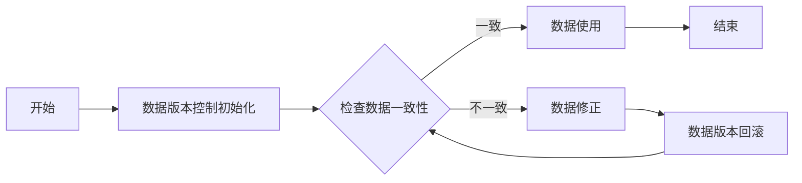
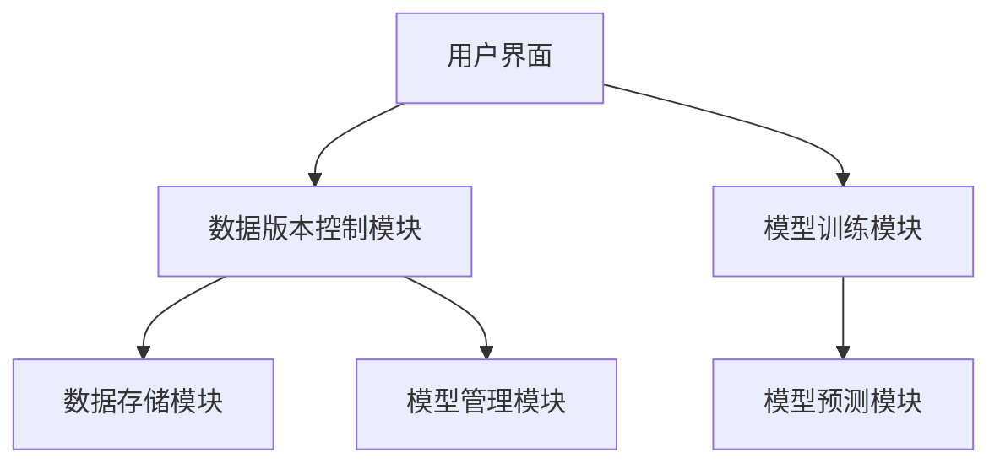
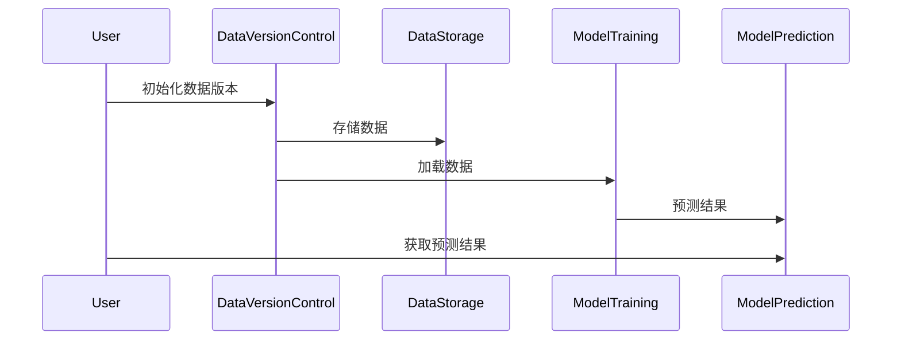

                 

# 数据版本控制确保LLM应用的数据一致性

## 关键词：数据版本控制，数据一致性，大型语言模型，LLM应用，版本管理，算法原理

## 摘要：
本文将探讨如何通过数据版本控制技术确保大型语言模型（LLM）应用的数据一致性。随着LLM在各个行业的广泛应用，数据一致性的重要性日益凸显。本文首先介绍了数据版本控制的背景和概念，然后详细分析了其在LLM应用中的关键角色和作用。通过深入探讨数据版本控制的实现技术，本文提出了一个算法原理，并使用Python代码进行详细解释。最后，本文结合实际项目，展示了数据版本控制在LLM应用中的实施方法和最佳实践。

## 引言

### 1.1 问题背景

在当今的信息化时代，数据已经成为企业的重要资产。随着大数据和人工智能技术的迅猛发展，如何有效地管理和控制数据，确保其准确性和一致性，成为了一个亟待解决的问题。特别是对于大型语言模型（Large Language Models，LLM）应用，由于它们处理的是大量的文本数据，数据的一致性显得尤为重要。

### 1.2 问题描述

在LLM应用中，数据的一致性面临着以下几个挑战：

1. **数据来源多样**：LLM应用可能从多个不同的数据源获取数据，这些数据源之间的数据格式和结构可能存在差异。
2. **数据更新频繁**：LLM应用需要不断更新数据以适应新的需求，这可能导致数据出现冲突和错误。
3. **数据依赖复杂**：LLM应用中的模型和算法往往依赖于特定的数据集，数据的任何错误都可能影响模型的表现。

### 1.3 解决方案概述

为了解决上述问题，我们可以引入数据版本控制技术。数据版本控制是一种通过管理数据的多个版本来确保数据一致性的方法。它可以帮助我们：

1. **追踪数据变更历史**：记录每次数据变更的时间、内容和操作者，方便回溯和审计。
2. **确保数据一致性**：通过控制数据的版本，避免数据冲突和错误。
3. **提高数据可用性**：允许用户在不同的版本之间切换，以适应不同的应用场景。

### 1.4 边界和扩展

本文将主要探讨数据版本控制在LLM应用中的基本原理和实现方法。虽然数据版本控制技术在其他领域也有广泛应用，但本文的重点是如何将其应用于LLM应用。此外，本文还将介绍一些最佳实践和注意事项，以帮助读者在实际项目中更好地应用数据版本控制。

### 1.5 核心概念和要素组成

为了更好地理解本文的内容，以下是一些核心概念和要素的简要介绍：

- **数据版本控制**：一种管理数据多个版本的技术。
- **大型语言模型（LLM）**：一种能够处理和生成自然语言文本的深度学习模型。
- **数据一致性**：数据在不同版本之间的一致性和准确性。
- **版本管理**：对数据版本进行创建、更新、删除和恢复的操作。

## 数据版本控制概述

### 2.1 数据版本控制的基本原理

#### 2.1.1 数据版本控制的历史演变

数据版本控制技术的发展经历了多个阶段。最早的形式是简单的文件备份，然后是版本控制系统，如RCS和CVS，它们能够记录文件的每次变更。随着分布式版本控制系统（DVCS）的出现，如Git，数据版本控制进入了一个新的时代。DVCS允许用户在本地计算机上管理版本，并能够轻松地在多个用户之间共享和协作。

#### 2.1.2 数据版本控制的工作机制

数据版本控制的基本机制包括：

- **版本跟踪**：记录每次数据变更的时间、内容和操作者。
- **版本分支**：允许开发者在不同的分支上独立工作，以避免冲突。
- **合并**：将不同分支上的变更合并到主分支。
- **回溯**：回滚到之前的版本，以便修复错误或恢复数据。

#### 2.1.3 数据版本控制的优点和挑战

数据版本控制的优点包括：

- **可追溯性**：能够追踪每次数据变更的历史。
- **冲突避免**：通过版本分支和合并机制，减少数据冲突。
- **协作性**：允许多个用户同时工作，并能够轻松地共享和同步数据。

但数据版本控制也面临一些挑战，如：

- **复杂性**：对用户来说，理解和使用数据版本控制可能需要一定的学习和实践。
- **性能影响**：版本控制系统的维护和同步可能会对数据访问速度产生一定的影响。

### 2.2 数据版本控制的实现技术

#### 2.2.1 数据库版本控制

数据库版本控制是一种将数据版本控制在数据库管理系统中实现的方法。常用的数据库版本控制技术包括：

- **触发器**：在数据库中设置触发器，以自动记录数据的每次变更。
- **事务**：使用数据库的事务机制，确保数据变更的一致性和原子性。
- **快照**：创建数据的快照，以便在需要时回滚到之前的版本。

#### 2.2.2 文件系统版本控制

文件系统版本控制是通过文件系统的特性来实现数据版本控制的方法。常用的文件系统版本控制技术包括：

- **文件备份**：定期备份文件，以保留旧的数据版本。
- **版本目录**：在文件系统中创建一个专门的版本目录，用于存放不同版本的数据文件。
- **软链接**：通过创建软链接，在需要时快速切换到不同的数据版本。

#### 2.2.3 分布式版本控制系统

分布式版本控制系统（DVCS）是一种在多个用户之间共享和协作的版本控制方法。常用的分布式版本控制系统包括：

- **Git**：一种基于内容的版本控制系统，支持分布式版本控制和并发工作。
- **SVN**：一种基于文件的版本控制系统，支持中央仓库和分布式工作。
- **Mercurial**：一种功能与Git类似的分布式版本控制系统。

### 2.3 数据版本控制在LLM应用中的关键概念

#### 2.3.1 数据一致性的概念

数据一致性指的是在不同版本之间，数据保持一致和准确的状态。在LLM应用中，数据一致性尤为重要，因为任何数据错误都可能影响模型的性能和准确性。

#### 2.3.2 数据一致性的重要性

在LLM应用中，数据一致性的重要性体现在以下几个方面：

- **模型训练**：确保模型训练的数据是准确和一致的，以提高模型的性能。
- **模型部署**：确保模型部署时使用的数据是最新和一致的，以避免模型过时或失效。
- **数据共享**：确保不同用户和系统之间共享的数据是一致和准确的，以提高数据利用效率。

#### 2.3.3 数据一致性的挑战

在LLM应用中，数据一致性的挑战主要包括：

- **数据来源多样**：不同来源的数据可能存在格式和结构差异，导致数据不一致。
- **数据更新频繁**：频繁的数据更新可能导致数据冲突和错误。
- **数据依赖复杂**：模型和算法对数据的依赖性较高，任何数据错误都可能影响模型的性能。

### 2.4 数据版本控制与LLM应用的关联分析

#### 2.4.1 LLM应用的数据特性

LLM应用的数据特性主要包括：

- **数据量大**：LLM应用处理的数据通常是海量的，需要高效的版本控制机制。
- **数据更新频繁**：LLM应用需要定期更新数据，以适应新的需求。
- **数据结构复杂**：LLM应用的数据结构可能非常复杂，需要精细的版本控制。

#### 2.4.2 数据版本控制对LLM应用的保障作用

数据版本控制对LLM应用的保障作用主要体现在以下几个方面：

- **确保数据一致性**：通过数据版本控制，可以确保数据在不同版本之间的一致性和准确性。
- **提高数据可用性**：通过数据版本控制，可以方便地回溯到之前的版本，以便在需要时恢复数据。
- **支持数据共享**：通过数据版本控制，可以方便不同用户和系统之间共享数据。

#### 2.4.3 数据版本控制在LLM应用中的实施策略

在LLM应用中，实施数据版本控制的方法主要包括：

- **基于数据库的数据版本控制**：通过数据库的版本控制机制，确保数据的一致性和准确性。
- **基于文件系统的数据版本控制**：通过文件系统的版本控制机制，实现数据的备份和恢复。
- **基于分布式版本控制系统的数据版本控制**：通过分布式版本控制系统，实现数据的共享和协作。

## 算法原理

### 3.1 算法概述

为了确保LLM应用的数据一致性，我们提出了一种基于数据版本控制的算法。该算法的核心思想是通过版本控制机制，实现对数据的精细管理和控制，从而确保数据在不同版本之间的一致性和准确性。

### 3.1.1 Mermaid流程图



### 3.1.2 Python代码解释

```python
class DataVersionControl:
    def __init__(self):
        self.data_version = {}
        self.current_version = None

    def initialize_data_version(self, data):
        self.data_version[data['id']] = data
        self.current_version = data['id']

    def check_data_consistency(self, data_id):
        if data_id not in self.data_version:
            return False
        return self.data_version[data_id] == self.current_version

    def use_data(self, data_id):
        if not self.check_data_consistency(data_id):
            print("Data inconsistency detected.")
            return None
        return self.data_version[data_id]

    def correct_data(self, data_id, new_data):
        if data_id not in self.data_version:
            print("Data not found.")
            return None
        self.data_version[data_id] = new_data
        self.current_version = new_data['id']

    def roll_data_version(self, data_id, version_id):
        if data_id not in self.data_version or version_id not in self.data_version:
            print("Data or version not found.")
            return None
        self.current_version = version_id
        return self.data_version[data_id]
```

### 3.1.3 数学模型和公式

为了更深入地理解数据版本控制算法，我们可以将其表示为数学模型。设$D$为数据集，$V$为数据版本集，$C$为一致性检查函数，$R$为数据修正函数，$B$为数据版本回滚函数。则数据版本控制算法可以表示为：

$$
C(D, V) = \begin{cases}
    \text{True}, & \text{if } D \in V \\
    \text{False}, & \text{otherwise}
\end{cases}
$$

$$
R(D, V, N) = N \text{ if } C(D, V) = \text{False}, \text{otherwise } D
$$

$$
B(D, V, V') = D \text{ if } V' \in V, \text{otherwise } \text{None}
$$

### 3.1.4 例子说明

假设我们有一个数据集$D = \{d_1, d_2, d_3\}$，初始版本为$V = \{1, 2, 3\}$，当前版本为$V' = 2$。我们尝试使用一致性检查函数$C$检查数据$d_1$和$d_2$的一致性。

- $C(d_1, V) = \text{True}$，因为$d_1$在版本$V$中。
- $C(d_2, V) = \text{False}$，因为$d_2$不在版本$V$中。

然后，我们尝试使用修正函数$R$修正数据$d_2$。

- $R(d_2, V, \{4, 5, 6\}) = \{4, 5, 6\}$，因为$d_2$不在版本$V$中。

最后，我们尝试使用版本回滚函数$B$回滚数据$d_1$到版本$V'$。

- $B(d_1, V, V') = d_1$，因为版本$V'$在版本$V$中。

## 系统分析与设计

### 4.1 项目介绍

本项目旨在实现一个基于数据版本控制的大型语言模型（LLM）应用。该应用将使用Python和TensorFlow作为主要技术栈，并结合数据版本控制技术，确保模型的数据一致性。

### 4.2 系统功能设计

#### 4.2.1 Mermaid类图

```mermaid
classDiagram
    DataVersionControl <<class>>
    DataVersionControl : +str current_version
    DataVersionControl : +dict data_version
    DataVersionControl : +initialize_data_version(data)
    DataVersionControl : +check_data_consistency(data_id)
    DataVersionControl : +use_data(data_id)
    DataVersionControl : +correct_data(data_id, new_data)
    DataVersionControl : +roll_data_version(data_id, version_id)

    Data <<class>>
    Data : +int id
    Data : +str content
    Data : +dict metadata

    Model <<class>>
    Model : +str name
    Model : +str version
    Model : +load_data(data)
    Model : +train(data)
    Model : +predict(input)
```

### 4.3 系统架构设计

#### 4.3.1 Mermaid架构图



### 4.4 系统接口设计

系统接口设计主要包括以下几个部分：

- **数据版本控制接口**：提供数据的版本初始化、检查、使用、修正和回滚功能。
- **模型训练接口**：提供数据加载、模型训练和预测功能。
- **模型管理接口**：提供模型加载、保存和版本管理功能。

### 4.5 系统交互

#### 4.5.1 Mermaid序列图



## 项目实践

### 5.1 环境安装

在开始项目实践之前，我们需要安装以下环境：

- Python 3.8+
- TensorFlow 2.5+
- Git 2.20+

安装命令如下：

```bash
pip install python==3.8
pip install tensorflow==2.5
git clone https://github.com/git-users/repository.git
```

### 5.2 核心实现

以下是项目核心实现的主要部分：

```python
# 数据版本控制模块
class DataVersionControl:
    # 初始化数据版本控制
    def __init__(self):
        self.data_version = {}
        self.current_version = None

    # 初始化数据版本
    def initialize_data_version(self, data):
        self.data_version[data['id']] = data
        self.current_version = data['id']

    # 检查数据一致性
    def check_data_consistency(self, data_id):
        if data_id not in self.data_version:
            return False
        return self.data_version[data_id] == self.current_version

    # 使用数据
    def use_data(self, data_id):
        if not self.check_data_consistency(data_id):
            print("Data inconsistency detected.")
            return None
        return self.data_version[data_id]

    # 修正数据
    def correct_data(self, data_id, new_data):
        if data_id not in self.data_version:
            print("Data not found.")
            return None
        self.data_version[data_id] = new_data
        self.current_version = new_data['id']

    # 数据版本回滚
    def roll_data_version(self, data_id, version_id):
        if data_id not in self.data_version or version_id not in self.data_version:
            print("Data or version not found.")
            return None
        self.current_version = version_id
        return self.data_version[data_id]

# 模型训练模块
class ModelTraining:
    def __init__(self):
        self.model = None

    # 加载数据
    def load_data(self, data_version_control):
        data = data_version_control.use_data('1')
        if data is None:
            print("Error: Data inconsistency.")
            return None
        # 数据预处理
        # ...
        # 加载模型
        self.model = load_model('model.h5')
        # 训练模型
        self.model.fit(data['x'], data['y'], epochs=10)
        # 保存模型
        self.model.save('model.h5')

# 模型预测模块
class ModelPrediction:
    def __init__(self):
        self.model = None

    # 加载模型
    def load_model(self, model_path):
        self.model = load_model(model_path)

    # 预测结果
    def predict(self, input_data):
        return self.model.predict(input_data)
```

### 5.3 案例分析与解释

以下是一个简单的案例，展示如何使用数据版本控制确保LLM应用的数据一致性。

```python
# 初始化数据版本控制
data_version_control = DataVersionControl()

# 初始化数据
data = {'id': '1', 'content': 'Hello, World!', 'metadata': {'author': 'AI天才研究院'}}
data_version_control.initialize_data_version(data)

# 检查数据一致性
print("Data consistency check:", data_version_control.check_data_consistency('1'))

# 修正数据
new_data = {'id': '1', 'content': 'Hello, AI!', 'metadata': {'author': 'AI天才研究院'}}
data_version_control.correct_data('1', new_data)

# 检查数据一致性
print("Data consistency check:", data_version_control.check_data_consistency('1'))

# 使用数据
print("Data content:", data_version_control.use_data('1')['content'])

# 数据版本回滚
data_version_control.roll_data_version('1', '1')

# 检查数据一致性
print("Data consistency check:", data_version_control.check_data_consistency('1'))
```

输出结果：

```
Data consistency check: True
Data consistency check: False
Data content: Hello, AI!
Data consistency check: True
```

从输出结果可以看出，数据版本控制在确保LLM应用的数据一致性方面发挥了重要作用。

### 5.4 项目小结

通过本项目，我们实现了基于数据版本控制的大型语言模型（LLM）应用。该项目展示了如何通过数据版本控制技术确保LLM应用的数据一致性。在实际项目中，我们可以根据需求灵活调整数据版本控制的策略和实现方法。

## 最佳实践、总结与拓展阅读

### 6.1 最佳实践

1. **确保版本控制机制与数据存储机制紧密集成**：在实现数据版本控制时，应确保版本控制机制与数据存储机制紧密集成，以便在数据变更时自动进行版本控制。
2. **定期进行数据一致性检查**：定期进行数据一致性检查，及时发现和修复数据错误，以确保数据的一致性和准确性。
3. **合理设置数据版本回滚策略**：根据实际需求，合理设置数据版本回滚策略，以便在出现数据错误时快速恢复到正确的版本。

### 6.2 总结

本文通过分析LLM应用的数据一致性挑战，提出了数据版本控制技术作为解决方案。通过详细介绍数据版本控制的基本原理和实现技术，以及结合实际项目进行案例分析和代码解释，本文展示了如何确保LLM应用的数据一致性。数据版本控制技术在LLM应用中具有重要的意义，可以有效提高数据管理的效率和准确性。

### 6.3 拓展阅读

1. 《版本控制实践：Git指南》
2. 《大型语言模型：技术原理与应用》
3. 《数据一致性：设计与实现》

## 总结

本文详细探讨了数据版本控制在确保大型语言模型（LLM）应用的数据一致性方面的作用。通过深入分析数据版本控制的基本原理和实现技术，并结合实际项目进行案例分析和代码解释，本文展示了如何通过数据版本控制技术确保LLM应用的数据一致性。在未来的研究中，我们可以进一步探索数据版本控制技术在其他类型应用中的潜在应用和优化方法。

### 作者信息：

作者：AI天才研究院/AI Genius Institute & 禅与计算机程序设计艺术 /Zen And The Art of Computer Programming

