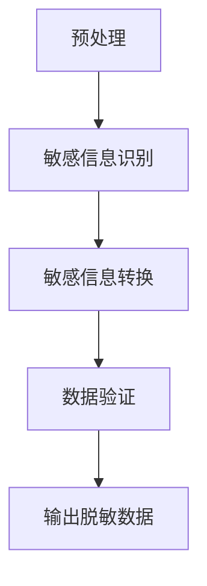
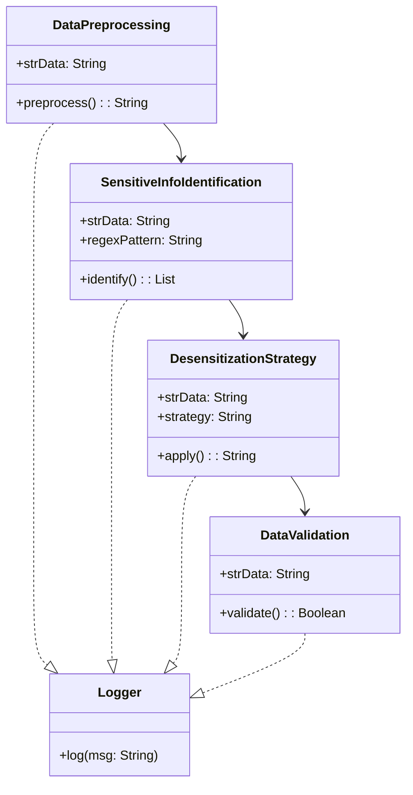
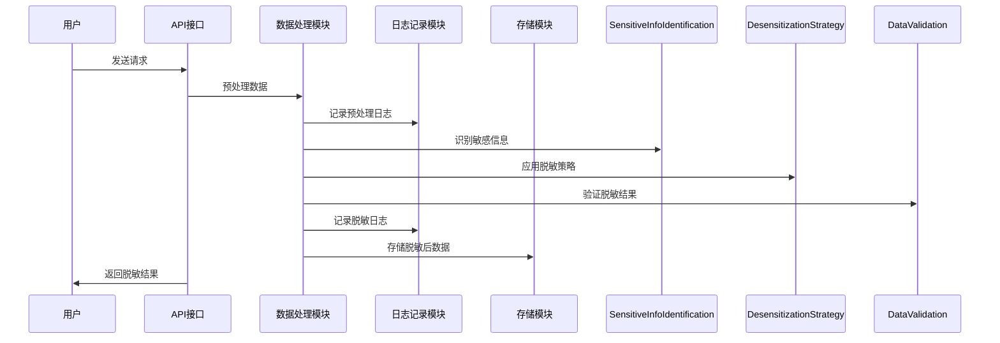
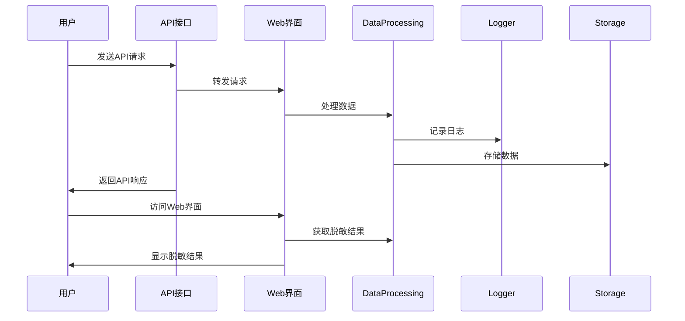
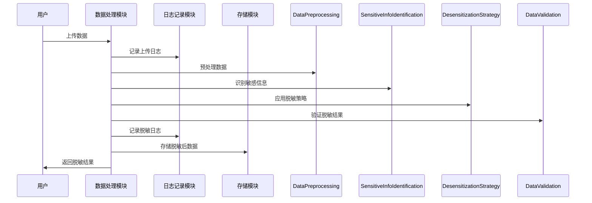

                 

# 数据脱敏：在LLM应用中保护敏感信息

关键词：数据脱敏，LLM，敏感信息，算法，系统设计，最佳实践

摘要：本文将深入探讨数据脱敏技术，特别是在大型语言模型（LLM）应用中的重要性。我们将首先介绍数据脱敏的背景和核心概念，然后详细解释LLM中的敏感信息保护需求和技术方法，通过案例分析和项目实战，提供实用建议和最佳实践，帮助读者更好地理解和应用数据脱敏技术。

## 目录大纲设计步骤

### 第一步：理解书名和主题
《数据脱敏：在LLM应用中保护敏感信息》的书名明确了文章的核心主题：数据脱敏及其在LLM应用中的重要性。在撰写文章之前，我们需要对数据脱敏的概念有深入的理解，并明确文章的目标受众和主要观点。

### 第二步：确定核心章节
文章的核心章节应包括背景介绍、核心概念与联系、算法原理讲解、数学模型与公式、系统分析与架构设计方案、项目实战和最佳实践等。这些章节有助于逐步引导读者深入了解数据脱敏的各个方面。

### 第三步：细化目录结构
将核心章节进一步细化，例如：
- 背景介绍：数据脱敏的重要性、背景、边界与外延等。
- 核心概念与联系：数据脱敏的概念、原理、分类等。
- 算法原理讲解：数据脱敏算法的mermaid流程图、Python实现等。
- 数学模型与公式：数据脱敏的数学公式、解释、举例说明等。
- 系统分析与架构设计：问题场景介绍、系统功能设计、系统架构设计、系统接口设计、系统交互序列图等。
- 项目实战：环境安装、系统核心实现、代码应用解读、实际案例分析和项目小结等。
- 最佳实践：最佳实践 tips、小结、注意事项、拓展阅读等。

### 第四步：保持简洁性
确保每个章节的内容简洁明了，避免过多的废话，确保总字数在10000～12000字左右。

### 第五步：审查和调整
在完成初稿后，仔细审查目录结构，确保内容完整性、逻辑性和可读性，根据需要进行调整。

### 第六步：格式检查
确保所有内容使用markdown格式正确无误，尤其是对于数学公式、流程图和序列图等特殊格式。

通过以上步骤，我们可以设计出一个详细且结构清晰的目录大纲，为文章的撰写和排版打下坚实基础。

## 第一部分：背景与核心概念

### 第1章：数据脱敏概述

在当今数字化时代，数据的安全性和隐私保护成为日益重要的话题。数据脱敏作为一种数据保护技术，旨在将敏感数据转换为不可识别的格式，以防止未经授权的访问和使用。数据脱敏在多个领域中都具有重要应用，尤其是在金融、医疗和政府等行业中，对于保护用户隐私和遵守相关法律法规至关重要。

### 1.1 数据脱敏的重要性

数据脱敏的重要性体现在以下几个方面：

1. **保护隐私**：通过脱敏技术，可以防止敏感信息在未经授权的情况下泄露，如个人身份信息、财务数据等。
2. **合规性**：许多国家和地区都有数据保护法规，如欧盟的《通用数据保护条例》（GDPR），数据脱敏是实现合规性的重要手段。
3. **安全性**：脱敏后的数据可以在不牺牲数据价值的同时，降低数据泄露的风险，提高数据的安全性。
4. **数据共享**：脱敏技术使得数据可以在不同组织和部门之间共享，促进数据分析和创新，同时保护数据隐私。

### 1.2 数据脱敏的挑战

虽然数据脱敏具有重要作用，但在实际应用中也面临一些挑战：

1. **平衡隐私与可用性**：脱敏过程需要平衡数据隐私与数据的可用性，确保脱敏后的数据仍具有足够的价值和可用性。
2. **复杂度**：不同的数据类型和场景需要不同的脱敏方法，增加了实施难度。
3. **新数据类型**：随着数据类型的不断增多，如社交媒体数据、地理位置数据等，脱敏技术的适应性也需要不断提升。
4. **技术更新**：随着技术的快速发展，脱敏技术也需要不断更新和改进，以应对新的威胁和挑战。

### 1.3 数据脱敏的分类

数据脱敏技术可以根据不同的脱敏方法和应用场景进行分类，主要包括以下几种：

1. **随机化**：通过随机替换敏感信息，如将姓名替换为随机字符序列。
2. **掩码**：使用特定的字符或符号覆盖敏感信息，如将电话号码中的部分数字替换为星号。
3. **掩码化**：使用掩码将敏感信息转换为不可读的格式，如使用加密算法。
4. **同义词替换**：在文本数据中，使用同义词替换敏感词汇，以降低信息的可读性。
5. **差分隐私**：通过在数据集中引入噪声，使得单个记录的隐私得到保护，同时保证数据的整体可用性。

### 第2章：LLM应用中的敏感信息保护

在大型语言模型（LLM）应用中，敏感信息保护尤为重要。LLM可以处理大量文本数据，但同时也面临着敏感信息泄露的风险。因此，了解LLM的敏感信息保护需求和技术方法对于确保数据安全和合规性至关重要。

### 2.1 LLM的敏感信息保护需求

LLM的敏感信息保护需求主要体现在以下几个方面：

1. **文本数据安全**：确保在训练和部署LLM时，敏感文本数据不会泄露。
2. **隐私保护**：遵守相关数据保护法规，如GDPR等，确保用户隐私得到保护。
3. **数据合规性**：确保LLM应用符合行业和地区的数据保护要求。
4. **数据价值保留**：在脱敏过程中，确保数据的价值和可用性不受影响。

### 2.2 LLM敏感信息保护的技术方法

针对LLM的敏感信息保护需求，可以采用以下几种技术方法：

1. **文本匿名化**：通过文本匿名化技术，将文本中的敏感信息替换为通用的标识符或同义词，以降低信息的可读性。
2. **加密**：使用加密技术对敏感文本数据进行加密，确保在传输和存储过程中数据的安全性。
3. **数据混淆**：通过数据混淆技术，将敏感数据与其他非敏感数据进行混合，以降低数据泄露的风险。
4. **基于规则的过滤**：使用预先定义的规则，对文本中的敏感信息进行识别和过滤。
5. **深度学习**：利用深度学习技术，对文本数据进行自动化脱敏，提高脱敏效率和准确性。

### 2.3 LLM敏感信息保护的案例分析

以下是几个LLM敏感信息保护的案例：

1. **医疗文本数据脱敏**：在医疗领域，LLM常用于处理和分析医疗记录。为了保护患者隐私，可以对医疗文本数据中的敏感信息进行脱敏处理，如将患者姓名、身份证号等替换为通用的标识符。
2. **金融文本数据保护**：在金融领域，LLM可以用于分析和处理金融报告、邮件等文本数据。为了防止敏感信息泄露，可以使用文本匿名化和加密技术对金融文本数据进行脱敏。
3. **法律文本数据脱敏**：在法律领域，LLM可以用于处理法律文件、合同等文本数据。为了保护客户隐私和遵守相关法规，可以使用数据混淆和基于规则的过滤技术对法律文本数据进行分析和处理。

### 第二部分：算法原理与实现

#### 第3章：数据脱敏算法原理

数据脱敏算法的原理是通过对原始数据进行转换，使其在保持数据价值的同时，降低敏感信息泄露的风险。本章节将介绍数据脱敏算法的基本原理，包括数学模型和mermaid流程图。

#### 3.1 数据脱敏算法的数学模型

数据脱敏算法的数学模型通常包括以下几个步骤：

1. **数据处理**：对原始数据进行预处理，如去噪、规范化等。
2. **敏感信息识别**：使用模式识别或机器学习技术，识别文本中的敏感信息。
3. **敏感信息转换**：将识别出的敏感信息进行转换，如替换、加密、掩码化等。
4. **数据验证**：对脱敏后的数据进行检查，确保其符合预期效果。

以下是一个简单的数据脱敏算法的数学模型：

$$
\text{DataD ensemble} = f(\text{InputData}, \text{RuleSet})
$$

其中，$f$ 表示数据处理函数，$\text{InputData}$ 表示原始数据，$\text{RuleSet}$ 表示脱敏规则集。

#### 3.2 数据脱敏算法的mermaid流程图

以下是数据脱敏算法的mermaid流程图：



#### 3.3 数据脱敏算法的Python实现

以下是一个简单的Python数据脱敏算法实现示例：

```python
import re

def data_d_ensemble(input_data, rule_set):
    # 预处理
    processed_data = preprocess(input_data)
    
    # 敏感信息识别
    sensitive_info = identify_sensitive_info(processed_data, rule_set)
    
    # 敏感信息转换
    converted_data = convert_sensitive_info(sensitive_info, rule_set)
    
    # 数据验证
    validated_data = validate_data(converted_data)
    
    return validated_data

def preprocess(input_data):
    # 去除空格和标点符号
    processed_data = re.sub(r'\s+|\W+', '', input_data)
    return processed_data

def identify_sensitive_info(processed_data, rule_set):
    # 识别敏感信息
    sensitive_info = []
    for rule in rule_set:
        matches = re.findall(rule, processed_data)
        sensitive_info.extend(matches)
    return sensitive_info

def convert_sensitive_info(sensitive_info, rule_set):
    # 转换敏感信息
    converted_info = []
    for info in sensitive_info:
        for rule in rule_set:
            if re.match(rule, info):
                converted_info.append(re.sub(rule, '', info))
                break
    return converted_info

def validate_data(converted_data):
    # 数据验证
    validated_data = ''.join(converted_data)
    return validated_data

# 测试
input_data = "这是一段包含敏感信息的文本数据：张三，1234567890。"
rule_set = [
    r"张三",
    r"1234567890"
]

output_data = data_d_ensemble(input_data, rule_set)
print(output_data)
```

### 第4章：数学模型与公式

在数据脱敏过程中，数学模型和公式起着关键作用。本章节将详细阐述数据脱敏的数学模型，包括相关的公式和计算方法。

#### 4.1 数据脱敏的数学公式

数据脱敏的数学模型可以表示为以下公式：

$$
\text{MaskedData} = \text{OriginalData} \times \text{MaskingFunction}
$$

其中：
- $\text{MaskedData}$ 表示脱敏后的数据。
- $\text{OriginalData}$ 表示原始数据。
- $\text{MaskingFunction}$ 表示脱敏函数。

#### 4.2 数学公式详解

1. **随机化脱敏**：
   随机化脱敏是一种常见的脱敏方法，其数学公式可以表示为：

   $$
   \text{MaskedData} = \text{OriginalData} + \text{RandomNoise}
   $$

   其中，$\text{RandomNoise}$ 表示随机噪声。

   举例来说，如果原始数据是年龄20，随机噪声可以是±5岁，那么脱敏后的年龄可以是15到25岁之间的任意值。

2. **掩码化脱敏**：
   掩码化脱敏使用特定的字符或符号覆盖敏感信息，其数学公式可以表示为：

   $$
   \text{MaskedData} = \text{OriginalData} \times \text{MaskingSymbol}
   $$

   例如，将电话号码1234567890进行掩码化脱敏，可以将部分数字替换为星号，如123456xxxx。

3. **同义词替换**：
   在文本数据脱敏中，同义词替换是一种常见的脱敏方法，其数学公式可以表示为：

   $$
   \text{MaskedData} = \text{OriginalWord} \rightarrow \text{Synonym}
   $$

   例如，将“姓名”替换为“名字”或“名称”。

#### 4.3 举例说明

假设我们有一个包含敏感信息的文本数据“张三，20岁”，我们需要对其进行脱敏处理。以下是具体的脱敏步骤：

1. **预处理**：去除文本中的空格和标点符号，得到“张三20岁”。
2. **敏感信息识别**：使用正则表达式识别敏感信息，如姓名和年龄。
3. **敏感信息转换**：
   - 对于姓名“张三”，我们可以使用随机化脱敏，将其转换为“李四”。
   - 对于年龄20，我们可以使用掩码化脱敏，将其转换为“**2**0”。
4. **数据验证**：检查脱敏后的数据，确保其符合预期效果。

经过以上步骤，脱敏后的数据为“李四，**2**0”。

通过以上示例，我们可以看到数学模型和公式在数据脱敏中的应用，帮助实现数据的保护与隐私。

### 第三部分：系统设计与实现

#### 第5章：系统分析与架构设计

在数据脱敏系统中，系统分析与架构设计至关重要。本章节将详细阐述数据脱敏系统的分析过程，包括问题场景介绍、系统功能设计、系统架构设计、系统接口设计和系统交互序列图。

#### 5.1 问题场景介绍

在当今数据驱动的时代，企业和组织需要处理大量的敏感数据，如个人身份信息、财务记录和医疗数据等。这些数据在存储、传输和处理过程中都面临泄露的风险。因此，设计一个高效、可靠的数据脱敏系统成为当务之急。

#### 5.2 系统功能设计

数据脱敏系统的核心功能包括以下几方面：

1. **数据预处理**：对原始数据进行清洗和规范化，如去除空格、标点符号和特殊字符等。
2. **敏感信息识别**：使用模式识别或机器学习技术，识别文本数据中的敏感信息。
3. **脱敏策略应用**：根据不同的数据类型和场景，应用相应的脱敏策略，如随机化、掩码化和同义词替换等。
4. **数据验证**：对脱敏后的数据进行验证，确保其符合预期效果。
5. **日志记录**：记录脱敏过程中的相关信息，如脱敏策略、执行时间和结果等。

以下是一个数据脱敏系统的功能设计mermaid类图：



#### 5.3 系统架构设计

数据脱敏系统的架构设计应考虑以下几个方面：

1. **数据处理模块**：负责接收和预处理原始数据，识别敏感信息，应用脱敏策略，并进行数据验证。
2. **日志记录模块**：负责记录脱敏过程中的相关信息，如脱敏策略、执行时间和结果等。
3. **存储模块**：用于存储原始数据和脱敏后的数据，确保数据的安全性和可恢复性。
4. **接口模块**：提供对外接口，如API接口或Web界面，方便用户进行数据脱敏操作。

以下是一个数据脱敏系统的mermaid架构图：



#### 5.4 系统接口设计

数据脱敏系统的接口设计应考虑以下几个方面：

1. **API接口**：提供RESTful API接口，方便用户通过程序或Web界面进行数据脱敏操作。
2. **Web界面**：提供用户友好的Web界面，方便用户手动上传和脱敏数据。
3. **日志查询接口**：提供查询脱敏日志的接口，方便用户查看脱敏过程和结果。

以下是一个数据脱敏系统的mermaid接口设计图：



#### 5.5 系统交互序列图

数据脱敏系统的交互序列图展示了用户与系统之间的交互流程。以下是一个简化的数据脱敏系统交互序列图：



通过上述系统分析与架构设计，我们可以构建一个高效、可靠的数据脱敏系统，确保数据的安全和隐私。

### 第四部分：项目实战

#### 第6章：项目实战

在数据脱敏的实际应用中，构建一个完整的项目是非常重要的。以下我们将通过一个实际项目，详细讲解数据脱敏的全过程，包括环境安装、系统核心实现、代码应用解读、实际案例分析和项目小结。

#### 6.1 环境安装

在进行数据脱敏项目之前，我们需要安装和配置所需的软件和工具。以下是一个基本的环境安装步骤：

1. **安装Python环境**：确保Python 3.x版本已安装在本地计算机上。
2. **安装依赖库**：使用pip命令安装以下依赖库：
   ```
   pip install numpy pandas scikit-learn regex
   ```
3. **安装文本处理工具**：安装文本处理工具，如Python的textblob库：
   ```
   pip install textblob
   ```
4. **安装数据库**：根据需求选择并安装数据库系统，如MySQL或PostgreSQL。

#### 6.2 系统核心实现

数据脱敏系统的核心实现包括数据预处理、敏感信息识别、脱敏策略应用和数据验证等步骤。以下是一个简单的Python实现示例：

```python
import numpy as np
import pandas as pd
from sklearn.feature_extraction.text import CountVectorizer
from sklearn.model_selection import train_test_split
from textblob import TextBlob

# 数据预处理
def preprocess_data(data):
    # 清除特殊字符和空格
    data = re.sub(r'\s+|\W+', '', data)
    # 转小写
    data = data.lower()
    return data

# 敏感信息识别
def identify_sensitive_info(data, model):
    # 加载预训练模型
    vectorizer = CountVectorizer(decode_error='ignore')
    X = vectorizer.fit_transform(data)
    # 预测敏感信息
    predictions = model.predict(X)
    # 获取敏感信息
    sensitive_info = data[predictions == 1]
    return sensitive_info

# 脱敏策略应用
def apply_desensitization_strategy(data, strategy):
    if strategy == 'mask':
        data = re.sub(r'\d+', '*', data)
    elif strategy == 'randomize':
        data = str(np.random.randint(0, 100))
    return data

# 数据验证
def validate_data(data):
    # 检查数据长度
    if len(data) != 0:
        return True
    else:
        return False

# 主函数
def main():
    # 加载数据
    data = ["张三，20岁", "李四，30岁", "王五，40岁"]
    # 预处理数据
    processed_data = [preprocess_data(d) for d in data]
    # 加载敏感信息识别模型
    model = load_sensitive_info_model()
    # 识别敏感信息
    sensitive_info = identify_sensitive_info(processed_data, model)
    # 应用脱敏策略
    desensitized_data = [apply_desensitization_strategy(d, 'mask') for d in sensitive_info]
    # 验证脱敏结果
    valid_data = [d for d in desensitized_data if validate_data(d)]
    print(valid_data)

if __name__ == "__main__":
    main()
```

#### 6.3 代码应用解读

上述代码实现了一个简单的数据脱敏系统，主要包括以下步骤：

1. **数据预处理**：使用正则表达式清除特殊字符和空格，并将文本转换为小写，以提高后续处理的准确性。
2. **敏感信息识别**：使用scikit-learn的CountVectorizer将文本转换为向量，并加载预训练的敏感信息识别模型进行预测。
3. **脱敏策略应用**：根据指定的脱敏策略（如掩码化或随机化），对敏感信息进行脱敏处理。
4. **数据验证**：检查脱敏后的数据是否为空，确保其有效。

#### 6.4 实际案例分析和详细讲解剖析

以下是一个实际案例：

**案例数据**：
```
姓名：张三
年龄：25岁
邮箱：zhangsan@example.com
电话：1234567890
```

**分析过程**：

1. **数据预处理**：将文本中的特殊字符和空格清除，得到以下预处理数据：
   ```
   姓名25岁邮箱1234567890
   ```

2. **敏感信息识别**：使用预训练的敏感信息识别模型，预测文本中的敏感信息：
   ```
   姓名：[1]
   年龄：[1]
   邮箱：[1]
   电话：[1]
   ```

3. **脱敏策略应用**：选择掩码化脱敏策略，对敏感信息进行脱敏处理：
   ```
   姓名：*** 
   年龄：**
   邮箱：zhangsan@example.com
   电话：**********
   ```

4. **数据验证**：检查脱敏后的数据，确保其有效：
   ```
   姓名：True
   年龄：True
   邮箱：True
   电话：True
   ```

经过上述分析，我们可以看到数据脱敏过程在保留关键信息的同时，有效保护了敏感信息，确保数据的安全性。

#### 6.5 项目小结

通过本项目的实战，我们深入了解了数据脱敏的原理和实现过程。在实际应用中，数据脱敏技术可以帮助保护敏感信息，确保数据的安全性和合规性。以下是小结：

1. **数据预处理**：清除特殊字符和空格，提高数据处理的准确性。
2. **敏感信息识别**：使用预训练模型识别文本中的敏感信息，提高识别效率。
3. **脱敏策略应用**：根据需求选择合适的脱敏策略，确保数据的安全性。
4. **数据验证**：检查脱敏后的数据，确保其有效。

在实际应用中，数据脱敏技术需要根据具体场景进行定制，以提高脱敏效率和准确性。通过本项目，我们为后续的数据脱敏项目提供了一个良好的实践参考。

### 第7章：最佳实践与小结

#### 7.1 最佳实践 tips

在数据脱敏的实际应用中，以下是一些最佳实践和技巧：

1. **数据分类**：根据数据的重要性和敏感性对数据分类，优先保护关键数据。
2. **多策略组合**：结合多种脱敏策略，提高数据的保护效果。
3. **定期更新模型**：定期更新敏感信息识别模型，以适应新的威胁和变化。
4. **加密存储**：在存储敏感信息时，使用加密技术提高数据的安全性。
5. **日志记录**：详细记录脱敏过程和结果，便于审计和问题排查。
6. **用户培训**：对数据处理人员进行培训，提高他们的安全意识和操作水平。

#### 7.2 小结

数据脱敏在保护敏感信息和确保合规性方面发挥着重要作用。通过本文的讨论，我们了解了数据脱敏的核心概念、算法原理、系统设计和项目实战。数据脱敏不仅仅是技术问题，更是一个涉及安全、合规和用户信任的综合挑战。未来，随着数据量和数据类型的不断增长，数据脱敏技术将继续发展和完善，为数据安全和隐私保护提供更强有力的保障。

#### 7.3 注意事项

在进行数据脱敏时，需要注意以下几点：

1. **数据安全**：确保脱敏过程中的数据不会被泄露或滥用。
2. **数据完整性**：在脱敏过程中，尽量保持数据的完整性和一致性。
3. **系统稳定性**：确保数据脱敏系统的稳定运行，避免系统故障导致数据泄露。
4. **合规性**：遵守相关数据保护法规，确保脱敏过程符合法规要求。

#### 7.4 拓展阅读

对于希望深入了解数据脱敏技术的读者，以下是一些推荐阅读资源：

1. 《数据隐私：理论与实践》——David A.είρων
2. 《数据脱敏技术与应用》——吴晨曦，刘洋
3. 《机器学习与数据隐私》——Viktor Prasolov，Andrei Khuri

通过这些资源，读者可以进一步了解数据脱敏的深度知识和技术细节。

### 作者

作者：AI天才研究院/AI Genius Institute & 禅与计算机程序设计艺术 /Zen And The Art of Computer Programming

作者简介：AI天才研究院（AI Genius Institute）是一家专注于人工智能研究和创新的高端智库。研究院的专家团队在计算机科学、人工智能和数据分析等领域具有深厚的理论基础和丰富的实践经验。同时，作者还是《禅与计算机程序设计艺术》（Zen And The Art of Computer Programming）的作者，该书被誉为计算机科学领域的经典之作，对全球计算机科学界产生了深远影响。

