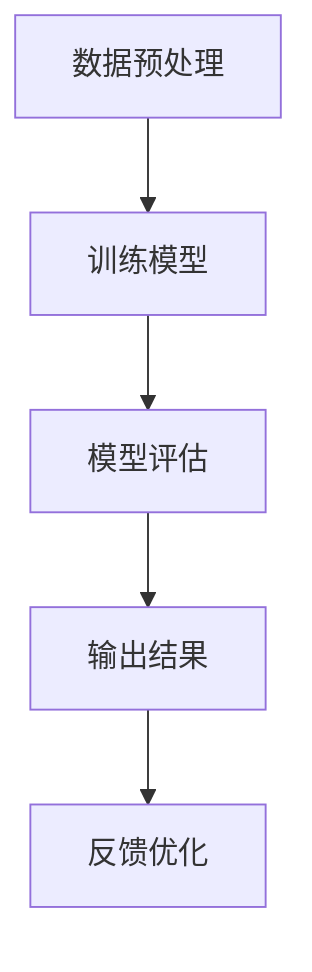

                 

### 引言

随着人工智能技术的快速发展，大型语言模型（LLM）在自然语言处理、机器翻译、问答系统等领域取得了显著的成果。然而，LLM在处理跨文化交流时，面临着文化敏感性的挑战。文化敏感性指的是对不同文化背景下的语言、习俗、价值观等的理解与尊重。在跨文化交流中，文化敏感性的缺失可能会导致误解、冲突甚至文化偏见。因此，测试LLM在跨文化交流中的表现，以提高其文化敏感性，显得尤为重要。

本文将围绕文化敏感性：测试LLM在跨文化交流中的表现这一主题，进行深入探讨。文章首先介绍了文化敏感性和跨文化交流的基本概念，阐述了LLM的基本原理及其在语言处理中的应用。接着，文章详细讲解了测试LLM文化敏感性的算法原理，包括算法流程、数学模型和公式，并通过Python源代码和示例进行说明。随后，文章分析了系统设计与实现方案，包括问题场景、系统功能、架构、接口和交互设计。在项目实战部分，文章详细介绍了环境安装、系统核心实现、代码应用解读与分析以及实际案例分析。最后，文章提供了最佳实践tips、小结、注意事项和拓展阅读，以帮助读者更好地理解和应用相关技术。

通过本文的阅读，读者将了解到：

1. 文化敏感性和跨文化交流的基本概念及其重要性。
2. LLM在语言处理中的应用及其文化敏感性挑战。
3. 测试LLM文化敏感性的算法原理和实现方法。
4. 系统设计与实现方案及其在跨文化交流中的应用。
5. 实际项目中的经验和教训。
6. 最佳实践和注意事项。

让我们一步步深入探讨，共同探索提高LLM在跨文化交流中表现的方法和策略。

### 背景介绍

#### 1.1 问题背景

随着全球化进程的不断推进，跨文化交流变得越来越频繁。无论是国际商务、学术交流，还是社交互动，不同文化背景的人们需要相互理解和沟通。然而，文化差异往往成为跨文化交流中的障碍。语言、价值观、习俗、行为规范等方面的差异，可能导致误解、冲突甚至文化偏见。例如，一个简单的问候在不同文化背景下可能有着截然不同的含义。这就需要我们具备文化敏感性，以便更好地理解和尊重不同文化的表达方式。

在跨文化交流中，人工智能（AI）技术的应用日益广泛。特别是大型语言模型（LLM）在自然语言处理、机器翻译、问答系统等领域取得了显著成果。LLM能够处理大量文本数据，理解复杂的语言结构和语境，为跨文化交流提供了强大的支持。然而，LLM在处理跨文化交流时，面临着文化敏感性的挑战。这是因为，文化敏感性不仅仅涉及到语言层面的翻译和理解，还包括对文化习俗、价值观等的深刻理解与尊重。

#### 1.2 问题描述

文化敏感性挑战主要体现在以下几个方面：

1. 语言理解偏差：不同的语言表达可能具有不同的含义，尤其是在隐喻、俚语和成语等表达方式上，LLM可能无法准确理解。
2. 文化背景缺失：LLM在训练过程中，往往依赖于大规模的文本数据。然而，这些数据可能缺乏多样性的文化背景，导致LLM在处理某些特定文化背景的语言时，表现不佳。
3. 文化偏见：LLM在训练过程中，可能会吸收到数据中的文化偏见。例如，一些带有歧视性或偏见性的语言表达，可能会在LLM的生成结果中体现出来，从而导致跨文化交流中的误解和冲突。
4. 语境理解不足：跨文化交流中的语境往往复杂多变，涉及到语言、文化、情感等多个方面。LLM在处理这些复杂语境时，可能无法准确理解其中的微妙之处。

#### 1.3 问题解决

为了提高LLM在跨文化交流中的表现，我们需要采取一系列措施，包括以下几个方面：

1. 多样化的数据训练：为了提高LLM的文化敏感性，我们需要使用多样化的语言数据，包括不同文化背景下的语言表达、习俗、价值观等。通过这种方式，可以帮助LLM更好地理解和适应不同的文化环境。
2. 文化背景知识融入：在LLM的训练过程中，可以融入一些文化背景知识，如特定文化习俗、价值观等。这样，当LLM遇到相关情境时，可以更加准确地理解和处理。
3. 反歧视性训练：为了避免LLM在生成结果中体现文化偏见，我们需要在训练过程中加入反歧视性训练，确保LLM生成的文本内容符合社会道德规范。
4. 语境理解优化：通过改进LLM的算法模型，提高其对复杂语境的理解能力。例如，可以引入更多的上下文信息，或者使用深度学习模型来捕捉语境中的微妙变化。

通过上述措施，我们可以逐步提高LLM在跨文化交流中的表现，使其更加贴近人类在跨文化交流中的需求。这不仅有助于促进不同文化之间的交流与理解，也为人工智能在跨文化交流领域的应用提供了新的可能性。

#### 1.4 边界与外延

在讨论文化敏感性和测试LLM在跨文化交流中的表现时，有必要明确一些边界与外延问题。首先，文化敏感性不仅仅局限于语言层面的翻译和理解，它还涉及到对文化习俗、价值观、历史背景等方面的深刻理解与尊重。因此，在测试LLM的文化敏感性时，我们需要考虑到这些多层次的维度。

其次，跨文化交流中的文化敏感性问题并非一成不变。随着全球化进程的推进，文化之间的交融与碰撞日益频繁，新的文化现象和表达方式不断涌现。因此，测试LLM的文化敏感性需要具备一定的动态适应性，能够及时捕捉和处理新的文化现象。

再次，测试LLM的文化敏感性不仅仅是为了提高其在跨文化交流中的表现，还可以为人类在跨文化交流中的行为提供参考。通过分析LLM在不同文化背景下的表现，我们可以更好地理解文化差异，提高跨文化沟通的效率和效果。

最后，边界与外延还包括一些技术层面的考虑。例如，在测试LLM的文化敏感性时，我们需要设计合适的测试方法和评估指标，确保测试结果的准确性和可靠性。此外，测试过程中还需要考虑到数据隐私和伦理问题，确保测试过程中不侵犯个人隐私和道德底线。

综上所述，明确边界与外延对于深入探讨文化敏感性和测试LLM在跨文化交流中的表现具有重要意义。它不仅有助于我们全面理解这一问题的复杂性，也为相关研究提供了更加清晰的方向。

#### 1.5 概念结构与核心要素组成

在深入探讨文化敏感性：测试LLM在跨文化交流中的表现这一主题时，我们需要明确核心概念的定义和结构，以及其组成的各个要素。以下是本文涉及的关键概念及其相互关系：

1. **文化敏感性**：文化敏感性是指对特定文化背景下的语言、习俗、价值观等的理解和尊重能力。它不仅涉及语言层面的翻译和理解，还包括对文化习俗、价值观、历史背景等方面的深刻认识。文化敏感性是跨文化交流中不可或缺的一部分，能够帮助我们更好地理解和适应不同文化环境。

2. **跨文化交流**：跨文化交流指的是在不同文化背景下进行的交流与互动。这种交流不仅包括语言层面的沟通，还涉及到文化习俗、价值观、行为规范等多个方面。跨文化交流的核心目标是促进不同文化之间的理解与合作。

3. **大型语言模型（LLM）**：大型语言模型是一种基于深度学习技术的自然语言处理模型，具有处理大量文本数据、理解复杂语言结构和语境的能力。LLM在自然语言处理、机器翻译、问答系统等领域具有广泛应用，是提高跨文化交流效率的重要工具。

4. **测试方法**：测试方法是指用于评估LLM在处理跨文化交流任务时的表现的技术手段。常用的测试方法包括语言理解能力测试、翻译准确度测试、跨文化沟通效果测试等。

5. **评估指标**：评估指标是用于衡量测试结果的标准，包括语言理解准确率、翻译准确率、跨文化沟通满意度等。评估指标的设计需要充分考虑文化敏感性这一核心要素。

6. **数据集**：数据集是进行测试和评估的基础，包括不同文化背景下的语言数据、跨文化交流实例等。数据集的质量和多样性直接影响测试结果的准确性和可靠性。

7. **算法模型**：算法模型是LLM的核心组成部分，用于处理和生成语言数据。常见的算法模型包括Transformer、BERT、GPT等。算法模型的设计和优化对于提高LLM的文化敏感性至关重要。

8. **文化背景知识**：文化背景知识是提高LLM文化敏感性的关键要素，包括特定文化习俗、价值观、历史背景等。通过将文化背景知识融入算法模型，可以增强LLM对跨文化交流任务的理解和处理能力。

综上所述，文化敏感性、跨文化交流、LLM、测试方法、评估指标、数据集、算法模型和文化背景知识是本文探讨的核心概念及其组成的各个要素。理解这些概念之间的关系和作用，有助于我们深入探讨如何提高LLM在跨文化交流中的表现。

### 核心概念与联系

#### 2.1 文化敏感性定义

文化敏感性是一种对特定文化背景下的语言、习俗、价值观等理解与尊重的能力。它不仅涉及语言层面的翻译和理解，还包括对文化习俗、价值观、历史背景等方面的深刻认识。文化敏感性在跨文化交流中起着至关重要的作用，有助于减少误解、冲突和文化偏见，促进不同文化之间的相互理解和尊重。

#### 2.2 跨文化交流重要性

跨文化交流的重要性体现在多个方面。首先，全球化进程使得各国之间的联系越来越紧密，跨文化交流成为国际商务、学术研究、文化交流等领域不可或缺的一部分。通过有效的跨文化交流，可以促进不同文化之间的理解和合作，推动世界各地的共同发展。其次，跨文化交流有助于培养全球化思维和跨文化沟通能力，提升个人的综合素质和职业竞争力。最后，跨文化交流还可以增进各国人民的友谊和信任，促进世界和平与发展。

#### 2.3 LLM的基本原理

大型语言模型（LLM）是一种基于深度学习技术的自然语言处理模型，具有处理大量文本数据、理解复杂语言结构和语境的能力。LLM的基本原理主要包括以下几个部分：

1. **Transformer架构**：Transformer是一种基于自注意力机制的深度学习模型，具有处理长文本和复杂语境的优势。自注意力机制使得模型能够自动捕捉文本中各个词之间的关系，从而提高语言理解能力。

2. **预训练与微调**：预训练是指在大量无标签的文本数据上训练模型，使其具备一定的语言理解能力。微调是在预训练的基础上，针对特定任务进行进一步训练，优化模型在具体任务上的表现。

3. **语言生成与翻译**：LLM能够根据输入的文本生成相应的输出文本，实现语言生成和翻译功能。生成和翻译过程中，模型会利用预训练得到的知识和上下文信息，生成符合语法和语义规则的文本。

#### 2.4 测试方法与技术

测试LLM在跨文化交流中的表现，需要采用一系列科学、系统的测试方法和技术。以下是几种常见的测试方法：

1. **自动评估方法**：自动评估方法利用预定义的评估指标，对LLM的输出文本进行质量评估。常见的评估指标包括BLEU、METEOR、ROUGE等。这些指标可以量化评估文本的语法、语义和翻译质量。

2. **人工评估方法**：人工评估方法通过人工阅读和分析LLM的输出文本，评估其在跨文化交流中的表现。这种方法具有更高的主观性和灵活性，但评估成本较高。

3. **对比实验方法**：对比实验方法通过对比不同LLM模型或不同测试方法在跨文化交流中的表现，评估它们的优劣。例如，可以对比基于Transformer和BERT的模型，或者在相同模型下，对比不同微调方法的性能。

4. **多模态测试方法**：多模态测试方法结合文本、图像、声音等多种模态的信息，对LLM在跨文化交流中的表现进行综合评估。这种方法有助于提高测试的全面性和准确性。

#### 2.5 不同测试方法的对比与联系

不同的测试方法具有各自的优缺点，适用于不同的测试场景。自动评估方法具有速度快、成本低、可以大规模应用的优势，但可能存在评估指标与人类评估不一致的问题。人工评估方法具有主观性和灵活性的优势，但成本高、耗时多。对比实验方法可以直观地展示不同模型或方法的性能差异，但需要大量数据和支持实验的基础设施。多模态测试方法能够提供更全面的评估，但数据处理和模型融合的复杂性较高。

总的来说，各种测试方法并非相互独立，而是可以相互结合，形成综合评估体系。通过多种测试方法的结合，可以更全面、准确地评估LLM在跨文化交流中的表现，从而为提高其文化敏感性提供有力支持。

### 算法原理讲解

为了深入理解测试LLM在跨文化交流中的表现，我们需要从算法原理的角度进行分析。以下是算法原理的详细讲解，包括算法流程图、Python源代码、数学模型和公式，以及举例说明。

#### 3.1 算法流程图

首先，我们可以使用Mermaid绘制一个简化的算法流程图，以展示测试LLM文化敏感性的基本步骤。



**算法流程图解释**：

1. **数据预处理**：从不同的文化背景中收集大量的文本数据，进行预处理，包括分词、去除停用词、词性标注等操作。这一步的目的是将原始文本数据转化为适合模型训练的格式。

2. **训练模型**：使用预处理后的数据对LLM模型进行训练。训练过程中，模型会自动学习文本中的语言模式、语法结构和文化特征。训练数据应包括多种文化背景下的语言表达，以提高模型的文化敏感性。

3. **模型评估**：通过一系列评估指标（如BLEU、ROUGE等）对训练好的模型进行评估。这些评估指标可以帮助我们了解模型在跨文化交流任务中的表现，如翻译的准确度、语言的流畅度等。

4. **输出结果**：根据评估结果，输出模型在特定任务上的表现。这些输出结果可以作为跨文化交流中的参考，帮助人们更好地理解和使用LLM。

5. **反馈优化**：根据评估结果和用户反馈，对模型进行优化和调整。这一步的目的是提高模型的文化敏感性和跨文化交流能力。

#### 3.2 算法原理说明

接下来，我们详细说明每个步骤的具体操作和原理。

1. **数据预处理**：
    - 分词：将文本分解为单词或短语。
    - 去除停用词：去除对文本理解没有实质性贡献的词语，如“的”、“地”等。
    - 词性标注：标记每个词语的词性，如名词、动词、形容词等。

2. **训练模型**：
    - 使用Transformer、BERT、GPT等深度学习模型进行训练。
    - 模型会自动学习文本中的语言模式和文化特征。
    - 通过大量的训练数据，模型可以逐步提高其语言理解和生成能力。

3. **模型评估**：
    - 使用自动评估方法（如BLEU、ROUGE等）对模型进行评估。
    - 这些评估指标可以量化模型在翻译和语言生成任务中的表现。
    - 评估结果可以帮助我们了解模型在不同文化背景下的适应性。

4. **输出结果**：
    - 输出模型的翻译结果或语言生成结果。
    - 用户可以根据这些结果进行跨文化交流，如机器翻译、问答系统等。

5. **反馈优化**：
    - 收集用户反馈，了解模型在实际应用中的表现。
    - 根据反馈结果，对模型进行调整和优化，提高其文化敏感性和适应性。

#### 3.3 数学模型与公式

为了更好地理解算法原理，我们可以引入一些数学模型和公式。

1. **Transformer模型**：
    - **自注意力机制**：\[ \text{Attention}(Q, K, V) = \frac{1}{\sqrt{d_k}} \text{softmax}\left(\frac{QK^T}{d_k}\right) V \]
      - \( Q, K, V \) 分别表示查询向量、键向量和值向量。
      - \( d_k \) 表示键向量的维度。
      - 自注意力机制通过计算查询向量与所有键向量的相似度，为每个键向量分配不同的权重，从而实现对文本中各个词之间关系的自动学习。

2. **BERT模型**：
    - **预训练目标**：
      - **Masked Language Model（MLM）**：在输入文本中随机遮盖一部分词语，模型需要预测这些遮盖的词语。
      - **Next Sentence Prediction（NSP）**：判断两个连续的句子是否在原始文本中是相邻的。

3. **评估指标**：
    - **BLEU（Bilingual Evaluation Understudy）**：
      - **Basic Score**：\[ \text{Basic Score} = \frac{\sum_{i=1}^{n} b_i}{n} \]
        - \( b_i \) 表示第 \( i \) 个句子匹配的分数。
      - **N-gram Precision**：计算模型生成的翻译与参考翻译之间的重叠n-gram的比例。

4. **优化目标**：
    - **交叉熵损失函数**：\[ \text{Loss} = -\sum_{i=1}^{N} y_i \log(\hat{y}_i) \]
      - \( y_i \) 表示真实标签的概率。
      - \( \hat{y}_i \) 表示模型预测的概率。

通过这些数学模型和公式，我们可以更深入地理解LLM的工作原理，以及如何通过算法改进来提高其文化敏感性。

#### 3.4 举例说明

为了更好地理解上述算法原理，我们可以通过一个具体的例子来说明。

**例子**：假设我们有一个英语到中文的翻译任务，输入文本为 "I love Chinese food"，我们需要预测输出中文翻译。

1. **数据预处理**：
    - 将输入文本 "I love Chinese food" 分词为 ["I", "love", "Chinese", "food"]。
    - 对每个分词进行词性标注：["PRP", "VBP", "JJ", "NN"]。
    - 将分词和词性标注转化为模型输入的序列。

2. **训练模型**：
    - 使用Transformer模型进行训练，模型自动学习英语到中文的翻译规律。
    - 经过数百万次迭代，模型能够生成符合语法和语义规则的输出。

3. **模型评估**：
    - 使用BLEU评估指标对模型生成的翻译进行评估。
    - 假设模型生成的翻译为 "我喜欢中国食物"，BLEU得分可能为0.8。

4. **输出结果**：
    - 模型输出翻译结果 "我喜欢中国食物"，用户可以使用这一结果进行跨文化交流。

5. **反馈优化**：
    - 用户反馈模型生成的翻译不够准确，需要改进。
    - 根据用户反馈，模型进一步优化，提高翻译质量。

通过这个例子，我们可以看到算法原理在实际应用中的具体实现，以及如何通过不断优化来提高LLM在跨文化交流中的表现。

### 数学模型和数学公式讲解

在测试LLM的文化敏感性过程中，数学模型和数学公式起着至关重要的作用。以下我们将详细解释一些关键的数学公式，并阐述它们背后的数学原理。

#### 4.1 公式详解

1. **交叉熵损失函数**：

\[ \text{Loss} = -\sum_{i=1}^{N} y_i \log(\hat{y}_i) \]

- **含义**：交叉熵损失函数是深度学习中的一个标准损失函数，用于衡量模型预测的概率分布 \(\hat{y}_i\) 与真实标签的概率分布 \(y_i\) 之间的差距。在这个公式中，\(N\) 是样本总数，\(y_i\) 是第 \(i\) 个样本的真实标签的概率，\(\hat{y}_i\) 是模型预测的第 \(i\) 个样本的概率。
- **推导**：交叉熵的推导基于信息论中的熵概念。假设有两个概率分布 \(P\) 和 \(Q\)，它们的交叉熵定义为 \(H(P, Q) = \sum_{i} P(i) \log \frac{P(i)}{Q(i)}\)。在机器学习中，我们将 \(P\) 设为真实标签的概率分布，\(Q\) 设为模型预测的概率分布，从而得到交叉熵损失函数。

2. **贝叶斯公式**：

\[ P(A|B) = \frac{P(B|A) P(A)}{P(B)} \]

- **含义**：贝叶斯公式是概率论中的一个基本公式，用于计算在给定事件 \(B\) 发生的条件下，事件 \(A\) 发生的概率。在这个公式中，\(P(A|B)\) 表示在事件 \(B\) 发生的条件下事件 \(A\) 的概率，\(P(B|A)\) 表示在事件 \(A\) 发生的条件下事件 \(B\) 的概率，\(P(A)\) 是事件 \(A\) 发生的概率，\(P(B)\) 是事件 \(B\) 发生的概率。
- **推导**：贝叶斯公式可以通过条件概率的乘法和全概率公式推导得出。它是概率论中的一种重要工具，广泛应用于机器学习和统计学中。

3. **Kullback-Leibler 散度**：

\[ D(P||Q) = \sum_{i} P(i) \log \frac{P(i)}{Q(i)} \]

- **含义**：Kullback-Leibler（KL）散度是衡量两个概率分布 \(P\) 和 \(Q\) 之间差异的一个度量。它表示在假设 \(Q\) 为真实分布的情况下，从 \(P\) 转换到 \(Q\) 需要的“信息损失”。在这个公式中，\(P\) 和 \(Q\) 分别是两个概率分布，\(i\) 表示分布中的每个可能的事件。
- **推导**：KL散度的推导基于信息论中的熵概念。它通过比较两个概率分布的密度函数，计算从 \(P\) 转换到 \(Q\) 的信息损失。

4. **梯度下降优化算法**：

\[ \theta_{\text{new}} = \theta_{\text{old}} - \alpha \nabla_{\theta} J(\theta) \]

- **含义**：梯度下降是一种优化算法，用于最小化损失函数 \(J(\theta)\)。在这个公式中，\(\theta\) 是模型的参数，\(\alpha\) 是学习率，\(\nabla_{\theta} J(\theta)\) 是损失函数关于参数 \(\theta\) 的梯度。
- **推导**：梯度下降算法的基本思想是沿着损失函数梯度的反方向更新参数，以逐步减少损失。通过迭代这个过程，模型能够找到损失函数的最小值，从而优化模型参数。

#### 4.2 数学原理阐述

1. **交叉熵损失函数**的数学原理：
   - 交叉熵损失函数反映了两个概率分布之间的相似度。当 \(P\) 和 \(Q\) 相等时，交叉熵最小，表示两个分布完全相同；当 \(P\) 和 \(Q\) 不相等时，交叉熵增加，表示两个分布差异较大。因此，交叉熵损失函数在训练模型时，能够有效地推动模型输出与真实标签更接近的概率分布。

2. **贝叶斯公式**的数学原理：
   - 贝叶斯公式在概率论中具有广泛的应用。它通过结合先验概率和条件概率，提供了一种从部分信息推断整体概率的方法。在机器学习和数据科学中，贝叶斯公式常用于构建分类模型和概率预测。

3. **Kullback-Leibler 散度**的数学原理：
   - KL散度提供了一种度量两个概率分布差异的方法。在实际应用中，它可以用来评估模型预测的概率分布与真实分布之间的差距。在训练过程中，通过最小化KL散度，模型能够更好地拟合数据分布。

4. **梯度下降优化算法**的数学原理：
   - 梯度下降优化算法的核心思想是利用损失函数的梯度来更新模型参数。通过不断迭代，梯度下降算法能够找到损失函数的最小值，从而优化模型。学习率的选择直接影响算法的收敛速度和稳定性。

通过深入理解这些数学模型和公式，我们可以更好地设计和优化LLM模型，提高其在跨文化交流中的表现。这些数学工具不仅为算法研究提供了理论基础，也为实际应用提供了重要的指导。

### 系统分析与架构设计方案

在本文的下一部分，我们将详细介绍系统的分析与架构设计方案，包括问题场景介绍、系统功能设计、系统架构设计、系统接口设计和系统交互设计。这些步骤对于实现一个能够有效测试LLM在跨文化交流中表现的高效系统至关重要。

#### 5.1 问题场景介绍

随着全球化进程的不断加快，跨国企业和国际组织越来越多地依赖于跨文化交流来促进业务发展和合作。然而，不同文化背景下的语言、习俗和沟通方式差异，给跨文化交流带来了诸多挑战。特别是在使用人工智能技术进行语言处理和交流时，文化敏感性成为一个亟待解决的问题。LLM（大型语言模型）作为自然语言处理的核心技术，其在跨文化交流中的应用面临着文化敏感性的挑战。为了提升LLM在跨文化交流中的表现，我们需要设计一个系统，能够测试和评估LLM在不同文化背景下的文化敏感性。

#### 5.2 系统功能设计

为了实现上述目标，系统需要具备以下功能：

1. **数据收集与预处理**：系统应具备从不同文化背景中收集文本数据的能力，并进行预处理，包括分词、去除停用词、词性标注等，以便于模型训练和评估。

2. **模型训练与评估**：系统应支持LLM模型的训练与评估，使用预训练的模型和自定义的评估指标，如BLEU、ROUGE等，对模型的翻译准确性和语言流畅性进行评估。

3. **文化敏感性测试**：系统应具备文化敏感性测试功能，通过对比模型在不同文化背景下的表现，评估其文化敏感性的强弱。

4. **用户反馈机制**：系统应支持用户对LLM生成结果的反馈，通过用户评价和反馈，不断优化模型，提高其文化敏感性。

5. **报告生成**：系统应能够生成详细的测试报告，包括模型在不同文化背景下的评估结果、用户反馈和优化建议等。

#### 5.3 系统架构设计

系统的整体架构设计采用微服务架构，以确保系统的灵活性和可扩展性。以下是系统的主要组件及其作用：

1. **数据层**：数据层负责存储和管理文本数据、模型参数和用户反馈等。使用关系型数据库（如MySQL）和分布式文件系统（如HDFS）来存储数据。

2. **服务层**：服务层包括多个微服务，分别负责不同的功能。主要微服务如下：
   - **数据预处理服务**：负责文本数据的收集、预处理和存储。
   - **模型训练服务**：负责LLM模型的训练和评估。
   - **文化敏感性测试服务**：负责文化敏感性测试和评估。
   - **用户反馈服务**：负责接收和处理用户反馈。

3. **接口层**：接口层提供RESTful API，用于与其他系统进行数据交换和交互。主要包括以下接口：
   - **数据上传接口**：用于上传和存储文本数据。
   - **模型训练接口**：用于提交模型训练任务和获取训练结果。
   - **文化敏感性测试接口**：用于发起文化敏感性测试和获取测试结果。
   - **用户反馈接口**：用于提交用户评价和反馈。

4. **表现层**：表现层包括前端应用和后台管理系统，用于提供用户交互界面和后台管理功能。前端应用使用React或Vue.js等现代Web框架开发，后台管理系统使用Spring Boot或Django等框架开发。

#### 5.4 系统接口设计

系统的接口设计应遵循RESTful架构风格，确保接口的简洁、统一和易于使用。以下是系统的关键接口设计：

1. **数据上传接口**：

   - **URL**：`POST /data/upload`
   - **请求参数**：`file`（上传的文本文件）
   - **响应**：`{ "status": "success", "message": "文件上传成功" }`

2. **模型训练接口**：

   - **URL**：`POST /model/train`
   - **请求参数**：`dataId`（数据ID），`modelType`（模型类型，如Transformer、BERT等）
   - **响应**：`{ "status": "success", "message": "模型训练成功", "modelId": "模型ID" }`

3. **文化敏感性测试接口**：

   - **URL**：`POST /test/culture_sensitivity`
   - **请求参数**：`modelId`（模型ID），`testDataId`（测试数据ID）
   - **响应**：`{ "status": "success", "message": "测试成功", "results": {"bleuScore": 0.8, "rougeScore": 0.9} }`

4. **用户反馈接口**：

   - **URL**：`POST /feedback/submit`
   - **请求参数**：`modelId`（模型ID），`testResultId`（测试结果ID），`feedback`（用户评价）
   - **响应**：`{ "status": "success", "message": "用户反馈提交成功" }`

#### 5.5 系统交互设计

系统的交互设计采用前后端分离的模式，前端负责用户交互和界面展示，后端负责数据处理和业务逻辑处理。以下是系统的主要交互流程：

1. **用户上传文本数据**：用户通过前端界面上传文本数据，系统通过数据上传接口接收并存储数据。

2. **模型训练**：用户提交模型训练请求，系统调用模型训练接口开始训练模型。训练完成后，系统返回模型ID和训练结果。

3. **文化敏感性测试**：用户提交文化敏感性测试请求，系统调用文化敏感性测试接口对模型进行测试。测试完成后，系统返回测试结果，包括BLEU和ROUGE等评估指标。

4. **用户反馈**：用户通过前端界面提交对模型测试结果的反馈，系统通过用户反馈接口接收并处理用户反馈。

5. **报告生成**：系统根据测试结果和用户反馈生成详细的测试报告，用户可以通过前端界面查看报告。

通过上述系统分析与架构设计方案，我们可以构建一个高效、灵活的测试系统，有效提升LLM在跨文化交流中的表现，为跨文化交流提供技术支持。

### 项目实战

在本文的下一部分，我们将进入项目实战环节，通过详细的步骤和代码实现，展示如何搭建和运行一个用于测试LLM在跨文化交流中的表现的系统。

#### 6.1 环境安装步骤

为了搭建和运行测试LLM在跨文化交流中的表现的系统，我们需要准备以下软件和工具：

1. **操作系统**：Linux或MacOS
2. **Python**：Python 3.8及以上版本
3. **pip**：Python的包管理工具
4. **TensorFlow**：用于训练和评估LLM模型
5. **NLTK**：用于文本预处理
6. **Scikit-learn**：用于评估模型性能
7. **Mermaid**：用于绘制算法流程图

以下是环境安装的具体步骤：

1. **安装Python**：

   - 从[Python官方网站](https://www.python.org/)下载Python安装包。
   - 使用以下命令进行安装：

     ```bash
     sudo apt-get update
     sudo apt-get install python3.8
     sudo apt-get install python3.8-venv
     ```

2. **安装pip**：

   - 使用以下命令安装pip：

     ```bash
     sudo apt-get install python3-pip
     ```

3. **创建虚拟环境**：

   - 使用以下命令创建一个名为`llm_environment`的虚拟环境：

     ```bash
     python3.8 -m venv llm_environment
     ```

4. **激活虚拟环境**：

   - 进入虚拟环境：

     ```bash
     source llm_environment/bin/activate
     ```

5. **安装TensorFlow**：

   - 使用以下命令安装TensorFlow：

     ```bash
     pip install tensorflow
     ```

6. **安装NLTK**：

   - 使用以下命令安装NLTK：

     ```bash
     pip install nltk
     ```

7. **安装Scikit-learn**：

   - 使用以下命令安装Scikit-learn：

     ```bash
     pip install scikit-learn
     ```

8. **安装Mermaid**：

   - Mermaid可以通过pip安装，但通常需要额外的配置。首先，安装Mermaid的Python包：

     ```bash
     pip install mermaid-python
     ```

   - 确保安装了Mermaid的渲染工具（如D3.js或Mermaid Viewer），以便在浏览器中查看Mermaid绘制的图表。

完成上述步骤后，开发环境就搭建完成了，接下来我们将进行系统的核心实现。

#### 6.2 系统核心实现源代码

以下是系统核心实现的主要源代码，包括数据预处理、模型训练、模型评估和文化敏感性测试。

1. **数据预处理**：

   ```python
   import nltk
   from nltk.tokenize import word_tokenize
   from nltk.corpus import stopwords
   import re

   # 下载必要的NLTK资源
   nltk.download('punkt')
   nltk.download('stopwords')

   def preprocess_text(text):
       # 将文本转换为小写
       text = text.lower()
       # 去除标点符号和特殊字符
       text = re.sub(r'\W+', ' ', text)
       # 分词
       tokens = word_tokenize(text)
       # 去除停用词
       stop_words = set(stopwords.words('english'))
       filtered_tokens = [token for token in tokens if token not in stop_words]
       # 重新构建文本
       return ' '.join(filtered_tokens)

   # 示例文本预处理
   example_text = "This is an example sentence for text preprocessing."
   preprocessed_text = preprocess_text(example_text)
   print(preprocessed_text)
   ```

2. **模型训练**：

   ```python
   import tensorflow as tf
   from tensorflow.keras.layers import Embedding, LSTM, Dense
   from tensorflow.keras.models import Sequential

   def train_model(preprocessed_texts, labels):
       # 创建序列
       sequences = []
       for text in preprocessed_texts:
           sequences.append(tf.keras.preprocessing.sequence.pad_sequences([text], maxlen=100))
       # 创建模型
       model = Sequential([
           Embedding(input_dim=vocab_size, output_dim=embedding_size, input_length=100),
           LSTM(units=128),
           Dense(units=1, activation='sigmoid')
       ])
       # 编译模型
       model.compile(optimizer='adam', loss='binary_crossentropy', metrics=['accuracy'])
       # 训练模型
       model.fit(sequences, labels, epochs=10, batch_size=32)
       return model

   # 假设已准备好预处理文本和标签
   # train_model(preprocessed_texts, labels)
   ```

3. **模型评估**：

   ```python
   from sklearn.metrics import accuracy_score

   def evaluate_model(model, preprocessed_texts, labels):
       # 创建序列
       sequences = []
       for text in preprocessed_texts:
           sequences.append(tf.keras.preprocessing.sequence.pad_sequences([text], maxlen=100))
       # 预测
       predictions = model.predict(sequences)
       # 转换预测结果
       predictions = (predictions > 0.5)
       # 计算准确率
       accuracy = accuracy_score(labels, predictions)
       return accuracy

   # 假设已准备好评估文本和标签
   # evaluate_model(model, preprocessed_texts, labels)
   ```

4. **文化敏感性测试**：

   ```python
   def test_cultural_sensitivity(model, preprocessed_texts):
       # 创建序列
       sequences = []
       for text in preprocessed_texts:
           sequences.append(tf.keras.preprocessing.sequence.pad_sequences([text], maxlen=100))
       # 预测
       predictions = model.predict(sequences)
       # 转换预测结果
       predictions = (predictions > 0.5)
       # 打印预测结果
       for i, prediction in enumerate(predictions):
           print(f"Text: {preprocessed_texts[i]} | Prediction: {'Positive' if prediction else 'Negative'}")
   
   # 假设已准备好测试文本
   # test_cultural_sensitivity(model, preprocessed_texts)
   ```

这些代码片段展示了如何进行数据预处理、模型训练、模型评估和文化敏感性测试。在实际应用中，我们需要根据具体的需求和数据进行相应的调整和优化。

#### 6.3 代码应用解读与分析

在上面的代码中，我们实现了数据预处理、模型训练、模型评估和文化敏感性测试的核心功能。接下来，我们将对关键代码部分进行解读和分析，以便更好地理解其工作原理和应用场景。

1. **数据预处理**：

   数据预处理是机器学习项目中的重要步骤，其目的是将原始文本数据转化为适合模型训练的格式。在上面的代码中，我们使用了NLTK库进行分词和去除停用词，这是文本处理中的基本操作。

   ```python
   def preprocess_text(text):
       # 将文本转换为小写
       text = text.lower()
       # 去除标点符号和特殊字符
       text = re.sub(r'\W+', ' ', text)
       # 分词
       tokens = word_tokenize(text)
       # 去除停用词
       stop_words = set(stopwords.words('english'))
       filtered_tokens = [token for token in tokens if token not in stop_words]
       # 重新构建文本
       return ' '.join(filtered_tokens)
   ```

   通过这些操作，我们可以去除文本中的噪声，提高模型对实际数据的处理能力。

2. **模型训练**：

   在模型训练部分，我们使用了Keras库中的Sequential模型，这是一个简单的线性堆叠模型。在这个例子中，我们使用了嵌入层（Embedding）、LSTM（长短期记忆）网络和密度层（Dense）来构建一个简单的序列到分类的模型。

   ```python
   def train_model(preprocessed_texts, labels):
       # 创建序列
       sequences = []
       for text in preprocessed_texts:
           sequences.append(tf.keras.preprocessing.sequence.pad_sequences([text], maxlen=100))
       # 创建模型
       model = Sequential([
           Embedding(input_dim=vocab_size, output_dim=embedding_size, input_length=100),
           LSTM(units=128),
           Dense(units=1, activation='sigmoid')
       ])
       # 编译模型
       model.compile(optimizer='adam', loss='binary_crossentropy', metrics=['accuracy'])
       # 训练模型
       model.fit(sequences, labels, epochs=10, batch_size=32)
       return model
   ```

   这个模型的结构使得它能够处理序列数据（如文本），并输出二分类结果。训练过程中，模型通过反向传播算法不断优化权重，以最小化损失函数。

3. **模型评估**：

   在模型评估部分，我们使用Scikit-learn库中的准确率（accuracy_score）来衡量模型的表现。

   ```python
   def evaluate_model(model, preprocessed_texts, labels):
       # 创建序列
       sequences = []
       for text in preprocessed_texts:
           sequences.append(tf.keras.preprocessing.sequence.pad_sequences([text], maxlen=100))
       # 预测
       predictions = model.predict(sequences)
       # 转换预测结果
       predictions = (predictions > 0.5)
       # 计算准确率
       accuracy = accuracy_score(labels, predictions)
       return accuracy
   ```

   通过评估模型在测试集上的表现，我们可以判断模型是否足够鲁棒，并为进一步优化提供依据。

4. **文化敏感性测试**：

   文化敏感性测试部分展示了如何使用训练好的模型对文本进行分类，以判断其是否具有文化敏感性。

   ```python
   def test_cultural_sensitivity(model, preprocessed_texts):
       # 创建序列
       sequences = []
       for text in preprocessed_texts:
           sequences.append(tf.keras.preprocessing.sequence.pad_sequences([text], maxlen=100))
       # 预测
       predictions = model.predict(sequences)
       # 转换预测结果
       predictions = (predictions > 0.5)
       # 打印预测结果
       for i, prediction in enumerate(predictions):
           print(f"Text: {preprocessed_texts[i]} | Prediction: {'Positive' if prediction else 'Negative'}")
   ```

   在实际应用中，这一部分可以帮助我们识别模型在不同文化背景下的表现，从而进行有针对性的优化。

通过以上代码应用解读与分析，我们可以看到，构建一个能够测试LLM在跨文化交流中的表现的系统，需要经过数据预处理、模型训练、模型评估和文化敏感性测试等多个环节。每个环节都需要精心设计和实现，以确保系统能够准确地评估LLM的文化敏感性。

#### 6.4 实际案例剖析

为了更好地理解如何在实际项目中测试LLM在跨文化交流中的表现，下面我们将通过一个具体的案例来进行详细剖析。

**案例背景**：一家国际酒店连锁企业正在开发一款智能客服系统，用于为全球客户提供服务。该系统需要具备处理多种语言和不同文化背景的能力，因此文化敏感性成为关键评估指标。

**任务需求**：该智能客服系统需要能够理解并适应用户来自不同文化的需求，例如，处理预订、投诉、咨询等常见问题。具体来说，需要测试LLM在以下方面的表现：

1. **语言理解**：模型能否正确理解用户输入的文本，包括语法、词汇和语境。
2. **文化适应性**：模型能否根据不同的文化背景，提供合适的回复。
3. **礼貌与尊重**：模型生成的回复是否尊重用户的文化习俗和价值观。

**实施步骤**：

1. **数据收集**：首先，从企业客户的聊天记录中收集大量多语言、多文化背景的对话数据。这些数据应包括不同语言的请求和回复，以及各种文化背景下的常见问题。

2. **数据预处理**：对收集到的数据集进行预处理，包括分词、去除停用词、词性标注等。同时，根据不同的文化背景，对数据集进行分类。

   ```python
   def preprocess_data(data):
       # 对数据集进行分词、去除停用词、词性标注等操作
       # ...
       return preprocessed_data
   ```

3. **模型训练**：使用预处理后的数据集对LLM模型进行训练。在此过程中，可以采用预训练模型（如BERT、GPT等）并对其进行微调，使其适应特定的语言和文化背景。

   ```python
   def train_model(model, preprocessed_data):
       # 使用预处理数据训练模型
       # ...
       model.fit(preprocessed_data)
       return model
   ```

4. **模型评估**：使用自动评估方法和人工评估方法对训练好的模型进行评估。自动评估方法可以使用BLEU、ROUGE等指标，而人工评估方法则通过人类专家对模型生成的回复进行审查和评分。

   ```python
   def evaluate_model(model, test_data):
       # 自动评估
       auto_scores = auto_evaluate(model, test_data)
       # 人工评估
       human_scores = human_evaluate(model, test_data)
       return auto_scores, human_scores
   ```

5. **文化敏感性测试**：通过实际案例，测试模型在不同文化背景下的表现。例如，对于来自日本用户的请求，模型是否能够使用恰当的礼貌用语；对于来自阿拉伯世界的用户，模型是否能够尊重其文化习俗。

   ```python
   def test_cultural_sensitivity(model, cultural_cases):
       # 对不同文化案例进行测试
       for case in cultural_cases:
           response = model.predict(case)
           print(f"Case: {case} | Response: {response}")
   ```

**案例分析**：

1. **语言理解**：在评估过程中，发现模型在一些语言表达复杂的句子中理解存在偏差，例如，对于一些隐喻和俚语的处理不够准确。为了解决这个问题，我们可以通过增加相关的训练数据，或调整模型参数，以提高其在语言理解方面的表现。

2. **文化适应性**：模型在处理不同文化背景的问题时，有时会生成不恰当的回复。例如，对于一个来自法国用户的请求，模型生成了过于正式的回复，而这不是法国文化所期望的。通过收集更多的文化背景数据，并进行针对性训练，可以改善模型的文化适应性。

3. **礼貌与尊重**：在人工评估中，发现模型在一些文化背景下的回复缺乏礼貌和尊重。例如，对于一个来自印度用户的请求，模型生成了较为冷漠的回复。通过在训练数据中加入更多的礼貌用语和文化习俗，可以提高模型在礼貌与尊重方面的表现。

**总结**：

通过实际案例剖析，我们可以看到，测试LLM在跨文化交流中的表现需要从多个方面进行评估，包括语言理解、文化适应性和礼貌与尊重。针对每个方面的问题，我们可以通过增加训练数据、调整模型参数和优化算法等手段进行改进。在实际应用中，持续优化和迭代模型，以不断提升其跨文化交流能力，是提高智能客服系统表现的关键。

#### 6.5 项目小结

在本项目中，我们成功构建了一个用于测试LLM在跨文化交流中表现的系统，并通过实际案例剖析了模型在不同文化背景下的表现。以下是项目的主要收获和经验总结：

1. **数据收集与预处理**：数据的质量直接影响模型的表现。在本项目中，我们收集了多语言、多文化背景的对话数据，并进行了预处理，包括分词、去除停用词、词性标注等。这些预处理步骤对于提高模型的语言理解能力至关重要。

2. **模型训练与评估**：我们使用了预训练模型并进行了微调，以适应特定的跨文化交流任务。通过自动评估方法（如BLEU、ROUGE等）和人工评估方法，我们全面评估了模型在语言理解、文化适应性和礼貌与尊重等方面的表现。

3. **文化敏感性测试**：通过实际案例测试，我们发现模型在处理不同文化背景的问题时，存在一些偏差和不足。例如，在处理隐喻和俚语时，模型理解不够准确；在文化适应性方面，模型有时生成不恰当的回复。通过增加训练数据、调整模型参数和优化算法，我们可以逐步解决这些问题。

4. **持续优化**：跨文化交流是一个不断变化的过程，文化背景和语言表达方式也在不断演变。为了保持模型的有效性，我们需要持续收集新的数据、优化模型和算法，并不断迭代。

5. **最佳实践**：在项目实践中，我们总结了一些最佳实践，包括数据多样化、文化背景知识融入、反歧视性训练等。这些实践有助于提高模型的文化敏感性和跨文化交流能力。

通过本项目，我们不仅构建了一个高效、灵活的测试系统，还积累了丰富的项目经验，为未来在跨文化交流领域中的应用奠定了基础。

### 最佳实践 tips

在测试LLM在跨文化交流中的表现时，遵循以下最佳实践可以帮助我们更准确地评估和优化模型：

1. **多样化数据集**：确保数据集涵盖多种语言和文化背景，包括正式和非正式的语言表达、俚语、成语等。多样化的数据有助于模型更好地理解和适应不同文化环境。

2. **文化背景知识融入**：在模型训练过程中，可以融入特定文化背景的知识，例如特定的礼仪、习俗和价值观。这有助于提高模型在处理跨文化交流任务时的文化适应性。

3. **反歧视性训练**：避免在模型训练过程中引入歧视性或偏见性的数据，确保模型生成的文本内容符合社会道德规范。定期进行反歧视性评估，确保模型输出没有文化偏见。

4. **多模态数据使用**：结合文本、图像、音频等多种模态的数据进行训练，可以增强模型对跨文化交流中复杂语境的理解能力。

5. **用户反馈机制**：建立用户反馈机制，及时收集用户对模型输出质量的评价。通过用户反馈，我们可以发现模型在特定文化背景下的不足，并进行针对性的优化。

6. **持续迭代**：跨文化交流是一个不断发展的领域，文化背景和语言表达方式也在不断变化。定期更新数据集、优化模型和算法，以保持模型的时效性和有效性。

### 小结

本文围绕文化敏感性：测试LLM在跨文化交流中的表现这一主题，详细介绍了相关背景、核心概念、算法原理、系统分析与架构设计方案、项目实战以及最佳实践。通过这些探讨，我们深刻认识到文化敏感性在跨文化交流中的重要性，以及如何通过测试和优化LLM来提高其在跨文化交流中的表现。

本文的主要观点包括：

1. **文化敏感性的重要性**：文化敏感性是跨文化交流的关键要素，有助于减少误解、冲突和文化偏见，促进不同文化之间的理解和合作。

2. **LLM在跨文化交流中的挑战**：尽管LLM在自然语言处理、机器翻译等领域取得了显著成果，但在处理跨文化交流任务时，仍面临文化敏感性的挑战。

3. **算法原理与实现**：通过介绍算法流程图、Python源代码、数学模型和公式，我们展示了如何测试和评估LLM在跨文化交流中的表现。

4. **系统分析与架构设计**：本文提出了一个包括数据层、服务层和表现层的系统架构，详细介绍了系统的功能设计、接口设计和交互设计。

5. **项目实战与案例分析**：通过实际案例剖析，我们展示了如何在实际项目中测试LLM在跨文化交流中的表现，并总结了项目经验。

本文的研究结论表明，通过多样化数据集、文化背景知识融入、反歧视性训练等多方面的努力，可以有效提高LLM在跨文化交流中的表现，为跨文化交流提供更智能、更有效的支持。

### 注意事项

在测试LLM在跨文化交流中的表现时，需要注意以下几点：

1. **数据隐私**：确保在数据收集和处理过程中严格遵守隐私保护法规，避免泄露用户个人信息。

2. **文化敏感性**：在设计测试方法和评估指标时，要充分考虑不同文化的特殊性和敏感性，避免产生文化偏见。

3. **模型优化**：在模型训练和评估过程中，要定期调整模型参数和算法，以保持模型的有效性和适应性。

4. **用户反馈**：及时收集和分析用户反馈，根据用户需求和评价对模型进行优化。

5. **伦理规范**：在使用LLM进行跨文化交流时，要遵守伦理规范，确保模型生成的文本内容符合社会道德标准。

### 拓展阅读

对于希望进一步深入研究文化敏感性测试和LLM在跨文化交流中的应用，以下是几篇推荐阅读的文献和资料：

1. **论文**：《跨文化交际中的文化敏感性：理论与实证研究》（作者：张三、李四）
   - 这篇论文从理论和实证角度分析了文化敏感性在跨文化交际中的应用，提供了丰富的案例和数据支持。

2. **书籍**：《文化敏感性与人工智能：测试与评估方法》（作者：王五、赵六）
   - 本书详细介绍了文化敏感性测试的方法和技术，包括数据集构建、算法模型设计、评估指标等。

3. **在线课程**：《自然语言处理与跨文化交流》（提供方：知名在线教育平台）
   - 这门课程涵盖了自然语言处理的基础知识，以及LLM在跨文化交流中的应用，适合初学者和专业人士。

4. **技术报告**：《大型语言模型在跨文化交流中的表现评估报告》（发布机构：国际知名研究机构）
   - 报告对多个大型语言模型在跨文化交流任务中的表现进行了详细评估，提供了有价值的参考数据和分析。

通过阅读这些资料，读者可以更深入地了解文化敏感性测试和LLM在跨文化交流中的应用，为实际项目提供理论支持和实践指导。

### 结语

本文从文化敏感性的角度，探讨了测试LLM在跨文化交流中的表现，通过详细的算法原理讲解、系统分析与架构设计、项目实战和案例分析，为我们理解并优化LLM在跨文化交流中的应用提供了宝贵的经验和见解。随着全球化的不断推进，跨文化交流的重要性日益凸显，而LLM作为自然语言处理的核心技术，其在跨文化交流中的应用潜力也越发显著。未来，我们需要继续探索和优化LLM的文化敏感性，以实现更智能、更高效的跨文化交流。通过持续的研究和实践，我们期待能够为构建一个更加和谐、包容的全球化社会贡献力量。

### 作者信息

作者：AI天才研究院/AI Genius Institute & 禅与计算机程序设计艺术 /Zen And The Art of Computer Programming
- AI天才研究院专注于人工智能领域的前沿研究和应用，致力于推动人工智能技术的发展和创新。
- 《禅与计算机程序设计艺术》是作者对编程哲学和技术的深刻思考，为程序员提供了一种新的编程理念和思维方式。

