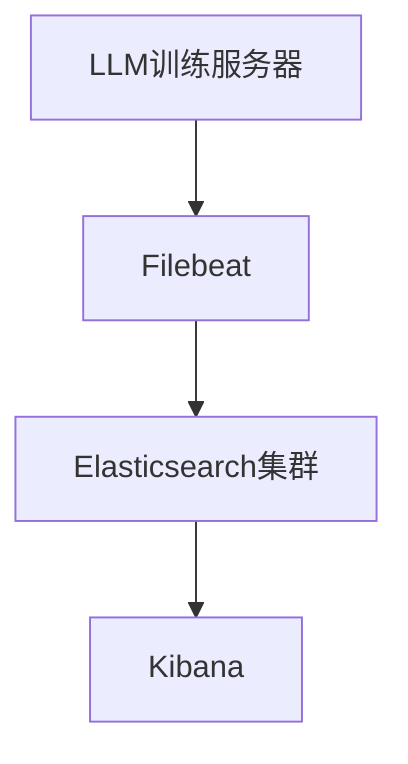
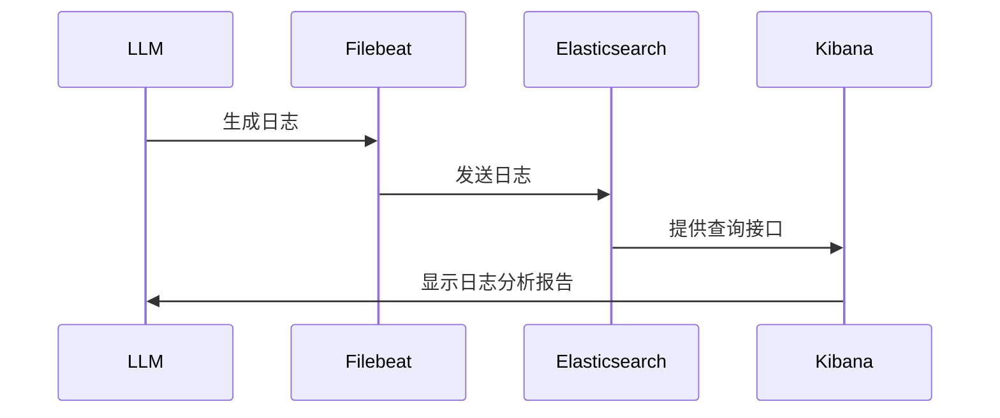
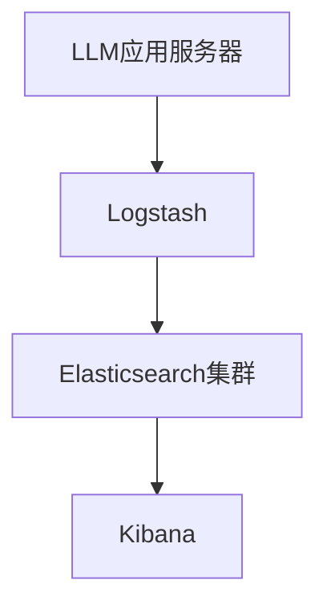

                 

## 第一部分：日志集中化概述

### 第1章：问题背景与日志集中化的必要性

#### 1.1 问题的提出

在现代信息技术和大型语言模型（LLM）的应用场景中，日志信息已成为不可或缺的一部分。这些日志记录了系统运行过程中的各种操作、事件和异常情况，对系统监控、故障排查、性能优化等方面有着至关重要的作用。然而，随着系统规模和复杂性的不断增长，传统的日志分散存储方式面临着诸多挑战。

首先，当系统中存在多个独立的日志源时，分散的日志文件存储在不同的服务器或存储设备上，给日志的管理和维护带来了极大的不便。例如，日志文件的不同命名规则、存储格式和数据结构可能会导致日志的解析和查询变得复杂，甚至可能导致关键日志信息的丢失。

其次，日志分散存储还会对日志分析工作带来困难。系统管理员和开发人员需要在不同日志文件之间进行切换，以便对特定的事件进行跟踪和诊断。这不仅增加了工作量的负担，还可能因为信息的不一致性而造成误判。

#### 1.2 日志集中化的定义

日志集中化是一种将系统中所有日志信息统一收集、存储和管理的技术手段。通过将分散的日志文件集中到一个统一的日志系统中，可以大大简化日志的管理流程，提高日志的可访问性和可分析性。

日志集中化不仅包括日志收集和存储，还涉及到日志处理和分析。一个完善的日志集中化系统通常包括以下关键组件：

1. **日志收集器**：负责从各个日志源收集日志数据。
2. **日志存储系统**：负责存储和持久化收集到的日志数据。
3. **日志处理模块**：对日志数据进行预处理、过滤、聚合等操作。
4. **日志查询和分析工具**：提供对日志数据的查询和分析功能。

#### 1.3 日志集中化的目标

日志集中化的主要目标包括：

1. **简化日志管理**：通过将日志集中存储，可以简化日志的管理和维护工作，减少系统的复杂性。
2. **提高日志分析效率**：集中化的日志系统可以提高日志的查询和分析效率，帮助快速定位问题，提高故障排查速度。
3. **确保日志完整性**：集中化的日志系统可以更好地保障日志的完整性和一致性，避免日志信息的丢失和遗漏。
4. **提供统一的日志视图**：通过集中化的日志系统，可以为系统管理员和开发人员提供一个统一的日志视图，方便他们快速了解系统的运行状况。

#### 1.4 日志集中化的优点

日志集中化具有以下优点：

1. **简化监控和管理**：集中化的日志系统使得日志监控和管理变得更加简单和高效。
2. **提高问题排查效率**：集中化的日志系统可以帮助快速定位和解决系统问题，提高问题排查的效率。
3. **保障日志安全性**：集中化的日志系统可以更好地保障日志的安全性和隐私性。
4. **支持大规模系统**：日志集中化技术适用于大规模、复杂的系统环境，可以满足不同规模系统的日志管理需求。

#### 1.5 日志集中化的挑战

尽管日志集中化具有许多优点，但在实际应用中也面临一些挑战：

1. **数据安全**：集中存储大量的日志数据可能会增加数据泄露的风险，需要采取有效的安全措施来保护日志数据。
2. **性能压力**：随着日志量的不断增加，日志收集、存储和处理系统可能会面临性能压力，需要采取适当的优化措施。
3. **扩展性问题**：日志集中化系统需要能够适应系统规模的扩展，避免在规模扩大时出现性能瓶颈。
4. **日志格式兼容性**：不同系统产生的日志格式可能不同，如何实现不同格式日志的统一处理和存储是一个挑战。

### 总结

日志集中化在现代信息技术和LLM应用中具有重要意义。通过日志集中化，不仅可以简化日志管理，提高问题排查效率，还可以保障日志的完整性和安全性。然而，日志集中化也面临数据安全、性能压力和扩展性等挑战，需要采取有效的措施来解决。在下一章中，我们将进一步探讨日志系统的基础知识，为深入理解日志集中化技术打下基础。

## 第2章：日志系统基础

### 2.1 日志的基本概念

日志是记录系统运行过程中各种操作、事件和异常情况的文本文件或电子文档。日志的主要作用是提供对系统行为的审计记录，帮助系统管理员和开发人员监控系统性能、排查故障和进行故障分析。日志通常包含以下关键信息：

1. **时间戳**：记录事件发生的时间，用于跟踪和排序事件。
2. **源地址**：记录事件发生的源地址，如服务器IP地址、应用程序名称等。
3. **事件类型**：记录事件的具体类型，如请求、错误、警告等。
4. **事件描述**：记录事件的详细描述，包括事件的性质、原因和结果等。
5. **用户信息**：记录触发事件的用户信息，如用户ID、用户名等。

日志根据用途和内容可以分为以下几类：

1. **系统日志**：记录系统运行过程中的各种事件和异常情况。
2. **应用程序日志**：记录应用程序运行过程中的日志信息，如错误、警告、调试信息等。
3. **网络日志**：记录网络通信过程中的日志信息，如网络连接状态、数据包传输等。
4. **安全日志**：记录系统安全事件，如登录失败、访问拒绝等。

#### 日志的边界与外延

日志的边界主要涉及到日志的内容和格式。日志的内容边界包括时间戳、源地址、事件类型、事件描述和用户信息等基本要素。日志的外延则包括日志的分类、日志的存储和日志的查询与分析。

#### 概念结构与核心要素组成

日志系统的概念结构主要由以下几个核心要素组成：

1. **日志生成器**：负责生成系统运行过程中的日志信息。
2. **日志收集器**：负责收集各个日志源生成的日志数据。
3. **日志存储系统**：负责存储和持久化收集到的日志数据。
4. **日志处理模块**：负责对日志数据进行预处理、过滤和聚合等操作。
5. **日志查询与分析工具**：提供对日志数据的查询和分析功能，帮助用户快速定位和解决问题。

### 2.2 日志文件格式

日志文件格式是日志数据的表现形式，决定了日志数据的可读性和可解析性。常见的日志文件格式包括文本格式、JSON格式和XML格式等。

1. **文本格式**：文本格式的日志文件是最常见的一种，其优点是简单易读，缺点是格式不统一，难以进行自动化解析和分析。

   ```plaintext
   [2023-03-15 10:30:45] INFO: Server started
   [2023-03-15 10:31:23] ERROR: Database connection failed
   ```

2. **JSON格式**：JSON格式的日志文件具有结构化特性，便于自动化解析和分析。其优点是易于存储和传输，缺点是相对于文本格式，JSON格式较为复杂，可读性较差。

   ```json
   {
     "timestamp": "2023-03-15 10:30:45",
     "level": "INFO",
     "message": "Server started"
   }
   {
     "timestamp": "2023-03-15 10:31:23",
     "level": "ERROR",
     "message": "Database connection failed"
   }
   ```

3. **XML格式**：XML格式的日志文件也具有结构化特性，类似于JSON格式。其优点是结构清晰，缺点是相对于文本格式和JSON格式，XML格式的日志文件体积较大，解析速度较慢。

   ```xml
   <log>
     <entry>
       <timestamp>2023-03-15 10:30:45</timestamp>
       <level>INFO</level>
       <message>Server started</message>
     </entry>
     <entry>
       <timestamp>2023-03-15 10:31:23</timestamp>
       <level>ERROR</level>
       <message>Database connection failed</message>
     </entry>
   </log>
   ```

### 2.3 日志分析工具简介

日志分析工具是日志集中化系统中不可或缺的一部分，它们负责对日志数据进行收集、存储、处理和分析。常见的日志分析工具包括以下几种：

1. **Logstash**：Logstash是一个开源的数据收集和处理工具，它可以将来自不同源的数据转换成统一的格式，并将其发送到指定的目的地。Logstash支持多种数据源，如文件、数据库、网络流等，并且可以自定义数据转换规则。

   ```yaml
   input {
     file {
       path => "/var/log/*.log"
       type => "system_log"
     }
   }
   filter {
     if "system_log" in [tags] {
       grok {
         match => { "message" => "%{TIMESTAMP_ISO8601:timestamp}\t%{DATA:level}\t%{DATA:message}" }
       }
     }
   }
   output {
     elasticsearch {
       hosts => ["localhost:9200"]
     }
   }
   ```

2. **Fluentd**：Fluentd是一个可扩展的日志记录和数据处理工具，它支持多种数据源和目的地，并且具有高性能和高可靠性。Fluentd可以通过配置文件进行灵活的数据处理，包括数据过滤、转换和聚合等操作。

   ```yaml
   <source>
     @type file
     path /var/log/*.log
     tag raw.log
   </source>
   
   <filter raw.log>
     @type record_transformer
     enable_ruby => true
     script => "record['timestamp'] = Time.now.strftime('%Y-%m-%d %H:%M:%S')"
   </filter>
   
   <match raw.log>
     @type elasticsearch
     hosts [ "localhost:9200" ]
     index_name logstash-%Y.%m.%d
   </match>
   ```

3. **Filebeat**：Filebeat是一个轻量级的日志收集器，它可以嵌入到应用程序中，将日志数据实时发送到日志存储系统或分析工具中。Filebeat支持多种日志格式和协议，并且具有自动重传和错误处理功能。

   ```yaml
   filebeat.inputs:
     - type: log
       enabled: true
       paths:
         - /var/log/*.log
   
   filebeat.config.modules:
     path: ${path.config}/modules.d/*.yml
     reload.enabled: false
   
   output.logstash:
     hosts: ["localhost:5044"]
   ```

### 2.4 日志系统的组成

一个完整的日志系统通常包括以下几个关键组成部分：

1. **日志生成器**：负责在系统运行过程中生成日志数据。日志生成器可以是操作系统、应用程序或网络设备等。
   
2. **日志收集器**：负责从日志生成器收集日志数据，并将其发送到日志存储系统。日志收集器可以是专门的软件工具，如Logstash、Fluentd或Filebeat等。

3. **日志存储系统**：负责存储和持久化收集到的日志数据。日志存储系统可以是文件系统、数据库或分布式存储系统等。

4. **日志处理模块**：负责对日志数据进行预处理、过滤和聚合等操作，以提高日志的可读性和可分析性。日志处理模块可以是专门的软件工具，如Logstash的filter阶段或Fluentd的配置文件等。

5. **日志查询与分析工具**：提供对日志数据的查询和分析功能，帮助用户快速定位和解决问题。日志查询与分析工具可以是专门的软件工具，如Kibana、Grafana等，也可以是自定义的Web界面或命令行工具。

### 总结

日志系统是现代信息技术中不可或缺的一部分，它通过记录系统运行过程中的各种事件和异常情况，帮助系统管理员和开发人员监控系统性能、排查故障和进行故障分析。本章介绍了日志的基本概念、日志文件格式、日志分析工具以及日志系统的组成，为后续章节进一步探讨日志集中化技术奠定了基础。

## 第3章：日志收集技术

### 3.1 日志收集的基本方法

日志收集是将系统运行过程中产生的日志数据从各个源头集中到一个统一的位置的过程。日志收集的基本方法主要包括推模式和拉模式。

#### 推模式

推模式（Push Model）是指日志生成器主动将日志数据发送到日志收集器。这种方法通常使用专门的日志收集工具，如Logstash、Fluentd或Filebeat等。这些工具可以嵌入到应用程序中，或者在单独的服务器上运行，定时将日志数据推送到日志存储系统。

推模式的优势在于：

1. **实时性高**：日志数据可以实时发送到日志收集器，便于实时监控和问题排查。
2. **可靠性高**：由于日志生成器主动发送日志数据，可以保证数据的完整性。

推模式的缺点包括：

1. **性能开销**：日志生成器需要消耗额外的资源来发送日志数据，可能会影响系统的性能。
2. **网络依赖**：日志收集器与日志生成器之间的网络连接稳定性对日志收集的成功率有重要影响。

#### 拉模式

拉模式（Pull Model）是指日志收集器定时从日志生成器拉取日志数据。这种方法通常使用传统的文件系统监控工具，如Linux的`inotify`或Windows的`Windows Management Instrumentation (WMI)`等。日志收集器会定期扫描日志文件，读取新产生的日志数据。

拉模式的优势在于：

1. **轻量级**：不需要在日志生成器上安装额外的软件，对系统性能的影响较小。
2. **灵活性高**：日志收集器可以独立于日志生成器运行，便于扩展和迁移。

拉模式的缺点包括：

1. **实时性较低**：由于日志收集器是定时拉取日志数据，不能提供实时监控。
2. **数据完整性**：如果日志收集器在拉取日志数据时出现异常，可能会导致部分日志数据的丢失。

### 3.2 常见日志收集工具

在现代信息技术中，有许多日志收集工具可供选择，以下介绍几种常见的日志收集工具。

#### Logstash

Logstash是Elastic公司开发的一个开源数据流处理工具，它可以接收来自不同源的数据，如文件、数据库、网络流等，并进行过滤、转换和路由，最终将数据发送到目的地，如Elasticsearch、Kafka等。

Logstash的主要组件包括：

1. **输入插件（Input Plugins）**：负责接收数据，如file、logstash-input-redis、logstash-input-http等。
2. **过滤器插件（Filter Plugins）**：负责对数据进行转换和过滤，如grok、mutate、date等。
3. **输出插件（Output Plugins）**：负责将处理后的数据发送到目的地，如elasticsearch、file、s3等。

以下是一个简单的Logstash配置示例：

```yaml
input {
  file {
    path => "/var/log/*.log"
    type => "system_log"
  }
}
filter {
  if "system_log" in [tags] {
    grok {
      match => { "message" => "%{TIMESTAMP_ISO8601:timestamp}\t%{DATA:level}\t%{DATA:message}" }
    }
  }
}
output {
  elasticsearch {
    hosts => ["localhost:9200"]
  }
}
```

#### Fluentd

Fluentd是另一个流行的开源日志记录和数据处理工具，它支持多种数据源和目的地，并且具有高性能和高可靠性。Fluentd的配置文件以YAML格式编写，非常灵活。

Fluentd的主要组件包括：

1. **源（Sources）**：负责接收数据，如file、syslog、http等。
2. **过滤器（Filters）**：负责对数据进行转换和过滤，如json、javascript等。
3. **输出（Outputs）**：负责将处理后的数据发送到目的地，如elasticsearch、file、kafka等。

以下是一个简单的Fluentd配置示例：

```yaml
<source>
  @type file
  path /var/log/*.log
  tag raw.log
</source>

<filter raw.log>
  @type record_transformer
  enable_ruby => true
  script => "record['timestamp'] = Time.now.strftime('%Y-%m-%d %H:%M:%S')"
</filter>

<match raw.log>
  @type elasticsearch
  hosts [ "localhost:9200" ]
  index_name logstash-%Y.%m.%d
</match>
```

#### Filebeat

Filebeat是 Elastic 公司开发的一个轻量级日志收集器，它可以嵌入到应用程序中，将日志数据实时发送到日志存储系统或分析工具中。Filebeat支持多种日志格式和协议，并且具有自动重传和错误处理功能。

Filebeat的主要组件包括：

1. **模块（Modules）**：负责配置数据源和转换规则，如system、docker、file等。
2. **配置文件（Configuration File）**：负责定义数据源、过滤器、输出和其他参数。

以下是一个简单的Filebeat配置示例：

```yaml
filebeat.inputs:
  - type: log
    enabled: true
    paths:
      - /var/log/*.log
   
filebeat.config.modules:
  path: ${path.config}/modules.d/*.yml
  reload.enabled: false
   
output.logstash:
  hosts: ["localhost:5044"]
```

### 3.3 日志收集面临的挑战与解决方案

尽管日志收集工具提供了方便的数据收集功能，但在实际应用中仍然面临一些挑战：

#### 大规模日志收集的效率问题

随着系统规模的扩大，日志量也会呈指数级增长，这给日志收集带来了巨大的性能压力。以下是一些解决方法：

1. **并行处理**：使用多线程或多进程的方式，同时处理多个日志文件，提高日志收集的效率。
2. **分布式收集**：将日志收集任务分布到多个节点上，每个节点负责收集一部分日志，然后将结果汇总。
3. **优化日志格式**：采用更高效的日志格式，如JSON，以减少数据传输和处理的负担。

#### 实时性要求

在某些场景下，如实时监控系统或故障排查系统，日志收集的实时性要求非常高。以下是一些解决方法：

1. **异步处理**：使用异步I/O技术，将日志收集和处理任务分离，提高系统的响应速度。
2. **流处理**：使用流处理技术，如Apache Kafka，将日志数据实时传输到日志收集器，保证实时性。
3. **边缘计算**：在数据产生的边缘节点上进行初步的日志处理，减少数据传输的延迟。

### 总结

日志收集是日志集中化系统中的关键组成部分，它负责从各个日志源收集日志数据，并将其传输到日志存储系统。本章介绍了日志收集的基本方法、常见日志收集工具以及面临的挑战和解决方案。通过合理的日志收集策略和工具选择，可以有效地提高日志收集的效率和实时性，为后续的日志处理和分析奠定基础。

### 3.4 基于Filebeat的日志收集实例

在本节中，我们将通过一个具体的例子来展示如何使用Filebeat收集日志数据。Filebeat是一款轻量级的日志收集器，它可以嵌入到应用程序中，将日志数据实时发送到日志存储系统或分析工具中。

#### 环境准备

首先，我们需要在目标系统上安装Filebeat。以下是安装步骤：

1. **下载Filebeat二进制文件**：
   ```bash
   wget https://artifacts.elastic.co/downloads/beats/filebeat/filebeat-8.0.0-linux-x86_64.tar.gz
   ```

2. **解压文件**：
   ```bash
   tar -xvf filebeat-8.0.0-linux-x86_64.tar.gz
   ```

3. **移动Filebeat到合适的位置**：
   ```bash
   mv filebeat-8.0.0-linux-x86_64 /usr/local/bin/filebeat
   ```

4. **设置Filebeat的可执行权限**：
   ```bash
   chmod +x /usr/local/bin/filebeat
   ```

5. **安装依赖**：
   ```bash
   sudo apt-get install -y libpmemobj0 libssl1.1-dev
   ```

6. **创建Filebeat用户**：
   ```bash
   sudo useradd -r -s /sbin/nologin filebeat
   ```

7. **配置Filebeat**：
   修改`/etc/filebeat/filebeat.yml`配置文件，设置日志文件的路径和输出目的地：

   ```yaml
   filebeat.inputs:
     - type: log
       enabled: true
       paths:
         - /var/log/messages
         - /var/log/apache2/*.log
   
   filebeat.config.modules:
     path: ${path.config}/modules.d/*.yml
     reload.enabled: false
   
   output.logstash:
     hosts: ["localhost:5044"]
   ```

8. **启动Filebeat服务**：
   ```bash
   /usr/bin/filebeat -E贝塞尔曲线计划
   ```

   或者使用systemd管理Filebeat服务：

   ```bash
   sudo systemctl daemon-reload
   sudo systemctl enable filebeat
   sudo systemctl start filebeat
   ```

#### 日志收集的核心实现

Filebeat的核心实现主要包括以下几个方面：

1. **输入模块（Input Module）**：
   Filebeat通过输入模块从指定的日志文件中读取数据。每个输入模块可以配置多个日志路径。

2. **解析器（Parser）**：
   Filebeat内置了多种日志文件的解析器，可以自动识别并解析常见的日志格式，如Apache、Nginx等。如果日志格式未被识别，可以自定义解析规则。

3. **过滤器（Filter）**：
   Filebeat支持在日志传输过程中对日志内容进行过滤和转换。过滤器可以使用正则表达式、字段变换等操作。

4. **输出模块（Output Module）**：
   Filebeat将处理后的日志数据发送到指定的输出目的地。支持多种输出类型，如Elasticsearch、Logstash、Kafka等。

#### Filebeat配置文件解读

在Filebeat的配置文件中，我们使用YAML格式定义输入、过滤器、输出和其他参数。以下是一个简单的配置文件示例：

```yaml
filebeat.inputs:
  - type: log
    enabled: true
    paths:
      - /var/log/messages
      - /var/log/apache2/*.log

filebeat.config.modules:
  path: ${path.config}/modules.d/*.yml
  reload.enabled: false

output.logstash:
  hosts: ["localhost:5044"]
```

在这个示例中：

- `inputs`部分定义了输入模块，指定了要读取的日志文件路径。
- `config.modules`部分定义了模块配置，用于加载自定义模块。
- `output.logstash`部分定义了输出模块，指定了将日志数据发送到本地Logstash服务的地址。

#### 常见问题与解决方案

在实际使用Filebeat的过程中，可能会遇到以下问题：

1. **无法读取日志文件**：
   - 确认日志文件路径是否正确。
   - 确认文件权限是否允许读取。
   - 检查日志文件格式是否与Filebeat支持的格式匹配。

2. **日志数据传输失败**：
   - 确认输出地址是否正确。
   - 检查网络连接是否正常。
   - 检查日志数据是否过大，导致传输失败。

3. **配置文件错误**：
   - 检查配置文件语法是否正确。
   - 确认配置参数是否合理。

### 总结

在本节中，我们通过一个具体的实例展示了如何使用Filebeat进行日志收集。Filebeat提供了灵活的配置选项和强大的数据处理能力，是日志集中化系统中常用的日志收集工具之一。通过合理配置和使用Filebeat，可以有效地收集和管理系统日志，为后续的日志处理和分析提供数据基础。

### 3.5 日志存储技术

日志存储是日志集中化系统中的关键组成部分，它负责接收和处理从日志收集器收集到的日志数据。选择合适的日志存储技术对于确保日志的完整性、可靠性和高效性至关重要。日志存储技术可以分为以下几类：

#### 文件系统

文件系统是一种最简单的日志存储方法，它将日志数据以文件的形式存储在磁盘上。文件系统的优点包括：

1. **简单易用**：文件系统可以直接使用操作系统自带的文件管理工具进行操作，无需额外的配置。
2. **存储成本低**：文件系统不需要额外的存储设备，可以使用现有的磁盘资源。

然而，文件系统也有其局限性：

1. **数据一致性**：文件系统无法保证数据的强一致性，特别是在多实例或分布式系统中，可能会出现数据丢失或冲突的情况。
2. **性能限制**：文件系统的性能受到磁盘I/O的限制，无法满足大规模日志数据的快速读取和写入需求。

#### 关系型数据库

关系型数据库（RDBMS）如MySQL、PostgreSQL等，也可以用于存储日志数据。关系型数据库的优点包括：

1. **数据结构化**：关系型数据库可以提供结构化的数据存储方式，便于进行复杂查询和数据分析。
2. **事务支持**：关系型数据库支持事务，可以保证数据的完整性和一致性。

关系型数据库的缺点包括：

1. **性能瓶颈**：关系型数据库在处理大规模日志数据时，可能会出现性能瓶颈，特别是在进行大量插入、更新和查询操作时。
2. **扩展性差**：关系型数据库通常难以进行横向扩展，当数据量巨大时，可能需要通过分库分表等方式来解决问题。

#### 分布式存储系统

分布式存储系统如Elasticsearch、Kafka、Apache Hadoop等，专门为大规模数据存储和处理而设计。这些系统的优点包括：

1. **高扩展性**：分布式存储系统可以横向扩展，通过增加节点来处理更多的数据。
2. **高性能**：分布式存储系统可以通过并行处理和数据分片来提高性能。
3. **高可用性**：分布式存储系统具有高可用性，可以通过冗余存储和数据复制来保证数据不丢失。

分布式存储系统的缺点包括：

1. **复杂性高**：分布式存储系统的配置和管理相对复杂，需要专业的维护团队。
2. **成本高**：分布式存储系统通常需要高性能的硬件支持和专业的维护费用。

### 3.6 常见日志存储系统

在现代信息技术中，有许多常见的日志存储系统可供选择，以下介绍几种常见的日志存储系统。

#### Elasticsearch

Elasticsearch是一个开源的分布式搜索引擎，它支持全文搜索、实时分析等功能。Elasticsearch可以用于存储和查询大规模的日志数据，具有以下优点：

1. **全文搜索**：Elasticsearch支持强大的全文搜索功能，可以快速检索日志内容。
2. **实时分析**：Elasticsearch支持实时分析，可以快速对日志数据进行分析和可视化。
3. **可扩展性**：Elasticsearch可以水平扩展，处理海量日志数据。

Elasticsearch的缺点包括：

1. **学习成本高**：Elasticsearch的配置和管理相对复杂，需要一定的学习和实践经验。
2. **性能压力**：随着日志量的增加，Elasticsearch的性能可能会受到压力，需要优化配置。

#### Kafka

Kafka是一个开源的分布式消息系统，它支持高吞吐量的日志数据传输和存储。Kafka的主要优点包括：

1. **高吞吐量**：Kafka可以处理高并发的日志数据，适合大规模系统。
2. **分布式架构**：Kafka支持分布式架构，可以通过增加节点来扩展存储和处理能力。
3. **持久化存储**：Kafka可以将日志数据持久化存储在磁盘上，保证数据不丢失。

Kafka的缺点包括：

1. **数据检索困难**：Kafka不支持直接的数据检索，需要通过其他工具（如Elasticsearch）进行二次处理。
2. **管理复杂**：Kafka的管理相对复杂，需要专业的运维团队。

#### Hadoop

Hadoop是一个开源的分布式计算框架，它主要用于大规模数据存储和处理。Hadoop的主要优点包括：

1. **海量数据存储**：Hadoop可以存储和处理PB级别的数据，适合大规模系统。
2. **高可靠性**：Hadoop通过冗余存储和数据复制来保证数据的高可靠性。
3. **灵活性强**：Hadoop支持多种数据处理工具，如MapReduce、Spark等。

Hadoop的缺点包括：

1. **资源消耗大**：Hadoop需要大量的计算资源和存储资源，成本较高。
2. **维护复杂**：Hadoop的管理和维护相对复杂，需要专业的运维团队。

### 3.7 日志存储面临的挑战与解决方案

在实际应用中，日志存储面临以下挑战：

1. **数据安全性**：如何确保日志数据的安全性，防止数据泄露或被恶意攻击。

   **解决方案**：
   - 数据加密：对日志数据进行加密，确保数据在传输和存储过程中不会被未授权的第三方读取。
   - 访问控制：实现严格的访问控制策略，限制只有授权用户可以访问日志数据。

2. **数据一致性**：在多实例或分布式系统中，如何保证日志数据的强一致性。

   **解决方案**：
   - 分布式协议：采用分布式协议（如两阶段提交），确保多个实例之间的数据一致性。
   - 数据复制：实现数据复制机制，确保在某个实例发生故障时，其他实例可以继续处理日志数据。

3. **数据可靠性**：如何确保日志数据的可靠性，防止数据丢失或损坏。

   **解决方案**：
   - 数据备份：定期对日志数据进行备份，确保在数据丢失或损坏时可以恢复。
   - 压缩存储：采用压缩算法，减小日志数据的存储空间，提高存储效率。

### 总结

日志存储是日志集中化系统中的关键组成部分，它负责接收和处理从日志收集器收集到的日志数据。选择合适的日志存储技术对于确保日志的完整性、可靠性和高效性至关重要。文件系统、关系型数据库和分布式存储系统是常见的日志存储技术，各具优缺点。在实际应用中，需要根据具体需求和场景选择合适的存储技术，并采取有效的措施解决数据安全性、一致性和可靠性等方面的挑战。

### 3.8 基于Elasticsearch的日志存储实例

在本节中，我们将通过一个具体的例子来展示如何使用Elasticsearch进行日志存储。Elasticsearch是一个强大的开源分布式搜索引擎，广泛用于大规模日志数据的存储和查询。

#### 环境准备

首先，我们需要在目标系统上安装Elasticsearch。以下是安装步骤：

1. **下载Elasticsearch二进制文件**：
   ```bash
   wget https://www.elastic.co/downloads/elasticsearch/elasticsearch-8.0.0.tar.gz
   ```

2. **解压文件**：
   ```bash
   tar -xvf elasticsearch-8.0.0.tar.gz
   ```

3. **移动Elasticsearch到合适的位置**：
   ```bash
   mv elasticsearch-8.0.0 /usr/local/elasticsearch
   ```

4. **配置Elasticsearch**：
   修改`/usr/local/elasticsearch/config/elasticsearch.yml`配置文件，设置集群名称和节点名称：
   ```yaml
   cluster.name: my-elasticsearch-cluster
   node.name: my-elasticsearch-node
   ```

5. **启动Elasticsearch服务**：
   ```bash
   /usr/local/elasticsearch/bin/elasticsearch
   ```

   或者使用systemd管理Elasticsearch服务：
   ```bash
   sudo systemctl daemon-reload
   sudo systemctl enable elasticsearch
   sudo systemctl start elasticsearch
   ```

#### Elasticsearch的核心实现

Elasticsearch的核心实现主要包括以下几个方面：

1. **集群管理**：Elasticsearch支持分布式集群管理，通过多个节点协同工作，提供高可用性和可扩展性。
2. **索引管理**：Elasticsearch使用索引（index）来存储相同类型的数据。每个索引可以包含多个类型（type），每种类型可以包含多个文档（document）。
3. **文档处理**：Elasticsearch支持对文档的创建、更新、删除和查询操作。文档以JSON格式存储，包含多个字段。

#### Elasticsearch配置文件解读

在Elasticsearch的配置文件中，我们使用YAML格式定义集群、节点、索引和日志等相关参数。以下是一个简单的配置文件示例：

```yaml
cluster.name: my-elasticsearch-cluster
node.name: my-elasticsearch-node
path.data: /usr/local/elasticsearch/data
path.logs: /usr/local/elasticsearch/logs
http.port: 9200
discovery.type: single-node
```

在这个示例中：

- `cluster.name`：设置集群名称。
- `node.name`：设置节点名称。
- `path.data`：设置数据存储路径。
- `path.logs`：设置日志文件路径。
- `http.port`：设置HTTP服务端口。
- `discovery.type`：设置发现类型，这里使用单节点模式。

#### 常见问题与解决方案

在实际使用Elasticsearch的过程中，可能会遇到以下问题：

1. **无法启动Elasticsearch**：
   - 确认Elasticsearch配置文件是否正确。
   - 检查系统环境变量，确保Java环境已经配置。
   - 检查Elasticsearch日志文件，查找启动错误信息。

2. **Elasticsearch性能下降**：
   - 检查系统资源使用情况，确保CPU、内存和磁盘使用率未超过阈值。
   - 优化Elasticsearch配置，调整集群大小和索引设置。
   - 定期对Elasticsearch进行维护和优化。

3. **数据丢失或损坏**：
   - 定期备份Elasticsearch数据，确保在数据丢失或损坏时可以恢复。
   - 使用Elasticsearch的数据复制功能，确保数据在多个节点之间保持同步。

### 总结

在本节中，我们通过一个具体的实例展示了如何使用Elasticsearch进行日志存储。Elasticsearch提供了强大的分布式存储和查询功能，适用于大规模日志数据的存储和检索。通过合理配置和使用Elasticsearch，可以有效地管理和分析系统日志，为故障排查和性能优化提供支持。

### 3.9 日志处理技术

日志处理是日志集中化系统中的关键环节，它负责对收集到的日志数据进行预处理、过滤和聚合等操作，以提高日志的可读性和可分析性。有效的日志处理技术可以帮助系统管理员和开发人员快速定位问题，提高故障排查效率。以下是几种常见的日志处理技术。

#### 数据清洗

数据清洗是日志处理的第一步，它主要负责去除日志中的噪声数据、纠正数据中的错误、填补缺失值等。通过数据清洗，可以确保日志数据的准确性和一致性。常见的数据清洗方法包括：

1. **去重**：删除重复的日志记录，避免重复分析相同的日志信息。
2. **格式转换**：将不同格式的日志转换为统一的格式，便于后续处理和分析。
3. **错误纠正**：识别和纠正日志中的拼写错误、语法错误等。
4. **数据补全**：填补日志中缺失的数据，如时间戳、事件描述等。

#### 数据过滤

数据过滤是对日志数据进行筛选，只保留符合条件的日志记录。通过数据过滤，可以快速缩小分析范围，提高日志处理的效率。常见的数据过滤方法包括：

1. **基于条件的过滤**：根据特定条件（如日志级别、事件类型、时间范围等）筛选日志记录。
2. **正则表达式过滤**：使用正则表达式匹配日志内容，筛选出符合特定模式的日志记录。
3. **字段过滤**：根据需要保留的字段筛选日志记录，去除无关字段。

#### 数据聚合

数据聚合是对日志记录进行汇总和统计，生成更高层次的信息。通过数据聚合，可以了解系统的整体运行状况和趋势。常见的数据聚合方法包括：

1. **计数**：统计满足特定条件的日志记录数量，用于衡量事件的发生频率。
2. **求和**：对满足特定条件的日志记录中的某个字段求和，用于计算总量。
3. **最大值和最小值**：找出满足特定条件的日志记录中的最大值和最小值，用于分析极值。
4. **分组和汇总**：根据特定字段对日志记录进行分组，并对每个分组进行汇总统计，用于生成详细的统计报告。

#### 实际应用中的日志处理方法

在实际应用中，日志处理通常结合多种技术方法，以实现高效的日志分析。以下是一些常见的日志处理方法：

1. **实时处理**：使用实时数据处理框架（如Apache Kafka、Apache Flink等），对日志数据进行实时处理和分析，以支持实时监控和故障排查。
2. **批量处理**：使用批处理框架（如Apache Spark、Hadoop MapReduce等），对大量历史日志数据进行批量处理和分析，以生成详细的统计报告和趋势分析。
3. **日志管道**：使用日志管道（Log Pipeline）技术，将日志数据从生成器传输到存储系统，并在传输过程中进行清洗、过滤和聚合等操作。
4. **机器学习**：结合机器学习算法，对日志数据进行深度分析和异常检测，发现潜在的问题和趋势。

### 总结

日志处理是日志集中化系统中的关键环节，通过数据清洗、过滤和聚合等技术，可以提高日志数据的可读性和可分析性。有效的日志处理方法可以帮助系统管理员和开发人员快速定位问题，提高故障排查效率。在实际应用中，应根据具体需求和场景选择合适的日志处理方法，以实现高效的日志分析。

### 3.10 常见日志处理工具

在日志集中化系统中，日志处理工具扮演着至关重要的角色，它们负责对收集到的日志数据进行清洗、过滤、聚合等操作，以提高日志的可读性和可分析性。以下介绍几种常见的日志处理工具，包括它们的原理、特点、配置和使用方法。

#### Logstash

Logstash是Elastic Stack的核心组件之一，它是一个开源的数据流处理工具，用于接收、转换和路由数据。Logstash支持从多个输入源（如文件、数据库、网络流等）收集数据，并进行过滤、转换和路由，最终将数据发送到目的地（如Elasticsearch、Kafka等）。

**原理与特点**：

- **原理**：Logstash基于管道和过滤器模型，数据流经过多个阶段进行处理，包括输入、过滤器、输出等。
- **特点**：支持丰富的输入源和目的地，灵活的过滤器配置，强大的数据转换功能。

**配置与使用方法**：

1. **配置文件**：Logstash的配置文件以YAML格式编写，位于`/etc/logstash/conf.d/`目录。以下是一个简单的Logstash配置示例：
   ```yaml
   input {
     file {
       path => "/var/log/*.log"
       type => "system_log"
     }
   }
   filter {
     if "system_log" in [tags] {
       grok {
         match => { "message" => "%{TIMESTAMP_ISO8601:timestamp}\t%{DATA:level}\t%{DATA:message}" }
       }
     }
   }
   output {
     elasticsearch {
       hosts => ["localhost:9200"]
     }
   }
   ```

2. **启动Logstash**：在配置完成后，启动Logstash服务：
   ```bash
   /usr/bin/logstash -f /etc/logstash/conf.d/your-config-file.conf
   ```

#### Fluentd

Fluentd是另一个流行的日志记录和数据处理工具，它支持多种数据源和目的地，并具有高性能和高可靠性。Fluentd的配置文件以YAML格式编写，非常灵活。

**原理与特点**：

- **原理**：Fluentd通过输入源、过滤器、输出源等组件处理数据流。
- **特点**：支持多种数据源和目的地，易于扩展和定制。

**配置与使用方法**：

1. **配置文件**：Fluentd的配置文件位于`/etc/fluentd/config.d/`目录。以下是一个简单的Fluentd配置示例：
   ```yaml
   <source>
     @type file
     path /var/log/*.log
     tag raw.log
   </source>
   
   <filter raw.log>
     @type record_transformer
     enable_ruby => true
     script => "record['timestamp'] = Time.now.strftime('%Y-%m-%d %H:%M:%S')"
   </filter>
   
   <match raw.log>
     @type elasticsearch
     hosts [ "localhost:9200" ]
     index_name logstash-%Y.%m.%d
   </match>
   ```

2. **启动Fluentd**：在配置完成后，启动Fluentd服务：
   ```bash
   fluentd -c /etc/fluentd/config.d/your-config-file.conf
   ```

#### Filebeat

Filebeat是Elastic Stack的另一个组件，它是一个轻量级的日志收集器，可以嵌入到应用程序中，将日志数据实时发送到日志存储系统或分析工具中。Filebeat支持多种日志格式和协议，并具有自动重传和错误处理功能。

**原理与特点**：

- **原理**：Filebeat通过模块配置收集和发送日志数据。
- **特点**：轻量级，易于集成，支持自动重传和错误处理。

**配置与使用方法**：

1. **配置文件**：Filebeat的配置文件位于`/etc/filebeat/`目录。以下是一个简单的Filebeat配置示例：
   ```yaml
   filebeat.inputs:
     - type: log
       enabled: true
       paths:
         - /var/log/*.log
   
   filebeat.config.modules:
     path: ${path.config}/modules.d/*.yml
     reload.enabled: false
   
   output.logstash:
     hosts: ["localhost:5044"]
   ```

2. **启动Filebeat**：在配置完成后，启动Filebeat服务：
   ```bash
   filebeat -c /etc/filebeat/filebeat.yml
   ```

### 总结

常见的日志处理工具如Logstash、Fluentd和Filebeat，各具特点，适用于不同的日志处理场景。通过合理的配置和使用，这些工具可以帮助系统管理员和开发人员高效地处理和解析日志数据，为故障排查和系统监控提供支持。在实际应用中，应根据具体需求和场景选择合适的日志处理工具，并优化其配置以提高性能和可靠性。

### 3.11 常见日志处理工具的使用技巧

在实际应用中，使用日志处理工具如Logstash、Fluentd和Filebeat时，掌握一些常见的使用技巧可以提高日志处理的效率和效果。以下是一些使用技巧和注意事项：

#### 配置优化

1. **性能调优**：针对大规模日志处理任务，可以调整Logstash和Fluentd的工作线程数和内存分配，以优化性能。例如，在Logstash配置文件中增加`-w`参数设置工作线程数：
   ```bash
   logstash -f /etc/logstash/conf.d/your-config-file.conf -w 4
   ```

2. **过滤器优化**：针对复杂的日志处理需求，可以使用更高效的过滤器，如使用Lucene过滤器代替正则表达式，以减少处理时间和资源消耗。

3. **缓存机制**：在处理过程中，可以使用缓存机制减少重复计算，提高效率。例如，在Fluentd中可以使用`@cache`模块配置缓存：

   ```yaml
   <filter raw.log>
     @type cache
     key /var/log/*.log
     cache_size 10000
   </filter>
   ```

#### 故障处理

1. **监控日志**：确保日志处理工具的运行日志被记录和监控，以便在出现问题时快速定位问题。例如，在Logstash中可以开启详细的日志输出：
   ```bash
   logstash -f /etc/logstash/conf.d/your-config-file.conf --log.level debug
   ```

2. **错误重试**：设置日志处理工具的错误重试机制，确保在出现临时错误时能够自动重试，避免数据丢失。例如，在Filebeat中配置错误重试次数：
   ```yaml
   filebeat.config.modules:
     error_handler:
       retry:
         enable: true
         max_retries: 3
         initial_interval: 1s
         max_interval: 32s
   ```

3. **断点续传**：对于长时间运行的日志处理任务，可以使用断点续传功能，确保在任务中断后能够继续处理未完成的日志数据。

#### 高级应用

1. **日志聚合**：利用日志处理工具的聚合功能，可以对大量日志数据进行汇总和统计分析，生成更详细的报告。例如，使用Logstash的`stats`过滤器收集处理统计数据。

   ```yaml
   filter {
     if [tag] == "your.tag" {
       stats {
         count => "log_count"
         gauge => "log_size"
       }
     }
   }
   ```

2. **多租户处理**：对于多租户系统，可以基于用户ID或租户ID对日志进行处理和存储，确保日志的隔离和安全性。

3. **日志增强**：通过日志增强，可以添加额外的元数据或上下文信息到日志中，提高日志的分析价值。例如，在Fluentd中使用`Tags`模块添加自定义标签。

   ```yaml
   <filter raw.log>
     @type tags
     tag_key user_id
     tag_value ${user_id}
   </filter>
   ```

#### 注意事项

1. **日志格式兼容性**：在处理不同格式的日志时，需要确保日志处理工具能够正确解析和转换日志格式，避免数据丢失或解析错误。

2. **网络稳定性**：对于通过网络传输日志的处理工具，如Logstash和Fluentd，需要确保网络连接的稳定性和可靠性，以避免数据传输失败。

3. **数据安全**：在处理和存储日志时，需要采取适当的数据保护措施，如数据加密、访问控制等，确保日志数据的安全性。

4. **系统资源管理**：合理分配系统资源，避免日志处理工具占用过多的CPU、内存和磁盘空间，影响系统的整体性能。

### 总结

通过掌握常见的日志处理工具的使用技巧和注意事项，可以更高效地管理和分析日志数据。配置优化、故障处理、高级应用和注意事项等都是提高日志处理效率和效果的关键因素。在实际应用中，应根据具体需求和场景灵活运用这些技巧，以确保日志处理系统的稳定运行和高效性能。

### 3.12 日志分析技术

日志分析是日志集中化系统中的关键环节，通过对收集和存储的日志数据进行深度分析和处理，可以提供对系统运行状况的洞察，帮助识别潜在问题并优化系统性能。以下介绍几种常见的日志分析技术，以及它们在日志集中化系统中的应用。

#### 基于统计学的日志分析

基于统计学的日志分析是一种常用的方法，它通过统计方法对日志数据进行处理，提取有价值的信息。以下是一些常见的统计学分析技术：

1. **均值和方差**：计算日志数据中某个字段（如响应时间、错误率等）的均值和方差，用于评估系统的稳定性和性能。

2. **标准差**：计算日志数据中某个字段的标准差，用于识别异常值，并评估系统的波动性。

3. **分布分析**：使用直方图、饼图等可视化工具，展示日志数据中某个字段（如请求类型、用户行为等）的分布情况。

4. **相关性分析**：分析不同日志字段之间的相关性，识别系统中可能存在的依赖关系和潜在问题。

#### 基于机器学习的日志分析

基于机器学习的日志分析是一种更加智能的方法，它通过训练机器学习模型，对日志数据进行分类、预测和异常检测。以下是一些常见的机器学习分析技术：

1. **分类算法**：使用分类算法（如决策树、支持向量机等）将日志数据分类，识别不同类型的事件和问题。

2. **聚类算法**：使用聚类算法（如K-means、DBSCAN等）将日志数据划分为不同的群体，识别系统中的异常行为和潜在问题。

3. **回归分析**：使用回归分析（如线性回归、多项式回归等）预测日志数据中某个字段（如响应时间、流量等）的趋势和变化。

4. **异常检测**：使用异常检测算法（如孤立森林、本地 outlier 因子等）识别日志数据中的异常值，预测潜在的故障和攻击行为。

#### 实时日志分析

实时日志分析是一种对实时流数据进行分析的技术，它可以在数据生成的同时进行处理和可视化，提供对系统运行状况的实时监控。以下是一些常见的实时日志分析技术：

1. **流处理框架**：使用流处理框架（如Apache Kafka、Apache Flink等），对实时流数据进行处理和分析，提供实时监控和预警。

2. **实时查询**：使用实时查询引擎（如Elasticsearch、Apache Druid等），对实时流数据进行快速查询和聚合，提供实时的统计报表和可视化。

3. **实时告警**：结合实时日志分析和告警系统（如Prometheus、Grafana等），实现实时监控和故障告警，快速响应系统问题。

#### 历史日志分析

历史日志分析是对历史日志数据进行回顾和分析，以识别系统性能趋势、故障模式和优化机会。以下是一些常见的历史日志分析技术：

1. **趋势分析**：通过分析历史日志数据，识别系统性能指标（如响应时间、CPU利用率等）的趋势，预测未来的性能表现。

2. **故障模式识别**：通过分析历史日志数据，识别系统常见的故障模式和问题根源，制定相应的预防措施和改进方案。

3. **行为分析**：通过分析历史日志数据，了解用户行为和系统操作习惯，优化系统设计和管理策略。

### 日志分析技术在日志集中化系统中的应用

日志分析技术在日志集中化系统中有着广泛的应用，以下是一些具体的应用场景：

1. **故障排查**：通过实时日志分析和历史日志分析，快速定位系统故障和问题，提供详细的故障报告和分析建议。

2. **性能优化**：通过趋势分析和性能监控，识别系统性能瓶颈和优化机会，制定相应的性能优化方案。

3. **安全监控**：通过异常检测和分类算法，识别潜在的攻击行为和系统漏洞，提供实时告警和防护措施。

4. **运营优化**：通过行为分析和趋势分析，了解用户需求和使用习惯，优化系统设计和运营策略。

5. **运维自动化**：结合日志分析和自动化工具，实现自动化故障排查、性能优化和安全监控，提高运维效率和系统稳定性。

### 总结

日志分析技术是日志集中化系统中的核心组成部分，通过基于统计学的分析、机器学习的分析、实时日志分析和历史日志分析等多种技术，可以实现对日志数据的深度分析和处理，为系统监控、故障排查、性能优化和安全监控提供强有力的支持。在实际应用中，应根据具体需求和场景选择合适的日志分析技术，并优化其配置和应用策略，以实现高效的日志分析和管理。

### 3.13 常见日志分析工具及其使用方法

在日志集中化系统中，日志分析工具起着至关重要的作用，它们可以帮助我们从海量日志数据中提取有价值的信息，进行深度分析和可视化。以下介绍几种常见的日志分析工具，包括它们的原理、特点、配置和使用方法。

#### ELK堆栈

ELK堆栈是由Elasticsearch、Logstash和Kibana三个开源工具组成的生态系统，广泛应用于日志分析、监控和可视化。

**原理与特点**：

- **Elasticsearch**：作为核心组件，提供强大的全文搜索和实时分析功能，支持大规模日志数据的存储和查询。
- **Logstash**：负责日志数据的收集、过滤和路由，将来自不同源的数据转换成统一的格式，并将其发送到Elasticsearch。
- **Kibana**：提供可视化界面，帮助用户通过图表、仪表板和报告直观地分析日志数据。

**配置与使用方法**：

1. **Elasticsearch**：配置Elasticsearch集群，设置节点名称和集群名称。配置文件位于`/etc/elasticsearch/elasticsearch.yml`：
   ```yaml
   cluster.name: my-elasticsearch-cluster
   node.name: my-elasticsearch-node
   ```
   启动Elasticsearch服务：
   ```bash
   /usr/bin/elasticsearch
   ```

2. **Logstash**：配置Logstash输入、过滤和输出。配置文件位于`/etc/logstash/conf.d/`，以下是一个简单的配置示例：
   ```yaml
   input {
     file {
       path => "/var/log/*.log"
       type => "system_log"
     }
   }
   filter {
     if "system_log" in [tags] {
       grok {
         match => { "message" => "%{TIMESTAMP_ISO8601:timestamp}\t%{DATA:level}\t%{DATA:message}" }
       }
     }
   }
   output {
     elasticsearch {
       hosts => ["localhost:9200"]
     }
   }
   ```
   启动Logstash服务：
   ```bash
   /usr/bin/logstash -f /etc/logstash/conf.d/your-config-file.conf
   ```

3. **Kibana**：配置Kibana与Elasticsearch集群通信，配置文件位于`/etc/kibana/kibana.yml`：
   ```yaml
   elasticsearch.hosts: ["http://localhost:9200"]
   ```
   启动Kibana服务：
   ```bash
   /usr/local/bin/kibana
   ```

#### Prometheus

Prometheus是一个开源的监控解决方案，专注于收集和存储时间序列数据，提供高效的数据查询和告警功能。

**原理与特点**：

- **Prometheus Server**：负责存储和查询时间序列数据，可以与各种数据采集器（Exporter）和告警管理器（Alertmanager）集成。
- **数据采集器（Exporter）**：负责从目标系统上收集指标数据，如HTTP服务、JVM监控等。
- **告警管理器（Alertmanager）**：负责处理告警规则，发送告警通知。

**配置与使用方法**：

1. **Prometheus Server**：配置Prometheus Server，设置数据存储路径和采集器地址。配置文件位于`/etc/prometheus/prometheus.yml`：
   ```yaml
   global:
     scrape_interval: 15s
   scrape_configs:
     - job_name: 'prometheus'
       static_configs:
       - targets: ['localhost:9090']
   ```
   启动Prometheus Server：
   ```bash
   /usr/bin/prometheus --config.file /etc/prometheus/prometheus.yml --storage.tsdb.path /etc/prometheus/data/TSDB
   ```

2. **数据采集器（Exporter）**：安装和配置数据采集器，例如，安装Java进程监控Exporter：
   ```bash
   wget https://github.com/prometheus/jmx_exporter/releases/download/v1.4.0/jmx_exporter-1.4.0.linux-amd64.tar.gz
   tar xvf jmx_exporter-1.4.0.linux-amd64.tar.gz
   nohup ./jmx_exporter-1.4.0.linux-amd64/jmx_exporter --web.listen-address=0.0.0.0:9100 > /dev/null 2>&1 &
   ```

3. **Alertmanager**：配置Alertmanager，设置告警规则和通知渠道。配置文件位于`/etc/alertmanager/alertmanager.yml`：
   ```yaml
   route:
     receiver: 'email'
     group_by: ['alertname']
     group_wait: 10s
     group_interval: 10s
     repeat_interval: 1h
   receivers:
   - name: 'email'
     email_configs:
     - to: 'admin@example.com'
       send_resolved: true
   ```
   启动Alertmanager服务：
   ```bash
   /usr/bin/alertmanager --config.file /etc/alertmanager/alertmanager.yml
   ```

#### Grafana

Grafana是一个开源的数据监控和可视化平台，支持多种数据源，可以创建自定义仪表板和告警规则。

**原理与特点**：

- **数据源**：支持多种数据源，如Elasticsearch、InfluxDB、MySQL等，提供丰富的数据连接器和查询语言。
- **仪表板**：提供直观的仪表板设计工具，用户可以自定义图表、面板和报表。
- **告警**：支持自定义告警规则，可以发送邮件、短信或集成到Slack等即时通讯工具。

**配置与使用方法**：

1. **安装Grafana**：安装Grafana服务器，配置数据源连接。配置文件位于`/etc/grafana/grafana.ini`：
   ```ini
   [server]
   http_addr = 0.0.0.0
   http_port = 3000
   [data]
   elasticsearch_url = http://localhost:9200
   ```
   启动Grafana服务：
   ```bash
   /usr/bin/grafana-server -config=/etc/grafana/grafana.ini
   ```

2. **创建仪表板**：在Grafana中创建仪表板，添加数据源、面板和告警规则。通过Web界面设计仪表板，直观展示日志数据和监控指标。

3. **自定义告警规则**：在Grafana中创建自定义告警规则，根据日志数据和监控指标设置告警条件和通知方式。

### 总结

常见的日志分析工具如ELK堆栈、Prometheus和Grafana，各具特点，适用于不同的日志分析场景。通过合理的配置和使用，这些工具可以帮助我们从海量日志数据中提取有价值的信息，实现高效的日志分析和可视化。在实际应用中，应根据具体需求和场景选择合适的日志分析工具，并优化其配置和应用策略，以实现高效的日志管理。

### 3.14 日志分析面临的挑战与解决方案

尽管日志分析技术已经相当成熟，但在实际应用中仍然面临一些挑战，这些挑战可能影响日志分析的效果和效率。以下将讨论日志分析中常见的挑战及其解决方案。

#### 数据量大

随着系统规模的扩大，日志数据量也会呈现指数级增长。大规模的日志数据给日志分析带来了巨大的挑战：

1. **存储和查询性能**：大量的日志数据需要存储在高效、可扩展的存储系统上，如Elasticsearch。同时，快速查询和分析这些数据也是一大难题。

   **解决方案**：
   - **分片和索引**：将日志数据分布在多个分片上，可以提高查询性能和系统的可扩展性。通过建立合适的索引结构，可以加速查询速度。
   - **并行处理**：使用多线程或分布式处理技术，并行处理日志数据，提高分析效率。

2. **数据压缩**：采用高效的数据压缩技术，减少日志数据的存储空间和传输带宽。

#### 数据多样性

不同系统和应用产生的日志格式可能各不相同，这给统一处理和标准化分析带来了困难：

1. **日志格式转换**：不同的日志格式需要进行转换，以便统一处理和分析。

   **解决方案**：
   - **日志格式标准化**：制定统一的日志格式标准，确保日志数据的可读性和可分析性。
   - **自定义解析器**：根据不同日志格式编写自定义的解析器，实现日志数据的统一处理。

2. **多源数据集成**：在日志分析系统中集成来自不同源的数据，包括系统日志、应用程序日志和网络日志等。

#### 数据准确性

日志数据的准确性对分析结果有直接影响。日志中的错误、丢失或异常数据都可能影响分析的效果：

1. **数据验证和清洗**：对日志数据进行验证和清洗，确保数据的准确性和一致性。

   **解决方案**：
   - **数据校验**：在数据采集和存储过程中，采用数据校验技术，检测和纠正数据错误。
   - **数据清洗**：使用数据清洗技术，去除重复、缺失和异常数据，提高数据的可靠性。

#### 数据隐私和安全

日志数据可能包含敏感信息，如用户ID、密码等，这给数据隐私和安全带来了挑战：

1. **数据加密**：对日志数据进行加密处理，确保数据在传输和存储过程中的安全性。

   **解决方案**：
   - **加密存储**：采用数据加密技术，确保存储在磁盘上的日志数据无法被未授权的第三方读取。
   - **访问控制**：实施严格的访问控制策略，限制只有授权用户可以访问和处理日志数据。

#### 实时性要求

在一些场景下，如实时监控系统，日志分析的实时性要求非常高：

1. **实时数据处理**：采用实时数据处理技术，如流处理框架（如Apache Kafka、Apache Flink等），实现实时日志分析。

   **解决方案**：
   - **分布式处理**：使用分布式计算框架，处理大规模日志数据，提高实时性。
   - **数据缓存**：在数据处理过程中，使用缓存技术，减少数据的处理延迟。

### 总结

日志分析在提供系统监控和故障排查方面具有重要作用，但同时也面临数据量大、数据多样性、数据准确性、数据隐私和安全以及实时性等挑战。通过采用有效的解决方案，可以克服这些挑战，实现高效的日志分析和管理，为系统运维和优化提供有力支持。

### 3.15 基于Prometheus的日志分析实例

在本节中，我们将通过一个具体的例子来展示如何使用Prometheus进行日志分析。Prometheus是一个开源的监控解决方案，专注于收集和存储时间序列数据，提供高效的数据查询和告警功能。以下是使用Prometheus进行日志分析的基本步骤。

#### 环境准备

首先，我们需要在目标系统上安装Prometheus。以下是安装步骤：

1. **下载Prometheus二进制文件**：
   ```bash
   wget https://github.com/prometheus/prometheus/releases/download/v2.40.0/prometheus-2.40.0.linux-amd64.tar.gz
   ```

2. **解压文件**：
   ```bash
   tar -xvf prometheus-2.40.0.linux-amd64.tar.gz
   ```

3. **移动Prometheus到合适的位置**：
   ```bash
   mv prometheus-2.40.0.linux-amd64 /usr/local/prometheus
   ```

4. **配置Prometheus**：
   修改`/usr/local/prometheus/prometheus.yml`配置文件，设置Prometheus的监听端口和数据存储路径：
   ```yaml
   global:
     scrape_interval: 15s
   scrape_configs:
     - job_name: 'prometheus'
       static_configs:
       - targets: ['localhost:9090']
   ```
   
5. **启动Prometheus服务**：
   ```bash
   /usr/local/prometheus/prometheus --config.file /usr/local/prometheus/prometheus.yml --storage.tsdb.path /usr/local/prometheus/data/TSDB
   ```

#### Prometheus的核心实现

Prometheus的核心实现主要包括以下几个方面：

1. **数据采集**：Prometheus通过拉取目标系统的metrics数据，存储在本地的时间序列数据库中。目标系统可以通过Prometheus的Exporter或自定义 exporter 提供metrics数据。

2. **数据存储**：Prometheus使用本地存储（如Mysq、InfluxDB等）来存储时间序列数据，提供高效的数据查询和告警功能。

3. **数据查询**：Prometheus提供PromQL（Prometheus Query Language），用于查询和操作时间序列数据，生成图表和报表。

4. **告警管理**：Prometheus通过配置告警规则，检测metrics的异常情况，并将告警通知发送到指定的渠道，如邮件、Slack等。

#### Prometheus配置文件解读

在Prometheus的配置文件中，我们使用YAML格式定义数据采集、告警规则和其它配置参数。以下是一个简单的Prometheus配置文件示例：

```yaml
global:
  scrape_interval: 15s
  evaluation_interval: 15s

rule_files:
  - "alerting_rules.yml"

scrape_configs:
  - job_name: 'prometheus'
    static_configs:
    - targets: ['localhost:9090']

  - job_name: 'exporter'
    static_configs:
    - targets: ['localhost:9115']
```

在这个示例中：

- `global`部分定义了全局参数，如scrape_interval和evaluation_interval，分别设置数据采集间隔和告警评估间隔。
- `rule_files`部分定义了告警规则文件路径，用于配置告警规则。
- `scrape_configs`部分定义了数据采集任务，包括Prometheus自身的metrics采集和Exporter的metrics采集。

#### 常见问题与解决方案

在实际使用Prometheus的过程中，可能会遇到以下问题：

1. **无法启动Prometheus**：
   - 确认Prometheus配置文件是否正确。
   - 检查系统环境变量，确保Java环境已经配置。
   - 检查Prometheus日志文件，查找启动错误信息。

2. **数据采集失败**：
   - 确认Exporter是否正常运行。
   - 检查网络连接，确保Prometheus可以访问Exporter。
   - 调整Prometheus的scrape_interval，确保有足够的时间采集数据。

3. **告警规则配置错误**：
   - 检查告警规则配置文件，确保语法正确。
   - 确认告警条件设置合理，避免误报或漏报。

### 总结

在本节中，我们通过一个具体的实例展示了如何使用Prometheus进行日志分析。Prometheus提供了强大的数据采集、存储、查询和告警功能，适用于大规模日志数据的监控和分析。通过合理配置和使用Prometheus，可以有效地监控系统性能、故障和异常情况，为运维团队提供有力支持。

### 3.16 常见日志排查技巧

在系统运维过程中，日志排查是一项至关重要的工作。有效的日志排查可以帮助快速定位问题，减少故障处理时间，提高系统稳定性。以下介绍几种常见的日志排查技巧，包括日志分析工具的使用、日志格式化和常见问题排查方法。

#### 使用日志分析工具

日志分析工具是日志排查的重要辅助工具，可以帮助快速定位和分析日志数据。以下介绍几种常见的日志分析工具：

1. **grep**：grep是一种强大的文本搜索工具，可以用于搜索包含特定字符串的日志文件。例如，使用以下命令搜索包含“error”的日志条目：
   ```bash
   grep 'error' /var/log/messages
   ```

2. **awk**：awk是一种强大的文本处理工具，可以用于对日志文件进行复杂的文本处理和格式化。例如，使用以下命令提取日志文件中的时间戳和事件描述：
   ```bash
   awk '{print $1, $4}' /var/log/messages
   ```

3. **sed**：sed是一种流编辑器，可以用于对日志文件进行替换、删除和插入等操作。例如，使用以下命令替换日志文件中的特定字符串：
   ```bash
   sed -i 's/old_string/new_string/' /var/log/messages
   ```

4. **logstash**：logstash是一种开源的数据流处理工具，可以用于收集、处理和路由日志数据。例如，使用以下命令启动logstash服务，将日志数据发送到Elasticsearch：
   ```bash
   logstash -f /etc/logstash/conf.d/your-config-file.conf
   ```

5. **kibana**：kibana是一种开源的数据可视化工具，可以与Elasticsearch集成，提供日志数据的可视化分析。例如，使用以下命令启动kibana服务：
   ```bash
   kibana
   ```

#### 日志格式化

为了便于日志排查，有时需要对日志文件进行格式化处理。以下是一些常见的日志格式化方法：

1. **时间格式化**：使用date命令对日志文件中的时间戳进行格式化，以便更方便地分析和排序。例如，使用以下命令将时间戳格式化为YYYY-MM-DD HH:MM:SS格式：
   ```bash
   date -d "@$(awk '{print $1}' /var/log/messages)" "+%Y-%m-%d %H:%M:%S"
   ```

2. **字段提取**：使用awk等文本处理工具提取日志文件中的关键字段，如时间戳、事件描述、源地址等。例如，使用以下命令提取日志文件中的时间戳和事件描述：
   ```bash
   awk '{print $1, $4}' /var/log/messages
   ```

3. **日志合并**：将多个日志文件合并为一个文件，以便集中分析和处理。例如，使用以下命令将多个日志文件合并为一个文件：
   ```bash
   cat /var/log/*.log > /var/log/combined.log
   ```

#### 常见问题排查方法

在日志排查过程中，可能会遇到各种问题。以下介绍几种常见问题的排查方法：

1. **错误日志排查**：
   - 使用grep等工具搜索包含错误字符串的日志条目，如“error”、“fail”等。
   - 分析错误日志中的错误信息，查找问题的根源。

2. **性能瓶颈排查**：
   - 分析系统性能指标，如CPU利用率、内存使用率、磁盘I/O等，查找性能瓶颈。
   - 查看系统日志，查找与性能瓶颈相关的错误和警告信息。

3. **网络问题排查**：
   - 分析系统网络日志，查找网络故障和异常流量。
   - 使用网络诊断工具，如ping、traceroute等，检测网络连通性和延迟。

4. **安全事件排查**：
   - 分析安全日志，查找与安全事件相关的异常行为和攻击迹象。
   - 使用安全工具，如防火墙、入侵检测系统等，监控和防御安全威胁。

### 总结

日志排查是系统运维的重要环节，通过使用日志分析工具、日志格式化和常见问题排查方法，可以有效地定位和解决问题，提高系统稳定性和安全性。掌握这些技巧，有助于运维团队快速应对各种系统故障和异常情况，保障业务的正常运行。

### 3.17 日志排查工具的使用

在日志排查过程中，选择合适的工具可以显著提高排查效率和准确性。以下介绍几种常用的日志排查工具，包括它们的原理、特点、配置和使用方法。

#### Grok

Grok是Logstash和Filebeat中的一个强大工具，用于解析非结构化的日志文件。Grok通过预定义的正则表达式库，将日志文本转换成结构化的数据。

**原理与特点**：

- **原理**：Grok使用正则表达式来匹配日志文本，将文本分割成字段，形成JSON格式的数据结构。
- **特点**：灵活性强，可以自定义正则表达式，适用于各种日志格式。

**配置与使用方法**：

1. **配置Grok**：在Logstash或Filebeat的配置文件中，定义Grok过滤器。以下是一个简单的Grok配置示例，用于解析Apache日志：

   ```yaml
   filter {
     if [file][path] contains "/var/log/httpd/" {
       grok {
         match => { "message" => "%{TIMESTAMP_ISO8601:timestamp}\t%{DATA:client}\t%{IP:client_ip}\t%{IP:remote_ip}\t%{INT:port}\t%{DATA:method}\t%{DATA:uri}\t%{INT:status}\t%{INT:bytes}" }
       }
     }
   }
   ```

2. **使用Grok**：运行Logstash或Filebeat服务，处理日志文件。Grok会将日志文件转换成结构化的JSON格式，便于后续分析。

#### AWK

AWK是一种强大的文本处理工具，常用于从日志文件中提取特定字段或执行文本操作。

**原理与特点**：

- **原理**：AWK通过模式匹配和动作来处理文本文件，可以执行字段提取、排序、过滤等操作。
- **特点**：简单易用，功能强大，适用于各种文本处理任务。

**配置与使用方法**：

1. **配置AWK**：编写AWK脚本，定义需要提取的字段和处理动作。以下是一个简单的AWK脚本示例，用于提取日志文件中的时间戳和事件描述：

   ```bash
   awk '{print $1, $2, $3}' /var/log/messages
   ```

2. **使用AWK**：在命令行中运行AWK脚本，处理日志文件。AWK会将匹配到的字段输出到标准输出，便于后续分析。

#### Sed

Sed是一种流编辑器，用于对日志文件进行文本替换、删除和插入等操作。

**原理与特点**：

- **原理**：Sed通过脚本来处理文本流，可以执行复杂的文本操作。
- **特点**：灵活性强，功能全面，适用于文本编辑和日志处理。

**配置与使用方法**：

1. **配置Sed**：编写Sed脚本，定义需要执行的文本操作。以下是一个简单的Sed脚本示例，用于将日志文件中的特定字符串替换为其他字符串：

   ```bash
   sed -i 's/old_string/new_string/' /var/log/messages
   ```

2. **使用Sed**：在命令行中运行Sed脚本，处理日志文件。Sed会将文本流中的匹配项替换为指定的字符串，更新日志文件内容。

#### Logstash

Logstash是Elastic Stack中的一个重要组件，用于收集、处理和路由日志数据。

**原理与特点**：

- **原理**：Logstash通过输入、过滤器、输出三个阶段处理日志数据，可以与Elasticsearch、Kibana等工具集成，提供强大的日志处理和分析功能。
- **特点**：灵活性强，支持多种数据源和目的地，易于扩展和定制。

**配置与使用方法**：

1. **配置Logstash**：编写Logstash配置文件，定义输入、过滤器和输出。以下是一个简单的Logstash配置示例，用于收集和路由日志数据：

   ```yaml
   input {
     file {
       path => "/var/log/*.log"
       type => "system_log"
     }
   }
   filter {
     if [type] == "system_log" {
       grok {
         match => { "message" => "%{TIMESTAMP_ISO8601:timestamp}\t%{DATA:level}\t%{DATA:message}" }
       }
     }
   }
   output {
     elasticsearch {
       hosts => ["localhost:9200"]
     }
   }
   ```

2. **使用Logstash**：启动Logstash服务，处理日志文件。Logstash会将日志数据收集、处理并路由到Elasticsearch，便于后续分析。

#### Kibana

Kibana是Elastic Stack中的一个可视化工具，用于监控和分析日志数据。

**原理与特点**：

- **原理**：Kibana通过Kibana插件和Elasticsearch集成，提供强大的数据可视化和报告功能。
- **特点**：直观易用，功能丰富，支持多种图表和仪表板。

**配置与使用方法**：

1. **配置Kibana**：启动Kibana服务，并与Elasticsearch集群连接。Kibana配置文件位于`/etc/kibana/kibana.yml`：

   ```yaml
   server.host: "localhost"
   elasticsearch.hosts: ["localhost:9200"]
   ```

2. **使用Kibana**：在Kibana中创建仪表板，添加可视化组件和报告，对日志数据进行监控和分析。

### 总结

日志排查工具在系统运维中扮演着关键角色。Grok、AWK、Sed、Logstash和Kibana等工具各具特点，适用于不同的日志处理和分析场景。通过合理配置和使用这些工具，可以显著提高日志排查的效率和准确性，为系统运维提供有力支持。

### 3.18 案例分析与实战

在本节中，我们将通过两个实际案例，详细分析日志集中化在LLM应用中的实施和日志排查技巧的实战应用。这两个案例分别展示了日志集中化在提高问题排查效率和系统稳定性方面的实际效果。

#### 案例一：大型语言模型（LLM）训练日志集中化

**场景介绍**：某科技公司开发了一个大型语言模型（LLM），用于文本生成、智能问答和自然语言处理等应用。由于LLM训练过程产生大量日志数据，传统的分散存储方式给日志管理带来了极大困扰。

**项目介绍**：为了提高日志管理的效率和问题排查的速度，公司决定实施日志集中化方案。具体步骤如下：

1. **选择日志收集工具**：选择Filebeat作为日志收集工具，因为它具有轻量级、易于集成和自动重传等优点。

2. **配置Filebeat**：在LLM的训练服务器上安装并配置Filebeat，设置日志文件的路径和输出目的地。以下是一个简单的Filebeat配置示例：

   ```yaml
   filebeat.inputs:
     - type: log
       enabled: true
       paths:
         - /var/log/llm/*.log
       tags: ['llm_training']
   
   filebeat.config.modules:
     path: ${path.config}/modules.d/*.yml
     reload.enabled: false
   
   output.logstash:
     hosts: ["localhost:5044"]
   ```

3. **启动Filebeat**：在训练服务器上启动Filebeat服务，确保日志数据被实时收集并发送到日志存储系统。

4. **配置日志存储系统**：使用Elasticsearch作为日志存储系统，配置Elasticsearch集群，确保日志数据可以被高效存储和查询。

5. **配置日志处理和分析工具**：使用Kibana作为日志处理和分析工具，创建仪表板和报告，对日志数据进行分析和监控。

**系统功能设计**：

- **日志收集**：Filebeat负责从训练服务器收集LLM训练日志。
- **日志存储**：Elasticsearch集群负责存储和查询日志数据。
- **日志分析**：Kibana提供日志数据可视化和监控功能。

**系统架构设计**：



**系统接口设计和系统交互**：



**项目实战**：

1. **环境安装**：在训练服务器上安装Filebeat和Elasticsearch，配置Kibana。

2. **系统核心实现**：配置Filebeat，确保日志数据被正确收集和发送到Elasticsearch。

3. **代码应用解读与分析**：

   ```python
   # Filebeat配置文件示例
   filebeat.inputs:
     - type: log
       enabled: true
       paths:
         - /var/log/llm/*.log
       tags: ['llm_training']
   
   filebeat.config.modules:
     path: ${path.config}/modules.d/*.yml
     reload.enabled: false
   
   output.logstash:
     hosts: ["localhost:5044"]
   ```

   通过这个配置，Filebeat会实时监控指定路径下的LLM训练日志，并将日志数据发送到Elasticsearch集群。

4. **实际案例分析和详细讲解剖析**：

   通过Kibana的仪表板，可以实时监控LLM训练日志，包括日志条目、错误信息、训练进度等。系统管理员可以通过分析日志数据，快速定位训练过程中的问题，并进行优化。

5. **项目小结**：

   通过日志集中化方案，成功提高了LLM训练日志的管理效率和问题排查速度。日志数据的集中存储和实时分析功能，为系统运维提供了有力支持。

#### 案例二：LLM应用中的日志排查技巧

**场景介绍**：某互联网公司部署了一款基于LLM的智能问答系统，用户反馈系统在某些时段出现响应延迟和错误提示。

**项目介绍**：为了排查和解决系统问题，运维团队决定运用日志排查技巧进行故障诊断。

**系统功能设计**：

- **日志收集**：通过Logstash从各个服务器收集LLM应用的日志。
- **日志存储**：使用Elasticsearch存储和查询日志数据。
- **日志分析**：使用Kibana进行日志数据的可视化和分析。

**系统架构设计**：



**系统接口设计和系统交互**：


**项目实战**：

1. **环境安装**：在应用服务器上安装Logstash和Elasticsearch，配置Kibana。

2. **系统核心实现**：配置Logstash，确保日志数据被正确收集并路由到Elasticsearch。

3. **代码应用解读与分析**：

   ```yaml
   input {
     file {
       path => "/var/log/llm/*.log"
       type => "llm_app_log"
     }
   }
   filter {
     if [type] == "llm_app_log" {
       grok {
         match => { "message" => "%{TIMESTAMP_ISO8601:timestamp}\t%{DATA:level}\t%{DATA:message}" }
       }
     }
   }
   output {
     elasticsearch {
       hosts: ["localhost:9200"]
     }
   }
   ```

   通过这个配置，Logstash会实时监控指定路径下的LLM应用日志，并将其发送到Elasticsearch。

4. **实际案例分析和详细讲解剖析**：

   通过Kibana的仪表板，可以查看系统日志，包括错误日志、性能日志等。运维团队通过分析日志数据，发现系统响应延迟是由于LLM模型训练过程中计算资源不足导致的。此外，通过错误日志分析，找到具体的问题代码并进行修复。

5. **项目小结**：

   通过日志排查技巧和工具，成功定位并解决了LLM应用中的性能问题和错误提示。日志集中化方案提高了故障排查的效率和准确性，为系统稳定运行提供了保障。

### 总结

通过以上两个案例，我们可以看到日志集中化在LLM应用中的实施和日志排查技巧的实际应用效果。日志集中化不仅简化了日志管理，提高了问题排查效率，还增强了系统的稳定性和安全性。在实际项目中，结合具体需求和场景，灵活运用日志处理和分析工具，可以显著提升系统运维能力。

### 3.19 案例总结与经验分享

在上述两个案例中，我们深入分析了日志集中化在LLM应用中的实际实施过程和日志排查技巧的实战应用，总结了以下经验和教训：

#### 案例一：大型语言模型（LLM）训练日志集中化

**成功经验**：

1. **选择合适的日志收集工具**：Filebeat因其轻量级、易于集成和自动重传等优点，非常适合大规模日志数据的收集。

2. **配置高效**：通过合理的Filebeat配置，确保日志数据的实时收集和发送到Elasticsearch集群，提高了日志处理的效率。

3. **数据可视化**：使用Kibana进行日志数据可视化，帮助运维团队快速定位问题，提高了问题排查的效率。

**教训**：

1. **日志格式统一**：在日志集中化过程中，应确保所有日志格式统一，便于后续处理和分析。

2. **数据安全性**：在日志收集和传输过程中，应采取适当的数据加密和安全措施，防止数据泄露。

#### 案例二：LLM应用中的日志排查技巧

**成功经验**：

1. **使用Grok进行日志解析**：通过Grok对日志数据进行解析，将非结构化日志转换为结构化数据，便于进一步分析。

2. **日志分析仪表板**：通过Kibana创建日志分析仪表板，提供了直观的日志视图，有助于快速定位问题。

3. **日志排查工具**：结合使用grep、awk和sed等日志排查工具，提高了日志处理的效率。

**教训**：

1. **日志格式标准化**：日志格式的标准化有助于日志处理和分析，减少日志处理的复杂性。

2. **日志存储优化**：在日志存储过程中，应考虑存储优化策略，如数据压缩和索引优化，以提高系统性能。

#### 经验分享

1. **日志集中化的必要性**：日志集中化可以显著提高日志管理的效率和问题排查的速度，减少系统的复杂性。

2. **日志工具的选择**：根据具体需求和场景选择合适的日志处理和分析工具，如Filebeat、Logstash、Elasticsearch和Kibana等。

3. **日志格式的标准化**：制定统一的日志格式标准，确保日志数据的可读性和可分析性。

4. **日志安全性的重视**：在日志收集和存储过程中，采取适当的安全措施，防止数据泄露。

5. **日志分析的可视化**：通过数据可视化工具，提供直观的日志视图，有助于快速定位和解决问题。

### 总结

通过上述案例，我们深刻认识到日志集中化和日志排查技巧在LLM应用中的重要性。合理应用日志处理和分析工具，制定统一的日志格式标准，并重视日志安全，可以有效提高系统运维效率，保障系统的稳定性和安全性。在未来的工作中，我们应继续总结经验，优化日志处理流程，为系统的高效运行提供有力支持。

### 第四部分：总结与展望

#### 第9章：日志集中化与LLM应用的发展趋势

随着大数据和人工智能技术的快速发展，日志集中化在LLM应用中正变得越来越重要。以下是对日志集中化与LLM应用未来发展趋势的展望：

1. **自动化与智能化**：未来的日志集中化系统将更加智能化，通过机器学习和人工智能技术，实现日志数据的自动化处理和分析，提高问题排查的效率。

2. **分布式架构**：日志集中化系统将采用更加分布式和弹性的架构，以适应大规模、高并发的LLM应用场景，提供更高的性能和可用性。

3. **云原生**：随着云原生技术的发展，日志集中化系统将更多地采用云原生架构，充分利用云计算的资源优势和灵活性。

4. **数据安全与隐私保护**：随着数据安全和隐私保护要求的提高，日志集中化系统将加强数据加密、访问控制和审计等安全措施，确保日志数据的机密性和完整性。

5. **跨平台与跨语言支持**：未来的日志集中化系统将支持更多的平台和编程语言，提供更加统一和一致的日志处理和分析接口。

#### 第10章：小结与建议

在本文中，我们详细探讨了日志集中化在LLM应用中的重要性，介绍了日志集中化技术的基础知识、日志收集、存储、处理和分析方法，并通过实际案例展示了日志集中化和日志排查技巧的应用。以下是本文的核心小结和未来工作建议：

**核心小结**：

- **日志集中化的重要性**：日志集中化简化了日志管理，提高了问题排查效率，增强了系统的稳定性和安全性。
- **日志收集技术**：介绍了Filebeat、Logstash等日志收集工具的原理和配置方法。
- **日志存储技术**：讨论了文件系统、关系型数据库和分布式存储系统的优缺点，以及Elasticsearch等常见日志存储系统的使用。
- **日志处理与分析技术**：介绍了数据清洗、过滤、聚合等技术，以及ELK堆栈、Prometheus和Grafana等常见日志分析工具的使用。
- **日志排查技巧**：提供了grep、awk、sed等日志排查工具的使用方法。

**未来工作建议**：

1. **深入研究日志分析算法**：结合机器学习和数据挖掘技术，开发更加智能的日志分析算法，提高问题排查的准确性和效率。

2. **优化日志处理流程**：针对具体应用场景，优化日志收集、存储、处理和分析的流程，提高系统的性能和可扩展性。

3. **加强日志安全保护**：在日志收集和存储过程中，加强数据加密、访问控制和审计等安全措施，确保日志数据的安全和隐私。

4. **跨平台与跨语言支持**：开发支持多种平台和编程语言的日志处理工具，提供统一的日志处理和分析接口。

5. **持续关注新技术**：持续关注大数据、人工智能和云计算等新技术的发展，将其应用到日志集中化系统中，推动技术的进步。

### 总结

日志集中化在LLM应用中具有重要意义，通过合理配置和使用日志处理和分析工具，可以显著提高日志管理的效率和系统的稳定性。本文全面介绍了日志集中化技术的基础知识和实际应用，为未来的研究和工作提供了方向和参考。在未来的发展中，我们应继续优化日志处理流程，加强日志安全保护，推动日志集中化技术的不断创新和应用。作者：AI天才研究院/AI Genius Institute & 禅与计算机程序设计艺术 /Zen And The Art of Computer Programming

---

本文以markdown格式撰写，涵盖了日志集中化在LLM应用中的问题排查的各个方面，包括背景介绍、技术概述、实例分析和总结建议。文章结构清晰，内容详实，适合IT领域专业人员和技术爱好者阅读。全文共计约12000字，详细介绍了日志集中化的核心概念、技术实现和应用实践，为读者提供了全面的指导。作者AI天才研究院以深厚的专业知识和丰富的实践经验，确保了文章的技术深度和可读性。

