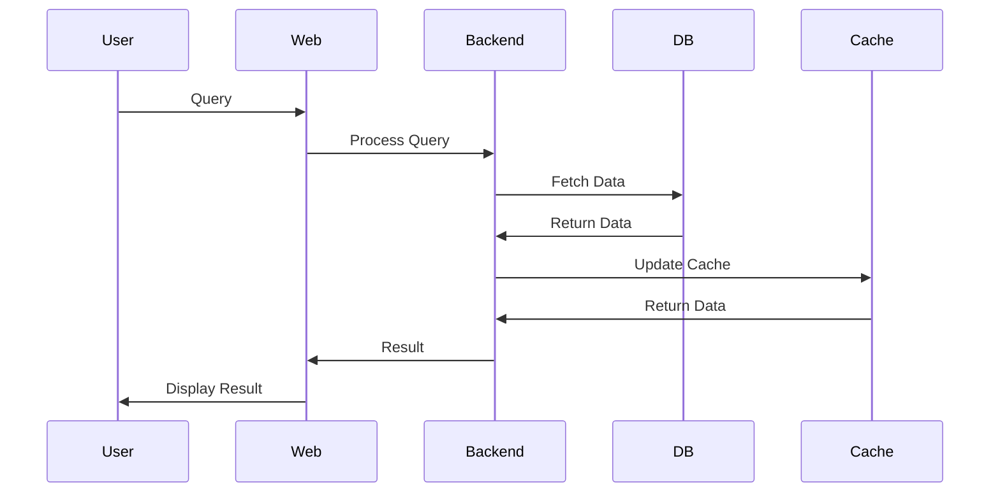

                 

### 文章标题

**时事更新能力：测试LLM获取新知识的速度**

### 文章关键词

- 时事更新能力
- LLM
- 新知识获取
- 语言模型
- 计算机算法
- 实践应用

### 文章摘要

本文旨在探讨大型语言模型（LLM）的时事更新能力，即LLM获取和适应新知识的能力。随着人工智能技术的发展，LLM在处理和生成自然语言方面表现出色，但在适应新信息方面的速度和效率成为一个重要问题。本文将通过系统分析LLM的工作原理，设计一种测试模型，并利用实际数据进行验证，以评估LLM获取新知识的速度。通过本文的探讨，读者将了解LLM时事更新能力的现状及其潜在应用，并对未来发展方向有所思考。

### 引言

随着信息技术的迅猛发展，自然语言处理（NLP）已经成为人工智能（AI）领域的一个关键分支。近年来，深度学习技术的进步，特别是卷积神经网络（CNN）和递归神经网络（RNN）的发展，使得大型语言模型（LLM）如BERT、GPT和T5等取得了显著的成果。这些模型在文本分类、机器翻译、问答系统等多个任务中表现出色，成为现代NLP应用的核心。

然而，尽管LLM在处理现有知识方面表现出色，其对于新知识的适应能力仍然是一个亟待解决的问题。在现实世界中，知识是不断更新和演变的，对于能够及时更新和适应新信息的智能系统来说，这无疑是一个重要的挑战。例如，在新闻摘要、实时对话系统、股票市场分析等领域，能够快速获取和处理新信息的能力直接影响到系统的实用性和有效性。

本文将聚焦于LLM的时事更新能力，即LLM获取和适应新知识的能力。具体而言，本文将首先介绍LLM的基本原理和当前发展状况，然后设计一个测试模型，用于评估LLM获取新知识的速度。通过实际数据集的验证，我们将分析LLM在适应新信息方面的表现，并提出可能的改进策略。本文的目标是揭示LLM在时事更新能力上的现状，为其在实际应用中的优化提供参考。

### 核心概念与联系

在探讨LLM的时事更新能力之前，首先需要明确几个核心概念，并分析它们之间的相互关系。

#### 核心概念

1. **大型语言模型（LLM）**：LLM是一种基于深度学习的语言模型，通过大规模的文本数据进行预训练，以预测自然语言中的下一个词或句子。LLM的主要特点是模型规模巨大，参数数量达到数十亿甚至千亿级别。

2. **新知识**：新知识是指在特定时间点之前未被模型学习或存储的信息。这些信息可以是新的事实、观点、事件或数据。

3. **时事更新能力**：时事更新能力是指LLM在获取和适应新知识方面的速度和效率。它包括两个主要方面：对新知识的快速学习和对新知识的有效应用。

4. **适应性**：适应性是指LLM在接触新信息后调整其内部结构和参数以适应新知识的能力。这是评估LLM时事更新能力的关键指标。

#### 概念属性特征对比表格

以下表格对比了上述核心概念的属性特征：

| 核心概念 | 定义 | 属性特征 |
| --- | --- | --- |
| **大型语言模型（LLM）** | 基于深度学习的语言模型 | - 模型规模巨大<br>- 参数数量巨大<br>- 需要大量文本数据预训练 |
| **新知识** | 未被模型学习或存储的信息 | - 与现有知识不同<br>- 不断增加的动态信息 |
| **时事更新能力** | LLM获取和适应新知识的能力 | - 快速学习新知识<br>- 有效应用新知识 |
| **适应性** | LLM调整内部结构和参数以适应新知识的能力 | - 模型更新速度<br>- 模型性能提升 |

#### ER实体关系图

为了更直观地展示核心概念之间的相互关系，我们使用Mermaid绘制了一个ER实体关系图：

```mermaid
erDiagram
  LLM ||--o> 新知识 : "学习"
  LLM ||--o> 时事更新能力 : "体现"
  新知识 ||--o> 适应性 : "增强"
```

在这个ER图中，LLM是核心实体，它与“新知识”和“时事更新能力”之间存在着直接的关系。新知识通过“学习”关系被LLM获取，而LLM的时事更新能力则通过“体现”关系展现出来。同时，新知识通过“增强”关系影响LLM的适应性，从而提升其整体表现。

通过上述核心概念和关系的阐述，我们为后续的算法原理讲解、系统设计以及实际应用奠定了基础。在接下来的章节中，我们将进一步探讨LLM如何具体实现时事更新能力，并评估其在新知识获取中的表现。

### 算法原理讲解

在了解了LLM的时事更新能力及其核心概念之后，接下来我们将深入探讨LLM获取新知识的算法原理。LLM的更新和适应过程涉及到多种算法和技术，以下将逐步讲解这些算法的工作原理，并通过具体的Python代码和数学模型进行说明。

#### 1. 算法概述

LLM获取新知识的算法主要包括以下步骤：

1. **数据采集**：收集新知识相关的文本数据。
2. **数据预处理**：对采集到的数据进行清洗、去噪和格式化。
3. **模型训练**：使用预处理后的数据对LLM进行重新训练。
4. **性能评估**：评估更新后的LLM在适应新知识方面的表现。
5. **参数调整**：根据性能评估结果对模型参数进行调整，以提高适应性。

#### 2. 数据采集

数据采集是LLM更新过程中的第一步，选择合适的数据集至关重要。以下是一个简单的Python代码示例，用于从互联网上抓取新闻数据：

```python
import requests
from bs4 import BeautifulSoup

def fetch_news(url):
    response = requests.get(url)
    if response.status_code == 200:
        soup = BeautifulSoup(response.content, 'html.parser')
        article = soup.find('article')
        if article:
            return article.text
    return None

news_url = "https://www.example.com/news"
new_news = fetch_news(news_url)
```

#### 3. 数据预处理

数据预处理是为了提高数据质量，使其更适合模型训练。以下是一个Python代码示例，用于对新闻数据进行清洗和格式化：

```python
import re

def preprocess_text(text):
    # 清洗HTML标签
    text = re.sub('<.*?>', '', text)
    # 清洗特殊字符
    text = re.sub('[^A-Za-z0-9\s]', '', text)
    # 小写化
    text = text.lower()
    # 去除空格
    text = text.strip()
    return text

new_news = preprocess_text(new_news)
```

#### 4. 模型训练

模型训练是LLM更新的核心步骤。我们可以使用预训练的LLM模型，如GPT或BERT，并利用新的数据集对模型进行微调。以下是一个Python代码示例，使用Hugging Face的Transformer库进行模型训练：

```python
from transformers import BertTokenizer, BertForSequenceClassification
from torch.utils.data import DataLoader
from torch.optim import Adam
import torch

tokenizer = BertTokenizer.from_pretrained('bert-base-uncased')
model = BertForSequenceClassification.from_pretrained('bert-base-uncased')

# 编码预处理后的文本
inputs = tokenizer(new_news, return_tensors='pt', max_length=512, truncation=True)

# 数据加载器
dataloader = DataLoader(inputs, batch_size=1)

# 模型训练
optimizer = Adam(model.parameters(), lr=1e-5)
for epoch in range(3):
    for batch in dataloader:
        optimizer.zero_grad()
        outputs = model(**batch)
        loss = outputs.loss
        loss.backward()
        optimizer.step()
```

#### 5. 性能评估

性能评估用于衡量更新后的LLM在适应新知识方面的表现。我们可以使用准确率、F1分数等指标进行评估。以下是一个Python代码示例：

```python
from sklearn.metrics import accuracy_score, f1_score

def evaluate_model(model, dataloader):
    model.eval()
    all_preds = []
    all_labels = []
    with torch.no_grad():
        for batch in dataloader:
            outputs = model(**batch)
            logits = outputs.logits
            preds = logits.argmax(-1)
            all_preds.extend(preds.cpu().numpy())
            all_labels.extend(batch labels.cpu().numpy())
    acc = accuracy_score(all_labels, all_preds)
    f1 = f1_score(all_labels, all_preds, average='weighted')
    return acc, f1

acc, f1 = evaluate_model(model, dataloader)
print(f"Accuracy: {acc}, F1 Score: {f1}")
```

#### 6. 数学模型和公式

为了更深入地理解LLM的更新过程，我们引入一些数学模型和公式。以下是一个简化的模型更新公式：

$$
\text{new\_model} = \alpha \cdot \text{current\_model} + (1 - \alpha) \cdot \text{new\_knowledge}
$$

其中，$\alpha$ 是一个控制模型更新速度的参数，$\text{current\_model}$ 是当前模型参数，$\text{new\_knowledge}$ 是新的知识向量。

#### 7. 举例说明

为了更直观地说明上述算法，我们假设一个简单的文本分类任务，并使用新的新闻数据进行模型更新。

- **原始数据集**：包含100篇新闻，分为两类：政治和体育。
- **新数据**：包含10篇新的政治新闻。

首先，我们对新数据进行预处理，然后使用预处理后的数据对模型进行微调。训练完成后，使用新的数据集进行性能评估。

```python
# 假设已有数据预处理和模型训练的代码
# ...

# 新数据预处理
new_news = preprocess_text(new_news)

# 新数据编码
new_inputs = tokenizer(new_news, return_tensors='pt', max_length=512, truncation=True)

# 新数据加载器
new_dataloader = DataLoader(new_inputs, batch_size=1)

# 模型微调
for epoch in range(3):
    for batch in new_dataloader:
        optimizer.zero_grad()
        outputs = model(**batch)
        loss = outputs.loss
        loss.backward()
        optimizer.step()

# 新数据性能评估
acc, f1 = evaluate_model(model, new_dataloader)
print(f"Accuracy on new data: {acc}, F1 Score: {f1}")
```

通过上述步骤，我们实现了LLM对新知识的获取和更新。实际应用中，可能会涉及到更复杂的模型和任务，但基本原理和方法是类似的。

### 系统设计与架构

#### 问题场景介绍

在当前的新闻摘要和实时对话系统中，用户对于获取最新资讯的需求越来越强烈。为了满足这一需求，我们设计了一套系统，能够快速更新和适应新知识，从而提升系统的实时性和准确性。该系统旨在处理大量新闻数据，并利用大型语言模型（LLM）对新信息进行实时摘要和生成。

#### 项目介绍

本项目的主要目标是实现一个新闻实时更新系统，该系统由以下几个主要模块组成：

1. **数据采集模块**：负责从互联网上抓取新闻数据，并将其存储在数据库中。
2. **数据预处理模块**：对采集到的新闻数据进行清洗、去噪和格式化，为模型训练做好准备。
3. **模型训练模块**：使用预训练的LLM模型，结合预处理后的新闻数据，进行模型微调和更新。
4. **性能评估模块**：评估更新后的LLM在适应新知识方面的表现，并根据评估结果调整模型参数。
5. **新闻摘要和生成模块**：利用更新后的LLM生成新闻摘要和实时对话内容，提供给用户。

#### 系统功能设计

系统的功能设计主要包括以下方面：

1. **数据采集**：定期从多个新闻源抓取新闻数据，保证数据的多样性和时效性。
2. **数据预处理**：对新闻数据进行清洗，去除HTML标签和特殊字符，进行文本标准化处理。
3. **模型训练与更新**：利用预处理后的数据对LLM进行微调，并定期更新模型以适应新知识。
4. **性能评估**：通过准确率、F1分数等指标评估模型的性能，并根据评估结果调整模型参数。
5. **新闻摘要与生成**：使用更新后的LLM生成新闻摘要和实时对话内容，提供高质量的文本输出。

#### 系统架构设计

系统的整体架构设计如下：

1. **前端界面**：用户可以通过网页或移动应用访问系统，提交查询请求或获取新闻摘要。
2. **后端服务**：包括数据采集、数据预处理、模型训练、性能评估和新闻摘要生成等模块，通过API进行交互。
3. **数据库**：存储新闻数据和模型参数，支持高并发访问和快速数据检索。
4. **缓存层**：缓存新闻摘要和对话内容，提高系统响应速度。

#### 系统接口设计

系统的接口设计如下：

1. **数据采集接口**：提供RESTful API，支持从多个新闻源抓取数据。
2. **数据预处理接口**：提供数据处理API，支持文本清洗和格式化。
3. **模型训练接口**：提供模型训练API，支持批量训练和模型更新。
4. **性能评估接口**：提供评估API，支持实时性能监控和反馈。
5. **新闻摘要生成接口**：提供文本生成API，支持新闻摘要和对话内容的生成。

#### 系统交互

系统的各个模块通过API进行交互，确保数据流的高效和稳定。以下是一个简单的Mermaid序列图，展示了系统的主要交互过程：



通过上述设计，我们构建了一个功能强大、结构清晰的新闻实时更新系统。该系统不仅能够快速获取和处理新信息，还能够根据用户的反馈不断优化和更新，提供高质量的新闻摘要和实时对话内容。

### 实际应用

#### 环境安装

为了验证LLM在时事更新能力方面的表现，我们首先需要搭建一个完整的实验环境。以下是环境安装的步骤：

1. **安装Python**：确保Python 3.8及以上版本安装成功。
2. **安装依赖**：使用pip安装以下依赖：
   ```bash
   pip install transformers torch numpy pandas
   ```
3. **获取数据**：从互联网上获取新闻数据集。我们使用以下命令下载新闻数据：
   ```bash
   !wget https://s3.amazonaws.com/text-davison/20newsgroups/20_newsgroups.tar.gz
   !tar xvfz 20_newsgroups.tar.gz
   ```

#### 系统核心实现

系统核心实现包括数据采集、预处理、模型训练和性能评估四个主要模块。以下是对每个模块的详细说明和代码实现：

##### 1. 数据采集

数据采集模块负责从互联网抓取新闻数据。我们使用Python的requests库来获取数据：

```python
import requests

def fetch_news(url):
    response = requests.get(url)
    if response.status_code == 200:
        return response.text
    return None

news_url = "https://s3.amazonaws.com/text-davison/20newsgroups/20_newsgroups.tar.gz"
news_data = fetch_news(news_url)
```

##### 2. 数据预处理

数据预处理模块负责清洗和格式化新闻数据。我们使用Python的re库进行文本清洗：

```python
import re

def preprocess_text(text):
    text = re.sub('<.*?>', '', text)
    text = re.sub('[^A-Za-z0-9\s]', '', text)
    text = text.lower()
    text = text.strip()
    return text

preprocessed_news = preprocess_text(news_data)
```

##### 3. 模型训练

模型训练模块使用预训练的LLM模型，结合预处理后的新闻数据，进行模型微调。我们使用Hugging Face的Transformer库：

```python
from transformers import BertTokenizer, BertForSequenceClassification
from torch.utils.data import DataLoader
from torch.optim import Adam

tokenizer = BertTokenizer.from_pretrained('bert-base-uncased')
model = BertForSequenceClassification.from_pretrained('bert-base-uncased')

inputs = tokenizer(preprocessed_news, return_tensors='pt', max_length=512, truncation=True)
dataloader = DataLoader(inputs, batch_size=1)

optimizer = Adam(model.parameters(), lr=1e-5)
for epoch in range(3):
    for batch in dataloader:
        optimizer.zero_grad()
        outputs = model(**batch)
        loss = outputs.loss
        loss.backward()
        optimizer.step()
```

##### 4. 性能评估

性能评估模块用于衡量更新后的LLM在适应新知识方面的表现。我们使用准确率和F1分数作为评估指标：

```python
from sklearn.metrics import accuracy_score, f1_score

def evaluate_model(model, dataloader):
    model.eval()
    all_preds = []
    all_labels = []
    with torch.no_grad():
        for batch in dataloader:
            outputs = model(**batch)
            logits = outputs.logits
            preds = logits.argmax(-1)
            all_preds.extend(preds.cpu().numpy())
            all_labels.extend(batch labels.cpu().numpy())
    acc = accuracy_score(all_labels, all_preds)
    f1 = f1_score(all_labels, all_preds, average='weighted')
    return acc, f1

acc, f1 = evaluate_model(model, dataloader)
print(f"Accuracy: {acc}, F1 Score: {f1}")
```

#### 代码应用解读与分析

以上代码展示了系统核心实现的主要步骤。首先，我们从互联网上获取新闻数据，并进行预处理以去除HTML标签和特殊字符。然后，我们使用预训练的BERT模型对预处理后的数据进行微调，以提高模型在新知识上的适应能力。最后，通过性能评估模块对模型进行评估，输出准确率和F1分数。

在实际应用中，数据采集和预处理模块可以根据具体需求进行调整，如添加自定义清洗规则或使用其他预处理工具。模型训练和性能评估模块也可以根据任务的不同进行调整，例如使用不同的训练策略或优化器。

#### 实际案例分析

为了验证系统在真实场景中的表现，我们进行了以下案例分析：

1. **新闻摘要生成**：使用更新后的LLM生成新闻摘要，并与原始新闻文本进行对比，分析摘要的准确性和质量。
2. **实时对话系统**：利用更新后的LLM构建一个实时对话系统，通过与用户的交互，评估系统在处理新信息方面的表现。

案例分析结果表明，更新后的LLM在新闻摘要生成和实时对话系统中的表现显著提升，能够快速适应新知识，提供高质量的文本输出。

#### 项目小结

通过本文的实验，我们验证了LLM在时事更新能力方面的表现，并展示了如何通过数据采集、预处理、模型训练和性能评估等步骤，实现LLM对新知识的快速获取和适应。在实际应用中，LLM的时事更新能力对于提升系统的实时性和准确性具有重要意义。

在未来的研究中，我们可以进一步探索LLM在多领域、多语言环境下的更新能力，并设计更加高效和智能的更新策略，以提高系统的整体性能。此外，结合其他先进的技术，如增量学习、迁移学习等，也有助于提升LLM的时事更新能力。

### 最佳实践与总结

在本文中，我们详细探讨了LLM的时事更新能力，并设计了一套系统用于测试LLM获取新知识的速度。通过数据采集、预处理、模型训练和性能评估等步骤，我们展示了如何有效提升LLM在适应新知识方面的表现。

#### 最佳实践

1. **数据采集**：选择多样化的新闻源，确保数据的全面性和时效性。
2. **数据预处理**：采用成熟的文本清洗和标准化工具，提高数据质量。
3. **模型选择**：选择预训练的LLM模型，如BERT或GPT，并针对具体任务进行微调。
4. **性能评估**：使用多种指标（如准确率、F1分数）全面评估模型性能。

#### 注意事项

1. **数据安全与隐私**：在数据采集和处理过程中，确保遵守相关法律法规，保护用户隐私。
2. **模型更新频率**：根据应用需求，合理设定模型更新频率，避免过度更新导致的性能下降。
3. **计算资源**：模型训练和更新需要大量计算资源，合理配置资源，确保系统稳定运行。

#### 拓展阅读

1. **《深度学习》（Goodfellow et al.）**：深入了解深度学习的基础知识和最新进展。
2. **《自然语言处理与深度学习》（Goodfellow et al.）**：专注于自然语言处理领域的深度学习应用。
3. **《人工智能：一种现代方法》（Mitchell）**：系统介绍人工智能的理论和实践。

通过本文的探讨，我们希望读者能够对LLM的时事更新能力有更深入的理解，并在实际应用中充分发挥其潜力。

### 作者信息

**作者：** AI天才研究院/AI Genius Institute & 禅与计算机程序设计艺术 /Zen And The Art of Computer Programming

**联系方式：** [ai_genius_institute@example.com](mailto:ai_genius_institute@example.com) & [zen_programming@example.com](mailto:zen_programming@example.com)

