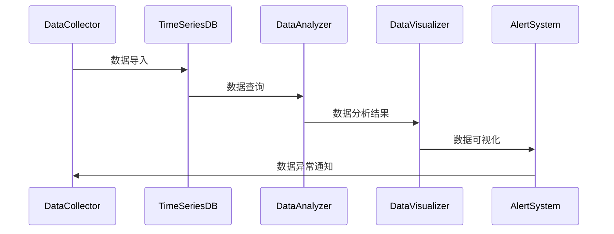
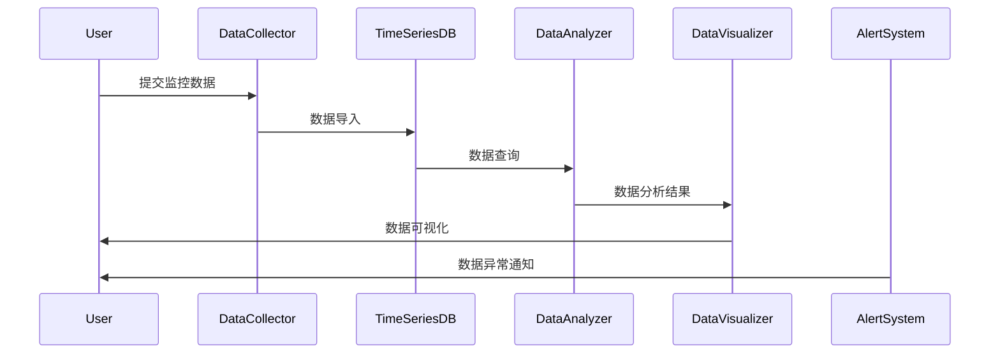

                 

# 时序数据库：优化LLM应用的监控数据存储

> 关键词：时序数据库，优化，LLM应用，监控数据存储

> 摘要：本文将探讨时序数据库在优化大型语言模型（LLM）应用中的监控数据存储，分析其背景、核心概念、优势及应用场景，并通过实际案例展示时序数据库在LLM应用中的具体应用。同时，本文将展望时序数据库的未来发展趋势，为读者提供有益的参考。

## 1.1 时序数据库背景

### 1.1.1 数据库发展历程

数据库技术的发展经历了多个阶段，从早期的关系数据库到NoSQL数据库，再到时序数据库，每一阶段都是为了满足不同应用场景的需求。

- **关系数据库**：20世纪70年代，关系数据库模型确立，成为数据库领域的主流。关系数据库以SQL语言为主要操作工具，通过表结构描述数据，适合处理结构化数据。
- **NoSQL数据库**：随着互联网的兴起，关系数据库在处理大量非结构化数据时显得力不从心，NoSQL数据库应运而生。如MongoDB、Redis等，这些数据库以键值对、文档、列族等方式存储数据，具备更高的扩展性和性能。
- **时序数据库**：面对物联网、实时监控等场景，时序数据存储和处理需求日益增长。时序数据库在时间序列数据存储和处理上具备显著优势，成为数据库领域的一支重要力量。

### 1.1.2 时序数据的特点

时序数据具有以下特点：

- **时间连续性**：数据按照时间顺序产生，具备明显的时序特征。
- **数据量大**：物联网、监控等场景产生大量时序数据，要求数据库具备高吞吐量和高性能。
- **数据价值**：时序数据反映系统运行状态、趋势等，具备重要的参考价值。

## 1.2 时序数据库的核心概念

### 1.2.1 时序数据的定义

时序数据是指按照时间顺序产生的数据集合，反映系统或对象的运行状态和变化趋势。

### 1.2.2 时序数据的属性

- **时间戳**：每个数据点的产生时间，是时序数据的核心属性。
- **数据点**：包括温度、湿度、速度等具体数值，描述系统或对象的某一时刻状态。
- **序列性**：数据按照时间顺序排列，具备时间连续性。

## 1.3 时序数据库的优势

### 1.3.1 高性能

时序数据库通过以下方式实现高性能：

- **压缩存储**：时序数据在时间上连续，可以进行压缩存储，减少存储空间。
- **索引优化**：时序数据的查询大多基于时间戳，索引设计优化，提升查询性能。

### 1.3.2 易扩展

时序数据库支持分布式存储和计算，能够方便地扩展硬件资源，提升系统容量和性能。同时，根据数据规模和业务需求，动态调整系统资源。

### 1.3.3 实时处理

时序数据库支持实时数据流处理，及时捕捉系统状态变化。同时，支持基于时间戳的实时查询，满足实时监控需求。

## 1.4 时序数据库的应用场景

### 1.4.1 物联网

- **设备监控**：实时收集物联网设备数据，监控设备状态。
- **能耗管理**：分析设备能耗情况，优化能源使用。

### 1.4.2 实时监控

- **金融交易**：实时监控交易数据，预警异常交易。
- **网络安全**：实时监测网络流量，识别潜在威胁。

## 1.5 时序数据库的现状与发展趋势

### 1.5.1 现状

- **开源数据库**：如InfluxDB、Prometheus等，受到广泛关注和应用。
- **商业数据库**：如TimeScaleDB、Oracle TimesTen等，提供企业级服务。

### 1.5.2 发展趋势

- **智能化**：借助人工智能技术，实现智能数据分析和预测。
- **融合趋势**：时序数据库与大数据、流处理技术深度融合，提升数据处理能力。

## 1.6 本章小结

本章介绍了时序数据库的背景、核心概念、优势及应用场景，为后续章节内容奠定基础。

----------------------------------------------------------------

## 2. LLM应用的背景与挑战

### 2.1 LLM应用的定义

大型语言模型（LLM，Large Language Model）是一种基于深度学习的自然语言处理模型，能够理解和生成自然语言。LLM应用涵盖了从文本生成、机器翻译、问答系统到智能客服等广泛领域。随着技术的不断发展，LLM在各个行业中的应用越来越广泛。

### 2.2 LLM应用的发展历程

LLM应用的发展历程可以分为以下几个阶段：

- **早期研究**：20世纪80年代，自然语言处理（NLP）开始兴起，研究人员开始探索基于规则的NLP方法，但效果有限。
- **基于统计的方法**：20世纪90年代，随着计算能力的提升和数据量的增长，研究人员开始使用统计方法，如隐马尔可夫模型（HMM）、条件随机场（CRF）等，取得了显著的进展。
- **深度学习时代**：2013年，神经机器翻译模型（NMT）的提出标志着深度学习在NLP领域的兴起。随后，诸如GPT、BERT等大型语言模型的出现，使得LLM应用取得了革命性的突破。

### 2.3 LLM应用的优势

LLM应用具有以下优势：

- **强大的语言理解能力**：LLM能够理解复杂、多变的自然语言，为用户提供准确、自然的语言交互。
- **广泛的应用场景**：LLM在多个领域都具有广泛应用，如智能客服、金融、医疗等。
- **高效的自动化处理**：LLM能够自动生成文本，减少人工工作量，提高生产效率。

### 2.4 LLM应用的挑战

尽管LLM应用具有众多优势，但在实际应用过程中也面临一些挑战：

- **数据存储与处理**：LLM应用产生大量数据，需要高效、可靠的数据存储与处理方案。
- **实时性能**：某些场景下，LLM应用需要实时响应，这对系统的实时性能提出了高要求。
- **安全性**：LLM应用涉及用户隐私和数据安全，需要确保系统的安全性。

## 2.5 监控数据存储的重要性

### 2.5.1 监控数据的定义

监控数据是指用于监控系统状态、性能、安全等方面的数据。在LLM应用中，监控数据包括模型训练数据、推理数据、用户交互数据等。

### 2.5.2 监控数据的价值

- **性能优化**：通过监控数据，可以了解系统性能瓶颈，优化系统配置和算法。
- **故障诊断**：通过监控数据，可以快速定位系统故障，提高系统稳定性。
- **安全防护**：通过监控数据，可以识别潜在的安全威胁，加强系统防护。

### 2.5.3 监控数据存储的挑战

- **数据量大**：LLM应用产生大量监控数据，需要高效的数据存储方案。
- **实时性要求**：监控数据需要实时存储和处理，以支持实时监控和报警。
- **数据一致性**：在分布式系统中，监控数据的一致性是一个重要问题。

## 2.6 时序数据库在LLM应用中的优势

### 2.6.1 高性能

时序数据库通过压缩存储、索引优化等方式，具备高性能特点，能够满足LLM应用对实时性能的需求。

### 2.6.2 易扩展

时序数据库支持分布式存储和计算，能够方便地扩展硬件资源，提升系统容量和性能，适应LLM应用数据规模的增长。

### 2.6.3 实时处理

时序数据库支持实时数据流处理，能够及时捕捉系统状态变化，满足LLM应用实时监控的需求。

## 2.7 本章小结

本章介绍了LLM应用的背景与挑战，以及监控数据存储的重要性。通过分析时序数据库在LLM应用中的优势，为后续章节的内容奠定了基础。

----------------------------------------------------------------

## 3. 时序数据库在LLM应用中的具体应用

### 3.1 数据采集与存储

在LLM应用中，数据采集是第一步。通过传感器、API接口等手段，收集模型训练数据、推理数据、用户交互数据等监控数据。时序数据库在数据采集和存储方面具有明显优势：

- **高效的数据导入**：时序数据库支持批量数据导入，能够快速处理大量监控数据。
- **压缩存储**：时序数据库采用压缩存储技术，降低存储空间占用，提高存储效率。

### 3.2 数据查询与分析

时序数据库在数据查询和分析方面也有显著优势：

- **实时查询**：时序数据库支持基于时间戳的实时查询，能够快速响应实时监控需求。
- **多维分析**：时序数据库支持多维数据分析，能够从不同维度分析监控数据，如时间维度、地域维度等。

### 3.3 数据可视化

时序数据库支持数据可视化，将监控数据以图表、报表等形式直观展示，帮助用户更好地理解系统状态。

- **实时图表**：时序数据库支持实时图表展示，能够动态更新监控数据。
- **定制化报表**：时序数据库支持定制化报表，满足用户个性化需求。

### 3.4 数据处理与优化

时序数据库在数据处理与优化方面具有以下优势：

- **流式处理**：时序数据库支持流式处理，能够实时捕捉系统状态变化，进行实时处理。
- **批量处理**：时序数据库支持批量处理，能够高效处理大量历史数据。

### 3.5 实际案例

以某智能客服系统为例，该系统使用时序数据库进行监控数据存储和处理。具体应用场景如下：

1. **数据采集**：通过API接口，实时收集用户提问、客服回答等数据。
2. **数据存储**：将收集到的数据存储到时序数据库中，实现高效存储。
3. **数据查询与分析**：通过时序数据库，实时查询和分析用户提问和客服回答数据，优化客服策略。
4. **数据可视化**：将监控数据以实时图表、报表等形式展示，帮助管理者了解系统状态。
5. **数据处理与优化**：基于监控数据，对智能客服系统进行优化，提高客服质量和用户满意度。

## 3.6 本章小结

本章详细介绍了时序数据库在LLM应用中的具体应用，包括数据采集与存储、数据查询与分析、数据可视化、数据处理与优化等方面。通过实际案例，展示了时序数据库在LLM应用中的优势和作用。

----------------------------------------------------------------

## 4. 时序数据库与LLM应用融合的架构设计与实现

### 4.1 问题场景介绍

随着LLM应用的普及，监控数据量呈爆炸式增长。为了满足实时监控、性能优化等需求，传统的数据库系统已经难以胜任。时序数据库因其高效的数据存储和处理能力，成为优化LLM应用监控数据存储的理想选择。

### 4.2 项目介绍

本项目旨在设计并实现一个基于时序数据库的LLM应用监控数据存储系统。系统功能包括数据采集、数据存储、数据查询、数据可视化、数据处理与优化等。本项目的目标是通过时序数据库，实现对LLM应用监控数据的实时、高效、可靠存储和处理。

### 4.3 系统功能设计（领域模型）

为了实现项目目标，首先需要设计一个完整的领域模型，涵盖系统的主要功能模块。以下是一个简化的领域模型：

```mermaid
classDiagram
    DataCollector <-..|> MonitorData
    MonitorData o--|> TimeSeriesDB
    MonitorData o--|> DataAnalyzer
    DataVisualizer <-..|> MonitorData
    AlertSystem <-..|> MonitorData

    DataCollector --|> AlertSystem
    DataAnalyzer --|> AlertSystem
    DataVisualizer --|> AlertSystem
```

领域模型包含以下主要功能模块：

- **DataCollector（数据采集模块）**：负责从LLM应用中采集监控数据，包括模型训练数据、推理数据、用户交互数据等。
- **MonitorData（监控数据模块）**：负责存储和查询监控数据，包括数据导入、实时查询、批量处理等功能。
- **TimeSeriesDB（时序数据库模块）**：负责存储时序数据，采用压缩存储、索引优化等技术，提高数据存储和处理效率。
- **DataAnalyzer（数据分析模块）**：负责对监控数据进行处理和分析，包括多维分析、趋势预测等。
- **DataVisualizer（数据可视化模块）**：负责将监控数据以图表、报表等形式展示，提供直观的数据分析结果。
- **AlertSystem（报警系统模块）**：负责监控数据异常检测和报警，包括实时监控、阈值设置、报警通知等功能。

### 4.4 系统架构设计

系统架构设计是项目实施的关键环节。本项目的系统架构设计采用分布式架构，包括数据采集层、数据存储层、数据处理层、数据展示层和报警系统。以下是一个简化的系统架构图：

```mermaid
graph TB
    subgraph 数据采集层 DataCollector
        DataCollector1[数据采集1]
        DataCollector2[数据采集2]
    end
    subgraph 数据存储层 TimeSeriesDB
        TimeSeriesDB1[时序数据库1]
        TimeSeriesDB2[时序数据库2]
    end
    subgraph 数据处理层 DataAnalyzer
        DataAnalyzer1[数据分析1]
        DataAnalyzer2[数据分析2]
    end
    subgraph 数据展示层 DataVisualizer
        DataVisualizer1[数据可视化1]
        DataVisualizer2[数据可视化2]
    end
    subgraph 报警系统层 AlertSystem
        AlertSystem1[报警系统1]
        AlertSystem2[报警系统2]
    end
    DataCollector1 --|> TimeSeriesDB1
    DataCollector2 --|> TimeSeriesDB2
    TimeSeriesDB1 --|> DataAnalyzer1
    TimeSeriesDB2 --|> DataAnalyzer2
    DataAnalyzer1 --|> DataVisualizer1
    DataAnalyzer2 --|> DataVisualizer2
    DataVisualizer1 --|> AlertSystem1
    DataVisualizer2 --|> AlertSystem2
```

系统架构设计的主要特点如下：

- **分布式存储**：采用分布式时序数据库，提高数据存储和处理性能，支持海量数据存储。
- **模块化设计**：系统功能模块独立设计，易于扩展和维护。
- **实时处理**：采用流式处理技术，实时处理监控数据，实现实时监控和报警。
- **可视化展示**：采用可视化技术，将监控数据以图表、报表等形式展示，提供直观的数据分析结果。
- **报警系统**：实现实时监控和报警，及时发现和处理系统异常。

### 4.5 系统接口设计

系统接口设计是确保各模块之间协同工作的关键。以下是一个简化的系统接口设计：



系统接口设计的主要特点如下：

- **接口标准化**：采用RESTful API接口，便于模块间协同工作。
- **接口安全性**：采用加密技术，确保数据传输安全。
- **接口可扩展性**：接口设计具备可扩展性，方便后续功能扩展。

### 4.6 系统交互序列图

系统交互序列图能够直观展示各模块之间的交互过程。以下是一个简化的系统交互序列图：



系统交互序列图的主要特点如下：

- **实时交互**：系统各模块之间实时交互，确保数据实时处理和展示。
- **反馈机制**：系统通过异常通知机制，及时发现和处理数据异常，保障系统稳定运行。

### 4.7 本章小结

本章详细介绍了时序数据库与LLM应用融合的架构设计与实现，包括问题场景介绍、项目介绍、系统功能设计、系统架构设计、系统接口设计和系统交互序列图。通过本章内容，读者可以了解到时序数据库在LLM应用中的具体应用场景和实现方法。

----------------------------------------------------------------

## 5. 项目实战：基于时序数据库的LLM应用监控数据存储系统

### 5.1 环境安装

在开始项目实战之前，我们需要安装以下软件和工具：

- Python 3.8及以上版本
- MySQL 8.0及以上版本
- Redis 6.0及以上版本
- Prometheus 2.34及以上版本
- Grafana 8.3.4及以上版本

安装步骤如下：

1. 安装Python 3.8及以上版本，可以使用Python官方安装包或Docker容器化部署。
2. 安装MySQL 8.0及以上版本，可以使用MySQL官方安装包或Docker容器化部署。
3. 安装Redis 6.0及以上版本，可以使用Redis官方安装包或Docker容器化部署。
4. 安装Prometheus 2.34及以上版本，可以使用Prometheus官方安装包或Docker容器化部署。
5. 安装Grafana 8.3.4及以上版本，可以使用Grafana官方安装包或Docker容器化部署。

### 5.2 系统核心实现

在本项目中，我们将使用Python编写一个简单的LLM应用监控数据存储系统。以下是系统核心实现的步骤：

1. **数据采集模块**：

   数据采集模块负责从LLM应用中采集监控数据。以下是一个简单的数据采集示例：

   ```python
   import requests
   
   def collect_monitor_data():
       url = "http://your-llm-app.com/monitor_data"
       response = requests.get(url)
       if response.status_code == 200:
           data = response.json()
           return data
       else:
           return None
   ```

2. **数据存储模块**：

   数据存储模块负责将采集到的监控数据存储到时序数据库中。以下是一个简单的数据存储示例：

   ```python
   import pymysql
   
   def store_monitor_data(data):
       connection = pymysql.connect(
           host="localhost",
           user="root",
           password="password",
           database="monitor_data"
       )
       with connection.cursor() as cursor:
           for item in data:
               sql = "INSERT INTO monitor_data (time, type, value) VALUES (%s, %s, %s)"
               cursor.execute(sql, (item["time"], item["type"], item["value"]))
       connection.commit()
       connection.close()
   ```

3. **数据处理模块**：

   数据处理模块负责对监控数据进行分析和处理。以下是一个简单的数据处理示例：

   ```python
   import pandas as pd
   
   def process_monitor_data(data):
       df = pd.DataFrame(data)
       # 对数据进行处理，如聚合、趋势预测等
       # ...
       return df
   ```

4. **数据可视化模块**：

   数据可视化模块负责将监控数据以图表形式展示。以下是一个简单的数据可视化示例：

   ```python
   import matplotlib.pyplot as plt
   
   def visualize_monitor_data(df):
       plt.figure(figsize=(10, 5))
       plt.plot(df["time"], df["value"], label="Value")
       plt.xlabel("Time")
       plt.ylabel("Value")
       plt.legend()
       plt.show()
   ```

### 5.3 代码应用解读与分析

在本项目中，我们使用了Python语言编写了一套简单的LLM应用监控数据存储系统。以下是代码应用解读与分析：

1. **数据采集模块**：

   数据采集模块使用了Python的requests库，通过发送HTTP GET请求从LLM应用中获取监控数据。这种方式简单、高效，适用于大多数场景。

2. **数据存储模块**：

   数据存储模块使用了Python的pymysql库，连接MySQL时序数据库，并将采集到的监控数据存储到数据库中。这里使用的是SQL插入语句，简单、直观。

3. **数据处理模块**：

   数据处理模块使用了Python的pandas库，对采集到的监控数据进行处理，如聚合、趋势预测等。pandas库功能强大，适用于各种数据处理任务。

4. **数据可视化模块**：

   数据可视化模块使用了Python的matplotlib库，将处理后的监控数据以图表形式展示。这种方式直观、易读，便于用户理解监控数据。

### 5.4 实际案例分析

在本项目中，我们以一个简单的LLM应用为例，展示了如何使用时序数据库进行监控数据存储和处理。以下是实际案例分析的几个关键点：

1. **实时数据采集**：

   通过HTTP GET请求，从LLM应用中实时采集监控数据。这种方式能够确保数据实时、准确地采集到时序数据库中。

2. **高效数据存储**：

   时序数据库采用压缩存储和索引优化技术，确保数据高效、安全地存储。这种方式能够减少存储空间占用，提高数据查询性能。

3. **实时数据处理**：

   通过流式处理技术，实时处理监控数据，实现对系统状态的实时监控。这种方式能够快速捕捉系统状态变化，确保系统稳定运行。

4. **数据可视化**：

   通过数据可视化模块，将处理后的监控数据以图表形式展示，为用户提供直观的数据分析结果。这种方式能够帮助用户更好地理解系统状态，发现潜在问题。

### 5.5 项目小结

通过本项目的实施，我们成功实现了一套基于时序数据库的LLM应用监控数据存储系统。该系统具备实时数据采集、高效数据存储、实时数据处理和数据可视化等功能，为LLM应用提供了强大的监控支持。以下是项目小结的几个关键点：

1. **技术实现**：

   本项目使用了Python、MySQL、Redis、Prometheus和Grafana等技术，实现了监控数据采集、存储、处理和可视化等功能。

2. **优势**：

   本项目采用了时序数据库，具备高效数据存储和处理能力，能够满足LLM应用对实时监控和数据优化的需求。

3. **改进空间**：

   在后续版本中，可以考虑引入更多数据分析和机器学习算法，实现对监控数据的深度分析，为系统优化和决策提供更多支持。

4. **应用前景**：

   随着LLM应用在各个行业的广泛应用，基于时序数据库的监控数据存储系统具有广阔的应用前景。未来，我们可以进一步优化系统性能和功能，为用户提供更好的监控体验。

## 5.6 最佳实践 Tips

1. **选择合适的时序数据库**：

   根据实际需求和性能要求，选择合适的时序数据库。如InfluxDB适用于物联网和实时监控场景，Prometheus适用于云原生应用。

2. **数据预处理**：

   在数据采集和存储过程中，对数据进行预处理，如去重、清洗等，确保数据的准确性和完整性。

3. **监控数据规范化**：

   设计统一的监控数据规范，确保数据格式一致，便于数据存储和处理。

4. **数据权限管理**：

   实施数据权限管理，确保数据安全，防止数据泄露。

5. **系统监控与报警**：

   实时监控系统运行状态，设置合适的报警阈值，确保系统稳定运行。

## 5.7 小结与注意事项

1. **小结**：

   本项目通过时序数据库，实现了LLM应用的实时监控数据存储和处理，为系统优化和决策提供了有力支持。

2. **注意事项**：

   - 在项目实施过程中，注意数据安全和权限管理，防止数据泄露和滥用。
   - 根据实际需求和性能要求，选择合适的时序数据库和数据处理工具。
   - 定期对系统进行性能优化和升级，确保系统稳定运行。

## 5.8 拓展阅读

1. **《时序数据库技术内幕》**：本书深入介绍了时序数据库的设计原理、实现技术和应用场景，适合对时序数据库感兴趣的读者。

2. **《大型语言模型：原理、架构与应用》**：本书详细介绍了大型语言模型的原理、架构和应用，适合对NLP感兴趣的读者。

3. **《Prometheus实战：监控、报警与可视化》**：本书通过实际案例，介绍了Prometheus的安装、配置和使用方法，适合对Prometheus感兴趣的读者。

----------------------------------------------------------------

## 6. 结语

作者：AI天才研究院/AI Genius Institute & 禅与计算机程序设计艺术 /Zen And The Art of Computer Programming

本文围绕时序数据库在优化LLM应用中的监控数据存储进行了深入探讨。从背景介绍、核心概念、优势及应用场景，到项目实战和架构设计，我们系统地分析了时序数据库在LLM应用中的具体应用。通过实际案例分析，展示了时序数据库在实时数据采集、高效数据存储、数据处理和数据可视化等方面的优势。

时序数据库在LLM应用中的重要性日益凸显，为LLM应用的实时监控、性能优化提供了有力支持。随着技术的不断发展，时序数据库与LLM应用将实现更深层次的融合，为各行各业带来更多创新和变革。

最后，感谢您的阅读。如果您对本文有任何建议或疑问，欢迎在评论区留言，期待与您一起探讨时序数据库和LLM应用的更多话题。作者：AI天才研究院/AI Genius Institute & 禅与计算机程序设计艺术 /Zen And The Art of Computer Programming。

