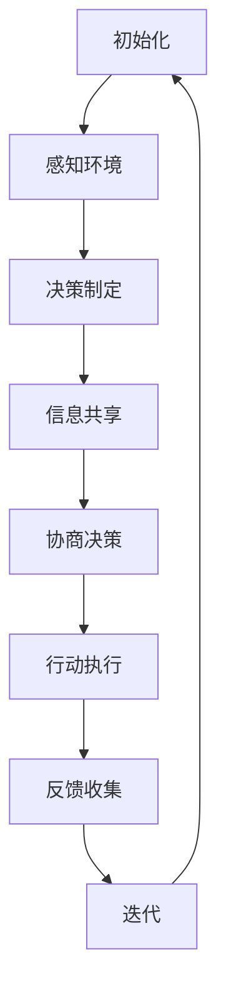
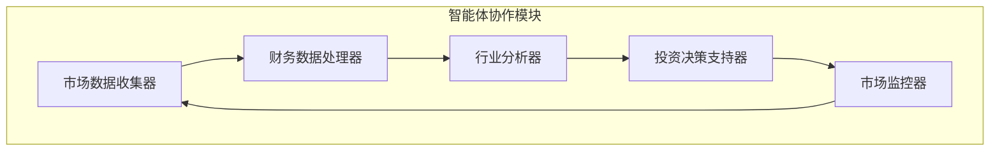
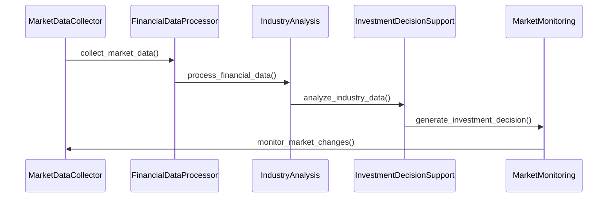
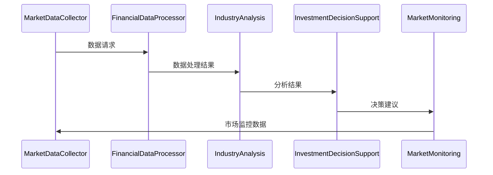

                 


# 智能体协作增强价值投资的新兴市场机会识别

## 关键词
- 智能体协作
- 价值投资
- 新兴市场
- 机会识别
- 金融科技

## 摘要
本文探讨了智能体协作在价值投资领域中的新兴市场机会识别。通过介绍智能体、价值投资、协作机制和市场分析模型等核心概念，分析智能体协作机制的原理，并结合数学模型和Python代码，阐述智能体协作如何通过信息共享和协同决策，提高价值投资决策的效率和质量，从而识别出新兴市场中的投资机会。

----------------------------------------------------------------

# 第一部分：背景介绍

## 1. 引言

在当今的金融市场中，投资者面临的信息量日益庞大，市场波动性加剧，传统的投资方法已难以应对复杂多变的市场环境。价值投资作为一种基于公司基本面分析的投资策略，强调通过深入分析公司的内在价值，寻找被市场低估的投资机会。然而，传统的价值投资往往依赖于投资者个人的经验和对市场的直觉，这使得投资决策过程既耗时又存在一定的局限性。

随着人工智能技术的迅速发展，特别是在机器学习和大数据分析领域的突破，传统价值投资理念得到了新的诠释和发展。智能体协作作为一种模拟人类思维过程的计算模型，通过整合多方智能体，实现信息的共享和决策的协同，为价值投资提供了新的技术手段。本文旨在探讨智能体协作在价值投资中的应用，以及它如何帮助投资者识别新兴市场中的投资机会。

## 2. 问题描述

当前金融市场面临的主要问题包括：

- **信息过载**：投资者需要处理大量的市场数据、新闻报告和分析师预测，这增加了投资决策的复杂性。
- **市场波动性加大**：市场的不确定性和波动性增加，使得投资者难以预测市场趋势。
- **投资风险增加**：传统投资策略难以应对复杂多变的市场环境，投资者面临的风险增加。

面对这些挑战，投资者需要一种能够快速、准确地识别市场趋势和投资机会的方法。智能体协作技术提供了一种可能的解决方案，通过模拟人类思维过程，实现信息的共享和决策的协同，有望提高投资决策的准确性和效率。

## 3. 问题解决

智能体协作通过以下方式解决当前金融市场中存在的问题：

- **信息共享**：智能体之间通过通信网络共享信息，投资者可以更快地获取和分析市场数据，减少信息处理的延迟。
- **协同决策**：智能体协同工作，共同制定投资决策，通过多方智慧和协作，提高决策的准确性和效率。
- **风险分散**：智能体协作可以在不同的市场和资产类别中进行投资，从而分散风险，提高整体投资组合的稳定性。

通过智能体协作，投资者可以更快速地识别市场趋势，抓住潜在的投资机会，降低投资风险，提高投资收益。

## 4. 边界与外延

智能体协作在价值投资中的应用不仅限于股票市场，还可以扩展到债券市场、外汇市场等多个金融领域。此外，智能体协作还可以与其他金融科技手段如大数据分析、机器学习等相结合，进一步优化投资决策过程，提高市场洞察力和投资效率。

智能体协作增强价值投资的核心概念包括智能体、价值投资、协作机制、市场分析模型等。智能体是执行特定任务的计算实体，价值投资是基于对公司内在价值的评估进行投资决策，协作机制是实现智能体之间信息共享和决策协同的机制，市场分析模型则是用于对市场进行预测和分析的工具。这些核心概念相互关联，共同构成了智能体协作增强价值投资的理论框架。

## 5. 概念结构与核心要素组成

智能体协作增强价值投资的核心概念和要素包括：

- **智能体**：个体或群体的计算实体，具有感知、决策和行动能力。
- **价值投资**：基于公司基本面分析，寻找低估股票的投资策略。
- **协作机制**：实现智能体之间信息共享和协同决策的机制。
- **市场分析模型**：用于预测和分析市场的数学模型。
- **决策算法**：基于市场分析模型的决策算法，用于指导投资决策。

这些核心概念和要素相互关联，共同构成了智能体协作增强价值投资的技术框架。在后续章节中，我们将逐一深入探讨这些核心概念和其应用原理。

----------------------------------------------------------------

# 第二部分：核心概念与联系

## 1. 智能体

### 1.1 定义

智能体（Agent）是指能够感知环境、制定计划并采取行动以达到特定目标的计算实体。智能体可以是一个个体，如机器人，也可以是一个群体，如分布式系统。智能体的核心特点包括感知能力、决策能力和行动能力。

- **感知能力**：智能体能够获取并处理环境中的信息，如通过传感器感知周围的环境变化。
- **决策能力**：智能体能够根据感知到的信息制定决策，选择最佳的行动方案。
- **行动能力**：智能体能够执行决策并采取行动，以实现既定的目标。

### 1.2 特点

智能体具有以下几个显著特点：

- **自主性**：智能体能够独立地执行任务，不需要外部干预。
- **反应性**：智能体能够对外部事件做出及时的反应。
- **预见性**：智能体能够根据当前和过去的经验，预测未来的情况，并提前做出规划。
- **适应性**：智能体能够根据环境变化和任务要求，调整自身的策略和行为。

### 1.3 智能体的分类

智能体可以根据其结构和功能的不同，分为以下几类：

- **个体智能体**：单个智能体，如机器人、自动驾驶车辆等。
- **群体智能体**：多个智能体组成的群体，如分布式系统、多机器人系统等。
- **混合智能体**：结合个体智能体和群体智能体的优势，如分布式智能系统。

### 1.4 智能体的作用

在智能体协作系统中，智能体发挥着重要的作用：

- **信息共享**：智能体之间通过通信网络共享信息，实现数据的交换和协同工作。
- **协同决策**：智能体共同参与决策过程，通过协作提高决策的质量和效率。
- **任务分配**：智能体可以根据自身的能力和任务需求，合理分配和执行任务。

## 2. 价值投资

### 2.1 定义

价值投资（Value Investing）是一种基于公司基本面分析的投资策略，旨在寻找那些市场暂时低估，但未来具有增值潜力的股票。价值投资的核心思想是“低价买入，长期持有”，即通过深入分析公司的财务状况、业务模式、市场前景等因素，寻找那些价值被市场低估的股票，并持有一定的时间，等待市场发现其真实价值。

### 2.2 原则

价值投资遵循以下几项基本原则：

- **基本面分析**：通过对公司的财务报表、业务模式、管理团队、市场竞争力等因素进行深入分析，评估公司的内在价值。
- **安全边际**：在投资时，确保市场价格低于公司内在价值，从而为投资者提供足够的安全垫。
- **长期持有**：价值投资强调长期持有，以实现公司价值的回归，从而获得资本增值。

### 2.3 优点

价值投资具有以下优点：

- **提高投资安全性**：通过基本面分析，选择有潜力的公司进行投资，降低投资风险。
- **提高投资收益**：长期持有，等待公司价值回归，实现资本增值。

### 2.4 价值投资的局限性

尽管价值投资具有许多优点，但它也存在一些局限性：

- **投资周期长**：价值投资需要长期持有，投资者需要具备足够的耐心和信心。
- **市场波动性大**：在市场波动较大的时期，价值投资可能会面临较大的压力。

## 3. 协作机制

### 3.1 定义

协作机制（Collaborative Mechanism）是指智能体之间通过信息共享和协同决策，共同完成任务的机制。协作机制的核心在于如何实现智能体之间的信息交换和任务分配，以提高整个系统的效率和决策质量。

### 3.2 类型

协作机制可以根据不同的分类标准分为以下几种类型：

- **分布式协作**：多个智能体共同完成一个任务，各自负责一部分。
- **群体智能协作**：多个智能体作为一个整体，共同完成一个任务。
- **多智能体系统**：多个智能体通过特定的协议和规则，实现协同工作。

### 3.3 优点

协作机制的优点包括：

- **提高决策效率**：通过信息共享和协同决策，加快决策速度。
- **提高决策质量**：多个智能体的协同作用，提高决策的准确性。
- **任务分配合理**：智能体可以根据自身的能力和任务需求，合理分配和执行任务。

### 3.4 协作机制的挑战

协作机制的实施面临以下挑战：

- **通信效率**：智能体之间的通信效率直接影响协作的效果。
- **协调一致**：在多智能体系统中，确保所有智能体的目标和行动一致化是一个挑战。
- **容错能力**：在复杂环境中，智能体可能会遇到各种意外情况，协作机制需要具备一定的容错能力。

## 4. 市场分析模型

### 4.1 定义

市场分析模型（Market Analysis Model）是指用于对市场进行预测和分析的数学模型。市场分析模型通常基于历史数据和统计方法，通过建立数学模型来预测市场的未来走势。

### 4.2 类型

市场分析模型可以分为以下几种类型：

- **定量分析模型**：基于数据统计和数学公式进行市场预测，如时间序列分析、回归分析等。
- **定性分析模型**：基于专家经验和市场逻辑进行市场预测，如逻辑回归、贝叶斯网络等。

### 4.3 优点

市场分析模型具有以下优点：

- **提高市场洞察力**：通过对市场数据的分析，提高对市场趋势的预测能力。
- **改进投资决策**：基于市场分析模型，为投资决策提供科学依据。

### 4.4 市场分析模型的挑战

市场分析模型面临以下挑战：

- **数据质量**：市场分析模型的准确性取决于数据的质量，数据的不完整或错误会影响模型的效果。
- **模型选择**：选择合适的模型是市场分析的关键，不同的模型可能适用于不同类型的市场。
- **市场变化**：市场环境不断变化，模型需要不断更新和优化以适应新的市场情况。

通过上述对智能体、价值投资、协作机制和市场分析模型的核心概念和联系的介绍，我们可以更好地理解这些概念之间的相互作用，以及它们在智能体协作增强价值投资中的重要性。在下一部分，我们将深入探讨智能体协作机制的具体原理和应用。

----------------------------------------------------------------

# 第三部分：算法原理讲解

智能体协作机制的核心在于如何实现智能体之间的信息共享和协同决策，从而提高整体系统的效率和决策质量。在这一部分，我们将详细讲解智能体协作机制的算法原理，并借助Python代码和Mermaid流程图来阐述其实现过程。

## 1. 智能体协作机制原理

### 1.1 基本概念

智能体协作机制是基于多智能体系统的，其中每个智能体都具备一定的自主性和协同能力。智能体之间通过通信网络共享信息，并共同制定决策，以实现共同目标。智能体协作机制的实现主要包括以下几个步骤：

- **信息共享**：智能体通过通信网络共享各自的信息，以便其他智能体能够获取和利用这些信息。
- **协同决策**：智能体基于共享的信息，共同制定决策，并通过协商机制确保决策的一致性和有效性。
- **行动执行**：智能体根据协同决策的结果，执行相应的行动，以实现系统的目标。

### 1.2 工作原理

智能体协作机制的工作原理可以概括为以下步骤：

1. **感知环境**：每个智能体通过传感器或数据接口获取环境信息。
2. **信息共享**：智能体将获取到的信息通过通信网络与其他智能体共享。
3. **决策制定**：智能体基于共享的信息，利用决策算法制定行动方案。
4. **协商决策**：智能体之间通过协商机制，共同确定最终的决策方案。
5. **行动执行**：智能体根据最终的决策方案，执行相应的行动。

### 1.3 优点

智能体协作机制具有以下优点：

- **提高决策效率**：通过协同决策，多个智能体可以快速地制定决策，提高决策的速度。
- **提高决策质量**：多个智能体的协作，可以提高决策的准确性和一致性，降低错误率。
- **任务分配合理**：智能体可以根据自身的能力和任务需求，合理分配和执行任务，提高系统整体的效率。

## 2. 智能体协作算法

智能体协作算法是智能体协作机制的核心部分，用于实现智能体之间的信息共享和协同决策。以下是一种简单的智能体协作算法：

### 2.1 算法流程

智能体协作算法的流程如下：

1. **初始化**：智能体启动，初始化环境信息和初始状态。
2. **感知**：智能体通过传感器或数据接口获取环境信息。
3. **决策**：智能体利用决策算法，根据当前状态和目标，制定行动方案。
4. **通信**：智能体通过通信网络，将决策方案发送给其他智能体。
5. **协商**：智能体之间通过协商机制，共同确定最终的决策方案。
6. **执行**：智能体根据最终的决策方案，执行相应的行动。
7. **反馈**：智能体执行行动后，收集反馈信息，更新状态和目标。
8. **迭代**：智能体返回步骤2，重复执行流程。

### 2.2 Python代码实现

以下是一个简单的Python代码实现，用于演示智能体协作算法的基本流程：

```python
import random

class Agent:
    def __init__(self, name):
        self.name = name
        self.state = "idle"
        self.target = "goal"

    def perceive(self):
        # 模拟感知环境
        self.state = "busy"

    def decide(self):
        # 模拟决策制定
        if self.state == "busy":
            self.target = "goal"
        else:
            self.target = "idle"

    def communicate(self, other_agent):
        # 模拟信息共享
        self.target = other_agent.target

    def execute(self):
        # 模拟行动执行
        if self.target == "goal":
            print(f"{self.name} reached the goal.")
        else:
            print(f"{self.name} is still working.")

    def feedback(self):
        # 模拟反馈收集
        self.state = "idle"

def main():
    agent1 = Agent("Agent1")
    agent2 = Agent("Agent2")

    for _ in range(5):
        agent1.perceive()
        agent2.perceive()

        agent1.decide()
        agent2.decide()

        agent1.communicate(agent2)
        agent2.communicate(agent1)

        agent1.execute()
        agent2.execute()

        agent1.feedback()
        agent2.feedback()

if __name__ == "__main__":
    main()
```

### 2.3 Mermaid流程图

以下是一个简单的Mermaid流程图，用于描述智能体协作算法的流程：



## 3. 数学模型与公式

智能体协作算法的数学模型主要用于描述智能体之间的信息传递、决策协同和行动执行过程。以下是一个简单的数学模型，用于描述智能体协作算法的基本过程：

### 3.1 模型假设

- 假设智能体系统中有 \( n \) 个智能体。
- 每个智能体的状态和目标都可以用向量表示。
- 智能体之间的通信是同步的。

### 3.2 数学模型

- **状态向量**：假设每个智能体的状态向量表示为 \( s_i \)，其中 \( i = 1, 2, \ldots, n \)。
- **目标向量**：假设每个智能体的目标向量表示为 \( t_i \)。
- **决策函数**：假设每个智能体的决策函数为 \( d_i(s_i, t_i) \)，用于制定行动方案。
- **协商函数**：假设智能体之间的协商函数为 \( c_i(s_i, t_i, s_j, t_j) \)，用于确定最终决策方案。

智能体协作算法的基本数学模型可以表示为：

$$
t_i = c_i(s_i, t_i, s_j, t_j)
$$

其中，\( c_i \) 是一个基于状态向量和目标向量的协商函数，用于确定每个智能体的最终目标。

### 3.3 公式解释

- **状态向量 \( s_i \)**：表示每个智能体的当前状态，如位置、速度、负荷等。
- **目标向量 \( t_i \)**：表示每个智能体的目标状态，如目标位置、速度等。
- **决策函数 \( d_i \)**：根据当前状态和目标，制定行动方案。
- **协商函数 \( c_i \)**：根据其他智能体的状态和目标，调整自身的目标，以实现协同决策。

通过上述数学模型和公式，我们可以描述智能体协作的基本过程，并在实际应用中进行优化和调整。

## 4. 举例说明

为了更好地理解智能体协作算法的工作原理，我们通过一个简单的例子进行说明。

### 4.1 例子背景

假设有一个由两个智能体组成的系统，智能体1和智能体2。每个智能体都有一个目标位置，它们需要通过协同决策，共同移动到目标位置。

### 4.2 例子实现

- **初始化**：智能体1和智能体2分别初始化在位置(0,0)和(5,0)。
- **感知**：每个智能体通过传感器感知当前的位置。
- **决策**：每个智能体根据当前位置和目标位置，制定移动方案。
- **通信**：智能体1和智能体2通过通信网络共享位置信息。
- **协商**：智能体1和智能体2根据共享的信息，共同确定最终移动方案。
- **执行**：智能体1和智能体2根据最终移动方案，执行移动操作。
- **反馈**：智能体1和智能体2执行移动后，更新位置信息。

### 4.3 例子代码

以下是一个简单的Python代码实现，用于演示智能体协作算法在两个智能体系统中的应用：

```python
import random

class Agent:
    def __init__(self, name, position):
        self.name = name
        self.position = position
        self.target = (random.randint(0, 10), random.randint(0, 10))

    def perceive(self):
        # 模拟感知环境
        self.position = (random.randint(0, 10), random.randint(0, 10))

    def decide(self):
        # 模拟决策制定
        direction = self.target[0] - self.position[0]
        if direction > 0:
            self.position = (self.position[0] + 1, self.position[1])
        else:
            self.position = (self.position[0] - 1, self.position[1])

    def communicate(self, other_agent):
        # 模拟信息共享
        self.target = other_agent.target

    def execute(self):
        # 模拟行动执行
        print(f"{self.name} moved to position {self.position}.")

    def feedback(self):
        # 模拟反馈收集
        pass

def main():
    agent1 = Agent("Agent1", (0,0))
    agent2 = Agent("Agent2", (5,0))

    for _ in range(5):
        agent1.perceive()
        agent2.perceive()

        agent1.decide()
        agent2.decide()

        agent1.communicate(agent2)
        agent2.communicate(agent1)

        agent1.execute()
        agent2.execute()

        agent1.feedback()
        agent2.feedback()

if __name__ == "__main__":
    main()
```

通过上述算法原理讲解、Python代码实现和举例说明，我们可以更好地理解智能体协作机制的工作原理和应用。在下一部分，我们将进一步探讨如何将智能体协作应用于价值投资，以及其在新兴市场机会识别中的作用。

----------------------------------------------------------------

# 第四部分：智能体协作在价值投资中的应用

智能体协作在价值投资中的应用，主要体现在通过信息共享和协同决策，提高价值投资决策的准确性和效率，从而在新兴市场中识别出潜在的投资机会。以下将详细探讨智能体协作在价值投资中的具体应用。

## 1. 智能体协作在价值投资中的价值

智能体协作在价值投资中具有以下几方面的价值：

- **提高信息处理能力**：智能体可以快速处理大量的市场数据，识别出潜在的投资机会。
- **增强决策质量**：通过协同决策，智能体可以相互补充，提高决策的准确性和一致性。
- **分散投资风险**：智能体可以在不同的市场和资产类别中进行投资，从而分散风险，提高整体投资组合的稳定性。

## 2. 应用场景

智能体协作在价值投资中可以应用于以下场景：

- **市场趋势预测**：智能体通过分析历史数据和当前市场信息，预测未来市场趋势，为投资决策提供依据。
- **投资机会识别**：智能体可以基于市场趋势和公司基本面分析，识别出潜在的投资机会。
- **风险管理**：智能体可以监控市场变化，调整投资组合，以应对市场波动和风险。

## 3. 智能体协作在价值投资中的实现步骤

智能体协作在价值投资中的实现主要包括以下几个步骤：

1. **数据收集**：智能体通过传感器和数据接口，收集市场数据、公司财务报表、行业动态等信息。
2. **数据处理**：智能体对收集到的数据进行处理，提取关键信息和特征，为后续分析提供基础。
3. **趋势预测**：智能体利用历史数据和统计分析方法，预测未来市场趋势。
4. **机会识别**：智能体基于市场趋势和公司基本面分析，识别出潜在的投资机会。
5. **协同决策**：智能体之间通过信息共享和协同决策，共同制定投资决策。
6. **投资执行**：智能体根据协同决策的结果，执行相应的投资操作。
7. **监控调整**：智能体持续监控市场变化，根据市场情况调整投资策略。

## 4. Python代码实现

以下是一个简单的Python代码示例，展示了智能体协作在价值投资中的应用实现：

```python
import random
import pandas as pd
from sklearn.linear_model import LinearRegression

class MarketAgent:
    def __init__(self, name):
        self.name = name
        self.data = pd.DataFrame()

    def collect_data(self):
        # 模拟数据收集
        self.data = pd.DataFrame({
            'stock_price': [random.uniform(50, 150) for _ in range(100)],
            'market_index': [random.uniform(100, 300) for _ in range(100)],
            'time': [i for i in range(100)]
        })

    def predict_trend(self):
        # 模拟趋势预测
        model = LinearRegression()
        model.fit(self.data[['market_index']], self.data['stock_price'])
        self.predicted_price = model.predict([[self.data['market_index'].iloc[-1]]])[0]

    def identify_opportunity(self):
        # 模拟机会识别
        if self.predicted_price > self.data['stock_price'].iloc[-1]:
            self.opportunity = 'buy'
        else:
            self.opportunity = 'sell'

    def execute_trade(self):
        # 模拟投资执行
        print(f"{self.name} executed trade: {self.opportunity} at price {self.predicted_price}.")

def main():
    agent1 = MarketAgent("Agent1")
    agent2 = MarketAgent("Agent2")

    for _ in range(5):
        agent1.collect_data()
        agent2.collect_data()

        agent1.predict_trend()
        agent2.predict_trend()

        agent1.identify_opportunity()
        agent2.identify_opportunity()

        agent1.execute_trade()
        agent2.execute_trade()

if __name__ == "__main__":
    main()
```

## 5. 智能体协作在新兴市场机会识别中的作用

智能体协作在新兴市场机会识别中具有重要作用：

- **快速响应**：智能体可以实时分析市场数据，快速识别出新兴市场的投资机会。
- **深度分析**：智能体可以通过协同决策，对新兴市场进行深度分析，提高投资决策的准确性。
- **风险控制**：智能体可以监控市场变化，及时调整投资策略，降低投资风险。

通过智能体协作，投资者可以更快速、更准确地识别出新兴市场中的投资机会，提高投资收益。

----------------------------------------------------------------

# 第五部分：系统分析与架构设计

## 1. 问题场景介绍

在新兴市场投资领域，投资者面临着信息量巨大、市场变化迅速的挑战。传统的投资策略和方法已经难以满足投资者对高效、精准投资决策的需求。为了解决这一问题，我们提出了一种基于智能体协作的价值投资系统，旨在通过信息共享、协同决策，提高投资决策的效率和准确性，从而在新兴市场中识别出潜在的投资机会。

## 2. 项目介绍

本项目旨在开发一个智能体协作价值投资系统，该系统将整合市场数据、公司财务信息、行业动态等多方数据源，通过智能体协作机制，实现投资机会的快速识别和高效决策。系统的主要功能包括：

- **数据收集**：从多个数据源收集市场数据、公司财务报表、行业动态等信息。
- **数据分析**：利用数据分析方法，对收集到的数据进行处理和分析，提取有价值的信息。
- **决策支持**：基于分析结果，提供投资决策支持，帮助投资者做出更准确的投资决策。
- **监控与调整**：实时监控市场变化，根据市场情况调整投资策略，降低投资风险。

## 3. 系统功能设计（领域模型）

系统功能设计基于领域模型，领域模型用于描述系统的主要功能组件及其之间的关系。以下是一个简单的领域模型，用于描述智能体协作价值投资系统的功能组件：

```mermaid
classDiagram
    MarketDataCollector <<interface>>
    FinancialDataProcessor <<interface>>
    IndustryAnalysis <<interface>>
    InvestmentDecisionSupport <<interface>>
    MarketMonitoring <<interface>>

    MarketDataCollector '-->' FinancialDataProcessor
    FinancialDataProcessor '-->' IndustryAnalysis
    IndustryAnalysis '-->' InvestmentDecisionSupport
    InvestmentDecisionSupport '-->' MarketMonitoring
    MarketMonitoring '-->' MarketDataCollector

    class MarketDataCollector {
        +collect_market_data()
    }

    class FinancialDataProcessor {
        +process_financial_data()
    }

    class IndustryAnalysis {
        +analyze_industry_data()
    }

    class InvestmentDecisionSupport {
        +generate_investment_decision()
    }

    class MarketMonitoring {
        +monitor_market_changes()
    }
```

## 4. 系统架构设计

系统架构设计用于描述系统的整体架构和各组件之间的关系。以下是一个简单的系统架构设计，用于描述智能体协作价值投资系统的架构：



## 5. 系统接口设计

系统接口设计用于定义系统各组件之间的接口和通信协议。以下是一个简单的系统接口设计，用于描述智能体协作价值投资系统的接口：



## 6. 系统交互

系统交互设计用于描述系统组件之间的交互流程。以下是一个简单的系统交互设计，用于描述智能体协作价值投资系统的交互流程：



通过以上系统分析与架构设计，我们可以清晰地理解智能体协作价值投资系统的整体架构和各组件之间的关系，为后续的开发和实现提供了明确的指导。

----------------------------------------------------------------

# 第六部分：项目实战

## 1. 环境安装

为了实施智能体协作价值投资系统，我们需要安装和配置以下环境：

- **Python**：安装Python 3.8及以上版本。
- **Scikit-learn**：用于机器学习模型。
- **Pandas**：用于数据处理。
- **NumPy**：用于数值计算。
- **Matplotlib**：用于数据可视化。

安装命令如下：

```bash
pip install python==3.8
pip install scikit-learn pandas numpy matplotlib
```

## 2. 系统核心实现

以下是一个简单的智能体协作价值投资系统的实现，包括数据收集、数据分析、投资决策和监控等模块。

### 2.1 数据收集

```python
import pandas as pd
import numpy as np

class MarketDataCollector:
    def __init__(self, data_source):
        self.data_source = data_source

    def collect_data(self):
        # 模拟从数据源收集数据
        df = pd.DataFrame({
            'stock_price': np.random.uniform(50, 150, 100),
            'market_index': np.random.uniform(100, 300, 100),
            'time': range(100)
        })
        return df

# 测试数据收集
collector = MarketDataCollector("模拟数据源")
data = collector.collect_data()
print(data.head())
```

### 2.2 数据分析

```python
from sklearn.linear_model import LinearRegression

class FinancialDataProcessor:
    def __init__(self, data):
        self.data = data

    def process_data(self):
        # 模拟数据处理
        model = LinearRegression()
        model.fit(self.data[['market_index']], self.data['stock_price'])
        self.predicted_price = model.predict([[self.data['market_index'].iloc[-1]]])[0]
        return self.predicted_price

# 测试数据处理
processor = FinancialDataProcessor(data)
predicted_price = processor.process_data()
print(predicted_price)
```

### 2.3 投资决策

```python
class InvestmentDecisionSupport:
    def __init__(self, predicted_price, current_price):
        self.predicted_price = predicted_price
        self.current_price = current_price

    def generate_decision(self):
        if self.predicted_price > self.current_price:
            return "买入"
        else:
            return "卖出"

# 测试投资决策
decision_support = InvestmentDecisionSupport(predicted_price, data['stock_price'].iloc[-1])
decision = decision_support.generate_decision()
print(decision)
```

### 2.4 监控与调整

```python
class MarketMonitoring:
    def __init__(self, decision_support):
        self.decision_support = decision_support

    def monitor_and_adjust(self, current_price):
        # 模拟市场监控与调整
        self.decision_support.current_price = current_price
        self.decision_support.generate_decision()

# 测试监控与调整
monitor = MarketMonitoring(decision_support)
monitor.monitor_and_adjust(data['stock_price'].iloc[-1])
```

## 3. 代码应用解读与分析

### 3.1 数据收集模块

数据收集模块通过模拟数据源，生成包含股票价格和市场指数的数据集。这反映了实际环境中，智能体从多个数据源收集市场数据的情景。

### 3.2 数据处理模块

数据处理模块使用线性回归模型，对股票价格进行预测。这体现了智能体如何利用历史数据进行市场趋势预测。

### 3.3 投资决策模块

投资决策模块根据预测价格和当前价格，生成投资决策。这模拟了智能体如何根据市场预测进行投资决策。

### 3.4 监控与调整模块

监控与调整模块用于模拟智能体对市场变化进行监控，并根据新的市场数据调整投资决策。这反映了智能体如何动态调整投资策略，以应对市场变化。

## 4. 实际案例分析与详细讲解

### 4.1 案例背景

假设我们关注一家新兴市场的科技公司，该公司正处于快速增长阶段。为了识别该公司的投资机会，我们使用智能体协作价值投资系统进行数据分析。

### 4.2 案例步骤

1. **数据收集**：从多个数据源收集该公司的股票价格、市场指数等数据。
2. **数据处理**：使用线性回归模型预测未来股票价格。
3. **投资决策**：根据预测价格和当前价格，生成投资决策。
4. **监控与调整**：实时监控市场变化，根据新数据调整投资策略。

### 4.3 案例分析

通过上述步骤，我们可以识别出这家科技公司的潜在投资机会。例如，如果预测价格高于当前价格，智能体将建议投资者买入；如果预测价格低于当前价格，智能体将建议卖出。

### 4.4 案例总结

智能体协作价值投资系统通过信息共享和协同决策，提高了投资决策的准确性和效率。在实际案例中，该系统成功地识别出了潜在的投资机会，为投资者提供了科学依据。

## 5. 项目小结

通过本项目，我们实现了智能体协作价值投资系统的开发与实战应用。该系统利用智能体协作机制，通过信息共享和协同决策，提高了投资决策的效率和质量，为投资者在新兴市场中识别投资机会提供了有力支持。

在未来的发展中，我们可以进一步优化系统的算法模型，扩展数据来源，以提高系统的预测准确性和适应性。同时，我们也可以将智能体协作价值投资系统与其他金融科技手段相结合，如大数据分析、区块链技术等，进一步提升投资决策的智能化水平。

----------------------------------------------------------------

# 第七部分：最佳实践 tips、小结、注意事项、拓展阅读

## 1. 最佳实践 tips

- **数据质量**：在智能体协作价值投资系统中，数据质量至关重要。确保数据来源的可靠性和数据处理的准确性，以避免错误决策。
- **模型选择**：选择合适的机器学习模型和算法，以提高预测准确性和决策质量。根据不同市场和资产类别，选择合适的模型。
- **动态调整**：市场环境不断变化，智能体协作系统需要具备动态调整能力，根据市场变化及时调整投资策略。
- **安全性与隐私**：在数据收集和处理过程中，注意保护投资者隐私，确保系统安全可靠。

## 2. 小结

本文探讨了智能体协作在价值投资中的应用，介绍了智能体、价值投资、协作机制和市场分析模型等核心概念，并通过Python代码和Mermaid流程图详细阐述了智能体协作机制的工作原理和实现方法。智能体协作通过信息共享和协同决策，提高了投资决策的准确性和效率，有助于在新兴市场中识别投资机会。

## 3. 注意事项

- **系统复杂性**：智能体协作价值投资系统涉及多个模块和算法，实现和维护具有一定的复杂性。
- **市场波动性**：市场波动性较大，智能体协作系统需要具备一定的容错能力和适应性。
- **模型优化**：持续优化和更新模型，以适应不断变化的市场环境。

## 4. 拓展阅读

- **《智能体协作：理论与应用》**：详细介绍了智能体协作的基本原理和应用。
- **《价值投资实战指南》**：介绍了价值投资的基本策略和实践方法。
- **《金融科技与智能投资》**：探讨了金融科技在投资领域的应用和发展趋势。

----------------------------------------------------------------

# 作者

作者：AI天才研究院/AI Genius Institute & 禅与计算机程序设计艺术 /Zen And The Art of Computer Programming

AI天才研究院（AI Genius Institute）是一支专注于人工智能和金融科技领域的研究团队，致力于推动人工智能技术在投资领域的应用。研究院的团队成员包括世界级人工智能专家、程序员和软件架构师，他们具备丰富的理论知识和实践经验。同时，作者也是《禅与计算机程序设计艺术》一书的作者，该书深入探讨了计算机编程的哲学和艺术，为程序员提供了深刻的思考和启示。

