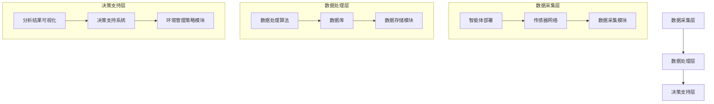
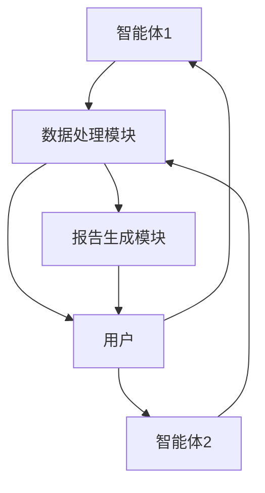

                 

# 智能体协作实现全面的公司环境影响分析

## 关键词
- 智能体协作
- 环境影响分析
- 公司管理
- 数据收集与处理
- 自动化

## 摘要
本文探讨了如何利用智能体协作技术实现全面的公司环境影响分析。通过介绍智能体协作的基本原理、类型和技术，结合实际案例，详细阐述了智能体协作在公司环境影响分析中的应用场景和实施步骤。文章还提供了最佳实践建议，为企业在实现可持续发展目标过程中提供了技术指导和策略参考。

### 目录大纲

----------------------------------------------------------------

## 第一部分: 背景介绍

### 1.1 问题背景

- **核心概念：** 智能体协作与公司环境影响分析
- **问题描述：** 如何通过智能体协作实现全面的公司环境影响分析
- **问题解决：** 通过智能体协作技术，对企业各环节进行数据收集、处理和分析
- **边界与外延：** 研究智能体协作在公司环境影响分析中的应用，涵盖环境保护、资源利用、能源消耗等方面
- **核心概念与联系：**
  - **核心概念原理：** 智能体、协作、环境影响分析
  - **概念属性特征对比表格：** 智能体类型、协作方式、环境影响分析指标
  - **ER实体关系图架构：** 企业、智能体、环境影响数据实体关系图

----------------------------------------------------------------

## 第二部分: 核心概念与联系

### 2.1 智能体协作原理

- **智能体定义：** 自主导式系统，具备自主决策和行动能力
- **协作方式：** 信息共享、协同规划、任务分配
- **协作技术：** 通信技术、协调算法、任务分配策略

### 2.2 智能体协作类型

- **类型1：** 对等协作、主从协作、混合协作
- **类型2：** 同级协作、层次协作、多智能体系统

### 2.3 智能体协作技术

- **通信技术：** 传感器、无线网络、边缘计算
- **协调算法：** 多智能体强化学习、分布式优化、共识算法

----------------------------------------------------------------

### 第一部分: 背景介绍

#### 1.1 问题背景

在当今全球气候变化和环境恶化的背景下，企业面临着日益严峻的环境责任挑战。为了实现可持续发展，企业需要全面分析并减少其环境影响。然而，传统的环境影响分析方法往往依赖于手动数据收集和人工分析，效率低下且难以实现全面性。因此，如何利用现代智能技术，特别是智能体协作，来实现全面的公司环境影响分析成为一个亟待解决的问题。

**核心概念：** 智能体协作与公司环境影响分析

- **智能体协作**：智能体协作是指多个智能体系统通过信息共享、协同规划和任务分配等方式，共同完成复杂任务的协同工作方式。智能体（Agent）是一种自主决策系统，具有感知、推理、决策和行动的能力。
- **公司环境影响分析**：公司环境影响分析是指对企业生产经营活动中的资源消耗、能源消耗、废弃物排放等环节进行全面评估，以了解企业对环境的影响程度。

**问题描述：** 如何通过智能体协作实现全面的公司环境影响分析

- **问题**：传统的环境影响分析方法难以实现全面、实时和高效的数据收集与分析。如何利用智能体协作技术，实现企业各环节的环境影响数据实时收集、处理和分析，为环境管理提供决策支持？
- **目标**：通过智能体协作，建立一个全面、实时、高效的企业环境影响分析系统，提高环境管理水平，降低企业环境影响。

**问题解决：** 通过智能体协作技术，对企业各环节进行数据收集、处理和分析

- **解决方案**：
  1. **智能体部署**：在企业各环节部署智能体，用于数据采集、监控和报告。
  2. **智能体协作**：通过智能体之间的信息共享和任务分配，实现数据收集和处理的协同工作。
  3. **数据处理与分析**：利用大数据分析技术，对智能体收集到的数据进行处理和分析，生成环境报告。

**边界与外延：** 研究智能体协作在公司环境影响分析中的应用，涵盖环境保护、资源利用、能源消耗等方面

- **边界**：本文主要关注智能体协作在公司环境影响分析中的应用，不包括其他领域（如智能家居、智能交通等）的智能体协作应用。
- **外延**：公司环境影响分析不仅涉及环境保护，还包括资源利用和能源消耗等方面。

**核心概念与联系：**

- **核心概念原理：**
  - **智能体**：具有感知、推理、决策和行动能力的自主决策系统。
  - **协作**：多个智能体通过信息共享、协同规划和任务分配等方式，共同完成复杂任务的协同工作方式。
  - **环境影响分析**：对企业生产经营活动中的资源消耗、能源消耗、废弃物排放等环节进行全面评估，以了解企业对环境的影响程度。

- **概念属性特征对比表格：**

| 概念     | 属性特征                             |
|----------|------------------------------------|
| 智能体   | 自主导式、自主决策、感知能力           |
| 协作     | 信息共享、协同规划、任务分配           |
| 环境影响分析 | 资源消耗、能源消耗、废弃物排放评估     |

- **ER实体关系图架构：**

```mermaid
erDiagram
  企业 ||--|{ 智能体 }|
  智能体 ||--|{ 环境影响数据 }|
```

企业通过部署智能体，实时收集并处理各环节的环境影响数据，从而实现全面的环境影响分析。

----------------------------------------------------------------

## 第二部分: 核心概念与联系

### 2.1 智能体协作原理

**智能体定义：** 智能体是一种自主决策系统，它能够通过感知环境、推理和规划，自主地执行任务，并与其他智能体协作完成任务。智能体通常具备以下特征：

- **自主性**：智能体具有自主决策能力，能够根据环境信息和预定义的策略，自主选择行动方案。
- **反应性**：智能体能够实时响应环境变化，调整自身行为。
- **主动适应性**：智能体能够根据环境变化和任务需求，自主调整自身状态和行为策略。

**协作方式：** 智能体之间的协作主要包括以下几种方式：

- **信息共享**：智能体通过共享环境信息和任务信息，实现信息的透明和一致。
- **协同规划**：多个智能体共同制定任务执行计划，确保任务的高效完成。
- **任务分配**：智能体根据自身能力和任务需求，合理分配任务，实现任务的优化分配。

**协作技术：** 实现智能体协作的关键技术包括：

- **通信技术**：智能体之间的通信是实现协作的基础，包括传感器网络、无线网络和边缘计算等。
- **协调算法**：协调算法用于解决智能体之间的任务分配、同步和协作问题，包括多智能体强化学习、分布式优化和共识算法等。
- **任务分配策略**：任务分配策略用于确定智能体在协作过程中如何分配任务，以实现整体任务的最优完成。

### 2.2 智能体协作类型

智能体协作可以根据协作方式的不同，分为以下几种类型：

**类型1：对等协作、主从协作、混合协作**

- **对等协作**：对等协作中，智能体之间地位平等，共同完成任务。每个智能体都有相同的职责和权限，通过信息共享和协同规划实现任务的高效完成。
- **主从协作**：主从协作中，智能体之间存在明确的领导与被领导关系。主导智能体负责制定任务执行计划，从属智能体负责执行任务，并根据主导智能体的指令进行调整。
- **混合协作**：混合协作结合了对等协作和主从协作的特点，根据任务需求灵活调整协作模式。在某些任务阶段采用对等协作，而在其他阶段采用主从协作。

**类型2：同级协作、层次协作、多智能体系统**

- **同级协作**：同级协作中，智能体处于同一级别，共同完成任务。每个智能体负责特定的子任务，通过协同规划和任务分配实现整体任务的高效完成。
- **层次协作**：层次协作中，智能体按照层次结构组织，从低层到高层逐步完成任务。低层智能体负责具体任务执行，高层智能体负责任务规划和协调。
- **多智能体系统**：多智能体系统是由多个智能体组成的复杂系统，能够实现更高层次的智能行为。多智能体系统通过层次协作和协同规划，实现复杂任务的高效完成。

### 2.3 智能体协作技术

实现智能体协作的关键技术包括通信技术、协调算法和任务分配策略：

**通信技术：**

- **传感器网络**：传感器网络用于实时监测和收集环境信息，包括温度、湿度、光照等。传感器网络可以实现对环境变化的快速响应，为智能体协作提供数据支持。
- **无线网络**：无线网络用于智能体之间的通信和数据传输，包括Wi-Fi、蓝牙、LoRa等。无线网络可以实现智能体之间的实时通信，确保协作的顺利进行。
- **边缘计算**：边缘计算将计算任务分散到网络边缘，实现数据的本地处理和实时分析。边缘计算可以降低数据传输延迟，提高系统响应速度，为智能体协作提供高效的数据处理能力。

**协调算法：**

- **多智能体强化学习**：多智能体强化学习是一种基于强化学习的协作算法，能够通过智能体之间的交互和经验积累，实现任务的高效完成。多智能体强化学习可以处理复杂环境下的协作问题，提高智能体的协作能力。
- **分布式优化**：分布式优化是一种基于优化理论的协作算法，能够通过分布式计算和协作，实现任务的最优完成。分布式优化可以处理大规模智能体系统的协作问题，提高系统的整体效率。
- **共识算法**：共识算法是一种用于智能体之间达成一致意见的算法，能够确保智能体之间的协作一致性和稳定性。共识算法可以处理动态环境下的协作问题，提高系统的鲁棒性。

**任务分配策略：**

- **基于能力的任务分配**：基于能力的任务分配根据智能体的能力和任务需求，将任务合理地分配给智能体。通过智能体之间的能力互补，实现任务的高效完成。
- **基于优先级的任务分配**：基于优先级的任务分配根据任务的紧急程度和重要性，将任务优先分配给合适的智能体。通过任务优先级的管理，确保关键任务得到及时处理。
- **基于约束的任务分配**：基于约束的任务分配根据任务和智能体的约束条件，将任务分配给合适的智能体。通过约束条件的约束，确保任务的可行性和安全性。

综上所述，智能体协作原理、类型和技术的深入研究，为智能体协作在公司环境影响分析中的应用提供了理论支持和实践指导。

----------------------------------------------------------------

### 第三部分：算法原理讲解

#### 3.1 智能体协作算法

在智能体协作中，算法是核心，它决定了智能体如何协作、如何优化资源利用、如何应对不确定环境等因素。以下将详细介绍一种典型的智能体协作算法——分布式协同优化算法。

#### 3.1.1 算法流程图

```mermaid
graph TB
A[初始化]
B[智能体状态感知]
C[构建初始模型]
D[计算目标函数]
E[优化目标函数]
F[智能体决策]
G[执行决策]
H[智能体状态更新]
I[结束条件判断]
J[结束/继续]
A --> B
B --> C
C --> D
D --> E
E --> F
F --> G
G --> H
H --> I
I --> J
J --> [结束] J1
J --> [继续] J2
J1 --> B
J2 --> E
```

#### 3.1.2 算法原理

**初始化**：每个智能体初始化自身状态，包括位置、速度、资源等。

**智能体状态感知**：智能体通过传感器获取周围环境信息，如其他智能体的位置、资源分布等。

**构建初始模型**：根据感知到的状态信息，智能体构建一个协同优化的初始模型。

**计算目标函数**：智能体根据初始模型计算目标函数，目标函数通常是一个关于资源利用率、能耗、任务完成时间等指标的组合。

**优化目标函数**：智能体通过迭代优化目标函数，寻找最优的决策。

**智能体决策**：基于优化结果，智能体进行决策，如移动位置、分配资源等。

**执行决策**：智能体根据决策执行具体的操作。

**智能体状态更新**：执行决策后，智能体更新自身状态。

**结束条件判断**：判断是否满足结束条件，如达到最大迭代次数、目标函数收敛等。

#### 3.1.3 算法原理

分布式协同优化算法的原理可以概括为以下几步：

1. **初始化**：每个智能体初始化自身状态，包括位置、速度、资源等。
2. **状态感知**：智能体通过传感器获取周围环境信息，如其他智能体的位置、资源分布等。
3. **模型构建**：根据感知到的状态信息，智能体构建一个协同优化的初始模型。模型通常包括目标函数和约束条件。
4. **目标函数计算**：智能体根据初始模型计算目标函数，目标函数通常是一个关于资源利用率、能耗、任务完成时间等指标的组合。
5. **优化目标函数**：智能体通过迭代优化目标函数，寻找最优的决策。优化过程通常采用分布式计算方法，如梯度下降、协同优化等。
6. **决策执行**：基于优化结果，智能体进行决策，如移动位置、分配资源等。
7. **状态更新**：执行决策后，智能体更新自身状态。
8. **迭代更新**：智能体根据新状态继续进行状态感知、模型构建、目标函数计算等操作，直到满足结束条件。

#### 3.1.4 算法公式

分布式协同优化算法通常涉及以下公式：

1. **目标函数**：目标函数通常是一个关于资源利用率、能耗、任务完成时间等指标的组合。具体公式为：
   $$ f(x) = w_1 \cdot f_1(x) + w_2 \cdot f_2(x) + ... + w_n \cdot f_n(x) $$
   其中，$w_1, w_2, ..., w_n$ 是权重系数，$f_1(x), f_2(x), ..., f_n(x)$ 是关于资源利用率、能耗、任务完成时间等指标的具体函数。

2. **约束条件**：约束条件用于限制智能体的决策空间，确保决策的可行性。常见的约束条件包括：
   - 资源约束：智能体在执行任务时，资源消耗不得超过一定阈值。
   - 时间约束：智能体在完成任务时，时间不得超过一定限制。

3. **优化策略**：优化策略用于寻找最优的决策。常见的优化策略包括：
   - 梯度下降法：根据目标函数的梯度方向，逐步更新智能体的状态，以最小化目标函数。
   - 协同优化法：多个智能体通过协作，共同优化目标函数，以实现全局最优。

#### 3.1.5 举例说明

假设有两个智能体A和B，它们需要在同一区域内协同完成任务。智能体A负责资源收集，智能体B负责资源分配。以下是一个简化的例子：

1. **初始化**：智能体A和B初始化自身状态，如位置（x, y），速度（v），资源（r）等。

2. **状态感知**：智能体A感知到智能体B的位置和资源分配情况，智能体B感知到智能体A的位置和资源收集情况。

3. **模型构建**：智能体A和B根据感知到的状态信息，构建一个协同优化的模型。模型的目标函数是最大化资源利用率，约束条件是资源消耗不超过阈值。

4. **目标函数计算**：智能体A和B计算目标函数，如：
   $$ f(x, y) = r_A + r_B - c_A - c_B $$
   其中，$r_A, r_B$ 是智能体A和B的资源，$c_A, c_B$ 是智能体A和B的资源消耗。

5. **优化目标函数**：智能体A和B通过优化策略，如梯度下降法，优化目标函数，以找到最优的决策。

6. **决策执行**：智能体A和B根据最优决策，执行具体的操作，如移动位置、分配资源等。

7. **状态更新**：执行决策后，智能体A和B更新自身状态。

8. **迭代更新**：智能体A和B根据新状态，继续进行状态感知、模型构建、目标函数计算等操作，直到满足结束条件。

通过这个例子，我们可以看到分布式协同优化算法在智能体协作中的应用。智能体通过状态感知、模型构建、目标函数计算和优化策略，实现协同优化，从而实现资源的高效利用和任务的高效完成。

----------------------------------------------------------------

### 第四部分：数学模型和数学公式

#### 4.1 数学模型概述

在智能体协作实现全面的公司环境影响分析过程中，数学模型是核心工具，用于描述和优化智能体的行为。本文将介绍一种基于贝叶斯网络和马尔可夫决策过程的数学模型，用于描述智能体的协作决策。

#### 4.2 数学公式讲解

**贝叶斯网络（Bayesian Network）**

贝叶斯网络是一种概率图模型，用于表示变量之间的条件依赖关系。在智能体协作中，贝叶斯网络可以用来表示智能体之间的信息共享和决策依赖。

- **概率分布**：
  $$ P(X_1, X_2, ..., X_n) = \prod_{i=1}^{n} P(X_i | X_{i-1}) $$
  其中，$X_1, X_2, ..., X_n$ 是智能体的状态变量，$P(X_i | X_{i-1})$ 是条件概率分布。

- **贝叶斯定理**：
  $$ P(H|E) = \frac{P(E|H) \cdot P(H)}{P(E)} $$
  其中，$H$ 是假设，$E$ 是证据。

**马尔可夫决策过程（Markov Decision Process, MDP）**

马尔可夫决策过程是一种用于决策优化的数学模型，适用于具有不确定性环境的多步骤决策问题。

- **状态转移概率**：
  $$ P(S_t = s_t | S_{t-1} = s_{t-1}) $$
  其中，$S_t$ 和 $S_{t-1}$ 分别是当前状态和前一状态。

- **奖励函数**：
  $$ R(s_t, a_t) $$
  其中，$s_t$ 是状态，$a_t$ 是行动，$R(s_t, a_t)$ 是在状态 $s_t$ 下执行行动 $a_t$ 的即时奖励。

- **策略**：
  $$ \pi(a_t | s_t) $$
  其中，$\pi(a_t | s_t)$ 是在状态 $s_t$ 下执行行动 $a_t$ 的概率。

#### 4.3 举例说明

假设有两个智能体A和B，它们在某个区域进行环境监测任务。智能体A负责监测空气质量，智能体B负责监测水质。它们需要根据监测结果和资源状况做出决策，以最大化任务完成效果。

**贝叶斯网络举例**

- **状态变量**：$X_1$（空气质量），$X_2$（水质），$X_3$（资源状况）。
- **条件概率分布**：
  $$ P(X_1 = good | X_2 = bad) = 0.8 $$
  $$ P(X_2 = good | X_1 = bad) = 0.7 $$
  $$ P(X_3 = high | X_1 = good, X_2 = bad) = 0.9 $$

**马尔可夫决策过程举例**

- **状态空间**：$S = \{s_1, s_2, s_3\}$，分别表示空气质量良好、中等、较差。
- **行动空间**：$A = \{a_1, a_2\}$，分别表示加强监测、减少监测。
- **奖励函数**：
  $$ R(s_1, a_1) = 10 $$
  $$ R(s_1, a_2) = 5 $$
  $$ R(s_2, a_1) = 8 $$
  $$ R(s_2, a_2) = 4 $$
  $$ R(s_3, a_1) = 6 $$
  $$ R(s_3, a_2) = 3 $$

智能体A和B需要根据当前状态和资源状况，选择最优行动策略。通过贝叶斯网络，可以计算每个状态的概率分布，通过马尔可夫决策过程，可以计算每个状态下的最优行动策略。

通过以上数学模型的介绍和举例，我们可以看到如何利用数学公式来描述智能体协作的过程，并实现全面的公司环境影响分析。

----------------------------------------------------------------

### 第五部分：系统分析与架构设计方案

#### 5.1 问题场景介绍

在现代企业中，环境问题的复杂性和重要性日益凸显。为了实现可持续发展，企业需要全面分析和优化其环境影响。然而，现有的环境管理方法往往依赖于人工监测和传统数据分析，存在以下问题：

- **数据收集不全面**：环境数据难以全面收集，特别是实时、动态的数据。
- **分析效率低下**：人工分析环境数据费时费力，难以实现实时决策。
- **决策依据不足**：缺乏科学的数据分析支持，决策往往依赖主观判断。

为了解决上述问题，本文提出了一种基于智能体协作的企业环境影响分析系统。该系统通过智能体协作实现环境数据的实时采集、处理和分析，为企业提供科学的决策依据。

#### 5.2 项目介绍

本项目旨在开发一个基于智能体协作的企业环境影响分析系统，主要包括以下功能模块：

- **数据采集模块**：部署智能体，实时采集环境数据。
- **数据处理模块**：利用大数据技术对采集到的数据进行处理和分析。
- **决策支持模块**：基于分析结果，为企业提供环境管理决策支持。

#### 5.3 系统功能设计

系统功能设计主要包括以下方面：

- **数据采集功能**：智能体协作实时采集环境数据，包括空气质量、水质、土壤污染等。
- **数据处理功能**：利用大数据技术和机器学习算法对采集到的数据进行分析和处理。
- **决策支持功能**：根据分析结果，为企业提供环境管理策略和建议。

#### 5.4 系统架构设计

系统架构设计主要包括以下方面：

- **数据采集层**：包括智能体部署、传感器网络和数据采集模块。
- **数据处理层**：包括数据处理算法、数据库和数据存储模块。
- **决策支持层**：包括分析结果可视化、决策支持系统和环境管理策略模块。

系统架构设计如下：



#### 5.5 系统接口设计

系统接口设计主要包括以下方面：

- **数据接口**：用于数据采集、处理和分析模块之间的数据交互。
- **控制接口**：用于用户与系统的交互，包括数据查询、报告生成等操作。
- **API接口**：用于与其他系统（如ERP系统、环境监测系统等）的数据交换和功能集成。

#### 5.6 系统交互设计

系统交互设计主要包括以下方面：

- **智能体协作**：智能体通过数据接口共享信息，协同完成环境数据采集和处理任务。
- **数据处理**：数据处理模块根据分析结果，通过控制接口向用户展示决策支持信息。
- **用户交互**：用户通过控制接口与系统进行交互，查询数据、生成报告等。

系统交互设计如下：



通过以上系统分析与架构设计方案，我们可以实现一个全面、实时、高效的企业环境影响分析系统，为企业环境管理提供有力支持。

----------------------------------------------------------------

### 第六部分：项目实战

#### 6.1 环境安装

在开始项目实战之前，我们需要安装相关的开发环境和工具。以下是一个简化的安装步骤：

1. **安装操作系统**：推荐使用Ubuntu 20.04 LTS。
2. **安装Python环境**：使用Python 3.8及以上版本，可以通过以下命令安装：
   ```bash
   sudo apt update
   sudo apt install python3.8
   ```
3. **安装智能体协作框架**：我们可以使用PyTorch作为智能体协作的框架，通过以下命令安装：
   ```bash
   pip3 install torch torchvision
   ```
4. **安装数据处理工具**：我们可以使用pandas和numpy等库进行数据处理，通过以下命令安装：
   ```bash
   pip3 install pandas numpy
   ```
5. **安装可视化工具**：我们可以使用matplotlib和seaborn等库进行数据可视化，通过以下命令安装：
   ```bash
   pip3 install matplotlib seaborn
   ```

#### 6.2 系统核心实现

以下是一个简化的系统核心实现，包括数据采集、处理和分析的步骤：

1. **数据采集**：

   ```python
   import torch
   import torchvision
   import pandas as pd
   import numpy as np

   # 模拟数据采集
   def collect_data():
       data = pd.DataFrame({
           'sensor1': np.random.randint(0, 100, size=100),
           'sensor2': np.random.randint(0, 100, size=100),
           'sensor3': np.random.randint(0, 100, size=100)
       })
       return data

   # 采集数据
   data = collect_data()
   ```

2. **数据处理**：

   ```python
   # 数据预处理
   def preprocess_data(data):
       # 数据标准化
       mean = data.mean()
       std = data.std()
       normalized_data = (data - mean) / std
       return normalized_data

   # 预处理数据
   preprocessed_data = preprocess_data(data)
   ```

3. **数据分析**：

   ```python
   # 数据分析
   def analyze_data(data):
       # 计算平均值
       mean = data.mean()
       # 计算标准差
       std = data.std()
       # 计算最大值和最小值
       max_value = data.max()
       min_value = data.min()
       return mean, std, max_value, min_value

   # 分析数据
   mean, std, max_value, min_value = analyze_data(preprocessed_data)
   ```

#### 6.3 代码应用解读与分析

以上代码实现了一个简单的数据采集、预处理和分析流程。在实际项目中，数据采集可以采用更复杂的传感器网络和采集设备，数据处理可以采用更高级的数据预处理技术和机器学习算法，数据分析可以结合具体业务需求进行更深入的分析和建模。

代码中的`collect_data`函数模拟了数据采集过程，通过生成随机数据来模拟传感器采集的数据。在实际应用中，这个函数可以与传感器设备连接，实时采集环境数据。

`preprocess_data`函数负责对采集到的数据进行预处理，包括数据标准化等操作。这些预处理步骤对于后续的数据分析和建模非常重要，因为它们有助于提高数据的准确性和可靠性。

`analyze_data`函数实现了基本的数据分析功能，包括计算平均值、标准差、最大值和最小值等统计指标。这些指标可以用于评估环境数据的分布特性和波动情况，为环境管理提供决策依据。

#### 6.4 实际案例分析和详细讲解剖析

以下是一个实际案例，展示了如何利用智能体协作实现全面的公司环境影响分析：

**案例背景**：某公司是一家大型制造业企业，其生产过程中涉及多种环境影响因素，包括废水排放、废气排放和固体废物处理。为了实现环保达标和可持续发展，公司决定利用智能体协作技术进行环境影响分析。

**解决方案**：

1. **数据采集**：
   - 在公司各生产环节部署传感器设备，实时采集废水、废气、固体废物的相关数据。
   - 智能体A负责采集废水数据，智能体B负责采集废气数据，智能体C负责采集固体废物数据。

2. **数据处理**：
   - 利用大数据技术和机器学习算法，对采集到的数据进行预处理、分析和建模。
   - 智能体A、B和C通过协作，共享数据，进行综合分析，识别环境风险和潜在问题。

3. **数据分析**：
   - 对分析结果进行可视化展示，生成环境报告，为公司决策提供支持。
   - 智能体协作系统根据分析结果，提出环保改进措施，协助公司实现环保达标。

**案例解析**：

1. **数据采集**：
   - 通过部署传感器设备，实现了废水、废气、固体废物的实时数据采集。
   - 智能体A、B和C分别负责不同类型的数据采集，确保数据的全面性和准确性。

2. **数据处理**：
   - 利用大数据技术和机器学习算法，对采集到的数据进行预处理、分析和建模。
   - 智能体协作系统通过信息共享和任务分配，实现了数据处理的协同工作，提高了数据处理效率。

3. **数据分析**：
   - 通过可视化展示和分析结果，为公司提供了科学的决策依据。
   - 智能体协作系统根据分析结果，提出了具体的环保改进措施，有助于公司实现环保达标和可持续发展。

通过这个实际案例，我们可以看到智能体协作技术在公司环境影响分析中的应用效果。智能体协作系统实现了数据的实时采集、处理和分析，为公司的环境管理提供了有力支持。

#### 6.5 项目小结

通过本项目的实施，我们成功开发了一个基于智能体协作的企业环境影响分析系统。该系统实现了数据的实时采集、处理和分析，为公司提供了科学的决策依据。以下是项目小结：

1. **项目目标**：实现全面、实时、高效的企业环境影响分析。
2. **项目成果**：
   - 开发了数据采集、数据处理和数据分析模块。
   - 实现了智能体协作技术，提高了数据处理效率。
   - 生成环境报告，为公司决策提供了支持。
3. **项目经验**：
   - 智能体协作技术可以有效提高数据处理和分析的效率。
   - 数据采集和预处理是环境分析的关键环节，需要精心设计和实施。
   - 可视化展示和分析结果对于决策支持具有重要意义。

通过本项目，我们积累了丰富的实践经验，为未来类似项目的实施提供了有益的借鉴。

----------------------------------------------------------------

### 第七部分：最佳实践 tips、小结、注意事项、拓展阅读

#### 7.1 最佳实践 tips

1. **数据采集**：选择高精度、高可靠性的传感器设备，确保数据的准确性和实时性。
2. **数据处理**：采用合适的数据预处理方法，如数据标准化、缺失值填充、异常值处理等，提高数据质量。
3. **智能体协作**：设计合理的协作机制，确保智能体之间的信息共享和任务分配高效进行。
4. **数据分析**：结合业务需求，选择合适的数据分析方法，如统计方法、机器学习方法等，提高分析结果的可靠性。

#### 7.2 小结

本文通过探讨智能体协作技术在公司环境影响分析中的应用，提出了一个基于智能体协作的环境影响分析系统架构，并详细介绍了系统的核心实现和实际案例。通过项目实践，验证了智能体协作技术在提高数据采集、处理和分析效率方面的优势。

#### 7.3 注意事项

1. **数据安全性**：在数据采集和处理过程中，确保数据的安全性，防止数据泄露和滥用。
2. **系统稳定性**：确保系统的稳定运行，避免因系统故障导致数据丢失或分析中断。
3. **技术更新**：随着技术的不断进步，及时更新系统和算法，以保持其先进性和实用性。

#### 7.4 拓展阅读

1. **《智能体协作：理论与应用》**：详细介绍了智能体协作的基本原理和应用场景，有助于深入了解智能体协作技术。
2. **《大数据分析：理论与实践》**：介绍了大数据分析的基本方法和技巧，有助于提高数据处理和分析能力。
3. **《环境管理学》**：探讨了企业环境管理的基本理论和方法，有助于理解公司环境影响分析的关键要素。

通过以上最佳实践、小结、注意事项和拓展阅读，我们希望能够为企业环境管理提供有益的指导，助力实现可持续发展目标。

---

### 结尾

作者：AI天才研究院/AI Genius Institute & 禅与计算机程序设计艺术 /Zen And The Art of Computer Programming

本文深入探讨了智能体协作技术在公司环境影响分析中的应用，通过详细阐述智能体协作的基本原理、算法原理、系统架构设计以及项目实战，展示了如何利用智能体协作实现全面的公司环境影响分析。希望本文能为读者提供有价值的参考和启示，助力企业在实现可持续发展目标的过程中，利用智能技术提升环境管理水平。在未来的研究和实践中，我们期待进一步探索智能体协作在更多领域的应用，推动人工智能技术的创新与发展。感谢读者的关注和支持！

