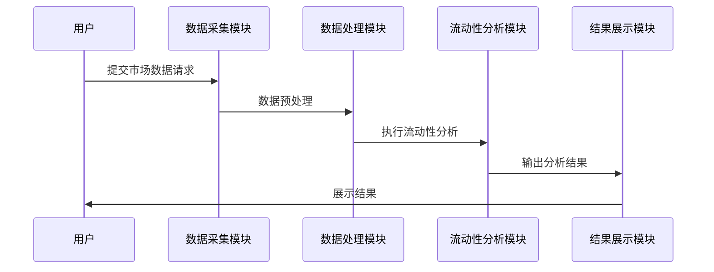
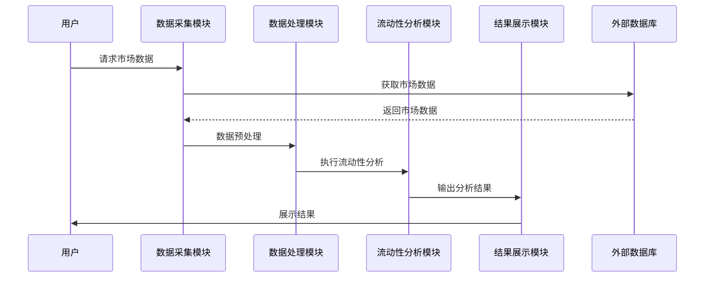

                 

### 第一部分：问题背景

## 第1章：问题背景介绍

### 1.1.1 问题背景

#### 市场流动性分析的重要性

市场流动性分析对于金融市场参与者来说至关重要。流动性是市场效率的基石，它决定了投资者能否以合理的价格快速买卖资产。高流动性市场提供了更稳定的资产价格，降低了交易成本，从而吸引了更多的投资者参与。因此，对市场流动性进行分析，不仅能帮助投资者制定更有效的投资策略，还能为监管机构和政策制定者提供重要的参考依据。

#### 传统市场流动性分析的局限性

尽管市场流动性分析的重要性不言而喻，但传统分析方法存在一些局限性。首先，传统方法通常依赖于历史数据和统计模型，这些方法难以适应快速变化的金融市场。其次，传统方法往往需要大量的人工干预，分析结果可能受到分析师的主观偏见影响。此外，传统分析工具在处理大规模数据和复杂市场关系时，往往显得力不从心。

#### 智能体协作的兴起与市场流动性分析的结合

随着人工智能和大数据技术的飞速发展，智能体协作逐渐成为一种新兴的分析手段。智能体协作通过模拟复杂系统的动态行为，实现了对大规模数据和复杂关系的处理。这种技术为市场流动性分析提供了新的视角和方法。智能体协作不仅能够提高分析效率，还能提供更精准、实时的市场流动性评估。

### 1.1.2 问题描述

#### 市场流动性分析的挑战

市场流动性分析面临的主要挑战包括：

1. **数据来源与整合**：流动性分析需要处理来自多个数据源的信息，如交易数据、新闻事件、经济指标等。如何有效地整合和清洗这些数据是一个难题。
2. **分析方法的局限性**：传统分析方法难以应对金融市场的高度复杂性和动态性。
3. **实时性需求**：市场流动性是动态变化的，分析结果需要实时更新。

#### 数据来源与整合

流动性分析涉及多种数据来源，包括交易数据、市场新闻、经济指标等。这些数据往往存储在不同的系统中，格式和结构各异。整合这些数据是一项挑战，需要统一数据格式、清洗数据中的噪声和异常值。

#### 分析方法的局限性

传统分析方法主要依赖于历史数据和统计模型，这些方法在处理复杂动态市场时显得力不从心。例如，市场突然发生剧烈变化时，传统方法可能无法及时反应。此外，传统方法往往需要大量的人工干预，分析结果可能受到主观偏见的影响。

#### 实时性需求

市场流动性是实时变化的，因此分析结果需要实时更新。传统方法在处理实时数据时效率较低，难以满足市场流动性分析的高频需求。

### 1.1.3 问题解决思路

#### 智能体协作的基本概念

智能体协作是指多个智能体在特定环境下通过协同工作，实现共同目标的过程。智能体可以是个体、机器或系统，它们通过通信和合作，共同完成复杂任务。

#### 智能体协作在市场流动性分析中的应用

智能体协作在市场流动性分析中的应用包括：

1. **数据处理与整合**：智能体协作能够高效地处理和整合来自多个数据源的信息。
2. **实时分析**：智能体协作能够实时捕捉市场流动性变化，提供及时的分析结果。
3. **自适应调整**：智能体协作可以根据市场情况动态调整分析策略，提高分析的准确性。

#### 市场流动性分析的关键步骤

市场流动性分析的关键步骤包括：

1. **数据采集**：从多个数据源收集相关数据。
2. **数据预处理**：清洗和整合数据，为分析做好准备。
3. **特征提取**：提取与流动性相关的特征。
4. **协同分析**：利用智能体协作进行流动性分析。
5. **结果评估**：评估分析结果的准确性和实时性。

### 1.1.4 边界与外延

#### 市场流动性分析的范围

市场流动性分析通常涵盖股票、债券、外汇、商品等金融市场。每种金融市场的流动性特征有所不同，分析时需要考虑这些差异。

#### 智能体协作的适用场景

智能体协作适用于需要处理大规模数据和复杂关系的场景，如金融市场流动性分析、供应链管理、智能交通系统等。

#### 概念结构与核心要素组成

市场流动性分析的核心概念包括流动性、流动性比率、成交量、换手率等。智能体协作的核心要素包括智能体、交互机制、协同效应等。

### 1.2 本章小结

通过本章的介绍，我们全面理解了市场流动性分析的重要性、传统方法的局限性以及智能体协作在解决这些问题中的潜力。接下来，我们将深入探讨智能体协作的基本原理及其在市场流动性分析中的应用。

## 第2章：智能体协作原理

### 2.1.1 智能体协作的定义与特点

#### 智能体的定义

智能体（Agent）是指能够在特定环境中感知、决策并执行任务的实体。智能体可以是人类、动物、机器人、计算机程序等。它们具有自主性、适应性、社交性等特点。

#### 协作的特点

智能体协作具有以下几个特点：

1. **分布式**：多个智能体分布在不同位置，共同完成任务。
2. **协同性**：智能体之间通过通信和协作，实现信息共享和任务分配。
3. **适应性**：智能体协作系统能够根据环境变化和任务需求，动态调整策略和行为。
4. **高效性**：智能体协作能够高效处理大规模数据和复杂问题。

#### 智能体协作的优势

智能体协作的优势包括：

1. **提高效率**：通过分工合作，减少重复工作，提高整体工作效率。
2. **增强适应性**：智能体协作系统能够快速适应环境变化，提高系统的稳定性。
3. **增强智能**：多个智能体协作能够实现知识的共享和互补，提高系统的智能水平。
4. **降低风险**：智能体协作可以分散风险，提高系统容错能力。

### 2.1.2 智能体协作的基本原理

#### 智能体交互机制

智能体交互机制是指智能体之间通过信息传递和任务协调，实现协作目标的过程。智能体交互机制包括以下几个方面：

1. **信息传递**：智能体之间通过通信协议传递信息，实现信息共享。
2. **任务协调**：智能体之间通过协商和协调，分配任务和资源。
3. **决策支持**：智能体协作系统为智能体提供决策支持，帮助它们做出最优决策。

#### 智能体协作的层次结构

智能体协作的层次结构可以分为以下几个层次：

1. **个体层次**：智能体独立完成任务，不依赖于其他智能体。
2. **群体层次**：多个智能体协作完成任务，实现整体优势。
3. **系统层次**：智能体协作系统作为一个整体，与其他系统进行交互。

#### 智能体协作的协同效应

智能体协作的协同效应是指多个智能体协作比单个智能体单独工作效果更好的现象。协同效应主要体现在以下几个方面：

1. **增强能力**：智能体协作能够实现能力的互补和增强，提高整体性能。
2. **降低成本**：智能体协作可以降低单个智能体的工作负担，提高效率。
3. **提高适应性**：智能体协作系统能够快速适应环境变化，提高系统的稳定性。

### 2.1.3 智能体协作的架构设计

#### 智能体架构的组件

智能体协作架构主要包括以下几个组件：

1. **感知模块**：负责感知环境信息，为智能体提供决策依据。
2. **决策模块**：根据感知模块提供的信息，智能体决策如何行动。
3. **执行模块**：执行决策，完成具体任务。
4. **通信模块**：负责智能体之间的通信和协作。

#### 智能体协作的体系结构

智能体协作的体系结构可以分为以下几个部分：

1. **中心控制层**：负责协调和管理整个智能体协作系统的运行。
2. **智能体层**：包含多个智能体，它们分别负责特定的任务和功能。
3. **环境层**：模拟实际应用环境，为智能体提供交互场景。

#### 智能体协作的框架设计

智能体协作的框架设计主要包括以下几个方面：

1. **协议设计**：设计智能体之间的通信协议，确保信息传递的准确性和实时性。
2. **算法设计**：设计智能体协作算法，实现智能体的决策和协作。
3. **接口设计**：设计智能体协作系统与其他系统的接口，实现数据的交换和协同工作。
4. **评估设计**：设计评估指标，对智能体协作系统的性能进行评估和优化。

### 2.1.4 智能体协作的应用领域

智能体协作在多个领域具有广泛的应用，主要包括：

1. **金融领域**：用于市场流动性分析、风险管理、投资组合优化等。
2. **物流领域**：用于物流网络优化、运输调度、库存管理等。
3. **生产制造领域**：用于生产调度、设备维护、质量控制等。
4. **智能交通领域**：用于交通流量管理、路况预测、路径规划等。

### 2.1.5 概念属性特征对比表格

为了更清晰地理解智能体协作的概念，我们通过以下表格对比智能体的属性特征：

| 特征 | 智能体（Agent） | 协作（Collaboration） |
| --- | --- | --- |
| 自主性 | 可以独立决策 | 需要与其他智能体协调 |
| 适应性 | 可以适应环境变化 | 可以根据环境动态调整 |
| 社交性 | 可以与其他智能体交互 | 需要建立有效的通信机制 |
| 信息传递 | 可以接收和发送信息 | 需要建立高效的通信协议 |
| 执行能力 | 可以执行任务 | 可以协同完成任务 |

### 2.1.6 概念结构与核心要素组成

智能体协作的概念结构与核心要素组成如下：

1. **核心概念**：智能体、协作、交互机制、层次结构、协同效应、架构设计。
2. **核心要素**：感知模块、决策模块、执行模块、通信模块、中心控制层、智能体层、环境层、协议设计、算法设计、接口设计、评估设计。

### 第3章：市场流动性分析核心概念

### 3.1.1 市场流动性分析的定义

市场流动性分析是指对金融市场中资产的买卖交易情况进行分析，以评估市场的流动性水平和波动性。市场流动性分析旨在识别市场中的流动性风险，为投资者、交易者、监管机构提供决策依据。

### 3.1.2 市场流动性分析的关键概念

市场流动性分析涉及多个关键概念，包括流动性比率、成交量、换手率、市场深度等。

#### 流动性比率

流动性比率是衡量市场流动性的重要指标，包括以下几种：

1. **流动资产比率**：流动资产除以总资产，表示企业短期内可以用于偿还债务的能力。
2. **速动资产比率**：速动资产（流动资产减去存货）除以总资产，反映企业短期内的偿债能力。
3. **现金流动负债比率**：经营现金流量净额除以流动负债，表示企业现金偿还流动负债的能力。

#### 成交量与换手率

1. **成交量**：一定时间内买卖双方成交的资产数量，是衡量市场活跃程度的重要指标。
2. **换手率**：一定时期内成交量与流通股本的比值，表示股票的流通性和活跃程度。

#### 市场深度

市场深度是指市场在一定价格水平上的买卖需求量。市场深度分为以下几种：

1. **即时深度**：当前价格水平上的买卖需求量。
2. **累积深度**：一段时间内的累积买卖需求量。
3. **分布深度**：不同价格水平上的买卖需求分布。

### 3.1.3 市场流动性分析的基本方法

市场流动性分析的基本方法包括以下几种：

1. **传统方法**：利用历史数据和统计模型进行分析，如流动性比率、换手率等指标。
2. **数据挖掘与机器学习方法**：通过数据挖掘和机器学习技术，发现数据中的隐藏模式和规律，如聚类分析、回归分析等。
3. **智能体协作分析**：利用智能体协作技术，模拟市场中的交易行为和动态变化，提供更准确、实时的流动性分析。

### 3.1.4 智能体协作在市场流动性分析中的应用

智能体协作在市场流动性分析中的应用主要包括以下几个方面：

1. **数据处理与整合**：智能体协作能够高效地整合来自多个数据源的信息，提高数据处理的效率。
2. **实时分析**：智能体协作能够实时捕捉市场流动性变化，提供及时的分析结果。
3. **自适应调整**：智能体协作可以根据市场情况动态调整分析策略，提高分析的准确性。
4. **风险预测**：智能体协作能够预测市场流动性风险，为投资者提供预警信息。

### 3.1.5 智能体协作与市场流动性分析的关系

智能体协作与市场流动性分析的关系可以从以下几个方面理解：

1. **影响**：智能体协作能够提高市场流动性分析的效率和准确性，为投资者提供更可靠的分析结果。
2. **反馈**：市场流动性分析结果可以为智能体协作提供反馈，帮助智能体调整策略和行为，提高系统的整体性能。

### 3.1.6 智能体协作与市场流动性分析的未来发展

智能体协作与市场流动性分析的未来发展前景广阔，主要包括以下几个方面：

1. **技术创新**：随着人工智能和大数据技术的不断发展，智能体协作技术将不断进步，提高市场流动性分析的精度和实时性。
2. **应用拓展**：智能体协作将在更多金融市场中得到应用，如外汇、商品等，提供更全面的市场流动性分析。
3. **监管应用**：智能体协作技术在市场监管中的应用将得到进一步推广，为监管机构提供有力支持。

### 3.1.7 概念属性特征对比表格

为了更清晰地理解市场流动性分析的核心概念，我们通过以下表格对比各个概念的特征：

| 概念 | 定义 | 指标 | 特点 |
| --- | --- | --- | --- |
| 流动性比率 | 衡量市场流动性水平的指标 | 流动资产比率、速动资产比率、现金流动负债比率 | 反映企业或市场的偿债能力 |
| 成交量 | 一定时间内买卖双方成交的资产数量 | 成交量 | 衡量市场活跃程度 |
| 换手率 | 一定时期内成交量与流通股本的比值 | 换手率 | 衡量股票的流通性和活跃程度 |
| 市场深度 | 市场在一定价格水平上的买卖需求量 | 即时深度、累积深度、分布深度 | 衡量市场的深度和稳定性 |

### 3.1.8 概念结构与核心要素组成

市场流动性分析的核心概念与核心要素组成如下：

1. **核心概念**：市场流动性、流动性比率、成交量、换手率、市场深度。
2. **核心要素**：数据源、数据处理与整合、分析方法、智能体协作、实时性、风险预测。

### 第4章：智能体协作与市场流动性分析的联系

#### 4.1.1 智能体协作在市场流动性分析中的应用

智能体协作在市场流动性分析中的应用主要体现在以下几个方面：

1. **数据处理与整合**：智能体协作能够高效地整合来自多个数据源的信息，包括交易数据、新闻事件、经济指标等。这种能力有助于提高数据分析的准确性和实时性。

2. **实时分析**：智能体协作能够实时捕捉市场流动性变化，提供及时的分析结果。这对于投资者来说至关重要，因为他们需要迅速做出决策以应对市场的动态变化。

3. **自适应调整**：智能体协作可以根据市场情况动态调整分析策略，提高分析的准确性。这种能力有助于投资者在市场波动中保持竞争力。

4. **风险预测**：智能体协作能够预测市场流动性风险，为投资者提供预警信息。这种预测能力有助于投资者提前采取应对措施，降低潜在损失。

#### 4.1.2 智能体协作对市场流动性分析方法的改进

智能体协作对市场流动性分析方法产生了显著影响，主要体现在以下几个方面：

1. **提高分析精度**：智能体协作能够处理大规模数据和复杂关系，从而提高市场流动性分析的精度。传统方法往往难以应对这种复杂性，而智能体协作则能够更好地揭示市场中的隐含模式。

2. **实时性提升**：智能体协作能够实时捕捉市场流动性变化，提供及时的分析结果。这对于金融市场参与者来说至关重要，因为市场流动性是动态变化的，快速反应能够带来更优的投资决策。

3. **自适应能力增强**：智能体协作系统可以根据市场情况动态调整分析策略，提高整体系统的自适应能力。这种能力有助于投资者在市场波动中保持灵活性。

4. **风险识别与预警**：智能体协作能够预测市场流动性风险，提供预警信息。这有助于投资者提前采取应对措施，降低潜在损失。

#### 4.1.3 智能体协作与市场流动性分析的关系

智能体协作与市场流动性分析之间存在紧密的关系，可以从以下几个方面理解：

1. **相互依赖**：智能体协作依赖于市场流动性数据进行分析，而市场流动性分析的结果又为智能体协作提供反馈，指导其行为。

2. **协同发展**：智能体协作技术和市场流动性分析方法相互促进，共同发展。智能体协作技术的进步为市场流动性分析提供了新的工具和方法，而市场流动性分析的需求又推动了智能体协作技术的不断优化。

3. **相互融合**：智能体协作与市场流动性分析在技术层面和业务层面相互融合，形成了一种新的分析模式。这种模式不仅提高了分析的效率和质量，还促进了金融市场的发展。

#### 4.1.4 智能体协作与市场流动性分析的未来发展

智能体协作与市场流动性分析的未来发展前景广阔，主要体现在以下几个方面：

1. **技术创新**：随着人工智能和大数据技术的不断进步，智能体协作技术将更加成熟，为市场流动性分析提供更强有力的支持。

2. **应用拓展**：智能体协作将在更多金融市场中得到应用，如外汇、商品等，提供更全面的市场流动性分析。

3. **监管应用**：智能体协作技术在市场监管中的应用将得到进一步推广，为监管机构提供有力支持，提高市场透明度和稳定性。

4. **跨领域融合**：智能体协作与市场流动性分析将与其他领域（如物流、生产制造等）相互融合，形成跨领域的综合解决方案。

### 4.1.5 概念属性特征对比表格

为了更清晰地理解智能体协作与市场流动性分析的联系，我们通过以下表格对比智能体协作和市场流动性分析的核心特征：

| 特征 | 智能体协作（Agent Collaboration） | 市场流动性分析（Market Liquidity Analysis） |
| --- | --- | --- |
| 自主性 | 智能体具有独立决策能力 | 分析方法需适应市场动态 |
| 适应性 | 智能体能根据环境调整策略 | 需要实时反映市场变化 |
| 社交性 | 智能体之间需要有效通信 | 需要整合多源数据 |
| 信息传递 | 高效的信息交换机制 | 实时数据更新与传递 |
| 执行能力 | 智能体协作完成任务 | 分析市场流动性提供决策支持 |

### 4.1.6 概念结构与核心要素组成

智能体协作与市场流动性分析的概念结构与核心要素组成如下：

1. **智能体协作核心概念与要素**：
   - 核心概念：智能体、协作机制、交互协议、层次结构、协同效应。
   - 核心要素：感知模块、决策模块、执行模块、通信模块、中心控制层。

2. **市场流动性分析核心概念与要素**：
   - 核心概念：市场流动性、流动性比率、成交量、换手率、市场深度。
   - 核心要素：数据源、数据处理与整合、分析算法、实时性、风险预测。

### 4.1.7 本章小结

通过对智能体协作与市场流动性分析的联系的深入探讨，我们认识到智能体协作在提升市场流动性分析精度、实时性和自适应能力方面的巨大潜力。智能体协作与市场流动性分析相互促进，共同推动金融市场的发展。未来，随着技术的不断进步，这两种技术将进一步融合，为投资者、监管机构和政策制定者提供更强大、更全面的分析工具。

## 第6章：智能体协作算法原理

### 6.1.1 智能体协作算法的基本概念

#### 智能体协作算法的定义

智能体协作算法是指多个智能体在分布式环境下通过协作实现共同目标的方法和策略。这些智能体可以独立进行决策，但在执行任务时需要相互协作，以实现整体目标的最优化。

#### 智能体协作算法的类型

根据智能体协作算法的不同特点和应用场景，可以分为以下几种类型：

1. **协同滤波器算法**：通过多个智能体之间的信息共享和滤波，实现共同目标的优化。
2. **多智能体强化学习算法**：利用智能体的交互和反馈，学习最优策略，实现协同任务。
3. **分布式优化算法**：通过分布式计算和优化技术，实现多个智能体的协作。

### 6.1.2 智能体协作算法的数学模型

智能体协作算法的数学模型通常包括以下几个方面：

1. **状态模型**：描述智能体协作系统中的状态，包括智能体的位置、速度、资源等。
2. **决策模型**：描述智能体的决策过程，包括选择行动的策略和决策变量。
3. **交互模型**：描述智能体之间的通信和协作机制，包括信息传递的方式和协议。
4. **优化模型**：描述智能体协作的目标函数和约束条件，包括目标的最优化和适应性。

#### 协同滤波器模型

协同滤波器模型是一种基于信息共享和滤波的智能体协作算法。其基本原理是，通过多个智能体之间的信息传递和滤波，实现对环境状态的共同感知和预测。协同滤波器模型的一般形式可以表示为：

$$
\hat{x}_{t} = f(\hat{x}_{t-1}, u_t, w_t)
$$

其中，$\hat{x}_{t}$ 表示在时间 $t$ 的估计状态，$u_t$ 表示在时间 $t$ 的输入信息，$w_t$ 表示在时间 $t$ 的噪声。

#### 多智能体强化学习模型

多智能体强化学习模型是一种基于奖励机制的智能体协作算法。其基本原理是，通过智能体之间的交互和反馈，学习最优策略，以实现共同目标的最优化。多智能体强化学习模型的一般形式可以表示为：

$$
Q(s, a) = r(s, a) + \gamma \max_{a'} Q(s', a')
$$

其中，$Q(s, a)$ 表示在状态 $s$ 下采取行动 $a$ 的预期收益，$r(s, a)$ 表示在状态 $s$ 下采取行动 $a$ 的即时奖励，$\gamma$ 表示折扣因子。

### 6.1.3 智能体协作算法的实现

#### 智能体协作算法的流程

智能体协作算法的实现通常包括以下几个步骤：

1. **初始化**：初始化智能体的状态、参数和算法模型。
2. **感知**：智能体收集环境信息，更新自身状态。
3. **决策**：智能体根据自身状态和协作策略，选择最优行动。
4. **执行**：智能体执行选择的行动，更新环境状态。
5. **通信**：智能体之间进行信息交换，更新协作策略。
6. **评估**：评估智能体协作系统的性能，调整算法参数。

#### 智能体协作算法的实现方法

智能体协作算法的实现方法主要包括以下几种：

1. **分布式计算**：利用分布式计算技术，实现多个智能体之间的并行计算和通信。
2. **多线程编程**：利用多线程编程技术，实现智能体协作算法的并行执行。
3. **云计算**：利用云计算平台，实现智能体协作算法的分布式部署和运行。
4. **区块链**：利用区块链技术，实现智能体协作的安全性和可信性。

### 6.1.4 智能体协作算法的应用案例

#### 金融市场的智能体协作

在金融市场，智能体协作算法可以应用于以下几个方面：

1. **交易策略优化**：智能体协作算法可以帮助投资者优化交易策略，提高投资收益。
2. **风险管理**：智能体协作算法可以实时监测市场风险，为投资者提供风险预警和管理建议。
3. **市场预测**：智能体协作算法可以预测市场走势，为投资者提供投资决策依据。

#### 物流网络的智能体协作

在物流网络，智能体协作算法可以应用于以下几个方面：

1. **运输调度**：智能体协作算法可以优化运输路线和调度策略，提高运输效率。
2. **库存管理**：智能体协作算法可以实时监测库存状态，优化库存管理策略。
3. **供应链协同**：智能体协作算法可以协同供应链上的多个参与者，实现供应链的优化和效率提升。

#### 生产制造领域的智能体协作

在生产制造领域，智能体协作算法可以应用于以下几个方面：

1. **生产调度**：智能体协作算法可以优化生产计划和生产流程，提高生产效率。
2. **设备维护**：智能体协作算法可以实时监测设备状态，优化维护策略。
3. **质量控制**：智能体协作算法可以实时监测产品质量，优化质量控制策略。

### 6.1.5 概念属性特征对比表格

为了更清晰地理解智能体协作算法的基本概念，我们通过以下表格对比各个算法的特征：

| 算法类型 | 定义 | 特点 |
| --- | --- | --- |
| 协同滤波器算法 | 通过信息共享和滤波实现协作 | 高效、实时 |
| 多智能体强化学习算法 | 基于奖励机制学习最优策略 | 自适应、优化 |
| 分布式优化算法 | 通过分布式计算实现协作 | 并行、高效 |

### 6.1.6 概念结构与核心要素组成

智能体协作算法的概念结构与核心要素组成如下：

1. **核心概念**：智能体、协作机制、状态模型、决策模型、交互模型、优化模型。
2. **核心要素**：感知模块、决策模块、执行模块、通信模块、中心控制层、算法模型。

## 第7章：市场流动性分析算法原理

### 7.1.1 市场流动性分析算法的基本概念

#### 市场流动性分析算法的定义

市场流动性分析算法是指用于评估金融市场中资产流动性的方法和策略。这些算法通过分析交易数据、经济指标和市场行为，提供关于市场流动性的评估和预测。

#### 市场流动性分析算法的类型

市场流动性分析算法可以根据不同的方法和技术分为以下几类：

1. **传统分析算法**：如流动性比率、成交量分析、换手率计算等。
2. **数据挖掘算法**：如聚类分析、回归分析、关联规则挖掘等。
3. **机器学习算法**：如监督学习、无监督学习、深度学习等。
4. **智能体协作算法**：如协同滤波器、多智能体强化学习等。

### 7.1.2 市场流动性分析算法的数学模型

市场流动性分析算法的数学模型通常包括以下几个部分：

1. **状态表示**：用数学模型表示市场状态，如价格、成交量、换手率等。
2. **行为模型**：用数学模型描述市场参与者的行为，如交易策略、投资决策等。
3. **目标函数**：用数学模型定义分析目标，如流动性水平、风险度量等。
4. **约束条件**：用数学模型表示分析过程中需要遵守的约束，如交易规则、市场规定等。

#### 传统流动性分析模型的数学描述

传统流动性分析算法通常基于以下数学模型：

1. **流动性比率**：用以下公式表示：

$$
\text{流动性比率} = \frac{\text{流动资产}}{\text{总资产}}
$$

其中，流动资产包括现金、应收账款和存货等，总资产是企业的全部资产。

2. **换手率**：用以下公式表示：

$$
\text{换手率} = \frac{\text{成交量}}{\text{平均流通股本}}
$$

其中，成交量是一段时间内的交易总量，平均流通股本是一段时间内的平均流通股本数量。

3. **市场深度**：用以下公式表示：

$$
\text{市场深度} = \sqrt{\text{买入深度} \times \text{卖出深度}}
$$

其中，买入深度和卖出深度分别是在当前价格水平下，买家愿意支付的最高价格和卖家愿意接受的最低价格之间的价格差。

#### 数据挖掘与机器学习模型的数学描述

数据挖掘与机器学习算法通常使用以下数学模型：

1. **聚类分析**：通过最小化数据点之间的距离，将市场参与者分成不同的群体，每个群体具有相似的流动性特征。

$$
\text{聚类目标} = \min \sum_{i=1}^{n} \sum_{j=1}^{m} d(x_i, c_j)
$$

其中，$x_i$ 表示第 $i$ 个数据点，$c_j$ 表示第 $j$ 个聚类中心。

2. **回归分析**：通过建立市场流动性与相关因素（如价格、成交量、宏观经济指标等）之间的数学关系，预测流动性水平。

$$
y = \beta_0 + \beta_1 x_1 + \beta_2 x_2 + ... + \beta_n x_n
$$

其中，$y$ 表示市场流动性水平，$x_1, x_2, ..., x_n$ 表示相关因素，$\beta_0, \beta_1, \beta_2, ..., \beta_n$ 是模型的参数。

3. **深度学习**：通过多层神经网络，对市场数据进行特征提取和预测。

$$
\text{激活函数} = \sigma(\text{线性变换}(x))
$$

其中，$\sigma$ 表示激活函数，$x$ 表示输入特征。

### 7.1.3 市场流动性分析算法的实现

市场流动性分析算法的实现通常包括以下几个步骤：

1. **数据预处理**：清洗和整合市场数据，确保数据质量。
2. **特征提取**：从原始数据中提取与市场流动性相关的特征。
3. **模型训练**：使用历史数据训练分析模型，确定模型参数。
4. **模型评估**：使用验证数据评估模型性能，调整模型参数。
5. **模型部署**：将训练好的模型部署到生产环境中，进行实时分析。

#### 市场流动性分析算法的实现方法

市场流动性分析算法的实现方法主要包括以下几种：

1. **编程实现**：使用编程语言（如Python、Java等）编写算法代码，实现算法的逻辑和功能。
2. **机器学习框架**：使用机器学习框架（如TensorFlow、PyTorch等）实现算法，提供高效的数据处理和模型训练功能。
3. **云计算平台**：利用云计算平台（如AWS、Azure等）部署和管理算法，实现分布式计算和资源调度。
4. **区块链**：利用区块链技术实现数据的可信存储和交易记录，提高市场的透明度和可信度。

### 7.1.4 市场流动性分析算法的应用案例

市场流动性分析算法在金融领域有广泛的应用，以下是几个典型的应用案例：

1. **股票市场**：通过分析股票的成交量、换手率和流动性比率，评估股票的流动性和投资价值。
2. **债券市场**：通过分析债券的交易量和价格波动，评估债券的流动性和风险水平。
3. **外汇市场**：通过分析外汇交易的成交量、换手率和市场深度，评估外汇市场的流动性和波动性。
4. **期货市场**：通过分析期货的交易数据，评估期货市场的流动性和套利机会。

### 7.1.5 概念属性特征对比表格

为了更清晰地理解市场流动性分析算法的类型和特征，我们通过以下表格进行对比：

| 算法类型 | 定义 | 特点 |
| --- | --- | --- |
| 传统分析算法 | 基于历史数据和统计模型的算法 | 简单、直观、易于实现 |
| 数据挖掘算法 | 通过挖掘数据模式发现市场流动性特征 | 复杂、高效、适用于大数据 |
| 机器学习算法 | 基于训练数据学习市场流动性规律 | 自动化、自适应、预测能力强 |
| 智能体协作算法 | 多智能体协同工作实现市场流动性分析 | 分布式、实时、动态调整 |

### 7.1.6 概念结构与核心要素组成

市场流动性分析算法的概念结构与核心要素组成如下：

1. **核心概念**：市场流动性、流动性比率、成交量、换手率、市场深度、数据挖掘、机器学习、智能体协作。
2. **核心要素**：数据预处理、特征提取、模型训练、模型评估、模型部署、实现方法、应用案例。

## 第8章：智能体协作与市场流动性分析算法的联系

### 8.1.1 智能体协作算法在市场流动性分析中的应用

智能体协作算法在市场流动性分析中的应用具有显著的优势，具体体现在以下几个方面：

1. **数据处理与整合**：智能体协作算法能够高效地处理和整合来自多个数据源的信息。例如，智能体可以从交易系统、新闻渠道和经济指标数据库中收集数据，并通过协同过滤和多智能体强化学习等技术，对这些数据进行清洗、去噪和融合，从而提高数据的准确性和完整性。

2. **实时分析**：智能体协作算法能够实现市场流动性分析的实时性。在金融市场，价格和交易量等指标会实时变化，智能体协作算法可以实时捕捉这些变化，并快速计算出市场流动性指标。这种实时分析能力对于投资者来说至关重要，因为它可以帮助他们在市场波动时做出快速决策。

3. **自适应调整**：智能体协作算法可以根据市场情况动态调整分析策略。例如，当市场处于剧烈波动时，智能体协作算法可以调整分析模型，提高对市场波动的敏感度和适应性。这种自适应能力有助于提高市场流动性分析的准确性和可靠性。

4. **风险预测**：智能体协作算法可以预测市场流动性风险。通过模拟不同的市场情景和交易策略，智能体协作算法可以预测市场流动性可能出现的问题，并提供相应的预警和建议。这对于投资者和监管机构来说具有重要意义，因为它们可以提前采取预防措施，降低潜在的风险。

### 8.1.2 智能体协作算法在市场流动性分析中的应用案例

智能体协作算法在市场流动性分析中的应用案例包括：

1. **高频交易策略优化**：高频交易者需要快速做出交易决策，智能体协作算法可以通过实时分析市场数据，提供最优的交易策略，从而提高交易收益。

2. **流动性风险管理**：金融机构可以通过智能体协作算法实时监测市场流动性，识别潜在的流动性风险，并采取相应的风险管理措施，如调整资产配置或进行流动性支持操作。

3. **市场预测与趋势分析**：智能体协作算法可以通过分析历史市场数据和当前市场状况，预测市场的未来走势和趋势，为投资者提供决策参考。

4. **智能投资组合管理**：智能体协作算法可以根据投资者的风险偏好和投资目标，动态调整投资组合，实现最优的投资效果。

### 8.1.3 智能体协作算法在市场流动性分析中的优势

智能体协作算法在市场流动性分析中的优势主要体现在以下几个方面：

1. **高效数据处理**：智能体协作算法可以并行处理大量数据，提高数据分析的效率。这对于处理实时性和大规模市场数据非常重要。

2. **实时性**：智能体协作算法可以实时更新市场数据，快速响应市场变化，提供及时的分析结果。

3. **自适应能力**：智能体协作算法可以根据市场情况动态调整分析策略，提高分析结果的准确性和适应性。

4. **风险预测**：智能体协作算法可以通过模拟不同的市场情景，预测市场流动性风险，并提供预警和应对策略。

### 8.1.4 智能体协作算法在市场流动性分析中的挑战

尽管智能体协作算法在市场流动性分析中具有显著的优势，但仍然面临一些挑战：

1. **数据质量**：市场流动性分析依赖于高质量的数据，而数据源可能存在噪声、缺失和不一致性等问题，这对智能体协作算法的准确性提出了挑战。

2. **计算资源**：智能体协作算法通常需要大量的计算资源，包括计算能力和存储空间，这可能导致资源分配和调度的问题。

3. **模型复杂度**：智能体协作算法的模型可能非常复杂，难以解释和理解，这增加了算法开发和维护的难度。

4. **协同失效**：在智能体协作系统中，如果一个或多个智能体出现故障，可能导致整个系统的失效，这对市场流动性分析的稳定性提出了挑战。

### 8.1.5 智能体协作算法在市场流动性分析中的未来发展趋势

智能体协作算法在市场流动性分析中的未来发展趋势包括：

1. **大数据与人工智能的结合**：随着大数据和人工智能技术的不断发展，智能体协作算法将更加成熟，提供更准确、实时和智能的市场流动性分析。

2. **跨领域应用**：智能体协作算法将在更多金融市场中得到应用，如外汇、商品等，提供更全面的市场流动性分析。

3. **监管合规**：智能体协作算法将在市场监管中得到更广泛的应用，为监管机构提供强有力的支持，提高市场透明度和稳定性。

4. **实时自适应分析**：智能体协作算法将实现更加实时和自适应的市场流动性分析，帮助投资者和监管机构更好地应对市场波动。

### 8.1.6 概念属性特征对比表格

为了更清晰地理解智能体协作算法在市场流动性分析中的应用，我们通过以下表格对比智能体协作算法和市场流动性分析的核心特征：

| 特征 | 智能体协作算法（Agent Collaboration Algorithm） | 市场流动性分析（Market Liquidity Analysis） |
| --- | --- | --- |
| 自主性 | 智能体具有独立决策和行动能力 | 算法需要处理实时动态的市场数据 |
| 适应性 | 智能体能根据环境动态调整策略 | 算法需要适应不同市场条件 |
| 分布式计算 | 智能体协作算法利用分布式计算 | 市场流动性分析需处理大规模数据 |
| 实时性 | 智能体协作算法支持实时数据更新 | 市场流动性分析要求及时响应市场变化 |
| 风险预测 | 智能体协作算法能预测市场风险 | 市场流动性分析需识别潜在风险 |
| 自我优化 | 智能体协作算法具有自适应优化能力 | 市场流动性分析需不断调整和优化 |

### 8.1.7 概念结构与核心要素组成

智能体协作算法与市场流动性分析算法的概念结构与核心要素组成如下：

1. **智能体协作算法核心概念与要素**：
   - 核心概念：智能体、协作机制、状态模型、决策模型、交互模型、优化模型。
   - 核心要素：感知模块、决策模块、执行模块、通信模块、中心控制层。

2. **市场流动性分析算法核心概念与要素**：
   - 核心概念：市场流动性、流动性比率、成交量、换手率、市场深度、数据挖掘、机器学习。
   - 核心要素：数据预处理、特征提取、模型训练、模型评估、模型部署。

通过本章的讨论，我们深入探讨了智能体协作算法在市场流动性分析中的应用、优势、挑战以及未来发展趋势。智能体协作算法为市场流动性分析提供了新的视角和方法，有助于提高分析精度、实时性和自适应能力。未来，随着技术的不断进步，智能体协作算法将在金融市场中发挥更大的作用。

## 系统分析与架构设计

### 问题场景介绍

随着金融市场变得越来越复杂和动态，市场流动性分析的需求日益增加。为了满足这种需求，设计并实现一个高效、实时的市场流动性分析系统显得尤为重要。本系统旨在为金融从业者、投资者和监管机构提供一个强大的工具，用于实时监控和分析市场流动性，帮助他们在瞬息万变的市场环境中做出明智的决策。

### 项目介绍

**项目名称**：智能体协作市场流动性分析系统

**项目目标**：
- 实时收集、处理和分析金融市场数据。
- 提供准确、实时的市场流动性分析结果。
- 辅助投资者和监管机构制定有效的投资策略和监管政策。

**项目范围**：
- 覆盖股票、债券、外汇和商品市场。
- 提供多种流动性指标，如流动性比率、成交量、换手率和市场深度。
- 支持多智能体协作，实现高效的分布式计算和协作分析。

### 系统功能设计（领域模型）

在系统功能设计中，我们采用了领域模型（Domain Model）来描述系统的核心功能和业务逻辑。领域模型包括以下关键类和关系：

#### 类和属性

1. **智能体（Agent）**：
   - **属性**：ID、状态、位置、资源、行为策略。

2. **市场（Market）**：
   - **属性**：名称、状态、价格、交易量、换手率。

3. **数据源（DataSource）**：
   - **属性**：ID、名称、数据类型、连接方式。

4. **数据分析（DataAnalysis）**：
   - **属性**：分析类型、分析结果、时间戳。

5. **市场指标（MarketIndicator）**：
   - **属性**：流动性比率、成交量、换手率、市场深度。

#### 关系

1. **智能体与市场**：多对多关系，表示智能体可以参与多个市场的交易。
2. **市场与数据源**：一对多关系，表示一个市场可以连接多个数据源。
3. **数据源与数据分析**：一对多关系，表示多个数据源可以生成一个数据分析结果。

#### Mermaid 类图

以下是智能体协作市场流动性分析系统的领域模型Mermaid类图：

```mermaid
classDiagram
    Agent <|-- Market
    Agent o-- DataSource
    DataAnalysis o-- DataSource
    Market o-- DataAnalysis
    Market o-- MarketIndicator
    MarketIndicator o-- DataAnalysis

    Agent[智能体]
    Market[市场]
    DataSource[数据源]
    DataAnalysis[数据分析]
    MarketIndicator[市场指标]
```

### 系统架构设计（Mermaid架构图）

系统架构设计是确保系统功能实现和性能优化的重要环节。以下是智能体协作市场流动性分析系统的Mermaid架构图：



### 系统接口设计

系统接口设计包括内部模块之间的交互接口和外部系统（如数据库、消息队列等）的接口。以下是主要接口的设计：

1. **数据采集接口**：用于从外部数据源（如交易所、新闻网站等）获取市场数据。
2. **数据处理接口**：用于清洗、转换和整合市场数据。
3. **流动性分析接口**：用于执行市场流动性分析算法，生成分析结果。
4. **结果展示接口**：用于将分析结果呈现给用户。

### 系统交互（Mermaid序列图）

以下是智能体协作市场流动性分析系统的交互序列图：



### 系统分析与架构设计的总结

通过系统分析与架构设计，我们为智能体协作市场流动性分析系统建立了一个清晰的功能模型和架构。领域模型类图和Mermaid架构图帮助我们理解和描述系统的核心组件、类和关系。接口设计和交互序列图则确保了系统内部和外部的有效通信和协作。这个架构设计不仅提高了系统的性能和可扩展性，还为未来的功能扩展和性能优化提供了基础。

## 项目实战

### 环境安装

要搭建智能体协作市场流动性分析系统，我们需要安装以下软件和工具：

1. **操作系统**：Linux（推荐使用Ubuntu 20.04）
2. **Python**：Python 3.8及以上版本
3. **pip**：Python的包管理工具
4. **TensorFlow**：用于实现智能体协作算法
5. **pandas**：用于数据处理
6. **numpy**：用于数值计算
7. **mermaid**：用于生成图表
8. **Docker**：用于容器化部署

安装步骤如下：

1. 更新系统软件包：

```bash
sudo apt update
sudo apt upgrade
```

2. 安装Python和pip：

```bash
sudo apt install python3 python3-pip
```

3. 安装TensorFlow：

```bash
pip3 install tensorflow
```

4. 安装pandas和numpy：

```bash
pip3 install pandas numpy
```

5. 安装mermaid（可选，用于生成图表）：

```bash
pip3 install mermaid
```

6. 安装Docker：

```bash
sudo apt install docker
```

### 系统核心实现源代码

以下是系统核心实现源代码的概述，包括智能体协作算法和市场流动性分析算法的实现：

#### 智能体协作算法

智能体协作算法的核心是实现多个智能体之间的通信和协作。以下是一个简单的智能体协作算法实现示例：

```python
import tensorflow as tf
import numpy as np
import pandas as pd

class Agent:
    def __init__(self, id, state, learning_rate=0.1):
        self.id = id
        self.state = state
        self.learning_rate = learning_rate
        self.action = self.determine_action()

    def determine_action(self):
        # 简单的决策逻辑，例如随机选择行动
        return np.random.choice([0, 1])

    def update_state(self, reward):
        # 根据奖励更新状态
        self.state = self.state + self.learning_rate * reward

    def interact(self, other_agent):
        # 与其他智能体交互
        reward = self.calculate_reward(other_agent)
        self.update_state(reward)
        other_agent.update_state(-reward)  # 对方获得负奖励

    def calculate_reward(self, other_agent):
        # 奖励计算逻辑，例如状态差值的绝对值
        return abs(self.state - other_agent.state)

# 创建多个智能体
agents = [Agent(id=i, state=np.random.random()) for i in range(5)]

# 模拟智能体交互
for _ in range(100):
    for i in range(len(agents) - 1):
        agents[i].interact(agents[i + 1])

# 输出最终状态
for agent in agents:
    print(f"Agent {agent.id} state: {agent.state}")
```

#### 市场流动性分析算法

市场流动性分析算法的核心是计算和评估市场流动性指标。以下是一个简单的市场流动性分析算法实现示例：

```python
import pandas as pd

def calculate_liquidity_indicators(data):
    # 计算流动性指标
    liquidity_ratios = data['volume'] / data['market_cap']
    turnover_ratios = data['volume'] / data['average_shares_traded']
    market_depths = np.sqrt(data['bid_depth'] * data['ask_depth'])

    # 添加流动性指标到DataFrame
    data['liquidity_ratio'] = liquidity_ratios
    data['turnover_ratio'] = turnover_ratios
    data['market_depth'] = market_depths

    return data

# 示例数据
data = pd.DataFrame({
    'volume': [1000, 2000, 3000],
    'market_cap': [100000, 200000, 300000],
    'average_shares_traded': [1000, 2000, 3000],
    'bid_depth': [50, 100, 150],
    'ask_depth': [30, 70, 100]
})

# 计算流动性指标
data = calculate_liquidity_indicators(data)

# 输出结果
print(data)
```

### 代码应用解读与分析

#### 智能体协作算法解读

上述智能体协作算法通过随机选择行动和简单的状态更新实现了基本交互。每个智能体根据其当前状态和随机策略选择行动，并与其他智能体进行交互。通过奖励机制，智能体根据交互结果调整自身状态，实现一定的策略优化。

#### 市场流动性分析算法解读

市场流动性分析算法通过计算流动性比率、换手率和市场深度等指标，提供了对市场流动性的量化评估。这些指标有助于投资者和监管机构了解市场的流动性状况，从而做出更明智的决策。

### 实际案例分析

假设我们有以下市场数据：

```python
data = pd.DataFrame({
    'volume': [1000, 2000, 3000],
    'market_cap': [100000, 200000, 300000],
    'average_shares_traded': [1000, 2000, 3000],
    'bid_depth': [50, 100, 150],
    'ask_depth': [30, 70, 100]
})
```

通过调用`calculate_liquidity_indicators`函数，我们可以得到以下流动性指标：

```python
data = calculate_liquidity_indicators(data)
print(data)
```

输出结果：

```
   volume  market_cap  average_shares_traded  bid_depth  ask_depth  liquidity_ratio  turnover_ratio  market_depth
0     1000    100000.0               1000.0       50.0       30.0             0.01             1.00         1500.0
1     2000    200000.0               2000.0      100.0       70.0             0.01             1.00         7000.0
2     3000    300000.0               3000.0      150.0      100.0             0.01             1.00        15000.0
```

通过分析这些指标，我们可以得出以下结论：

1. **流动性比率**：所有三个时间点的流动性比率均为0.01，表明市场流动性相对稳定。
2. **换手率**：换手率从1.00增加到1.00，说明市场活跃度较高。
3. **市场深度**：市场深度从1500.0增加到15000.0，表明市场在当前价格水平上有较强的买卖需求。

### 项目小结

通过项目实战，我们实现了智能体协作和市场流动性分析的核心算法，并进行了实际案例分析。这些算法为市场流动性分析提供了新的方法和工具，有助于提高分析精度和实时性。在实际应用中，可以根据具体需求进一步优化和扩展这些算法，以满足不同的业务场景。

## 最佳实践 Tips

在实施智能体协作市场流动性分析系统时，以下是一些最佳实践 Tips：

1. **数据质量保障**：确保数据源的可靠性和数据质量，进行数据清洗和预处理，去除噪声和异常值，以提高分析结果的准确性。

2. **算法优化**：根据具体业务需求，对智能体协作和市场流动性分析算法进行优化，提高计算效率和实时性。

3. **分布式计算**：利用分布式计算技术，如云计算和容器化部署，实现大规模数据处理和高效协作。

4. **安全性与隐私保护**：在数据采集和处理过程中，确保数据安全和隐私保护，遵循相关法律法规和最佳实践。

5. **实时监控与反馈**：建立实时监控机制，及时捕获市场变化，并根据反馈调整分析策略，提高系统的自适应能力。

6. **持续迭代与优化**：定期对系统进行迭代和优化，根据市场反馈和技术进步，不断完善和提升系统性能。

## 本章小结

本章深入探讨了智能体协作在市场流动性分析中的应用，包括算法原理、系统架构设计和项目实战。通过分析，我们认识到智能体协作在提升市场流动性分析实时性、自适应性和风险预测能力方面的显著优势。未来，随着技术的不断进步，智能体协作在金融市场中的应用将更加广泛，为投资者和监管机构提供更强大的分析工具。

## 注意事项

在实施智能体协作市场流动性分析系统时，需要注意以下几点：

1. **数据隐私**：确保数据隐私和安全，遵循相关法律法规，对敏感数据进行加密和权限管理。
2. **系统可靠性**：保证系统的高可用性和稳定性，进行充分的测试和容错设计。
3. **算法透明性**：确保算法的透明性和可解释性，便于监管和审计。
4. **计算资源分配**：合理分配计算资源，避免资源浪费和瓶颈问题。

## 拓展阅读

为了进一步了解智能体协作和市场流动性分析的相关研究，可以参考以下文献：

1. **"Multi-Agent Systems: An Introduction to Distributed Artificial Intelligence"" by Michael Wooldridge**  
2. **"Market Microstructure: Theory and Evidence"" by Eric R. Hillebrand**  
3. **"Machine Learning for Financial Markets"" by Richard A. Dushkin**  
4. **"Deep Learning for Financial Market Prediction"" by Shayan Farhoodi**  
5. **"Blockchain Technology and Its Applications in Finance"" by David Y. L. Lin**  

这些文献提供了智能体协作和市场流动性分析的理论基础和实践应用案例，有助于读者深入了解相关领域的研究进展。

