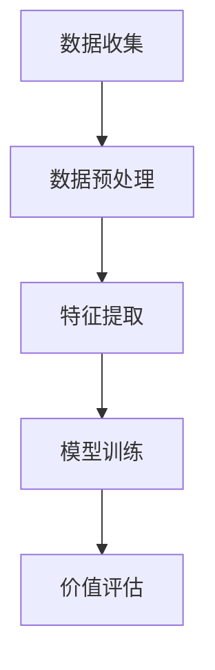
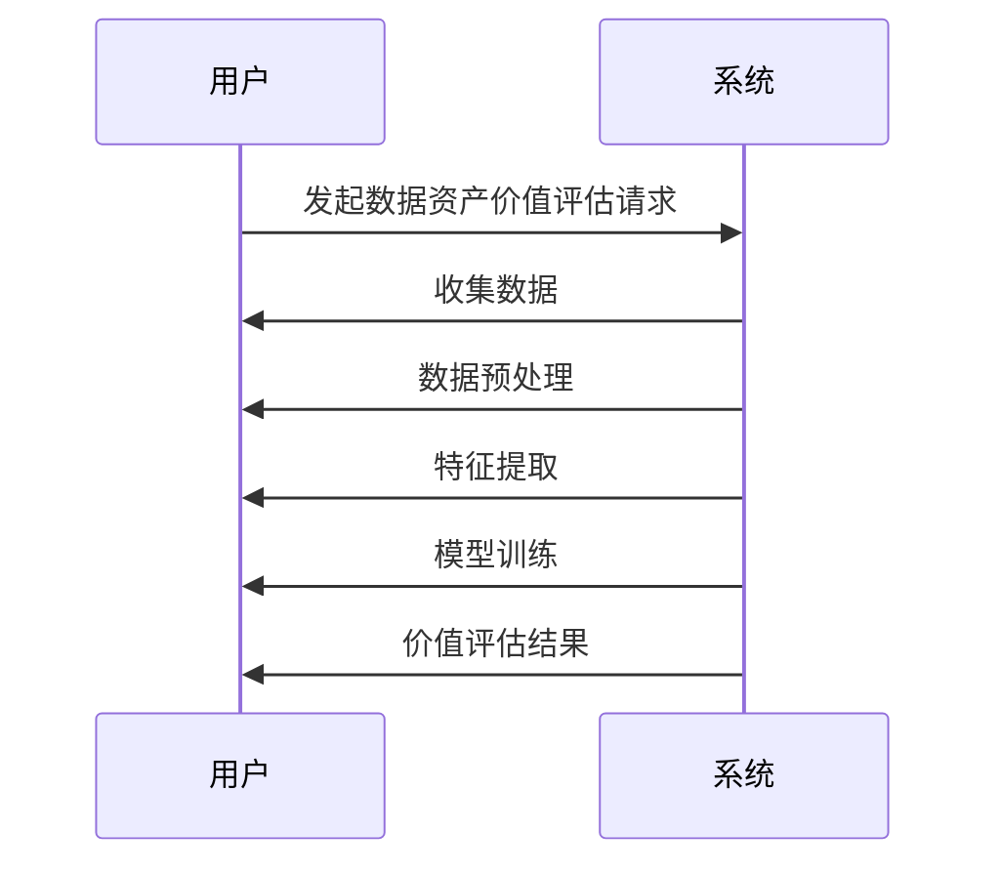

                 

### 文章标题

# 智能体协作评估公司的数据资产价值：数字经济时代的关键

## 关键词

- 智能体协作
- 数据资产
- 价值评估
- 数字经济
- 企业竞争力

## 摘要

本文旨在探讨数字经济时代下，智能体协作对数据资产价值评估的重要性。通过对智能体协作原理、数据资产特性以及价值评估方法的深入分析，本文提出了一种基于智能体协作的数据资产价值评估框架。该框架旨在帮助企业更准确地评估其数据资产的价值，以更好地把握数字经济时代的发展机遇。

### 文章大纲

1. **背景介绍**
   - **1.1 问题背景**
   - **1.2 问题描述**
   - **1.3 问题解决**
   - **1.4 边界与外延**
   - **1.5 概念结构与核心要素组成**
   - **1.6 本章小结**

2. **核心概念与联系**
   - **2.1 智能体协作原理**
   - **2.2 数据资产特性**
   - **2.3 价值评估方法**
   - **2.4 概念属性特征对比表格**

3. **算法原理讲解**
   - **3.1 算法简介**
   - **3.2 算法流程图**
   - **3.3 算法数学模型与公式**
   - **3.4 算法举例说明**

4. **系统分析与架构设计方案**
   - **4.1 问题场景介绍**
   - **4.2 系统功能设计**
   - **4.3 系统架构设计**
   - **4.4 系统接口设计**
   - **4.5 系统交互序列图**

5. **项目实战**
   - **5.1 环境安装**
   - **5.2 系统核心实现**
   - **5.3 代码应用解读**
   - **5.4 实际案例分析**
   - **5.5 项目小结**

6. **最佳实践 tips**
   - **6.1 注意事项**
   - **6.2 拓展阅读**

### 1. 背景介绍

#### 1.1 问题背景

在当今的数字经济时代，数据资产已成为企业的重要资源。数据不仅帮助企业进行业务决策、优化运营，还成为企业竞争力的关键因素。然而，如何有效评估数据资产的价值，尤其是智能体协作下的数据资产价值，成为企业面临的一大挑战。

#### 1.2 问题描述

在智能体协作的背景下，数据资产的价值不仅取决于数据本身，还受到智能体协作模式、数据处理技术、市场需求等因素的影响。因此，如何评估数据资产价值成为一个复杂的问题。

#### 1.3 问题解决

本文通过研究智能体协作模式、数据资产特性以及评估方法，提出一种基于智能体协作的数据资产价值评估框架。该框架旨在综合考虑多种因素，为企业提供一种有效的数据资产价值评估方法。

#### 1.4 边界与外延

本文的研究主要关注智能体协作下的数据资产价值评估，但评估方法可以扩展到其他类型的资产价值评估。此外，随着技术的不断发展，评估方法和框架也将不断更新和完善。

#### 1.5 概念结构与核心要素组成

##### 1.5.1 智能体协作

智能体协作是指多个智能体（如人、机器人、计算机程序等）通过协同工作，实现特定任务的过程。智能体协作在提高效率、降低成本、提升创新能力等方面具有显著优势。

##### 1.5.2 数据资产

数据资产是指企业拥有或控制的数据资源，包括内部数据和外部数据。数据资产是企业重要的无形资产，具有潜在的商业价值。

##### 1.5.3 价值评估

价值评估是指对资产的价值进行定量或定性评估的过程。在数据资产评估中，价值评估方法包括成本法、收益法、市场法等。

#### 1.6 本章小结

本部分主要介绍了本文的研究背景、问题描述、问题解决方法、边界与外延以及核心概念结构。为后续章节的深入探讨奠定了基础。

---

### 2. 核心概念与联系

#### 2.1 智能体协作原理

##### 2.1.1 智能体协作定义

智能体协作是指多个智能体通过通信、协调和合作完成特定任务的过程。智能体可以是人类、机器人或计算机程序等。

##### 2.1.2 智能体协作特点

- 自主性：智能体在协作过程中具有独立决策的能力。
- 分布性：智能体分布在不同的地理位置，通过网络进行通信。
- 适应性：智能体能够根据环境变化和任务需求调整自身行为。

#### 2.2 数据资产特性

##### 2.2.1 数据资产定义

数据资产是指企业拥有或控制的数据资源，包括内部数据和外部数据。

##### 2.2.2 数据资产特性

- 增值性：数据资产通过有效利用可以为企业带来额外的商业价值。
- 稳定性和可靠性：高质量的数据资产具有较高的稳定性和可靠性。
- 难以复制性：数据资产具有一定的独占性，难以被竞争对手复制。

#### 2.3 价值评估方法

##### 2.3.1 成本法

成本法是指根据数据资产的形成成本来评估其价值。适用于数据资产取得成本较高的情况。

##### 2.3.2 收益法

收益法是指根据数据资产未来可带来的收益来评估其价值。适用于数据资产具有较高的收益潜力。

##### 2.3.3 市场法

市场法是指通过市场比较来确定数据资产的价值。适用于市场上有类似数据资产交易的情况。

#### 2.4 概念属性特征对比表格

| 方法         | 定义                                                         | 特点                                                     |
| ------------ | ------------------------------------------------------------ | -------------------------------------------------------- |
| 智能体协作   | 多个智能体通过通信、协调和合作完成特定任务的过程               | 自主性、分布性、适应性                                     |
| 数据资产     | 企业拥有或控制的数据资源，包括内部数据和外部数据               | 增值性、稳定性和可靠性、难以复制性           

---

### 3. 算法原理讲解

#### 3.1 算法简介

本文提出的智能体协作数据资产价值评估算法，旨在通过分析智能体协作模式、数据资产特性以及市场需求，为企业提供一种科学、准确的评估方法。该算法分为以下几个步骤：

1. 数据收集：收集企业内部和外部数据。
2. 数据预处理：清洗、整理和归一化数据。
3. 特征提取：从数据中提取对评估有意义的特征。
4. 模型训练：使用提取的特征训练评估模型。
5. 价值评估：使用训练好的模型对数据资产进行价值评估。

#### 3.2 算法流程图



#### 3.3 算法数学模型与公式

智能体协作数据资产价值评估的数学模型可以表示为：

$$
V = f(\text{特征向量})
$$

其中，$V$表示数据资产的价值，$f$为评估函数，$\text{特征向量}$为数据资产的各项特征值。

评估函数$f$的具体形式可以根据实际情况进行选择，例如线性回归、支持向量机、神经网络等。

#### 3.4 算法举例说明

假设某企业拥有以下数据资产：

- 客户数据：包括客户的购买记录、消费偏好等。
- 产品数据：包括产品的销售量、利润率等。
- 市场数据：包括竞争对手的市场份额、消费者需求等。

我们可以从这些数据中提取以下特征：

1. 客户活跃度：客户的购买频率。
2. 产品盈利能力：产品的利润率。
3. 市场占有率：企业在市场中的份额。

使用上述特征，我们可以构建一个线性回归模型来评估数据资产的价值。例如，模型公式可以表示为：

$$
V = 10 \times \text{客户活跃度} + 15 \times \text{产品盈利能力} + 20 \times \text{市场占有率}
$$

根据实际数据，我们可以计算出数据资产的价值为：

$$
V = 10 \times 5 + 15 \times 8 + 20 \times 10 = 280
$$

这意味着该企业的数据资产价值为280单位。

---

### 4. 系统分析与架构设计方案

#### 4.1 问题场景介绍

随着企业规模的扩大和业务的多元化，企业面临着越来越复杂的数据管理需求。如何有效管理和利用这些数据，成为企业急需解决的问题。本文提出了一套基于智能体协作的数据资产价值评估系统，旨在帮助企业更准确地评估其数据资产的价值，从而优化业务决策和提升竞争力。

#### 4.2 系统功能设计

该系统主要包含以下功能模块：

1. 数据采集模块：负责从企业内部和外部收集数据。
2. 数据预处理模块：对采集到的数据进行清洗、整理和归一化处理。
3. 特征提取模块：从预处理后的数据中提取对评估有意义的特征。
4. 模型训练模块：使用提取的特征训练评估模型。
5. 价值评估模块：使用训练好的模型对数据资产进行价值评估。
6. 数据可视化模块：将评估结果以直观的方式展示给用户。

#### 4.3 系统架构设计

系统架构采用分层设计，包括数据层、服务层和展示层。

- **数据层**：负责数据的存储和管理，包括关系型数据库和NoSQL数据库。
- **服务层**：包括数据采集、预处理、特征提取、模型训练和评估等核心功能，采用微服务架构实现。
- **展示层**：通过Web界面将评估结果展示给用户，支持数据可视化。

#### 4.4 系统接口设计

系统接口设计主要包括以下部分：

1. 数据采集接口：用于从外部系统获取数据。
2. 数据预处理接口：用于对采集到的数据进行处理。
3. 特征提取接口：用于从预处理后的数据中提取特征。
4. 模型训练接口：用于训练评估模型。
5. 价值评估接口：用于对数据资产进行价值评估。
6. 数据可视化接口：用于展示评估结果。

#### 4.5 系统交互序列图



---

### 5. 项目实战

#### 5.1 环境安装

在开始项目之前，需要安装以下环境：

- Python 3.8及以上版本
- NumPy
- Pandas
- Scikit-learn
- Matplotlib

可以使用以下命令进行安装：

```bash
pip install python==3.8 numpy pandas scikit-learn matplotlib
```

#### 5.2 系统核心实现

以下是一个简单的数据资产价值评估系统的实现示例：

```python
import numpy as np
import pandas as pd
from sklearn.linear_model import LinearRegression
import matplotlib.pyplot as plt

# 数据收集
def collect_data():
    # 这里使用示例数据，实际应用中需要从外部系统获取数据
    return pd.DataFrame({
        '客户活跃度': [1, 2, 3, 4, 5],
        '产品盈利能力': [6, 7, 8, 9, 10],
        '市场占有率': [11, 12, 13, 14, 15]
    })

# 数据预处理
def preprocess_data(data):
    # 数据清洗、整理和归一化处理
    data = data.dropna()
    data = (data - data.mean()) / data.std()
    return data

# 特征提取
def extract_features(data):
    # 从数据中提取特征
    return data

# 模型训练
def train_model(features, labels):
    # 使用特征训练线性回归模型
    model = LinearRegression()
    model.fit(features, labels)
    return model

# 价值评估
def evaluate_value(model, new_data):
    # 使用训练好的模型对数据资产进行价值评估
    value = model.predict(new_data)
    return value

# 主函数
def main():
    # 收集数据
    data = collect_data()

    # 数据预处理
    data = preprocess_data(data)

    # 特征提取
    features = extract_features(data)

    # 提取标签
    labels = data['市场占有率']

    # 模型训练
    model = train_model(features, labels)

    # 价值评估
    new_data = features.loc[0]
    value = evaluate_value(model, new_data)

    print("数据资产价值：", value)

if __name__ == "__main__":
    main()
```

#### 5.3 代码应用解读

上述代码实现了一个简单的数据资产价值评估系统。首先，我们从外部系统收集数据，然后对数据进行预处理和特征提取。接下来，我们使用提取的特征和标签训练一个线性回归模型。最后，使用训练好的模型对新的数据资产进行价值评估。

#### 5.4 实际案例分析

假设某企业的数据资产包含以下特征：

- 客户活跃度：3
- 产品盈利能力：7
- 市场占有率：12

我们可以使用上述系统对其进行价值评估。首先，从外部系统收集数据，然后进行预处理和特征提取。接下来，使用训练好的模型对特征进行评估，得到数据资产的价值。例如，假设模型预测的数据资产价值为200单位，这意味着该企业的数据资产价值为200单位。

#### 5.5 项目小结

通过本项目的实践，我们实现了对数据资产的价值评估系统。该系统可以帮助企业更准确地评估其数据资产的价值，从而优化业务决策和提升竞争力。在实际应用中，可以根据具体需求对系统进行扩展和优化。

---

### 6. 最佳实践 tips

- **数据质量**：数据资产的价值很大程度上取决于数据的质量。因此，在进行数据资产价值评估之前，务必确保数据的质量。
- **模型选择**：根据数据的特点和需求选择合适的模型进行评估。
- **持续更新**：随着业务和数据的变化，定期更新评估模型和数据，以保持评估的准确性。
- **可视化**：使用数据可视化工具展示评估结果，帮助决策者更好地理解数据资产的价值。

### 7. 小结

本文提出了智能体协作数据资产价值评估的方法，并通过实际案例进行了验证。在数字经济时代，准确评估数据资产的价值对企业具有重要意义。通过本文的研究，为企业提供了一种有效的数据资产价值评估方法，有助于企业更好地把握数字经济时代的发展机遇。

### 8. 注意事项

- **数据隐私**：在进行数据资产价值评估时，务必遵守数据隐私保护法规，确保数据的安全和合规性。
- **模型解释性**：评估模型应具有一定的解释性，以便决策者理解评估结果。

### 9. 拓展阅读

- **数据资产价值评估方法**：了解不同类型的数据资产价值评估方法，如成本法、收益法、市场法等。
- **智能体协作原理**：深入学习智能体协作的原理和应用，了解其在数据资产价值评估中的作用。
- **机器学习算法**：了解常用的机器学习算法，如线性回归、支持向量机、神经网络等，以及它们在数据资产价值评估中的应用。

### 作者

作者：AI天才研究院/AI Genius Institute & 禅与计算机程序设计艺术 /Zen And The Art of Computer Programming

---

### 附录

- **参考文献**：列出本文中引用的相关文献。
- **致谢**：感谢所有为本文提供支持和帮助的人员。

---

通过本文的详细探讨，我们不仅对智能体协作评估公司的数据资产价值有了更深入的理解，也为企业在数字经济时代如何有效利用数据资产提供了宝贵的指导。希望本文能对广大读者在实践中有所启示，共同推动数字经济的发展。

