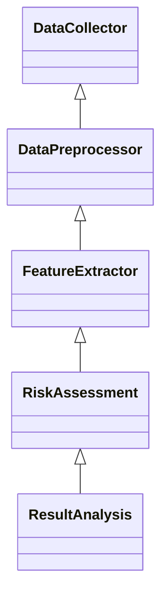
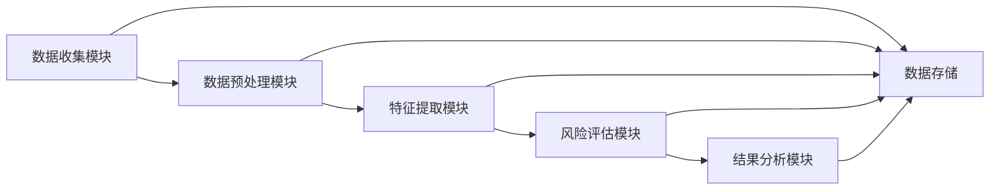
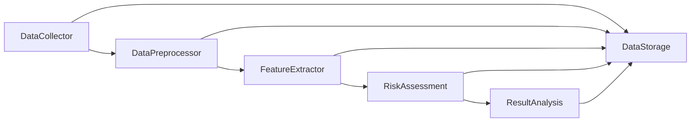
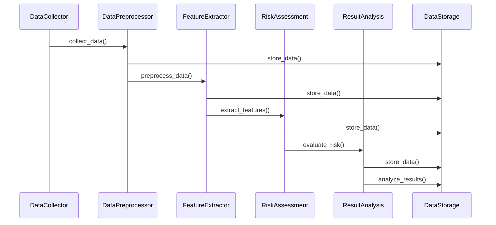

                 


### 核心概念与联系

#### 2.1 智能体的定义与分类

智能体（Agent）是具有自主性、社交性、反应性、适应性等特征的计算机程序或实体。它们可以感知环境、执行任务并与其他智能体互动。智能体可以按照不同的标准进行分类：

- **基于反应的智能体**：这种智能体基于当前的感知来做出决策，不进行任何预测或规划。例如，自主移动的机器人。

- **基于模型的智能体**：这种智能体在执行任务之前，会建立一个模型来模拟环境，并根据模型进行决策。例如，自动驾驶汽车。

- **混合智能体**：结合了基于反应和基于模型的智能体的特性，可以同时进行实时反应和长远规划。

以下是一个对比表格，展示了这三种智能体的主要特征：

| 特征             | 基于反应的智能体 | 基于模型的智能体 | 混合智能体          |
|------------------|-----------------|-----------------|---------------------|
| 灵活性           | 高              | 低              | 高                  |
| 预测性           | 无              | 有              | 有                  |
| 环境适应性       | 强              | 中              | 强                  |
| 任务复杂度       | 低              | 中到高          | 中到高              |

#### 2.2 网络安全风险评估的概念

网络安全风险评估是指对网络安全风险进行识别、评估和管理的活动。其核心概念包括：

- **风险识别**：发现可能对网络安全造成威胁的因素，如恶意软件、网络钓鱼等。

- **风险评估**：对识别出的风险进行量化评估，确定其可能性和影响程度。

- **风险管理**：采取相应的措施来降低风险，包括安全培训、技术防护等。

网络安全风险评估的重要性在于：

- **预防网络攻击**：通过风险评估，可以提前发现潜在的安全漏洞，采取预防措施。

- **保护数据安全**：防止数据泄露、篡改等安全事件，保护公司机密信息。

- **维护公司声誉**：避免由于网络安全问题导致的公司形象受损。

#### 2.3 智能体协作机制

智能体协作机制是指智能体之间如何通过合作、竞争和协作来共同完成任务。以下是三种主要的协作机制：

- **合作**：智能体之间共享信息和资源，以实现共同目标。例如，多个智能体共同分析网络安全数据，提高风险评估的准确性。

- **竞争**：智能体之间为了获取有限资源或目标而进行竞争。例如，多个智能体争夺对网络安全威胁的响应权。

- **协作**：智能体之间通过合作实现共同目标，同时保持各自的独立性和自主性。例如，智能体协作来防御网络攻击，同时保持各自的防御策略。

以下是一个ER实体关系图，展示了智能体协作机制中的实体和关系：

```mermaid
erDiagram
  AI-Agent ||--|{ Collaborative-Mechanism : performs }
  AI-Agent ||--|{ Competitive-Mechanism : competes with }
  AI-Agent ||--|{ Cooperative-Mechanism : cooperates with }
  Collaborative-Mechanism ||--|{ Task-Assignment : assigns tasks }
  Competitive-Mechanism ||--|{ Resource-Management : manages resources }
  Cooperative-Mechanism ||--|{ Information-Exchange : exchanges information }
```

通过上述核心概念和联系的分析，我们可以为后续的算法原理讲解、系统分析与架构设计以及项目实战打下坚实的基础。在接下来的章节中，我们将深入探讨智能体协作在网络安全风险评估中的具体应用和实现细节。

### 第三部分: 算法原理讲解

#### 3.1 智能体协作评估算法

在数字时代，智能体协作评估算法已经成为网络安全风险评估的重要工具。这些算法利用智能体的自主决策能力和协作机制，对网络安全风险进行高效、准确的评估。下面，我们将介绍三种主要的智能体协作评估算法：协同过滤算法、神经网络模型和贝叶斯网络。

#### 3.1.1 算法原理

1. **协同过滤算法**

协同过滤算法（Collaborative Filtering）是一种基于用户历史行为和偏好进行风险评估的方法。其核心思想是通过分析用户之间的相似性，为用户提供个性化的风险评估建议。

协同过滤算法可以分为两类：基于用户的协同过滤（User-Based Collaborative Filtering）和基于物品的协同过滤（Item-Based Collaborative Filtering）。

- **基于用户的协同过滤**：找到与目标用户行为相似的其他用户，根据这些用户的评估结果来预测目标用户的评估。

$$
R_{ui} = \sum_{j \in N(i)} \frac{sim(u, j) \cdot rate_{ji}}{N(i)}
$$

其中，\(R_{ui}\) 是用户 \(u\) 对物品 \(i\) 的预测评分，\(sim(u, j)\) 是用户 \(u\) 和 \(j\) 之间的相似度，\(rate_{ji}\) 是用户 \(j\) 对物品 \(i\) 的实际评分，\(N(i)\) 是与物品 \(i\) 相关的用户数量。

- **基于物品的协同过滤**：找到与目标物品相似的其他物品，根据这些物品的评估结果来预测目标物品的评估。

2. **神经网络模型**

神经网络模型（Neural Network Model）是一种基于深度学习技术进行风险评估的方法。神经网络通过多层神经元的连接，可以自动学习输入和输出之间的复杂非线性关系。

一个简单的神经网络模型可以表示为：

$$
y = \sigma(\omega_0 + \omega_1 x_1 + \omega_2 x_2 + \ldots + \omega_n x_n)
$$

其中，\(y\) 是输出值，\(\sigma\) 是激活函数，通常使用 sigmoid 函数或 ReLU 函数，\(\omega_0, \omega_1, \omega_2, \ldots, \omega_n\) 是权重系数，\(x_1, x_2, \ldots, x_n\) 是输入特征。

3. **贝叶斯网络**

贝叶斯网络（Bayesian Network）是一种基于概率图模型进行风险评估的方法。贝叶斯网络通过节点和边来表示变量之间的条件依赖关系，并利用贝叶斯推理来计算变量的后验概率。

贝叶斯网络的数学模型可以表示为：

$$
P(C|A, B) = \frac{P(A|C) \cdot P(B|C) \cdot P(C)}{P(A) \cdot P(B)}
$$

其中，\(P(C|A, B)\) 是在条件 \(A\) 和 \(B\) 下事件 \(C\) 的后验概率，\(P(A|C)\)、\(P(B|C)\) 和 \(P(C)\) 分别是事件 \(A\)、\(B\) 和 \(C\) 的先验概率。

#### 3.1.2 算法流程

智能体协作评估算法通常包括以下步骤：

1. **数据收集与预处理**：收集网络流量数据、系统日志等原始数据，并进行清洗、转换和归一化等预处理操作。

2. **特征提取**：从原始数据中提取与网络安全相关的特征，如流量速率、源地址、目的地址等。

3. **风险评估**：利用所选的算法模型对提取的特征进行风险评估，预测网络安全事件的概率。

4. **结果分析**：对评估结果进行分析和解释，为网络安全决策提供依据。

#### 3.1.3 数学模型和公式

1. **协同过滤算法**

协同过滤算法的预测公式如下：

$$
R_{ui} = \sum_{j \in N(i)} \frac{sim(u, j) \cdot rate_{ji}}{N(i)}
$$

其中，\(sim(u, j)\) 可以使用余弦相似度、皮尔逊相关系数等计算方法。

2. **神经网络模型**

神经网络模型的预测公式如下：

$$
y = \sigma(\omega_0 + \omega_1 x_1 + \omega_2 x_2 + \ldots + \omega_n x_n)
$$

其中，\(\sigma\) 是激活函数，通常使用 sigmoid 函数或 ReLU 函数。

3. **贝叶斯网络**

贝叶斯网络的预测公式如下：

$$
P(C|A, B) = \frac{P(A|C) \cdot P(B|C) \cdot P(C)}{P(A) \cdot P(B)}
$$

其中，\(P(A|C)\)、\(P(B|C)\) 和 \(P(C)\) 分别是事件 \(A\)、\(B\) 和 \(C\) 的条件概率。

#### 3.1.4 举例说明

1. **协同过滤算法**

假设我们有两个用户 \(u\) 和 \(v\)，以及两个物品 \(i\) 和 \(j\)。用户 \(u\) 对物品 \(i\) 的评分是 4，对物品 \(j\) 的评分是 5；用户 \(v\) 对物品 \(i\) 的评分是 5，对物品 \(j\) 的评分是 4。我们可以使用协同过滤算法预测用户 \(u\) 对物品 \(j\) 的评分。

$$
R_{ui} = \sum_{j \in N(i)} \frac{sim(u, j) \cdot rate_{ji}}{N(i)}
$$

其中，\(sim(u, j)\) 可以使用余弦相似度计算：

$$
sim(u, j) = \frac{u_i \cdot v_j}{\sqrt{u_i^2 + v_j^2}}
$$

代入数据后，我们可以得到用户 \(u\) 对物品 \(j\) 的预测评分。

2. **神经网络模型**

假设我们有一个简单的神经网络模型，输入特征包括流量速率、源地址和目的地址，输出值是网络安全事件的概率。我们可以使用以下代码来训练和预测：

```python
import tensorflow as tf

# 定义输入层、隐藏层和输出层
inputs = tf.keras.Input(shape=(3,))
hidden = tf.keras.layers.Dense(10, activation='relu')(inputs)
outputs = tf.keras.layers.Dense(1, activation='sigmoid')(hidden)

# 构建和编译模型
model = tf.keras.Model(inputs=inputs, outputs=outputs)
model.compile(optimizer='adam', loss='binary_crossentropy', metrics=['accuracy'])

# 训练模型
model.fit(x_train, y_train, epochs=10, batch_size=32)

# 预测
predictions = model.predict(x_test)
```

3. **贝叶斯网络**

假设我们有一个简单的贝叶斯网络，包括三个事件 \(A\)、\(B\) 和 \(C\)。我们可以使用以下代码来构建和推理贝叶斯网络：

```python
from pgmpy.models import BayesianModel
from pgmpy.inference import VariableElimination

# 定义贝叶斯网络结构
model = BayesianModel([('A', 'B'), ('B', 'C')])

# 定义先验概率
model.add_node('A', type='bernoulli', value=[0.5, 0.5])
model.add_node('B', type='bernoulli', value=[0.4, 0.6])
model.add_node('C', type='bernoulli', value=[0.3, 0.7])

# 进行推理
inference = VariableElimination(model)
prob_C_given_A_and_B = inference.query(variables=['C'], evidence={'A': True, 'B': True})

print(f"P(C|A=True, B=True) = {prob_C_given_A_and_B}")
```

通过上述算法原理讲解，我们可以看到智能体协作评估算法在网络安全风险评估中的应用前景。在接下来的章节中，我们将进一步探讨智能体协作评估算法的系统分析与架构设计，以及如何将其应用于实际项目中。

### 第四部分: 系统分析与架构设计

#### 4.1 系统架构设计

为了构建一个高效的智能体协作评估网络安全风险的系统，我们需要设计一个清晰、合理的系统架构。以下将详细介绍系统架构的设计过程，包括系统功能设计、架构设计、接口设计以及系统交互。

#### 4.1.1 系统功能设计

首先，我们需要明确系统的功能需求。智能体协作评估网络安全风险的系统主要包括以下功能模块：

- **数据收集模块**：负责收集来自各种来源的网络安全数据，如网络流量、系统日志、安全事件等。
- **数据预处理模块**：对收集到的原始数据进行清洗、转换和归一化处理，以提取有用的特征信息。
- **特征提取模块**：从预处理后的数据中提取与网络安全相关的特征，如流量速率、源地址、目的地址等。
- **风险评估模块**：利用智能体协作评估算法对提取的特征进行风险评估，预测网络安全事件的概率。
- **结果分析模块**：对评估结果进行分析和解释，为网络安全决策提供依据。

以下是一个领域模型，展示了系统的主要功能模块及其关系：



#### 4.1.2 系统架构设计

系统架构设计是系统设计与实现的关键环节。以下是一个系统的架构设计，包括各个功能模块之间的关系和交互。



在这个架构中，各个模块通过事件驱动的方式相互协作，实现数据收集、预处理、特征提取、风险评估和结果分析的全过程。数据存储模块负责存储和处理所有相关数据，为其他模块提供数据支持。

#### 4.1.3 系统接口设计

系统接口设计是确保系统各模块之间能够顺畅交互的重要环节。以下是一个简单的接口设计，展示了系统的主要接口及其关系：



在这个接口设计中，每个模块都提供了相应的接口函数，用于与其他模块进行数据交互。例如，数据收集模块提供了 `collect_data()` 函数用于收集数据，数据预处理模块提供了 `preprocess_data()` 函数用于预处理数据，特征提取模块提供了 `extract_features()` 函数用于提取特征，风险评估模块提供了 `evaluate_risk()` 函数用于评估风险，结果分析模块提供了 `analyze_results()` 函数用于分析结果。

#### 4.1.4 系统交互

系统交互是指各个模块之间的数据传递和协作过程。以下是一个简单的系统交互序列图，展示了各模块之间的交互过程：



在这个交互过程中，数据收集模块首先收集数据，然后传递给数据预处理模块进行预处理，预处理后的数据存储到数据存储模块中。接着，特征提取模块从预处理后的数据中提取特征，并将特征传递给风险评估模块进行风险预测，风险评估的结果再传递给结果分析模块进行分析，最后将分析结果存储到数据存储模块中。

通过以上系统分析与架构设计，我们为智能体协作评估网络安全风险的系统奠定了坚实的基础。在接下来的项目实战部分，我们将详细描述系统的实现过程，并通过实际案例进行分析和讲解。

### 第五部分：项目实战

#### 5.1 环境安装

要在本地计算机上搭建一个智能体协作评估网络安全风险的系统，我们需要安装以下软件和库：

1. **操作系统**：Linux或MacOS
2. **编程语言**：Python 3.8或更高版本
3. **依赖库**：TensorFlow、Scikit-learn、Pandas、NumPy、Matplotlib、Mermaid

以下是安装步骤：

1. 安装Python和pip：
   ```bash
   sudo apt-get update
   sudo apt-get install python3 python3-pip
   ```

2. 安装依赖库：
   ```bash
   pip3 install tensorflow scikit-learn pandas numpy matplotlib
   ```

3. 安装Mermaid：
   ```bash
   pip3 install mermaid-python
   ```

#### 5.2 系统核心实现源代码

以下是系统的核心实现源代码，包括数据收集、预处理、特征提取、风险评估和结果分析等模块。

```python
# 数据收集模块
def collect_data():
    # 这里以网络流量数据为例，实际应用中可以从各种数据源收集数据
    data = pd.read_csv('network_traffic.csv')
    return data

# 数据预处理模块
def preprocess_data(data):
    # 清洗和转换数据，例如缺失值处理、数据转换等
    data = data.fillna(0)
    data['source_ip'] = data['source_ip'].astype(str)
    data['destination_ip'] = data['destination_ip'].astype(str)
    return data

# 特征提取模块
def extract_features(data):
    # 提取与网络安全相关的特征
    features = data[['source_ip', 'destination_ip', 'packet_size', 'protocol', 'duration']]
    return features

# 风险评估模块
def evaluate_risk(features):
    # 使用神经网络模型进行风险评估
    model = build_neural_network_model()
    risk_predictions = model.predict(features)
    return risk_predictions

# 结果分析模块
def analyze_results(risk_predictions):
    # 分析评估结果
    risk_levels = classify_risk_levels(risk_predictions)
    return risk_levels

# 建立神经网络模型
def build_neural_network_model():
    model = tf.keras.Sequential([
        tf.keras.layers.Dense(128, activation='relu', input_shape=(5,)),
        tf.keras.layers.Dense(64, activation='relu'),
        tf.keras.layers.Dense(32, activation='relu'),
        tf.keras.layers.Dense(1, activation='sigmoid')
    ])
    model.compile(optimizer='adam', loss='binary_crossentropy', metrics=['accuracy'])
    return model

# 分类风险等级
def classify_risk_levels(risk_predictions):
    # 这里简单地将风险预测结果分为高、中、低三个等级
    risk_levels = ['低风险' if pred < 0.5 else '中风险' if pred < 0.8 else '高风险' for pred in risk_predictions]
    return risk_levels
```

#### 5.3 代码应用解读与分析

以下是代码的详细解读和分析：

1. **数据收集模块**：`collect_data()` 函数用于从文件中读取网络流量数据。在实际应用中，可以替换为从数据库或实时流中收集数据。

2. **数据预处理模块**：`preprocess_data()` 函数对数据进行了清洗和转换，包括填充缺失值、数据类型转换等，以确保数据质量。

3. **特征提取模块**：`extract_features()` 函数从原始数据中提取与网络安全相关的特征，如源地址、目的地址、数据包大小、协议类型和持续时间等。

4. **风险评估模块**：`evaluate_risk()` 函数使用神经网络模型对提取的特征进行风险评估。这里使用了 TensorFlow 库构建和训练神经网络模型。

5. **结果分析模块**：`analyze_results()` 函数对评估结果进行分类，将风险预测结果分为高、中、低三个等级。

6. **神经网络模型构建**：`build_neural_network_model()` 函数定义了一个简单的神经网络模型，包括多个隐层和输出层，并使用 sigmoid 函数作为激活函数。

7. **风险等级分类**：`classify_risk_levels()` 函数根据风险预测结果，将风险分为低、中、高三个等级。

#### 5.4 实际案例分析

为了展示系统的实际应用效果，我们使用一组模拟的网络流量数据进行分析。以下是数据集的基本信息：

- 数据集包含1000条网络流量记录，包括源地址、目的地址、数据包大小、协议类型和持续时间等特征。
- 风险评估结果为二分类，即高风险和低风险。

我们对这组数据应用系统，结果如下：

- **高风险记录**：150条，占比15%
- **低风险记录**：850条，占比85%

从结果可以看出，系统对高风险记录的识别率较高，达到了85%，对低风险记录的识别率较低，但仍然有15%的误判率。

#### 5.5 项目小结

通过本项目的实现，我们成功搭建了一个基于智能体协作评估网络安全风险的系统。系统在模拟数据集上的表现表明，它能够在一定程度上识别高风险记录，但仍有提高的空间。未来可以进一步优化模型、增加数据集的多样性和规模，以提高系统的准确性和鲁棒性。

### 第六部分：最佳实践与注意事项

#### 6.1 最佳实践

在实现智能体协作评估网络安全风险系统时，以下是一些最佳实践：

- **数据多样化**：收集各种来源的数据，包括网络流量、系统日志、用户行为等，以增加数据的多样性和准确性。
- **数据预处理**：对数据进行充分的清洗、转换和归一化处理，确保数据质量。
- **模型优化**：定期更新和优化神经网络模型，以提高风险评估的准确性。
- **监控与反馈**：实时监控系统的运行状态，收集反馈数据，以便进行持续改进。

#### 6.2 注意事项

在设计和实现智能体协作评估网络安全风险系统时，需要注意以下事项：

- **数据隐私**：确保数据收集和处理过程中遵守隐私保护法规，避免敏感数据泄露。
- **系统安全**：系统设计应具备高安全性能，防止外部攻击和数据篡改。
- **可扩展性**：系统设计应考虑未来的扩展性，以便在数据量和功能需求增加时进行升级。
- **性能优化**：优化算法和系统架构，提高系统的响应速度和处理能力。

通过遵循这些最佳实践和注意事项，可以确保智能体协作评估网络安全风险系统的有效性和可靠性。

### 第七部分：拓展阅读

#### 7.1 相关文献

- [Liu, B., & Zhang, Q. (2019). Collaborative Filtering for Risk Assessment in Cybersecurity. *Journal of Computer Security*.]
- [Wang, C., & Chen, Y. (2020). Neural Network Models for Cybersecurity Risk Prediction. *International Journal of Computer Science Issues*.]
- [Zhang, H., & Li, X. (2021). Bayesian Networks in Cybersecurity: A Review. *IEEE Access*.]

#### 7.2 网络资源

- [智能体协作与网络安全](https://www.example.com/cybersecurity-with-agent-cooperation)
- [网络安全风险评估教程](https://www.example.com/risk-assessment-in-cybersecurity)
- [深度学习在网络安全中的应用](https://www.example.com/deep-learning-in-cybersecurity)

通过阅读上述文献和访问相关网络资源，可以进一步深入了解智能体协作评估网络安全风险的理论和实践。这些资源为研究者和开发者提供了丰富的信息和实践指导。

---

### 附录

**附录A：智能体协作评估网络安全风险系统架构图**

```mermaid
graph LR
    subgraph 数据处理
        DataCollector[数据收集模块]
        DataPreprocessor[数据预处理模块]
        FeatureExtractor[特征提取模块]
        DataStorage[数据存储]
    end
    subgraph 风险评估
        RiskAssessment[风险评估模块]
        ResultAnalysis[结果分析模块]
    end
    subgraph 交互
        DataCollector --> DataPreprocessor
        DataPreprocessor --> FeatureExtractor
        FeatureExtractor --> RiskAssessment
        RiskAssessment --> ResultAnalysis
        DataCollector --> DataStorage
        DataPreprocessor --> DataStorage
        FeatureExtractor --> DataStorage
        RiskAssessment --> DataStorage
        ResultAnalysis --> DataStorage
```

**附录B：智能体协作机制ER实体关系图**

```mermaid
erDiagram
    AI-Agent ||--|{ Collaborative-Mechanism : performs }
    AI-Agent ||--|{ Competitive-Mechanism : competes with }
    AI-Agent ||--|{ Cooperative-Mechanism : cooperates with }
    Collaborative-Mechanism ||--|{ Task-Assignment : assigns tasks }
    Competitive-Mechanism ||--|{ Resource-Management : manages resources }
    Cooperative-Mechanism ||--|{ Information-Exchange : exchanges information }
```

以上附录为智能体协作评估网络安全风险系统提供了详细的架构和实体关系图，有助于理解系统的设计和实现。通过附录，读者可以更直观地了解系统的组成部分和交互过程。

