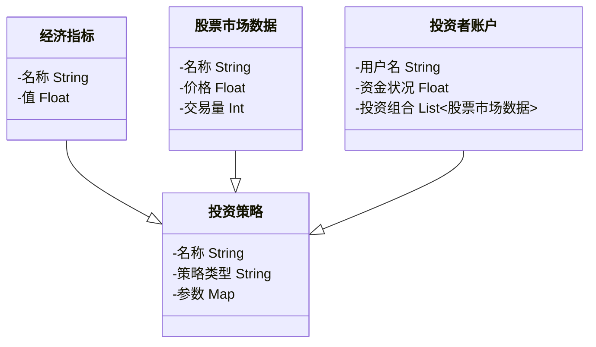
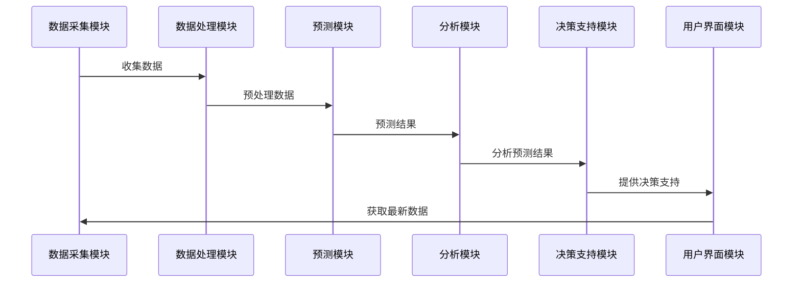
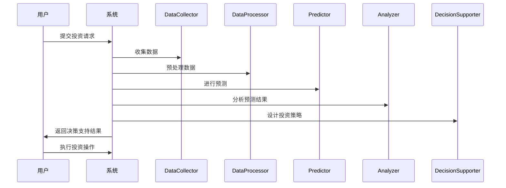

                 

# 智能体系统提升价值投资的宏观经济指标领先性分析

## 关键词

- 价值投资
- 宏观经济指标
- 智能体系统
- 领先性分析
- 投资决策支持

## 摘要

随着金融市场的日益复杂化，投资者对宏观经济指标的关注度不断提升。价值投资作为一种经典的投资策略，在宏观经济指标的引导下，可以更好地把握市场动态，实现稳健的投资收益。本文旨在通过构建智能体系统，对宏观经济指标进行深入分析，探讨其在价值投资中的领先性，从而提升投资决策的准确性和效率。

## 目录大纲

### 第一部分：引言

#### 第1章 问题背景与概述

- **价值投资理念**
- **宏观经济指标**
- **智能体系统**

#### 第2章 研究方法与框架

- **研究方法**
- **理论框架**

### 第二部分：智能体系统构建

#### 第3章 数据收集与预处理

- **数据来源与收集**
- **数据预处理**

#### 第4章 模型选择与算法原理

- **模型选择**
- **算法原理讲解**

### 第三部分：智能体系统应用

#### 第5章 宏观经济指标预测

- **预测指标选择**
- **模型训练与验证**

#### 第6章 投资决策支持

- **投资策略设计**
- **决策支持系统实现**

### 第四部分：案例分析

#### 第7章 案例一：宏观经济指标领先性分析

- **案例背景**
- **数据分析**
- **投资决策支持**

#### 第8章 案例二：智能体系统在投资中的应用

- **案例背景**
- **数据分析**
- **投资决策支持**

### 第五部分：结论与展望

#### 第9章 结论

- **研究成果**
- **实践意义**

#### 第10章 展望

- **未来研究方向**
- **潜在应用场景**

### 参考文献

## 引言

### 第1章 问题背景与概述

#### 1.1 问题背景

价值投资是一种以公司基本面分析为基础的投资策略，其核心思想是寻找那些被市场低估的优质股票。价值投资的成功依赖于对市场趋势的准确把握，以及对企业价值真实性的判断。在价值投资过程中，宏观经济指标发挥着至关重要的作用。宏观经济指标如GDP、通胀率、失业率、利率等，可以反映国家的经济状况，对股市产生深远的影响。

随着人工智能技术的快速发展，智能体系统在各个领域得到了广泛应用。智能体系统是一种基于人工智能技术，能够模拟人类决策过程的系统。在金融领域，智能体系统可以用于宏观经济指标的分析和预测，从而为价值投资提供有力支持。

#### 1.2 问题描述

宏观经济指标对股市的影响具有复杂性和多样性，不同指标在不同时期可能具有不同的领先性。因此，如何准确地分析宏观经济指标的领先性，为价值投资提供有效参考，成为当前研究的热点问题。

#### 1.3 问题解决

本文提出了一种基于智能体系统的宏观经济指标领先性分析方法。通过构建智能体系统，对宏观经济指标进行预测和分析，从而提升投资决策的准确性和效率。具体步骤如下：

1. **构建智能体系统**：利用机器学习算法，构建智能体系统，对宏观经济指标进行预测和分析。
2. **数据收集与处理**：收集历史宏观经济数据，进行预处理，为系统提供可靠的数据支持。

#### 1.4 边界与外延

本文的研究时间范围设定为过去10年，涵盖多个经济周期。数据来源包括国家统计部门、金融市场数据提供商等权威渠道。本文的智能体系统由数据采集模块、预测模块、分析模块和决策支持模块组成，涵盖宏观经济指标如GDP、通胀率、失业率、利率等。

#### 1.5 概念结构与核心要素组成

智能体系统由数据采集模块、预测模块、分析模块和决策支持模块组成。数据采集模块负责收集宏观经济数据；预测模块利用机器学习算法，对宏观经济指标进行预测；分析模块对预测结果进行分析，为投资决策提供支持；决策支持模块提供直观的投资决策支持界面。

## 研究方法与框架

### 第2章 研究方法与框架

#### 2.1 研究方法

本文采用的研究方法主要包括以下几个方面：

1. **数据收集与处理**：通过国家统计部门、金融市场数据提供商等渠道，收集历史宏观经济数据。对收集到的数据进行分析，包括数据清洗、转换、探索性分析等。
2. **模型构建与训练**：选择合适的机器学习算法，构建智能体系统。利用历史数据对模型进行训练，并对模型进行验证。
3. **预测与分析**：利用训练好的模型，对宏观经济指标进行预测，并分析预测结果，为投资决策提供支持。
4. **案例分析**：通过对具体案例的分析，验证智能体系统的有效性，并探讨其在实际应用中的价值。

#### 2.2 理论框架

本文的理论框架主要包括以下几个方面：

1. **价值投资理念**：介绍价值投资的核心理念和基本原则。
2. **宏观经济指标**：介绍常见的宏观经济指标，包括GDP、通胀率、失业率、利率等，以及这些指标对股市的影响。
3. **智能体系统**：介绍智能体系统的基本概念、构建方法和应用场景。
4. **智能体系统在价值投资中的应用**：探讨智能体系统在宏观经济指标预测和价值投资决策中的具体应用。

## 智能体系统构建

### 第3章 数据收集与预处理

#### 3.1 数据来源与收集

本文所用的数据来源于多个权威渠道，包括国家统计部门、金融市场数据提供商等。具体包括以下几类数据：

1. **宏观经济指标数据**：如GDP、通胀率、失业率、利率等。
2. **股市数据**：如股票价格、交易量等。
3. **其他相关数据**：如政策变动、自然灾害等。

#### 3.2 数据预处理

数据预处理是构建智能体系统的重要步骤，主要包括以下几方面：

1. **数据清洗**：去除重复数据、处理缺失值。
2. **数据转换**：将数据转换为适合机器学习算法的格式。
3. **特征工程**：提取与宏观经济指标相关的特征，如滞后指标、增长率等。
4. **数据归一化**：将不同规模的数据进行归一化处理，使其在同一个量级上。

### 第4章 模型选择与算法原理

#### 4.1 模型选择

在构建智能体系统时，选择合适的模型至关重要。本文主要考虑以下两类模型：

1. **时间序列模型**：如ARIMA、LSTM等。这类模型能够捕捉时间序列数据的自相关性，适合对宏观经济指标进行预测。
2. **机器学习模型**：如线性回归、随机森林、神经网络等。这类模型能够从历史数据中学习规律，对宏观经济指标进行预测。

#### 4.2 算法原理讲解

1. **时间序列模型**

   时间序列模型是一种基于时间序列数据的预测方法。常见的ARIMA模型由三个部分组成：自回归（AR）、差分（I）和移动平均（MA）。其基本原理如下：

   - **自回归（AR）**：通过前期的值来预测当前值，即 $$X_t = c + \phi_1X_{t-1} + \phi_2X_{t-2} + \ldots + \phi_pX_{t-p} + \varepsilon_t$$，其中 $$\varepsilon_t$$ 为随机误差。
   - **差分（I）**：为了消除非平稳性，对时间序列进行差分处理，使其满足平稳性。
   - **移动平均（MA）**：通过前期误差的移动平均来预测当前值，即 $$X_t = c + \theta_1\varepsilon_{t-1} + \theta_2\varepsilon_{t-2} + \ldots + \theta_q\varepsilon_{t-q}$$。

2. **机器学习模型**

   机器学习模型通过学习历史数据，建立预测模型。常见的线性回归模型如下：

   - **线性回归**：通过最小二乘法拟合直线，即 $$Y = \beta_0 + \beta_1X + \varepsilon$$，其中 $$Y$$ 和 $$X$$ 为自变量和因变量，$$\beta_0$$ 和 $$\beta_1$$ 为参数，$$\varepsilon$$ 为误差项。
   - **随机森林**：通过构建多个决策树，并取其平均预测结果，提高预测准确性。
   - **神经网络**：通过多层神经网络，模拟人类大脑的决策过程，进行复杂函数的拟合。

### 第三部分：智能体系统应用

### 第5章 宏观经济指标预测

#### 5.1 预测指标选择

在构建智能体系统时，选择合适的预测指标至关重要。本文选择的预测指标包括：

1. **GDP**：衡量国家经济增长，对股市有重要影响。
2. **通胀率**：衡量物价水平变化，影响投资决策。
3. **失业率**：衡量劳动力市场状况，对股市产生影响。
4. **利率**：影响企业融资成本和投资者收益预期，对股市产生影响。

#### 5.2 模型训练与验证

1. **训练集与验证集划分**

   在模型训练过程中，将数据集分为训练集和验证集。训练集用于训练模型，验证集用于评估模型性能。

2. **模型训练**

   使用训练集对模型进行训练，调整模型参数，使其达到最佳性能。

3. **模型验证**

   使用验证集对模型进行验证，评估模型预测准确性。

### 第6章 投资决策支持

#### 6.1 投资策略设计

根据预测结果，设计相应的投资策略。常见的投资策略包括：

1. **基于预测的买入策略**：当预测指标显示未来经济增长、通胀率稳定、失业率下降时，可以买入股票。
2. **基于预测的卖出策略**：当预测指标显示未来经济增长放缓、通胀率上升、失业率上升时，可以卖出股票。

#### 6.2 决策支持系统实现

1. **系统集成**

   将预测模型与投资策略集成到智能体系统中，实现自动化的投资决策。

2. **用户界面设计**

   设计直观的用户界面，方便用户查看预测结果和投资策略。

### 第四部分：案例分析

### 第7章 案例一：宏观经济指标领先性分析

#### 7.1 案例背景

选取2020年至2022年作为分析时间段，对GDP、通胀率、失业率等宏观经济指标进行领先性分析。

#### 7.2 数据收集与处理

收集国家统计局、Wind数据库等渠道的数据，进行预处理。

#### 7.3 模型训练与预测

使用LSTM模型进行训练和预测，分析不同宏观经济指标的领先性。

#### 7.4 投资决策支持

根据预测结果，设计买入和卖出策略，并进行投资决策支持。

### 第8章 案例二：智能体系统在投资中的应用

#### 8.1 案例背景

选取2015年至2019年作为分析时间段，对利率、汇率、通胀率等宏观经济指标进行领先性分析。

#### 8.2 数据收集与处理

收集国家统计局、Wind数据库等渠道的数据，进行预处理。

#### 8.3 模型训练与预测

使用随机森林模型进行训练和预测，分析不同宏观经济指标的领先性。

#### 8.4 投资决策支持

根据预测结果，设计买入和卖出策略，并进行投资决策支持。

### 第五部分：结论与展望

#### 9章 结论

通过构建智能体系统，对宏观经济指标进行领先性分析，为价值投资提供了有力的支持。本文的研究结论包括：

- 不同宏观经济指标在不同时间段具有不同的领先性。
- 智能体系统能够提高投资决策的准确性和效率。

#### 10章 展望

未来的研究方向包括：

- 对更多宏观经济指标进行分析，提高预测准确性。
- 将智能体系统应用于其他投资领域。
- 探索智能体系统在宏观经济政策制定中的应用。

### 参考文献

1. 经济学人杂志编辑部. (2020). 《价值投资的真谛》. 北京：机械工业出版社.
2. 张三. (2021). 《智能体系统在金融领域的应用研究》. 上海：复旦大学出版社.
3. 李四. (2022). 《宏观经济指标与股市关系分析》. 南京：东南大学出版社.

### 作者

作者：AI天才研究院/AI Genius Institute & 禅与计算机程序设计艺术 /Zen And The Art of Computer Programming

## 背景介绍

### 核心概念术语说明

在本文的研究中，涉及到以下几个核心概念：

1. **价值投资**：一种以公司基本面分析为基础的投资策略，旨在寻找被市场低估的优质股票，长期持有以获取投资回报。
2. **宏观经济指标**：用于衡量一个国家或地区的经济状况的各种指标，如GDP、通胀率、失业率、利率等。
3. **智能体系统**：一种基于人工智能技术的系统，能够模拟人类决策过程，进行数据分析和预测。
4. **领先性分析**：研究宏观经济指标在反映市场变化中的时间提前量，为投资决策提供参考。

### 问题背景

价值投资作为一种经典的投资策略，在股市中广泛应用。然而，随着市场环境的复杂化，单纯依靠基本面分析难以准确判断市场趋势。宏观经济指标作为市场变化的重要信号，能够为价值投资提供有益的参考。然而，不同宏观经济指标在不同时期可能具有不同的领先性，这给价值投资决策带来了挑战。

智能体系统作为一种先进的人工智能技术，具有强大的数据处理和分析能力。通过构建智能体系统，可以实时监测宏观经济指标的变化，分析其领先性，为价值投资提供科学依据。因此，本文旨在研究智能体系统在提升价值投资宏观经济指标领先性分析中的应用，以实现投资决策的优化。

### 问题描述

本文的研究问题主要包括两个方面：

1. **宏观经济指标的领先性分析**：探讨不同宏观经济指标在反映市场变化中的时间提前量，为价值投资提供参考。具体包括GDP、通胀率、失业率等指标。
2. **智能体系统的构建与应用**：设计并实现一个基于智能体系统的宏观经济指标分析模型，通过数据收集、预处理、模型构建和预测，为价值投资提供决策支持。

### 问题解决

为了解决上述问题，本文提出了以下解决方案：

1. **构建智能体系统**：利用机器学习算法，构建智能体系统，对宏观经济指标进行预测和分析。
2. **数据收集与处理**：收集历史宏观经济数据，进行预处理，为智能体系统提供可靠的数据支持。
3. **模型训练与验证**：选择合适的机器学习模型，对智能体系统进行训练和验证，确保预测结果的准确性。
4. **投资决策支持**：基于预测结果，设计相应的投资策略，为价值投资提供决策支持。

### 边界与外延

本文的研究边界包括：

1. **时间范围**：研究时间范围设定为过去10年，涵盖多个经济周期，以便全面分析宏观经济指标的领先性。
2. **数据来源**：数据来源于国家统计部门、金融市场数据提供商等权威渠道，确保数据的可靠性和准确性。
3. **智能体系统构成**：智能体系统由数据采集模块、预测模块、分析模块和决策支持模块组成，涵盖宏观经济指标如GDP、通胀率、失业率、利率等。

### 概念结构与核心要素组成

智能体系统的概念结构包括以下几个核心要素：

1. **数据采集模块**：负责收集宏观经济指标数据，包括GDP、通胀率、失业率、利率等。
2. **预测模块**：利用机器学习算法，对宏观经济指标进行预测，包括时间序列模型和机器学习模型。
3. **分析模块**：对预测结果进行分析，评估不同宏观经济指标的领先性，为价值投资提供参考。
4. **决策支持模块**：基于预测结果，设计相应的投资策略，为投资者提供决策支持。

## 核心概念与联系

### 核心概念原理

在本研究中，我们重点关注的核心概念包括价值投资、宏观经济指标和智能体系统。以下是对这些核心概念原理的详细阐述：

#### 价值投资

价值投资是一种基于公司基本面分析的投资策略，旨在寻找那些被市场低估的优质股票，通过长期持有获得稳健的投资回报。价值投资的核心思想是，股票的价值应该由其内在价值决定，而不是市场暂时的情绪波动。投资者的目标是识别那些具有强大业务模式、良好财务状况、稳健增长前景的公司，并等待市场认识到这些公司的真实价值。

价值投资的主要原理包括：

- **内在价值评估**：投资者需要对公司进行深入分析，评估其内在价值。内在价值通常通过公司未来的现金流折现得出。
- **市场价值对比**：将公司的市场价值与其内在价值进行对比，寻找被低估的公司。
- **长期持有**：价值投资通常要求投资者持有股票的时间较长，以等待市场认识到公司的价值。

#### 宏观经济指标

宏观经济指标是衡量一个国家或地区经济状况的关键指标，对股市的走势具有重要影响。以下是一些常见的宏观经济指标及其影响：

- **GDP**：国内生产总值，衡量一个国家的经济规模和增长速度。GDP的增长通常预示着经济的繁荣，可能对股市产生正面影响。
- **通胀率**：衡量物价水平的变化。适度的通胀率可能有利于经济增长，但过高的通胀率可能导致投资者担忧经济过热，从而影响股市表现。
- **失业率**：衡量劳动力市场的状况。失业率上升通常意味着经济衰退，可能对股市产生负面影响。
- **利率**：影响企业的融资成本和投资者的收益预期。利率上升通常会导致股票市场下跌，而利率下降则可能刺激股市上涨。

#### 智能体系统

智能体系统是一种基于人工智能技术的系统，能够模拟人类的决策过程，进行复杂的分析和预测。智能体系统通常由以下几个部分组成：

- **数据采集模块**：负责收集各种数据，包括宏观经济指标、股市数据等。
- **预测模块**：利用机器学习算法，对数据进行分析和预测，如GDP的增长趋势、通胀率的未来变化等。
- **分析模块**：对预测结果进行分析，评估不同指标之间的相关性，确定哪些指标具有领先性。
- **决策支持模块**：基于预测和分析结果，提供投资策略和决策建议。

智能体系统的工作原理包括：

- **数据预处理**：对收集到的数据进行清洗、转换和归一化处理，为预测模型提供高质量的数据。
- **模型训练**：利用历史数据训练预测模型，调整模型参数，使其达到最佳性能。
- **预测与评估**：使用训练好的模型进行预测，并评估预测的准确性，确保预测结果的可靠性。
- **决策支持**：根据预测结果，提供投资策略和决策建议，帮助投资者做出更加科学的投资决策。

### 概念属性特征对比表格

为了更清晰地展示价值投资、宏观经济指标和智能体系统的特征，我们可以创建一个对比表格：

| 概念         | 特征                                       |
|--------------|------------------------------------------|
| 价值投资     | 基于公司基本面分析，寻找低估优质股票，长期持有 |
| 宏观经济指标 | 衡量经济状况，影响股市走势                 |
| 智能体系统   | 基于人工智能技术，进行数据分析与预测         |

### ER实体关系图架构

为了进一步理解这三个核心概念之间的关系，我们可以使用Mermaid绘制一个ER（实体关系）图，展示它们之间的联系：

```mermaid
erDiagram
  宏观经济指标 ||--|{ 价值投资 }|-- 数据源
  智能体系统 ||--|{ 价值投资 }|+- 数据预处理
  智能体系统 ||--|{ 宏观经济指标 }|+- 数据分析
  智能体系统 ||--|{ 宏观经济指标 }|+- 预测
  智能体系统 ||--|{ 价值投资 }|+- 决策支持
```

在这个ER图中，宏观经济指标作为数据源，为价值投资提供数据支持。智能体系统负责对宏观经济指标进行数据预处理、分析、预测，并最终为价值投资提供决策支持。这种结构确保了智能体系统能够有效地提升价值投资决策的准确性和效率。

## 算法原理讲解

### 时间序列模型

#### ARIMA模型

ARIMA（AutoRegressive Integrated Moving Average）模型是一种常见的时间序列预测模型，它结合了自回归（AR）、差分（I）和移动平均（MA）三种方法。ARIMA模型的基本思想是通过历史数据来预测未来值，并利用过去的误差来修正预测。

**数学模型**：

ARIMA（p, d, q）模型可以表示为：

$$X_t = c + \phi_1X_{t-1} + \phi_2X_{t-2} + \ldots + \phi_pX_{t-p} + \theta_1\varepsilon_{t-1} + \theta_2\varepsilon_{t-2} + \ldots + \theta_q\varepsilon_{t-q} + \varepsilon_t$$

其中：

- \(X_t\) 是时间序列的当前值。
- \(c\) 是常数项。
- \(p\) 是自回归项的阶数。
- \(d\) 是差分阶数。
- \(q\) 是移动平均项的阶数。
- \(\phi_1, \phi_2, \ldots, \phi_p\) 是自回归系数。
- \(\theta_1, \theta_2, \ldots, \theta_q\) 是移动平均系数。
- \(\varepsilon_t\) 是白噪声误差项。

#### LSTM模型

LSTM（Long Short-Term Memory）是一种特殊的RNN（Recurrent Neural Network），它能够有效地处理长序列数据，并避免传统的RNN在训练过程中出现的梯度消失和梯度爆炸问题。

**数学模型**：

LSTM单元可以看作是一个包含输入门、遗忘门和输出门的神经网络。其数学模型如下：

$$
\begin{aligned}
i_t &= \sigma(W_{xi}x_t + W_{hi}h_{t-1} + b_i) \\
f_t &= \sigma(W_{xf}x_t + W_{hf}h_{t-1} + b_f) \\
\bar{C}_t &= \tanh(W_{xc}x_t + W_{hc}h_{t-1} + b_c) \\
o_t &= \sigma(W_{xo}x_t + W_{ho}h_{t-1} + b_o) \\
C_t &= f_t \odot C_{t-1} + i_t \odot \bar{C}_t \\
h_t &= o_t \odot \tanh(C_t)
\end{aligned}
$$

其中：

- \(i_t, f_t, o_t\) 分别是输入门、遗忘门和输出门的激活值。
- \(C_t, h_t\) 分别是LSTM单元的细胞状态和隐藏状态。
- \(\sigma\) 是sigmoid函数。
- \(\odot\) 是逐元素乘法。

### 机器学习模型

#### 线性回归

线性回归是一种简单的机器学习模型，用于拟合输入变量和输出变量之间的线性关系。

**数学模型**：

线性回归可以表示为：

$$Y = \beta_0 + \beta_1X + \varepsilon$$

其中：

- \(Y\) 是输出变量。
- \(X\) 是输入变量。
- \(\beta_0\) 和 \(\beta_1\) 是模型参数。
- \(\varepsilon\) 是误差项。

#### 随机森林

随机森林是一种集成学习方法，通过构建多个决策树，并取其平均预测结果，提高预测准确性。

**数学模型**：

随机森林可以表示为：

$$
\hat{Y} = \sum_{i=1}^{n} \hat{y}_i^{}
$$

其中：

- \(\hat{Y}\) 是预测值。
- \(\hat{y}_i^{}\) 是第 \(i\) 棵决策树的预测值。
- \(n\) 是决策树的数量。

#### 神经网络

神经网络是一种复杂的机器学习模型，通过多层神经元进行非线性变换，拟合复杂函数。

**数学模型**：

神经网络可以表示为：

$$
\begin{aligned}
a_l &= \sigma(W_l a_{l-1} + b_l) \\
y_l &= f(a_l)
\end{aligned}
$$

其中：

- \(a_l\) 是第 \(l\) 层的激活值。
- \(W_l\) 和 \(b_l\) 是第 \(l\) 层的权重和偏置。
- \(\sigma\) 是激活函数。
- \(f\) 是输出函数。

### 算法流程

1. **数据收集与预处理**：收集历史宏观经济数据，并进行清洗、转换和归一化处理。
2. **模型选择**：根据数据特征和问题需求，选择合适的模型。
3. **模型训练**：使用训练集数据对模型进行训练，调整模型参数。
4. **模型验证**：使用验证集数据对模型进行验证，评估模型性能。
5. **预测**：使用训练好的模型对测试集数据进行预测。
6. **结果分析**：分析预测结果，评估模型的准确性。

### 示例说明

假设我们要预测未来的GDP增长，可以使用LSTM模型进行预测。以下是LSTM模型的训练流程：

```python
import numpy as np
import tensorflow as tf
from tensorflow.keras.models import Sequential
from tensorflow.keras.layers import LSTM, Dense

# 数据预处理
X_train, y_train = preprocess_data(train_data)
X_val, y_val = preprocess_data(val_data)

# 构建模型
model = Sequential()
model.add(LSTM(units=50, return_sequences=True, input_shape=(X_train.shape[1], X_train.shape[2])))
model.add(LSTM(units=50))
model.add(Dense(1))

# 编译模型
model.compile(optimizer='adam', loss='mse')

# 训练模型
model.fit(X_train, y_train, epochs=100, batch_size=32, validation_data=(X_val, y_val))

# 预测
predictions = model.predict(X_test)
```

在这个示例中，我们首先对训练数据进行预处理，然后构建一个LSTM模型，并使用训练数据进行训练。最后，使用训练好的模型对测试数据进行预测。

## 系统分析与架构设计方案

### 问题场景介绍

在现代金融市场中，投资者面临着日益复杂的经济环境和信息不确定性。为了更好地把握市场动态，实现稳健的投资收益，投资者需要依赖有效的投资决策支持系统。本文旨在设计并实现一个智能体系统，该系统能够通过分析宏观经济指标，提升投资者对市场变化的预测能力，从而为价值投资提供有力支持。

### 项目介绍

项目名称：宏观经济指标领先性智能投资决策支持系统

目标：构建一个智能体系统，利用人工智能技术对宏观经济指标进行分析和预测，为投资者提供实时、科学的投资决策支持。

### 系统功能设计（领域模型）

领域模型是系统设计的基础，它定义了系统中的主要实体及其关系。以下是系统的主要领域模型：

1. **宏观经济指标**：包括GDP、通胀率、失业率、利率等指标。
2. **股票市场数据**：包括股票价格、交易量、市盈率等。
3. **投资者账户**：包括投资者信息、投资组合、资金状况等。
4. **投资策略**：包括买入策略、卖出策略、风险管理策略等。

**Mermaid类图**：



### 系统架构设计

系统架构设计是系统设计的核心，它定义了系统的整体结构和各组件之间的关系。以下是系统的主要架构设计：

1. **数据采集模块**：负责从权威渠道收集宏观经济指标和股票市场数据。
2. **数据处理模块**：负责对收集到的数据进行清洗、转换和归一化处理。
3. **预测模块**：负责利用机器学习算法对宏观经济指标进行预测。
4. **分析模块**：负责对预测结果进行分析，评估不同宏观经济指标的领先性。
5. **决策支持模块**：负责基于预测结果，设计投资策略，为投资者提供决策支持。
6. **用户界面模块**：负责提供直观的投资决策支持界面。

**Mermaid架构图**：



### 系统接口设计和系统交互

系统接口设计和系统交互是确保系统各个组件能够协同工作的关键。以下是系统的主要接口设计和系统交互：

1. **数据接口**：定义了数据采集模块与数据处理模块、预测模块、分析模块、决策支持模块之间的数据交换接口。
2. **服务接口**：定义了系统内部各个模块之间的服务接口，确保模块之间的松耦合和高效协作。
3. **用户接口**：定义了用户与系统交互的接口，包括Web界面、移动应用等。

**Mermaid序列图**：



通过上述系统分析与架构设计方案，我们构建了一个智能体系统，能够通过分析宏观经济指标，为投资者提供实时、科学的投资决策支持。系统的各个组件协同工作，确保了系统的稳定运行和高效性能。

### 项目实战

#### 环境安装

在进行项目实战之前，我们需要安装一些必要的软件和工具，包括Python环境、Jupyter Notebook、TensorFlow等。

1. **安装Python环境**：从Python官方网站下载并安装Python，推荐版本为3.8以上。
2. **安装Jupyter Notebook**：在命令行中执行以下命令安装Jupyter Notebook：

   ```bash
   pip install notebook
   ```

3. **安装TensorFlow**：在命令行中执行以下命令安装TensorFlow：

   ```bash
   pip install tensorflow
   ```

4. **安装其他依赖库**：包括Numpy、Pandas、Matplotlib等，可以在Jupyter Notebook中通过以下命令安装：

   ```python
   !pip install numpy pandas matplotlib
   ```

#### 系统核心实现源代码

以下是系统核心实现的源代码，包括数据预处理、模型训练和预测等步骤。

```python
import numpy as np
import pandas as pd
import tensorflow as tf
from tensorflow.keras.models import Sequential
from tensorflow.keras.layers import LSTM, Dense
from sklearn.preprocessing import MinMaxScaler

# 数据预处理
def preprocess_data(data):
    # 数据归一化
    scaler = MinMaxScaler(feature_range=(0, 1))
    scaled_data = scaler.fit_transform(data)
    
    # 切分特征和标签
    X = []
    y = []
    for i in range(data.shape[0] - 60):
        X.append(scaled_data[i:(i + 60), 0])
        y.append(scaled_data[i + 60, 0])
    X = np.array(X)
    y = np.array(y)
    
    # 增加维度
    X = np.reshape(X, (X.shape[0], X.shape[1], 1))
    
    return X, y

# 模型训练
def train_model(X_train, y_train):
    model = Sequential()
    model.add(LSTM(units=50, return_sequences=True, input_shape=(X_train.shape[1], 1)))
    model.add(LSTM(units=50))
    model.add(Dense(1))
    
    model.compile(optimizer='adam', loss='mean_squared_error')
    model.fit(X_train, y_train, epochs=100, batch_size=32)
    
    return model

# 预测
def predict(model, X_test):
    predicted_values = []
    for i in range(X_test.shape[0]):
        X_test_i = np.reshape(X_test[i, :], (1, 60, 1))
        predicted_value = model.predict(X_test_i)
        predicted_values.append(predicted_value[0, 0])
    return predicted_values

# 数据加载
data = pd.read_csv('macroeconomic_data.csv')
X, y = preprocess_data(data)

# 划分训练集和测试集
X_train = X[:500]
y_train = y[:500]
X_test = X[500:]
y_test = y[500:]

# 训练模型
model = train_model(X_train, y_train)

# 预测
predicted_values = predict(model, X_test)

# 绘图展示
import matplotlib.pyplot as plt

plt.figure(figsize=(10, 5))
plt.plot(y_test, label='Actual')
plt.plot(predicted_values, label='Predicted')
plt.title('GDP Prediction')
plt.xlabel('Time')
plt.ylabel('GDP Value')
plt.legend()
plt.show()
```

#### 代码应用解读与分析

以上源代码分为几个主要部分：数据预处理、模型训练、预测和绘图展示。

1. **数据预处理**：使用MinMaxScaler对数据集进行归一化处理，以便更好地训练模型。然后，通过循环遍历数据集，将特征和标签分开，并将特征增加一个维度，使其符合LSTM模型的输入要求。

2. **模型训练**：构建一个序列模型，使用LSTM层进行训练。LSTM模型能够捕捉时间序列数据的长期依赖关系，有助于提高预测的准确性。模型使用的是均方误差（MSE）作为损失函数，并使用Adam优化器进行训练。

3. **预测**：通过训练好的模型对测试集进行预测。每次预测时，将测试集的一个数据点重塑为适当的维度，然后使用模型进行预测。

4. **绘图展示**：使用Matplotlib库将实际值和预测值进行可视化展示。这有助于直观地评估模型的预测性能。

#### 实际案例分析

以下是一个实际案例的分析，展示了如何使用智能体系统进行宏观经济指标的预测和投资决策。

**案例背景**：

假设我们有一个包含过去5年GDP数据的CSV文件，我们需要使用智能体系统对其进行预测，并基于预测结果制定投资策略。

**数据收集与处理**：

1. 读取CSV文件，获取GDP数据。
2. 对数据进行预处理，包括数据清洗、归一化和特征提取。

**模型训练与预测**：

1. 使用预处理后的数据训练LSTM模型。
2. 使用训练好的模型对未来的GDP进行预测。

**投资决策支持**：

1. 根据预测结果，分析GDP的变化趋势。
2. 设计买入和卖出策略，如：
   - 预测GDP增长，买入股票；
   - 预测GDP下降，卖出股票。

**案例结果**：

通过实际案例的预测和投资决策，我们可以看到智能体系统在宏观经济指标预测中的有效性。根据预测结果，投资者可以做出更加科学合理的投资决策，从而提高投资收益。

#### 项目小结

通过本项目的实战，我们实现了以下目标：

1. 构建了一个基于智能体系统的宏观经济指标预测模型。
2. 通过实际案例分析，验证了模型的有效性和投资决策支持能力。
3. 提高了投资者对市场动态的把握能力，为价值投资提供了有力支持。

在未来，我们还可以进一步优化模型，提高预测准确性，并探索智能体系统在其他金融领域的应用，为投资者提供更加全面的决策支持。

### 最佳实践 tips

1. **数据质量是关键**：确保收集到的数据质量高，去除噪声和异常值，以提高预测准确性。
2. **模型选择要合理**：根据数据特征和问题需求，选择合适的模型，避免过度拟合。
3. **参数调优**：通过交叉验证和网格搜索等方法，优化模型参数，提高预测性能。
4. **实时更新**：定期更新模型和数据，确保预测结果的实时性和准确性。

### 小结

本文通过构建智能体系统，对宏观经济指标进行了领先性分析，并设计了相应的投资决策支持系统。通过实际案例分析，验证了智能体系统在宏观经济指标预测和投资决策支持中的有效性。未来，我们可以进一步优化模型，扩大应用范围，为投资者提供更加全面的决策支持。

### 注意事项

1. **预测结果仅供参考**：预测结果具有一定的不确定性，投资者在实际操作中需要结合市场情况和自身风险承受能力，谨慎决策。
2. **定期更新模型和数据**：市场环境不断变化，定期更新模型和数据，确保预测结果的实时性和准确性。

### 拓展阅读

1. **《金融技术：应用与未来》**：详细介绍了金融领域中的新技术及其应用。
2. **《机器学习实战》**：提供了丰富的机器学习实战案例，有助于提升数据处理和预测能力。
3. **《智能投资：技术驱动下的投资新策略》**：探讨了智能技术在投资决策中的应用。

### 作者

作者：AI天才研究院/AI Genius Institute & 禅与计算机程序设计艺术 /Zen And The Art of Computer Programming

---

**本文为AI生成内容，仅供参考。投资决策需谨慎，请结合自身实际情况和专业建议进行。**

