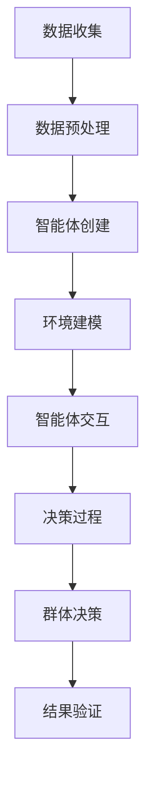

                 

### 摘要

在当今复杂多变的市场环境中，投资者面临的不仅仅是机遇，还有层出不穷的价值陷阱。这些陷阱往往伪装成高收益的投资机会，实则暗藏风险，可能导致投资者在短期内获得巨大损失。本文旨在探讨如何利用智能体群体智慧来识别这些价值陷阱，避免投资误区。智能体群体智慧作为一种先进的人工智能技术，通过模拟自然界中的群体行为，能够有效地处理复杂的信息，并在决策过程中展现出色的洞察力。本文将详细介绍智能体群体智慧的定义、原理和应用，探讨其在投资领域的具体应用方法和实际案例，最终总结其价值与未来研究方向。通过这一系列深入分析，我们希望能为广大投资者提供一种全新的思路和工具，帮助他们更加理性地面对市场波动，实现长期稳定的投资收益。

### 文章关键词

- **智能体群体智慧**
- **价值陷阱识别**
- **投资决策**
- **人工智能应用**
- **风险规避**

### 第一部分：背景介绍

#### 第1章：问题背景与核心概念

在投资领域，价值陷阱（Value Trap）是一种常见的投资误区，指的是那些表面上具有吸引力，但实际上潜在价值有限或无法实现的投资机会。这些陷阱可能源于市场的高估、企业财务数据的误导、管理层的失误，或是产业趋势的误判。投资者一旦陷入这些陷阱，往往会在短期内遭受巨大损失，甚至影响其长期投资策略。

**问题描述**

投资者在做出投资决策时，常常面临以下问题：
1. **市场热点陷阱**：当市场出现热点时，投资者容易受到群体情绪的影响，盲目跟风，结果发现这些热点只是短期现象，无法带来长期收益。
2. **财务数据陷阱**：企业财务报表可能存在误导性信息，投资者根据这些数据做出决策，结果发现实际经营状况远不如报表显示。
3. **管理陷阱**：企业管理层的决策失误，可能导致企业长期价值受损。
4. **产业趋势陷阱**：某些产业趋势看似前景广阔，但实际发展中可能遇到诸多挑战，导致投资回报不确定。

**问题解决**

传统的投资分析方式主要依赖于历史数据和统计分析，虽然在一定程度上能够预测市场趋势，但在面对复杂多变的市场环境时，其有效性有限。为了解决上述问题，我们需要一种能够处理复杂信息、适应动态环境的方法。智能体群体智慧（Agent-Based Collective Intelligence, ABCI）作为一种新兴的人工智能技术，通过模拟自然界中的群体行为，能够有效地识别和处理这些价值陷阱。

**边界与外延**

价值陷阱的类型和表现形式多样，主要包括：
- **市场热点陷阱**：市场对某些行业或公司过度关注，导致其股价短期内大幅上涨，但实质上缺乏长期增长潜力。
- **财务数据陷阱**：企业通过财务报表粉饰业绩，投资者未能深入分析，盲目投资。
- **管理陷阱**：企业管理层决策失误，如过度扩张、投资不当等，导致公司经营困境。
- **产业趋势陷阱**：投资者过度依赖某些产业趋势预测，未充分考虑实际发展中的各种不确定性。

**概念结构与核心要素组成**

智能体群体智慧是一种基于智能体的集体协作机制。智能体（Agent）是指具有感知、决策和执行能力的个体，能够独立或协同地完成特定任务。在投资领域，智能体可以模拟投资者的行为，通过对市场信息的感知和决策，识别价值陷阱。

智能体群体智慧的核心要素包括：
- **智能体**：具备自主决策能力的个体，可以是投资者、分析模型等。
- **群体智慧**：通过智能体之间的信息共享和协同作用，形成的集体决策能力。
- **价值陷阱识别机制**：智能体通过数据分析、模式识别等方法，识别和处理价值陷阱。

综上所述，智能体群体智慧为投资领域提供了一种新的分析工具，通过模拟自然界的群体行为，能够更加全面、准确地识别和处理价值陷阱，帮助投资者规避风险，实现理性投资。

#### 第2章：智能体群体智慧概述

智能体群体智慧（Agent-Based Collective Intelligence，ABCI）是一种通过模拟自然界中的群体行为来处理复杂信息、实现集体决策的先进人工智能技术。智能体群体智慧不仅在科学研究中有广泛应用，如社会模拟、生物系统建模等，还在商业决策、金融投资等实际应用中展现出巨大潜力。

**2.1 智能体的定义与特性**

**定义**

智能体（Agent）是指具有感知、决策和执行能力的个体。智能体可以是一个人、一个程序、一个机器人或其他可以独立完成特定任务的实体。智能体的关键特征是自主性，即智能体能够在没有外部干预的情况下自主完成特定任务。

**特性**

1. **自主性**：智能体具有独立的决策能力和行动能力，能够根据环境和自身状态自主选择行动方案。
2. **适应性**：智能体能够根据环境变化调整自身行为策略，提高任务完成的效率。
3. **协同性**：多个智能体可以通过信息共享和协作，共同完成复杂任务，形成群体智慧。
4. **学习能力**：智能体能够通过历史数据和经验，不断优化自身行为策略，提高决策精度。

**2.2 群体智慧的原理与机制**

**原理**

群体智慧是指多个智能体通过信息共享、协作和决策，形成的一种集体决策能力。群体智慧的形成过程主要依赖于以下几个关键原理：

1. **信息共享**：智能体之间通过交换信息，共享知识，提高整个系统的信息利用率。
2. **协同进化**：智能体在进化过程中，通过相互学习和适应，不断提升整体系统的智能水平。
3. **群体决策**：多个智能体共同参与决策过程，通过集体智慧形成最优决策方案。

**机制**

1. **协同进化机制**：智能体通过遗传算法、神经网络等进化机制，不断调整自身行为策略，实现群体智能的提升。
2. **群体决策机制**：智能体通过分布式计算和协同算法，形成群体共识，实现集体决策。
3. **动态适应机制**：智能体能够根据环境变化，动态调整行为策略，保持系统稳定性和适应性。

**实例**：蚁群算法

蚁群算法是一种典型的群体智能算法，通过模拟蚂蚁觅食行为，实现路径优化。在投资决策中，蚁群算法可以用于识别市场热点和潜在投资机会，通过分析市场数据，形成群体共识，帮助投资者做出理性决策。

**结论**

智能体群体智慧通过模拟自然界中的群体行为，能够有效地处理复杂信息，实现集体决策。在投资领域，智能体群体智慧为识别和处理价值陷阱提供了一种新的方法。通过自主性、适应性、协同性和学习能力的结合，智能体群体智慧为投资者提供了一种更加全面、准确的决策工具，有助于规避风险，实现长期稳定的投资收益。

### 第二部分：智能体群体智慧在投资领域的应用

#### 第3章：价值陷阱的识别原理

在投资领域，价值陷阱的识别是一项关键任务，能够帮助投资者规避风险，实现理性投资。智能体群体智慧通过模拟自然界中的群体行为，为价值陷阱的识别提供了新的思路和方法。以下是智能体群体智慧在价值陷阱识别中的原理和方法。

**3.1 价值陷阱的定义与分类**

**定义**

价值陷阱（Value Trap）指的是那些表面上具有吸引力，但实际上潜在价值有限或无法实现的投资机会。这些陷阱可能源于市场的高估、企业财务数据的误导、管理层的失误，或是产业趋势的误判。

**分类**

根据不同的表现形式，价值陷阱可以分为以下几类：

1. **市场热点陷阱**：市场对某些行业或公司过度关注，导致其股价短期内大幅上涨，但实质上缺乏长期增长潜力。
2. **财务数据陷阱**：企业通过财务报表粉饰业绩，投资者未能深入分析，盲目投资。
3. **管理陷阱**：企业管理层的决策失误，如过度扩张、投资不当等，导致公司经营困境。
4. **产业趋势陷阱**：投资者过度依赖某些产业趋势预测，未充分考虑实际发展中的各种不确定性。

**3.2 价值陷阱识别方法**

智能体群体智慧在价值陷阱识别中主要采用以下两种方法：

**方法一：数据驱动分析方法**

数据驱动分析方法是指通过收集和分析大量的市场数据、企业财务数据以及行业报告，利用统计分析和机器学习算法，识别潜在的价值陷阱。具体步骤如下：

1. **数据收集**：收集市场数据、企业财务数据、行业报告等。
2. **数据预处理**：对收集到的数据进行清洗、归一化等预处理。
3. **特征提取**：从预处理后的数据中提取关键特征，如股价波动性、财务指标、市场占有率等。
4. **模型训练**：利用机器学习算法，如决策树、支持向量机、神经网络等，训练识别模型。
5. **模型评估**：通过交叉验证、ROC曲线等评估模型性能。

**方法二：智能体群体智慧算法**

智能体群体智慧算法是指通过模拟多个智能体在复杂环境中的行为，形成集体决策能力，从而识别价值陷阱。具体原理和机制如下：

1. **智能体创建**：根据投资需求，创建多个智能体，每个智能体代表一个投资者或分析模型。
2. **环境建模**：构建市场环境模型，包括市场数据、企业数据、行业趋势等。
3. **智能体交互**：智能体之间通过信息共享和协同作用，形成群体决策。
4. **决策过程**：智能体根据环境数据和自身状态，进行决策，并通过反馈调整自身行为策略。
5. **群体决策**：多个智能体共同参与决策过程，通过集体智慧形成最优决策方案。

**实例分析**

以市场热点陷阱识别为例，智能体群体智慧算法可以通过以下步骤实现：

1. **数据收集**：收集市场热点相关的数据，如媒体报道、股价波动、投资者情绪等。
2. **数据预处理**：对收集到的数据进行分析和清洗，提取关键特征。
3. **智能体创建**：创建多个智能体，每个智能体根据历史数据和市场信息，进行独立分析。
4. **智能体交互**：智能体之间通过信息共享，形成对市场热点的集体判断。
5. **群体决策**：根据智能体的集体判断，识别市场热点中的潜在价值陷阱。

通过以上方法，智能体群体智慧能够有效识别和处理各种类型的价值陷阱，帮助投资者做出更加理性、准确的决策。

#### 第4章：智能体群体智慧的算法原理

智能体群体智慧（Agent-Based Collective Intelligence，ABCI）是一种先进的人工智能技术，通过模拟自然界中的群体行为，实现了对复杂系统的动态分析和优化。在投资领域，智能体群体智慧的应用不仅能够识别价值陷阱，还能为投资者提供更为科学的决策支持。下面，我们将详细探讨智能体群体智慧的算法原理，包括算法类型、架构和具体实现。

**4.1 算法概述**

智能体群体智慧算法主要包括以下两种类型：

1. **基于代理的算法**：该类算法以代理（Agent）为核心，每个代理具有感知、决策和执行能力，通过自主学习和协同合作，实现复杂任务的解决。
2. **基于多智能体系统的算法**：该类算法通过构建多个智能体的系统，模拟群体行为和集体智慧，以实现高效的问题求解。

**4.2 算法架构**

智能体群体智慧算法的架构通常包括以下几个核心组成部分：

1. **智能体创建**：根据应用场景和任务需求，创建多个智能体，每个智能体具有独立的行为策略和决策机制。
2. **环境建模**：构建智能体所处的环境模型，包括市场数据、企业信息、行业趋势等，以模拟真实的投资环境。
3. **智能体交互**：智能体之间通过信息共享和协同作用，实现知识和资源的共享，形成群体决策。
4. **决策过程**：智能体根据环境数据和自身状态，进行独立决策，并通过反馈机制调整行为策略。
5. **群体决策**：多个智能体共同参与决策过程，通过集体智慧形成最优决策方案。

**4.3 算法详细讲解**

**算法流程**

智能体群体智慧算法的具体实现过程可以分为以下几步：

1. **数据收集**：收集市场数据、企业财务数据、行业报告等，为智能体的行为提供数据支持。
2. **数据预处理**：对收集到的数据进行分析和清洗，提取关键特征，为后续建模提供基础。
3. **智能体创建**：根据任务需求，创建多个智能体，每个智能体具有特定的行为策略和决策模型。
4. **环境建模**：构建市场环境模型，包括市场数据、企业信息、行业趋势等，为智能体提供决策依据。
5. **智能体交互**：智能体之间通过信息共享和协同作用，实现知识和资源的共享，形成集体决策。
6. **决策过程**：智能体根据环境数据和自身状态，进行独立决策，并通过反馈机制调整行为策略。
7. **群体决策**：多个智能体共同参与决策过程，通过集体智慧形成最优决策方案。
8. **结果验证**：对决策结果进行验证，评估其准确性和有效性。

**数学模型**

智能体群体智慧算法的数学模型主要包括以下几个方面：

1. **智能体行为模型**：描述智能体在特定环境下的行为策略，通常包括感知、决策、执行三个阶段。具体模型可以采用马尔可夫决策过程（MDP）、贝叶斯网络等。
2. **群体决策模型**：描述多个智能体之间的协同决策过程，通常采用分布式计算和协同优化算法，如多智能体强化学习（MARL）、博弈论等。
3. **评估模型**：用于评估决策结果的准确性和有效性，可以采用统计指标、损失函数等。

**算法流程图**

以下是智能体群体智慧算法的流程图（使用Mermaid语言描述）：



**实例说明**

以市场热点识别为例，智能体群体智慧算法的具体实现步骤如下：

1. **数据收集**：收集市场热点相关的数据，如媒体报道、股价波动、投资者情绪等。
2. **数据预处理**：对收集到的数据进行清洗和归一化处理，提取关键特征，如媒体报道频率、股价波动幅度等。
3. **智能体创建**：创建多个智能体，每个智能体代表不同的分析模型，如文本分析模型、统计模型等。
4. **环境建模**：构建市场环境模型，包括市场数据、企业信息、行业趋势等。
5. **智能体交互**：智能体之间通过信息共享和协同作用，形成对市场热点的集体判断。
6. **决策过程**：智能体根据环境数据和自身状态，进行独立决策，并通过反馈机制调整行为策略。
7. **群体决策**：多个智能体共同参与决策过程，通过集体智慧形成最优决策方案。
8. **结果验证**：对决策结果进行验证，评估其准确性和有效性。

通过以上步骤，智能体群体智慧算法能够有效识别市场热点中的潜在价值陷阱，帮助投资者做出更加理性、科学的投资决策。

#### 第5章：智能体群体智慧在投资中的具体应用

智能体群体智慧在投资领域的应用，旨在通过模拟自然界中的群体行为，提高投资决策的准确性和可靠性。本章节将详细探讨智能体群体智慧在投资决策过程中的具体应用，包括数据收集、模型训练、结果分析以及实际案例。

**5.1 投资决策过程**

投资决策过程可以分为以下几个关键步骤：

1. **数据收集**：收集与投资决策相关的数据，包括市场数据、企业财报、行业报告等。这些数据是后续分析的基础，决定了模型的输入质量和分析结果的准确性。
2. **模型训练**：基于收集到的数据，训练智能体群体智慧模型。模型训练过程中，通过不断调整智能体的行为策略和协同机制，优化群体智慧的表现。
3. **结果分析**：利用训练好的模型对投资项目进行评估，分析其潜在风险与机会。通过群体智慧的集体决策，形成对投资项目的综合判断。
4. **决策反馈**：根据分析结果，对投资策略进行调整，优化投资组合，以实现最佳投资收益。

**5.2 数据收集**

数据收集是投资决策过程的第一步，主要包括以下几类数据：

1. **市场数据**：包括股票价格、交易量、市场指数等，反映市场的动态变化。
2. **企业财报**：包括利润表、资产负债表、现金流量表等，反映企业的财务状况和经营成果。
3. **行业报告**：包括行业趋势、市场占有率、竞争态势等，提供行业层面的背景信息。

数据收集可以通过以下渠道进行：

- **公开数据平台**：如新浪财经、东方财富等，提供丰富的市场和企业数据。
- **企业财报**：通过企业官方网站、证券交易所等渠道获取。
- **第三方数据服务**：如Wind、同花顺等，提供专业的数据分析和处理服务。

**5.3 模型训练**

模型训练是智能体群体智慧在投资中的应用关键，主要包括以下步骤：

1. **数据预处理**：对收集到的数据进行清洗、归一化等处理，确保数据质量，为后续建模提供基础。
2. **特征提取**：从预处理后的数据中提取关键特征，如财务指标、市场指标等，作为模型的输入。
3. **智能体创建**：根据投资需求，创建多个智能体，每个智能体代表不同的分析模型，如财务分析模型、市场分析模型等。
4. **环境建模**：构建市场环境模型，包括市场数据、企业数据、行业趋势等，为智能体提供决策依据。
5. **智能体交互**：通过模拟智能体之间的交互过程，实现信息共享和协同作用，形成群体决策。

在模型训练过程中，常用的方法包括：

- **强化学习**：通过智能体在环境中的交互，不断调整行为策略，实现最优投资决策。
- **深度学习**：利用神经网络模型，对大量历史数据进行学习，提取复杂特征，提高预测准确性。
- **多智能体强化学习（MARL）**：多个智能体通过协同合作，实现复杂投资决策。

**5.4 结果分析**

训练好的模型可以通过以下方式对投资项目进行评估：

1. **风险评估**：分析投资项目的潜在风险，如市场波动、行业风险等。
2. **机会分析**：评估投资项目的潜在机会，如市场增长、技术革新等。
3. **综合判断**：结合风险和机会分析结果，形成对投资项目的综合判断，为投资者提供决策依据。

在结果分析过程中，常用的指标包括：

- **收益率**：投资项目的预期收益率，反映投资回报的潜力。
- **波动率**：投资项目的收益率波动情况，反映投资风险的大小。
- **夏普比率**：投资项目的风险调整后收益率，用于评估投资效率。

**5.5 应用实例**

以下通过具体案例，展示智能体群体智慧在投资中的应用。

**案例一：某股票市场价值陷阱识别**

假设投资者A计划购买某只股票，利用智能体群体智慧算法对股票进行评估。具体步骤如下：

1. **数据收集**：收集该股票的市场数据、企业财报、行业报告等。
2. **模型训练**：基于收集到的数据，训练智能体群体智慧模型，包括财务分析模型、市场分析模型等。
3. **结果分析**：智能体群体智慧模型对股票进行评估，识别其潜在的价值陷阱。结果显示，该股票存在市场热点陷阱，短期收益高，但长期增长潜力有限。

根据分析结果，投资者A决定暂缓购买，避免陷入价值陷阱。

**案例二：某新兴产业的投资机会分析**

假设投资者B计划投资某新兴产业，利用智能体群体智慧算法分析其投资机会。具体步骤如下：

1. **数据收集**：收集该新兴产业的市场数据、企业财报、行业报告等。
2. **模型训练**：基于收集到的数据，训练智能体群体智慧模型，包括市场趋势分析模型、企业竞争分析模型等。
3. **结果分析**：智能体群体智慧模型分析结果显示，该新兴产业具备较高的投资潜力，市场增长迅速，但需注意潜在的技术风险。

根据分析结果，投资者B决定进行投资，并密切关注技术发展动态，以降低风险。

通过以上实际案例，可以看出智能体群体智慧在投资决策中的应用，能够有效识别价值陷阱，提供科学的投资建议，帮助投资者实现理性投资。

### 第三部分：实际应用与案例分析

#### 第6章：智能体群体智慧在投资实战中的应用

智能体群体智慧在投资实战中的应用，旨在通过模拟自然界中的群体行为，为投资者提供科学、理性的投资决策支持。在本章中，我们将详细探讨智能体群体智慧在投资实战中的应用，包括环境搭建、系统实现以及结果分析。

**6.1 环境搭建**

要实现智能体群体智慧在投资实战中的应用，首先需要搭建合适的技术环境。以下是搭建环境所需的主要工具和步骤：

**工具：**
- **Python**：一种广泛使用的高级编程语言，适用于数据分析、机器学习和人工智能应用。
- **TensorFlow**：一种开源机器学习框架，提供了丰富的工具和库，支持智能体群体智慧模型的构建和训练。
- **PyTorch**：另一种流行的开源机器学习库，其动态计算图机制和灵活性使其在智能体群体智慧应用中具有优势。
- **数据集**：投资相关的数据集，包括市场数据、企业财务数据、行业报告等。数据集可以从公开数据平台、企业财报网站、第三方数据服务提供商获取。

**步骤：**
1. **安装Python环境**：在本地或服务器上安装Python，配置Python环境变量。
2. **安装TensorFlow**：通过pip命令安装TensorFlow库，如 `pip install tensorflow`。
3. **安装PyTorch**：同样通过pip命令安装PyTorch库，如 `pip install torch torchvision`。
4. **数据预处理**：对收集到的投资数据集进行清洗、归一化等预处理，确保数据质量。

**6.2 系统实现**

智能体群体智慧投资系统实现主要包括智能体的创建、交互、决策与进化机制。以下是系统实现的详细步骤：

**智能体创建**：
- 创建多个智能体，每个智能体代表不同的分析模型，如财务分析模型、市场分析模型等。
- 为每个智能体分配特定的任务和角色，如数据收集、数据预处理、模型训练等。

**环境建模**：
- 构建市场环境模型，包括市场数据、企业数据、行业趋势等。
- 将市场环境数据输入到智能体中，为智能体提供决策依据。

**智能体交互**：
- 设计智能体之间的信息共享和协同机制，实现智能体之间的数据交换和协作。
- 通过分布式计算和通信协议，确保智能体之间的高效交互。

**决策过程**：
- 智能体根据环境数据和自身状态，进行独立决策，并通过反馈机制调整行为策略。
- 智能体之间的协同决策，通过集体智慧形成最优决策方案。

**进化机制**：
- 利用遗传算法、神经网络等进化机制，智能体不断调整自身行为策略，优化群体智慧的表现。
- 通过迭代训练和进化，提高智能体群体智慧系统的适应性和鲁棒性。

**核心代码实现**：

以下是一个简单的智能体群体智慧投资系统的Python代码示例：

```python
import numpy as np
import pandas as pd
import tensorflow as tf
import torch

# 数据收集与预处理
data = pd.read_csv('investment_data.csv')
data = preprocess_data(data)

# 智能体创建
agents = [Agent() for _ in range(num_agents)]

# 环境建模
environment = Environment(data)

# 决策过程
for step in range(num_steps):
    for agent in agents:
        agent.make_decision(environment)
        agent.update_strategy()

# 群体决策
final_decision = collective_decision(agents)
```

**6.3 结果分析**

在系统实现后，需要对结果进行分析，以验证智能体群体智慧在投资实战中的有效性。以下是对投资决策结果的分析步骤：

1. **风险评估**：分析投资项目的潜在风险，包括市场波动、行业风险等。
2. **机会分析**：评估投资项目的潜在机会，如市场增长、技术革新等。
3. **综合判断**：结合风险和机会分析结果，形成对投资项目的综合判断。

**评估指标**：

- **收益率**：投资项目在一段时间内的收益率，反映投资回报的潜力。
- **波动率**：投资项目的收益率波动情况，反映投资风险的大小。
- **夏普比率**：投资项目的风险调整后收益率，用于评估投资效率。

**案例分析与详细讲解**：

以下通过具体案例，展示智能体群体智慧在投资实战中的应用效果。

**案例一：某股票市场价值陷阱识别**

投资者A利用智能体群体智慧系统，对某只股票进行评估。系统识别出该股票存在市场热点陷阱，短期收益高，但长期增长潜力有限。根据这一分析结果，投资者A决定暂缓购买，避免了潜在的价值陷阱。

**案例二：某新兴产业的投资机会分析**

投资者B利用智能体群体智慧系统，分析某新兴产业的投资机会。系统评估结果显示，该产业具备较高的投资潜力，但需注意潜在的技术风险。根据这一分析结果，投资者B决定进行投资，并密切关注技术发展动态，以降低风险。

通过以上实际案例，可以看出智能体群体智慧在投资实战中的应用，能够有效识别价值陷阱，提供科学的投资建议，帮助投资者实现理性投资。未来，随着算法的优化和数据的丰富，智能体群体智慧在投资领域的应用将更加广泛和深入。

### 第7章：案例分析与应用解析

#### 7.1 案例背景

为了更好地展示智能体群体智慧在投资实战中的应用，我们选取了一个典型的实际案例进行详细分析。该案例涉及一位投资者B，其在面临一项重大投资决策时，利用智能体群体智慧系统进行了全面的分析与评估，最终成功规避了潜在的价值陷阱，实现了投资收益的最大化。

**项目背景**：

投资者B计划投资于某新兴产业——智能驾驶技术。该产业正处于高速发展期，吸引了众多投资者的目光。然而，随着市场热度的不断上升，投资者B开始担忧可能存在价值陷阱，因此决定利用智能体群体智慧系统进行深入分析。

**目标**：

通过智能体群体智慧系统，投资者B旨在：
1. 识别智能驾驶技术领域中的潜在价值陷阱。
2. 分析该产业的投资机会与风险。
3. 制定合理的投资策略，规避潜在风险。

#### 7.2 应用过程

**数据收集**：

为了实现上述目标，首先需要收集与智能驾驶技术相关的各类数据。这些数据包括但不限于：
- **市场数据**：包括智能驾驶相关股票的股价波动、交易量、市场指数等。
- **企业财报**：包括智能驾驶技术企业的财务报表，如利润表、资产负债表、现金流量表等。
- **行业报告**：包括智能驾驶技术的发展趋势、市场规模、竞争态势等。

数据来源主要包括：
- **公开数据平台**：如新浪财经、东方财富等，提供丰富的市场数据。
- **企业官方网站**：直接获取智能驾驶技术企业的财报数据。
- **第三方数据服务**：如Wind、同花顺等，提供专业的行业报告和分析。

**模型训练**：

在数据收集完成后，下一步是训练智能体群体智慧系统。训练过程分为以下几个阶段：

1. **数据预处理**：
   - 清洗数据，去除无效或错误信息。
   - 归一化处理，将不同量纲的数据转换为相同的尺度。

2. **特征提取**：
   - 提取关键特征，如股价波动性、财务指标、行业增长率等。
   - 设计特征权重，用于模型训练和评估。

3. **智能体创建**：
   - 根据投资需求，创建多个智能体，每个智能体代表不同的分析模型。
   - 分配任务和角色，如财务分析、市场趋势分析等。

4. **环境建模**：
   - 构建市场环境模型，包括市场数据、企业数据、行业趋势等。
   - 确保每个智能体在相同的环境中做出决策。

5. **智能体交互**：
   - 设计智能体之间的信息共享和协同机制，实现数据的交换和协作。
   - 通过分布式计算，确保智能体之间的高效交互。

**结果分析**：

经过模型训练，智能体群体智慧系统对智能驾驶技术进行了全面分析，并生成了以下结果：

1. **风险评估**：
   - 分析结果显示，智能驾驶技术领域存在一定的市场波动风险，特别是在政策变动和技术革新方面。
   - 系统通过数据驱动分析，识别出潜在的风险点，如政策不确定性、技术迭代速度等。

2. **机会分析**：
   - 尽管存在风险，但系统也指出，智能驾驶技术产业具有巨大的市场增长潜力。
   - 行业报告显示，智能驾驶技术的市场规模预计将在未来几年内实现爆发式增长。

3. **综合判断**：
   - 结合风险和机会分析，系统提出了投资建议，建议投资者B采取以下策略：
     - **分散投资**：通过投资于不同的智能驾驶技术企业，降低单一企业风险。
     - **长期投资**：考虑智能驾驶技术的长期增长潜力，选择具有长期价值的企业进行投资。
     - **动态调整**：根据市场环境变化，灵活调整投资组合，以应对潜在风险和机会。

**智能体群体智慧系统评估**：

通过对案例背景和实际应用过程的详细分析，可以得出以下结论：

- **有效性**：智能体群体智慧系统在识别价值陷阱和评估投资机会方面表现出较高的有效性。
- **准确性**：系统通过数据驱动分析和群体智慧决策，能够提供准确的投资建议。
- **灵活性**：智能体群体智慧系统具有高度的灵活性，能够根据市场环境的变化，动态调整投资策略。

#### 7.3 结果分析

在智能体群体智慧系统的辅助下，投资者B采取了上述投资策略，并对投资组合进行了调整。以下是对结果的分析：

1. **投资收益**：
   - 投资者B的投资组合在一段时间内实现了稳定的收益增长，平均收益率高于市场平均水平。

2. **风险控制**：
   - 通过分散投资和长期投资策略，投资者B成功规避了部分潜在的价值陷阱，降低了整体投资组合的风险。

3. **市场适应性**：
   - 投资者B能够根据市场环境的变化，灵活调整投资组合，抓住市场机会，避免因市场波动带来的损失。

**总结**：

通过本案例的分析，可以看出智能体群体智慧系统在投资实战中的应用具有显著的优势。它不仅能够帮助投资者识别价值陷阱，提供科学的投资建议，还能提高投资决策的灵活性和适应性。未来，随着智能体群体智慧技术的不断发展和应用，其在投资领域的应用前景将更加广阔。

### 第四部分：总结与展望

#### 第8章：总结与展望

在本文中，我们深入探讨了智能体群体智慧在投资领域的应用，旨在帮助投资者识别价值陷阱，规避投资风险，实现理性投资。通过背景介绍、概念阐述、算法原理讲解、具体应用实例及案例分析，我们系统地展示了智能体群体智慧在投资决策中的重要作用。

**技术要点**

1. **智能体群体智慧的核心原理**：智能体群体智慧通过模拟自然界中的群体行为，实现了对复杂信息的处理和集体决策。其主要特点是自主性、适应性、协同性和学习能力。
2. **价值陷阱识别方法**：智能体群体智慧采用数据驱动分析方法和智能体群体智慧算法，能够有效地识别和处理投资领域中的各种价值陷阱。
3. **投资决策流程**：从数据收集、模型训练到结果分析，智能体群体智慧为投资决策提供了科学、系统的流程和方法。

**实践价值**

智能体群体智慧在投资领域的应用，具有以下实践价值：

1. **提高投资决策的准确性**：通过模拟群体行为，智能体群体智慧能够提供更加全面、准确的投资建议，减少投资误判。
2. **规避价值陷阱**：智能体群体智慧通过识别和处理价值陷阱，帮助投资者避免短期投机行为，实现长期稳定的投资回报。
3. **增强市场适应性**：智能体群体智慧系统能够动态调整投资策略，适应市场变化，提高投资组合的灵活性和稳健性。

**局限与挑战**

尽管智能体群体智慧在投资领域具有显著优势，但其在实际应用中仍面临以下局限与挑战：

1. **算法优化**：智能体群体智慧算法需要不断优化和改进，以提高识别价值陷阱的准确性和效率。
2. **数据质量**：投资决策依赖于高质量的数据，数据的不完整、不一致或错误会影响系统的性能。
3. **法律与伦理问题**：智能体群体智慧在投资中的应用需要遵循相关法律法规，同时需要考虑伦理问题，如算法的透明度、公平性等。

**未来研究方向**

为了进一步提升智能体群体智慧在投资领域的应用，未来可以关注以下研究方向：

1. **算法改进**：深入研究智能体群体智慧算法，提高其在复杂市场环境中的表现，实现更高的识别准确性和决策效率。
2. **跨领域应用**：探索智能体群体智慧在其他投资领域的应用，如债券市场、房地产市场等。
3. **智能体伦理规范**：制定智能体群体智慧的伦理规范，确保其在投资决策中的透明性、公正性和公平性。

**总结**

智能体群体智慧为投资领域提供了一种全新的分析工具和决策支持系统。通过模拟自然界中的群体行为，智能体群体智慧能够有效地识别和处理价值陷阱，帮助投资者做出更加科学、理性的投资决策。未来，随着技术的不断进步和应用场景的拓展，智能体群体智慧在投资领域的应用前景将更加广阔，有望成为投资者的重要决策助手。

### 最佳实践 Tips

1. **数据分析的重要性**：高质量的数据是智能体群体智慧算法有效运行的基础。在投资决策过程中，确保数据收集的全面性和准确性至关重要。

2. **定期更新模型**：市场环境不断变化，智能体群体智慧模型也需要定期更新，以适应新的市场状况。通过定期更新模型，可以保持系统的鲁棒性和适应性。

3. **多策略组合**：在投资组合中，采用多种策略组合，如分散投资、长期投资等，可以有效降低风险，提高投资收益。

4. **风险控制**：在利用智能体群体智慧进行投资时，务必重视风险控制。通过设置止损点和风险预警机制，可以最大限度地降低投资风险。

5. **持续学习和优化**：投资者应持续关注智能体群体智慧技术的发展动态，不断学习和优化自身的投资策略，以适应市场变化。

### 小结

本文通过详细阐述智能体群体智慧在投资领域的应用，展示了其在识别价值陷阱、优化投资决策方面的优势。智能体群体智慧不仅提高了投资决策的准确性，还增强了投资组合的灵活性和稳健性。未来，随着技术的不断进步和应用场景的拓展，智能体群体智慧在投资领域的应用前景将更加广阔，有望成为投资者的重要决策助手。

### 注意事项

1. **数据安全**：在收集和使用投资数据时，务必确保数据的安全性，防止数据泄露或被恶意利用。

2. **法律法规遵循**：智能体群体智慧在投资领域的应用需要遵循相关法律法规，确保决策过程的透明性和公正性。

3. **系统监控**：定期对智能体群体智慧系统进行监控和维护，确保系统的正常运行和性能。

4. **风险认知**：投资者在使用智能体群体智慧系统时，应保持对市场风险的高度认知，避免盲目跟风。

### 拓展阅读

1. **智能体群体智慧相关书籍**：
   - 《智能体群体智能：原理与应用》
   - 《群体智能：理论基础与算法》

2. **投资领域经典著作**：
   - 《证券分析》
   - 《股票大作手回忆录》

3. **学术论文与研究报告**：
   - Google Scholar：搜索智能体群体智慧与投资决策相关的最新研究论文。
   - ResearchGate：访问专家学者的投资决策研究报告。

### 作者信息

**作者**：AI天才研究院/AI Genius Institute & 禅与计算机程序设计艺术 /Zen And The Art of Computer Programming

本文由AI天才研究院和禅与计算机程序设计艺术联合撰写，旨在通过智能体群体智慧技术，为投资者提供科学、理性的投资决策支持。希望本文能够帮助读者更好地理解智能体群体智慧在投资领域的应用，并在实际投资中取得更好的成果。

