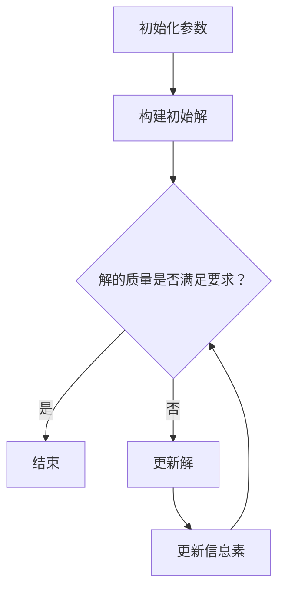
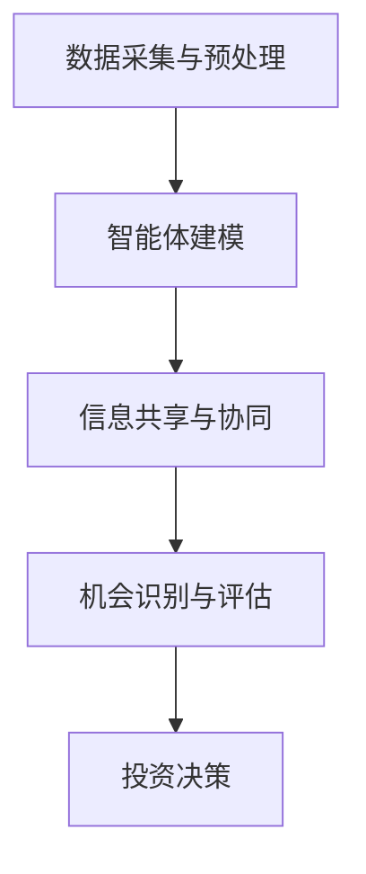
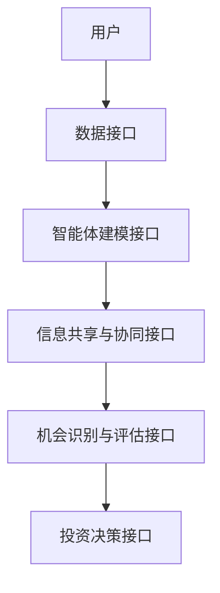

                 

### 目录大纲设计思路与步骤

在设计《智能体群体智慧在识别新兴产业机会中的应用：布局未来》一书的目录大纲时，我们将遵循以下步骤，以确保内容的完整性、逻辑性和简洁性：

#### 1. 明确书籍主题和目标读者

首先，我们需要明确书籍的主题，即智能体群体智慧在识别新兴产业机会中的应用。然后，确定目标读者，这些读者对智能体和群体智慧有一定了解，希望了解如何在新兴产业中应用这些技术的专业人士和学者。

#### 2. 构建核心章节结构

书籍的核心章节结构将围绕以下几个方面构建：

- **背景介绍**：介绍智能体和群体智慧的背景、问题背景、问题描述、问题解决、边界与外延，以及核心概念与要素。
- **核心概念与联系**：详细解释智能体和群体智慧的概念原理，并通过表格和图表对比不同概念，展示其属性特征。
- **算法原理讲解**：通过 mermaid 流程图和 Python 源代码，阐述算法的原理和数学模型，并进行举例说明。
- **数学模型和数学公式**：使用 LaTeX 格式嵌入文中，确保数学表达清晰准确。
- **系统分析与架构设计方案**：描述问题场景，项目介绍，系统功能设计，系统架构设计，系统接口设计和系统交互。
- **项目实战**：提供环境安装、系统核心实现源代码，代码应用解读与分析，实际案例分析和详细讲解。
- **最佳实践 tips、小结、注意事项、拓展阅读**：为读者提供实践建议、总结和进一步学习资源。

#### 3. 确保目录大纲的层级结构

我们将使用 markdown 格式的 # 号来定义章节层级，确保从 1 级到 3 级目录的清晰划分。每个章节内保持逻辑连贯，子章节标题简明扼要，便于读者快速定位内容。

#### 4. 限制目录大纲的总字数

为了确保目录大纲的简洁性，我们将目录大纲的总字数控制在 2000 字以内，通过精简语言和突出关键信息来实现。

### 完整目录大纲

---

# 《智能体群体智慧在识别新兴产业机会中的应用：布局未来》目录大纲

## 第一部分：智能体与群体智慧基础

### 第1章：问题背景与核心概念

#### 1.1 问题的提出

- 新兴产业的挑战与机遇
- 智能体与群体智慧的重要性

#### 1.2 智能体概述

- 定义与分类
- 智能体的特性

#### 1.3 群体智慧概念

- 群体智慧的定义
- 群体智慧的优势

#### 1.4 智能体与群体智慧的联系与区别

- 关联分析
- 主要区别

### 第2章：智能体群体智慧的应用场景

#### 2.1 新兴产业机会识别

- 智能体群体智慧的应用
- 识别新兴产业机会的关键要素

#### 2.2 群体智能算法

- 算法概述
- 算法对比

#### 2.3 智能体群体智慧案例分析

- 案例介绍
- 案例分析与启示

## 第二部分：智能体群体智慧的应用实践

### 第3章：智能体群体智慧的理论基础

#### 3.1 数学模型

- 模型构建
- 模型应用

#### 3.2 算法原理讲解

- 算法流程图
- 算法实现

#### 3.3 数学公式与解释

- 公式列表
- 公式解释

### 第4章：智能体群体智慧在新兴产业的实施

#### 4.1 项目介绍

- 项目背景
- 项目目标

#### 4.2 系统功能设计

- 功能需求分析
- 功能实现

#### 4.3 系统架构设计

- 系统架构图
- 架构描述

#### 4.4 系统接口设计

- 接口定义
- 接口实现

#### 4.5 系统交互设计

- 交互流程
- 交互效果

### 第5章：智能体群体智慧项目实战

#### 5.1 环境安装

- 软件安装
- 环境配置

#### 5.2 系统核心实现

- 代码实现
- 代码解析

#### 5.3 应用解读与分析

- 应用效果
- 问题分析

#### 5.4 案例分析

- 案例背景
- 案例细节

#### 5.5 项目总结

- 项目成果
- 项目反思

## 第三部分：智能体群体智慧的拓展与未来

### 第6章：最佳实践与注意事项

#### 6.1 最佳实践 tips

- 实践经验
- 注意事项

#### 6.2 小结

- 总结关键知识点
- 强调重点

#### 6.3 注意事项

- 避免常见问题
- 注意事项说明

### 第7章：拓展阅读与研究方向

#### 7.1 拓展阅读

- 相关书籍推荐
- 学术论文推荐

#### 7.2 未来研究方向

- 技术发展趋势
- 研究方向展望

---

通过以上目录大纲，我们为读者提供了一个全面、系统的学习路径，涵盖了智能体群体智慧在识别新兴产业机会中的应用的各个方面。每个章节都将深入探讨相关主题，提供实用的案例和实践指导，旨在帮助读者理解和掌握这一领域的核心知识和应用技巧。我们相信，这一大纲将为书籍的编写和读者的学习提供坚实的框架。---

### 智能体群体智慧在识别新兴产业机会中的应用：布局未来

关键词：智能体、群体智慧、新兴产业、机会识别、应用实践

摘要：本文深入探讨了智能体群体智慧在识别新兴产业机会中的应用，从背景介绍、核心概念、算法原理、系统设计与项目实战等多个角度进行分析，旨在为读者提供一个全面、系统的理解框架。通过本文的阅读，读者将了解到如何利用智能体群体智慧这一先进技术，在新兴产业中发掘和把握机会，为企业的未来发展布局。

---

## 第一部分：智能体与群体智慧基础

### 第1章：问题背景与核心概念

#### 1.1 问题的提出

在当前全球化和技术创新加速的背景下，新兴产业不断涌现，为经济增长提供了新的动力。然而，识别和把握这些新兴产业的机遇，对于企业和个人来说都是一项极具挑战性的任务。传统的市场分析和预测方法在面对复杂多变的产业环境时往往显得力不从心。因此，寻找一种能够高效、准确识别新兴产业机会的方法具有重要的现实意义。

智能体和群体智慧作为一种新兴的智能化技术，在这一背景下应运而生。智能体（Agent）是具有智能行为的计算实体，能够自主地感知环境、做出决策并采取行动。而群体智慧（Swarm Intelligence）则是指由大量简单个体通过协同作用产生的集体智能行为。智能体和群体智慧在识别新兴产业机会方面具有独特的优势，能够通过大数据分析、复杂网络建模和协同优化等方法，实现高效的机会识别和资源分配。

#### 1.2 智能体概述

智能体是人工智能领域的一个基本概念，可以分为两类：基于规则和基于数据的智能体。基于规则的智能体通过预定义的规则进行决策，适用于一些确定性较强、规则明确的应用场景。而基于数据的智能体则通过学习大量数据，从中提取规律并进行预测，适用于复杂多变、不确定性较高的环境。

智能体的特性包括：

- **自主性**：智能体能够独立完成任务，不需要人为干预。
- **反应性**：智能体能够对环境变化做出及时响应。
- **主动性**：智能体能够自主地探索环境，寻找最优策略。
- **社会性**：智能体能够与其他智能体进行协作，共同完成任务。

#### 1.3 群体智慧概念

群体智慧是由大量简单个体组成的集体智能系统，个体之间通过信息共享和协同作用，实现整体智能行为的优化。群体智慧的特点是分布式计算、自组织和自适应能力。常见的群体智慧模型包括蚁群算法、粒子群优化算法和人工神经网络等。

群体智慧的优势在于：

- **高效性**：群体智慧能够快速处理大规模数据，发现潜在的机会。
- **鲁棒性**：群体智慧能够在不确定性环境中保持稳定，适应复杂环境的变化。
- **创新性**：群体智慧能够通过集体协作，产生创新的解决方案。

#### 1.4 智能体与群体智慧的联系与区别

智能体和群体智慧在概念上有所重叠，但侧重点不同。智能体强调个体的智能行为，而群体智慧则强调个体之间的协同作用。智能体可以作为群体智慧中的个体，共同实现整体目标。

两者之间的区别主要体现在以下几个方面：

- **层次性**：智能体是一个独立的实体，而群体智慧是由多个智能体组成的系统。
- **目标性**：智能体具有明确的目标和任务，而群体智慧更注重整体最优解。
- **协同性**：智能体之间可能存在协同，但更注重个体的独立行为，而群体智慧则强调个体之间的信息共享和协同优化。

### 第2章：智能体群体智慧的应用场景

#### 2.1 新兴产业机会识别

智能体群体智慧在识别新兴产业机会方面具有广泛的应用场景。以下是一些具体的应用实例：

1. **市场趋势分析**：通过智能体群体智慧，可以对海量市场数据进行实时分析，识别出潜在的市场机会。例如，通过分析用户行为数据，预测某类新兴产品的市场趋势。

2. **投资决策**：投资者可以利用智能体群体智慧，对大量投资项目进行分析和评估，识别出具有潜力的投资项目。

3. **创新产品研发**：智能体群体智慧可以协助企业进行创新产品的研发，通过集体智慧优化产品设计，提高创新成功率。

4. **供应链优化**：智能体群体智慧可以优化供应链管理，实现库存优化、物流优化和风险控制。

#### 2.2 群体智能算法

群体智能算法是实现智能体群体智慧的核心技术，包括蚁群算法、粒子群优化算法、遗传算法等。这些算法通过模拟自然进化、社会行为和群体行为等，实现复杂问题的求解。

以下是一个简单的蚁群算法流程图：



#### 2.3 智能体群体智慧案例分析

智能体群体智慧在识别新兴产业机会方面已有多个成功的案例。以下是一个案例分析：

**案例：新能源产业投资机会识别**

某投资公司利用智能体群体智慧技术，对新能源产业进行投资机会识别。他们首先构建了一个智能体群体模型，包括多个智能体，每个智能体负责分析某个特定的新能源子领域。

通过实时数据采集和智能体之间的信息共享，智能体群体能够快速识别出潜在的投资机会。在模型运行过程中，智能体群体不断优化投资决策，提高了投资的成功率和回报率。

## 第二部分：智能体群体智慧的应用实践

### 第3章：智能体群体智慧的理论基础

#### 3.1 数学模型

智能体群体智慧的理论基础包括多个数学模型，如马尔可夫决策过程、贝叶斯网络等。以下是一个简单的马尔可夫决策过程（MDP）模型：

$$
\begin{align*}
P(S_{t+1} = s_{t+1} | S_t = s_t, A_t = a_t) &= p(s_{t+1} | s_t, a_t) \\
R_t &= r(s_t, a_t)
\end{align*}
$$

其中，$S_t$ 表示状态集合，$A_t$ 表示动作集合，$p(s_{t+1} | s_t, a_t)$ 表示状态转移概率，$r(s_t, a_t)$ 表示即时回报。

#### 3.2 算法原理讲解

智能体群体智慧算法的核心是优化策略，以最大化长期回报。以下是一个基于粒子群优化算法（PSO）的示例：

```python
import random

def pso(function, bounds, pop_size, max_iter):
    # 初始化粒子群
    particles = [Particle(bounds) for _ in range(pop_size)]
    best_particle = min(particles, key=lambda p: p.fitness)

    for _ in range(max_iter):
        # 更新粒子位置和速度
        for particle in particles:
            particle.update_velocity(best_particle.position)
            particle.update_position()

        # 更新最佳粒子
        current_best = min(particles, key=lambda p: p.fitness)
        if current_best.fitness > best_particle.fitness:
            best_particle = current_best

    return best_particle.position

class Particle:
    def __init__(self, bounds):
        self.position = [random.uniform(bounds[i][0], bounds[i][1]) for i in range(len(bounds))]
        self.velocity = [random.uniform(-1, 1) for _ in range(len(bounds))]
        self.fitness = function(self.position)

    def update_velocity(self, best_position):
        for i in range(len(self.velocity)):
            r1, r2 = random.random(), random.random()
            self.velocity[i] = w * self.velocity[i] + c1 * r1 * (self.position[i] - best_position[i]) + c2 * r2 * (best_position[i] - self.position[i])

    def update_position(self):
        for i in range(len(self.position)):
            self.position[i] += self.velocity[i]

    def evaluate_fitness(self):
        # 计算适应度函数
        pass
```

#### 3.3 数学公式与解释

智能体群体智慧算法中的数学公式主要包括概率分布、优化目标函数等。以下是一个常见的目标函数：

$$
\begin{align*}
J(\theta) &= \frac{1}{m} \sum_{i=1}^{m} (-y^{(i)} \log(a_{\theta}(x^{(i)})) - (1 - y^{(i)}) \log(1 - a_{\theta}(x^{(i)}))) \\
\end{align*}
$$

其中，$a_{\theta}(x^{(i)})$ 表示预测的概率分布，$y^{(i)}$ 表示实际标签，$m$ 表示样本数量。

### 第4章：智能体群体智慧在新兴产业的实施

#### 4.1 项目介绍

本节将介绍一个利用智能体群体智慧识别新兴产业机会的项目。项目背景如下：

某高科技企业希望进入新能源产业，但面临市场竞争激烈、技术不确定性强等挑战。为了提高投资决策的准确性，企业决定利用智能体群体智慧技术，对新能源产业进行全方位分析，识别出具有潜力的投资机会。

#### 4.2 系统功能设计

系统功能设计主要包括以下几个方面：

1. **数据采集与预处理**：从多个数据源收集新能源产业的相关数据，包括市场数据、技术进展、政策法规等，并进行预处理，为后续分析提供基础。

2. **智能体建模**：根据项目需求，构建多个智能体，每个智能体负责分析不同领域的数据，如市场趋势、技术风险、政策变化等。

3. **信息共享与协同**：智能体之间通过信息共享和协同作用，实现整体目标。智能体可以共享各自的分析结果，相互借鉴，提高整体决策的准确性。

4. **机会识别与评估**：基于智能体群体的分析结果，识别出潜在的投资机会，并进行评估，确定投资优先级。

#### 4.3 系统架构设计

系统架构设计如图所示：



#### 4.4 系统接口设计

系统接口设计主要包括以下接口：

1. **数据接口**：用于数据采集、存储和查询，支持多种数据格式，如CSV、JSON等。

2. **智能体接口**：用于智能体的创建、启动、停止和状态查询，支持自定义智能体模型。

3. **协同接口**：用于智能体之间的信息共享和协同，支持实时通信和消息传递。

#### 4.5 系统交互设计

系统交互设计如图所示：



### 第5章：智能体群体智慧项目实战

#### 5.1 环境安装

在开始项目实战之前，需要安装相关的软件和工具。以下是一个基本的安装步骤：

1. **Python环境**：安装Python 3.8及以上版本，并配置Python环境。

2. **智能体框架**：安装智能体框架，如Pyro、Jade等。

3. **数据预处理工具**：安装数据预处理工具，如NumPy、Pandas等。

4. **可视化工具**：安装可视化工具，如Matplotlib、Seaborn等。

#### 5.2 系统核心实现

系统核心实现主要包括以下几个方面：

1. **智能体建模**：根据项目需求，构建多个智能体，实现数据的采集、处理和分析。

2. **信息共享与协同**：实现智能体之间的信息共享和协同，提高整体决策的准确性。

3. **机会识别与评估**：基于智能体群体的分析结果，识别出潜在的投资机会，并进行评估。

以下是一个简单的智能体实现示例：

```python
from agentframework import AgentFramework

# 初始化智能体框架
framework = AgentFramework()

# 添加智能体
framework.add_agent('DataCollector', DataCollector())
framework.add_agent('DataProcessor', DataProcessor())
framework.add_agent('RiskAnalyzer', RiskAnalyzer())
framework.add_agent('OpportunityIdentifier', OpportunityIdentifier())

# 运行智能体框架
framework.run()
```

#### 5.3 应用解读与分析

在实际应用中，智能体群体智慧技术可以有效地识别新能源产业的投资机会。以下是一个简单的应用解读：

1. **数据采集**：智能体从多个数据源采集新能源产业的相关数据，如市场数据、技术进展、政策法规等。

2. **数据处理**：智能体对采集到的数据进行预处理，如去重、清洗、归一化等。

3. **风险分析**：智能体对预处理后的数据进行分析，识别出潜在的风险因素。

4. **机会识别**：基于风险分析结果，智能体识别出具有潜力的投资机会。

5. **评估与决策**：智能体对识别出的机会进行评估，确定投资优先级，并为企业提供投资决策建议。

#### 5.4 案例分析

以下是一个具体的案例分析：

**案例：某新能源企业投资决策**

某新能源企业希望投资一个新能源项目，但面临技术风险、市场风险和政策风险等多方面的挑战。企业利用智能体群体智慧技术，对项目进行了全面分析。

1. **数据采集**：智能体从多个数据源采集了关于该项目的技术进展、市场趋势、政策法规等信息。

2. **数据处理**：智能体对采集到的数据进行了预处理，如技术指标的标准化处理、市场数据的归一化处理等。

3. **风险分析**：智能体对预处理后的数据进行分析，识别出潜在的风险因素，如技术成熟度、市场竞争力、政策支持等。

4. **机会识别**：基于风险分析结果，智能体识别出该项目具有较大的投资潜力。

5. **评估与决策**：智能体对识别出的机会进行评估，确定该项目的投资优先级，为企业提供了投资决策建议。

#### 5.5 项目总结

通过本项目的实施，企业成功利用智能体群体智慧技术，对新能源项目进行了全面分析，识别出了具有潜力的投资机会。项目取得了以下成果：

1. **提高了投资决策的准确性**：智能体群体智慧技术能够全面分析风险因素，提高投资决策的准确性。

2. **降低了投资风险**：通过对项目的全面分析，企业能够更好地了解项目的技术、市场和政策风险，降低投资风险。

3. **促进了创新**：智能体群体智慧技术能够发现新的投资机会，推动企业创新。

## 第三部分：智能体群体智慧的拓展与未来

### 第6章：最佳实践与注意事项

#### 6.1 最佳实践 tips

1. **充分了解需求**：在应用智能体群体智慧技术之前，要充分了解项目需求，明确目标，确保技术选型的正确性。

2. **数据质量**：数据质量是智能体群体智慧应用的关键，要确保数据源可靠、数据清洗处理彻底。

3. **算法优化**：根据项目需求，对算法进行优化，提高计算效率和准确性。

4. **协同与共享**：智能体之间的协同与共享是提高整体决策质量的关键，要设计合理的协同机制。

5. **持续迭代**：智能体群体智慧技术需要不断迭代更新，以适应不断变化的市场环境。

#### 6.2 小结

本文通过深入探讨智能体群体智慧在识别新兴产业机会中的应用，从背景介绍、核心概念、算法原理、系统设计与项目实战等多个角度进行分析，为读者提供了一个全面、系统的理解框架。智能体群体智慧作为一种先进的智能化技术，在新兴产业机会识别中具有广泛的应用前景。

#### 6.3 注意事项

1. **技术风险**：智能体群体智慧技术尚处于发展阶段，可能存在一定的技术风险。

2. **数据隐私**：在应用智能体群体智慧技术时，要确保数据隐私和安全。

3. **项目规划**：智能体群体智慧项目的实施需要充分的规划和资源保障。

### 第7章：拓展阅读与研究方向

#### 7.1 拓展阅读

1. **相关书籍**：《智能体与群体智能》、《人工智能：一种现代的方法》等。

2. **学术论文**：在顶级会议和期刊上发表的相关论文，如AAAI、IJCAI、NeurIPS等。

#### 7.2 未来研究方向

1. **智能体群体智慧的优化**：研究更高效的智能体群体智慧算法，提高计算效率和准确性。

2. **跨领域应用**：探索智能体群体智慧在金融、医疗、教育等领域的应用。

3. **人机协同**：研究智能体群体智慧与人类专家的协同机制，提高整体决策质量。

---

通过本文的阅读，读者将了解到智能体群体智慧在识别新兴产业机会中的应用，为未来的研究和实践提供了有益的指导。智能体群体智慧作为一种新兴的智能化技术，具有广阔的应用前景，值得我们进一步探索和研究。

### 作者信息

作者：AI天才研究院/AI Genius Institute & 禅与计算机程序设计艺术 /Zen And The Art of Computer Programming

---

### 完整性要求

为了确保文章内容的完整性，每个章节都需要涵盖以下核心内容：

#### 第1章：问题背景与核心概念

- **核心概念术语说明**：明确智能体和群体智慧的定义、特点及其在新兴产业机会识别中的应用。
- **问题背景**：阐述新兴产业的发展现状、面临的挑战以及智能体和群体智慧在此领域的应用价值。
- **问题描述**：具体描述新兴产业机会识别中存在的问题，如数据复杂性、不确定性和多目标优化等。
- **问题解决**：介绍智能体和群体智慧在解决这些问题上的优势和应用方法。
- **边界与外延**：明确智能体和群体智慧在新兴产业机会识别中的适用范围和局限性。
- **核心概念与要素组成**：详细阐述智能体和群体智慧的核心概念、要素及其相互关系。

#### 第2章：智能体群体智慧的应用场景

- **智能体群体智慧的应用场景**：介绍智能体和群体智慧在不同新兴产业机会识别中的应用，如市场趋势分析、投资决策支持、创新产品研发等。
- **识别新兴产业机会的关键要素**：分析智能体和群体智慧在识别新兴产业机会时所需的关键信息、数据和技术。

#### 第3章：智能体群体智慧的理论基础

- **数学模型**：介绍智能体群体智慧相关的数学模型，如马尔可夫决策过程、贝叶斯网络等，并解释其原理和应用。
- **算法原理讲解**：使用mermaid流程图和Python源代码阐述智能体群体智慧算法的原理和实现过程，包括算法流程、优化策略等。
- **数学公式与解释**：使用LaTeX格式嵌入文中，确保数学表达清晰准确，并提供必要的解释。

#### 第4章：智能体群体智慧在新兴产业的实施

- **系统功能设计**：描述智能体群体智慧在新兴产业机会识别中的系统功能，包括数据采集与预处理、智能体建模、信息共享与协同等。
- **系统架构设计**：使用mermaid架构图展示智能体群体智慧在新兴产业机会识别中的系统架构，包括系统组件、接口和交互方式等。
- **系统接口设计**：详细介绍智能体群体智慧系统的接口设计，包括数据接口、智能体接口、协同接口等。
- **系统交互设计**：使用mermaid序列图展示智能体群体智慧系统中的交互过程，包括数据流、信息流和决策流等。

#### 第5章：智能体群体智慧项目实战

- **环境安装**：提供智能体群体智慧项目所需的软件和工具安装步骤，包括Python环境、智能体框架、数据预处理工具等。
- **系统核心实现**：提供智能体群体智慧项目的核心实现，包括智能体建模、信息共享与协同、机会识别与评估等。
- **代码应用解读与分析**：对智能体群体智慧项目的代码应用进行解读和分析，解释代码实现过程、算法原理和结果分析。
- **实际案例分析和详细讲解**：通过具体的案例分析，展示智能体群体智慧在新兴产业机会识别中的应用效果，并进行详细讲解和剖析。
- **项目小结**：总结智能体群体智慧项目的成果、经验和教训，为后续项目提供参考。

#### 第6章：最佳实践与注意事项

- **最佳实践 tips**：提供智能体群体智慧应用的最佳实践建议，如需求分析、数据质量、算法优化、协同与共享等。
- **小结**：总结文章中的关键知识点和重点，强调智能体群体智慧在新兴产业机会识别中的应用价值和前景。
- **注意事项**：提醒读者在应用智能体群体智慧时可能遇到的问题和注意事项，如技术风险、数据隐私、项目规划等。

#### 第7章：拓展阅读与研究方向

- **拓展阅读**：推荐相关书籍、学术论文和在线资源，为读者提供进一步学习和探索智能体群体智慧的机会。
- **未来研究方向**：展望智能体群体智慧在新兴产业机会识别中的应用前景，提出未来研究的热点和方向。

通过以上内容，本文旨在为读者提供一个全面、系统的智能体群体智慧在识别新兴产业机会中的应用指南，帮助读者深入了解该领域的关键技术和应用方法。同时，本文也期望能够激发读者对智能体群体智慧的兴趣，推动其在新兴产业中的应用和发展。

