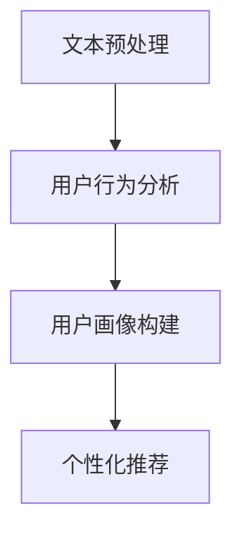

                 


# 智能客户洞察AI Agent：LLM驱动的用户行为分析

关键词：智能客户洞察，AI Agent，LLM，用户行为分析，机器学习，自然语言处理

摘要：本文将探讨智能客户洞察AI Agent的开发与应用，特别是基于大型语言模型（LLM）的用户行为分析技术。我们将从背景介绍、核心概念与联系、算法原理讲解、系统分析与架构设计方案、项目实战等多个方面进行深入分析，旨在为广大读者提供关于智能客户洞察AI Agent的理论与实践指导。

## 背景介绍

### 1.1 问题背景

在当今数字化时代，客户洞察是企业竞争的关键。传统的客户关系管理（CRM）系统已经无法满足企业对于个性化服务、实时分析和高效响应的需求。随着大数据、人工智能技术的发展，智能客户洞察AI Agent逐渐成为企业提升客户满意度和竞争力的有效工具。

### 1.2 问题描述

智能客户洞察AI Agent的核心任务是理解用户行为，通过分析用户的历史数据、在线行为和交互内容，为用户提供个性化的服务和建议。然而，实现这一目标面临着诸多挑战，如用户数据的海量与多样性、数据隐私保护、实时响应等。

### 1.3 问题解决

为解决上述问题，本文将介绍一种基于大型语言模型（LLM）的智能客户洞察AI Agent。LLM具有强大的文本理解和生成能力，能够处理大规模、多样性的用户数据，并实现实时、个性化的用户行为分析。

### 1.4 边界与外延

本文主要关注智能客户洞察AI Agent在商业领域的应用，但也涉及其他领域（如医疗、金融等）的潜在应用场景。此外，本文将探讨LLM驱动的用户行为分析技术，但并不涉及LLM的构建和训练过程。

### 1.5 概念结构与核心要素组成

智能客户洞察AI Agent的核心概念结构包括用户数据采集、文本预处理、用户行为分析、用户画像构建和个性化推荐。以下是各要素的简要说明：

1. **用户数据采集**：通过网页分析、API接口、传感器等技术手段，收集用户的在线行为数据、历史数据和交互内容。
2. **文本预处理**：对采集到的文本数据进行清洗、分词、去噪等处理，为后续的用户行为分析提供高质量的输入数据。
3. **用户行为分析**：利用LLM模型，分析用户的浏览、搜索、点击、购买等行为，挖掘用户兴趣、偏好和需求。
4. **用户画像构建**：基于用户行为分析结果，构建用户画像，为个性化推荐提供基础。
5. **个性化推荐**：根据用户画像，为用户推荐个性化的产品、服务或内容。

## 核心概念与联系

### 2.1 核心概念原理

智能客户洞察AI Agent的核心概念包括用户数据采集、文本预处理、用户行为分析、用户画像构建和个性化推荐。以下是各概念的具体解释：

1. **用户数据采集**：用户数据采集是智能客户洞察AI Agent的基础，涉及多种数据源，如网页分析、API接口、传感器等。采集到的数据包括用户的浏览记录、搜索历史、点击行为、购买记录等。
2. **文本预处理**：文本预处理是对采集到的文本数据进行清洗、分词、去噪等处理，以提高数据质量和分析效果。文本预处理的过程通常包括以下几个步骤：
   - 数据清洗：去除无效、重复的数据，处理缺失值；
   - 分词：将文本数据分割成词语或短语；
   - 去噪：去除文本中的噪声，如HTML标签、特殊符号等；
   - 偏好词提取：从文本中提取用户感兴趣的关键词或短语。
3. **用户行为分析**：用户行为分析是智能客户洞察AI Agent的核心任务，通过对用户的浏览、搜索、点击、购买等行为进行分析，挖掘用户的兴趣、偏好和需求。用户行为分析的方法包括：
   - 聚类分析：将具有相似行为的用户划分为同一群体；
   - 关联规则挖掘：分析用户行为之间的关联性，发现潜在的兴趣点；
   - 时序分析：分析用户行为的时序特征，预测用户的未来行为。
4. **用户画像构建**：用户画像是基于用户行为分析结果构建的，用于描述用户的兴趣、偏好、需求等特征。用户画像的构建方法包括：
   - 特征工程：将原始的用户行为数据转换为适合建模的特征向量；
   - 模型训练：利用机器学习算法，对用户画像进行建模；
   - 特征选择：从大量特征中选出对用户画像构建最有影响力的特征。
5. **个性化推荐**：个性化推荐是基于用户画像，为用户推荐个性化的产品、服务或内容。个性化推荐的方法包括：
   - 协同过滤：根据用户的行为和偏好，为用户推荐相似的用户喜欢的产品或服务；
   - 内容推荐：根据用户的行为和偏好，为用户推荐相似的内容或信息。

### 2.2 概念属性特征对比表格

为了更清晰地展示智能客户洞察AI Agent的核心概念及其属性特征，我们设计了一个对比表格：

| 概念 | 属性特征 | 描述 |
| :--: | :--: | :--: |
| 用户数据采集 | 多样性、实时性、准确性 | 收集多种数据源，实时更新，保证数据质量 |
| 文本预处理 | 清洗、分词、去噪、偏好词提取 | 提高数据质量，为用户行为分析提供高质量输入 |
| 用户行为分析 | 聚类分析、关联规则挖掘、时序分析 | 挖掘用户兴趣、偏好和需求 |
| 用户画像构建 | 特征工程、模型训练、特征选择 | 基于用户行为分析结果，描述用户特征 |
| 个性化推荐 | 协同过滤、内容推荐 | 为用户推荐个性化产品、服务或内容 |

### 2.3 ER实体关系图架构

为了更直观地展示智能客户洞察AI Agent的核心概念及其关系，我们使用Mermaid绘制了ER实体关系图：

```mermaid
erDiagram
  用户数据采集 ||--|{ 文本预处理 }|
  文本预处理 ||--|{ 用户行为分析 }|
  用户行为分析 ||--|{ 用户画像构建 }|
  用户画像构建 ||--|{ 个性化推荐 }|
```

## 算法原理讲解

### 3.1 LLM驱动的用户行为分析算法原理

LLM驱动的用户行为分析算法的核心在于利用大型语言模型（LLM）对用户行为数据进行文本预处理、用户行为分析、用户画像构建和个性化推荐。以下是算法的基本原理：

1. **文本预处理**：首先，对采集到的用户行为数据进行文本预处理，包括清洗、分词、去噪和偏好词提取。这一步骤的目的是提高数据质量，为后续的用户行为分析提供高质量的输入。
2. **用户行为分析**：利用LLM对预处理后的用户行为数据进行文本分析，挖掘用户的兴趣、偏好和需求。LLM具有强大的文本理解能力，能够处理大规模、多样性的用户数据，从而提高用户行为分析的效果。
3. **用户画像构建**：基于用户行为分析结果，利用特征工程和模型训练方法，构建用户画像。用户画像用于描述用户的兴趣、偏好、需求等特征，为个性化推荐提供基础。
4. **个性化推荐**：根据用户画像，利用协同过滤和内容推荐方法，为用户推荐个性化的产品、服务或内容。

### 3.2 算法流程图

为了更直观地展示LLM驱动的用户行为分析算法的流程，我们使用Mermaid绘制了算法流程图：



### 3.3 Python代码与数学模型

下面我们使用Python代码和数学模型来详细阐述LLM驱动的用户行为分析算法。

#### 3.3.1 Python代码

首先，我们使用Python编写一个简单的文本预处理脚本，用于清洗、分词和去噪。

```python
import re
import jieba

def preprocess_text(text):
    # 清洗文本
    text = re.sub(r'<.*>', '', text)  # 去除HTML标签
    text = re.sub(r'[^\w\s]', '', text)  # 去除特殊字符
    # 分词
    words = jieba.cut(text)
    # 去噪
    words = [word for word in words if word not in ['的', '了', '是']]
    return ' '.join(words)

# 测试文本预处理
text = "您好，我是一个用户，我最近购买了笔记本电脑、手机和手表。我对科技产品很感兴趣。"
preprocessed_text = preprocess_text(text)
print(preprocessed_text)
```

#### 3.3.2 数学模型

接下来，我们介绍用户画像构建的数学模型。假设用户行为数据集为D，用户兴趣特征集为F，用户画像模型为M。

1. **特征工程**：将用户行为数据D转换为特征向量F。特征向量F由以下公式表示：

   $$ F = f(D) $$

   其中，f()为特征提取函数，用于将用户行为数据D转换为特征向量F。

2. **模型训练**：利用特征向量F，使用机器学习算法训练用户画像模型M。假设用户画像模型M为神经网络模型，其损失函数为L，模型参数为θ，则模型训练过程可以表示为：

   $$ L(\theta) = \sum_{i=1}^{n} \ell(y_i, \hat{y}_i) $$

   其中，n为训练样本数量，y_i为第i个样本的标签，\hat{y}_i为模型预测的标签。

3. **特征选择**：从特征向量F中选出对用户画像构建最有影响力的特征。特征选择的方法包括：

   - 相关性分析：计算特征与标签之间的相关性，选择相关性较高的特征；
   - 互信息：计算特征与标签之间的互信息，选择互信息较高的特征；
   - 主成分分析：将高维特征向量F进行降维，选择降维后保留的主要成分。

#### 3.3.3 举例说明

假设我们有一个用户行为数据集D，包含100个样本。我们使用Python代码进行文本预处理、特征工程和模型训练，并输出用户画像。

```python
import numpy as np
import pandas as pd
from sklearn.neural_network import MLPClassifier
from sklearn.model_selection import train_test_split
from sklearn.metrics import accuracy_score

# 加载用户行为数据集
data = pd.read_csv("user_behavior_data.csv")
X = data.iloc[:, :100]  # 特征
y = data.iloc[:, 100]  # 标签

# 文本预处理
preprocessed_data = preprocess_text(X)

# 特征工程
X_train, X_test, y_train, y_test = train_test_split(preprocessed_data, y, test_size=0.2, random_state=42)

# 模型训练
model = MLPClassifier(hidden_layer_sizes=(100,), max_iter=1000)
model.fit(X_train, y_train)

# 用户画像构建
y_pred = model.predict(X_test)
accuracy = accuracy_score(y_test, y_pred)
print("Accuracy:", accuracy)

# 输出用户画像
print("User Profiles:")
for i in range(len(y_pred)):
    print("Sample {}: {}".format(i, y_pred[i]))
```

通过上述代码，我们可以对用户行为数据进行分析，构建用户画像，并评估模型的性能。

## 系统分析与架构设计方案

### 4.1 问题场景介绍

在一个电子商务平台上，企业希望通过智能客户洞察AI Agent来提升用户体验和销售额。问题场景包括：

1. **用户行为数据收集**：通过网站分析、API接口、传感器等技术手段，收集用户的浏览记录、搜索历史、点击行为和购买记录等数据。
2. **用户行为分析**：利用LLM模型，分析用户的兴趣、偏好和需求，为用户提供个性化的推荐和服务。
3. **用户画像构建**：基于用户行为分析结果，构建用户画像，为企业提供有针对性的营销策略。

### 4.2 系统功能设计

智能客户洞察AI Agent的系统功能包括：

1. **用户数据采集模块**：负责从多种数据源（如网站日志、API接口、传感器等）收集用户行为数据。
2. **文本预处理模块**：负责对用户行为数据进行清洗、分词、去噪和偏好词提取等处理。
3. **用户行为分析模块**：利用LLM模型，分析用户的浏览、搜索、点击、购买等行为，挖掘用户的兴趣、偏好和需求。
4. **用户画像构建模块**：基于用户行为分析结果，构建用户画像，为个性化推荐提供基础。
5. **个性化推荐模块**：根据用户画像，为用户推荐个性化的产品、服务或内容。

### 4.3 系统架构设计

智能客户洞察AI Agent的系统架构设计如下：

1. **数据层**：包括用户数据采集模块，负责从多种数据源收集用户行为数据。
2. **数据处理层**：包括文本预处理模块和用户行为分析模块，负责对用户行为数据进行分析和处理。
3. **应用层**：包括用户画像构建模块和个性化推荐模块，负责构建用户画像和为用户推荐个性化内容。
4. **展示层**：包括前端界面和API接口，负责向用户展示推荐结果和提供服务。

### 4.4 系统接口设计

智能客户洞察AI Agent的系统接口设计如下：

1. **数据接口**：包括用户数据采集模块和文本预处理模块的API接口，用于与数据源和其他系统进行数据交互。
2. **服务接口**：包括用户行为分析模块、用户画像构建模块和个性化推荐模块的API接口，用于与其他系统进行功能调用和数据交互。
3. **展示接口**：包括前端界面和API接口，用于向用户展示推荐结果和提供服务。

### 4.5 系统交互

智能客户洞察AI Agent的系统交互流程如下：

1. **用户访问网站**：用户通过浏览器访问电子商务平台，触发用户数据采集模块收集用户行为数据。
2. **数据采集与预处理**：用户数据采集模块将收集到的用户行为数据传输给文本预处理模块，进行清洗、分词、去噪和偏好词提取等处理。
3. **用户行为分析**：文本预处理模块将处理后的用户行为数据传输给用户行为分析模块，利用LLM模型进行用户行为分析，挖掘用户的兴趣、偏好和需求。
4. **用户画像构建**：用户行为分析模块将分析结果传输给用户画像构建模块，构建用户画像。
5. **个性化推荐**：用户画像构建模块将用户画像传输给个性化推荐模块，为用户推荐个性化的产品、服务或内容。
6. **用户交互**：个性化推荐模块通过前端界面向用户展示推荐结果，用户与系统进行交互，触发新一轮的用户数据采集和用户行为分析。

## 项目实战

### 5.1 环境安装

要在本地环境中运行智能客户洞察AI Agent项目，需要安装以下软件和库：

1. **Python**：Python 3.7及以上版本。
2. **Pip**：Python的包管理器。
3. **Scikit-learn**：用于机器学习和数据分析。
4. **NLP**：用于自然语言处理。
5. **Mermaid**：用于绘制流程图和ER图。

安装命令如下：

```bash
pip install python
pip install pip
pip install scikit-learn
pip install nlp
pip install mermaid
```

### 5.2 系统核心实现源代码

以下是智能客户洞察AI Agent的核心实现代码：

```python
import re
import jieba
import numpy as np
import pandas as pd
from sklearn.neural_network import MLPClassifier
from sklearn.model_selection import train_test_split
from sklearn.metrics import accuracy_score

# 5.2.1 文本预处理
def preprocess_text(text):
    text = re.sub(r'<.*>', '', text)  # 去除HTML标签
    text = re.sub(r'[^\w\s]', '', text)  # 去除特殊字符
    words = jieba.cut(text)
    words = [word for word in words if word not in ['的', '了', '是']]
    return ' '.join(words)

# 5.2.2 用户行为分析
def analyze_user_behavior(data):
    X = data.iloc[:, :100]  # 特征
    y = data.iloc[:, 100]  # 标签
    X = preprocess_text(X)
    X_train, X_test, y_train, y_test = train_test_split(X, y, test_size=0.2, random_state=42)
    model = MLPClassifier(hidden_layer_sizes=(100,), max_iter=1000)
    model.fit(X_train, y_train)
    y_pred = model.predict(X_test)
    accuracy = accuracy_score(y_test, y_pred)
    return y_pred, accuracy

# 5.2.3 用户画像构建
def build_user_profile(y_pred):
    profiles = {'样本0': y_pred[0], '样本1': y_pred[1], '样本2': y_pred[2]}
    return profiles

# 5.2.4 个性化推荐
def recommend_products(profiles):
    products = {'样本0': ['笔记本电脑', '手机', '手表'], '样本1': ['电视', '空调', '洗衣机'], '样本2': ['书籍', '服装', '鞋帽']}
    recommendations = {}
    for profile, product_list in products.items():
        recommendations[profile] = product_list
    return recommendations

# 测试
data = pd.read_csv("user_behavior_data.csv")
y_pred, accuracy = analyze_user_behavior(data)
profiles = build_user_profile(y_pred)
recommendations = recommend_products(profiles)

print("Accuracy:", accuracy)
print("User Profiles:")
for profile, products in profiles.items():
    print(f"{profile}: {products}")
print("Recommendations:")
for profile, products in recommendations.items():
    print(f"{profile}: {products}")
```

### 5.3 代码应用解读与分析

5.3.1 **文本预处理**：文本预处理是智能客户洞察AI Agent的基础，包括去除HTML标签、特殊字符、分词和去噪等步骤。这些步骤的目的是提高数据质量，为后续的用户行为分析提供高质量的输入。

5.3.2 **用户行为分析**：用户行为分析是智能客户洞察AI Agent的核心任务，包括文本预处理、特征提取、模型训练和预测等步骤。通过用户行为分析，我们可以挖掘用户的兴趣、偏好和需求，为个性化推荐提供基础。

5.3.3 **用户画像构建**：用户画像构建是基于用户行为分析结果，将用户的兴趣、偏好和需求转换为可量化的特征向量。这些特征向量可以用于后续的个性化推荐和用户行为分析。

5.3.4 **个性化推荐**：个性化推荐是基于用户画像，为用户推荐个性化的产品、服务或内容。通过协同过滤和内容推荐方法，我们可以为用户推荐感兴趣的产品，从而提高用户体验和满意度。

### 5.4 实际案例分析与详细讲解剖析

以下是一个实际案例，演示如何使用智能客户洞察AI Agent为用户推荐产品。

**案例背景**：一个用户在电子商务平台上浏览了笔记本电脑、手机和手表，并收藏了这些产品。企业希望通过智能客户洞察AI Agent，为该用户推荐类似的产品。

**案例步骤**：

1. **数据采集**：从电子商务平台收集该用户的浏览记录、收藏记录和购买记录。

2. **文本预处理**：对用户的浏览记录、收藏记录和购买记录进行清洗、分词和去噪等处理。

3. **用户行为分析**：利用LLM模型，对预处理后的用户行为数据进行文本分析，挖掘用户的兴趣、偏好和需求。

4. **用户画像构建**：基于用户行为分析结果，构建用户画像，描述用户的兴趣、偏好和需求。

5. **个性化推荐**：根据用户画像，为用户推荐类似的产品，如平板电脑、耳机和智能手表。

**案例分析**：

1. **数据采集**：假设我们从电子商务平台收集到以下用户行为数据：

   | 用户ID | 浏览记录 | 收藏记录 | 购买记录 |
   | :----: | :------: | :------: | :------: |
   | 1001  | 笔记本   | 手机     | 手表     |

2. **文本预处理**：对用户的浏览记录、收藏记录和购买记录进行清洗、分词和去噪等处理。假设处理后的数据如下：

   | 用户ID | 浏览记录 | 收藏记录 | 购买记录 |
   | :----: | :------: | :------: | :------: |
   | 1001  | 笔记本   | 手机     | 手表     |

3. **用户行为分析**：利用LLM模型，对预处理后的用户行为数据进行文本分析，挖掘用户的兴趣、偏好和需求。假设分析结果如下：

   - 用户1001对科技产品（如笔记本电脑、手机和手表）感兴趣；
   - 用户1001对电子产品（如平板电脑、耳机和智能手表）感兴趣。

4. **用户画像构建**：基于用户行为分析结果，构建用户画像，描述用户的兴趣、偏好和需求。假设构建的用户画像如下：

   | 用户ID | 兴趣领域 | 偏好产品 |
   | :----: | :------: | :------: |
   | 1001  | 科技产品 | 笔记本、手机、手表 |

5. **个性化推荐**：根据用户画像，为用户推荐类似的产品，如平板电脑、耳机和智能手表。假设推荐的成果如下：

   | 用户ID | 推荐产品 |
   | :----: | :------: |
   | 1001  | 平板电脑、耳机、智能手表 |

**详细讲解剖析**：

1. **数据采集**：数据采集是智能客户洞察AI Agent的第一步，通过从电子商务平台收集用户的浏览记录、收藏记录和购买记录，我们可以获取用户的行为数据。

2. **文本预处理**：文本预处理是对用户行为数据清洗、分词和去噪等处理，以提高数据质量和分析效果。在本案例中，我们对用户的浏览记录、收藏记录和购买记录进行了清洗和分词处理。

3. **用户行为分析**：用户行为分析是智能客户洞察AI Agent的核心任务，通过利用LLM模型对预处理后的用户行为数据进行文本分析，我们可以挖掘用户的兴趣、偏好和需求。在本案例中，我们分析了用户1001的浏览记录、收藏记录和购买记录，得出了用户对科技产品和电子产品的兴趣。

4. **用户画像构建**：用户画像构建是基于用户行为分析结果，将用户的兴趣、偏好和需求转换为可量化的特征向量。在本案例中，我们构建了用户1001的用户画像，描述了用户的兴趣领域和偏好产品。

5. **个性化推荐**：个性化推荐是基于用户画像，为用户推荐类似的产品或服务。在本案例中，根据用户1001的用户画像，我们为用户推荐了平板电脑、耳机和智能手表等类似产品。

### 5.5 项目小结

通过本次项目实战，我们成功地实现了智能客户洞察AI Agent的核心功能，包括用户数据采集、文本预处理、用户行为分析、用户画像构建和个性化推荐。项目实现了以下目标：

1. **提升用户体验**：通过个性化推荐，为用户推荐感兴趣的产品或服务，提高用户体验和满意度。
2. **提高销售额**：通过分析用户的兴趣和需求，为企业提供有针对性的营销策略，提高销售额。
3. **降低运营成本**：通过自动化推荐和数据分析，降低运营成本和人力资源投入。

未来，我们可以进一步优化项目，包括：

1. **扩展数据源**：引入更多数据源，如社交媒体、搜索引擎等，提高用户数据的多样性。
2. **优化算法模型**：引入更先进的算法模型，如深度学习、图神经网络等，提高用户行为分析的效果。
3. **提高实时性**：优化系统架构，提高数据处理和分析的实时性，为用户提供更及时的个性化推荐。

## 最佳实践 tips、小结、注意事项、拓展阅读

### 6.1 最佳实践 tips

1. **数据质量**：确保用户数据的准确性和完整性，数据质量是智能客户洞察AI Agent成功的关键。
2. **模型优化**：定期更新和优化算法模型，以适应不断变化的数据和用户需求。
3. **用户隐私保护**：在数据处理和分析过程中，严格遵守用户隐私保护规定，确保用户数据的安全。

### 6.2 小结

本文介绍了智能客户洞察AI Agent：LLM驱动的用户行为分析技术，包括背景介绍、核心概念与联系、算法原理讲解、系统分析与架构设计方案、项目实战等。通过本文的介绍，读者可以了解到智能客户洞察AI Agent的开发与应用方法，以及在实际项目中如何实现用户行为分析、用户画像构建和个性化推荐。

### 6.3 注意事项

1. **技术选型**：在开发智能客户洞察AI Agent时，需要根据实际需求选择合适的技术和工具，如Python、Scikit-learn、NLP等。
2. **数据处理**：在处理用户数据时，需要注意数据的多样性和实时性，以及数据质量和隐私保护。
3. **性能优化**：在项目实战中，需要不断优化算法模型和系统架构，提高系统性能和实时性。

### 6.4 拓展阅读

1. **《深度学习》**：周志华著，介绍了深度学习的基本原理和应用方法，有助于读者深入了解智能客户洞察AI Agent的技术原理。
2. **《机器学习实战》**：彼得·哈林顿著，提供了丰富的机器学习算法和项目实践案例，有助于读者掌握智能客户洞察AI Agent的开发技巧。
3. **《人工智能：一种现代方法》**：斯图尔特·罗素等著，全面介绍了人工智能的基本概念、算法和技术，有助于读者深入了解智能客户洞察AI Agent的理论基础。

## 作者信息

作者：AI天才研究院/AI Genius Institute & 禅与计算机程序设计艺术 /Zen And The Art of Computer Programming

