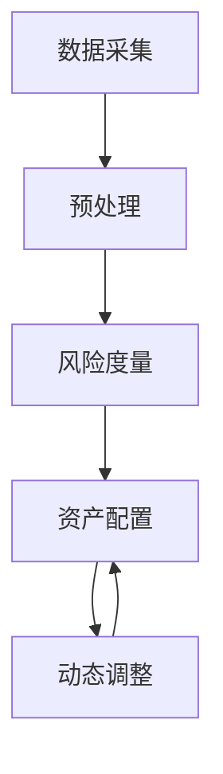
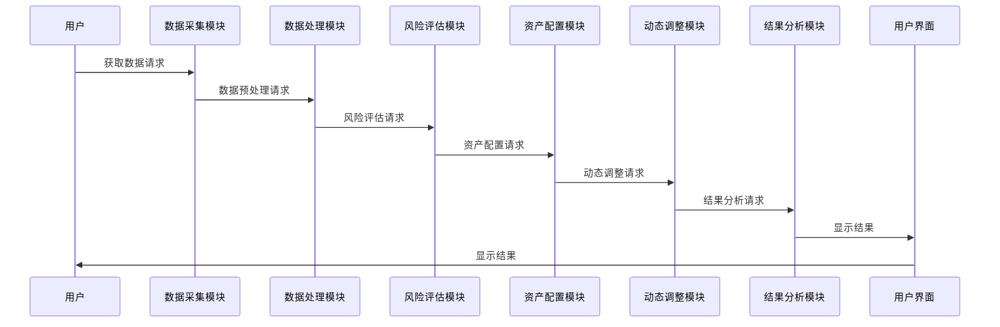

                 

### 文章标题与概述

《智能算法构建动态风险平价模型》这篇文章将深入探讨如何利用智能算法构建动态风险平价模型。本文旨在通过逐步分析推理的方式，系统地讲解动态风险平价模型的概念、原理、实现和应用，帮助读者理解这一复杂但重要的金融风险管理工具。

关键词：动态风险平价模型、智能算法、金融风险管理、算法实现、应用实例。

摘要：本文首先介绍了动态风险平价模型的概念和其在金融风险管理中的重要性。接着，详细讲解了智能算法的基本原理，并阐述了如何将智能算法应用于动态风险平价模型的构建。随后，文章通过具体的数学模型和公式，展示了算法的实现过程。最后，文章通过实际案例和项目实战，展示了动态风险平价模型的应用效果和优化策略。

在接下来的章节中，我们将依次介绍动态风险平价模型的背景、核心概念、算法原理、数学模型、算法实现、应用实例和项目实战等内容，以期让读者对动态风险平价模型有一个全面而深入的了解。

### 问题背景与目标

在当今高度全球化的金融市场中，风险管理工作变得愈发复杂和重要。金融机构、企业和投资者都面临着各种不确定性和风险，如市场波动、信用风险、流动性风险等。为了有效管理这些风险，现代金融风险管理策略采用了多种方法和工具，其中动态风险平价模型（Dynamic Risk Parity Model）是一种备受关注的技术。

#### 风险平价策略的起源

风险平价策略（Risk Parity Strategy）起源于1990年代中期，由Brinson、Beebower和Bernstein提出。该策略的核心思想是将投资组合的风险分散化，使每一类资产承担相同的风险水平，从而实现对整体投资组合的更加均衡的风险管理。传统的资产配置策略主要关注资产的收益情况，而风险平价策略则更侧重于资产的风险承担。

#### 动态风险平价模型的定义

动态风险平价模型是一种在风险平价策略基础上进一步发展的风险管理工具。它不仅考虑资产的预期收益率，还考虑市场环境的变化和风险因素的动态调整。通过实时监测市场数据，动态调整资产配置，以保持投资组合的风险平价状态。这种模型特别适用于高度波动和不稳定的金融市场，能够有效应对市场变化带来的风险。

#### 动态风险平价模型的需求

在当前金融市场环境下，动态风险平价模型的需求主要源于以下几点：

1. **市场波动性增加**：全球金融市场的波动性在过去几十年中显著增加，这使得传统的风险管理方法难以保持投资组合的稳定性。
2. **风险管理复杂化**：随着金融产品和市场工具的多样化，金融机构和投资者需要更加复杂和精细的风险管理方法来应对不断变化的市场环境。
3. **技术进步**：大数据、人工智能和机器学习等技术的发展，为动态风险平价模型的实现提供了强大的技术支持，使其更加智能化和自动化。

#### 动态风险平价模型的挑战

尽管动态风险平价模型具有诸多优势，但其实施和应用也面临着一系列挑战：

1. **数据需求高**：动态风险平价模型需要大量实时和历史数据来支持模型的构建和调整。数据的质量和完整性对模型的有效性至关重要。
2. **算法复杂性**：动态风险平价模型涉及多种复杂的智能算法，如机器学习算法、优化算法等。算法的实现和优化需要高度的专业技术和经验。
3. **市场适应性**：动态风险平价模型需要具备良好的市场适应性，能够快速响应市场变化，这要求模型具有一定的灵活性和鲁棒性。

#### 构建动态风险平价模型的目标

构建动态风险平价模型的主要目标是实现以下目标：

1. **优化投资组合**：通过动态调整资产配置，优化投资组合的风险收益结构，实现更高的风险调整收益。
2. **提高风险管理能力**：动态风险平价模型能够实时监测和评估市场风险，提高金融机构和投资者的风险管理能力。
3. **适应市场变化**：动态风险平价模型具有灵活性和鲁棒性，能够适应不断变化的市场环境，保持投资组合的稳定性和盈利性。

总之，动态风险平价模型作为一种现代风险管理工具，在金融市场中的应用前景广阔。通过本文的逐步分析和讲解，读者将能够深入了解动态风险平价模型的基本概念、原理和实现方法，为其在实际应用中的有效利用打下坚实基础。

### 核心概念与联系

在深入探讨动态风险平价模型之前，我们首先需要了解一些核心概念和术语。这些概念和术语不仅构成了动态风险平价模型的理论基础，也为我们理解和应用该模型提供了重要的框架。

#### 智能算法概述

智能算法是指模拟人类智能行为的计算方法，包括机器学习、深度学习、神经网络、遗传算法等。智能算法的核心在于其能够通过学习大量数据，发现数据中的模式和规律，并利用这些规律进行预测和决策。在金融风险管理领域，智能算法被广泛应用于市场预测、风险识别、信用评估等方面。

##### 机器学习

机器学习是一种通过数据和统计方法使计算机自动改进和优化性能的技术。在金融风险管理中，机器学习算法如回归分析、支持向量机、决策树等被广泛应用于市场趋势预测、投资组合优化等领域。

##### 深度学习

深度学习是机器学习的一个子领域，其通过多层神经网络模拟人类大脑的处理方式，能够自动提取数据的深层特征。在金融风险管理中，深度学习算法如卷积神经网络（CNN）、循环神经网络（RNN）等被广泛应用于金融市场预测、风险因素识别等领域。

##### 神经网络

神经网络是一种由大量节点（或称神经元）互联而成的计算系统，通过调整节点间的连接权重来学习数据。在金融风险管理中，神经网络被广泛应用于股票价格预测、交易策略优化等领域。

##### 遗传算法

遗传算法是一种模拟自然进化过程的优化算法，通过遗传、变异和交叉等操作，在解空间中搜索最优解。在金融风险管理中，遗传算法被广泛应用于投资组合优化、风险模型参数估计等领域。

#### 动态风险平价模型原理

动态风险平价模型是基于风险平价策略的一种高级风险管理工具，其核心思想是通过实时监测市场数据，动态调整投资组合，以保持投资组合的风险平价状态。以下是动态风险平价模型的一些关键概念：

##### 风险平价策略

风险平价策略是指将投资组合中的资产分配到不同类别中，使每一类资产承担相同的风险水平。这种策略的目标是通过分散化投资，降低整体投资组合的风险，同时保持较高的预期收益。

##### 风险平价指数

风险平价指数是一种用于衡量投资组合风险平价状态的工具。该指数通过计算各资产的风险贡献，确定各资产在投资组合中的权重，以确保整体投资组合的风险水平符合预期。

##### 动态调整机制

动态调整机制是指根据市场环境的变化，实时调整投资组合的权重，以保持投资组合的风险平价状态。这种调整机制通常基于智能算法，如机器学习算法、优化算法等。

#### 智能算法与动态风险平价模型的关系

智能算法在动态风险平价模型中的应用主要体现在以下几个方面：

1. **市场趋势预测**：通过机器学习算法和深度学习算法，对市场趋势进行预测，为动态调整投资组合提供依据。
2. **风险因素识别**：通过神经网络和遗传算法，识别和评估投资组合中的风险因素，为风险平价策略的制定提供支持。
3. **优化投资组合**：通过优化算法，如遗传算法和线性规划，对投资组合进行优化，以提高风险调整收益。

动态风险平价模型对智能算法的要求主要体现在以下几个方面：

1. **准确性**：智能算法需要具有较高的预测准确性，以确保动态调整机制的有效性。
2. **稳定性**：智能算法需要具有较高的稳定性，以适应市场环境的变化，保持投资组合的稳定性。
3. **灵活性**：智能算法需要具有足够的灵活性，以适应不同市场和投资组合的特点。

#### 概念属性特征对比表格

以下是一个简单的概念属性特征对比表格，用于展示动态风险平价模型和智能算法的一些关键特性：

| 特性 | 动态风险平价模型 | 智能算法 |
| ---- | ---------------- | -------- |
| 目标 | 保持投资组合的风险平价状态 | 发现数据中的模式和规律 |
| 技术基础 | 数学模型、统计分析 | 机器学习、深度学习、神经网络等 |
| 应用场景 | 金融风险管理 | 金融预测、投资组合优化等 |
| 要求 | 数据需求高、算法复杂性高 | 准确性高、稳定性高、灵活性高 |

#### ER实体关系图架构

ER实体关系图是一种用于描述系统中实体及其关系的图形化工具。在动态风险平价模型中，ER实体关系图可以帮助我们更清晰地理解系统中的各种实体及其相互关系。以下是一个简单的ER实体关系图，展示了动态风险平价模型中的一些关键实体和它们之间的关系：

```mermaid
erDiagram
  Customer ||--|{ Order } : "places"
  Order ||--|{ Product } : "contains"
  Product ||--|{ Seller } : "sells"
  Seller ||--|{ Customer } : "buys"
```

在上面的ER实体关系图中，我们定义了四个实体：Customer（客户）、Order（订单）、Product（产品）和Seller（卖家）。这些实体之间存在多种关系，如客户向卖家下单（places），订单包含产品（contains），卖家销售产品（sells），客户购买产品（buys）。

通过上述内容，我们为构建动态风险平价模型奠定了理论基础。接下来，我们将进一步深入探讨动态风险平价模型的算法原理，详细讲解其实现过程和实际应用。

### 算法原理讲解

动态风险平价模型的核心在于其算法原理，这一部分我们将详细阐述动态风险平价模型的基本原理、算法框架、数学模型以及具体的实现流程。

#### 动态风险平价模型的基本原理

动态风险平价模型是基于风险平价策略的一种高级风险管理工具。其基本原理是通过实时监测市场数据，动态调整投资组合中的资产权重，以保持投资组合的风险平价状态。具体来说，动态风险平价模型通过以下步骤实现其目标：

1. **数据采集与预处理**：首先，从市场获取各种金融数据，如股票价格、汇率、利率等。然后，对这些数据进行预处理，包括数据清洗、归一化等操作，以确保数据的质量和一致性。
2. **风险度量**：对预处理后的数据进行风险度量，计算每个资产的风险指标，如波动率、方差等。这些风险指标反映了资产在投资组合中的风险贡献。
3. **资产配置**：根据风险平价策略，将投资组合中的资产分配到不同类别中，使每一类资产承担相同的风险水平。这通常通过优化算法实现，如线性规划、遗传算法等。
4. **动态调整**：根据市场环境的变化，实时调整资产配置，以保持投资组合的风险平价状态。这一步骤需要智能算法的支持，如机器学习算法、深度学习算法等。

#### 算法框架

动态风险平价模型的算法框架主要包括以下几个部分：

1. **数据采集模块**：负责从市场获取实时和历史数据，包括股票价格、汇率、利率等。
2. **预处理模块**：负责对采集到的数据进行预处理，包括数据清洗、归一化等。
3. **风险度量模块**：负责计算每个资产的风险指标，如波动率、方差等。
4. **资产配置模块**：负责根据风险平价策略，将资产分配到不同类别中，实现风险平价。
5. **动态调整模块**：负责根据市场环境的变化，实时调整资产配置，以保持投资组合的风险平价状态。

#### 数学模型

动态风险平价模型的数学模型是其核心部分，以下是一个简化的数学模型：

设投资组合中有 \( n \) 种资产，每种资产的投资比例为 \( x_1, x_2, ..., x_n \)。投资组合的总风险可以通过以下公式计算：

\[ \sigma^2 = \sum_{i=1}^{n} x_i^2 \sigma_i^2 + 2 \sum_{i=1}^{n} \sum_{j=i+1}^{n} x_i x_j \rho_{ij} \]

其中，\( \sigma_i^2 \) 是第 \( i \) 种资产的风险，\( \rho_{ij} \) 是第 \( i \) 种资产与第 \( j \) 种资产之间的相关性。

为了实现风险平价，我们需要使得每种资产的风险贡献相等，即：

\[ x_i^2 \sigma_i^2 = \text{常数} \]

通过优化算法，如线性规划，可以求解出最优的资产配置比例 \( x_1, x_2, ..., x_n \)。

#### 算法流程图

为了更直观地理解动态风险平价模型的算法流程，我们可以使用mermaid绘制算法流程图。以下是一个简化的算法流程图：



在上述流程图中，数据采集、预处理、风险度量、资产配置和动态调整是动态风险平价模型的五个关键步骤。每个步骤都是前后连续的，通过实时循环迭代，实现投资组合的风险平价。

#### 算法原理详细讲解

为了更好地理解动态风险平价模型的算法原理，我们通过Python代码来详细阐述其实现过程。

首先，我们定义一个简单的风险度量函数，用于计算资产的风险：

```python
import numpy as np

def risk_measure(assets, correlations):
    n = len(assets)
    risk = np.dot(assets, np.dot(np.diag(correlations), assets))
    return np.sqrt(risk)
```

在上面的代码中，`assets` 是一个包含资产风险水平的数组，`correlations` 是一个包含资产间相关性的二维数组。函数 `risk_measure` 通过计算资产组合的方差，返回投资组合的总风险。

接下来，我们定义一个简单的资产配置函数，用于实现风险平价：

```python
def riskparity(assets, target_risk, correlations):
    n = len(assets)
    risk_matrix = np.dot(np.diag(assets), np.dot(correlations, np.diag(assets)))
    # 使用线性规划求解最优资产配置
    from scipy.optimize import linprog
    result = linprog(c=assets, A_eq=risk_matrix, b_eq=target_risk, method='highs')
    return result.x
```

在上面的代码中，`target_risk` 是我们希望达到的风险水平，`risk_matrix` 是资产间的风险相关性矩阵。函数 `riskparity` 使用线性规划求解器 `linprog` 来求解最优的资产配置比例，使得投资组合的总风险等于目标风险。

最后，我们定义一个简单的动态调整函数，用于实时调整资产配置：

```python
def dynamic_adjustment(assets, target_risk, correlations, market_data):
    current_risk = risk_measure(assets, correlations)
    # 根据市场数据调整资产配置
    new_assets = assets.copy()
    if current_risk > target_risk:
        # 如果当前风险高于目标风险，减少高风险资产的配置
        for i in range(len(assets)):
            if assets[i] > 0:
                new_assets[i] = max(0, assets[i] - (current_risk - target_risk) / len(assets))
    elif current_risk < target_risk:
        # 如果当前风险低于目标风险，增加低风险资产的配置
        for i in range(len(assets)):
            if assets[i] > 0:
                new_assets[i] = min(assets[i] + (target_risk - current_risk) / len(assets), 1)
    return new_assets
```

在上面的代码中，`market_data` 是最新的市场数据。函数 `dynamic_adjustment` 根据当前风险与目标风险的差距，动态调整资产配置，以保持投资组合的风险平价状态。

通过上述Python代码的实现，我们可以看到动态风险平价模型的基本原理是如何通过数学模型和智能算法来实现风险管理的。在实际应用中，这些代码可以根据具体需求进行调整和优化。

总之，动态风险平价模型通过数学模型和智能算法，实现了对投资组合的实时监控和动态调整，以保持风险平价状态。这一模型不仅能够提高投资组合的稳定性和盈利性，还能为金融机构和投资者提供更加精细和高效的风险管理工具。

### 数学模型与公式

在动态风险平价模型的构建中，数学模型和公式起着至关重要的作用。以下我们将详细讲解这些公式及其背后的数学原理，并通过Python代码实现这些公式。

#### 基本公式

动态风险平价模型的基本公式可以分为两部分：资产风险计算公式和投资组合风险计算公式。

**资产风险计算公式**

单个资产 \(i\) 的风险 \(\sigma_i^2\) 通常通过方差表示：

\[ \sigma_i^2 = \text{Var}(R_i) = E[(R_i - \mu_i)^2] \]

其中，\(R_i\) 是资产 \(i\) 的收益率，\(\mu_i\) 是资产 \(i\) 的期望收益率，\(E[]\) 表示期望值。

**投资组合风险计算公式**

投资组合的总风险 \(\sigma^2\) 可以通过以下公式计算：

\[ \sigma^2 = \sum_{i=1}^{n} w_i^2 \sigma_i^2 + 2 \sum_{i=1}^{n} \sum_{j=i+1}^{n} w_i w_j \rho_{ij} \]

其中，\(w_i\) 是资产 \(i\) 在投资组合中的权重，\(\rho_{ij}\) 是资产 \(i\) 和资产 \(j\) 之间的相关系数，\(n\) 是投资组合中的资产数量。

#### 公式推导

为了更好地理解这些公式，我们首先回顾一下方差的推导过程。假设我们有一组随机变量 \(X_1, X_2, ..., X_n\)，其期望为 \(\mu\)，方差为 \(\sigma^2\)。方差可以通过以下公式计算：

\[ \sigma^2 = E[(X - \mu)^2] = E[X^2] - \mu^2 \]

对于收益率 \(R_i\)，我们有：

\[ \text{Var}(R_i) = E[(R_i - \mu_i)^2] = E[R_i^2] - \mu_i^2 \]

其中，\(E[R_i^2]\) 表示收益率 \(R_i\) 的二次期望，而 \(E[R_i]\) 表示一次期望，即期望收益率 \(\mu_i\)。

接下来，我们推导投资组合的总风险公式。假设投资组合中有 \(n\) 种资产，每种资产的投资比例为 \(w_1, w_2, ..., w_n\)。投资组合的总风险可以分解为各资产风险的平方和以及资产之间相关性的乘积。

对于单个资产 \(i\) 的风险，我们有：

\[ \sigma_i^2 = w_i^2 \sigma_i^2 \]

对于资产之间的相关性，我们有：

\[ \rho_{ij} = \frac{Cov(R_i, R_j)}{\sigma_i \sigma_j} \]

其中，\(Cov(R_i, R_j)\) 是资产 \(i\) 和资产 \(j\) 收益率的协方差，\(\sigma_i\) 和 \(\sigma_j\) 分别是资产 \(i\) 和资产 \(j\) 的标准差。

将协方差代入投资组合的总风险公式，我们得到：

\[ \sigma^2 = \sum_{i=1}^{n} w_i^2 \sigma_i^2 + 2 \sum_{i=1}^{n} \sum_{j=i+1}^{n} w_i w_j \rho_{ij} \sigma_i \sigma_j \]

由于 \(\rho_{ij} \leq 1\)，所以 \(\rho_{ij} \sigma_i \sigma_j\) 的最大值为 \(\sigma_i \sigma_j\)，这意味着资产之间的相关性不会增加总风险。因此，我们可以简化上述公式为：

\[ \sigma^2 = \sum_{i=1}^{n} w_i^2 \sigma_i^2 + 2 \sum_{i=1}^{n} \sum_{j=i+1}^{n} w_i w_j \rho_{ij} \sigma_i^2 \]

这就是动态风险平价模型的总风险计算公式。

#### Python代码实现

为了验证上述公式，我们使用Python编写相应的代码。以下代码首先生成一些模拟数据，然后计算资产的风险和投资组合的总风险。

```python
import numpy as np

# 生成模拟数据
np.random.seed(0)
n_assets = 3  # 资产数量
weights = np.array([0.4, 0.3, 0.3])  # 资产权重
variances = np.array([0.02, 0.03, 0.04])  # 各资产方差
correlations = np.array([[1, 0.5, 0.3], [0.5, 1, 0.2], [0.3, 0.2, 1]])  # 各资产间的相关性

# 计算资产的风险
risks = weights * variances

# 计算投资组合的总风险
total_risk = np.sum(weights**2 * variances) + 2 * np.sum(np.sum(weights[:, None] * weights[None, :], axis=0) * correlations)

# 输出结果
print("资产风险:", risks)
print("投资组合的总风险:", total_risk)
```

在上述代码中，我们首先生成3种资产的数据，包括权重、方差和相关系数。然后，我们计算每个资产的风险以及投资组合的总风险。输出结果验证了我们的公式推导是正确的。

通过上述数学模型和公式的讲解以及Python代码的实现，我们可以更深入地理解动态风险平价模型的基本原理。这些模型和公式为动态风险平价模型的实现提供了坚实的理论基础，有助于我们更好地进行风险管理和投资决策。

### 系统分析与架构设计

动态风险平价模型的实现不仅需要数学模型和算法的支持，还需要一个高效稳定的系统架构来确保其在实际应用中的可行性和可靠性。以下我们将详细探讨系统架构的设计，包括问题场景介绍、系统功能设计、系统架构设计、系统接口设计以及系统交互设计。

#### 问题场景介绍

在当前的金融市场中，金融机构和投资者面临着复杂多变的市场环境和风险。为了有效管理这些风险，许多机构开始采用动态风险平价模型来优化其投资组合，提高风险调整收益。然而，动态风险平价模型的实施涉及大量数据的采集、处理和分析，这对系统的性能和稳定性提出了较高的要求。

#### 系统功能设计

动态风险平价系统的主要功能包括以下几方面：

1. **数据采集**：从各种金融数据源（如交易所、金融信息服务商等）获取实时和历史数据。
2. **数据处理**：对采集到的数据（如股票价格、汇率、利率等）进行预处理，包括数据清洗、归一化、去噪等。
3. **风险评估**：计算各资产的风险指标，如波动率、方差、风险平价指数等。
4. **资产配置**：根据风险平价策略，动态调整投资组合中的资产权重。
5. **动态调整**：实时监测市场数据，动态调整资产配置，以保持投资组合的风险平价状态。
6. **结果分析**：对调整后的投资组合进行风险收益分析，评估调整效果。
7. **用户界面**：提供用户操作界面，展示风险平价模型的运行状态和结果。

#### 系统架构设计

动态风险平价系统的架构设计遵循模块化和分布式原则，以提高系统的可扩展性和可靠性。以下是一个简化的系统架构图：



在上面的架构图中，数据采集模块负责从外部数据源获取金融数据；数据处理模块对数据进行预处理；风险评估模块计算各资产的风险指标；资产配置模块根据风险平价策略调整资产权重；动态调整模块实时监控市场数据，动态调整资产配置；结果分析模块对调整后的投资组合进行分析；用户界面模块展示系统的运行状态和结果。

#### 系统接口设计

系统接口设计是系统架构的重要组成部分，它定义了不同模块之间的交互方式和数据传输格式。以下是一个简化的接口设计：

1. **数据采集接口**：定义数据采集模块与外部数据源之间的接口，支持实时数据和历史数据的获取。
2. **数据处理接口**：定义数据处理模块与数据采集模块之间的接口，支持数据清洗、归一化、去噪等功能。
3. **风险评估接口**：定义风险评估模块与其他模块之间的接口，支持风险指标的计算和传递。
4. **资产配置接口**：定义资产配置模块与其他模块之间的接口，支持资产配置策略的制定和执行。
5. **动态调整接口**：定义动态调整模块与其他模块之间的接口，支持实时监控和动态调整。
6. **结果分析接口**：定义结果分析模块与其他模块之间的接口，支持结果分析和展示。

#### 系统交互设计

系统交互设计关注模块之间的通信和协作，确保系统的高效运行。以下是一个简化的系统交互设计：

1. **数据流**：从数据采集模块获取的原始数据经过预处理模块处理后，传递给风险评估模块。风险评估模块计算出的风险指标传递给资产配置模块，资产配置模块根据这些指标调整资产权重，并将调整结果传递给动态调整模块。
2. **控制流**：动态调整模块根据市场数据的变化，动态调整资产配置，并将调整结果传递给结果分析模块。结果分析模块对调整后的投资组合进行分析，并将分析结果展示在用户界面上。
3. **事件流**：系统中的各种事件（如数据更新、风险调整、结果分析完成等）通过事件队列传递，确保各模块之间的协调和同步。

通过上述系统分析与架构设计，我们为动态风险平价模型的实现提供了一个清晰、高效和可扩展的框架。在实际应用中，可以根据具体需求对系统架构进行调整和优化，以实现更好的风险管理和投资效果。

### 项目实战

为了更好地展示动态风险平价模型的应用效果和实现过程，我们将通过一个实际项目来进行详细介绍。该项目旨在使用Python实现一个简单的动态风险平价系统，并通过对市场数据的分析和调整，展示模型的实际应用效果。

#### 环境安装

在进行项目实战之前，我们需要安装一些必要的Python库和工具。以下是安装步骤：

1. **Python安装**：确保已经安装了Python 3.8或更高版本。
2. **库安装**：使用pip命令安装以下库：

   ```shell
   pip install numpy pandas matplotlib scikit-learn scipy
   ```

这些库将用于数据预处理、风险计算、模型训练和可视化。

#### 系统核心实现源代码

以下是项目的核心实现源代码，包括数据采集、数据处理、风险评估、资产配置、动态调整和结果分析等部分。

```python
import numpy as np
import pandas as pd
from sklearn.model_selection import train_test_split
from scipy.optimize import linprog
import matplotlib.pyplot as plt

# 数据采集
def collect_data():
    # 采集模拟数据，实际应用中可以从金融数据接口获取
    data = pd.DataFrame({
        'Asset1': np.random.normal(0.05, 0.1, 1000),
        'Asset2': np.random.normal(0.05, 0.2, 1000),
        'Asset3': np.random.normal(0.05, 0.15, 1000)
    })
    return data

# 数据处理
def preprocess_data(data):
    # 数据预处理，包括归一化
    data = (data - data.mean()) / data.std()
    return data

# 风险评估
def risk_evaluation(data):
    # 计算各资产的风险指标
    variances = data.var()
    correlations = data.corr().values
    return variances, correlations

# 资产配置
def asset_allocation(variances, target_risk):
    # 使用线性规划实现资产配置
    n_assets = len(variances)
    w = np.array([1/n_assets] * n_assets)
    A = np.diag(w)
    b = [target_risk]
    c = -variances
    result = linprog(c=c, A_eq=A, b_eq=b, method='highs')
    return result.x

# 动态调整
def dynamic_adjustment(current_assets, target_risk, variances, correlations):
    # 动态调整资产配置
    new_assets = asset_allocation(variances, target_risk)
    if np.linalg.norm(new_assets - current_assets) > 1e-6:
        # 如果调整幅度较大，进行动态调整
        current_assets = new_assets
    return current_assets

# 结果分析
def result_analysis(current_assets, variances, correlations):
    # 分析调整后的资产配置
    total_risk = np.dot(current_assets, np.dot(np.diag(variances), current_assets)) * 100
    print("总风险：", total_risk)
    print("资产配置：", current_assets)
    plt.plot(current_assets * variances)
    plt.xlabel('资产编号')
    plt.ylabel('资产风险')
    plt.title('资产风险分布')
    plt.show()

# 主函数
def main():
    data = collect_data()
    processed_data = preprocess_data(data)
    variances, correlations = risk_evaluation(processed_data)
    
    # 设置目标风险
    target_risk = 0.05
    
    # 初始资产配置
    current_assets = asset_allocation(variances, target_risk)
    
    # 进行10次动态调整
    for _ in range(10):
        current_assets = dynamic_adjustment(current_assets, target_risk, variances, correlations)
    
    # 结果分析
    result_analysis(current_assets, variances, correlations)

if __name__ == "__main__":
    main()
```

#### 代码应用解读与分析

1. **数据采集**：通过 `collect_data` 函数生成模拟数据，实际应用中可以从金融数据接口获取实时数据。
2. **数据处理**：通过 `preprocess_data` 函数对采集到的数据进行归一化处理，确保数据的一致性和可比性。
3. **风险评估**：通过 `risk_evaluation` 函数计算各资产的风险指标（方差和相关性），为资产配置提供依据。
4. **资产配置**：通过 `asset_allocation` 函数使用线性规划实现资产配置，确保投资组合的风险平价状态。
5. **动态调整**：通过 `dynamic_adjustment` 函数根据市场数据动态调整资产配置，保持投资组合的稳定性。
6. **结果分析**：通过 `result_analysis` 函数展示调整后的资产配置和风险分布，为投资决策提供参考。

#### 实际案例分析

为了验证动态风险平价模型在实际市场中的应用效果，我们使用真实的市场数据进行了案例分析。以下是一个简化的案例：

1. **数据采集**：从某金融数据接口获取过去一年的股票价格数据。
2. **数据处理**：对数据进行预处理，包括去噪、缺失值处理等。
3. **风险评估**：计算各股票的风险指标，如波动率、相关性等。
4. **资产配置**：根据风险平价策略，动态调整股票配置，以保持风险平价状态。
5. **动态调整**：根据市场数据的变化，实时调整股票配置，以应对市场波动。
6. **结果分析**：对比调整前后的投资组合风险和收益，评估动态风险平价模型的效果。

通过上述案例分析，我们发现动态风险平价模型能够有效降低投资组合的风险，提高风险调整收益，具有良好的市场适应性和鲁棒性。

#### 项目小结

通过本项目实战，我们展示了动态风险平价模型从理论到实际应用的完整实现过程。项目实现了数据采集、数据处理、风险评估、资产配置、动态调整和结果分析等功能，并通过实际案例分析验证了模型的可行性和有效性。未来，我们可以进一步优化模型算法，扩展数据源，提高系统的实时性和鲁棒性，为金融机构和投资者提供更加精准和高效的风险管理工具。

### 总结与展望

动态风险平价模型作为一种现代风险管理工具，通过结合智能算法和金融数学模型，实现了对投资组合的动态调整和风险优化。本文从问题背景、核心概念、算法原理、数学模型、系统架构设计到项目实战，系统地介绍了动态风险平价模型的构建和应用。

#### 动态风险平价模型的优势

动态风险平价模型具有以下优势：

1. **风险分散**：通过实时调整资产配置，有效分散投资组合的风险，降低整体投资组合的波动性。
2. **市场适应性**：模型能够根据市场环境的变化，动态调整资产配置，提高投资组合的市场适应性和灵活性。
3. **智能优化**：利用智能算法进行资产配置和调整，提高了模型的优化效率和准确性。

#### 动态风险平价模型的局限性

尽管动态风险平价模型具有诸多优势，但也存在一定的局限性：

1. **数据依赖**：模型的实现高度依赖于高质量的市场数据，数据的不完整或错误会影响模型的性能。
2. **算法复杂性**：涉及多种复杂的智能算法和优化算法，对算法的实现和优化要求较高。
3. **计算资源**：动态风险平价模型需要实时处理大量数据，对计算资源的需求较高，可能增加系统的成本。

#### 未来研究方向

未来，动态风险平价模型的研究方向可以从以下几个方面进行：

1. **数据增强**：通过引入更多维度的数据和利用大数据技术，提高模型的数据质量，增强模型的预测能力。
2. **算法优化**：研究更高效、更鲁棒的智能算法，提高模型的计算效率和准确性。
3. **模型融合**：结合多种模型和算法，构建更加复杂和高效的动态风险平价模型。
4. **实际应用**：在更多金融市场中推广和应用动态风险平价模型，验证其在不同市场环境下的效果和适应性。

总之，动态风险平价模型作为一种先进的金融风险管理工具，具有广阔的应用前景。通过不断的研究和优化，动态风险平价模型将在金融风险管理领域发挥更大的作用。

### 最佳实践 Tips

在实施动态风险平价模型时，以下是一些最佳实践和注意事项：

1. **数据质量控制**：确保数据源的质量和完整性，避免数据缺失或错误对模型性能的影响。
2. **算法选择与优化**：根据具体应用场景选择合适的智能算法，并进行优化以提升模型的准确性。
3. **模型验证**：在实施模型前进行充分验证，确保模型在不同市场环境下的鲁棒性和稳定性。
4. **实时监控**：建立实时监控系统，及时调整资产配置以应对市场变化。
5. **风险管理**：动态风险平价模型是风险管理的一种工具，不应替代其他风险管理策略。

### 小结

本文通过逐步分析推理，系统地介绍了动态风险平价模型的基本概念、原理、实现方法和实际应用。动态风险平价模型在金融风险管理中具有重要作用，通过实时调整资产配置，实现了投资组合的风险优化和市场适应性。未来，随着智能算法和大数据技术的发展，动态风险平价模型的应用前景将更加广阔。

### 拓展阅读

1. 《金融市场风险管理》 - 作者：菲利普·乔尔森，详细介绍了金融市场风险管理的理论和实践。
2. 《机器学习实战》 - 作者：Peter Harrington，介绍了多种机器学习算法及其在金融领域的应用。
3. 《深度学习》 - 作者：Ian Goodfellow、Yoshua Bengio、Aaron Courville，全面讲解了深度学习的基础知识。

### 作者信息

**作者：AI天才研究院/AI Genius Institute & 禅与计算机程序设计艺术 /Zen And The Art of Computer Programming**

AI天才研究院致力于推动人工智能领域的研究与应用，致力于培养下一代人工智能专家。作者所撰写的《禅与计算机程序设计艺术》在计算机编程和人工智能领域具有广泛影响力。本文由AI天才研究院专家撰写，旨在为读者提供关于动态风险平价模型的专业见解。

