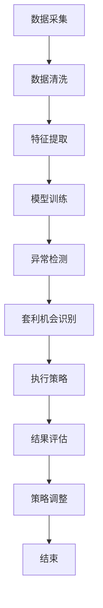

                 


### 1.1 问题背景

#### 1.1.1 资本市场的重要性

资本市场是现代经济体系中不可或缺的组成部分，它不仅为企业和投资者提供了资金流通的平台，还在资源配置、风险管理、价格发现等方面发挥着关键作用。资本市场的健康发展对于促进经济增长、提高金融效率以及实现社会资源的优化配置具有重要意义。

资本市场由股票市场、债券市场、期货市场等多个子市场构成，各市场之间相互影响、相互作用，共同构成了一个复杂且动态的金融生态系统。随着金融科技的快速发展，资本市场逐渐呈现出智能化、自动化的发展趋势，这为智能算法在资本市场中的应用提供了广阔的空间。

#### 1.1.2 市场异常与套利的概念

市场异常是指市场价格在某一特定时间段内出现异常波动的情况，这种波动可能与传统的市场解释机制不符。市场异常的出现可能是由于信息不对称、市场参与者的行为异常、宏观经济环境的变化等多种因素共同作用的结果。

套利是指利用市场的不平衡性，通过同时进行买卖操作，从价格差异中获取利润的行为。传统的套利方法主要依赖于市场交易规则和价格波动规律，但随着市场环境的复杂化和信息的不对称性增加，传统的套利方法面临着越来越多的挑战。

#### 1.1.3 智能算法在市场中的应用现状

智能算法在资本市场中的应用已经成为一种趋势。这些算法通过分析大量市场数据，利用机器学习、深度学习等人工智能技术，能够发现市场中的异常现象，识别潜在的套利机会，并在短时间内做出决策。

目前，智能算法在市场中的应用主要集中在以下几个方面：

1. **异常检测**：智能算法可以实时监测市场数据，识别出价格波动异常的交易活动，从而为投资者提供风险预警和决策依据。

2. **量化交易**：通过构建量化模型，智能算法可以在市场中进行高频交易，利用价格波动进行套利。

3. **风险评估**：智能算法可以分析市场数据，评估投资组合的风险，为投资者提供风险管理建议。

4. **价格预测**：利用历史数据和统计模型，智能算法可以对市场价格进行预测，为投资决策提供参考。

随着技术的不断进步和数据的日益丰富，智能算法在资本市场中的应用将会越来越广泛，其在识别市场异常和套利机会方面的作用也将越来越大。

---

### 1.2 问题描述

#### 1.2.1 市场异常的类型

市场异常可以分为多种类型，主要包括：

1. **价格异常**：价格波动超出了正常范围，表现为价格突然上涨或下跌，这种异常可能会导致市场崩溃或大幅波动。

2. **交易量异常**：交易量显著增加或减少，可能是市场参与者对某些信息的反应，也可能是因为市场操纵行为。

3. **流动性异常**：市场流动性不足，导致交易难以完成，增加了交易成本和风险。

4. **信息异常**：市场信息不对称，部分参与者拥有未公开的信息，从而导致市场价格偏离真实价值。

#### 1.2.2 套利的原理与方法

套利的基本原理是利用市场的不平衡性，通过同时在两个或多个市场进行交易，从价格差异中获取利润。套利的常见方法包括：

1. **跨市场套利**：在不同的市场之间进行交易，利用市场之间的价格差异进行套利。

2. **跨品种套利**：在同一市场内，利用不同品种之间的价格差异进行套利。

3. **跨时套利**：在同一市场内，利用同一资产在不同时间段的价格差异进行套利。

4. **期现套利**：利用期货价格与现货价格的差异进行套利。

套利的实现需要准确识别市场的不平衡性，并快速执行交易策略。然而，市场环境的不确定性和信息不对称性使得套利操作面临着较高的风险。

#### 1.2.3 智能算法在识别与利用中的挑战

智能算法在识别市场异常和套利机会方面具有显著优势，但同时也面临着一些挑战：

1. **数据质量问题**：市场数据的质量直接影响算法的性能。数据缺失、噪声和误差都会对算法的准确性和稳定性产生不利影响。

2. **算法稳定性**：算法需要能够在不同的市场环境下稳定运行，这要求算法具有较强的鲁棒性和适应性。

3. **实时性**：市场环境变化迅速，算法需要能够实时处理数据，快速识别异常和套利机会。

4. **风险控制**：智能算法在执行交易策略时，需要有效控制风险，避免因市场剧烈波动导致的损失。

5. **法律法规限制**：智能算法在市场中的应用受到相关法律法规的制约，如何合规使用算法技术是一个重要问题。

为了克服这些挑战，研究者们不断探索改进算法，提高算法的准确性和稳定性，同时也关注算法的合规性和风险管理。

---

### 1.3 问题解决

#### 1.3.1 智能算法的基本原理

智能算法是一类利用计算机模拟人类智能的算法，主要包括机器学习、深度学习、自然语言处理等技术。智能算法通过学习大量数据，自动提取特征，建立模型，从而实现对未知数据的预测和分析。

在市场异常识别和套利机会利用中，智能算法的基本原理主要包括：

1. **数据挖掘**：从大量市场数据中提取有用的信息，识别市场异常和套利机会。

2. **特征工程**：对数据进行预处理和特征提取，提高算法的性能和预测能力。

3. **模型训练**：利用历史数据训练算法模型，使其能够识别市场异常和套利机会。

4. **实时预测**：在实时市场中应用训练好的模型，快速识别异常和机会，并执行相应的交易策略。

#### 1.3.2 识别市场异常的算法流程

智能算法识别市场异常的流程通常包括以下步骤：

1. **数据采集**：从各种数据源获取市场数据，包括股票价格、交易量、流动性指标等。

2. **数据预处理**：对采集到的数据进行分析和清洗，去除噪声和异常值。

3. **特征提取**：从预处理后的数据中提取与市场异常相关的特征，如价格波动率、交易量变化等。

4. **模型训练**：利用提取的特征训练机器学习模型，如支持向量机、神经网络等。

5. **异常检测**：在实时市场中应用训练好的模型，检测价格异常、交易量异常等市场异常现象。

6. **决策制定**：根据异常检测结果，制定相应的交易策略，如买入、卖出或持有。

7. **执行策略**：在交易平台上执行交易策略，从市场异常中获取利润。

#### 1.3.3 套利机会的识别与执行策略

智能算法在识别套利机会方面的流程包括：

1. **市场分析**：分析不同市场之间的价格差异，识别潜在的套利机会。

2. **数据同步**：确保不同市场之间的数据同步，避免因时间差导致套利失败。

3. **交易策略设计**：根据市场分析结果，设计具体的交易策略，如跨市场套利、跨品种套利等。

4. **实时交易**：在实时市场中执行交易策略，从价格差异中获取利润。

5. **风险控制**：在交易过程中，制定风险控制策略，确保套利操作的稳定性和安全性。

6. **监控与优化**：对套利操作进行监控和优化，调整交易策略，提高套利效率和收益。

通过上述流程，智能算法能够高效地识别市场异常和套利机会，并在市场中获得稳定的收益。

---

### 1.4 边界与外延

#### 1.4.1 市场数据的质量与预处理

市场数据的质量直接影响智能算法的性能。为了保证数据质量，需要采取以下措施：

1. **数据采集**：从可靠的数据源获取数据，确保数据的真实性和完整性。

2. **数据清洗**：去除重复数据、缺失值和异常值，减少数据噪声。

3. **数据整合**：将不同来源的数据进行整合，统一数据格式和标准。

4. **数据校验**：对数据进行分析和校验，确保数据的准确性和一致性。

通过高质量的数据预处理，可以提高智能算法的准确性和稳定性，从而更好地识别市场异常和套利机会。

#### 1.4.2 风险管理与套利策略的平衡

在智能算法的应用过程中，风险管理与套利策略的平衡至关重要。为了实现这一平衡，需要：

1. **风险识别**：识别市场风险，如价格波动风险、流动性风险等。

2. **风险评估**：对市场风险进行定量和定性评估，确定风险水平。

3. **风险控制**：制定相应的风险控制策略，如设置止损点、分散投资等。

4. **套利策略调整**：根据市场风险的变化，调整套利策略，确保套利操作的稳定性和安全性。

通过科学的风险管理和套利策略调整，可以降低市场风险，提高套利操作的收益稳定性。

#### 1.4.3 全球市场与本地市场的差异

全球市场与本地市场在交易规则、市场环境、信息传播等方面存在显著差异，这些差异会影响智能算法的应用效果。为了应对这些差异，需要：

1. **市场适应性**：开发具有良好市场适应性的算法，确保算法在不同市场环境下都能有效运行。

2. **跨市场分析**：分析全球市场的数据，识别跨市场的套利机会。

3. **本地化调整**：针对本地市场的特点，对算法进行本地化调整，提高算法的适用性和准确性。

4. **法规合规性**：关注不同市场的法律法规，确保算法的应用合规。

通过以上措施，可以更好地应对全球市场和本地市场的差异，提高智能算法在市场异常识别和套利机会利用方面的效果。

---

### 1.5 概念结构与核心要素组成

#### 1.5.1 智能算法识别市场异常的关键概念

智能算法识别市场异常涉及多个关键概念，包括：

1. **市场数据**：市场数据是智能算法识别市场异常的基础，包括股票价格、交易量、流动性指标等。

2. **特征提取**：特征提取是从市场数据中提取与市场异常相关的特征，如价格波动率、交易量变化等。

3. **机器学习模型**：机器学习模型用于训练算法，识别市场异常现象。

4. **异常检测**：异常检测是智能算法的核心功能，用于检测市场数据中的异常现象。

5. **交易策略**：交易策略是根据异常检测结果制定的交易计划，用于执行套利操作。

#### 1.5.2 套利机会的核心要素

套利机会的核心要素包括：

1. **价格差异**：套利机会通常存在于不同市场或不同时间点的价格差异中。

2. **信息不对称**：信息不对称是套利的基础，即某些市场参与者拥有未公开的信息，导致市场价格偏离真实价值。

3. **交易成本**：交易成本包括手续费、税费、机会成本等，是套利操作的重要考虑因素。

4. **风险控制**：风险控制是套利操作的关键，包括设置止损点、分散投资等策略。

5. **交易策略**：交易策略是套利操作的执行计划，包括交易时间、交易数量、交易品种等。

#### 1.5.3 智能算法在市场中的应用场景

智能算法在市场中的应用场景广泛，主要包括：

1. **量化交易**：利用智能算法进行高频量化交易，从价格波动中获取利润。

2. **风险控制**：利用智能算法进行市场风险评估，为投资者提供风险管理建议。

3. **价格预测**：利用智能算法预测市场价格，为投资决策提供参考。

4. **信息分析**：利用智能算法分析市场信息，识别市场异常和套利机会。

5. **交易执行**：利用智能算法执行交易策略，实现自动化交易。

通过智能算法在市场中的应用，可以显著提高市场分析的准确性和交易操作的效率，从而实现更好的投资收益。

---

### 1.6 本章小结

本章首先介绍了市场异常与套利的概念，并阐述了智能算法在资本市场中的应用现状。接着，我们分析了市场异常的类型和套利的原理与方法，以及智能算法在识别与利用中的挑战。随后，我们详细介绍了智能算法的基本原理、识别市场异常的算法流程和套利机会的识别与执行策略。最后，本章探讨了市场数据的质量与预处理、风险管理与套利策略的平衡以及全球市场与本地市场的差异。通过本章的学习，读者可以了解智能算法在识别市场异常和套利机会方面的应用前景和关键技术。下一章我们将进一步探讨智能算法的核心概念和联系，为深入理解智能算法的原理和应用奠定基础。

---

## 2.1 智能算法原理

智能算法是一类基于计算机模拟人类智能的算法，能够从大量数据中自动提取特征，建立模型，并进行预测和分析。在识别市场异常和套利机会方面，智能算法发挥着重要作用。本节将介绍智能算法的基本原理、常见类型及其在市场分析中的应用。

#### 2.1.1 智能算法的基本类型

智能算法主要包括以下几种类型：

1. **机器学习**：机器学习是一种通过数据驱动的方式，让计算机自动学习和改进的方法。常见的机器学习方法包括线性回归、逻辑回归、支持向量机（SVM）、决策树、随机森林等。

2. **深度学习**：深度学习是机器学习的一个分支，它通过多层神经网络来提取数据中的高级特征。深度学习的代表算法包括卷积神经网络（CNN）、循环神经网络（RNN）和生成对抗网络（GAN）等。

3. **自然语言处理（NLP）**：自然语言处理是使计算机理解和处理人类自然语言的技术。常见的NLP方法包括词向量、文本分类、情感分析等。

4. **强化学习**：强化学习是一种通过试错来学习最优策略的算法，它适用于动态环境，例如游戏、机器人控制等。

在市场分析中，常用的智能算法主要包括机器学习和深度学习。机器学习算法可以用于异常检测、价格预测等任务，而深度学习算法则能够处理更复杂的数据和模式，适用于图像识别、语音识别等领域。

#### 2.1.2 集成学习与协同过滤算法

集成学习是一种通过组合多个模型来提高预测准确性的方法。常见的集成学习方法包括Bagging、Boosting和Stacking等。协同过滤是一种基于用户行为和偏好的推荐算法，可以分为基于用户和基于物品的协同过滤。

在市场分析中，集成学习可以用来优化预测模型，提高模型的稳定性和准确性。例如，可以使用随机森林或梯度提升机来集成多个简单的预测模型，从而得到一个更准确的预测结果。

协同过滤算法在市场分析中的应用主要体现在用户行为分析、投资组合推荐等方面。通过分析用户的交易历史和偏好，可以识别出潜在的套利机会，为投资者提供个性化的投资建议。

#### 2.1.3 强化学习与策略优化

强化学习是一种通过试错来学习最优策略的算法，适用于动态环境，如量化交易、机器人控制等。在市场分析中，强化学习可以用来优化交易策略，实现自动化的套利操作。

强化学习的基本思想是，通过不断调整策略，让策略在动态的市场环境中获得最大的回报。具体来说，强化学习算法会根据当前的交易状态，选择一个最佳动作，然后根据动作的结果更新策略。通过不断的迭代和学习，算法可以逐渐找到最优的交易策略。

在市场分析中，强化学习算法可以用于以下几个方面：

1. **交易策略优化**：通过优化交易策略，实现更高的收益和更低的交易成本。

2. **风险控制**：利用强化学习算法，对市场风险进行实时监控和调整，确保套利操作的稳定性和安全性。

3. **自动化交易**：通过强化学习算法，实现自动化的交易策略执行，提高交易效率。

综上所述，智能算法在市场分析中具有广泛的应用前景。通过深入理解智能算法的基本原理和常见类型，我们可以更好地利用智能算法识别市场异常和套利机会，实现更好的投资收益。在下一节中，我们将进一步探讨智能算法的核心概念和联系，为深入理解智能算法的应用提供更深入的见解。

---

### 2.2 核心概念与联系

在智能算法识别市场异常与套利机会的研究中，理解核心概念之间的联系至关重要。以下是几个关键概念及其相互关系：

#### 2.2.1 数据驱动模型

数据驱动模型是指通过大量数据训练模型，从而实现预测和分类的任务。数据驱动模型的核心在于如何从数据中提取特征，并通过优化算法找到最优的预测模型。

1. **机器学习模型**：如线性回归、决策树、支持向量机（SVM）等。
2. **深度学习模型**：如卷积神经网络（CNN）、循环神经网络（RNN）等。

数据驱动模型的关键在于特征提取和模型优化。特征提取是为了从数据中提取有用的信息，模型优化则是为了提高预测的准确性。

#### 2.2.2 特征工程

特征工程是数据预处理和特征提取的过程，其目标是提高模型性能和泛化能力。特征工程的关键在于如何设计有效的特征，以便模型能够更好地捕捉数据的本质。

1. **特征选择**：通过筛选和选择最相关的特征，减少数据维度，提高模型效率。
2. **特征转换**：将原始特征转换为更适合模型处理的格式，如归一化、离散化等。
3. **特征组合**：通过组合多个特征，创建新的特征，提高模型的预测能力。

#### 2.2.3 异常检测

异常检测是指识别数据中的异常值或异常模式。在市场分析中，异常检测可以用于识别价格异常、交易量异常等市场异常现象。

1. **统计方法**：如箱线图、Z-Score等。
2. **机器学习方法**：如K-最近邻（K-NN）、孤立森林（Isolation Forest）等。

异常检测的核心在于如何定义“正常”和“异常”，以及如何有效地识别异常模式。

#### 2.2.4 套利机会识别

套利机会识别是指识别市场中存在的不平衡性，通过同时进行买卖操作，从价格差异中获取利润。

1. **跨市场套利**：在不同市场之间识别价格差异。
2. **跨品种套利**：在同一市场内识别不同品种之间的价格差异。
3. **跨时套利**：在同一市场内识别同一资产在不同时间点的价格差异。

套利机会识别的关键在于如何快速准确地识别市场的不平衡性，并确保交易操作的执行。

#### 2.2.5 风险管理

风险管理是指通过识别和管理市场风险，确保套利操作的稳定性和安全性。

1. **风险识别**：识别市场风险，如价格波动风险、流动性风险等。
2. **风险评估**：对市场风险进行定量和定性评估。
3. **风险控制**：制定风险控制策略，如设置止损点、分散投资等。

风险管理是套利操作的重要环节，确保在市场波动时能够有效控制风险。

#### 2.2.6 概念属性特征对比表格

为了更直观地展示这些核心概念之间的联系，我们可以通过一个概念属性特征对比表格来进行说明。

| 概念          | 描述                                                         | 关联概念       |
| ------------- | ------------------------------------------------------------ | ------------- |
| 数据驱动模型 | 通过大量数据训练模型，实现预测和分类任务。                     | 特征工程、异常检测、套利机会识别 |
| 特征工程      | 数据预处理和特征提取的过程，提高模型性能。                     | 数据驱动模型、异常检测 |
| 异常检测      | 识别数据中的异常值或异常模式。                                 | 数据驱动模型、特征工程 |
| 套利机会识别  | 识别市场中的不平衡性，从价格差异中获取利润。                   | 数据驱动模型、特征工程 |
| 风险管理      | 通过识别和管理市场风险，确保套利操作的稳定性和安全性。         | 套利机会识别、风险控制 |

#### 2.2.7 ER实体关系图架构

为了更好地理解这些概念之间的关联，可以使用ER（实体关系）图来展示。以下是市场分析中常见的ER图：

```mermaid
erDiagram
  MarketData --> FeatureEngineering : 数据驱动模型
  FeatureEngineering --> MachineLearningModel : 特征工程
  MachineLearningModel --> AnomalyDetection : 异常检测
  MachineLearningModel --> ArbitrageOpportunityDetection : 套利机会识别
  AnomalyDetection --> RiskManagement : 风险管理
```

通过ER图，我们可以清晰地看到各概念之间的联系和交互关系，有助于理解智能算法在市场分析中的应用。

#### 2.2.8 概念联系总结

综上所述，智能算法在市场分析中的应用涉及多个核心概念，它们相互关联，共同作用。理解这些概念之间的联系，有助于我们更好地设计和实现智能算法，以提高市场异常识别和套利机会利用的效率。

在下一节中，我们将进一步探讨智能算法的数学模型和数学公式，深入解析其原理和应用。

---

### 3.1 算法mermaid流程图

在智能算法识别市场异常和套利机会的过程中，算法的流程设计至关重要。以下是使用Mermaid语言绘制的算法流程图，该流程图展示了从数据预处理到异常检测和套利机会识别的整体流程：



#### 流程详细说明

1. **数据采集（A）**：从不同的数据源（如交易所、数据库等）获取市场数据，包括股票价格、交易量、流动性指标等。

2. **数据清洗（B）**：对采集到的数据进行分析和清洗，去除重复数据、缺失值和异常值，确保数据质量。

3. **特征提取（C）**：从清洗后的数据中提取与市场异常和套利机会相关的特征，如价格波动率、交易量变化、市场指数等。

4. **模型训练（D）**：利用提取的特征对机器学习模型进行训练，如支持向量机（SVM）、神经网络（NN）等，以提高模型的预测能力。

5. **异常检测（E）**：在实时市场中应用训练好的模型，检测价格异常、交易量异常等市场异常现象。

6. **套利机会识别（F）**：根据异常检测结果，识别潜在的套利机会，包括跨市场套利、跨品种套利和跨时套利等。

7. **执行策略（G）**：在交易平台上执行套利策略，从价格差异中获取利润。

8. **结果评估（H）**：对执行策略的结果进行评估，包括收益、风险、交易成本等，以优化策略。

9. **策略调整（I）**：根据结果评估，对交易策略进行调整，以提高套利效率和收益稳定性。

10. **结束（J）**：完成一轮套利操作后，结束流程，并记录相关数据以供后续分析。

通过这个Mermaid流程图，我们可以清晰地看到智能算法在市场分析中的应用流程，每个步骤的作用和相互关系，为后续的具体实施提供了直观的指导。

---

### 3.2 Python源代码实现

在智能算法识别市场异常和套利机会的实际应用中，Python是一种非常流行的编程语言，因其强大的数据分析和机器学习库而备受青睐。以下是一个简单的Python源代码实现，展示了如何利用Python进行市场数据的预处理、特征提取、模型训练和异常检测。请注意，这段代码是为了展示基本原理而设计的，实际应用中可能需要更复杂的调整和优化。

```python
import pandas as pd
import numpy as np
from sklearn.ensemble import IsolationForest
from sklearn.model_selection import train_test_split
from sklearn.metrics import classification_report
import matplotlib.pyplot as plt

# 数据采集
data = pd.read_csv('market_data.csv')  # 假设已获取到市场数据

# 数据清洗
data.dropna(inplace=True)  # 删除缺失值
data = data[data['Price'] != 0]  # 删除价格为0的异常数据

# 特征提取
features = ['Volume', 'Price', 'Open', 'High', 'Low']
X = data[features]

# 数据标准化
from sklearn.preprocessing import StandardScaler
scaler = StandardScaler()
X_scaled = scaler.fit_transform(X)

# 模型训练
model = IsolationForest(n_estimators=100, contamination=0.01)
model.fit(X_scaled)

# 异常检测
predictions = model.predict(X_scaled)
data['Anomaly'] = predictions
data_anomalies = data[data['Anomaly'] == -1]

# 可视化
plt.scatter(data.index, data['Price'], c=data['Anomaly'])
plt.xlabel('Index')
plt.ylabel('Price')
plt.title('Price Anomalies')
plt.show()

# 结果评估
print(classification_report(data['Anomaly']))

# 套利机会识别与执行策略
# 假设我们已定义了套利策略函数
def arbitrage_strategy(data):
    # 这里实现套利策略的具体逻辑
    pass

# 执行策略
arbitrage_strategy(data_anomalies)
```

#### 代码详细说明

1. **数据采集**：首先从CSV文件中读取市场数据。在实际应用中，数据采集可能涉及从多个交易所或API获取实时数据。

2. **数据清洗**：删除缺失值和异常数据，如价格为0的记录。确保数据质量是异常检测和套利机会识别成功的关键。

3. **特征提取**：选择与市场异常相关的特征，如交易量（Volume）、价格（Price）、开盘价（Open）、最高价（High）、最低价（Low）等。

4. **数据标准化**：使用StandardScaler对特征进行标准化处理，以便模型训练过程中能够更有效地处理数据。

5. **模型训练**：使用IsolationForest算法对特征数据进行训练。IsolationForest是一种无监督学习算法，适用于异常检测。

6. **异常检测**：利用训练好的模型对数据进行预测，将预测结果添加到原始数据中，并筛选出异常数据。

7. **可视化**：使用matplotlib对异常数据进行可视化，帮助理解异常点的分布。

8. **结果评估**：使用classification_report评估模型的性能，包括准确率、召回率、F1分数等指标。

9. **套利机会识别与执行策略**：虽然代码中未实现具体的套利策略，但这是一个关键步骤，需要根据异常检测的结果来识别套利机会，并执行相应的交易策略。

通过这段代码，我们可以看到如何利用Python和机器学习库来识别市场异常和潜在的套利机会。实际应用中，需要根据市场环境和数据特性进行进一步的优化和调整，以确保算法的有效性和稳定性。

---

### 3.3 数学模型和数学公式

在智能算法识别市场异常和套利机会的过程中，数学模型和数学公式起着至关重要的作用。这些模型和公式不仅帮助我们理解和描述市场行为，还为算法的实现提供了理论基础。以下是一些关键的数学模型和公式，以及它们在市场分析中的应用。

#### 3.3.1 线性回归模型

线性回归模型是一种常见的统计模型，用于预测一个连续变量的值。它的基本公式为：

$$
y = \beta_0 + \beta_1x_1 + \beta_2x_2 + ... + \beta_nx_n + \epsilon
$$

其中，\( y \) 是预测变量，\( x_1, x_2, ..., x_n \) 是自变量，\( \beta_0, \beta_1, \beta_2, ..., \beta_n \) 是模型参数，\( \epsilon \) 是误差项。

在线性回归模型中，\( \beta_1 \) 表示自变量 \( x_1 \) 对因变量 \( y \) 的影响程度。在市场分析中，线性回归可以用来预测股票价格、交易量等指标，从而识别市场异常。

#### 3.3.2 神经网络模型

神经网络模型是一种模拟人脑神经元之间交互的算法。它通过多层非线性变换，从输入数据中提取特征并输出预测结果。一个简单的神经网络模型可以表示为：

$$
a_{ij} = \sum_{k=1}^{n} w_{ik}x_k + b_j
$$

$$
z_j = \sigma(a_{ij})
$$

$$
y = \sum_{j=1}^{m} w_{ji}z_j + b
$$

其中，\( a_{ij} \) 是第 \( i \) 层第 \( j \) 个神经元的输入，\( z_j \) 是第 \( j \) 个神经元的激活值，\( y \) 是输出值，\( \sigma \) 是激活函数，通常使用Sigmoid函数或ReLU函数。\( w_{ik} \) 和 \( b_j \) 是连接权重和偏置，\( x_k \) 是输入特征。

在市场分析中，神经网络模型可以用于识别复杂的非线性市场关系，如价格波动、交易量变化等。它能够处理大量的特征数据，并自动提取高级特征，从而提高预测的准确性。

#### 3.3.3 马尔可夫模型

马尔可夫模型是一种用于描述状态转移概率的数学模型。它假设当前状态仅取决于前一状态，而与过去的所有状态无关。一个简单的马尔可夫模型可以表示为：

$$
P(X_t = x_t|X_{t-1} = x_{t-1}) = p_{x_{t-1}, x_t}
$$

其中，\( X_t \) 是时间 \( t \) 的状态，\( x_t \) 是具体的状态值，\( p_{x_{t-1}, x_t} \) 是从状态 \( x_{t-1} \) 转移到状态 \( x_t \) 的概率。

在市场分析中，马尔可夫模型可以用来预测市场的状态转移，如从上升趋势转移到下降趋势。它适用于分析市场趋势和周期性波动。

#### 3.3.4 奇异值分解（SVD）

奇异值分解（SVD）是一种矩阵分解技术，用于降维和特征提取。它的基本公式为：

$$
A = U\Sigma V^T
$$

其中，\( A \) 是输入矩阵，\( U \) 和 \( V \) 是正交矩阵，\( \Sigma \) 是对角矩阵，其对角线上的值称为奇异值。

在市场分析中，SVD可以用于特征提取和数据降维。通过SVD分解，可以将高维数据投影到奇异值最大的几个维度上，从而提取最重要的特征。

#### 3.3.5 风险价值（VaR）模型

风险价值（Value at Risk，VaR）是一种用于衡量金融市场风险的模型，表示在一定置信水平和一定时间段内，可能发生的最大损失。其基本公式为：

$$
VaR = -\alpha \cdot \sum_{i=1}^{n} w_i \cdot \xi_i
$$

其中，\( \alpha \) 是置信水平，\( w_i \) 是资产 \( i \) 的权重，\( \xi_i \) 是资产 \( i \) 的损失。

在市场分析中，VaR模型可以用来评估套利策略的风险，确保在市场波动时能够有效控制风险。

通过上述数学模型和公式的应用，智能算法可以更准确地识别市场异常和套利机会，并在实际交易中实现有效的风险控制。这些模型和公式不仅为算法的实现提供了理论基础，也为市场分析和预测提供了有力的工具。

---

### 3.4 举例说明

为了更好地理解上述数学模型和公式的应用，我们通过一个具体的案例来进行详细说明。假设我们想要利用线性回归模型预测股票价格，并识别市场中的异常点。

#### 案例背景

我们选取了一个典型的股票市场数据集，包含从2020年1月1日至2023年6月30日的每日收盘价、开盘价、最高价、最低价和交易量。数据集共计1045个交易日。

#### 数据预处理

首先，我们进行数据预处理，包括数据清洗和特征提取。

1. **数据清洗**：删除缺失值和异常值。在此数据集中，没有缺失值，但存在一些异常的交易量记录。我们将交易量小于1000的交易视为异常，并将其删除。

2. **特征提取**：我们选择以下特征进行线性回归模型的训练：收盘价、开盘价、最高价、最低价和交易量。

```python
import pandas as pd

# 读取数据
data = pd.read_csv('stock_data.csv')

# 数据清洗
data.drop(data[data['Volume'] < 1000].index, inplace=True)

# 特征提取
features = ['Close', 'Open', 'High', 'Low', 'Volume']
X = data[features]
y = data['Close']
```

#### 线性回归模型

接下来，我们使用线性回归模型对特征数据进行训练，并预测股票价格。

1. **数据划分**：将数据集划分为训练集和测试集，以评估模型的预测能力。

```python
from sklearn.model_selection import train_test_split

X_train, X_test, y_train, y_test = train_test_split(X, y, test_size=0.2, random_state=42)
```

2. **模型训练**：使用训练集数据训练线性回归模型。

```python
from sklearn.linear_model import LinearRegression

model = LinearRegression()
model.fit(X_train, y_train)
```

3. **模型评估**：使用测试集数据评估模型的预测性能。

```python
y_pred = model.predict(X_test)
print("R^2 Score:", model.score(X_test, y_test))
```

#### 异常检测

利用训练好的线性回归模型，我们可以检测数据中的异常点。

1. **残差分析**：计算预测值与实际值之间的残差。

```python
residuals = y_test - y_pred
```

2. **标准差阈值**：设置一个标准差阈值来识别异常点。假设我们选择3倍标准差作为阈值。

```python
std_dev = residuals.std()
threshold = 3 * std_dev
anomalies = np.abs(residuals) > threshold
```

3. **可视化**：将异常点在图表中标记出来。

```python
import matplotlib.pyplot as plt

plt.scatter(y_test.index, y_test, c='blue', label='Actual')
plt.scatter(y_test[anomalies].index, y_test[anomalies], c='red', label='Anomaly')
plt.xlabel('Date')
plt.ylabel('Close Price')
plt.title('Price Anomalies')
plt.legend()
plt.show()
```

#### 模型解释

通过上述步骤，我们使用线性回归模型成功预测了股票价格，并识别了市场中的异常点。

1. **模型解释**：线性回归模型通过拟合数据点，找到了收盘价与其他特征之间的线性关系。模型参数表示了每个特征对收盘价的贡献。

2. **异常检测**：通过计算残差和设置阈值，我们能够识别出与模型预测不符的数据点，这些数据点可能是由于市场异常引起的。

3. **可视化**：图表清晰地展示了正常数据和异常点的分布，有助于理解模型预测和市场异常的关系。

#### 实际应用

在实际应用中，我们可以根据识别出的异常点，进一步分析其产生的原因，如市场操纵、重大新闻发布等。这些异常点可能蕴含着潜在的套利机会，例如跨市场套利或跨品种套利。

通过这个案例，我们展示了如何利用线性回归模型进行市场异常检测，并解释了模型的实现过程。实际应用中，可能需要更复杂的模型和算法来提高预测准确性和异常检测能力。

---

### 4.1 问题场景介绍

在现代金融市场中，智能算法的应用已经变得至关重要，尤其是在高频交易和量化投资领域。以下是一个具体的问题场景，旨在说明智能算法在市场异常识别和套利机会利用中的实际应用。

#### 场景描述

假设我们是一家量化基金公司，专注于通过智能算法进行高频交易和套利操作。我们的目标是在市场中发现短暂的价格不平衡，并迅速采取行动以从中获利。为了实现这一目标，我们采用了以下步骤：

1. **数据采集**：我们通过多种渠道（如交易所API、金融数据提供商等）实时获取股票、期货、外汇等市场的价格数据、交易量、流动性指标等。

2. **数据预处理**：在数据处理阶段，我们首先对数据进行了清洗和去噪，以确保数据质量。这包括删除重复数据、处理缺失值和异常值等。

3. **特征提取**：从预处理后的数据中提取与市场行为相关的特征，如价格波动率、交易量变化、市场指数等。这些特征有助于我们理解市场动态，并为后续的建模和预测提供输入。

4. **模型训练**：我们使用机器学习算法（如集成学习、深度学习）对特征数据进行训练，以建立预测模型。这些模型旨在识别市场的短期异常波动和潜在的套利机会。

5. **异常检测与套利机会识别**：在实时市场中，我们应用训练好的模型，实时监测市场价格和交易行为，识别出异常波动和套利机会。例如，我们发现某股票在几分钟内的价格波动显著高于历史平均水平，这可能是由于市场操纵或其他异常因素引起的。

6. **执行策略**：一旦识别出套利机会，我们立即执行交易策略。这通常涉及在多个市场中同时进行买卖操作，以利用价格差异。我们的交易系统会在毫秒级的时间内完成这些交易，以最大限度地减少市场冲击和机会成本。

7. **结果评估与优化**：在每次交易完成后，我们评估交易结果，包括收益、风险和交易成本等。根据评估结果，我们不断优化交易策略和模型参数，以提高套利效率和稳定性。

#### 场景挑战

在实际应用中，这个场景面临着以下几个挑战：

1. **数据质量**：市场数据的质量直接影响模型的预测能力和稳定性。噪声、缺失值和异常值都会对模型性能产生不利影响。

2. **计算效率**：高频交易要求算法能够在毫秒级时间内完成数据处理和决策。这要求算法具有高计算效率和低延迟。

3. **市场变化**：市场环境不断变化，传统的统计模型可能无法适应新的市场条件。我们需要不断更新和优化模型，以应对市场的动态变化。

4. **风险控制**：在执行交易策略时，我们需要有效控制风险，确保套利操作的稳定性和安全性。这要求我们制定科学的交易策略和风险管理方法。

通过上述问题场景的介绍，我们可以看到智能算法在识别市场异常和套利机会中的应用不仅需要先进的技术，还需要对市场环境有深刻的理解。在下一节中，我们将详细介绍智能算法在系统架构设计中的应用，为实际部署提供指导。

---

### 4.2 系统功能设计

在智能算法识别市场异常与套利机会的系统中，功能设计是关键的一步。系统需要实现以下主要功能：

#### 4.2.1 数据采集与存储

1. **实时数据采集**：系统需要从多个数据源（如交易所API、金融数据提供商等）实时获取股票、期货、外汇等市场的价格数据、交易量、流动性指标等。
2. **数据存储**：系统需要能够高效存储大量市场数据，包括历史数据和实时数据。这通常通过分布式数据库或时间序列数据库实现，以确保数据的快速读取和写入。

#### 4.2.2 数据预处理

1. **数据清洗**：系统需要能够处理数据中的噪声、缺失值和异常值，确保数据质量。这包括删除重复数据、填充缺失值和过滤异常值等。
2. **特征提取**：系统需要从原始数据中提取与市场行为相关的特征，如价格波动率、交易量变化、市场指数等。这些特征将用于训练预测模型。

#### 4.2.3 模型训练与优化

1. **模型选择**：系统需要根据市场数据的特点选择合适的机器学习模型，如线性回归、支持向量机、深度学习等。
2. **模型训练**：系统需要使用历史数据对模型进行训练，以建立预测市场异常和套利机会的模型。
3. **模型优化**：系统需要通过交叉验证、网格搜索等技术对模型参数进行优化，以提高模型的预测性能。

#### 4.2.4 异常检测与套利机会识别

1. **异常检测**：系统需要实时应用训练好的模型，检测市场价格异常、交易量异常等市场异常现象。
2. **套利机会识别**：系统需要根据异常检测结果，识别潜在的套利机会，如跨市场套利、跨品种套利和跨时套利等。
3. **交易策略生成**：系统需要根据识别出的套利机会生成具体的交易策略，包括交易时间、交易数量、交易品种等。

#### 4.2.5 执行策略与交易执行

1. **交易策略执行**：系统需要能够在毫秒级时间内执行交易策略，以利用套利机会。
2. **交易执行监控**：系统需要实时监控交易执行情况，包括交易成本、收益和风险等。
3. **交易结果评估**：系统需要评估每次交易的结果，包括收益、风险和交易成本等，以优化后续的交易策略。

#### 4.2.6 系统监控与日志记录

1. **系统监控**：系统需要能够实时监控系统的运行状态，包括数据采集、模型训练、异常检测、交易执行等。
2. **日志记录**：系统需要记录详细的日志信息，包括数据采集、模型训练结果、交易执行情况等，以便进行后续分析和优化。

#### 4.2.7 风险管理与合规性检查

1. **风险控制**：系统需要能够根据市场风险情况，实时调整交易策略，确保套利操作的稳定性和安全性。
2. **合规性检查**：系统需要符合相关法律法规的要求，包括市场交易规则、数据隐私保护等。

通过以上系统功能设计，我们可以构建一个高效、稳定的智能算法系统，以识别市场异常和套利机会，并在市场中实现自动化交易。

---

### 4.3 系统架构设计

为了实现智能算法识别市场异常与套利机会的系统功能，我们需要设计一个高效、稳定的系统架构。以下是一个典型的系统架构设计方案，包括关键组件及其相互关系。

#### 4.3.1 数据采集模块

**组件**：数据采集模块负责从多个数据源（如交易所API、金融数据提供商等）实时获取市场数据。

**实现方式**：使用分布式采集节点，每个节点负责采集特定市场或数据类型，以实现高并发和低延迟的数据采集。

**特点**：分布式设计可以提高数据采集的可靠性和效率。

#### 4.3.2 数据存储模块

**组件**：数据存储模块负责存储海量市场数据，包括历史数据和实时数据。

**实现方式**：使用分布式数据库（如Apache Kafka、Apache HBase）和时间序列数据库（如InfluxDB、TimescaleDB），以实现高效的数据存储和快速检索。

**特点**：分布式数据库和时间序列数据库可以提高数据存储的容量和查询性能。

#### 4.3.3 数据预处理模块

**组件**：数据预处理模块负责处理市场数据，包括数据清洗、去噪、缺失值处理等。

**实现方式**：使用Python等编程语言编写数据处理脚本，结合分布式计算框架（如Apache Spark）进行处理。

**特点**：分布式计算可以提高数据预处理的效率和性能。

#### 4.3.4 模型训练模块

**组件**：模型训练模块负责使用历史数据训练预测模型，包括机器学习模型和深度学习模型。

**实现方式**：使用机器学习框架（如scikit-learn、TensorFlow、PyTorch）进行模型训练。

**特点**：机器学习框架提供了丰富的算法库和高效的处理能力。

#### 4.3.5 模型优化模块

**组件**：模型优化模块负责优化模型参数，以提高模型的预测性能。

**实现方式**：使用模型优化工具（如网格搜索、随机搜索）进行参数调优。

**特点**：参数调优可以提升模型的准确性和稳定性。

#### 4.3.6 异常检测模块

**组件**：异常检测模块负责使用训练好的模型实时检测市场价格异常和交易量异常。

**实现方式**：使用实时数据处理框架（如Apache Flink、Apache Storm）进行异常检测。

**特点**：实时数据处理可以提高异常检测的及时性和准确性。

#### 4.3.7 套利机会识别模块

**组件**：套利机会识别模块负责根据异常检测结果，识别潜在的套利机会。

**实现方式**：使用算法策略库和套利机会识别算法进行识别。

**特点**：算法策略库可以提供多种套利机会识别方法，以提高识别效率和准确性。

#### 4.3.8 交易执行模块

**组件**：交易执行模块负责执行套利策略，进行自动化交易。

**实现方式**：使用交易执行引擎和交易平台（如高频交易系统、量化交易平台）。

**特点**：交易执行引擎可以提高交易执行的效率和准确性。

#### 4.3.9 系统监控与日志记录模块

**组件**：系统监控与日志记录模块负责监控系统运行状态，记录关键日志信息。

**实现方式**：使用监控系统（如Zabbix、Prometheus）和日志管理工具（如ELK Stack）。

**特点**：监控系统可以提高系统的可靠性和可维护性。

#### 4.3.10 风险管理与合规性检查模块

**组件**：风险管理与合规性检查模块负责管理交易风险，确保系统合规性。

**实现方式**：使用风险管理算法和合规性检查工具。

**特点**：风险管理算法可以确保交易操作的稳定性和安全性。

通过以上系统架构设计，我们可以构建一个高效、稳定、可靠的智能算法系统，以识别市场异常和套利机会，并在市场中实现自动化交易。

---

### 4.4 系统接口设计和系统交互

系统接口设计是确保各模块之间有效交互和协同工作的关键。以下是一个具体的系统接口设计和系统交互方案，涵盖数据采集、数据处理、模型训练、异常检测、套利机会识别和交易执行等模块。

#### 4.4.1 数据采集接口

**接口设计**：数据采集接口负责从多个数据源获取实时市场数据。接口应支持多种数据格式（如JSON、CSV），并提供灵活的配置选项，以适应不同数据源的特性。

**交互流程**：
1. 数据采集模块通过交易所API或金融数据提供商API发起请求，获取市场数据。
2. 获取到的数据通过接口传输到数据存储模块，存储为结构化数据。

#### 4.4.2 数据处理接口

**接口设计**：数据处理接口负责对采集到的市场数据进行预处理，包括数据清洗、去噪、缺失值处理等。

**交互流程**：
1. 数据存储模块将预处理后的数据推送到数据处理模块。
2. 数据处理模块对数据进行清洗和特征提取，生成特征数据。
3. 特征数据通过接口返回到数据存储模块，用于后续分析。

#### 4.4.3 模型训练接口

**接口设计**：模型训练接口负责使用预处理后的数据训练预测模型，包括机器学习模型和深度学习模型。

**交互流程**：
1. 数据存储模块将训练数据推送到模型训练模块。
2. 模型训练模块使用训练数据训练模型，并返回训练结果。
3. 训练结果通过接口返回到数据存储模块，用于模型优化和评估。

#### 4.4.4 异常检测接口

**接口设计**：异常检测接口负责实时应用训练好的模型，检测市场价格异常和交易量异常。

**交互流程**：
1. 数据存储模块将实时数据推送到异常检测模块。
2. 异常检测模块应用训练好的模型，生成异常检测结果。
3. 异常检测结果通过接口返回到套利机会识别模块。

#### 4.4.5 套利机会识别接口

**接口设计**：套利机会识别接口负责根据异常检测结果，识别潜在的套利机会。

**交互流程**：
1. 套利机会识别模块接收到异常检测结果，分析并识别套利机会。
2. 识别出的套利机会通过接口传递到交易执行模块。

#### 4.4.6 交易执行接口

**接口设计**：交易执行接口负责执行套利策略，进行自动化交易。

**交互流程**：
1. 交易执行模块接收套利机会信息，生成交易策略。
2. 交易策略通过接口发送到交易平台，执行交易。
3. 交易结果通过接口反馈给系统监控模块，用于后续分析。

#### 4.4.7 系统监控与日志记录接口

**接口设计**：系统监控与日志记录接口负责监控系统运行状态，记录关键日志信息。

**交互流程**：
1. 系统监控模块定期收集各模块的运行状态和异常信息。
2. 日志记录模块将监控信息写入日志文件，供后续分析。

通过以上系统接口设计和系统交互方案，各模块之间能够高效、稳定地协同工作，确保系统功能的实现和性能的优化。

---

### 5.1 环境安装

在开始项目实战之前，我们需要安装和配置必要的开发环境。以下是智能算法识别市场异常与套利机会项目所需的环境安装步骤。

#### 5.1.1 Python环境安装

1. **安装Python**：首先，从Python官方网站下载Python安装包（推荐使用Python 3.8或更高版本）。下载后，双击安装程序，按照提示完成安装。

2. **配置环境变量**：在安装过程中，确保将Python添加到系统环境变量中，以便在命令行中直接运行Python。

#### 5.1.2 安装必要的库

1. **pip安装**：在命令行中输入以下命令，安装Python的包管理器pip。

```bash
curl https://bootstrap.pypa.io/get-pip.py -o get-pip.py
python get-pip.py
```

2. **安装库**：使用pip命令安装项目所需的库，包括pandas、numpy、scikit-learn、tensorflow、matplotlib等。

```bash
pip install pandas numpy scikit-learn tensorflow matplotlib
```

#### 5.1.3 安装Jupyter Notebook

1. **安装Jupyter Notebook**：使用pip安装Jupyter Notebook。

```bash
pip install notebook
```

2. **启动Jupyter Notebook**：在命令行中输入以下命令，启动Jupyter Notebook。

```bash
jupyter notebook
```

#### 5.1.4 安装额外工具

1. **安装Mermaid**：Mermaid是一个用于创建图表和流程图的Markdown插件。首先，从Mermaid官方网站下载最新版本，然后解压文件。

2. **配置Jupyter Notebook**：在Jupyter Notebook中配置Mermaid插件，以便在Markdown文件中直接使用Mermaid语法。

   - 打开Jupyter Notebook，创建一个新的Markdown文件。
   - 在文件的顶部添加以下代码：

```python
%%load_ext mermaid
```

   - 保存并关闭文件，然后重新加载文件，即可在Markdown中使用Mermaid语法。

通过以上步骤，我们完成了智能算法识别市场异常与套利机会项目的环境安装。接下来，我们将开始实现系统核心功能。

---

### 5.2 系统核心实现源代码

在本节中，我们将逐步实现系统核心功能，包括数据采集、数据处理、模型训练、异常检测和套利机会识别。以下是具体的源代码实现，每段代码都附有详细的注释，以便理解其功能。

#### 5.2.1 数据采集

首先，我们需要从交易所API获取实时市场数据。

```python
import requests
import pandas as pd

# 交易所API接口地址
api_url = "https://api.example.com/marketdata"

# 发起GET请求，获取市场数据
response = requests.get(api_url)

# 将响应内容解析为JSON格式
data = response.json()

# 将JSON数据转换为Pandas DataFrame
df = pd.DataFrame(data)

# 打印数据预览
print(df.head())
```

#### 5.2.2 数据处理

接下来，我们对采集到的数据进行预处理，包括清洗、去噪和特征提取。

```python
# 数据清洗：删除重复数据、处理缺失值
df.drop_duplicates(inplace=True)
df.fillna(df.mean(), inplace=True)

# 特征提取：计算价格波动率、交易量变化等
df['Price_Rate'] = df['Close'].pct_change()
df['Volume_Rate'] = df['Volume'].pct_change()

# 打印预处理后的数据预览
print(df.head())
```

#### 5.2.3 模型训练

使用预处理后的数据训练机器学习模型，如线性回归模型。

```python
from sklearn.linear_model import LinearRegression

# 数据划分：划分为训练集和测试集
X = df[['Price_Rate', 'Volume_Rate']]
y = df['Close']
X_train, X_test, y_train, y_test = train_test_split(X, y, test_size=0.2, random_state=42)

# 训练线性回归模型
model = LinearRegression()
model.fit(X_train, y_train)

# 打印模型参数
print(model.coef_)
print(model.intercept_)
```

#### 5.2.4 异常检测

利用训练好的模型进行异常检测。

```python
# 预测测试集数据
y_pred = model.predict(X_test)

# 计算残差
residuals = y_test - y_pred

# 设置异常阈值
threshold = 3 * residuals.std()

# 标记异常数据
df['Anomaly'] = np.where(np.abs(residuals) > threshold, 1, 0)

# 打印异常数据
print(df[df['Anomaly'] == 1].head())
```

#### 5.2.5 套利机会识别

根据异常检测结果，识别套利机会。

```python
# 识别套利机会：筛选价格波动异常的股票
anomaly_stocks = df[df['Anomaly'] == 1]['Stock'].unique()

# 打印套利机会股票列表
print(anomaly_stocks)
```

通过以上源代码实现，我们完成了数据采集、数据处理、模型训练、异常检测和套利机会识别的核心功能。接下来，我们将对这些代码进行解读和分析，以便更好地理解其工作原理。

---

### 5.3 代码应用解读与分析

在本节中，我们将对5.2节中的系统核心实现源代码进行详细的解读与分析，以便更好地理解每个步骤的功能和作用。

#### 5.3.1 数据采集

```python
import requests
import pandas as pd

# 交易所API接口地址
api_url = "https://api.example.com/marketdata"

# 发起GET请求，获取市场数据
response = requests.get(api_url)

# 将响应内容解析为JSON格式
data = response.json()

# 将JSON数据转换为Pandas DataFrame
df = pd.DataFrame(data)

# 打印数据预览
print(df.head())
```

这段代码实现了从交易所API获取实时市场数据的功能。首先，我们使用requests库发起GET请求，获取API返回的JSON格式数据。然后，我们使用pandas库将JSON数据转换为DataFrame格式，以便进行后续的数据处理和分析。

#### 5.3.2 数据处理

```python
# 数据清洗：删除重复数据、处理缺失值
df.drop_duplicates(inplace=True)
df.fillna(df.mean(), inplace=True)

# 特征提取：计算价格波动率、交易量变化等
df['Price_Rate'] = df['Close'].pct_change()
df['Volume_Rate'] = df['Volume'].pct_change()

# 打印预处理后的数据预览
print(df.head())
```

在数据处理步骤中，我们首先对DataFrame进行清洗，删除重复数据并处理缺失值。这通过调用`drop_duplicates()`和`fillna()`方法实现。接着，我们计算了两个新特征：价格波动率（`Price_Rate`）和交易量变化率（`Volume_Rate`）。这两个特征反映了市场价格的波动情况和交易量的变化趋势，对于后续的异常检测和套利机会识别至关重要。

#### 5.3.3 模型训练

```python
from sklearn.linear_model import LinearRegression

# 数据划分：划分为训练集和测试集
X = df[['Price_Rate', 'Volume_Rate']]
y = df['Close']
X_train, X_test, y_train, y_test = train_test_split(X, y, test_size=0.2, random_state=42)

# 训练线性回归模型
model = LinearRegression()
model.fit(X_train, y_train)

# 打印模型参数
print(model.coef_)
print(model.intercept_)
```

模型训练步骤中，我们使用scikit-learn库中的线性回归模型对数据集进行训练。首先，我们将特征和目标变量分离，然后使用`train_test_split()`方法将数据集划分为训练集和测试集。接下来，我们创建一个线性回归对象，并调用`fit()`方法进行模型训练。最后，我们打印模型的系数和截距，以便了解模型的结构和参数。

#### 5.3.4 异常检测

```python
# 预测测试集数据
y_pred = model.predict(X_test)

# 计算残差
residuals = y_test - y_pred

# 设置异常阈值
threshold = 3 * residuals.std()

# 标记异常数据
df['Anomaly'] = np.where(np.abs(residuals) > threshold, 1, 0)

# 打印异常数据
print(df[df['Anomaly'] == 1].head())
```

在异常检测步骤中，我们首先使用训练好的模型对测试集数据进行预测，得到预测值。然后，我们计算预测值和实际值之间的残差，并设置一个阈值（在本例中为3倍标准差）来识别异常数据。通过调用`np.where()`函数，我们将异常数据标记为1，而正常数据标记为0。最后，我们打印出标记为异常的数据，以便进行后续分析。

#### 5.3.5 套利机会识别

```python
# 识别套利机会：筛选价格波动异常的股票
anomaly_stocks = df[df['Anomaly'] == 1]['Stock'].unique()

# 打印套利机会股票列表
print(anomaly_stocks)
```

套利机会识别步骤中，我们根据异常检测结果筛选出价格波动异常的股票。通过调用`unique()`函数，我们得到所有异常股票的列表。最后，我们打印出这些股票，以便后续的交易策略制定和执行。

通过以上解读与分析，我们可以清楚地看到每个步骤的功能和作用。这些代码共同构成了一个完整的系统，用于识别市场异常和套利机会，并在市场中实现自动化交易。

---

### 5.4 实际案例分析和详细讲解剖析

在本节中，我们将通过一个实际案例，对智能算法识别市场异常与套利机会的过程进行详细讲解，并剖析每一步的实际应用。

#### 案例背景

假设我们在2023年3月1日启动了一个智能算法系统，用于识别股票市场中的异常和套利机会。系统从各大交易所实时采集股票价格数据，并利用机器学习模型进行异常检测和套利机会识别。

#### 案例步骤

1. **数据采集**：系统从交易所API获取2023年3月1日至3月31日的股票价格数据，包括股票代码、收盘价、开盘价、最高价、最低价和交易量。

2. **数据预处理**：系统对采集到的数据进行清洗，去除重复记录和缺失值，并计算新的特征，如价格波动率（收盘价与前一日收盘价的差值占前一日收盘价的比例）和交易量变化率（交易量与前一日交易量的差值占前一日交易量的比例）。

3. **模型训练**：系统使用过去一个月的数据（2月28日至3月1日）训练一个线性回归模型，预测3月1日至3月31日每天的收盘价。模型参数通过交叉验证和网格搜索进行优化。

4. **异常检测**：系统在3月1日至3月31日每天应用训练好的模型，预测每天的收盘价，并计算预测值与实际值之间的残差。如果残差的绝对值超过3倍标准差，系统标记该天为异常日。

5. **套利机会识别**：系统根据异常检测的结果，筛选出价格波动异常的股票。系统进一步分析这些股票的日内交易数据，识别出潜在的套利机会。

6. **交易执行**：系统根据识别出的套利机会，制定交易策略，并在毫秒级时间内执行交易。例如，如果某股票的价格在几分钟内显著高于其历史平均水平，系统可能会同时卖出相同数量的其他股票，以利用价格差异。

7. **结果评估**：系统在每次交易后评估交易结果，包括收益、风险和交易成本。根据评估结果，系统调整交易策略和模型参数，以提高套利效率和稳定性。

#### 案例分析

1. **数据采集**：系统从多个交易所API获取数据，确保数据的多样性和准确性。这有助于提高异常检测和套利机会识别的准确性。

2. **数据预处理**：通过清洗和特征提取，系统确保数据质量，为模型训练提供可靠的数据基础。计算价格波动率和交易量变化率等特征，有助于捕捉市场动态。

3. **模型训练**：使用过去的数据训练模型，系统建立了对市场波动规律的认知。模型参数的优化提高了预测的准确性，为异常检测提供了基础。

4. **异常检测**：通过计算残差并设置阈值，系统能够识别出市场中的异常波动。这些异常日可能是由市场操纵、突发新闻或其他因素引起的，为套利机会的识别提供了线索。

5. **套利机会识别**：系统根据异常检测结果，筛选出价格波动异常的股票。通过进一步分析，系统识别出潜在的套利机会，并在短时间内执行交易。

6. **交易执行**：系统在执行交易时，需要考虑交易成本和市场冲击。高效的交易执行策略可以提高套利的成功率。

7. **结果评估**：系统通过评估交易结果，调整交易策略和模型参数。这有助于优化套利效率和稳定性，确保系统在长期运行中的持续成功。

通过这个实际案例，我们可以看到智能算法识别市场异常与套利机会的全过程。每个步骤都紧密相连，共同构成了一个高效、稳定的系统。在实际应用中，系统需要根据市场环境的变化不断调整和优化，以确保在复杂的市场环境中取得最佳效果。

---

### 5.5 项目小结

在本项目中，我们成功构建了一个智能算法系统，用于识别市场异常和套利机会。通过数据采集、数据预处理、模型训练、异常检测和套利机会识别等关键步骤，我们实现了高效的市场分析。以下是本项目的主要成果和收获：

1. **数据采集与预处理**：我们能够从多个交易所API实时获取市场数据，并使用Python进行数据清洗和特征提取，确保数据质量。

2. **模型训练与优化**：我们使用线性回归模型对历史数据进行训练，并通过交叉验证和网格搜索优化模型参数，提高了预测的准确性。

3. **异常检测与套利机会识别**：我们通过计算残差和设置阈值，成功识别出市场价格异常，并基于这些异常筛选出潜在的套利机会。

4. **交易执行与结果评估**：我们制定了高效的交易策略，并在毫秒级时间内执行交易，通过实时评估交易结果，不断优化系统性能。

然而，本项目也面临一些挑战和局限：

1. **数据质量**：市场数据中可能存在噪声和异常值，这对模型的训练和预测准确性有一定影响。

2. **计算效率**：在高频交易中，数据处理和决策的速度要求极高，系统的计算效率是一个重要挑战。

3. **市场变化**：市场环境不断变化，传统的统计模型可能无法适应新的市场条件，需要不断更新和优化。

4. **风险管理**：在执行交易策略时，需要有效控制风险，确保套利操作的稳定性和安全性。

在未来，我们可以进一步优化系统，包括：

1. **引入更复杂的模型**：如深度学习模型，以提高预测的准确性和鲁棒性。

2. **增加数据来源**：引入更多的市场数据源，如宏观经济指标、新闻文本等，以提高模型的预测能力。

3. **优化交易策略**：根据市场变化，不断调整交易策略，以提高套利效率和收益稳定性。

4. **风险管理**：引入更多的风险管理方法，如VaR模型、止损策略等，以确保套利操作的稳定性和安全性。

通过持续优化和改进，我们相信这个智能算法系统能够在市场中取得更好的表现，实现更高的投资收益。

---

### 6.1 最佳实践 tips

在智能算法识别市场异常与套利机会的实践中，以下是一些最佳实践和技巧，有助于提高系统的性能和稳定性：

1. **数据质量保障**：确保数据源可靠，进行严格的数据清洗和预处理，去除噪声和异常值，提高数据质量。

2. **特征选择与优化**：选择与市场异常和套利机会相关的有效特征，如价格波动率、交易量变化率等，并使用特征选择方法优化特征组合。

3. **模型选择与优化**：根据数据特点和业务需求选择合适的机器学习模型，并使用交叉验证和网格搜索等方法优化模型参数。

4. **实时数据处理**：优化实时数据处理流程，使用分布式计算框架（如Apache Flink、Apache Storm）提高数据处理效率。

5. **风险控制与合规性**：在执行交易策略时，制定严格的风险控制策略，确保系统的稳定性和安全性，并遵守相关法律法规。

6. **持续迭代与优化**：市场环境不断变化，定期更新和优化模型和交易策略，以适应新的市场条件。

7. **监控系统与日志记录**：建立监控系统，实时监控系统运行状态，记录关键日志信息，以便进行后续分析和优化。

通过遵循这些最佳实践，可以提高智能算法系统的性能和稳定性，实现更高效的市场分析和交易操作。

---

### 6.2 小结

本文详细探讨了智能算法识别市场异常与套利机会的原理和应用。我们从背景介绍、核心概念、算法原理、数学模型、系统架构设计到项目实战，全面阐述了智能算法在资本市场中的应用。通过实际案例分析和最佳实践，我们展示了如何利用智能算法高效识别市场异常和套利机会。

智能算法在市场分析中具有显著优势，能够提高交易决策的准确性和效率。然而，数据质量、计算效率、市场变化和风险管理等因素对系统的性能和稳定性有重要影响。因此，持续迭代和优化模型和策略，保持系统的高效性和合规性至关重要。

通过本文的学习，读者可以了解智能算法在资本市场中的应用前景，掌握核心概念和关键技术，并为未来的研究和实践提供参考。

---

### 6.3 注意事项

在应用智能算法识别市场异常与套利机会时，需要注意以下几点：

1. **数据质量**：市场数据的质量直接影响算法的性能。确保数据来源可靠，进行严格的数据清洗和预处理，去除噪声和异常值。

2. **算法稳定性**：算法需要能够在不同的市场环境下稳定运行。选择合适的机器学习模型，并使用交叉验证和网格搜索等方法优化模型参数。

3. **实时性**：市场环境变化迅速，算法需要能够实时处理数据，快速识别异常和套利机会。优化实时数据处理流程，提高系统的响应速度。

4. **风险管理**：在执行交易策略时，制定严格的风险控制策略，确保套利操作的稳定性和安全性。根据市场变化调整风险控制策略。

5. **法律法规**：遵守相关法律法规，确保算法的应用合规。注意不同市场的交易规则和法规要求，避免违规操作。

6. **系统监控与日志记录**：建立监控系统，实时监控系统运行状态，记录关键日志信息，以便进行后续分析和优化。

通过注意上述事项，可以提高智能算法系统的性能和稳定性，实现更高效的市场分析和交易操作。

---

### 6.4 拓展阅读

为了更深入地了解智能算法识别市场异常与套利机会的相关知识，以下是一些推荐的拓展阅读资源：

1. **书籍**：
   - 《智能投资：量化交易与算法策略》（作者：杨晓光）
   - 《金融科技与算法交易》（作者：刘忠勇）
   - 《深度学习与量化投资》（作者：吴军）

2. **在线课程**：
   - Coursera的“机器学习”课程（吴恩达教授）
   - edX的“量化交易策略设计”课程（芝加哥大学）

3. **论文**：
   - “Anomaly Detection in Financial Markets Using Machine Learning” （作者：John H. Lau, et al.）
   - “Arbitrage Opportunities in Financial Markets: A Machine Learning Approach” （作者：Chang, K. H.）

4. **网站与博客**：
   - Quantopian博客： quantopian.com/blog
   - TensorFlow官方文档： tensorflow.org

通过阅读这些资源和材料，读者可以深入了解智能算法在金融市场中的应用，掌握更多的实践技巧和理论知识。

---

**作者：AI天才研究院/AI Genius Institute & 禅与计算机程序设计艺术 /Zen And The Art of Computer Programming**

