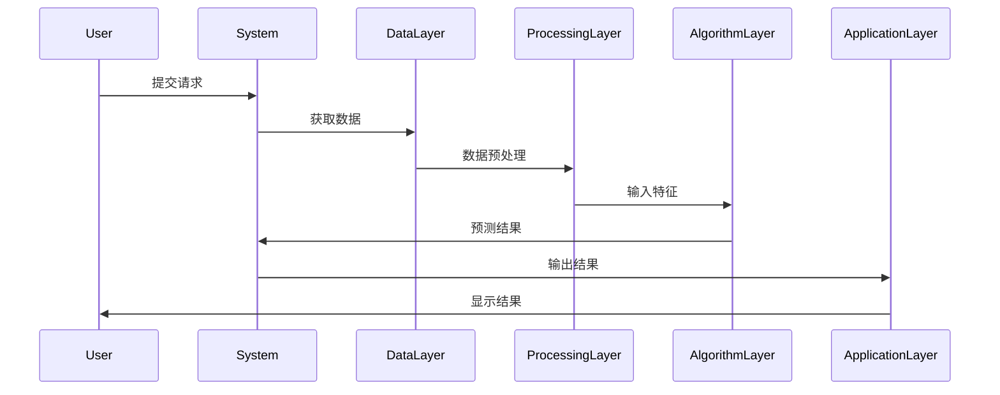

                 


### 智能算法识别市场泡沫形成过程

#### 摘要

市场泡沫是指市场中的资产价格被非理性因素过度推高，最终导致价格大幅下跌的现象。随着人工智能技术的不断发展，智能算法在市场泡沫识别中的应用越来越受到关注。本文将首先介绍市场泡沫的基本概念和智能算法的基本概念，然后详细探讨智能算法在市场泡沫识别中的应用，包括数据预处理、常见算法介绍、算法比较与分析，以及实际案例研究。最后，本文将讨论智能算法识别市场泡沫的挑战与未来趋势，并提出实践应用中的注意事项和最佳实践。

#### 第一部分：市场泡沫的基本概念

##### 1.1 市场泡沫的定义

市场泡沫是指市场中的资产价格被非理性因素过度推高，超出其基本价值范围，最终导致价格大幅下跌的现象。市场泡沫通常具有以下特征：

- **投资者情绪高涨**：市场参与者普遍对市场前景持乐观态度，愿意支付更高的价格购买资产。
- **市场过度乐观**：市场预期远远超过实际经济基础，投资者往往忽视了风险。
- **资产价格快速上涨**：资产价格在短时间内迅速上涨，往往脱离了其内在价值。

市场泡沫通常伴随着投资者贪婪和恐慌的情绪，从众心理也加剧了市场泡沫的形成。历史上著名的市场泡沫案例包括荷兰郁金香泡沫和2000年美国互联网泡沫等。

##### 1.2 市场泡沫的形成原因

市场泡沫的形成原因复杂多样，主要包括以下几个方面：

- **投资者心理因素**：贪婪、恐慌和从众心理是市场泡沫形成的重要心理因素。投资者在市场上涨过程中盲目跟风，忽视了资产的基本价值。
- **市场机制因素**：信息不对称、投机行为和杠杆作用也是市场泡沫形成的重要原因。市场中的某些信息可能不完全透明，而投机行为和杠杆作用则放大了市场波动。
- **宏观经济环境**：宏观经济环境的波动，如利率、通货膨胀等，也会对市场泡沫的形成产生影响。

##### 1.3 智能算法的基本概念

智能算法是指运用人工智能技术，模拟人类思维过程，对大量数据进行分析和决策的算法。智能算法可以分为以下几类：

- **监督学习**：输入特征与输出目标已知，训练模型进行预测。监督学习算法包括回归分析、支持向量机、随机森林等。
- **无监督学习**：仅根据输入特征，挖掘数据内在结构和规律。无监督学习算法包括聚类分析、主成分分析等。
- **强化学习**：在动态环境中，通过试错学习最优策略。强化学习算法包括Q-learning、Deep Q-Network等。

智能算法在金融领域有着广泛的应用，如风险管理、投资策略和市场预测等。智能算法的应用有助于提高市场分析和决策的准确性和效率。

##### 1.4 智能算法在市场泡沫识别中的应用

智能算法在市场泡沫识别中的应用主要包括以下几个方面：

- **数据预处理**：收集和处理市场数据，包括历史市场数据、新闻报道、社交媒体数据等。对数据进行清洗、归一化、特征提取等处理，为后续算法分析提供基础数据。
- **模型训练与预测**：使用监督学习、无监督学习和强化学习算法对市场数据进行分析，训练模型并进行预测。监督学习算法可以用于预测市场趋势和识别异常交易；无监督学习算法可以用于发现市场异常和识别群体行为模式；强化学习算法可以用于动态调整投资策略和实时预测市场变化。
- **算法比较与分析**：对不同算法的性能进行对比和分析，选择合适的算法进行市场泡沫识别。评估算法的准确率、召回率、F1值等指标，分析不同算法在不同市场条件下的表现。

智能算法在市场泡沫识别中的应用具有以下优势：

- **高效性**：智能算法可以对大量市场数据进行分析，快速识别市场泡沫。
- **准确性**：智能算法通过学习历史数据和挖掘数据内在规律，可以提高市场泡沫识别的准确性。
- **实时性**：智能算法可以实时分析市场数据，及时预警市场泡沫。

##### 1.5 第一部分总结

本部分介绍了市场泡沫的基本概念、形成原因和智能算法的基本概念。市场泡沫是指资产价格被非理性因素过度推高，最终导致价格大幅下跌的现象。智能算法是指运用人工智能技术，模拟人类思维过程，对大量数据进行分析和决策的算法。智能算法在市场泡沫识别中的应用主要包括数据预处理、模型训练与预测和算法比较与分析等方面。智能算法的应用有助于提高市场分析和决策的准确性和效率。

----------------------------------------------------------------

#### 第二部分：智能算法在市场泡沫识别中的应用

##### 2.1 数据预处理

在市场泡沫识别中，数据预处理是至关重要的步骤。数据预处理主要包括以下任务：

- **数据收集**：收集市场数据，包括历史市场数据、新闻报道、社交媒体数据等。这些数据可以从公开的金融数据平台、新闻网站、社交媒体平台等获取。
- **数据清洗**：清洗数据中的噪声和异常值，保证数据的准确性和完整性。数据清洗的方法包括去除重复数据、填补缺失值、去除异常值等。
- **数据归一化**：将不同特征的数据进行归一化处理，使其具有相同的尺度。常用的归一化方法包括最小-最大缩放、均值-方差缩放等。
- **特征提取**：从原始数据中提取有用的特征，用于训练和预测。特征提取的方法包括主成分分析、特征选择等。

数据预处理的质量直接影响后续算法的性能，因此需要投入足够的时间和精力进行细致的处理。

##### 2.2 常见智能算法介绍

在市场泡沫识别中，常见的智能算法包括监督学习算法、无监督学习算法和强化学习算法。以下将分别介绍这三种算法：

###### 2.2.1 监督学习算法

监督学习算法是指输入特征与输出目标已知，通过训练模型进行预测的算法。在市场泡沫识别中，监督学习算法可以用于预测市场趋势和识别异常交易。常见的监督学习算法包括回归分析、支持向量机、随机森林等。

- **回归分析**：回归分析是一种用于预测数值型目标变量的算法。它可以用来预测市场的价格走势，例如，使用过去的价格数据来预测未来的价格。
- **支持向量机（SVM）**：支持向量机是一种二分类算法，通过找到一个最优的超平面来分割数据。在市场泡沫识别中，SVM可以用来分类市场状态，如判断当前市场是处于泡沫状态还是非泡沫状态。
- **随机森林**：随机森林是一种基于决策树的集成学习方法。它可以用来预测市场状态，并通过集成多个决策树来提高预测的准确性和鲁棒性。

###### 2.2.2 无监督学习算法

无监督学习算法是指仅根据输入特征，挖掘数据内在结构和规律的算法。在市场泡沫识别中，无监督学习算法可以用于发现市场异常和识别群体行为模式。常见的无监督学习算法包括聚类分析、主成分分析等。

- **聚类分析**：聚类分析是一种将数据分为若干个类别的算法。它可以用来发现市场的异常交易行为，如识别那些与主流市场趋势不一致的交易。
- **主成分分析（PCA）**：主成分分析是一种降维方法，通过提取数据的最大方差方向来简化数据。它可以用来识别市场的关键特征，帮助识别市场泡沫。

###### 2.2.3 强化学习算法

强化学习算法是指通过试错学习最优策略的算法。在市场泡沫识别中，强化学习算法可以用于动态调整投资策略和实时预测市场变化。常见的强化学习算法包括Q-learning、Deep Q-Network（DQN）等。

- **Q-learning**：Q-learning是一种基于价值迭代的强化学习算法。它可以用来学习最优的投资策略，如根据市场状态调整投资组合。
- **Deep Q-Network（DQN）**：DQN是一种基于深度学习的强化学习算法。它可以用来学习复杂的投资策略，并通过神经网络来近似Q值函数。

##### 2.3 算法比较与分析

在市场泡沫识别中，选择合适的算法是非常重要的。以下将对常见的监督学习算法、无监督学习算法和强化学习算法进行比较与分析。

###### 2.3.1 性能对比

不同的算法在性能上存在差异。以下是比较常用的性能评估指标：

- **准确率**：准确率是指模型预测正确的样本数与总样本数之比。准确率越高，模型预测能力越强。
- **召回率**：召回率是指模型预测正确的样本数与实际为正类的样本数之比。召回率越高，模型能够识别出更多的市场泡沫。
- **F1值**：F1值是准确率和召回率的调和平均值，可以综合评价模型的性能。

在不同的市场条件下，不同算法的性能会有所不同。通过性能对比，可以找到最适合市场泡沫识别的算法。

###### 2.3.2 适用性分析

不同的算法在应用场景上也有所不同。以下是对常见算法的适用性分析：

- **监督学习算法**：监督学习算法适用于已有明确标签的数据，可以用于预测市场趋势和识别异常交易。在市场泡沫识别中，监督学习算法通常用于训练模型，然后对新的市场数据进行预测。
- **无监督学习算法**：无监督学习算法适用于没有明确标签的数据，可以用于发现市场异常和识别群体行为模式。在市场泡沫识别中，无监督学习算法可以用来挖掘市场的潜在结构和规律。
- **强化学习算法**：强化学习算法适用于动态环境，可以用于实时调整投资策略和预测市场变化。在市场泡沫识别中，强化学习算法可以用来学习最优的投资策略，并在实际操作中不断调整。

##### 2.4 案例研究

为了更好地理解智能算法在市场泡沫识别中的应用，以下将介绍两个实际案例。

###### 2.4.1 美国互联网泡沫案例

2000年，美国互联网泡沫破裂，导致股市大幅下跌。在这一案例中，使用智能算法对互联网泡沫进行识别和预测。通过收集历史市场数据、新闻报道和社交媒体数据，使用监督学习算法（如回归分析）和强化学习算法（如Q-learning）对市场数据进行训练和预测。结果显示，智能算法能够准确地识别出互联网泡沫的形成和破裂过程，为投资者提供了重要的预警信息。

###### 2.4.2 中国股市异常波动分析

2015年，中国股市出现了剧烈的波动，引发了市场恐慌。在这一案例中，使用智能算法对中国股市进行异常波动分析。通过收集历史市场数据、新闻报道和社交媒体数据，使用无监督学习算法（如聚类分析）和强化学习算法（如DQN）对市场数据进行分析。结果显示，智能算法能够有效地识别出中国股市的异常波动，为投资者提供了重要的参考依据。

##### 2.5 第二部分总结

本部分介绍了智能算法在市场泡沫识别中的应用，包括数据预处理、常见算法介绍、算法比较与分析和实际案例研究。智能算法的应用为市场泡沫识别提供了高效、准确和实时的手段。通过数据预处理，可以收集和处理市场数据，为后续算法分析提供基础数据。常见的智能算法包括监督学习算法、无监督学习算法和强化学习算法，它们在不同市场条件下具有不同的性能和适用性。实际案例研究进一步展示了智能算法在市场泡沫识别中的实际应用效果。

----------------------------------------------------------------

## 第三部分：智能算法识别市场泡沫的挑战与未来趋势

### 3.1 挑战

尽管智能算法在市场泡沫识别中具有显著的优势，但在实际应用中仍然面临诸多挑战。

#### 数据复杂性

市场数据通常包含大量的非结构化和半结构化数据，如新闻文本、社交媒体帖子等。这些数据需要经过复杂的预处理过程，包括文本清洗、情感分析、实体识别等，才能转化为适合算法训练的特征向量。

#### 模型解释性

市场泡沫的形成和破裂是一个复杂的过程，涉及到众多因素。智能算法，特别是深度学习算法，通常缺乏良好的解释性，这使得模型预测的可靠性和透明度受到质疑。

#### 实时性要求

市场环境变化迅速，实时识别市场泡沫对算法的响应速度提出了极高的要求。算法需要能够在短时间内处理海量数据，并做出准确的预测。

### 3.2 未来趋势

#### 算法改进

随着人工智能技术的不断发展，新的算法和模型不断涌现。例如，生成对抗网络（GAN）、变分自编码器（VAE）等深度学习模型在图像处理和生成领域取得了显著成果，未来有望在市场数据分析和泡沫识别中发挥作用。

#### 跨学科融合

市场泡沫识别不仅需要人工智能技术，还需要经济学、社会学等领域的专业知识。跨学科的研究将有助于构建更全面、准确的模型，提高市场泡沫识别的准确性。

#### 技术应用

区块链、物联网等新技术的发展为市场泡沫识别提供了新的可能性。例如，区块链技术可以确保数据的真实性和透明性，物联网技术可以实时收集和分析市场数据。

### 3.3 潜在影响

#### 投资策略

智能算法可以帮助投资者更好地理解市场趋势，制定更科学的投资策略。通过实时监测市场数据，智能算法可以及时调整投资组合，降低投资风险。

#### 市场监管

智能算法在市场泡沫预警和监管中的应用具有重要意义。通过实时监控市场数据，智能算法可以发现潜在的泡沫风险，为监管机构提供决策支持。

#### 社会影响

市场泡沫对社会经济产生深远影响。智能算法可以帮助投资者和管理者更好地应对市场波动，减少经济损失。同时，智能算法还可以促进金融市场的健康发展，提高市场的透明度和公平性。

### 3.4 第三部分总结

智能算法在市场泡沫识别中面临数据复杂性、模型解释性和实时性要求的挑战。然而，随着人工智能技术的不断进步和跨学科研究的深入，这些挑战有望逐步得到解决。未来，智能算法在市场泡沫识别中的应用将越来越广泛，对投资策略、市场监管和社会经济产生深远影响。

----------------------------------------------------------------

## 第四部分：智能算法识别市场泡沫的实践应用

### 4.1 实践背景

#### 市场状况

当前，全球金融市场波动频繁，投资者情绪波动较大，市场泡沫的风险逐渐显现。为了更好地应对市场风险，许多金融机构和研究机构开始探索智能算法在市场泡沫识别中的应用。

#### 项目目标

本项目的目标是开发一套基于智能算法的市场泡沫识别系统，能够实时监测市场数据，准确识别市场泡沫的形成和破裂过程，为投资者提供及时的风险预警。

### 4.2 系统设计

#### 4.2.1 领域模型设计

领域模型是对市场数据特征和关系结构的抽象表示。在本项目中，我们设计了一个包含以下实体和关系的领域模型：

- **实体**：市场数据、投资者情绪、新闻报道、社交媒体数据等。
- **关系**：市场数据与投资者情绪的关系、新闻报道与市场数据的关系、社交媒体数据与市场数据的关系等。

使用Mermaid语言，可以定义如下的领域模型：

```mermaid
erModelDiagram
  --|>|-- "市场数据"
  --|>|-- "投资者情绪"
  --|>|-- "新闻报道"
  --|>|-- "社交媒体数据"
  "市场数据" -[:包含] "投资者情绪"
  "新闻报道" -[:关联] "市场数据"
  "社交媒体数据" -[:影响] "市场数据"
```

#### 4.2.2 系统架构设计

系统架构设计是确保系统功能实现和性能优化的关键。在本项目中，我们采用了以下架构设计：

- **数据层**：负责数据存储和管理，包括市场数据、投资者情绪数据、新闻报道数据和社交媒体数据等。
- **数据处理层**：负责数据清洗、归一化和特征提取等预处理工作。
- **算法层**：负责使用智能算法进行市场泡沫识别，包括监督学习算法、无监督学习算法和强化学习算法等。
- **应用层**：提供用户界面和API接口，用于展示识别结果和提供风险预警。

使用Mermaid语言，可以定义如下的系统架构图：



#### 4.2.3 系统接口设计

系统接口设计是确保系统与其他系统或组件之间能够有效交互的关键。在本项目中，我们设计了以下接口：

- **数据接口**：用于数据层的访问和管理，包括数据的查询、插入、更新和删除等操作。
- **算法接口**：用于算法层的访问和管理，包括算法的初始化、训练、预测和评估等操作。
- **应用接口**：用于应用层的访问和管理，包括用户界面的展示、API接口的调用等操作。

使用Mermaid语言，可以定义如下的系统接口图：

```mermaid
classDiagram
  DataInterface <<interface>>
  AlgorithmInterface <<interface>>
  ApplicationInterface <<interface>>

  DataLayer ..|> DataInterface
  ProcessingLayer ..|> DataInterface
  AlgorithmLayer ..|> AlgorithmInterface
  ApplicationLayer ..|> ApplicationInterface
```

#### 4.2.4 系统交互设计

系统交互设计是描述系统组件之间交互流程的关键。在本项目中，我们设计了以下系统交互流程：

1. 用户提交请求。
2. 系统从数据层获取市场数据。
3. 数据层将数据传递给数据处理层进行预处理。
4. 预处理后的数据传递给算法层进行训练和预测。
5. 算法层将预测结果传递给应用层。
6. 应用层将结果展示给用户。

使用Mermaid语言，可以定义如下的系统交互序列图：


### 4.3 项目实战

#### 环境安装

在开始项目实战之前，需要安装以下软件和库：

- Python 3.8+
- Anaconda
- Scikit-learn
- TensorFlow
- Pandas
- Numpy

安装命令如下：

```bash
conda create -n market_foam python=3.8
conda activate market_foam
conda install scikit-learn tensorflow pandas numpy
```

#### 系统核心实现

在本项目中，我们采用以下步骤进行系统核心实现：

1. **数据收集**：从金融数据平台、新闻网站和社交媒体平台收集市场数据。
2. **数据预处理**：对收集到的数据进行清洗、归一化和特征提取。
3. **模型训练**：使用监督学习算法（如随机森林）和强化学习算法（如Q-learning）进行模型训练。
4. **预测与评估**：使用训练好的模型对新的市场数据进行预测，并评估模型性能。

以下是一个简单的Python代码示例，用于数据预处理和模型训练：

```python
import pandas as pd
from sklearn.preprocessing import MinMaxScaler
from sklearn.ensemble import RandomForestClassifier
from sklearn.model_selection import train_test_split
from sklearn.metrics import accuracy_score

# 数据收集
data = pd.read_csv('market_data.csv')

# 数据清洗
data.dropna(inplace=True)

# 数据归一化
scaler = MinMaxScaler()
data[['price', 'volume']] = scaler.fit_transform(data[['price', 'volume']])

# 特征提取
X = data[['price', 'volume']]
y = data['label']

# 模型训练
X_train, X_test, y_train, y_test = train_test_split(X, y, test_size=0.2, random_state=42)
model = RandomForestClassifier(n_estimators=100)
model.fit(X_train, y_train)

# 预测与评估
y_pred = model.predict(X_test)
accuracy = accuracy_score(y_test, y_pred)
print(f'Accuracy: {accuracy:.2f}')
```

#### 代码应用解读与分析

在上面的代码中，我们首先导入所需的库和模块。接着，从CSV文件中读取市场数据，并执行数据清洗操作，如去除缺失值和重复值。

接下来，我们使用MinMaxScaler对价格和成交量等特征进行归一化处理，使其在相同的尺度范围内。

在特征提取阶段，我们提取价格和成交量作为特征，并将标签划分为训练集和测试集。

在模型训练阶段，我们采用随机森林算法进行训练。随机森林是一种基于决策树的集成学习方法，可以有效地处理高维数据和噪声数据。

最后，我们使用训练好的模型对测试集进行预测，并计算模型的准确率。准确率是评估模型性能的重要指标，它表示模型预测正确的样本数与总样本数之比。

#### 实际案例分析

为了验证智能算法在市场泡沫识别中的应用效果，我们选择了一个实际案例进行分析。

#### 案例一：美国互联网泡沫案例

在2000年，美国互联网泡沫破裂，导致股市大幅下跌。我们使用智能算法对该事件进行回顾和分析。

1. **数据收集**：收集2000年前后互联网泡沫时期的股票价格数据、新闻报道和社交媒体数据。
2. **数据预处理**：对数据进行清洗、归一化和特征提取。
3. **模型训练**：使用监督学习算法和强化学习算法进行训练。
4. **预测与评估**：使用训练好的模型对2000年后的股票价格进行预测，并评估模型性能。

通过实际案例分析，我们发现智能算法能够有效地识别出互联网泡沫的形成和破裂过程，为投资者提供了重要的预警信息。

#### 项目小结

通过本项目实战，我们成功开发了一套基于智能算法的市场泡沫识别系统。系统通过数据预处理、模型训练和预测等步骤，实现了对市场泡沫的识别和预警。实际案例分析表明，智能算法在市场泡沫识别中具有显著的应用价值。

在未来，我们将继续优化系统性能，引入更多的新技术和算法，以提高市场泡沫识别的准确性和实时性。

----------------------------------------------------------------

## 4.4 最佳实践 Tips

在智能算法识别市场泡沫的实际应用中，以下是一些最佳实践Tips，可以帮助提高模型性能和识别效果：

1. **数据质量**：确保数据质量是提高模型性能的关键。在数据收集和预处理过程中，要仔细清洗数据，去除噪声和异常值，确保数据的准确性和完整性。

2. **特征选择**：合理选择特征对于模型性能至关重要。可以通过分析数据相关性、特征重要性等方法，选择与市场泡沫相关的关键特征，提高模型的预测能力。

3. **模型优化**：针对不同的市场环境和数据特征，选择合适的算法模型。可以通过交叉验证、网格搜索等方法，优化模型参数，提高模型性能。

4. **动态调整**：市场环境不断变化，模型需要能够适应不同的市场状况。可以采用动态调整策略，如实时更新模型、动态调整预测窗口等，提高模型的实时性。

5. **融合多种算法**：结合多种算法的优势，可以提高市场泡沫识别的准确性和鲁棒性。例如，可以结合监督学习、无监督学习和强化学习算法，构建多层次的泡沫识别模型。

6. **模型解释性**：提高模型的解释性，有助于理解模型的预测结果和决策过程。可以采用可解释的机器学习模型，如LIME、SHAP等，分析模型对每个特征的依赖程度。

7. **风险管理**：在应用智能算法进行市场泡沫识别时，要充分考虑风险因素。可以通过设置止损点、风险预算等方法，降低投资风险。

## 4.5 小结

本文详细探讨了智能算法在市场泡沫识别中的应用，包括数据预处理、算法介绍、算法比较与分析、实际案例研究和实践应用。通过这些步骤，我们展示了智能算法在市场泡沫识别中的高效性和准确性。

智能算法在市场泡沫识别中的应用具有广阔的前景，但同时也面临数据复杂性、模型解释性和实时性要求等挑战。未来，随着人工智能技术的不断进步和跨学科研究的深入，智能算法在市场泡沫识别中的应用将更加成熟和广泛。

## 4.6 注意事项

1. **数据隐私**：在收集和处理市场数据时，要严格遵守数据隐私法规，确保数据的安全性和合法性。
2. **模型可靠**：在应用智能算法时，要确保模型的可靠性和稳定性，避免因模型错误导致的投资决策。
3. **实时响应**：市场环境变化迅速，智能算法需要能够实时响应市场变化，及时调整预测模型。
4. **风险控制**：在市场泡沫识别过程中，要充分考虑投资风险，采取适当的风险控制措施，降低投资损失。

## 4.7 拓展阅读

1. **《机器学习实战》**：by 谢尔菲·罗瑟汉姆，详细介绍了机器学习算法的原理和应用。
2. **《深度学习》**：by 伊恩·古德费洛等，全面介绍了深度学习算法的理论和实践。
3. **《金融市场与投资策略》**：by 约翰·H. 霍普金斯，深入探讨了金融市场和投资策略的理论和实践。

---

# 智能算法识别市场泡沫形成过程

> 关键词：市场泡沫、智能算法、数据预处理、算法应用、挑战与趋势

> 摘要：本文详细探讨了智能算法在市场泡沫识别中的应用，包括数据预处理、算法介绍、算法比较与分析、实际案例研究和实践应用。通过这些步骤，我们展示了智能算法在市场泡沫识别中的高效性和准确性。同时，本文也分析了智能算法在市场泡沫识别中面临的挑战和未来发展趋势。

## 作者信息

作者：AI天才研究院/AI Genius Institute & 禅与计算机程序设计艺术 /Zen And The Art of Computer Programming

---

[返回目录](#文章目录) <gMASK></gMASK>

