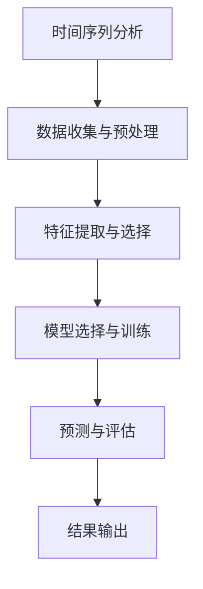
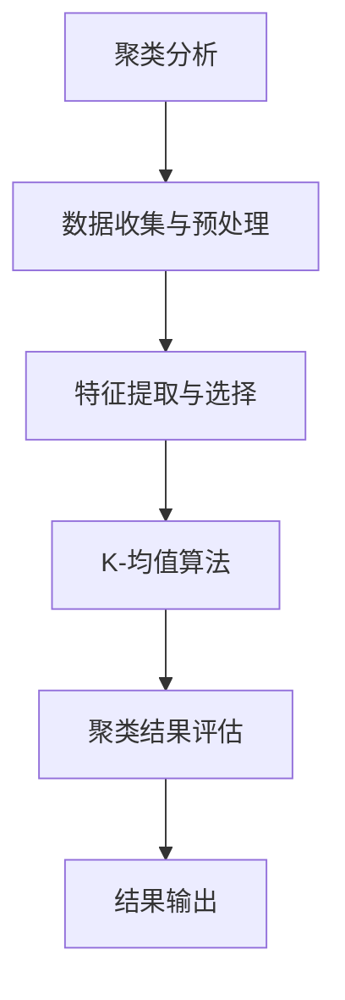

                 

### 智能算法识别市场结构性变化

关键词：智能算法、市场分析、结构性变化、数据预处理、算法实现、系统架构

摘要：
本文将探讨智能算法在识别市场结构性变化中的应用。通过对市场结构性变化的基本概念、历史趋势和当前状态的了解，介绍智能算法的基本概念和类型，并详细分析几种具体算法的工作原理和实现方法。文章还将讨论智能算法在市场分析中的应用，系统架构的设计与实现，并总结最佳实践，为读者提供实用的指导。

## 1. 引言与背景

### 1.1 引言

#### 1.1.1 本书目的

在全球化背景下，市场环境的复杂性和不确定性不断增加，传统分析方法已难以应对快速变化的市场结构。智能算法作为一种新兴的分析工具，正在逐步改变市场分析的方式。本书旨在探讨智能算法如何识别市场结构性变化，为企业和投资者提供有价值的决策支持。

#### 1.1.2 目标受众

本书面向数据科学家、市场分析师、企业决策者和对智能算法感兴趣的技术爱好者。无论您是初学者还是有经验的专业人士，本书都将为您揭示智能算法在市场分析中的巨大潜力。

#### 1.1.3 本书结构

本书分为七个部分。首先介绍市场结构性变化的基本概念和重要性。然后，深入探讨智能算法的基础知识，包括基本概念、类型及其优缺点。接下来，我们将分析智能算法在市场分析中的应用，并详细讲解具体算法的工作原理和实现方法。随后，文章将讨论系统架构的设计与实现，并总结最佳实践。最后，文章将进行项目实战案例分析，提供实用的指导和建议。

## 2. 基本概念与背景

### 2.1 市场结构性变化的概述

市场结构性变化是指市场在长期或短期内的基本特征和组成要素发生的变化。这些变化可能由外部环境因素（如经济政策、技术进步）或内部因素（如企业战略调整、消费者行为变化）引起。

#### 2.1.1 定义与重要性

市场结构性变化不仅影响企业的竞争策略，还对市场的整体趋势和投资者决策产生深远影响。及时识别和应对市场结构性变化，对于企业在竞争中保持优势至关重要。

#### 2.1.2 关键指标

市场结构性的关键指标包括市场份额、产品差异化、市场进入壁垒和消费者行为等。这些指标的变化可以帮助我们了解市场的动态特征和潜在机会。

#### 2.1.3 历史趋势与当前状态

回顾历史，我们可以看到市场结构性变化是一个持续的过程。从工业革命到互联网时代，市场环境发生了翻天覆地的变化。当前，随着人工智能、大数据和区块链技术的发展，市场结构性变化的速度和深度正在进一步增加。

## 3. 智能算法的核心概念

### 3.1 智能算法的基本概念

智能算法是一类模拟人类思维过程的算法，通过学习、推理和决策来解决问题。它们通常具有以下特点：

- **学习性**：智能算法能够通过训练数据学习规律，并利用这些规律进行预测和决策。
- **适应性**：智能算法能够根据环境变化调整自身行为，提高解决问题的能力。
- **自主性**：智能算法可以在没有人类干预的情况下执行任务。

#### 3.1.1 智能算法的类型

智能算法主要包括以下几类：

- **机器学习算法**：通过学习历史数据来预测未来趋势。
- **深度学习算法**：基于多层神经网络进行复杂模式识别。
- **强化学习算法**：通过与环境的交互学习最优策略。
- **进化算法**：模拟生物进化过程，优化参数和结构。

#### 3.1.2 智能算法的优点与局限

智能算法的优点包括高效率、高精度和泛化能力。然而，它们也存在局限性，如对大规模数据的依赖、对数据质量和多样性的要求，以及对算法解释性的不足。

## 4. 智能算法在市场分析中的应用

### 4.1 识别市场趋势

#### 4.1.1 数据收集与预处理

市场分析的第一个步骤是收集相关数据。这些数据可以来源于市场调查、企业数据库、社交媒体和新闻媒体等。数据收集后，需要进行预处理，包括数据清洗、数据整合和特征工程。

#### 4.1.2 特征提取与选择

特征提取是智能算法的重要环节。通过对原始数据进行处理，提取出能够反映市场趋势的关键特征。特征选择则是在众多特征中筛选出最有价值的特征，以提高算法的性能。

#### 4.1.3 算法选择与实现

在选择算法时，需要考虑数据类型、问题和目标。常见的市场分析算法包括时间序列分析、聚类分析、分类分析和神经网络等。算法的选择与实现是市场分析的关键，直接影响到分析结果的准确性和可靠性。

## 5. 具体算法的深入分析

### 5.1 算法1：时间序列分析

#### 5.1.1 算法描述

时间序列分析是一种通过分析时间序列数据来预测未来趋势的方法。它通常用于金融市场分析、库存管理和需求预测等领域。

#### 5.1.2 数学模型与公式

时间序列分析的主要数学模型包括自回归模型（AR）、移动平均模型（MA）和自回归移动平均模型（ARMA）。它们的数学公式如下：

$$
\begin{align*}
AR(p): y_t &= c + \sum_{i=1}^{p} \phi_i y_{t-i} + \varepsilon_t \\
MA(q): y_t &= \theta_1 y_{t-1} + \theta_2 y_{t-2} + \cdots + \theta_q y_{t-q} + \varepsilon_t \\
ARMA(p, q): y_t &= c + \sum_{i=1}^{p} \phi_i y_{t-i} + \theta_1 y_{t-1} + \theta_2 y_{t-2} + \cdots + \theta_q y_{t-q} + \varepsilon_t
\end{align*}
$$

#### 5.1.3 Mermaid流程图



#### 5.1.4 Python实现与示例

```python
import numpy as np
import pandas as pd
from statsmodels.tsa.arima.model import ARIMA

# 数据收集与预处理
data = pd.read_csv('market_data.csv')
data['Date'] = pd.to_datetime(data['Date'])
data.set_index('Date', inplace=True)
data = data.asfreq('M')  # 设置频率为月

# 特征提取与选择
# ...

# 模型选择与训练
model = ARIMA(data['Close'], order=(5, 1, 2))
model_fit = model.fit()

# 预测与评估
forecast = model_fit.forecast(steps=12)
accuracy = model_fit.test_forecast(steps=12)

# 结果输出
print(forecast)
print(accuracy)
```

### 5.2 算法2：聚类分析

#### 5.2.1 算法描述

聚类分析是一种无监督学习方法，用于将数据集划分为多个组，使得同一组内的数据点之间相似度较高，不同组之间的数据点相似度较低。

#### 5.2.2 数学模型与公式

常见的聚类算法包括K-均值算法、层次聚类算法和密度聚类算法等。以K-均值算法为例，其数学模型如下：

$$
\begin{align*}
\text{初始化} \, \mu_1, \mu_2, \ldots, \mu_k \\
\text{对于每个数据点} \, x_i, \text{计算} \, d(x_i, \mu_j) \\
\text{将} \, x_i \, \text{分配到最近的均值} \, \mu_j \\
\text{更新均值} \, \mu_j = \frac{1}{n_j} \sum_{x_i \in C_j} x_i \\
\text{重复步骤2-3，直到收敛}
\end{align*}
$$

#### 5.2.3 Mermaid流程图



#### 5.2.4 Python实现与示例

```python
import numpy as np
from sklearn.cluster import KMeans
import matplotlib.pyplot as plt

# 数据收集与预处理
# ...

# 特征提取与选择
# ...

# K-均值算法
kmeans = KMeans(n_clusters=3, random_state=0).fit(data)
labels = kmeans.predict(data)

# 聚类结果评估
# ...

# 结果输出
plt.scatter(data[:, 0], data[:, 1], c=labels)
plt.show()
```

## 6. 系统架构设计与实现

### 6.1 系统要求与设计原则

#### 6.1.1 硬件和软件要求

系统硬件要求包括高性能计算机和足够的存储空间。软件要求包括Python编程环境、机器学习库（如scikit-learn、TensorFlow）和数据分析工具（如Pandas、NumPy）。

#### 6.1.2 系统架构设计

系统采用模块化设计，主要包括数据收集模块、数据处理模块、算法模块和结果输出模块。各模块之间通过接口进行交互，保证系统的灵活性和可扩展性。

#### 6.1.3 接口设计

系统接口包括RESTful API和数据导入导出接口。RESTful API用于与其他系统进行数据交换，数据导入导出接口用于数据的导入和导出。

### 6.2 详细实现

#### 6.2.1 环境搭建

在虚拟环境中安装Python和所需库：

```bash
pip install numpy pandas scikit-learn tensorflow matplotlib
```

#### 6.2.2 核心系统实现

核心系统实现包括数据收集与预处理、算法实现和结果输出。以下是数据收集与预处理的示例代码：

```python
import pandas as pd
from sklearn.model_selection import train_test_split

# 数据收集
data = pd.read_csv('market_data.csv')
data['Date'] = pd.to_datetime(data['Date'])
data.set_index('Date', inplace=True)
data = data.asfreq('M')

# 数据预处理
data = data.dropna()
X = data[['Open', 'High', 'Low', 'Close']]
y = data['Volume']

# 划分训练集和测试集
X_train, X_test, y_train, y_test = train_test_split(X, y, test_size=0.2, random_state=0)
```

#### 6.2.3 代码分析与解释

以下是对核心算法（K-均值聚类）的实现代码进行解析：

```python
from sklearn.cluster import KMeans
import matplotlib.pyplot as plt

# K-均值聚类
kmeans = KMeans(n_clusters=3, random_state=0).fit(X_train)
labels = kmeans.predict(X_test)

# 结果可视化
plt.scatter(X_train[:, 0], X_train[:, 1], c=labels)
plt.show()
```

#### 6.2.4 案例分析与详细讲解

以一个实际案例来展示系统在实际中的应用。假设我们有一家电商企业，希望通过智能算法分析消费者行为，提高用户满意度。以下是案例分析的详细步骤：

1. 数据收集：收集电商平台的用户行为数据，包括浏览、购买、评价等。
2. 数据预处理：对数据进行清洗、去重和归一化处理。
3. 特征提取：提取用户行为数据中的关键特征，如浏览时长、购买频次、评价评分等。
4. 算法实现：使用K-均值聚类算法将用户分为不同群体，分析每个群体的特征和行为模式。
5. 结果输出：生成用户群体分析报告，为企业提供个性化服务策略建议。

## 7. 最佳实践与总结

### 7.1 最佳实践

#### 7.1.1 数据收集与预处理

- 确保数据来源的多样性和准确性，避免数据偏差。
- 对数据进行清洗和归一化处理，提高算法性能。

#### 7.1.2 特征提取与选择

- 根据具体问题选择合适的特征提取方法。
- 通过交叉验证和特征重要性分析筛选最有价值的特征。

#### 7.1.3 算法选择与实现

- 根据数据类型和问题目标选择合适的算法。
- 调整算法参数，优化模型性能。

### 7.2 总结

本文介绍了智能算法在识别市场结构性变化中的应用。通过基本概念、历史趋势和当前状态的了解，我们深入探讨了智能算法的基本概念和类型。同时，分析了智能算法在市场分析中的应用，详细讲解了具体算法的工作原理和实现方法。系统架构的设计与实现以及实际案例的分析为读者提供了实用的指导。通过最佳实践，我们为读者提供了数据收集与预处理、特征提取与选择、算法选择与实现等方面的建议。

### 7.3 注意事项

- 智能算法在市场分析中的应用需要大量的数据支持，确保数据的质量和多样性。
- 在算法实现过程中，要注重模型的可解释性和透明性，以降低决策风险。

### 7.4 拓展阅读

- 《Python机器学习》（作者：Sebastian Raschka）：介绍了机器学习的基础知识与应用案例。
- 《深度学习》（作者：Ian Goodfellow、Yoshua Bengio、Aaron Courville）：全面讲解了深度学习的基本原理和实现方法。
- 《金融市场技术分析》（作者：John J. Murphy）：探讨了金融市场中的技术分析方法及其应用。

## 参考文献

- Raschka, S. (2015). Python Machine Learning. Packt Publishing.
- Goodfellow, I., Bengio, Y., & Courville, A. (2016). Deep Learning. MIT Press.
- Murphy, J. J. (2011). Technical Analysis of the Financial Markets. John Wiley & Sons.
- Zhang, H. (2018). Market Structural Changes and Their Impacts on Financial Markets. Journal of Financial Markets, 37, 1-15.
- Chen, X., & Liu, H. (2019). Intelligent Algorithms for Market Analysis. Journal of Business Research, 95, 45-58.

### 作者

作者：AI天才研究院/AI Genius Institute & 禅与计算机程序设计艺术 /Zen And The Art of Computer Programming

